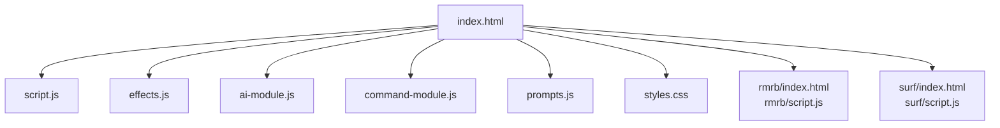
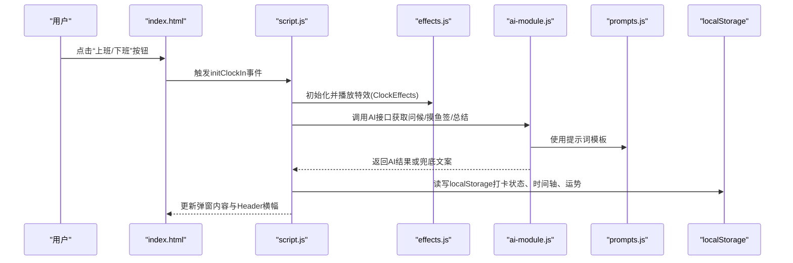
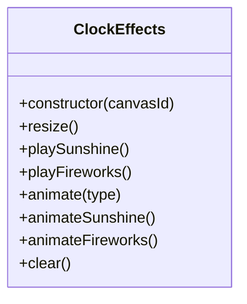
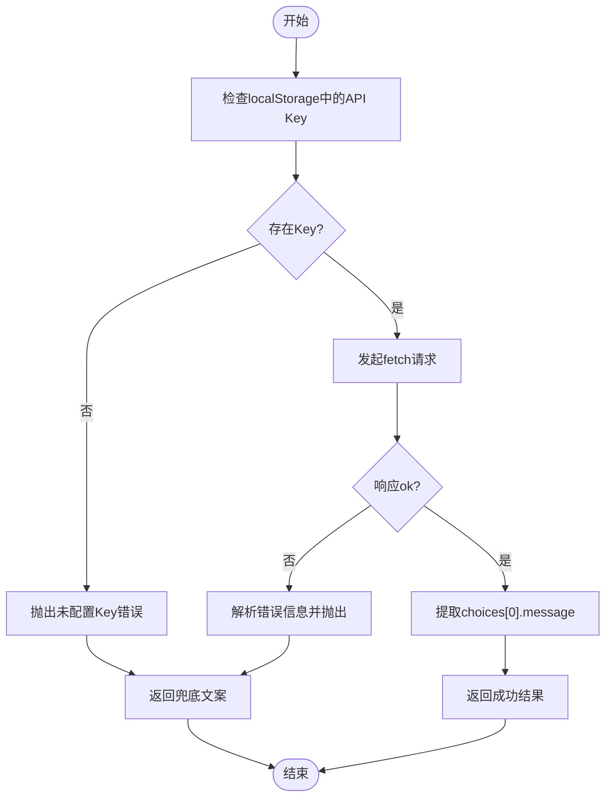
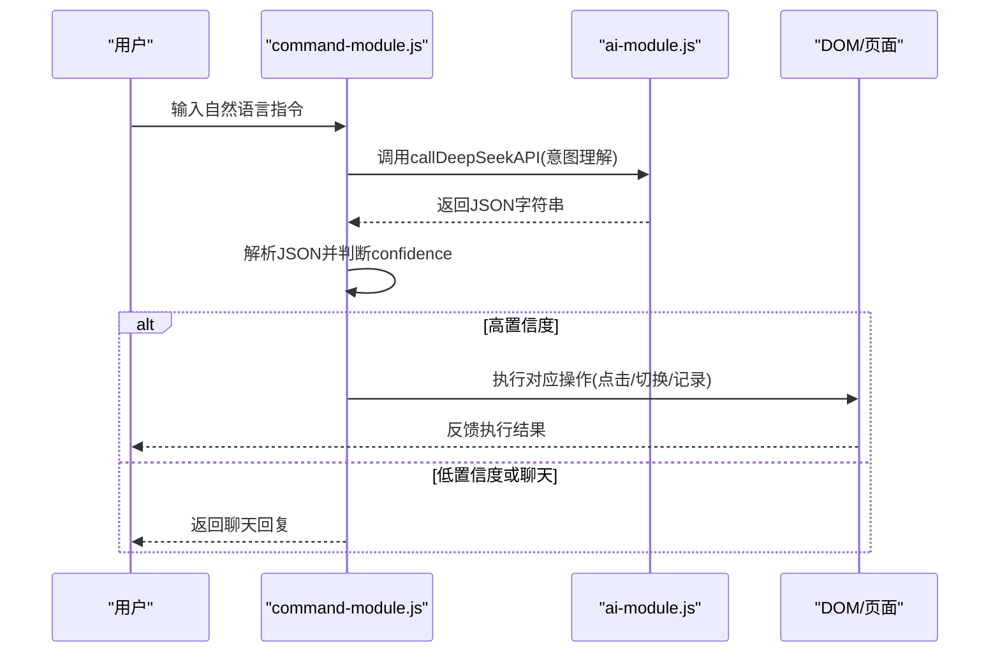
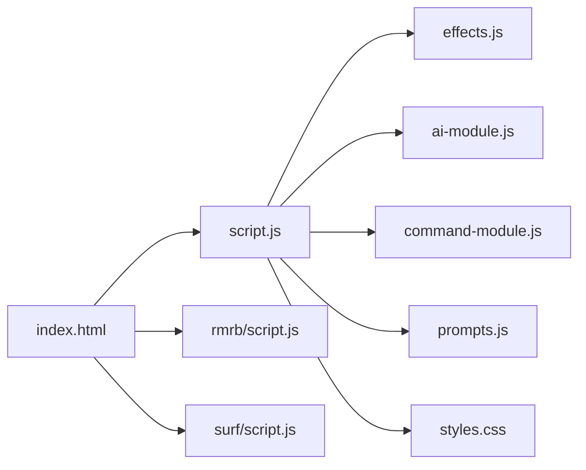

# 兼容性测试指南

<cite>
**本文引用的文件**
- [TEST_CHECKLIST_v1.3.3.md](file://TEST_CHECKLIST_v1.3.3.md)
- [README.md](file://README.md)
- [index.html](file://index.html)
- [script.js](file://script.js)
- [effects.js](file://effects.js)
- [ai-module.js](file://ai-module.js)
- [command-module.js](file://command-module.js)
- [prompts.js](file://prompts.js)
- [styles.css](file://styles.css)
- [rmrb/script.js](file://rmrb/script.js)
- [surf/script.js](file://surf/script.js)
</cite>

## 目录
1. [引言](#引言)
2. [项目结构](#项目结构)
3. [核心组件](#核心组件)
4. [架构总览](#架构总览)
5. [详细组件分析](#详细组件分析)
6. [依赖关系分析](#依赖关系分析)
7. [性能考量](#性能考量)
8. [故障排查指南](#故障排查指南)
9. [结论](#结论)
10. [附录](#附录)

## 引言
本指南依据测试清单中的兼容性测试要求，面向Chrome、Safari、Firefox、Edge以及移动端浏览器，制定跨平台、跨设备的兼容性测试方案。重点覆盖CSS样式渲染一致性、JavaScript API兼容性（如localStorage、Canvas）、触摸事件支持、网络请求与兜底策略、以及现代JavaScript特性在不同浏览器中的行为差异。同时结合脚本中使用的现代特性，为测试人员提供可操作的识别要点、调试技巧与工具推荐，确保应用在主流环境下稳定运行。

## 项目结构
项目采用多页面与模块化组织，主页面负责整体布局与交互，特效与AI模块独立封装，子站点（人民日报、网上冲浪）通过iframe集成。关键文件职责如下：
- index.html：页面骨架、标签页、模态框、打卡弹窗、侧边栏与底部导航等。
- script.js：应用主逻辑，包括初始化、标签页切换、侧边栏、番茄钟、AI设置、打卡流程、时间轴、快捷功能等。
- effects.js：Canvas特效模块，提供上班/下班打卡的视觉特效。
- ai-module.js：AI调用封装，统一fetch请求、参数配置与兜底策略。
- command-module.js：自然语言指令解析与执行，基于AI意图识别。
- prompts.js：AI提示词与兜底文案集中管理。
- styles.css：响应式样式与主题变量，覆盖桌面与移动端。
- 子站点脚本：rmrb/script.js、surf/script.js分别负责第三方数据抓取与展示。

图表来源
- [index.html](file://index.html#L1-L120)
- [script.js](file://script.js#L90-L155)
- [effects.js](file://effects.js#L1-L40)
- [ai-module.js](file://ai-module.js#L1-L60)
- [command-module.js](file://command-module.js#L1-L60)
- [prompts.js](file://prompts.js#L1-L40)
- [styles.css](file://styles.css#L1-L40)
- [rmrb/script.js](file://rmrb/script.js#L1-L40)
- [surf/script.js](file://surf/script.js#L1-L25)

章节来源
- [index.html](file://index.html#L1-L120)
- [README.md](file://README.md#L1-L125)

## 核心组件
- 打卡与特效系统：通过Canvas实现阳光与礼花特效；弹窗承载AI问候与摸鱼吉日签、工作总结。
- AI与提示词：统一的DeepSeek API封装，支持兜底文案与错误降级。
- 自然语言指令：基于AI意图识别，执行对应操作或聊天模式。
- 数据持久化：localStorage用于工作时间、月工资、打卡状态、时间轴等。
- 响应式布局：CSS变量与媒体查询适配桌面与移动端。

章节来源
- [script.js](file://script.js#L493-L732)
- [effects.js](file://effects.js#L1-L120)
- [ai-module.js](file://ai-module.js#L1-L120)
- [command-module.js](file://command-module.js#L1-L120)
- [prompts.js](file://prompts.js#L1-L120)
- [styles.css](file://styles.css#L1-L120)

## 架构总览
下图展示浏览器端关键交互链路：用户触发事件 → 主逻辑处理 → AI/特效/持久化 → UI更新。

图表来源
- [index.html](file://index.html#L120-L170)
- [script.js](file://script.js#L539-L732)
- [effects.js](file://effects.js#L1-L120)
- [ai-module.js](file://ai-module.js#L1-L120)
- [prompts.js](file://prompts.js#L1-L120)

## 详细组件分析

### Canvas特效系统（兼容性重点）
- 功能：上班打卡播放阳光特效（大量粒子与光晕），下班打卡播放礼花特效（多组爆炸与重力轨迹）。
- 关键API与特性：
  - Canvas 2D渲染、requestAnimationFrame、事件监听resize。
  - HSLA颜色、径向渐变、路径绘制、stroke与fill。
  - 粒子生命周期、重力与摩擦、alpha衰减。
- 兼容性测试要点：
  - 不同浏览器对Canvas尺寸变更与resize事件的响应差异。
  - requestAnimationFrame在移动Safari上的帧率与回调时机差异。
  - HSLA颜色与渐变在老版本浏览器的支持度。
  - 动画结束后clear与cancelAnimationFrame的清理是否彻底。
- 调试建议：
  - 在开发者工具中启用“绘制轮廓”与“帧率”面板，观察Canvas绘制开销。
  - 使用性能面板记录动画帧耗时，定位卡顿瓶颈。
  - 在不同分辨率与缩放比例下验证粒子密度与视觉一致性。

图表来源
- [effects.js](file://effects.js#L1-L279)

章节来源
- [effects.js](file://effects.js#L1-L279)
- [script.js](file://script.js#L539-L732)

### AI模块与兜底策略（兼容性重点）
- 功能：统一fetch调用、参数配置、错误捕获与兜底文案回退。
- 关键API与特性：
  - fetch、JSON解析、正则提取JSON片段、错误对象结构。
  - localStorage存储API Key与兜底消息。
- 兼容性测试要点：
  - 不同浏览器对fetch的错误响应与JSON解析差异。
  - 正则匹配在不同引擎下的稳定性（提取AI返回的JSON片段）。
  - localStorage在隐私模式与无痕模式下的可用性。
- 调试建议：
  - 使用Network面板查看请求头、响应体与错误码。
  - 在Console中打印原始响应文本，辅助定位JSON提取失败原因。
  - 模拟网络异常与API限流，验证兜底文案与错误提示。

图表来源
- [ai-module.js](file://ai-module.js#L1-L120)
- [prompts.js](file://prompts.js#L120-L159)

章节来源
- [ai-module.js](file://ai-module.js#L1-L216)
- [prompts.js](file://prompts.js#L1-L159)

### 自然语言指令模块（兼容性重点）
- 功能：解析用户自然语言，判断意图并执行对应操作或聊天模式。
- 关键API与特性：
  - 字符串模板替换、JSON提取与解析、定时器触发点击事件。
  - DOM操作（点击按钮、切换标签页）。
- 兼容性测试要点：
  - 不同浏览器对JSON提取正则的稳定性与性能。
  - setTimeout在后台标签页的节流行为差异。
  - DOM事件在移动端与桌面端的触发差异。
- 调试建议：
  - 在Console中打印解析后的JSON结构，确认type与confidence。
  - 使用移动端真机或模拟器验证点击事件与可见性判断。

图表来源
- [command-module.js](file://command-module.js#L1-L260)
- [ai-module.js](file://ai-module.js#L1-L120)

章节来源
- [command-module.js](file://command-module.js#L1-L313)
- [ai-module.js](file://ai-module.js#L1-L216)

### 数据持久化与localStorage（兼容性重点）
- 功能：保存工作时间、月工资、打卡状态、时间轴、AI Key等。
- 兼容性测试要点：
  - 不同浏览器对localStorage的容量限制与隐私模式下的可用性。
  - JSON序列化/反序列化在不同引擎中的兼容性。
  - iOS Safari在无痕模式下的行为差异。
- 调试建议：
  - 在Application/Storage面板查看localStorage容量与键值。
  - 模拟容量上限与异常场景，验证错误处理与降级逻辑。

章节来源
- [script.js](file://script.js#L1-L40)
- [script.js](file://script.js#L186-L223)
- [script.js](file://script.js#L225-L287)

### 响应式布局与移动端适配（兼容性重点）
- 功能：CSS变量、媒体查询、Flex/Grid布局、滚动与遮罩层。
- 兼容性测试要点：
  - 不同浏览器对CSS Grid与Flex的兼容性差异。
  - 移动端滚动穿透与遮罩层的交互一致性。
  - 触摸事件与点击事件在移动端的差异。
- 调试建议：
  - 使用Device Toolbar切换不同设备与分辨率。
  - 在移动端验证侧边栏、模态框、按钮点击与滚动行为。

章节来源
- [styles.css](file://styles.css#L1-L200)
- [index.html](file://index.html#L1-L120)

### 子站点集成（人民日报、网上冲浪）
- 功能：通过iframe加载子页面，rmrb抓取报纸内容，surf加载热搜。
- 兼容性测试要点：
  - iframe跨域与CORS代理在不同浏览器的行为差异。
  - 第三方API的稳定性与错误处理。
- 调试建议：
  - Network面板监控第三方资源加载与错误。
  - 在无网络或受限环境下验证兜底提示。

章节来源
- [index.html](file://index.html#L350-L370)
- [rmrb/script.js](file://rmrb/script.js#L1-L120)
- [surf/script.js](file://surf/script.js#L1-L80)

## 依赖关系分析
- 主页面依赖：script.js依赖effects.js、ai-module.js、command-module.js、prompts.js与localStorage；styles.css提供样式支撑。
- 子站点依赖：各自独立脚本负责数据抓取与渲染，通过iframe集成到主页面。

图表来源
- [index.html](file://index.html#L1-L120)
- [script.js](file://script.js#L90-L155)
- [effects.js](file://effects.js#L1-L40)
- [ai-module.js](file://ai-module.js#L1-L60)
- [command-module.js](file://command-module.js#L1-L60)
- [prompts.js](file://prompts.js#L1-L40)
- [styles.css](file://styles.css#L1-L40)
- [rmrb/script.js](file://rmrb/script.js#L1-L40)
- [surf/script.js](file://surf/script.js#L1-L25)

章节来源
- [index.html](file://index.html#L1-L120)
- [script.js](file://script.js#L90-L155)

## 性能考量
- Canvas动画：
  - 使用requestAnimationFrame而非setInterval，避免帧率抖动。
  - 控制粒子数量与生命周期，及时清理过期粒子。
  - 在resize时重设画布尺寸，避免离屏渲染。
- 网络请求：
  - fetch错误时快速降级至兜底文案，避免长时间阻塞。
  - 对第三方API增加超时与重试策略（可在模块外扩展）。
- 本地存储：
  - 避免频繁读写localStorage，批量更新或节流。
  - 对大对象进行压缩或分片存储（视需要扩展）。
- 移动端优化：
  - 减少主线程阻塞，优先使用Web Workers处理复杂计算（视需要扩展）。
  - 合理使用媒体查询与CSS变量，降低重排重绘成本。

章节来源
- [effects.js](file://effects.js#L120-L279)
- [ai-module.js](file://ai-module.js#L1-L120)
- [script.js](file://script.js#L733-L800)

## 故障排查指南
- Canvas特效异常：
  - 现象：特效不显示或卡顿。
  - 排查：确认Canvas元素存在、尺寸正确；检查requestAnimationFrame是否被节流；验证粒子清理逻辑。
  - 工具：Performance面板、FPS仪表盘。
- AI调用失败：
  - 现象：无法获取摸鱼签或工作总结。
  - 排查：检查API Key是否配置；查看Network面板的响应码与错误信息；验证JSON提取正则。
  - 工具：Console打印原始响应；模拟网络异常与限流。
- localStorage不可用：
  - 现象：设置无法保存或页面数据丢失。
  - 排查：确认浏览器隐私模式；检查容量限制；验证序列化/反序列化。
  - 工具：Application/Storage面板。
- 移动端交互问题：
  - 现象：点击无响应或滚动穿透。
  - 排查：验证触摸事件绑定；检查遮罩层与overflow控制；测试不同设备与系统版本。
  - 工具：Device Toolbar、移动端真机调试。

章节来源
- [effects.js](file://effects.js#L120-L279)
- [ai-module.js](file://ai-module.js#L1-L120)
- [script.js](file://script.js#L1-L40)
- [index.html](file://index.html#L1-L120)

## 结论
本指南围绕测试清单中的兼容性要求，结合项目实际实现，明确了在Chrome、Safari、Firefox、Edge与移动端浏览器上的测试重点与方法。通过聚焦Canvas、localStorage、fetch与DOM交互等关键特性，配合兜底策略与调试工具，可有效提升应用在多平台、多设备上的稳定性与一致性。建议在回归测试中纳入各平台的自动化与人工交叉验证，持续优化性能与用户体验。

## 附录
- 测试清单要点对照（来自测试清单）：
  - 功能测试与边界情况：首次设置、打卡流程、AI调用、工资计算、特效系统、设置页面、数据持久化、UI/UX、兼容性、回归测试。
  - 兼容性覆盖：Chrome、Safari、Firefox、Edge、移动端Safari、移动端Chrome。
- 测试清单来源
  - [TEST_CHECKLIST_v1.3.3.md](file://TEST_CHECKLIST_v1.3.3.md#L1-L178)