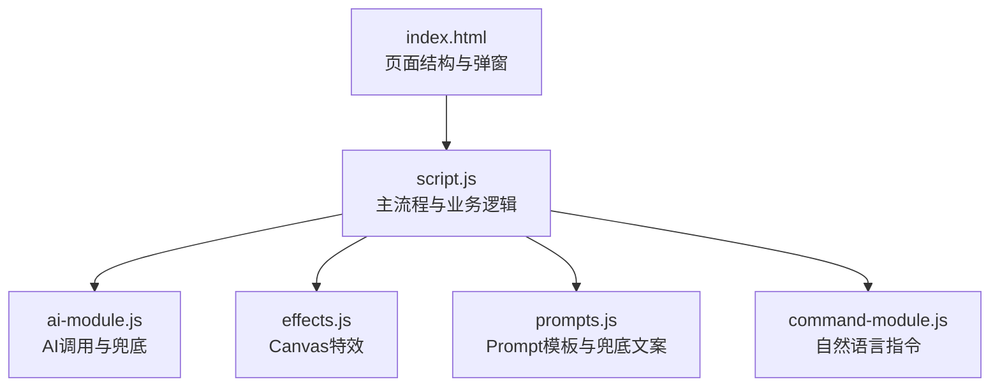
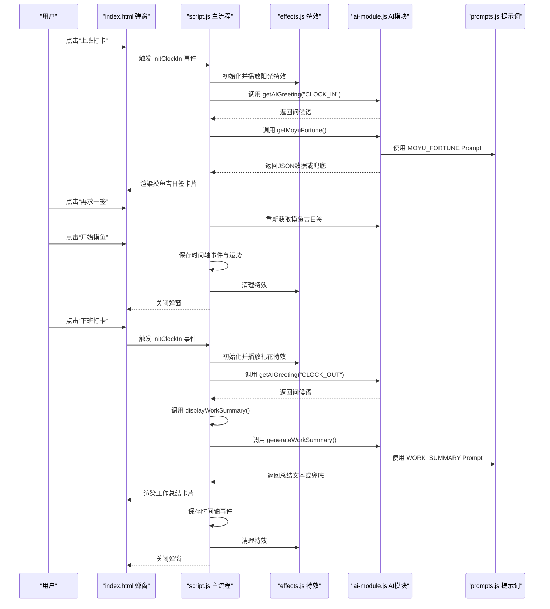
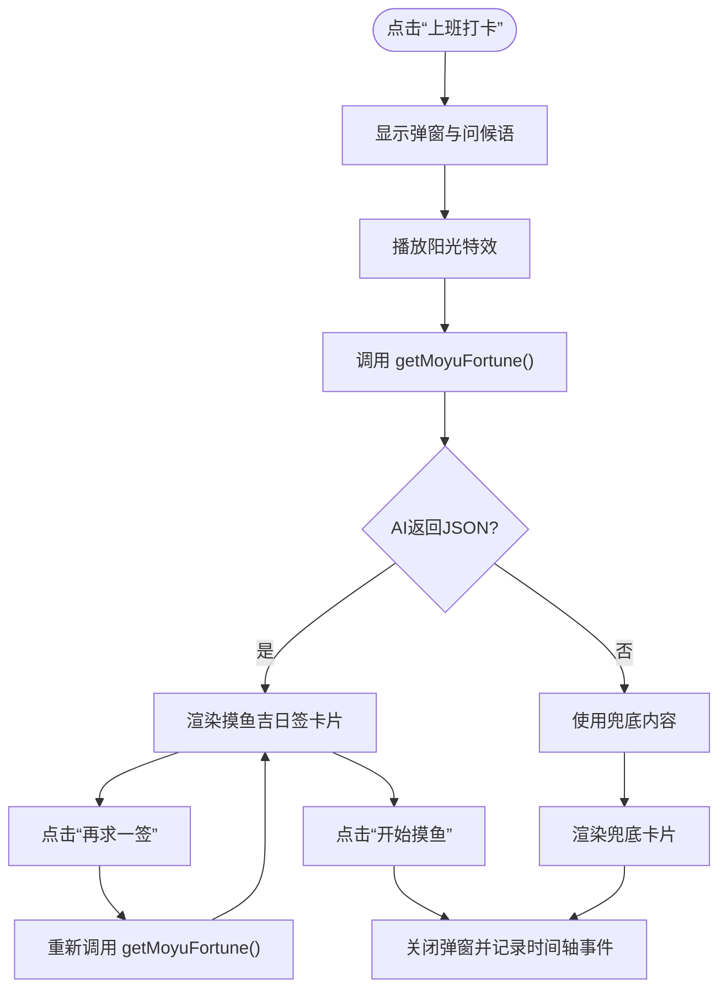
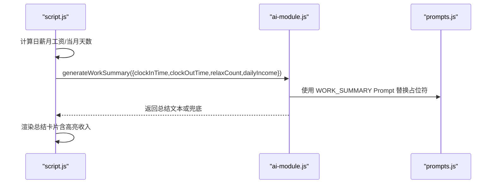
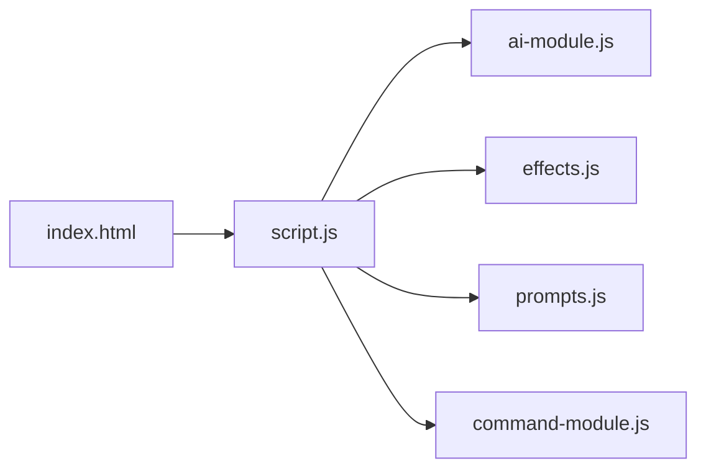

# 功能测试指南

<cite>
**本文引用的文件**
- [TEST_CHECKLIST_v1.3.3.md](file://TEST_CHECKLIST_v1.3.3.md)
- [script.js](file://script.js)
- [ai-module.js](file://ai-module.js)
- [command-module.js](file://command-module.js)
- [effects.js](file://effects.js)
- [prompts.js](file://prompts.js)
- [index.html](file://index.html)
- [README.md](file://README.md)
</cite>

## 目录
1. [引言](#引言)
2. [项目结构](#项目结构)
3. [核心组件](#核心组件)
4. [架构总览](#架构总览)
5. [详细组件分析](#详细组件分析)
6. [依赖关系分析](#依赖关系分析)
7. [性能考量](#性能考量)
8. [故障排查指南](#故障排查指南)
9. [结论](#结论)
10. [附录](#附录)

## 引言
本指南基于 TEST_CHECKLIST_v1.3.3.md 中的功能测试条目，围绕“首次设置流程”“摸鱼吉日签生成”“工资计算与工作总结展示”等核心功能，结合 script.js 中的逻辑实现，提供可落地的测试方法与用例设计思路。同时解释如何验证 AI 调用成功与失败时的兜底内容显示，确保用户体验的完整性；并指导开发者通过 localStorage 模拟不同用户状态进行测试。

## 项目结构
- 前端入口与页面结构：index.html 定义了打卡弹窗、设置弹窗、时间轴、标签页等 UI 结构。
- 主逻辑脚本：script.js 负责初始化、打卡流程、AI 调用、特效播放、工资计算、工作总结展示等。
- AI 模块：ai-module.js 封装 DeepSeek API 调用、摸鱼吉日签与工作总结生成、兜底策略。
- 指令模块：command-module.js 实现自然语言指令理解与执行。
- 特效模块：effects.js 提供 Canvas 阳光与礼花特效。
- 提示词与兜底文案：prompts.js 定义 Prompt 模板与兜底消息。
- 产品说明：README.md 提供功能概览与版本说明。

图表来源
- [index.html](file://index.html#L1-L200)
- [script.js](file://script.js#L1-L200)
- [ai-module.js](file://ai-module.js#L1-L120)
- [effects.js](file://effects.js#L1-L120)
- [prompts.js](file://prompts.js#L1-L120)
- [command-module.js](file://command-module.js#L1-L120)

章节来源
- [index.html](file://index.html#L1-L200)
- [README.md](file://README.md#L1-L125)

## 核心组件
- 首次设置流程：负责引导用户输入上下班时间、月工资、发薪日类型与日期，并写入 localStorage。
- 摸鱼吉日签系统：上班打卡时生成运势、最佳摸鱼时间与锦囊，支持“再求一签”与“开始摸鱼”。
- 工资计算与工作总结：按月工资与当月天数计算日薪，下班打卡时生成幽默总结并展示关键指标。
- AI 调用与兜底：统一通过 AIModule 调用 DeepSeek API，失败时回退至兜底文案。
- 特效系统：上班打卡播放阳光特效，下班打卡播放礼花特效，使用 Canvas 和 requestAnimationFrame。
- 自然语言指令：通过命令模块解析用户意图并执行对应操作。

章节来源
- [script.js](file://script.js#L162-L223)
- [script.js](file://script.js#L493-L732)
- [script.js](file://script.js#L3063-L3150)
- [ai-module.js](file://ai-module.js#L1-L120)
- [effects.js](file://effects.js#L1-L120)
- [command-module.js](file://command-module.js#L1-L120)

## 架构总览
下面的序列图展示了“上班打卡—生成摸鱼吉日签—播放特效—保存运势”的完整流程，以及“下班打卡—播放特效—生成工作总结”的流程。

图表来源
- [script.js](file://script.js#L493-L732)
- [effects.js](file://effects.js#L1-L120)
- [ai-module.js](file://ai-module.js#L61-L167)
- [prompts.js](file://prompts.js#L1-L120)

## 详细组件分析

### 首次设置流程测试
- 测试目标
  - 首次访问显示设置弹窗
  - 可设置工作时间（上班、午休开始、午休结束、下班）、月工资、发薪日类型与日期
  - 保存后正确写入 localStorage 并初始化应用
- 测试步骤
  - 清空 localStorage 或首次访问，确认弹窗出现
  - 输入合法时间与月工资，点击保存
  - 校验 localStorage 中 workStartTime/lunchStartTime/lunchEndTime/workEndTime/monthlySalary/salaryType/salaryDay 是否存在
  - 刷新页面，确认不再弹窗并进入初始化流程
- 边界与异常
  - 未填写月工资时使用默认值
  - 时间顺序校验（如上班时间应在午休开始之前）

章节来源
- [script.js](file://script.js#L162-L223)
- [index.html](file://index.html#L186-L223)

### 摸鱼吉日签生成测试
- 测试目标
  - 上班打卡弹窗显示问候语与加载状态
  - 成功生成摸鱼吉日签卡片（运势、最佳时间、锦囊）
  - “再求一签”按钮可重新生成并更新 Header 横幅
  - “开始摸鱼”按钮关闭弹窗并记录时间轴事件
- 测试步骤
  - 点击“上班打卡”，确认弹窗与问候语
  - 等待生成完成，核对卡片字段齐全
  - 点击“再求一签”，确认按钮状态与重新渲染
  - 点击“开始摸鱼”，确认弹窗关闭与时间轴事件记录
  - 刷新页面，确认 Header 横幅仍显示当日运势
- AI 调用与兜底
  - 验证 getMoyuFortune 返回 JSON 或兜底对象
  - 若 AI 失败，确认错误提示与兜底内容完整（包含 fortune、bestTime、tips）

图表来源
- [script.js](file://script.js#L547-L732)
- [ai-module.js](file://ai-module.js#L95-L127)
- [effects.js](file://effects.js#L1-L120)

章节来源
- [script.js](file://script.js#L547-L732)
- [ai-module.js](file://ai-module.js#L95-L127)
- [prompts.js](file://prompts.js#L1-L48)

### 工资计算与工作总结展示测试
- 测试目标
  - 按月工资与当月天数计算日薪
  - 下班打卡时生成幽默总结，包含上班时间、下班时间、摸鱼次数、今日收入
  - 收入高亮显示，语言风趣幽默
- 测试步骤
  - 设置月工资为 8000，验证日薪计算（12 月 31 天、2 月 28/29 天）
  - 修改月工资，验证日薪随之更新
  - 下班打卡，等待总结生成，核对字段齐全
  - 验证“今日收入”高亮显示
- AI 调用与兜底
  - 验证 generateWorkSummary 替换占位符并调用 AI
  - 若 AI 失败，确认兜底文案显示

图表来源
- [script.js](file://script.js#L3063-L3150)
- [ai-module.js](file://ai-module.js#L129-L167)
- [prompts.js](file://prompts.js#L27-L48)

章节来源
- [script.js](file://script.js#L3063-L3150)
- [ai-module.js](file://ai-module.js#L129-L167)
- [prompts.js](file://prompts.js#L27-L48)

### 特效系统测试
- 阳光特效（上班打卡）
  - 弹窗显示时自动播放，50 个光点飘落，带光晕效果，动画流畅
  - 关闭弹窗时特效自动清除
- 礼花特效（下班打卡）
  - 弹窗显示时自动播放，3 组彩色粒子爆炸，带重力效果，颜色随机
  - 关闭弹窗时特效自动清除
- 性能
  - Canvas 初始化正确
  - 使用 requestAnimationFrame，过期粒子自动清理，内存占用正常

章节来源
- [effects.js](file://effects.js#L1-L279)
- [script.js](file://script.js#L547-L732)

### 设置页面测试
- 设置页面显示月工资输入框，显示当前保存值
- 修改月工资后点击保存，localStorage 正确更新 monthlySalary
- 下次打开设置页面显示新值

章节来源
- [index.html](file://index.html#L360-L395)
- [script.js](file://script.js#L133-L155)

### 数据持久化测试
- localStorage 存储 monthlySalary
- localStorage 按日期存储 moyuFortune_[date]
- 刷新页面后数据不丢失
- 新的一天自动清除上一天的运势（Header 横幅应为空或重新生成）

章节来源
- [script.js](file://script.js#L780-L800)
- [script.js](file://script.js#L186-L223)

### UI/UX 测试
- 摸鱼吉日签样式：黄色渐变背景、金色边框、分区清晰、按钮样式、响应式布局
- 工作总结样式：蓝色渐变背景、2x2 数据网格、今日收入高亮、大字号数字、响应式布局
- 打卡弹窗：Canvas 全屏覆盖、特效不遮挡内容、10 秒倒计时、点击关闭按钮/外部区域关闭

章节来源
- [index.html](file://index.html#L123-L163)
- [README.md](file://README.md#L32-L71)

### 兼容性测试
- Chrome、Safari、Firefox、Edge、移动端 Safari、移动端 Chrome 均可正常运行

章节来源
- [TEST_CHECKLIST_v1.3.3.md](file://TEST_CHECKLIST_v1.3.3.md#L120-L127)

### 边界情况测试
- 当天未设置月工资时使用默认值 8000
- 当天未打上班卡时，下班打卡显示“未知”
- 没有摸鱼记录时，摸鱼次数显示 0
- AI 调用超时或失败时显示兜底内容
- 网络断开时功能降级正常

章节来源
- [script.js](file://script.js#L3093-L3110)
- [ai-module.js](file://ai-module.js#L129-L167)

## 依赖关系分析
- script.js 依赖
  - ai-module.js：AI 调用与兜底
  - effects.js：特效播放与清理
  - prompts.js：Prompt 模板与兜底文案
  - command-module.js：自然语言指令解析与执行
- index.html 作为 UI 宿主，承载弹窗、模态框与标签页结构

图表来源
- [script.js](file://script.js#L1-L200)
- [ai-module.js](file://ai-module.js#L1-L120)
- [effects.js](file://effects.js#L1-L120)
- [prompts.js](file://prompts.js#L1-L120)
- [command-module.js](file://command-module.js#L1-L120)
- [index.html](file://index.html#L1-L120)

章节来源
- [script.js](file://script.js#L1-L200)
- [index.html](file://index.html#L1-L120)

## 性能考量
- Canvas 动画使用 requestAnimationFrame，避免 setInterval
- 特效粒子过期自动清理，防止内存泄漏
- 通过最小必要 DOM 更新（仅更新 summary-content）降低重排重绘
- AI 调用采用异步，避免阻塞主线程

章节来源
- [effects.js](file://effects.js#L135-L279)
- [script.js](file://script.js#L3080-L3150)

## 故障排查指南
- AI 未配置 API 密钥
  - 现象：调用 DeepSeek API 抛错
  - 处理：在设置页面保存 API Key，或在测试中临时写入 localStorage
- AI 返回非 JSON
  - 现象：getMoyuFortune 解析失败
  - 处理：触发兜底，确保兜底对象包含 fortune、bestTime、tips
- 下班打卡总结为空
  - 现象：找不到 summary-content 元素
  - 处理：确认弹窗已显示且容器存在；检查 displayWorkSummary 的 DOM 查询
- 特效不显示或卡顿
  - 现象：Canvas 未初始化或粒子未清理
  - 处理：确认弹窗显示时初始化；关闭弹窗时调用 clear()；检查 requestAnimationFrame 循环

章节来源
- [ai-module.js](file://ai-module.js#L1-L120)
- [script.js](file://script.js#L3080-L3150)
- [effects.js](file://effects.js#L262-L279)

## 结论
本指南提供了针对 v1.3.3 版本核心功能的系统化测试方法，覆盖首次设置、摸鱼吉日签、工资计算与工作总结、AI 调用兜底、特效系统、设置页面、数据持久化、UI/UX 与兼容性等维度。通过结合 script.js 的实现细节与 TEST_CHECKLIST_v1.3.3.md 的条目，开发者可高效构建可重复、可验证的测试用例，并利用 localStorage 模拟不同用户状态，确保功能稳定与用户体验完整。

## 附录

### 测试用例设计思路（基于实现）
- 首次设置
  - 输入数据：合法时间与月工资
  - 预期输出：localStorage 写入成功，页面不再弹窗
  - 边界：未填月工资使用默认值；时间顺序校验
- 摸鱼吉日签
  - 输入数据：无（依赖本地状态与 AI）
  - 预期输出：卡片字段齐全；“再求一签”可重复生成；“开始摸鱼”记录时间轴
  - 边界：AI 失败时兜底完整
- 工资计算与总结
  - 输入数据：月工资、当前日期
  - 预期输出：日薪按当月天数计算；总结包含所有占位符；收入高亮
  - 边界：未打上班卡显示“未知”；无摸鱼记录显示 0
- 特效系统
  - 输入数据：无（自动播放）
  - 预期输出：特效流畅、粒子清理、关闭弹窗后清除
- 设置页面
  - 输入数据：修改月工资
  - 预期输出：localStorage 更新；下次打开显示新值
- 数据持久化
  - 输入数据：无（自动读取）
  - 预期输出：按日期存储运势；刷新不丢失；新的一天清空旧运势
- UI/UX
  - 输入数据：无（视觉与交互）
  - 预期输出：样式分区清晰、响应式布局、弹窗交互正常
- 兼容性
  - 输入数据：不同浏览器与移动端
  - 预期输出：功能一致、无异常

### 通过 localStorage 模拟用户状态的方法
- 清空或设置以下键值以模拟不同场景：
  - hasVisited / hasInitialized：控制是否显示首次设置弹窗
  - workStartTime/lunchStartTime/lunchEndTime/workEndTime：工作时间配置
  - monthlySalary：月工资
  - salaryType/salaryDay：发薪日类型与日期
  - lastClockInType/lastClockInDate：当天打卡状态
  - clockInTime_YYYY-MM-DD：上班打卡时间
  - timeline_YYYY-MM-DD：当日时间轴事件
  - moyuFortune_YYYY-MM-DD：当日摸鱼运势
  - deepseekApiKey：AI 密钥（测试时临时写入）
- 示例路径参考
  - [script.js](file://script.js#L1-L120)
  - [script.js](file://script.js#L186-L223)
  - [script.js](file://script.js#L3063-L3150)