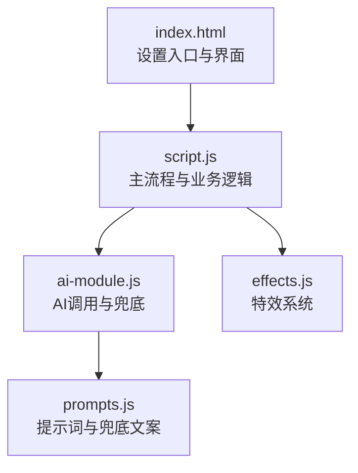
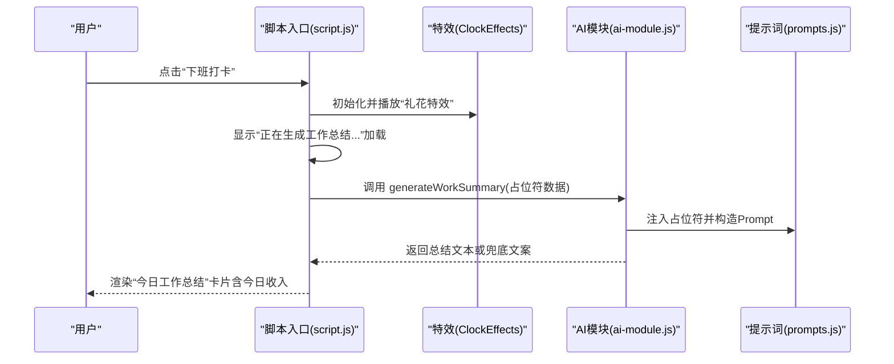
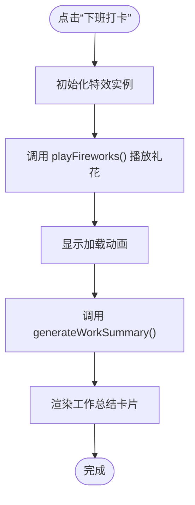
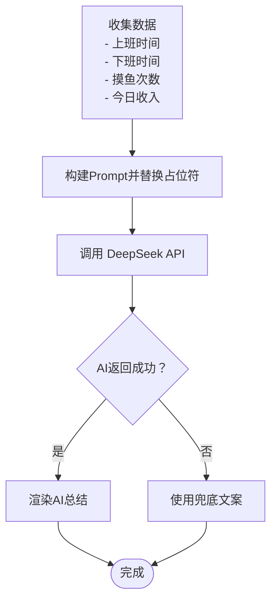
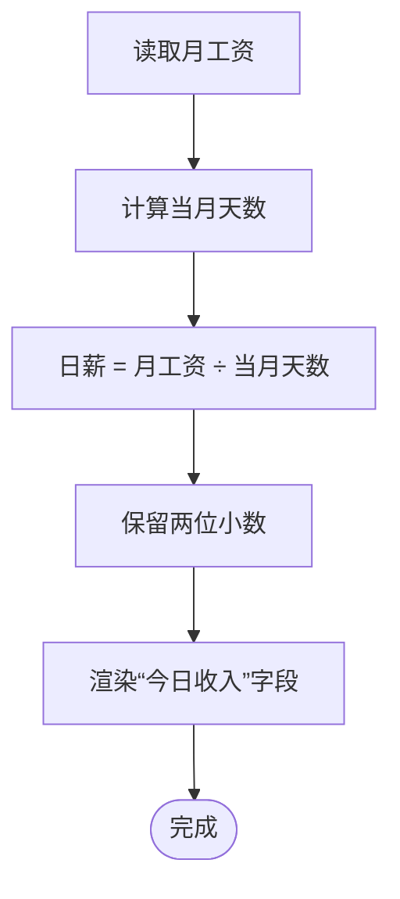
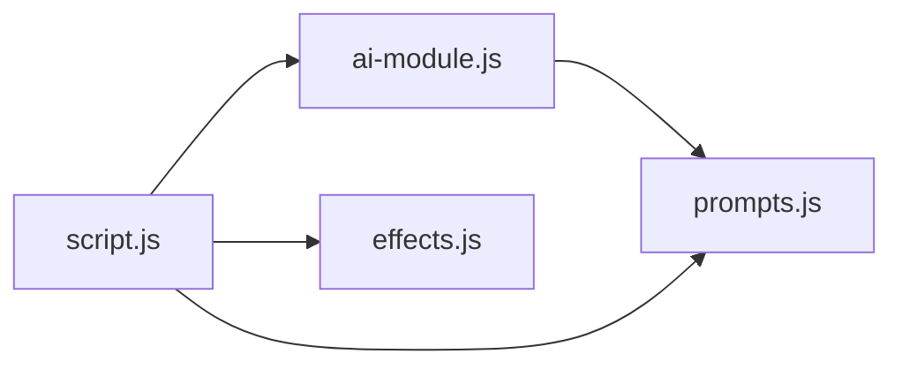

# 工资计算测试

<cite>
**本文引用的文件**
- [TEST_CHECKLIST_v1.3.3.md](file://TEST_CHECKLIST_v1.3.3.md)
- [script.js](file://script.js)
- [ai-module.js](file://ai-module.js)
- [effects.js](file://effects.js)
- [prompts.js](file://prompts.js)
- [index.html](file://index.html)
</cite>

## 目录
1. [简介](#简介)
2. [项目结构](#项目结构)
3. [核心组件](#核心组件)
4. [架构总览](#架构总览)
5. [详细组件分析](#详细组件分析)
6. [依赖关系分析](#依赖关系分析)
7. [性能考量](#性能考量)
8. [故障排查指南](#故障排查指南)
9. [结论](#结论)
10. [附录](#附录)

## 简介
本测试实施指南围绕 TEST_CHECKLIST_v1.3.3 中“工资计算测试”与“下班打卡流程”的关键条目，聚焦下班打卡时的礼花特效播放、工作总结生成、今日收入展示逻辑，结合 displayWorkSummary 与 generateWorkSummary 的实现，指导如何验证日薪计算公式（月工资 ÷ 当月天数）的准确性，以及 AI 总结文案中占位符数据的正确填充。同时提供测试用例设计思路，覆盖不同月工资设置、跨月打卡场景、AI 调用失败时的兜底文案验证，确保财务计算的精确性和系统稳定性。

## 项目结构
本项目采用前端单页应用结构，核心逻辑集中在 script.js，AI 能力封装在 ai-module.js，特效系统在 effects.js，提示词与兜底文案在 prompts.js，设置入口在 index.html。

图表来源
- [index.html](file://index.html#L200-L222)
- [script.js](file://script.js#L493-L732)
- [ai-module.js](file://ai-module.js#L1-L216)
- [effects.js](file://effects.js#L1-L279)
- [prompts.js](file://prompts.js#L1-L159)

章节来源
- [index.html](file://index.html#L200-L222)
- [script.js](file://script.js#L493-L732)
- [ai-module.js](file://ai-module.js#L1-L216)
- [effects.js](file://effects.js#L1-L279)
- [prompts.js](file://prompts.js#L1-L159)

## 核心组件
- 下班打卡流程与特效播放
  - 在下班打卡时触发特效系统，播放礼花特效；特效由 ClockEffects 类统一管理，支持 requestAnimationFrame 动画循环与粒子生命周期管理。
- 工作总结生成
  - displayWorkSummary 负责组装数据并渲染总结；generateWorkSummary 负责将占位符注入 Prompt 并调用 AI 生成总结文本，失败时回退至兜底文案。
- 日薪计算
  - calculateDailyIncome 依据当月天数计算日薪，确保跨月场景下的准确性。

章节来源
- [script.js](file://script.js#L546-L732)
- [effects.js](file://effects.js#L1-L279)
- [ai-module.js](file://ai-module.js#L129-L167)
- [prompts.js](file://prompts.js#L27-L47)

## 架构总览
下班打卡的完整流程如下：

图表来源
- [script.js](file://script.js#L546-L732)
- [effects.js](file://effects.js#L64-L141)
- [ai-module.js](file://ai-module.js#L129-L167)
- [prompts.js](file://prompts.js#L27-L47)

## 详细组件分析

### 组件A：下班打卡流程与特效播放
- 触发条件与状态
  - 当按钮状态为“CLOCK_OUT”或“FINISHED”时，点击将进入下班流程。
- 特效播放
  - 通过 ClockEffects 实例调用 playFireworks，创建多组粒子并使用 requestAnimationFrame 循环绘制，具备重力与摩擦效果，粒子寿命结束后自动清理。
- UI 渲染
  - 弹窗容器显示“正在生成工作总结...”，随后渲染总结卡片。

图表来源
- [script.js](file://script.js#L690-L732)
- [effects.js](file://effects.js#L64-L141)

章节来源
- [script.js](file://script.js#L690-L732)
- [effects.js](file://effects.js#L64-L141)

### 组件B：工作总结生成与占位符填充
- 数据收集
  - 从本地存储与时间轴统计摸鱼次数；上班时间来自当天打卡时间，下班时间为当前时间。
- 占位符注入
  - generateWorkSummary 将 {CLOCK_IN_TIME}、{CLOCK_OUT_TIME}、{RELAX_COUNT}、{DAILY_INCOME} 替换为实际值，再调用 AI 生成总结。
- 兜底机制
  - 若 AI 调用异常，返回 FALLBACK_MESSAGES.WORK_SUMMARY 作为兜底文案。

图表来源
- [script.js](file://script.js#L3080-L3150)
- [ai-module.js](file://ai-module.js#L129-L167)
- [prompts.js](file://prompts.js#L27-L47)

章节来源
- [script.js](file://script.js#L3080-L3150)
- [ai-module.js](file://ai-module.js#L129-L167)
- [prompts.js](file://prompts.js#L27-L47)

### 组件C：日薪计算与今日收入展示
- 日薪计算
  - 依据当月天数计算日薪：日薪 = 月工资 ÷ 当月天数；使用 new Date(year, month+1, 0).getDate() 获取当月天数。
- 今日收入展示
  - displayWorkSummary 将日薪格式化为两位小数并在“今日收入”字段高亮展示。

图表来源
- [script.js](file://script.js#L3063-L3077)
- [script.js](file://script.js#L3124-L3147)

章节来源
- [script.js](file://script.js#L3063-L3077)
- [script.js](file://script.js#L3124-L3147)

### 组件D：AI 总结文案与兜底文案
- Prompt 模板
  - WORK_SUMMARY 模板要求包含上班时间、下班时间、摸鱼次数、今日收入四个占位符。
- 兜底文案
  - FALLBACK_MESSAGES.WORK_SUMMARY 提供默认文案，用于网络异常或解析失败时的降级显示。

章节来源
- [prompts.js](file://prompts.js#L27-L47)
- [ai-module.js](file://ai-module.js#L129-L167)

## 依赖关系分析
- 组件耦合
  - script.js 依赖 ai-module.js 的 generateWorkSummary 与 getAIGreeting；依赖 effects.js 的 ClockEffects；依赖 prompts.js 的 AI_PROMPTS 与 FALLBACK_MESSAGES。
- 外部依赖
  - DeepSeek API 调用需配置 API Key；网络异常时触发兜底逻辑。
- 性能与稳定性
  - 特效使用 requestAnimationFrame，避免 setInteval；粒子过期自动清理，防止内存泄漏。

图表来源
- [script.js](file://script.js#L493-L732)
- [ai-module.js](file://ai-module.js#L1-L216)
- [effects.js](file://effects.js#L1-L279)
- [prompts.js](file://prompts.js#L1-L159)

章节来源
- [script.js](file://script.js#L493-L732)
- [ai-module.js](file://ai-module.js#L1-L216)
- [effects.js](file://effects.js#L1-L279)
- [prompts.js](file://prompts.js#L1-L159)

## 性能考量
- 动画性能
  - 特效使用 requestAnimationFrame，粒子数量与生命周期控制良好，避免频繁重绘。
- 内存管理
  - 特效类在 clear() 中取消动画帧并清空粒子数组，关闭弹窗时自动清理。
- 计算复杂度
  - 日薪计算为 O(1)，时间与空间开销极低。

章节来源
- [effects.js](file://effects.js#L203-L273)
- [script.js](file://script.js#L3063-L3077)

## 故障排查指南
- AI 调用失败
  - 现象：显示兜底文案而非 AI 生成内容。
  - 排查：确认 API Key 是否配置；检查网络连通性；查看错误日志。
- 占位符未正确填充
  - 现象：总结中出现未替换的占位符。
  - 排查：核对 generateWorkSummary 的占位符替换逻辑；确认 displayWorkSummary 传参正确。
- 今日收入不正确
  - 现象：日薪与预期不符。
  - 排查：核对月工资设置；确认当月天数计算；检查 displayWorkSummary 的格式化逻辑。
- 特效不播放或卡顿
  - 现象：弹窗无特效或动画卡顿。
  - 排查：确认 Canvas 初始化；检查 requestAnimationFrame 是否被阻塞；清理过期粒子。

章节来源
- [ai-module.js](file://ai-module.js#L129-L167)
- [script.js](file://script.js#L3080-L3150)
- [effects.js](file://effects.js#L135-L273)

## 结论
本指南基于 TEST_CHECKLIST_v1.3.3 的核心条目，系统梳理了下班打卡流程、特效播放、工作总结生成与日薪计算的实现细节与验证要点。通过明确的测试用例设计与故障排查路径，可有效保障财务计算的精确性与系统稳定性。

## 附录

### 测试用例设计思路
- 不同月工资设置
  - 场景：设置月工资分别为 8000、12000、15000。
  - 验证：日薪 = 月工资 ÷ 当月天数；展示“今日收入”与日薪一致。
- 跨月打卡场景
  - 场景：在 2 月（28/29 天）、12 月（31 天）分别打卡。
  - 验证：日薪计算随当月天数变化；2 月闰年与平年差异。
- AI 调用失败兜底
  - 场景：模拟网络异常或 API 返回错误。
  - 验证：显示 FALLBACK_MESSAGES.WORK_SUMMARY；总结文案完整、无占位符残留。
- 占位符数据正确填充
  - 场景：设置不同上班/下班时间、摸鱼次数。
  - 验证：总结中“上班时间”“下班时间”“摸鱼次数”“今日收入”均正确显示。
- 特效播放与清理
  - 场景：多次上下班打卡，关闭弹窗。
  - 验证：特效播放流畅；关闭后粒子清理完毕；无内存泄漏迹象。

章节来源
- [TEST_CHECKLIST_v1.3.3.md](file://TEST_CHECKLIST_v1.3.3.md#L34-L67)
- [script.js](file://script.js#L3063-L3150)
- [ai-module.js](file://ai-module.js#L129-L167)
- [effects.js](file://effects.js#L64-L141)