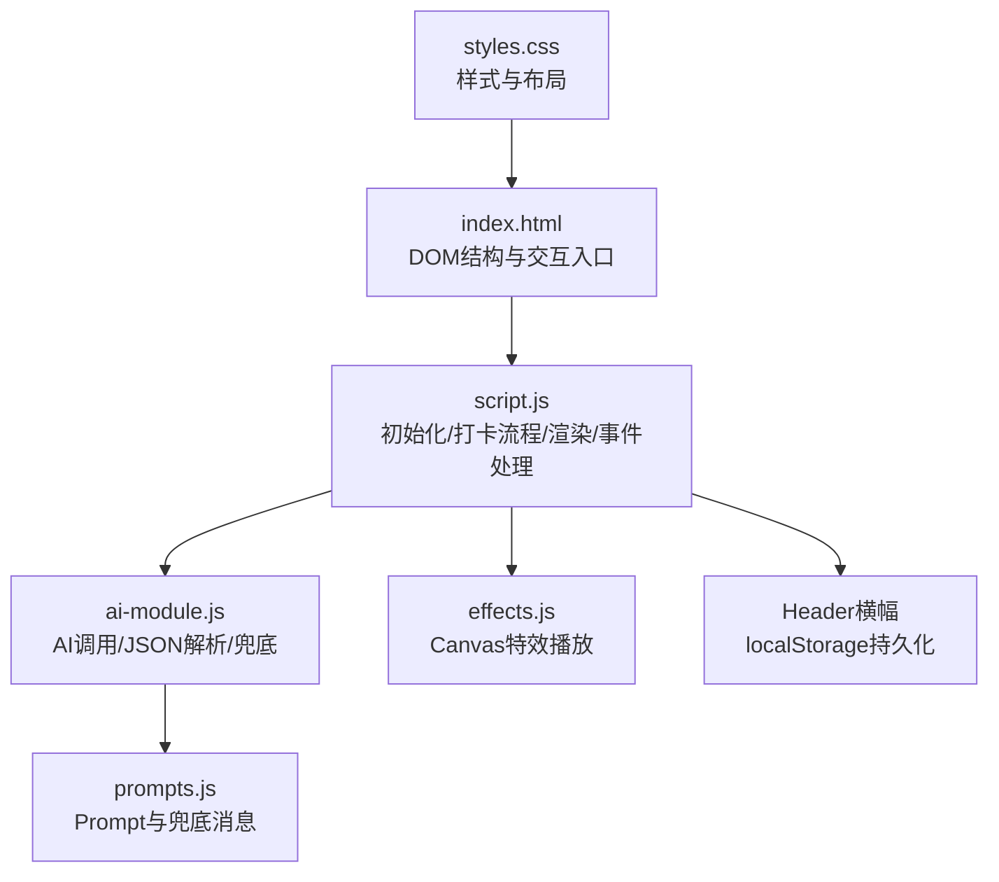
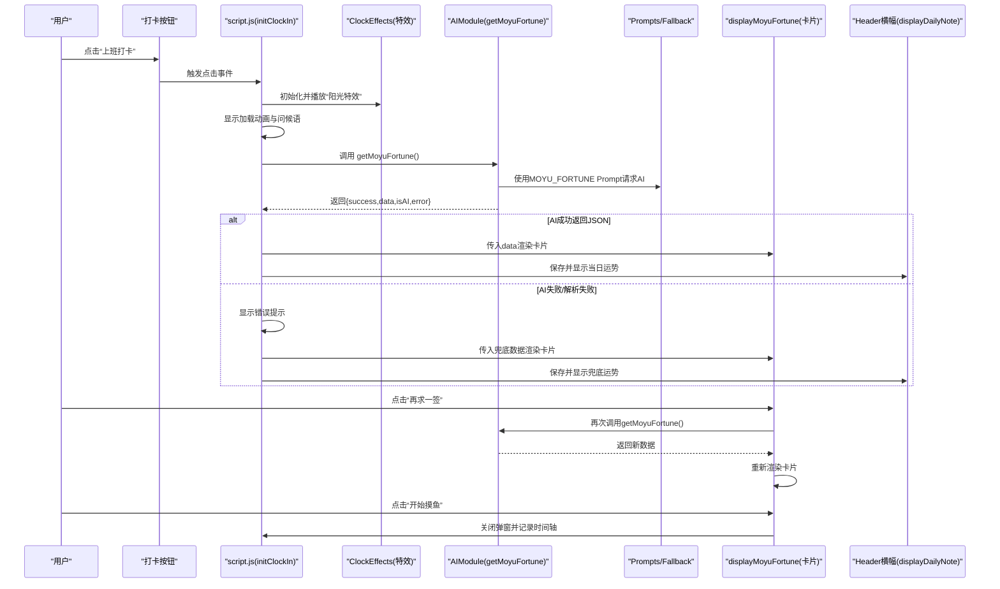
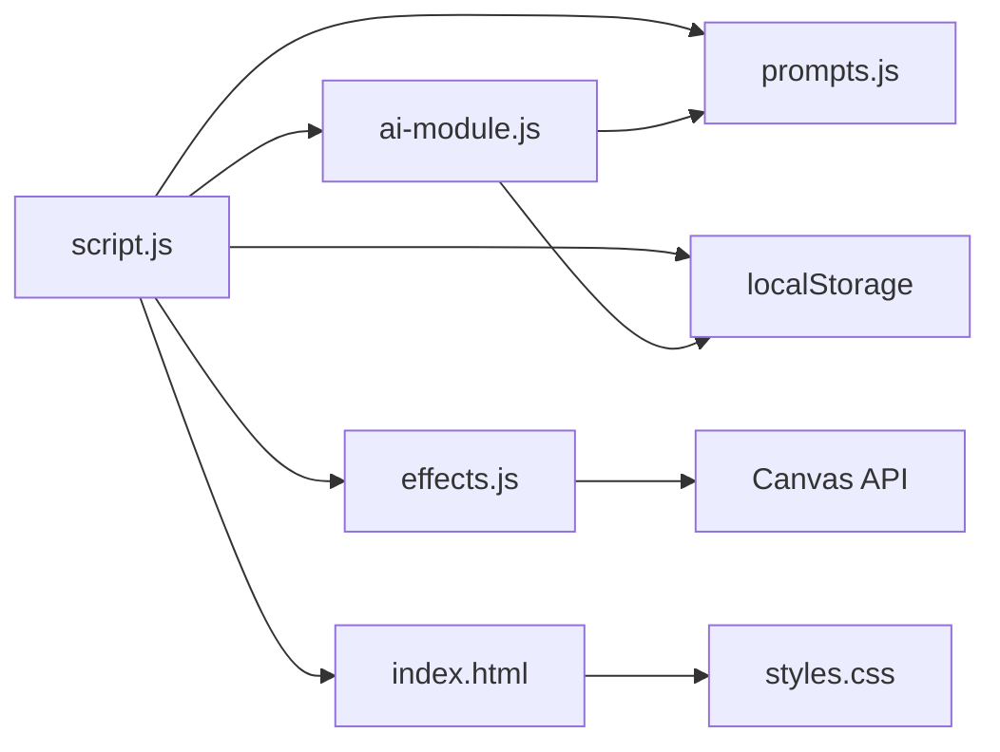

# 摸鱼吉日签测试

<cite>
**本文引用的文件**
- [TEST_CHECKLIST_v1.3.3.md](file://TEST_CHECKLIST_v1.3.3.md)
- [script.js](file://script.js)
- [ai-module.js](file://ai-module.js)
- [effects.js](file://effects.js)
- [index.html](file://index.html)
- [prompts.js](file://prompts.js)
- [styles.css](file://styles.css)
</cite>

## 目录
1. [引言](#引言)
2. [项目结构](#项目结构)
3. [核心组件](#核心组件)
4. [架构总览](#架构总览)
5. [详细组件分析](#详细组件分析)
6. [依赖关系分析](#依赖关系分析)
7. [性能考量](#性能考量)
8. [故障排查指南](#故障排查指南)
9. [结论](#结论)
10. [附录](#附录)

## 引言
本测试指南围绕 TEST_CHECKLIST_v1.3.3 中“摸鱼吉日签测试”与“AI调用测试”的核心条目，聚焦上班打卡流程中“阳光特效播放”“摸鱼吉日签卡片生成与展示”“再求一签按钮功能”“Header横幅更新”，以及结合 ai-module.js 的 getMoyuFortune 函数，指导如何验证 AI 成功返回 JSON 数据解析与失败时的兜底内容显示。文档同时提供测试用例设计思路与边界条件验证方法，确保用户体验完整与容错能力。

## 项目结构
- 前端入口与UI：index.html 定义打卡弹窗、摸鱼吉日签卡片、Header横幅等DOM结构；styles.css 提供样式。
- 业务逻辑：script.js 负责初始化、打卡流程、特效播放、调用AI模块、渲染卡片、Header横幅更新、时间轴记录等。
- AI能力：ai-module.js 封装 DeepSeek API 调用、摸鱼吉日签解析与兜底、工作总结生成等。
- 特效系统：effects.js 提供上班打卡的“阳光特效”与下班打卡的“礼花特效”。
- Prompt与兜底文案：prompts.js 定义 AI Prompt 与兜底消息结构，供 AI 模块使用。

图表来源
- [index.html](file://index.html#L120-L163)
- [script.js](file://script.js#L493-L732)
- [ai-module.js](file://ai-module.js#L1-L216)
- [effects.js](file://effects.js#L1-L279)
- [prompts.js](file://prompts.js#L1-L159)
- [styles.css](file://styles.css#L378-L482)

章节来源
- [index.html](file://index.html#L120-L163)
- [script.js](file://script.js#L493-L732)
- [ai-module.js](file://ai-module.js#L1-L216)
- [effects.js](file://effects.js#L1-L279)
- [prompts.js](file://prompts.js#L1-L159)
- [styles.css](file://styles.css#L378-L482)

## 核心组件
- 上班打卡流程（initClockIn）：负责按钮状态更新、弹窗显示、问候语、特效播放、AI调用、卡片渲染、Header横幅更新、再求一签按钮事件绑定、时间轴记录。
- AI模块（AIModule）：封装 DeepSeek API 调用、摸鱼吉日签 JSON 解析、失败兜底、工作总结生成。
- 特效系统（ClockEffects）：Canvas 实现的“阳光特效”和“礼花特效”，支持全屏覆盖、粒子生命周期与重力/摩擦等物理效果。
- 摸鱼吉日签卡片（displayMoyuFortune）：接收 fortuneData，重建 HTML 结构，渲染运势、最佳时间、锦囊与按钮。
- Header横幅（displayDailyNote/loadDailyNote）：从 localStorage 读取当日运势并在 Header 显示。

章节来源
- [script.js](file://script.js#L493-L732)
- [script.js](file://script.js#L3026-L3061)
- [ai-module.js](file://ai-module.js#L1-L216)
- [effects.js](file://effects.js#L1-L279)
- [index.html](file://index.html#L71-L86)

## 架构总览
上班打卡的关键流程如下：

图表来源
- [script.js](file://script.js#L493-L732)
- [script.js](file://script.js#L638-L690)
- [script.js](file://script.js#L663-L689)
- [ai-module.js](file://ai-module.js#L95-L127)
- [prompts.js](file://prompts.js#L1-L48)
- [index.html](file://index.html#L120-L163)

## 详细组件分析

### 上班打卡流程与阳光特效
- 触发时机：点击“上班打卡”按钮。
- 特效播放：构造 ClockEffects 并调用 playSunshine，Canvas 全屏覆盖，播放50+光点与光晕效果。
- 弹窗与加载：显示问候语与“正在生成摸鱼吉日签...”加载动画。
- AI调用：调用 AIModule.getMoyuFortune，等待返回。
- 错误处理：若 isAI=false 且存在 error，则在弹窗显示错误提示。
- 卡片渲染：调用 displayMoyuFortune 渲染运势、最佳时间、锦囊。
- Header横幅：将当日 fortune 写入 localStorage 并调用 displayDailyNote 显示。
- 再求一签：禁用按钮、显示“正在求签...”、再次调用 getMoyuFortune、重新渲染卡片、恢复按钮状态。
- 开始摸鱼：记录时间轴事件、关闭弹窗、提示保存成功。

章节来源
- [script.js](file://script.js#L493-L732)
- [script.js](file://script.js#L638-L690)
- [script.js](file://script.js#L663-L689)
- [effects.js](file://effects.js#L25-L62)
- [index.html](file://index.html#L120-L163)

### AI调用与JSON解析、兜底逻辑
- Prompt：MOYU_FORTUNE 要求返回包含 fortune、bestTime、tips 的JSON。
- JSON解析：从AI返回文本中匹配首个JSON片段并解析；解析失败则抛错进入兜底。
- 兜底数据：使用 FALLBACK_MESSAGES.MOYU_FORTUNE，包含默认运势、最佳时间与锦囊。
- 返回结构：success、data、isAI、error 字段，供前端分支处理。

章节来源
- [ai-module.js](file://ai-module.js#L95-L127)
- [prompts.js](file://prompts.js#L1-L48)
- [prompts.js](file://prompts.js#L122-L139)

### 摸鱼吉日签卡片生成与展示
- 输入：fortuneData（来自AI或兜底）。
- 输出：重建“moyu-fortune-section”HTML，包含运势、最佳时间、锦囊列表与两个按钮。
- 容错：若字段缺失，使用默认值保证渲染稳定。

章节来源
- [script.js](file://script.js#L3026-L3061)
- [index.html](file://index.html#L133-L160)

### Header横幅更新
- 保存：将当日 fortune 写入 localStorage：moyuFortune_{today}。
- 显示：displayDailyNote 读取并显示在 Header 的横幅区域。
- 初始化：loadDailyNote 在页面加载时尝试读取并显示。

章节来源
- [script.js](file://script.js#L663-L666)
- [script.js](file://script.js#L780-L800)
- [index.html](file://index.html#L71-L86)

### 再求一签按钮功能
- 点击事件：禁用按钮、修改文案为“正在求签...”，再次调用 getMoyuFortune，重新渲染卡片，恢复按钮状态与文案。
- 数据更新：更新 localStorage 与 Header 横幅显示。

章节来源
- [script.js](file://script.js#L667-L680)
- [script.js](file://script.js#L672-L679)

## 依赖关系分析
- script.js 依赖：
  - ai-module.js：调用 getMoyuFortune、generateWorkSummary。
  - effects.js：实例化 ClockEffects 并播放特效。
  - index.html：DOM结构与事件绑定。
  - prompts.js：AI Prompt 与兜底消息。
  - localStorage：持久化配置与运势。
- ai-module.js 依赖：
  - prompts.js：使用 MOYU_FORTUNE Prompt。
  - localStorage：读取 API Key。
- effects.js 依赖：
  - Canvas API：全屏绘制粒子与动画。
- index.html 依赖：
  - styles.css：样式与布局。
  - script.js：事件绑定与交互。

图表来源
- [script.js](file://script.js#L493-L732)
- [ai-module.js](file://ai-module.js#L1-L216)
- [effects.js](file://effects.js#L1-L279)
- [index.html](file://index.html#L120-L163)
- [prompts.js](file://prompts.js#L1-L159)
- [styles.css](file://styles.css#L378-L482)

## 性能考量
- Canvas动画：使用 requestAnimationFrame 控制帧率，避免 setInterval；粒子过期自动清理，减少内存占用。
- 特效参数：光点数量与光晕半径在合理范围内，避免过度绘制导致卡顿。
- DOM重建：displayMoyuFortune 一次性重建卡片HTML，减少多次DOM操作。
- 本地存储：仅在必要时写入 localStorage，避免频繁I/O。

章节来源
- [effects.js](file://effects.js#L136-L201)
- [effects.js](file://effects.js#L203-L273)
- [script.js](file://script.js#L3026-L3061)

## 故障排查指南
- AI调用失败/超时
  - 现象：弹窗显示错误提示，卡片仍显示兜底内容。
  - 排查：确认已保存 DeepSeek API Key；检查网络连通性；查看返回文本是否包含可解析JSON片段。
  - 参考路径：[ai-module.js](file://ai-module.js#L95-L127)
- JSON解析失败
  - 现象：抛出“无法解析AI返回的JSON”错误，触发兜底。
  - 排查：核对 Prompt 是否要求返回纯JSON；确保AI返回文本中存在首个JSON片段。
  - 参考路径：[ai-module.js](file://ai-module.js#L95-L127)
- 特效未播放或卡顿
  - 现象：点击“上班打卡”后无特效或动画卡顿。
  - 排查：确认 Canvas 初始化成功；检查浏览器性能面板；确保未在移动端启用节电模式。
  - 参考路径：[effects.js](file://effects.js#L25-L62)
- Header横幅不显示
  - 现象：Header未显示当日运势。
  - 排查：确认 localStorage 中存在 moyuFortune_{today}；检查 displayDailyNote 逻辑；刷新页面后重试。
  - 参考路径：[script.js](file://script.js#L663-L666)
- 再求一签按钮无效
  - 现象：点击后无反应或按钮未恢复。
  - 排查：确认事件绑定是否在卡片渲染后重新绑定；检查按钮禁用/启用逻辑。
  - 参考路径：[script.js](file://script.js#L667-L680)

章节来源
- [ai-module.js](file://ai-module.js#L95-L127)
- [effects.js](file://effects.js#L25-L62)
- [script.js](file://script.js#L663-L680)

## 结论
本测试指南围绕 TEST_CHECKLIST_v1.3.3 的核心条目，梳理了上班打卡流程中“阳光特效播放”“摸鱼吉日签卡片生成与展示”“再求一签按钮功能”“Header横幅更新”的实现链路，并结合 ai-module.js 的 getMoyuFortune 函数，明确了AI成功/失败时的数据解析与兜底策略。通过本文提供的测试用例设计思路与故障排查要点，可有效验证功能完整性与容错能力，保障用户体验。

## 附录

### 测试用例设计思路（基于 TEST_CHECKLIST_v1.3.3）
- 上班打卡流程
  - 阳光特效：点击“上班打卡”，确认 Canvas 全屏覆盖、50+光点飘落、光晕效果、流畅无卡顿；关闭弹窗后特效清除。
  - 加载状态：弹窗显示“正在生成摸鱼吉日签...”加载动画。
  - 卡片生成：成功显示“今日摸鱼吉日签”，包含“运势”“最佳时间”“锦囊”三项。
  - 再求一签：点击按钮后按钮禁用、文案变为“正在求签...”，重新生成后恢复按钮状态。
  - 开始摸鱼：点击后关闭弹窗并记录时间轴事件。
  - Header横幅：保存当日运势并在Header显示。
- AI调用测试
  - 成功返回：AI返回符合要求的JSON，前端解析成功，卡片显示正确字段。
  - 失败兜底：AI返回非JSON或异常，前端捕获错误并显示兜底内容，包含完整的 fortune、bestTime、tips。
- 数据持久化
  - localStorage 存储 monthlySalary、moyuFortune_{date}；刷新页面后数据不丢失；新的一天自动清除上一天的运势。

章节来源
- [TEST_CHECKLIST_v1.3.3.md](file://TEST_CHECKLIST_v1.3.3.md#L11-L46)
- [TEST_CHECKLIST_v1.3.3.md](file://TEST_CHECKLIST_v1.3.3.md#L89-L95)
- [script.js](file://script.js#L663-L666)
- [script.js](file://script.js#L667-L680)
- [ai-module.js](file://ai-module.js#L95-L127)
- [index.html](file://index.html#L133-L160)