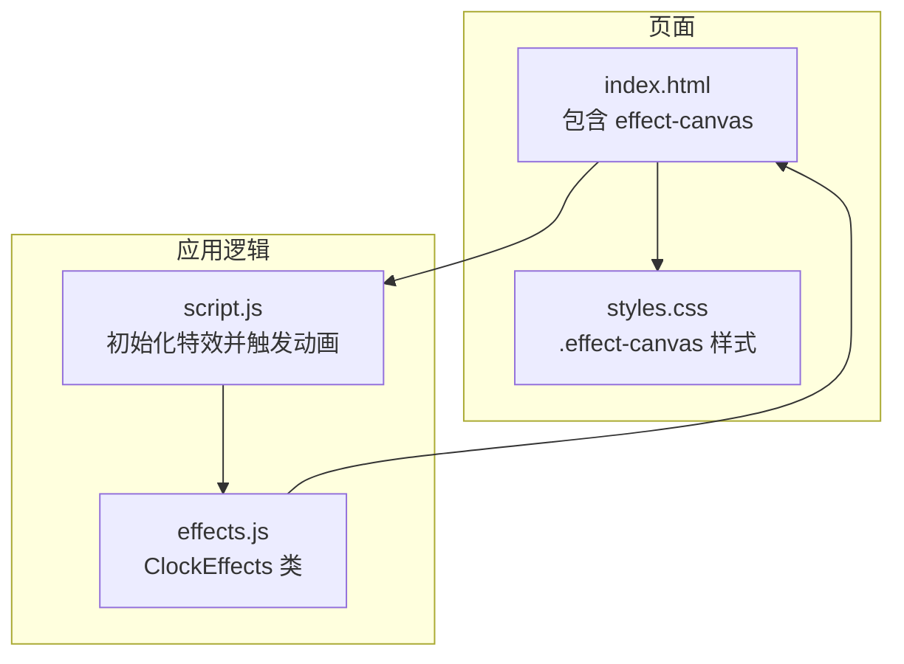
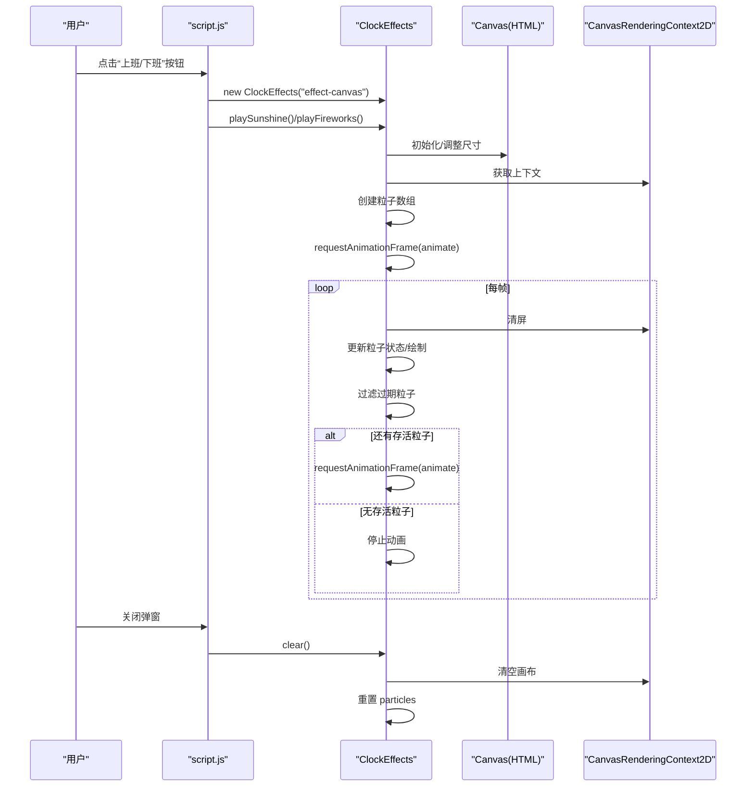
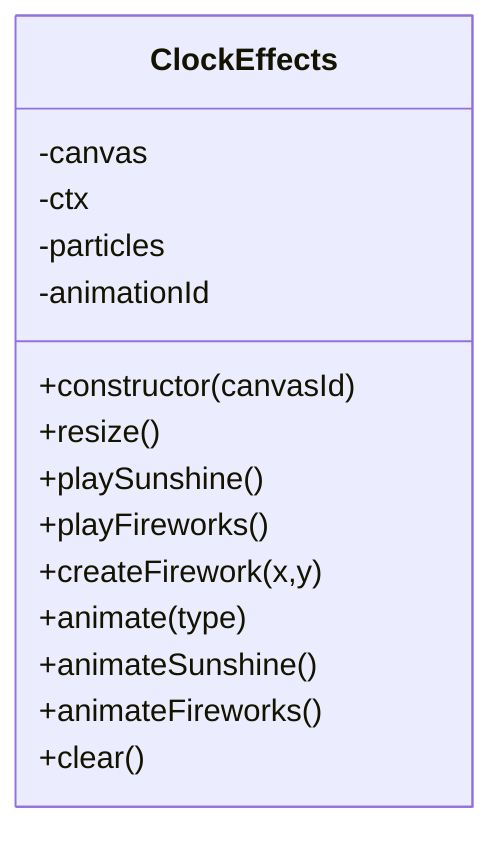
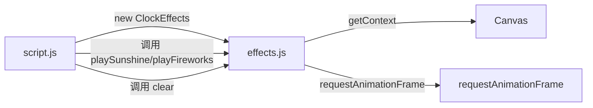

# 特效系统测试

<cite>
**本文引用的文件**
- [effects.js](file://effects.js)
- [script.js](file://script.js)
- [index.html](file://index.html)
- [styles.css](file://styles.css)
- [TEST_CHECKLIST_v1.3.3.md](file://TEST_CHECKLIST_v1.3.3.md)
</cite>

## 目录
1. [简介](#简介)
2. [项目结构](#项目结构)
3. [核心组件](#核心组件)
4. [架构总览](#架构总览)
5. [详细组件分析](#详细组件分析)
6. [依赖关系分析](#依赖关系分析)
7. [性能考量](#性能考量)
8. [故障排查指南](#故障排查指南)
9. [结论](#结论)
10. [附录](#附录)

## 简介
本测试实施指南围绕 TEST_CHECKLIST_v1.3.3.md 中“特效系统测试”条目，聚焦于以下目标：
- 阳光特效与礼花特效的动画实现机制说明
- Canvas 初始化、粒子渲染与内存管理的正确性验证
- 结合 effects.js 中 ClockEffects 类，指导如何测试两类特效
- 使用 requestAnimationFrame 实现流畅动画且避免内存泄漏
- 设计测试用例：性能监控、过期粒子清理、多分辨率兼容性
- 确保视觉效果高质量呈现

## 项目结构
- 特效系统由独立模块 effects.js 提供，ClockEffects 类负责创建 Canvas、管理粒子数组、驱动动画循环
- 主应用脚本 script.js 在打卡流程中实例化特效并触发对应动画
- 页面模板 index.html 提供特效画布 effect-canvas，并在模态窗口中展示
- 样式 styles.css 定义特效画布的绝对定位、层级与交互行为

图表来源
- [index.html](file://index.html#L120-L165)
- [effects.js](file://effects.js#L1-L279)
- [styles.css](file://styles.css#L1984-L1993)

章节来源
- [index.html](file://index.html#L120-L165)
- [effects.js](file://effects.js#L1-L279)
- [styles.css](file://styles.css#L1984-L1993)

## 核心组件
- ClockEffects 类
  - Canvas 初始化：构造函数根据传入的 canvasId 获取元素，设置 ctx，初始化 particles 数组与 animationId；随后执行 resize 将画布尺寸设为视口宽高，并监听窗口 resize 事件
  - 阳光特效：playSunshine 创建约 100 个小光点粒子与约 10 个大型光晕粒子，随后启动 animate('sunshine')
  - 礼花特效：playFireworks 清空并创建粒子数组，按时间序列创建多个烟花（createFirework），随后启动 animate('fireworks')
  - 动画循环：animate 分发到 animateSunshine 或 animateFireworks；两者均使用 requestAnimationFrame 驱动下一帧
  - 清理：clear 会取消当前动画帧、清空画布、重置 particles 数组，确保无内存泄漏
- 打卡流程集成
  - script.js 在点击“上班/下班”按钮时，创建 ClockEffects 实例，播放对应特效，并在弹窗关闭时调用 clear

章节来源
- [effects.js](file://effects.js#L1-L279)
- [script.js](file://script.js#L546-L732)

## 架构总览
特效系统采用“模块化类 + DOM 模态窗口”的架构：
- ClockEffects 作为纯动画引擎，不直接依赖 UI 细节
- script.js 负责业务流程与 UI 交互，仅在合适时机调用 ClockEffects 的接口
- index.html 提供全屏 Canvas，styles.css 控制其层级与交互

图表来源
- [script.js](file://script.js#L546-L732)
- [effects.js](file://effects.js#L1-L279)
- [index.html](file://index.html#L120-L165)

## 详细组件分析

### ClockEffects 类
- 职责
  - Canvas 生命周期管理：构造、resize、clear
  - 粒子生命周期管理：创建、更新、过滤、销毁
  - 动画循环：基于 requestAnimationFrame 的帧调度
- 关键方法
  - constructor(canvasId): 获取 Canvas 元素，设置 ctx，初始化 particles 与 animationId，执行 resize 并绑定窗口 resize 事件
  - resize(): 将画布宽度设为 window.innerWidth，高度设为 window.innerHeight
  - playSunshine(): 生成小光点与大型光晕粒子，启动 animate('sunshine')
  - playFireworks(): 生成烟花序列，创建多组粒子，启动 animate('fireworks')
  - animate(type): 分发到具体动画
  - animateSunshine(): 清屏、更新粒子位置/闪烁、绘制光晕与核心亮点、过滤超出范围的粒子、递归 requestAnimationFrame
  - animateFireworks(): 清屏、更新速度与重力、绘制尾迹与粒子、过滤透明度为 0 的粒子、递归 requestAnimationFrame
  - clear(): 取消动画帧、清空画布、重置 particles

图表来源
- [effects.js](file://effects.js#L1-L279)

章节来源
- [effects.js](file://effects.js#L1-L279)

### 阳光特效（上班打卡）
- 粒子构成
  - 小光点：约 100 个，带轻微水平漂移与闪烁效果
  - 大型光晕：约 10 个，尺寸更大，alpha 更低，营造柔和背景光晕
- 渲染策略
  - 使用径向渐变绘制光晕与核心亮点
  - 通过 requestAnimationFrame 逐帧更新 y 与 twinkle，实现自然飘落与闪烁
- 过期清理
  - animateSunshine 中过滤 y 超出画布下方一定范围的粒子，避免无限增长
- 测试要点
  - 验证 50 个光点（清单要求）的视觉呈现与流畅度
  - 验证光晕效果与闪烁细节
  - 验证关闭弹窗后特效停止并释放资源

章节来源
- [effects.js](file://effects.js#L25-L62)
- [effects.js](file://effects.js#L144-L201)
- [TEST_CHECKLIST_v1.3.3.md](file://TEST_CHECKLIST_v1.3.3.md#L60-L74)

### 礼花特效（下班打卡）
- 粒子构成
  - 多组烟花：每组由 80 个向外扩散粒子与 20 个内圈闪光粒子组成
  - 物理参数：摩擦、重力、初速度方向呈圆周分布
- 渲染策略
  - 绘制粒子尾迹（线段）与粒子本身（圆点）
  - 通过 alpha 逐步衰减实现粒子消失
- 过期清理
  - animateFireworks 中过滤 alpha ≤ 0 的粒子，避免无限增长
- 测试要点
  - 验证 3 组彩色粒子爆炸（清单要求）
  - 验证粒子重力下落与尾迹效果
  - 验证颜色随机与视觉丰富度
  - 验证关闭弹窗后特效停止并释放资源

章节来源
- [effects.js](file://effects.js#L64-L133)
- [effects.js](file://effects.js#L203-L260)
- [TEST_CHECKLIST_v1.3.3.md](file://TEST_CHECKLIST_v1.3.3.md#L67-L74)

### Canvas 初始化与样式
- 初始化
  - ClockEffects 构造函数获取 Canvas 元素并设置 ctx
  - resize 将画布尺寸设为视口宽高
- 样式
  - .effect-canvas 使用绝对定位、全屏尺寸、z-index 保证覆盖在模态窗口之上，同时 pointer-events: none 使特效不影响交互
- 测试要点
  - 验证 Canvas 全屏覆盖且不遮挡主要内容
  - 验证弹窗关闭后画布被清空

章节来源
- [effects.js](file://effects.js#L1-L23)
- [styles.css](file://styles.css#L1984-L1993)
- [index.html](file://index.html#L120-L165)

### 动画循环与 requestAnimationFrame
- requestAnimationFrame 使用
  - animateSunshine 与 animateFireworks 均在帧处理结束后调用 requestAnimationFrame 递归调度
- 与 setInterval 的区别
  - 清单明确要求使用 requestAnimationFrame，避免使用 setInterval
- 测试要点
  - 验证动画流畅，无卡顿
  - 验证在无活动时停止动画（粒子耗尽）

章节来源
- [effects.js](file://effects.js#L198-L201)
- [effects.js](file://effects.js#L257-L260)
- [TEST_CHECKLIST_v1.3.3.md](file://TEST_CHECKLIST_v1.3.3.md#L75-L80)

### 内存管理与过期粒子清理
- 过期清理策略
  - 阳光特效：过滤 y 超出阈值的粒子
  - 礼花特效：过滤 alpha ≤ 0 的粒子
- 清理触发
  - animate 循环中对 particles 进行过滤，确保数组长度稳定增长
- 关闭弹窗
  - script.js 在关闭弹窗时调用 clear，取消动画帧并清空画布
- 测试要点
  - 验证粒子数量随时间稳定或下降
  - 验证开发者工具中内存占用无持续上涨

章节来源
- [effects.js](file://effects.js#L147-L196)
- [effects.js](file://effects.js#L211-L255)
- [effects.js](file://effects.js#L263-L272)
- [script.js](file://script.js#L556-L570)

## 依赖关系分析
- 外部依赖
  - DOM：Canvas 元素与模态窗口
  - 浏览器 API：Canvas 2D Context、requestAnimationFrame、cancelAnimationFrame
- 内部耦合
  - script.js 与 effects.js：业务流程与动画引擎解耦，通过 ClockEffects 接口交互
- 潜在风险
  - 若未调用 clear，可能残留动画帧与粒子对象导致内存增长
  - 若未正确过滤过期粒子，可能导致数组无限增长

图表来源
- [script.js](file://script.js#L546-L732)
- [effects.js](file://effects.js#L1-L279)

章节来源
- [script.js](file://script.js#L546-L732)
- [effects.js](file://effects.js#L1-L279)

## 性能考量
- 帧调度
  - 使用 requestAnimationFrame，避免与页面刷新节拍错位
- 绘制优化
  - 仅清屏一次，批量更新与绘制
  - 使用径向渐变一次性填充，减少多次路径绘制
- 粒子数量
  - 阳光：约 110 个粒子；礼花：每组约 100 个粒子，多组叠加
- 过期清理
  - 每帧过滤过期粒子，避免数组膨胀
- 内存释放
  - clear 调用后取消动画帧、清空画布、重置数组

章节来源
- [effects.js](file://effects.js#L144-L201)
- [effects.js](file://effects.js#L203-L260)
- [effects.js](file://effects.js#L263-L272)

## 故障排查指南
- 现象：特效不显示
  - 检查 effect-canvas 是否存在且样式生效
  - 检查 ClockEffects 构造函数是否成功获取 Canvas 元素
- 现象：动画卡顿
  - 确认使用 requestAnimationFrame，而非 setInterval
  - 检查是否存在多余 DOM 操作或阻塞主线程的逻辑
- 现象：内存占用上升
  - 确认每帧对过期粒子进行过滤
  - 确认关闭弹窗时调用 clear
- 现象：粒子数量异常增长
  - 检查过滤条件是否正确（阳光：y 超阈值；礼花：alpha ≤ 0）
- 现象：全屏覆盖异常
  - 检查 .effect-canvas 的 z-index 与 pointer-events 样式

章节来源
- [index.html](file://index.html#L120-L165)
- [styles.css](file://styles.css#L1984-L1993)
- [effects.js](file://effects.js#L144-L201)
- [effects.js](file://effects.js#L203-L260)
- [effects.js](file://effects.js#L263-L272)

## 结论
- ClockEffects 将 Canvas 动画与业务流程解耦，满足 TEST_CHECKLIST_v1.3.3.md 中对特效系统的要求
- 阳光与礼花两类特效分别通过不同的粒子生成策略与物理参数实现差异化视觉效果
- 使用 requestAnimationFrame 与过期粒子清理确保动画流畅且无内存泄漏
- 建议在测试中重点关注：Canvas 初始化、粒子渲染、过期清理、内存监控与多分辨率兼容性

## 附录

### 测试用例设计思路
- Canvas 初始化
  - 验证 effect-canvas 存在且尺寸等于视口宽高
  - 验证 clear 后画布被清空
- 阳光特效
  - 验证 50 个光点飘落与光晕闪烁
  - 验证关闭弹窗后特效停止
- 礼花特效
  - 验证 3 组彩色粒子爆炸与重力下落
  - 验证尾迹与核心闪光效果
  - 验证关闭弹窗后特效停止
- 性能监控
  - 使用浏览器性能面板观察 FPS 与内存曲线
  - 观察粒子数量随时间变化趋势
- 过期粒子清理
  - 验证 animate 循环中对过期粒子的过滤逻辑
- 多分辨率兼容性
  - 在不同分辨率与缩放下验证特效覆盖与清晰度
  - 验证窗口 resize 时 Canvas 尺寸同步更新

章节来源
- [TEST_CHECKLIST_v1.3.3.md](file://TEST_CHECKLIST_v1.3.3.md#L58-L80)
- [effects.js](file://effects.js#L1-L279)
- [script.js](file://script.js#L546-L732)
- [index.html](file://index.html#L120-L165)
- [styles.css](file://styles.css#L1984-L1993)