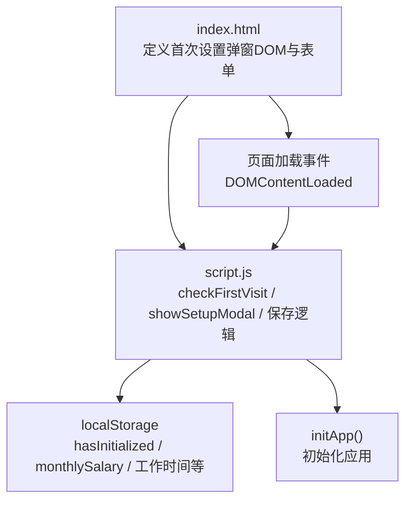
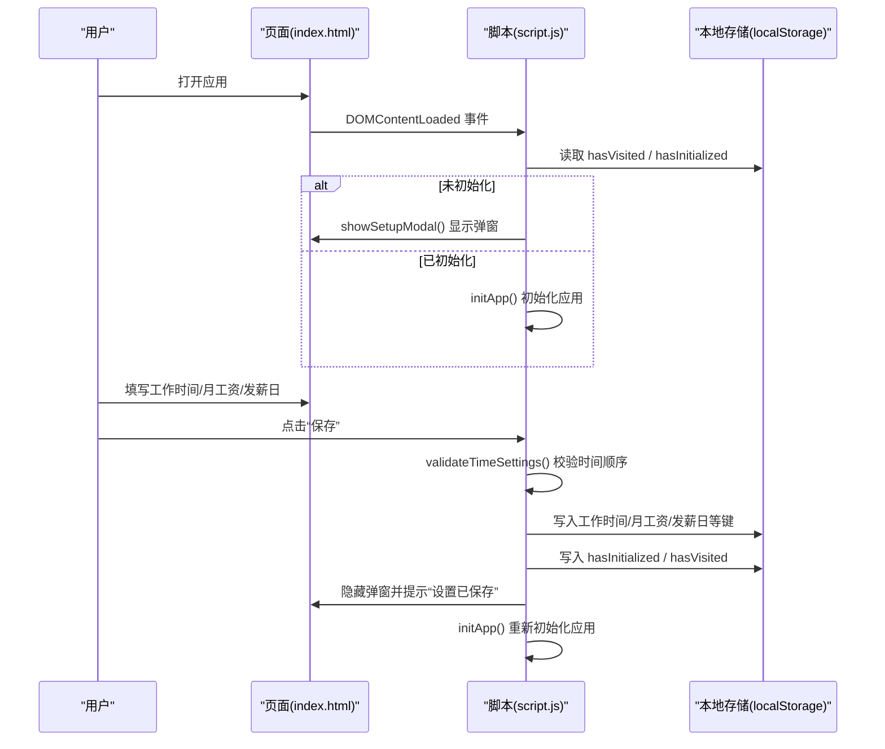
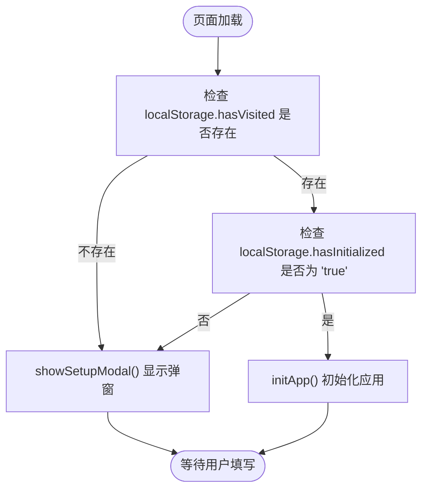
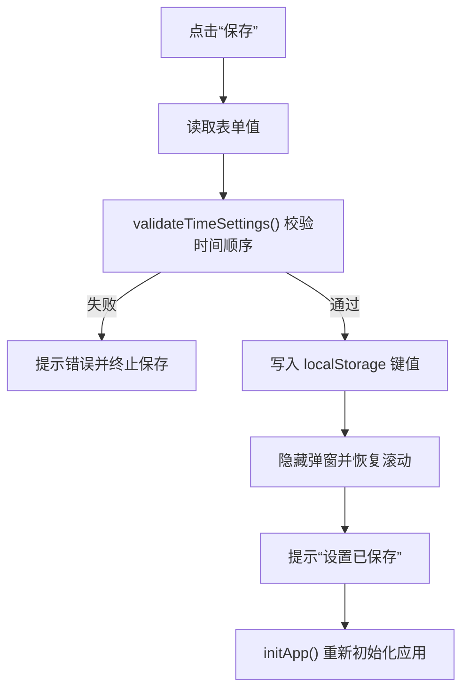
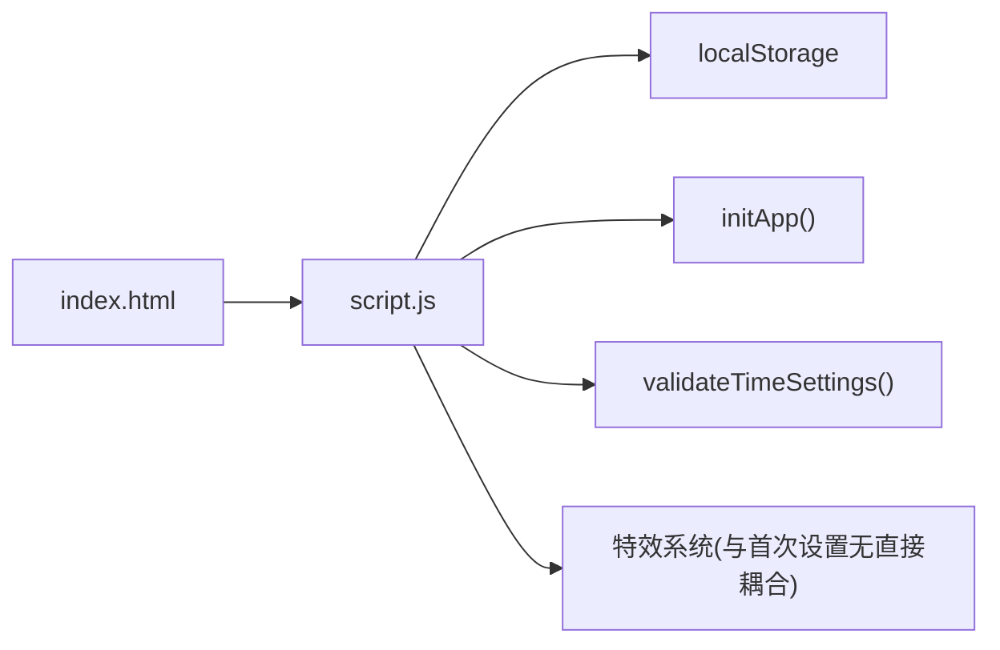

# 首次设置测试

<cite>
**本文引用的文件**
- [TEST_CHECKLIST_v1.3.3.md](file://TEST_CHECKLIST_v1.3.3.md)
- [README.md](file://README.md)
- [RELEASE_v1.3.3.md](file://RELEASE_v1.3.3.md)
- [index.html](file://index.html)
- [script.js](file://script.js)
</cite>

## 目录
1. [引言](#引言)
2. [项目结构](#项目结构)
3. [核心组件](#核心组件)
4. [架构总览](#架构总览)
5. [详细组件分析](#详细组件分析)
6. [依赖关系分析](#依赖关系分析)
7. [性能考量](#性能考量)
8. [故障排查指南](#故障排查指南)
9. [结论](#结论)
10. [附录](#附录)

## 引言
本测试指南围绕 TEST_CHECKLIST_v1.3.3.md 中“首次设置测试”条目展开，聚焦应用启动时首次设置弹窗的触发条件、工作时间（上班、午休、下班）与月工资设置功能的正确性验证，并结合 script.js 中 checkFirstVisit 与 showSetupModal 的实现逻辑，指导如何测试 localStorage 中 hasInitialized、monthlySalary 等关键字段的存储与读取。同时提供测试用例设计思路，覆盖输入数据构造、预期弹窗行为与边界条件，确保首次设置流程的完整性与数据持久化可靠性。

## 项目结构
首次设置相关的核心文件与职责如下：
- index.html：定义首次设置弹窗的 DOM 结构与表单项（工作时间、月工资、发薪日类型与日期等），以及页面加载后的初始化入口。
- script.js：实现页面加载时的首次访问检测、弹窗显示、表单校验与保存、localStorage 写入与应用初始化等逻辑。
- TEST_CHECKLIST_v1.3.3.md：列出首次设置测试的具体条目与期望结果。
- README.md / RELEASE_v1.3.3.md：提供功能背景与默认值说明，辅助测试设计。

图表来源
- [index.html](file://index.html#L186-L223)
- [script.js](file://script.js#L94-L120)
- [script.js](file://script.js#L163-L223)

章节来源
- [index.html](file://index.html#L186-L223)
- [script.js](file://script.js#L94-L120)
- [script.js](file://script.js#L163-L223)

## 核心组件
- 首次设置弹窗触发机制
  - 页面加载时通过 DOMContentLoaded 事件触发检查；若未检测到 hasVisited 或 hasInitialized 为 false，则显示首次设置弹窗。
- 首次设置弹窗内容
  - 包含上班时间、午休开始、午休结束、下班时间、月工资、发薪日类型与发薪日等表单项。
- 表单保存逻辑
  - 保存前进行时间顺序校验；写入 localStorage 的键包括 workStartTime、lunchStartTime、lunchEndTime、workEndTime、monthlySalary、salaryType、salaryDay、hasInitialized、hasVisited。
- 应用初始化
  - 保存成功后隐藏弹窗并调用 initApp() 重新初始化应用。

章节来源
- [script.js](file://script.js#L94-L120)
- [script.js](file://script.js#L163-L223)
- [script.js](file://script.js#L186-L223)
- [index.html](file://index.html#L186-L223)

## 架构总览
首次设置流程涉及页面加载、弹窗显示、表单校验、数据持久化与应用初始化的链路。

图表来源
- [script.js](file://script.js#L94-L120)
- [script.js](file://script.js#L163-L223)
- [script.js](file://script.js#L186-L223)
- [script.js](file://script.js#L2268-L2297)
- [index.html](file://index.html#L186-L223)

## 详细组件分析

### 组件A：首次设置弹窗触发与显示
- 触发条件
  - 页面加载时，若 localStorage 中不存在 hasVisited 或 hasInitialized 为 false，则显示首次设置弹窗。
- 弹窗内容
  - 上班时间、午休开始、午休结束、下班时间、月工资、发薪日类型与发薪日。
- 显示逻辑
  - showSetupModal() 通过为弹窗元素添加“显示类”并禁用页面滚动实现。

图表来源
- [script.js](file://script.js#L94-L120)
- [script.js](file://script.js#L163-L184)

章节来源
- [script.js](file://script.js#L94-L120)
- [script.js](file://script.js#L163-L184)
- [index.html](file://index.html#L186-L223)

### 组件B：表单校验与保存
- 校验规则
  - 上班时间 < 午休开始时间 < 午休结束时间 < 下班时间。
- 保存键值
  - workStartTime、lunchStartTime、lunchEndTime、workEndTime、monthlySalary、salaryType、salaryDay、hasInitialized、hasVisited。
- 默认值
  - 月工资默认值为 8000；发薪日类型默认“固定日期”，发薪日默认 15。

图表来源
- [script.js](file://script.js#L186-L223)
- [script.js](file://script.js#L2268-L2297)
- [index.html](file://index.html#L186-L223)

章节来源
- [script.js](file://script.js#L186-L223)
- [script.js](file://script.js#L2268-L2297)
- [index.html](file://index.html#L186-L223)

### 组件C：月工资与日薪计算
- 月工资来源
  - 首次设置保存的 monthlySalary；设置页面更新也会写入该键。
- 日薪计算
  - 按当月天数计算：日薪 = 月工资 ÷ 当月天数。
- 默认值
  - 若未设置则使用 8000 元作为默认值。

章节来源
- [script.js](file://script.js#L1108-L1116)
- [script.js](file://script.js#L3063-L3077)
- [RELEASE_v1.3.3.md](file://RELEASE_v1.3.3.md#L165-L178)

## 依赖关系分析
- index.html 依赖 script.js 中的 DOM 事件与初始化逻辑。
- script.js 依赖 localStorage 进行数据持久化。
- 首次设置流程与工资计算流程相互独立但共享 localStorage 键空间。

图表来源
- [index.html](file://index.html#L186-L223)
- [script.js](file://script.js#L94-L120)
- [script.js](file://script.js#L186-L223)
- [script.js](file://script.js#L2268-L2297)

章节来源
- [index.html](file://index.html#L186-L223)
- [script.js](file://script.js#L94-L120)
- [script.js](file://script.js#L186-L223)
- [script.js](file://script.js#L2268-L2297)

## 性能考量
- 首次设置仅涉及弹窗显示与 localStorage 写入，性能开销极低。
- 日薪计算在需要时按月动态计算，避免频繁计算带来的负担。
- 本节为通用建议，不直接分析具体文件。

## 故障排查指南
- 弹窗未出现
  - 检查 localStorage 中 hasVisited 与 hasInitialized 是否存在且为 'true'。
  - 确认 DOMContentLoaded 事件是否触发。
- 保存失败
  - 校验时间顺序是否满足：上班 < 午休开始 < 午休结束 < 下班。
  - 确认表单输入合法（如月工资为非负数）。
- 数据未持久化
  - 确认保存后键值是否写入：workStartTime、lunchStartTime、lunchEndTime、workEndTime、monthlySalary、salaryType、salaryDay、hasInitialized、hasVisited。
- 日薪计算异常
  - 检查 monthlySalary 是否为有效数值；确认当月天数计算逻辑。

章节来源
- [script.js](file://script.js#L94-L120)
- [script.js](file://script.js#L186-L223)
- [script.js](file://script.js#L2268-L2297)
- [script.js](file://script.js#L3063-L3077)

## 结论
首次设置测试应围绕“弹窗触发条件、工作时间顺序校验、月工资默认值与持久化、应用初始化”四个关键点展开。通过覆盖正常输入、边界输入与异常输入，可确保流程稳定可靠。日薪计算与默认值策略已在 RELEASE_v1.3.3.md 中明确，测试时应结合该文档进行一致性验证。

## 附录

### 测试用例设计思路
- 用例1：首次访问弹窗触发
  - 前置条件：清空 localStorage 中 hasVisited 与 hasInitialized。
  - 步骤：打开页面。
  - 预期：显示首次设置弹窗；表单默认值为上班 08:30、午休 11:30/14:00、下班 17:30、月工资 8000、发薪日类型“固定日期”、发薪日 15。
- 用例2：时间顺序校验
  - 输入：上班时间晚于午休开始时间。
  - 预期：阻止保存并提示错误；弹窗仍显示。
- 用例3：月工资默认值与保存
  - 输入：不填月工资，直接保存。
  - 预期：localStorage.monthlySalary 为 8000；弹窗隐藏，initApp() 被调用。
- 用例4：修改月工资并更新设置页面
  - 输入：设置页面输入 12000，点击“更新”。
  - 预期：localStorage.monthlySalary 更新为 12000；设置页面再次打开显示新值。
- 用例5：边界条件
  - 输入：午休开始等于午休结束。
  - 预期：阻止保存并提示错误。
  - 输入：下班时间早于午休结束时间。
  - 预期：阻止保存并提示错误。
- 用例6：数据持久化验证
  - 步骤：保存设置后刷新页面。
  - 预期：不再显示首次设置弹窗；localStorage 中相关键值存在且与保存一致。

章节来源
- [TEST_CHECKLIST_v1.3.3.md](file://TEST_CHECKLIST_v1.3.3.md#L5-L10)
- [script.js](file://script.js#L94-L120)
- [script.js](file://script.js#L163-L223)
- [script.js](file://script.js#L186-L223)
- [script.js](file://script.js#L2268-L2297)
- [RELEASE_v1.3.3.md](file://RELEASE_v1.3.3.md#L165-L178)