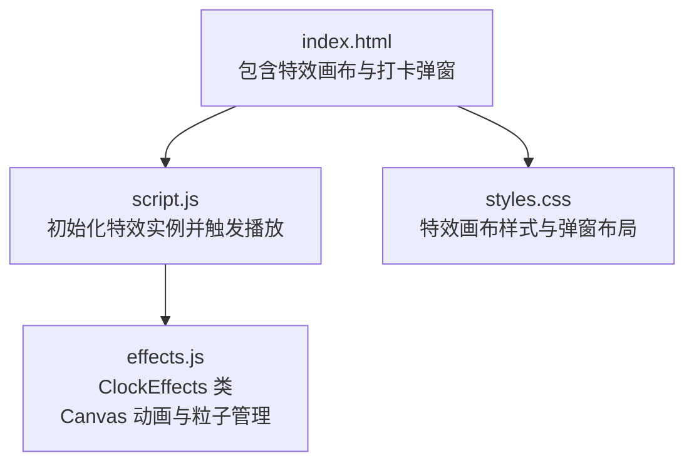
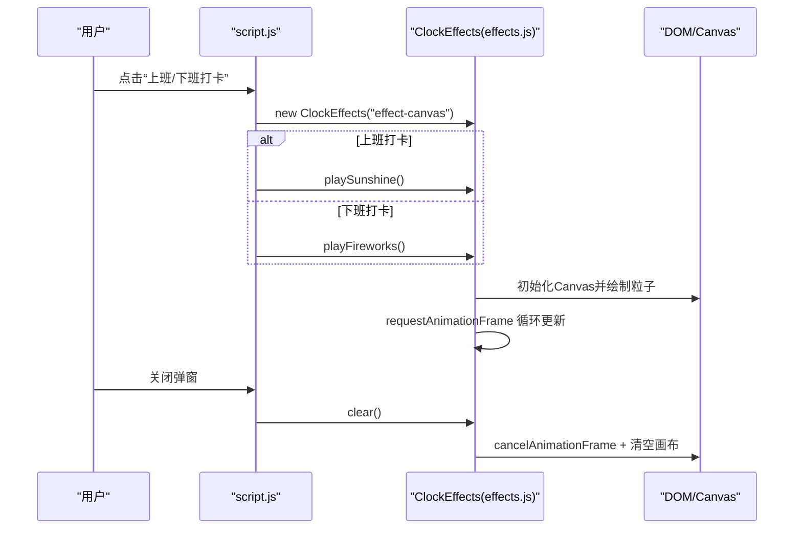
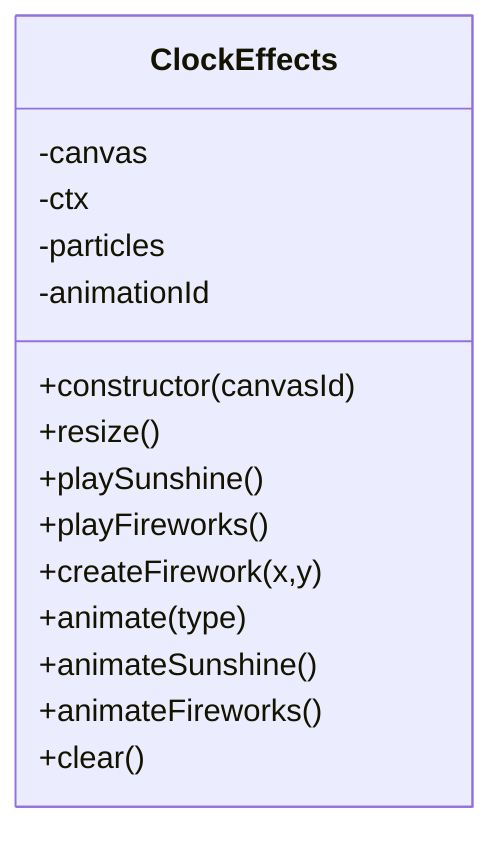
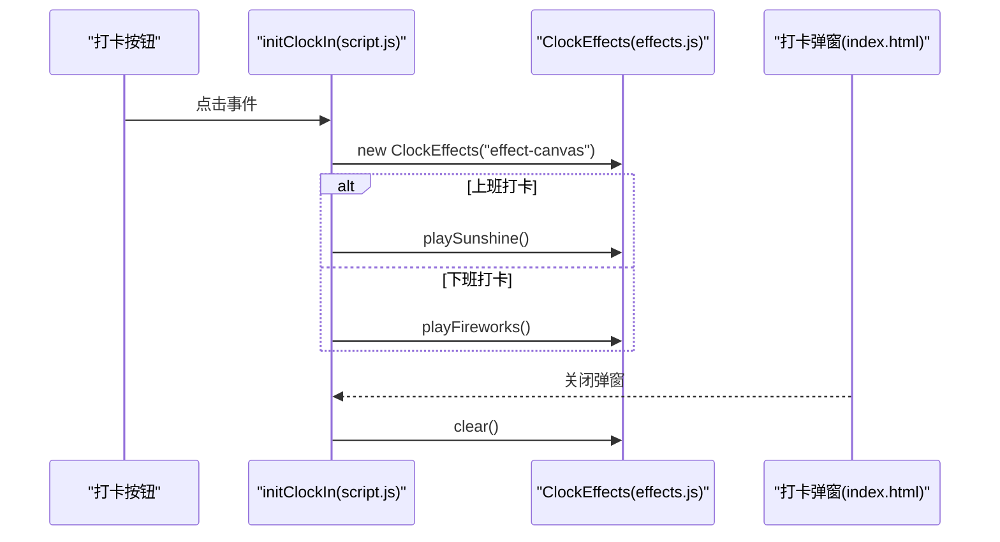
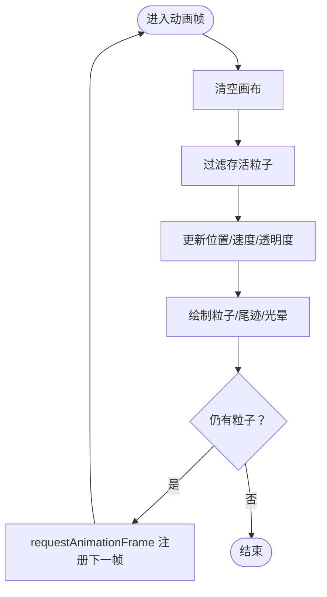
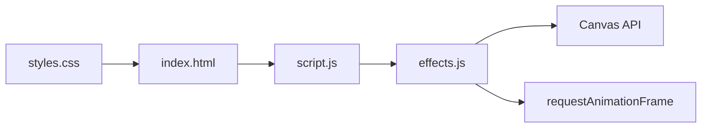

# 性能与特效测试指南

<cite>
**本文引用的文件**
- [effects.js](file://effects.js)
- [script.js](file://script.js)
- [index.html](file://index.html)
- [styles.css](file://styles.css)
- [TEST_CHECKLIST_v1.3.3.md](file://TEST_CHECKLIST_v1.3.3.md)
- [README.md](file://README.md)
</cite>

## 目录
1. [引言](#引言)
2. [项目结构](#项目结构)
3. [核心组件](#核心组件)
4. [架构总览](#架构总览)
5. [详细组件分析](#详细组件分析)
6. [依赖关系分析](#依赖关系分析)
7. [性能考量](#性能考量)
8. [故障排查指南](#故障排查指南)
9. [结论](#结论)
10. [附录](#附录)

## 引言
本指南依据测试清单对 Canvas 动画特效系统进行性能评估，聚焦“上班打卡阳光特效”和“下班打卡礼花特效”。目标是在不同性能设备上确保动画流畅、内存占用可控，并验证 requestAnimationFrame 的正确使用与过期粒子的自动清理。同时提供使用开发者工具监控帧率与内存的方法，以及在不同设备上的稳定性保障策略。

## 项目结构
- 特效系统位于独立模块中，通过 Canvas 全屏绘制粒子，配合打卡弹窗展示。
- 打卡流程在主脚本中触发特效播放，并在弹窗关闭时清理动画。
- 样式层确保特效画布覆盖弹窗层级，不影响内容交互。

图表来源
- [index.html](file://index.html#L120-L165)
- [script.js](file://script.js#L546-L732)
- [effects.js](file://effects.js#L1-L279)
- [styles.css](file://styles.css#L1984-L2000)

章节来源
- [index.html](file://index.html#L120-L165)
- [script.js](file://script.js#L546-L732)
- [effects.js](file://effects.js#L1-L279)
- [styles.css](file://styles.css#L1984-L2000)

## 核心组件
- ClockEffects 类：负责 Canvas 初始化、粒子创建、动画循环、清理与生命周期管理。
- 打卡流程：在点击“上班/下班打卡”按钮时创建特效实例并播放对应特效；关闭弹窗时调用清理方法。
- 弹窗与画布：特效画布全屏覆盖，指针事件透传，避免影响弹窗交互。

章节来源
- [effects.js](file://effects.js#L1-L279)
- [script.js](file://script.js#L546-L732)
- [index.html](file://index.html#L120-L165)
- [styles.css](file://styles.css#L1984-L2000)

## 架构总览
特效系统采用“模块化类 + 主流程触发”的架构：ClockEffects 封装动画细节，script.js 在合适时机创建实例并播放，弹窗关闭时统一清理，确保资源回收与性能稳定。

图表来源
- [script.js](file://script.js#L546-L732)
- [effects.js](file://effects.js#L1-L279)
- [index.html](file://index.html#L120-L165)

## 详细组件分析

### ClockEffects 类（特效引擎）
- Canvas 初始化与尺寸适配：构造时获取画布并监听窗口尺寸变化，确保全屏覆盖。
- 粒子系统：
  - 阳光特效：创建大量小光点与若干大型光晕粒子，带闪烁与轻微水平漂移。
  - 礼花特效：按批次创建多组粒子，带重力与摩擦，形成爆炸扩散与尾迹效果。
- 动画循环：
  - 使用 requestAnimationFrame 驱动每帧更新，基于粒子属性（速度、重力、摩擦、透明度、寿命）推进状态。
  - 过期粒子通过过滤器剔除，避免累积。
- 清理机制：
  - clear 方法取消动画帧、清空画布、重置粒子数组，防止内存泄漏与残留绘制。

图表来源
- [effects.js](file://effects.js#L1-L279)

章节来源
- [effects.js](file://effects.js#L1-L279)

### 打卡流程与特效触发
- 打卡按钮状态根据本地存储判断，区分“上班/下班/已完成”三种状态。
- 触发流程：
  - 创建 ClockEffects 实例并播放对应特效。
  - 弹窗关闭时调用 clear，确保动画与画布清理。
- 弹窗与画布：
  - 特效画布为绝对定位全屏覆盖，指针事件透传，不影响关闭按钮与内容交互。

图表来源
- [script.js](file://script.js#L546-L732)
- [index.html](file://index.html#L120-L165)
- [effects.js](file://effects.js#L1-L279)

章节来源
- [script.js](file://script.js#L546-L732)
- [index.html](file://index.html#L120-L165)
- [effects.js](file://effects.js#L1-L279)

### 动画算法与性能要点
- 阳光特效：
  - 垂直下降 + 轻微水平偏移 + 闪烁 alpha，视觉柔和。
  - 过滤条件：仅保留仍在屏幕范围内的粒子，避免无限增长。
- 礼花特效：
  - 粒子围绕中心爆炸，受重力与摩擦影响，尾迹与核心亮点区分。
  - 生命周期：alpha 递减至 0 后过滤，确保资源回收。
- requestAnimationFrame 使用：
  - 每帧结束后注册下一帧回调，避免 setTimout 循环导致的抖动与卡顿。
- 内存与资源：
  - clear 中取消动画帧、清空画布、重置粒子数组，防止泄漏。
  - 画布尺寸随窗口变化，避免缩放失真与过度绘制。

图表来源
- [effects.js](file://effects.js#L144-L260)

章节来源
- [effects.js](file://effects.js#L144-L260)

## 依赖关系分析
- 依赖关系：
  - script.js 依赖 ClockEffects 类，负责实例化与触发播放。
  - ClockEffects 依赖 Canvas API 与 requestAnimationFrame。
  - index.html 提供特效画布与弹窗结构，styles.css 提供画布样式与弹窗布局。
- 耦合与内聚：
  - ClockEffects 内聚于动画逻辑，与 UI 解耦，便于测试与维护。
  - 打卡流程通过事件驱动，降低模块间耦合。

图表来源
- [script.js](file://script.js#L546-L732)
- [effects.js](file://effects.js#L1-L279)
- [index.html](file://index.html#L120-L165)
- [styles.css](file://styles.css#L1984-L2000)

章节来源
- [script.js](file://script.js#L546-L732)
- [effects.js](file://effects.js#L1-L279)
- [index.html](file://index.html#L120-L165)
- [styles.css](file://styles.css#L1984-L2000)

## 性能考量
- 动画帧率与卡顿检测
  - 使用浏览器开发者工具的 Performance 面板录制交互，观察帧耗时分布与掉帧点。
  - 使用 Memory 面板定期快照，对比“播放特效前后”的堆内存峰值，确认无泄漏。
- Canvas 性能优化建议
  - 控制粒子数量：根据设备性能动态调整粒子密度（例如在低端设备减少粒子数）。
  - 合理使用渐变与透明度：避免过多径向渐变叠加，必要时合并绘制批次。
  - 减少全局状态变更：尽量在每帧内局部更新，避免频繁查询 DOM。
- requestAnimationFrame 使用
  - 确保每帧只注册一次下一帧回调，避免重复注册导致的帧率抖动。
  - 在 clear 中取消动画帧，防止后台继续渲染。
- 内存与资源清理
  - 每次播放前 clear，确保粒子数组为空，避免累积。
  - 弹窗关闭时再次 clear，防止误触或异常退出导致的残留。
- 设备差异与稳定性
  - 在低端机/移动设备上验证：帧率稳定、无明显掉帧、内存峰值可控。
  - 对于高分辨率屏，注意 Canvas 像素比与缩放，避免过度绘制。

章节来源
- [effects.js](file://effects.js#L144-L260)
- [script.js](file://script.js#L546-L732)

## 故障排查指南
- 现象：特效不播放或画面空白
  - 检查特效画布是否存在且尺寸有效。
  - 确认已调用 playSunshine 或 playFireworks。
- 现象：特效播放后仍占用内存
  - 确认弹窗关闭时调用了 clear。
  - 使用 Memory 面板快照对比，确认堆内存未持续增长。
- 现象：卡顿或掉帧
  - 使用 Performance 面板录制，定位高耗时阶段。
  - 适当减少粒子数量或简化绘制逻辑。
- 现象：粒子未自动消失
  - 检查过滤逻辑与 alpha/life 更新是否生效。
  - 确认 requestAnimationFrame 是否被取消或重复注册。

章节来源
- [effects.js](file://effects.js#L144-L260)
- [script.js](file://script.js#L546-L732)

## 结论
本方案基于 ClockEffects 的模块化设计与 requestAnimationFrame 的高效渲染，结合严格的清理流程，可在不同性能设备上实现稳定的 Canvas 动画。通过测试清单中的性能项与开发者工具监控，可系统性验证流畅度、内存占用与资源清理，确保特效体验在低端与高端设备上均保持一致。

## 附录

### 开发者工具使用指南（帧率与内存）
- 帧率监控
  - 打开开发者工具 -> Performance 面板 -> 录制交互（播放特效）-> 分析帧耗时与掉帧。
- 内存监控
  - 打开开发者工具 -> Memory 面板 -> Heap Snapshot（播放前后各一次）-> 对比堆内存峰值。
- 断点与日志
  - 在特效播放与清理的关键路径添加断点，观察粒子数量与动画帧回调频率。

章节来源
- [effects.js](file://effects.js#L144-L260)
- [script.js](file://script.js#L546-L732)

### 测试清单对照与评估要点
- 阳光特效（上班打卡）
  - 自动播放、50个光点、光晕效果、流畅无卡顿、关闭弹窗自动清除。
- 礼花特效（下班打卡）
  - 自动播放、多组爆炸、重力与尾迹、颜色随机、流畅无卡顿、关闭弹窗自动清除。
- 性能测试
  - Canvas 初始化正确、使用 requestAnimationFrame、过期粒子自动清理、内存占用正常。

章节来源
- [TEST_CHECKLIST_v1.3.3.md](file://TEST_CHECKLIST_v1.3.3.md#L58-L80)
- [README.md](file://README.md#L43-L56)