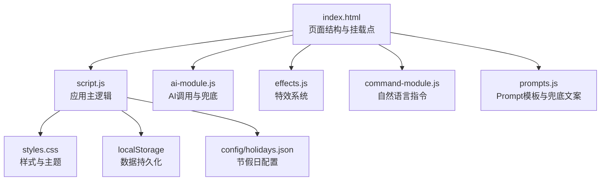
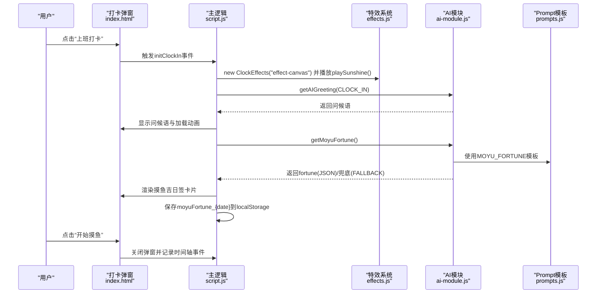
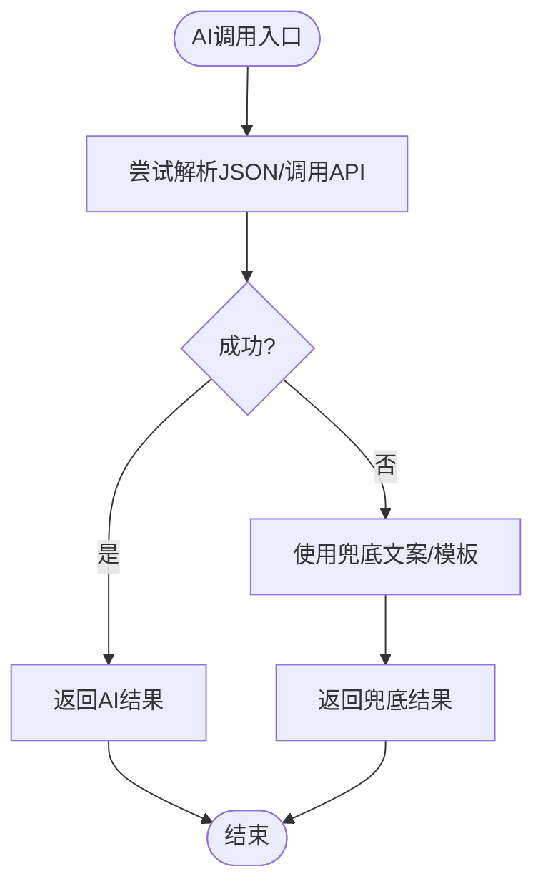
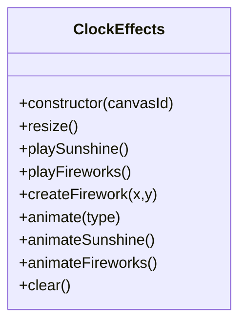
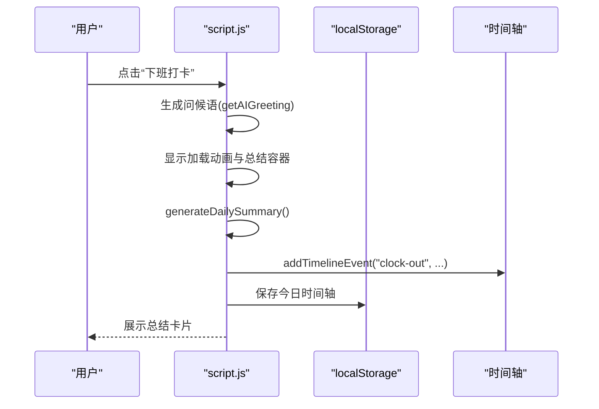
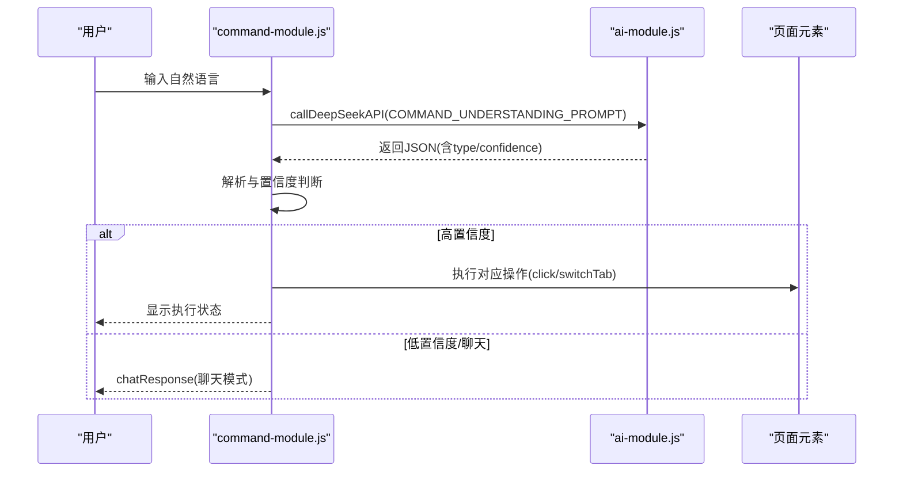
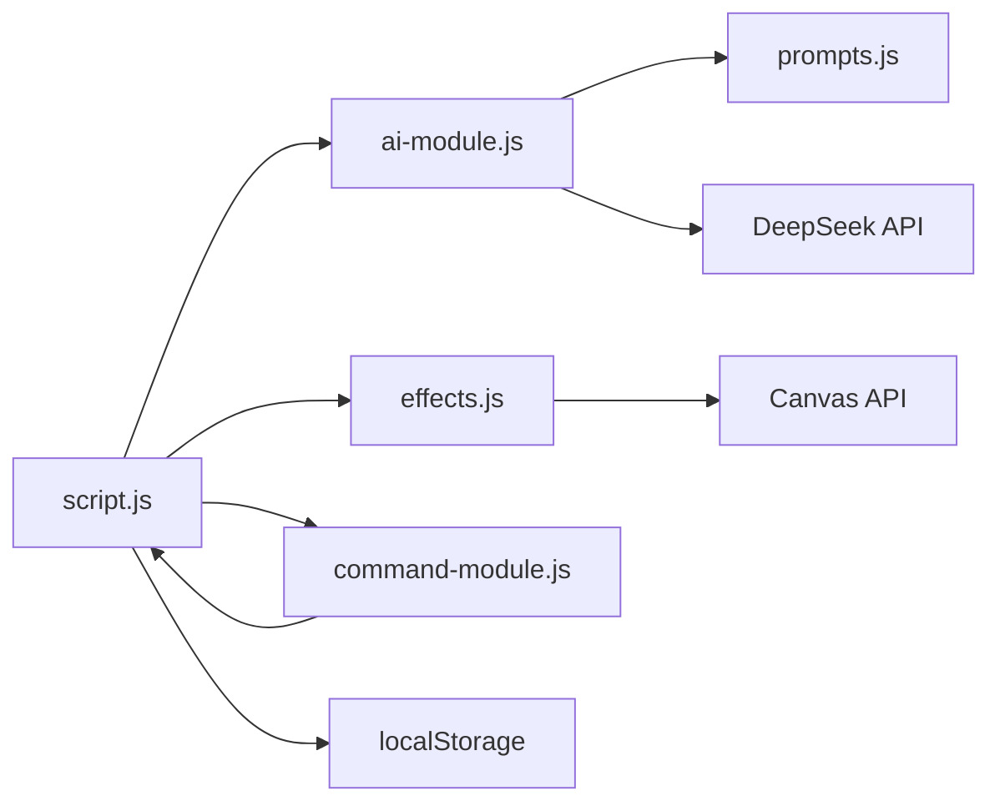

# 测试策略与流程

<cite>
**本文引用的文件**
- [TEST_CHECKLIST_v1.3.3.md](file://TEST_CHECKLIST_v1.3.3.md)
- [RELEASE_v1.3.3.md](file://RELEASE_v1.3.3.md)
- [README.md](file://README.md)
- [CHANGELOG.md](file://CHANGELOG.md)
- [index.html](file://index.html)
- [script.js](file://script.js)
- [ai-module.js](file://ai-module.js)
- [effects.js](file://effects.js)
- [command-module.js](file://command-module.js)
- [prompts.js](file://prompts.js)
- [styles.css](file://styles.css)
- [config/holidays.json](file://config/holidays.json)
</cite>

## 目录
1. [引言](#引言)
2. [项目结构](#项目结构)
3. [核心组件](#核心组件)
4. [架构总览](#架构总览)
5. [详细组件分析](#详细组件分析)
6. [依赖关系分析](#依赖关系分析)
7. [性能考量](#性能考量)
8. [故障排查指南](#故障排查指南)
9. [结论](#结论)
10. [附录](#附录)

## 引言
本测试策略围绕 Work Timer v1.3.3 的核心功能展开，涵盖功能测试、兼容性测试、边界情况测试、AI兜底机制验证、特效系统性能与稳定性验证、数据持久化可靠性验证，以及回归测试与手动测试流程。目标是帮助开发者编写全面的测试覆盖，确保代码质量与用户体验稳定一致。

## 项目结构
Work Timer 采用前端单页应用结构，核心逻辑集中在脚本文件中，AI 与特效分别以模块化方式引入，UI 与交互通过 HTML/CSS 实现。关键模块包括：
- 首次设置与初始化：设置弹窗、工作时间、月工资、发薪日等
- 打卡流程：上班/下班打卡、问候语、摸鱼吉日签、工作总结
- AI 功能：DeepSeek API 调用、兜底文案、Prompt 模板
- 特效系统：Canvas 全屏动画（阳光/礼花）
- 自然语言指令：意图识别与执行
- 数据持久化：localStorage 存储与按日隔离

图表来源
- [index.html](file://index.html#L1-L120)
- [script.js](file://script.js#L1-L120)
- [ai-module.js](file://ai-module.js#L1-L60)
- [effects.js](file://effects.js#L1-L40)
- [command-module.js](file://command-module.js#L1-L60)
- [prompts.js](file://prompts.js#L1-L40)
- [styles.css](file://styles.css#L1-L60)
- [config/holidays.json](file://config/holidays.json#L1-L46)

章节来源
- [index.html](file://index.html#L1-L120)
- [script.js](file://script.js#L1-L120)

## 核心组件
- 首次设置与初始化：负责加载/保存工作时间、月工资、发薪日、节假日配置；控制页面初始化与标签页切换。
- 打卡流程：根据当天状态决定按钮文案与行为，触发问候语、摸鱼吉日签、工作总结；记录时间轴事件。
- AI 功能：封装 DeepSeek API 调用、JSON 解析、兜底机制与 Prompt 模板；提供问候语、摸鱼吉日签、工作总结、分析内容等。
- 特效系统：ClockEffects 类封装 Canvas 动画，支持阳光与礼花两种特效，使用 requestAnimationFrame，自动清理过期粒子。
- 自然语言指令：解析用户输入，判断意图置信度，执行对应操作或进入聊天模式。
- 数据持久化：使用 localStorage 存储工作时间、月工资、每日运势、时间轴、开发者模式等；按日期隔离每日运势。

章节来源
- [script.js](file://script.js#L160-L240)
- [script.js](file://script.js#L493-L732)
- [ai-module.js](file://ai-module.js#L1-L120)
- [ai-module.js](file://ai-module.js#L120-L215)
- [effects.js](file://effects.js#L1-L120)
- [command-module.js](file://command-module.js#L1-L120)
- [prompts.js](file://prompts.js#L1-L80)

## 架构总览
下面的序列图展示了“上班打卡”到“摸鱼吉日签”的端到端流程，包括特效播放与 AI 兜底机制。

图表来源
- [index.html](file://index.html#L120-L170)
- [script.js](file://script.js#L546-L732)
- [effects.js](file://effects.js#L25-L62)
- [ai-module.js](file://ai-module.js#L95-L167)
- [prompts.js](file://prompts.js#L1-L40)

## 详细组件分析

### 功能测试清单与实施要点
- 首次设置测试：验证弹窗出现、时间设置合理性校验、月工资保存、发薪日类型与日期、localStorage 写入。
- 上班打卡流程：验证问候语、阳光特效、加载状态、摸鱼吉日签卡片渲染、再求一签、开始摸鱼、Header 横幅显示、时间轴记录。
- 下班打卡流程：验证问候语、礼花特效、加载状态、工作总结卡片、今日收入高亮、时间轴记录。
- 工资计算测试：验证月工资输入、日薪计算（按当月天数）、跨月/闰年正确性、修改月工资后日薪更新。
- AI 总结测试：验证占位符替换、兜底文案、幽默风格。
- 特效系统测试：验证 Canvas 初始化、粒子数量与效果、重力/光晕、requestAnimationFrame 使用、关闭弹窗自动清理。
- 设置页面测试：验证月工资输入框显示与更新、localStorage 正确写入与读取。
- 数据持久化测试：验证 monthlySalary、moyuFortune_{date}、刷新不丢失、跨日自动清理。
- UI/UX 测试：验证样式、布局、响应式、按钮状态、弹窗交互。
- 兼容性测试：验证 Chrome/Safari/Firefox/Edge、移动端 Safari/Chrome。
- 边界情况测试：默认月工资、未打上班卡时下班显示“未知”、无摸鱼记录显示 0、AI 超时/网络断开兜底。
- 回归测试：确保倒计时、番茄钟、日历、时间轴、AI 助手、快捷功能、设置保存正常。

章节来源
- [TEST_CHECKLIST_v1.3.3.md](file://TEST_CHECKLIST_v1.3.3.md#L1-L178)
- [RELEASE_v1.3.3.md](file://RELEASE_v1.3.3.md#L90-L170)
- [README.md](file://README.md#L32-L60)

### AI 功能兜底机制验证
- JSON 解析兜底：getMoyuFortune 在无法解析 JSON 时返回 FALLBACK_MESSAGES.MOYU_FORTUNE。
- 错误传播：generateWorkSummary/callAIAnalysis 在异常时返回 FALLBACK_MESSAGES 或随机兜底文案，并携带 error 字段。
- API 密钥校验：callDeepSeekAPI 在未配置密钥时报错；initAISettings 提供保存与测试连接。
- 意图置信度：processCommand 在置信度低于阈值时进入聊天模式，不执行操作。

图表来源
- [ai-module.js](file://ai-module.js#L95-L167)
- [ai-module.js](file://ai-module.js#L169-L215)
- [prompts.js](file://prompts.js#L120-L159)

章节来源
- [ai-module.js](file://ai-module.js#L95-L215)
- [prompts.js](file://prompts.js#L120-L159)

### 特效系统性能与稳定性验证
- Canvas 初始化：ClockEffects 构造函数设置全屏尺寸并监听 resize。
- 动画循环：animateSunshine/animateFireworks 使用 requestAnimationFrame，过滤过期粒子并清理。
- 粒子生命周期：太阳特效创建更多光点与光晕，礼花特效创建爆炸粒子与内圈闪光，均具备重力与摩擦。
- 内存与性能：调试日志显示粒子数量，clear 在关闭弹窗时取消动画帧并清空画布。

图表来源
- [effects.js](file://effects.js#L1-L279)

章节来源
- [effects.js](file://effects.js#L1-L279)

### 打卡流程与数据持久化
- 打卡状态机：根据 lastClockInType 与 lastClockInDate 切换按钮文案与行为；FINISHED 状态直接显示总结。
- 问候语与总结：getAIGreeting 与 generateWorkSummary；下班时记录 clock-out 时间轴事件。
- 持久化策略：localStorage 存储工作时间、月工资、每日运势、时间轴；按日期隔离，跨日自动清理。
- Header 展示：loadDailyNote 与 displayDailyNote 在 header 中显示当日运势。

图表来源
- [script.js](file://script.js#L546-L732)
- [script.js](file://script.js#L734-L800)

章节来源
- [script.js](file://script.js#L1-L120)
- [script.js](file://script.js#L546-L732)
- [script.js](file://script.js#L734-L800)

### 自然语言指令与聊天模式
- 意图识别：processCommand 使用较低温度与固定 Prompt，返回 JSON，包含 type/confidence/params/chat_response。
- 执行动作：executeCommand 根据 COMMAND_TYPES 触发对应 UI 事件或切换标签页。
- 低置信度处理：低于阈值时仅聊天，不执行操作。

图表来源
- [command-module.js](file://command-module.js#L1-L120)
- [command-module.js](file://command-module.js#L180-L260)
- [ai-module.js](file://ai-module.js#L1-L60)

章节来源
- [command-module.js](file://command-module.js#L1-L313)

### UI/UX 与样式验证
- 摸鱼吉日签卡片：黄色渐变背景、金色边框、按钮样式、响应式布局。
- 工作总结卡片：蓝色渐变 AI 文案区、2x2 数据网格、今日收入高亮。
- 打卡弹窗：全屏 Canvas、特效不遮挡内容、倒计时与关闭交互。

章节来源
- [styles.css](file://styles.css#L400-L480)
- [styles.css](file://styles.css#L700-L800)
- [index.html](file://index.html#L120-L170)

## 依赖关系分析
- 模块耦合：
  - script.js 依赖 ai-module.js、effects.js、command-module.js、prompts.js、styles.css。
  - ai-module.js 依赖 prompts.js 与 localStorage。
  - effects.js 依赖 DOM Canvas。
  - command-module.js 依赖 script.js 的 UI 控件与 switchTab。
- 外部依赖：
  - DeepSeek API（受 API Key 影响）。
  - localStorage（浏览器特性）。
  - Canvas API（浏览器特性）。

图表来源
- [script.js](file://script.js#L1-L120)
- [ai-module.js](file://ai-module.js#L1-L60)
- [effects.js](file://effects.js#L1-L40)
- [command-module.js](file://command-module.js#L1-L60)
- [prompts.js](file://prompts.js#L1-L40)

章节来源
- [script.js](file://script.js#L1-L120)
- [ai-module.js](file://ai-module.js#L1-L60)
- [effects.js](file://effects.js#L1-L40)
- [command-module.js](file://command-module.js#L1-L60)
- [prompts.js](file://prompts.js#L1-L40)

## 性能考量
- 动画性能：使用 requestAnimationFrame 替代 setInterval，避免卡顿。
- 粒子管理：过滤过期粒子并及时清理，避免内存泄漏。
- Canvas 优化：全屏尺寸随窗口变化，减少重绘。
- AI 调用：合理设置 maxTokens 与 temperature，避免超时与资源浪费。
- UI 交互：弹窗与模态框的显示/隐藏应配合特效清理，避免残留绘制。

章节来源
- [effects.js](file://effects.js#L135-L200)
- [effects.js](file://effects.js#L203-L273)
- [ai-module.js](file://ai-module.js#L1-L60)

## 故障排查指南
- AI 调用失败：
  - 检查 API Key 是否保存；使用“测试连接”验证连通性。
  - 若返回非 JSON，确认 Prompt 模板与返回格式一致性。
- 特效异常：
  - 确认 Canvas 元素存在且尺寸正确；检查 resize 事件绑定。
  - 关闭弹窗后是否调用 clear 清理动画帧。
- 打卡状态异常：
  - 检查 lastClockInType/lastClockInDate 与日期是否跨日重置。
  - FINISHED 状态是否正确显示总结。
- 数据持久化异常：
  - 检查 localStorage 中 monthlySalary、moyuFortune_{date}、timeline_{today} 是否存在。
  - 跨日是否自动清理上一日运势。

章节来源
- [script.js](file://script.js#L493-L732)
- [effects.js](file://effects.js#L262-L279)
- [ai-module.js](file://ai-module.js#L1-L60)

## 结论
本测试策略围绕 v1.3.3 的新增功能与关键路径，提供了从功能、兼容性、边界到性能与持久化的系统化验证方案。通过对照测试清单与端到端流程图，开发者可高效构建自动化与手动测试组合，确保 AI 兜底、特效性能与数据可靠性达到预期。

## 附录
- 测试用例设计思路
  - 功能测试：按清单逐项验证 UI 行为、数据写入与展示。
  - 兼容性测试：在主流浏览器与移动端验证交互与样式。
  - 边界测试：默认值、空值、跨日、网络异常、超时。
  - 性能测试：FPS 监测、粒子数量上限、内存占用。
  - 回归测试：保留原有功能不受影响。
- 手动测试流程与预期结果
  - 首次设置：保存后 localStorage 写入，下次打开仍生效。
  - 上班打卡：播放阳光特效，显示摸鱼吉日签卡片，Header 展示运势。
  - 下班打卡：播放礼花特效，显示工作总结，今日收入高亮。
  - 设置页面：月工资输入框显示当前值，保存后更新。
  - 数据持久化：刷新不丢失，跨日自动清理。
  - AI 兜底：API 失败时显示兜底文案，错误信息可回显。
  - 特效性能：动画流畅，关闭弹窗后清理干净。

章节来源
- [TEST_CHECKLIST_v1.3.3.md](file://TEST_CHECKLIST_v1.3.3.md#L1-L178)
- [RELEASE_v1.3.3.md](file://RELEASE_v1.3.3.md#L90-L170)
- [README.md](file://README.md#L32-L60)
- [CHANGELOG.md](file://CHANGELOG.md#L1-L130)