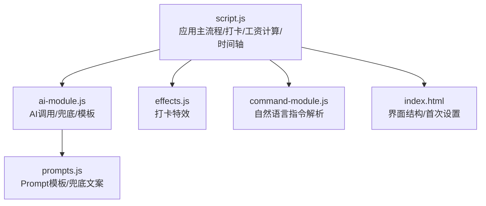
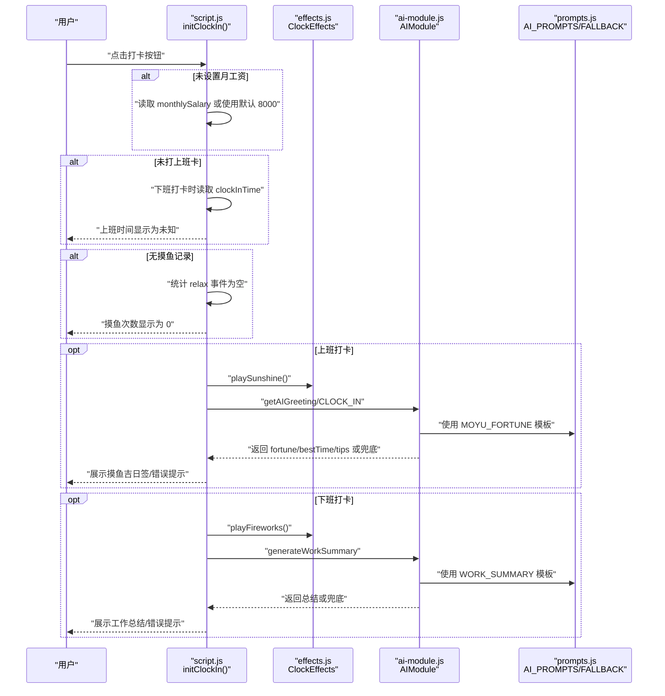
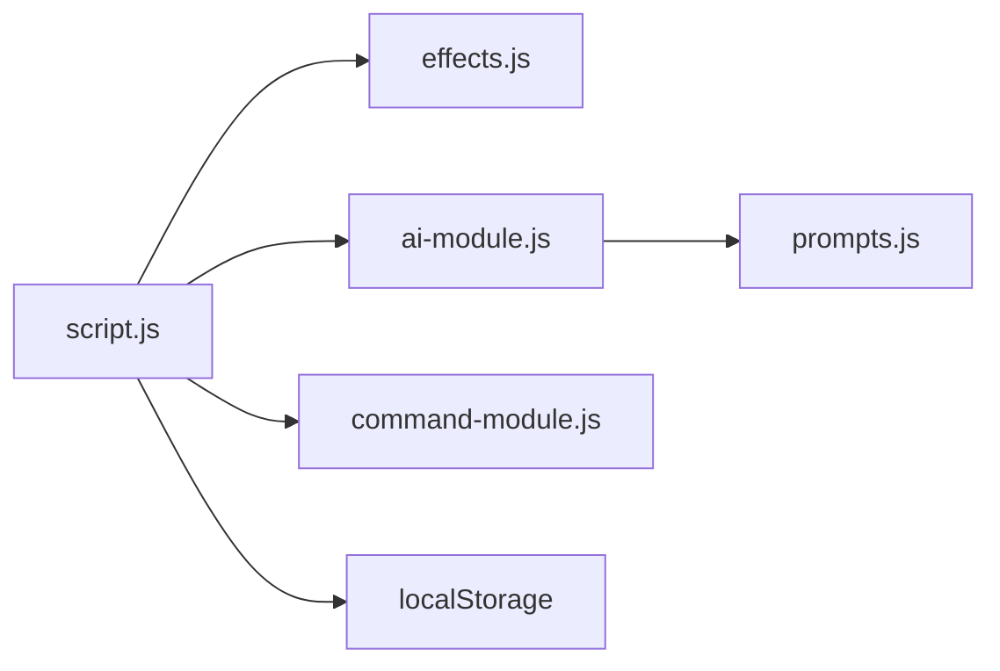

# 边界情况测试指南

<cite>
**本文引用的文件**
- [TEST_CHECKLIST_v1.3.3.md](file://TEST_CHECKLIST_v1.3.3.md)
- [script.js](file://script.js)
- [ai-module.js](file://ai-module.js)
- [prompts.js](file://prompts.js)
- [effects.js](file://effects.js)
- [command-module.js](file://command-module.js)
- [README.md](file://README.md)
- [index.html](file://index.html)
</cite>

## 目录
1. [引言](#引言)
2. [项目结构](#项目结构)
3. [核心组件](#核心组件)
4. [架构总览](#架构总览)
5. [详细组件分析](#详细组件分析)
6. [依赖关系分析](#依赖关系分析)
7. [性能考量](#性能考量)
8. [故障排查指南](#故障排查指南)
9. [结论](#结论)
10. [附录](#附录)

## 引言
本指南围绕 TEST_CHECKLIST_v1.3.3.md 中列出的边界情况测试项，结合 script.js、ai-module.js、prompts.js、effects.js、command-module.js 等源码中的条件判断与异常处理逻辑，提供可操作的测试步骤与验证方法，确保系统在未设置月工资、未打上班卡直接下班、无摸鱼记录、AI调用超时/网络断开等异常场景下仍能保持健壮性与用户体验连续性。

## 项目结构
- 主入口与应用初始化集中在 script.js，负责打卡流程、工资计算、时间轴、AI设置与命令控制等。
- AI相关能力封装在 ai-module.js，包括 DeepSeek API 调用、Prompt 模板与兜底文案。
- 兜底文案与 Prompt 模板集中于 prompts.js。
- 打卡特效由 effects.js 提供 Canvas 动画。
- 自然语言指令解析与执行在 command-module.js，配合 AI 模块实现意图识别与动作执行。

图表来源
- [script.js](file://script.js#L493-L732)
- [ai-module.js](file://ai-module.js#L1-L216)
- [effects.js](file://effects.js#L1-L279)
- [command-module.js](file://command-module.js#L1-L313)
- [prompts.js](file://prompts.js#L1-L159)
- [index.html](file://index.html#L185-L211)

章节来源
- [README.md](file://README.md#L1-L125)
- [index.html](file://index.html#L185-L211)

## 核心组件
- 打卡流程与状态机：根据 lastClockInType 与 lastClockInDate 控制按钮文案与行为；FINISHED 状态允许直接查看下班总结。
- 工资计算：按月工资与当月天数计算日薪；若未设置月工资，默认使用 8000 元。
- 摸鱼吉日签：上班打卡时生成运势、最佳时间与锦囊；AI 失败时使用兜底数据。
- 工作总结：下班打卡时生成幽默总结，包含上班时间、下班时间、摸鱼次数、今日收入；AI 失败时使用兜底文案。
- 特效系统：上班打卡播放阳光特效，下班打卡播放礼花特效。
- 自然语言指令：通过 AI 模块理解用户意图，执行对应操作；低置信度时进入聊天模式。

章节来源
- [script.js](file://script.js#L493-L732)
- [script.js](file://script.js#L3063-L3077)
- [ai-module.js](file://ai-module.js#L95-L167)
- [prompts.js](file://prompts.js#L122-L158)
- [effects.js](file://effects.js#L1-L279)
- [command-module.js](file://command-module.js#L182-L259)

## 架构总览
下图展示了边界场景下的关键调用链路与降级策略。

图表来源
- [script.js](file://script.js#L493-L732)
- [effects.js](file://effects.js#L1-L279)
- [ai-module.js](file://ai-module.js#L95-L167)
- [prompts.js](file://prompts.js#L1-L159)

## 详细组件分析

### 未设置月工资时的默认值处理
- 场景目标：当用户未设置月工资时，系统应使用默认值 8000 元参与日薪计算。
- 关键实现点：
  - 首次设置与更新设置时，若未填写月工资，默认写入 8000。
  - 日薪计算时，若未读取到月工资，使用 8000。
- 测试步骤：
  - 清空 localStorage 中的 monthlySalary，重启应用。
  - 触发日薪计算逻辑，验证日薪基于 8000 计算。
  - 在设置页面清空月工资输入并保存，确认保存后仍为 8000。
- 验证要点：
  - 未设置时默认值生效。
  - 设置页面保存后，localStorage 中存在 monthlySalary=8000。

章节来源
- [script.js](file://script.js#L186-L210)
- [script.js](file://script.js#L1214-L1270)
- [script.js](file://script.js#L3063-L3077)
- [index.html](file://index.html#L185-L211)

### 未打卡上班时的下班打卡容错机制
- 场景目标：当用户未打上班卡直接下班时，系统应优雅降级，显示“未知”或兜底文案。
- 关键实现点：
  - 下班总结生成时读取 clockInTime，若不存在则不展示具体时间。
  - FINISHED 状态允许直接查看总结，无需实际打上班卡。
- 测试步骤：
  - 不进行上班打卡，直接点击下班打卡。
  - 观察总结中“上班时间”的展示是否为“未知”或兜底文案。
  - 确认 FINISHED 状态按钮文案与行为正常。
- 验证要点：
  - 未打上班卡时，总结中上班时间字段显示为兜底/未知。
  - FINISHED 状态可直接查看总结。

章节来源
- [script.js](file://script.js#L523-L545)
- [script.js](file://script.js#L575-L615)
- [script.js](file://script.js#L734-L778)

### 无摸鱼记录时的数据展示
- 场景目标：当当天无摸鱼记录时，系统应显示“0 次”或友好提示。
- 关键实现点：
  - 统计 relax 事件，若为空则输出“今天工作很专注，没有摸鱼记录”等文案。
- 测试步骤：
  - 不触发任何摸鱼事件，直接下班打卡。
  - 观察总结中“摸鱼次数”的展示是否为 0 或友好文案。
- 验证要点：
  - 无记录时显示 0 或鼓励性文案，不出现异常。

章节来源
- [script.js](file://script.js#L734-L778)

### AI 调用超时与网络断开时的功能降级
- 场景目标：当 AI 调用失败或网络异常时，系统应使用兜底文案并提示错误。
- 关键实现点：
  - AIModule 对 getMoyuFortune/generateWorkSummary/callAIAnalysis 进行 try/catch，失败时返回 isAI=false 的兜底数据。
  - prompts.js 提供 FALLBACK_MESSAGES，包含摸鱼吉日签与工作总结的兜底内容。
  - script.js 在展示阶段检测 isAI=false 并显示错误提示。
- 测试步骤：
  - 断开网络或模拟 API 失败，触发摸鱼吉日签生成。
  - 观察是否使用兜底 fortune/bestTime/tips。
  - 触发工作总结生成，观察是否使用兜底文案。
  - 确认错误信息显示在 UI 上。
- 验证要点：
  - AI 失败时使用兜底数据，UI 显示错误提示。
  - 总结文案包含兜底内容，不崩溃。

章节来源
- [ai-module.js](file://ai-module.js#L95-L167)
- [prompts.js](file://prompts.js#L122-L158)
- [script.js](file://script.js#L648-L661)
- [script.js](file://script.js#L698-L724)

### 打卡特效与 Canvas 性能
- 场景目标：确保特效在弹窗关闭时自动清理，避免内存泄漏。
- 关键实现点：
  - effects.js 在 clear() 中取消动画帧、清空画布、重置粒子数组。
  - script.js 在关闭弹窗时调用 effects.clear()。
- 测试步骤：
  - 上班/下班分别播放特效，关闭弹窗。
  - 多次触发，确认无残留粒子与动画。
- 验证要点：
  - 关闭弹窗后特效自动清理，Canvas 正常回收。

章节来源
- [effects.js](file://effects.js#L262-L273)
- [script.js](file://script.js#L563-L574)

### 自然语言指令的意图识别与低置信度处理
- 场景目标：当用户输入模糊或非操作性语句时，系统应进入聊天模式并提示。
- 关键实现点：
  - command-module.js 使用较低温度与置信度阈值（0.7），低于阈值进入聊天模式。
  - 若解析失败，返回友好提示。
- 测试步骤：
  - 输入“你好”、“今天天气怎么样”等闲聊语句。
  - 观察是否进入聊天模式并显示友好回复。
  - 输入“开始番茄钟”等明确指令，验证执行成功。
- 验证要点：
  - 低置信度进入聊天模式，明确提示。
  - 明确指令可被正确执行。

章节来源
- [command-module.js](file://command-module.js#L182-L259)

## 依赖关系分析
- 组件耦合：
  - script.js 依赖 effects.js（特效）、ai-module.js（AI）、prompts.js（模板/兜底）、command-module.js（自然语言）。
  - ai-module.js 依赖 prompts.js 的模板与兜底。
- 外部依赖：
  - DeepSeek API（通过 ai-module.js 调用）。
- 潜在风险：
  - 若未配置 API Key，AI 功能受限；需引导用户在设置中配置。
  - localStorage 缺失或损坏会影响默认值与持久化数据。

图表来源
- [script.js](file://script.js#L493-L732)
- [ai-module.js](file://ai-module.js#L1-L216)
- [effects.js](file://effects.js#L1-L279)
- [command-module.js](file://command-module.js#L1-L313)
- [prompts.js](file://prompts.js#L1-L159)

## 性能考量
- Canvas 动画：
  - 使用 requestAnimationFrame 控制动画，避免 setIntervals。
  - 粒子过期自动清理，降低内存占用。
- AI 调用：
  - 采用兜底策略，避免长时间等待导致 UI 卡顿。
  - 错误时快速返回兜底文案，保证交互流畅。

章节来源
- [effects.js](file://effects.js#L136-L201)
- [effects.js](file://effects.js#L203-L260)
- [ai-module.js](file://ai-module.js#L95-L167)

## 故障排查指南
- 未设置月工资
  - 现象：日薪计算异常或显示 NaN。
  - 处理：确认 localStorage 中 monthlySalary 是否为 8000；若缺失，重新设置并保存。
- 未打上班卡直接下班
  - 现象：总结中“上班时间”显示未知。
  - 处理：先进行上班打卡，再进行下班打卡。
- 无摸鱼记录
  - 现象：总结中“摸鱼次数”为 0。
  - 处理：触发摸鱼事件后再下班打卡。
- AI 调用失败
  - 现象：UI 显示错误提示，使用兜底文案。
  - 处理：检查 API Key 是否配置；网络是否可用；重试或切换网络。
- 特效不清理
  - 现象：关闭弹窗后仍有粒子残留。
  - 处理：确认关闭弹窗时调用了 effects.clear()；检查 Canvas 尺寸与动画帧是否被取消。

章节来源
- [script.js](file://script.js#L186-L210)
- [script.js](file://script.js#L3063-L3077)
- [script.js](file://script.js#L575-L615)
- [script.js](file://script.js#L648-L661)
- [effects.js](file://effects.js#L262-L273)

## 结论
通过对边界场景的系统化测试与验证，系统在未设置月工资、未打上班卡直接下班、无摸鱼记录、AI 调用失败/网络异常等情况下均具备完善的兜底与降级策略，能够维持良好的用户体验与功能连续性。建议在回归测试中持续覆盖这些边界，确保版本演进不会引入新的脆弱点。

## 附录
- 测试清单对照参考：见 TEST_CHECKLIST_v1.3.3.md 的边界情况测试项。
- 关键实现路径参考：
  - 月工资默认值与日薪计算：[script.js](file://script.js#L186-L210), [script.js](file://script.js#L3063-L3077)
  - 下班总结与未知时间处理：[script.js](file://script.js#L575-L615), [script.js](file://script.js#L734-L778)
  - 摸鱼记录统计与展示：[script.js](file://script.js#L734-L778)
  - AI 调用与兜底：[ai-module.js](file://ai-module.js#L95-L167), [prompts.js](file://prompts.js#L122-L158)
  - 特效清理：[effects.js](file://effects.js#L262-L273)
  - 自然语言指令意图识别：[command-module.js](file://command-module.js#L182-L259)