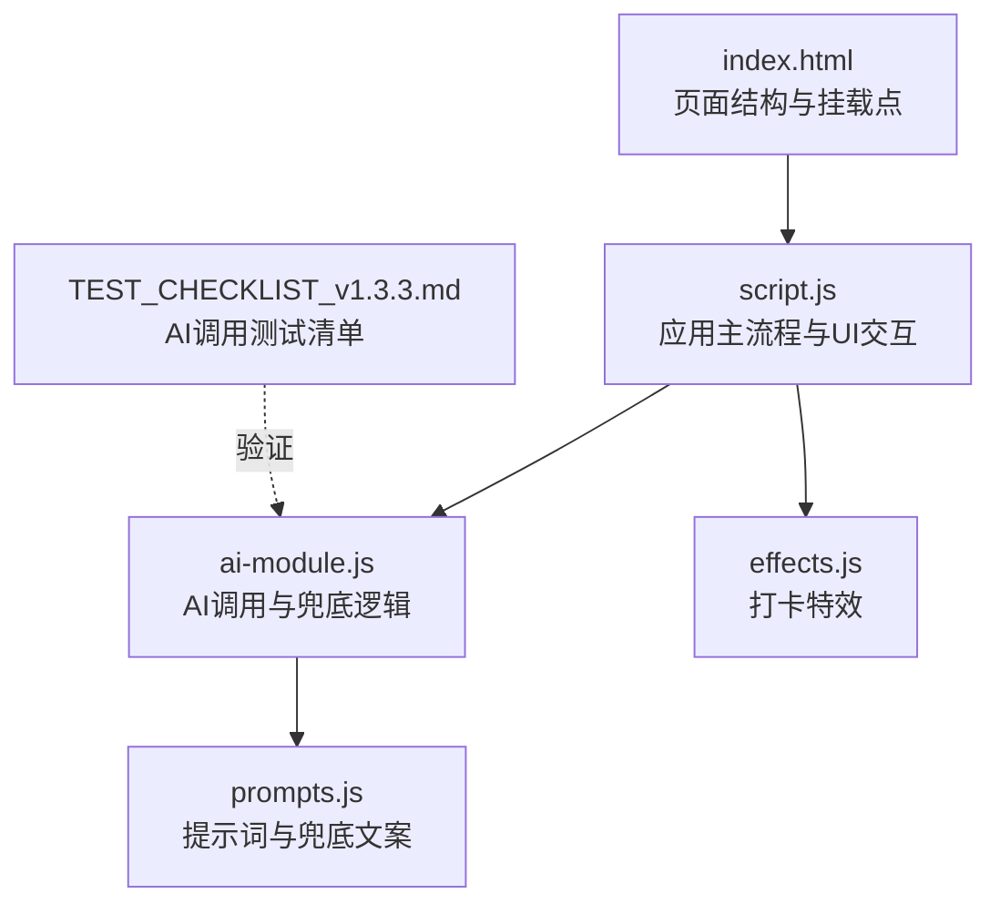
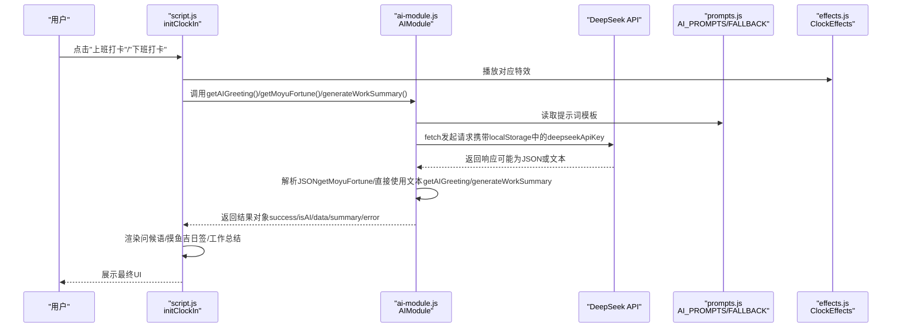
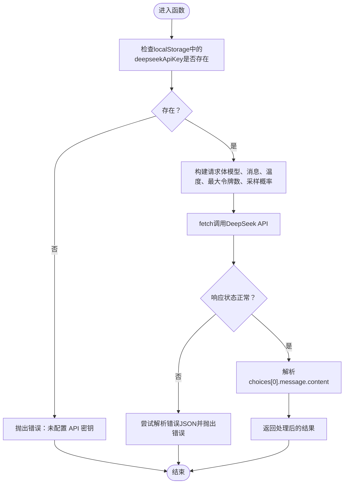
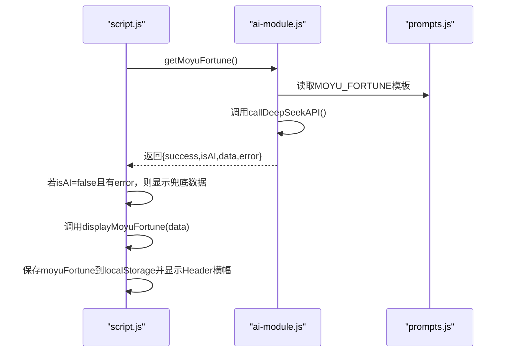
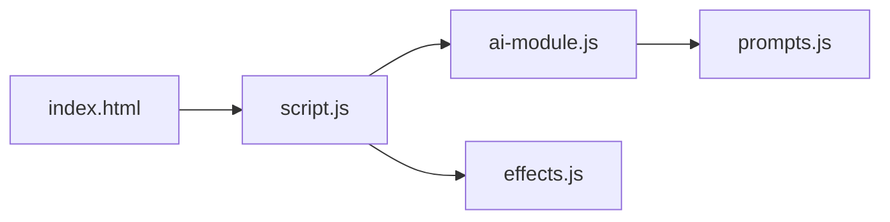

# AI集成调试

<cite>
**本文引用的文件**
- [ai-module.js](file://ai-module.js)
- [script.js](file://script.js)
- [prompts.js](file://prompts.js)
- [index.html](file://index.html)
- [effects.js](file://effects.js)
- [TEST_CHECKLIST_v1.3.3.md](file://TEST_CHECKLIST_v1.3.3.md)
- [README.md](file://README.md)
</cite>

## 目录
1. [简介](#简介)
2. [项目结构](#项目结构)
3. [核心组件](#核心组件)
4. [架构总览](#架构总览)
5. [详细组件分析](#详细组件分析)
6. [依赖关系分析](#依赖关系分析)
7. [性能考量](#性能考量)
8. [故障排查指南](#故障排查指南)
9. [结论](#结论)
10. [附录](#附录)

## 简介
本指南面向开发者，聚焦AI调用失败的常见问题，提供系统化的调试步骤与方法。内容涵盖：
- 如何检查localStorage中的deepseekApiKey是否正确配置
- 在ai-module.js中设置断点，跟踪callDeepSeekAPI的请求参数与响应结果
- 验证getMoyuFortune与generateWorkSummary的JSON解析逻辑与兜底方案触发条件
- 在script.js中监控AI问候语与摸鱼吉日签的显示流程
- 结合TEST_CHECKLIST_v1.3.3.md中的AI调用测试项进行验证

## 项目结构
AI相关功能分布在以下文件中：
- ai-module.js：封装DeepSeek API调用、问候语、摸鱼吉日签、工作总结、通用AI分析等
- prompts.js：统一管理AI提示词模板与兜底文案
- script.js：应用主流程，负责初始化AI设置、打卡流程、问候语与摸鱼吉日签的显示
- index.html：页面结构，包含打卡弹窗、摸鱼吉日签卡片、工作总结容器等
- effects.js：打卡特效（阳光/礼花），用于增强打卡体验
- TEST_CHECKLIST_v1.3.3.md：AI调用测试清单，包含关键验证点
- README.md：产品说明，帮助理解功能背景

图表来源
- [index.html](file://index.html#L1-L120)
- [script.js](file://script.js#L424-L732)
- [ai-module.js](file://ai-module.js#L1-L216)
- [prompts.js](file://prompts.js#L1-L159)
- [effects.js](file://effects.js#L1-L279)
- [TEST_CHECKLIST_v1.3.3.md](file://TEST_CHECKLIST_v1.3.3.md#L1-L178)

章节来源
- [index.html](file://index.html#L1-L120)
- [README.md](file://README.md#L32-L51)

## 核心组件
- AI模块（ai-module.js）
  - callDeepSeekAPI：封装fetch请求，校验API密钥，处理响应与错误
  - getAIGreeting：返回固定问候语（简化版，不调用AI）
  - getMoyuFortune：生成摸鱼吉日签，包含JSON解析与兜底
  - generateWorkSummary：生成工作总结，包含兜底
  - callAIAnalysis：通用AI分析，包含兜底
- 提示词与兜底（prompts.js）
  - AI_PROMPTS：统一管理MOYU_FORTUNE、WORK_SUMMARY、NEWS_ANALYSIS等模板
  - FALLBACK_MESSAGES：兜底JSON与文本
  - getRandomFallbackMessage：按类型返回随机兜底文案
- 主流程（script.js）
  - initAISettings：保存/测试API密钥
  - initClockIn：打卡流程，调用AIModule并显示问候语、摸鱼吉日签、工作总结
  - displayMoyuFortune：渲染摸鱼吉日签卡片
  - displayWorkSummary：渲染工作总结
  - displayDailyNote：渲染Header横幅的摸鱼运势
- 页面结构（index.html）
  - 打卡弹窗、摸鱼吉日签卡片、工作总结容器、Header横幅等
- 特效（effects.js）
  - ClockEffects：阳光特效（上班）、礼花特效（下班）

章节来源
- [ai-module.js](file://ai-module.js#L1-L216)
- [prompts.js](file://prompts.js#L1-L159)
- [script.js](file://script.js#L424-L732)
- [index.html](file://index.html#L120-L170)
- [effects.js](file://effects.js#L1-L279)

## 架构总览
AI调用链路与UI显示流程如下：

图表来源
- [script.js](file://script.js#L494-L732)
- [ai-module.js](file://ai-module.js#L61-L216)
- [prompts.js](file://prompts.js#L1-L159)
- [effects.js](file://effects.js#L1-L279)

## 详细组件分析

### 组件A：AI模块（ai-module.js）
- 职责
  - 封装DeepSeek API调用，统一请求头、模型、参数
  - 提供问候语、摸鱼吉日签、工作总结、通用分析等接口
  - 统一错误处理与兜底逻辑
- 关键点
  - API密钥来源：localStorage中的deepseekApiKey
  - 请求参数：temperature、maxTokens、topP
  - 响应处理：非2xx状态码抛错；JSON解析失败时抛错
  - 兜底策略：捕获异常后返回FALLBACK_MESSAGES或随机兜底文案

图表来源
- [ai-module.js](file://ai-module.js#L14-L59)

章节来源
- [ai-module.js](file://ai-module.js#L14-L59)

### 组件B：提示词与兜底（prompts.js）
- 职责
  - 统一管理AI提示词模板（MOYU_FORTUNE、WORK_SUMMARY、NEWS_ANALYSIS）
  - 提供兜底JSON与文本，以及随机兜底文案选择器
- 关键点
  - MOYU_FORTUNE模板要求返回JSON，包含fortune、bestTime、tips
  - WORK_SUMMARY模板要求返回纯文本总结
  - FALLBACK_MESSAGES提供默认兜底数据

章节来源
- [prompts.js](file://prompts.js#L1-L159)

### 组件C：主流程与UI（script.js）
- 职责
  - 初始化AI设置（保存/测试API密钥）
  - 打卡流程：问候语、摸鱼吉日签、工作总结
  - 渲染摸鱼吉日签卡片与工作总结
  - Header横幅显示摸鱼运势
- 关键点
  - initAISettings：保存deepseekApiKey到localStorage，测试连接
  - initClockIn：根据打卡类型调用AIModule，处理isAI标志与error字段
  - displayMoyuFortune：接收数据并重建HTML
  - displayWorkSummary：生成并显示工作总结
  - displayDailyNote：从localStorage读取并显示当日运势

图表来源
- [script.js](file://script.js#L547-L732)
- [ai-module.js](file://ai-module.js#L95-L127)
- [prompts.js](file://prompts.js#L1-L48)

章节来源
- [script.js](file://script.js#L424-L732)

### 组件D：特效系统（effects.js）
- 职责
  - 上班打卡播放阳光特效，下班打卡播放礼花特效
  - 使用Canvas绘制粒子，requestAnimationFrame驱动动画
- 关键点
  - playSunshine：创建大量光点与光晕粒子
  - playFireworks：创建多组粒子爆炸效果
  - clear：清理动画与画布

章节来源
- [effects.js](file://effects.js#L1-L279)

## 依赖关系分析
- 文件间依赖
  - index.html引入prompts.js、ai-module.js、effects.js、script.js
  - script.js依赖AIModule（ai-module.js）、AI_PROMPTS/FALLBACK_MESSAGES（prompts.js）、ClockEffects（effects.js）
  - ai-module.js依赖window.AI_PROMPTS与window.FALLBACK_MESSAGES（prompts.js）
- 耦合与内聚
  - ai-module.js内聚了AI调用与兜底逻辑，对外暴露简单接口
  - script.js负责UI与流程编排，耦合AI模块与DOM操作
  - prompts.js提供稳定的提示词与兜底数据，降低变更风险
- 外部依赖
  - fetch调用DeepSeek API，依赖网络与API密钥

图表来源
- [index.html](file://index.html#L1-L12)
- [script.js](file://script.js#L1-L120)
- [ai-module.js](file://ai-module.js#L206-L216)
- [prompts.js](file://prompts.js#L120-L159)
- [effects.js](file://effects.js#L275-L279)

章节来源
- [index.html](file://index.html#L1-L12)
- [script.js](file://script.js#L1-L120)
- [ai-module.js](file://ai-module.js#L206-L216)
- [prompts.js](file://prompts.js#L120-L159)
- [effects.js](file://effects.js#L275-L279)

## 性能考量
- 动画性能
  - 使用requestAnimationFrame驱动特效，避免setInterval
  - 粒子过期自动清理，减少内存占用
- 网络请求
  - fetch异步调用，避免阻塞UI
  - 错误快速返回，减少不必要的重试
- 兜底策略
  - JSON解析失败时快速回退至兜底，保证用户体验

章节来源
- [effects.js](file://effects.js#L136-L201)
- [effects.js](file://effects.js#L203-L260)
- [ai-module.js](file://ai-module.js#L14-L59)
- [prompts.js](file://prompts.js#L120-L159)

## 故障排查指南

### 1. 检查localStorage中的deepseekApiKey
- 步骤
  - 打开浏览器开发者工具，切换到“应用”或“存储”标签
  - 查找localStorage，确认是否存在deepseekApiKey键
  - 若不存在，回到设置页输入并保存API密钥
- 验证
  - 保存后，再次检查localStorage中是否出现该键
  - 使用“测试连接”按钮验证连通性

章节来源
- [script.js](file://script.js#L424-L491)
- [ai-module.js](file://ai-module.js#L14-L20)

### 2. 在ai-module.js中设置断点跟踪callDeepSeekAPI
- 断点位置
  - 在callDeepSeekAPI函数入口处设置断点，检查localStorage中的apiKey
  - 在fetch调用前后设置断点，观察请求头、请求体与响应状态
  - 在响应处理分支设置断点，区分正常响应与错误响应
- 关注点
  - 请求头Authorization是否包含Bearer + apiKey
  - 响应状态码与JSON结构
  - 异常抛出路径与错误信息

章节来源
- [ai-module.js](file://ai-module.js#L14-L59)

### 3. 验证getMoyuFortune的JSON解析逻辑与兜底
- 步骤
  - 在getMoyuFortune中设置断点，观察返回的原始响应文本
  - 检查正则匹配是否命中JSON片段
  - 若解析失败，确认是否进入catch分支并返回兜底数据
- 关注点
  - 响应文本是否严格遵循MOYU_FORTUNE模板要求
  - 兜底数据结构是否包含fortune、bestTime、tips
  - isAI标志与error字段是否正确传递

章节来源
- [ai-module.js](file://ai-module.js#L95-L127)
- [prompts.js](file://prompts.js#L1-L48)

### 4. 验证generateWorkSummary的处理逻辑与兜底
- 步骤
  - 在generateWorkSummary中设置断点，观察模板替换后的完整prompt
  - 观察callDeepSeekAPI返回的文本是否为期望的总结文案
  - 若失败，确认是否返回兜底文本
- 关注点
  - 模板占位符替换是否正确（CLOCK_IN_TIME、CLOCK_OUT_TIME、RELAX_COUNT、DAILY_INCOME）
  - isAI标志与error字段是否正确传递

章节来源
- [ai-module.js](file://ai-module.js#L129-L167)
- [prompts.js](file://prompts.js#L27-L48)

### 5. 在script.js中监控问候语与摸鱼吉日签显示流程
- 步骤
  - 在initClockIn中设置断点，观察不同类型打卡的分支
  - 上班打卡：调用getAIGreeting、getMoyuFortune，显示卡片并保存localStorage
  - 下班打卡：调用getAIGreeting，显示工作总结
  - 在displayMoyuFortune与displayWorkSummary中设置断点，观察DOM更新
- 关注点
  - greetingMessage、moyu-fortune-section、clock-out-summary的显示时机
  - isAI标志与error字段是否影响UI展示
  - Header横幅是否正确显示当日运势

章节来源
- [script.js](file://script.js#L494-L732)
- [index.html](file://index.html#L120-L170)

### 6. 结合TEST_CHECKLIST_v1.3.3.md进行验证
- 摸鱼吉日签测试要点
  - 上班打卡流程：显示问候语、阳光特效、加载状态、卡片展示、再求一签、开始摸鱼、Header横幅
  - AI调用测试：成功返回JSON、失败时显示兜底内容（包含完整的fortune、bestTime、tips）
- 工资计算与工作总结测试要点
  - 下班打卡流程：显示问候语、礼花特效、加载状态、工作总结卡片
  - AI总结测试：包含所有占位符数据、失败时显示兜底文案、语言风趣幽默
- 性能与边界测试要点
  - Canvas正确初始化、使用requestAnimationFrame、过期粒子自动清理
  - 当天未设置月工资使用默认值、未打上班卡时显示“未知”、AI调用超时显示兜底内容

章节来源
- [TEST_CHECKLIST_v1.3.3.md](file://TEST_CHECKLIST_v1.3.3.md#L1-L178)

## 结论
通过以上调试步骤与验证清单，开发者可以系统地定位并解决AI调用失败问题：
- 确认API密钥配置与测试连通性
- 在ai-module.js中设置断点，跟踪请求参数与响应
- 验证getMoyuFortune与generateWorkSummary的JSON解析与兜底逻辑
- 在script.js中监控问候语与摸鱼吉日签的显示流程
- 依据TEST_CHECKLIST_v1.3.3.md逐项验证核心功能

## 附录

### A. 常见错误与处理建议
- 未配置API密钥
  - 现象：调用立即抛错
  - 处理：在设置页保存deepseekApiKey并测试连接
- API响应非2xx
  - 现象：解析错误JSON或状态码并抛错
  - 处理：检查密钥有效性、网络连通性、服务端状态
- JSON解析失败
  - 现象：getMoyuFortune返回兜底数据
  - 处理：检查提示词模板是否严格返回JSON，必要时调整模板
- UI未更新
  - 现象：问候语/卡片未显示
  - 处理：检查isAI标志与error字段，确认displayMoyuFortune/displayWorkSummary调用

章节来源
- [ai-module.js](file://ai-module.js#L14-L59)
- [ai-module.js](file://ai-module.js#L95-L167)
- [script.js](file://script.js#L547-L732)
- [TEST_CHECKLIST_v1.3.3.md](file://TEST_CHECKLIST_v1.3.3.md#L1-L178)