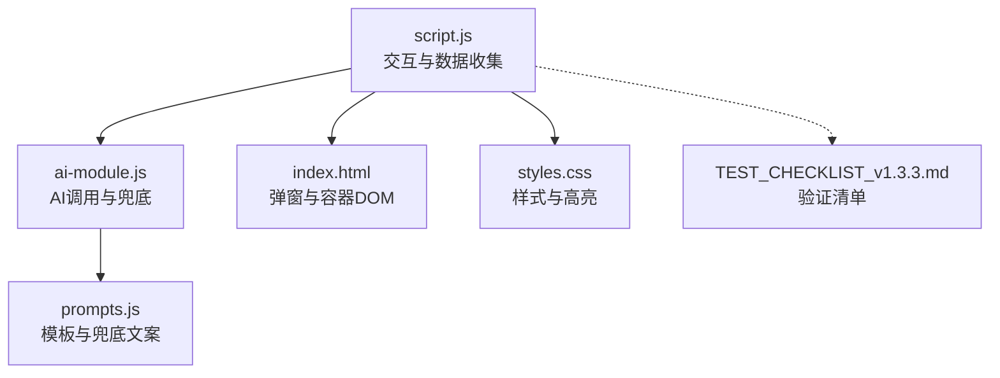
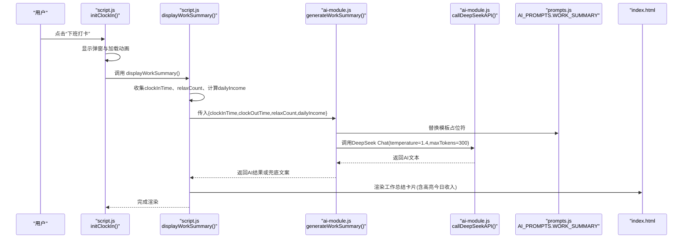
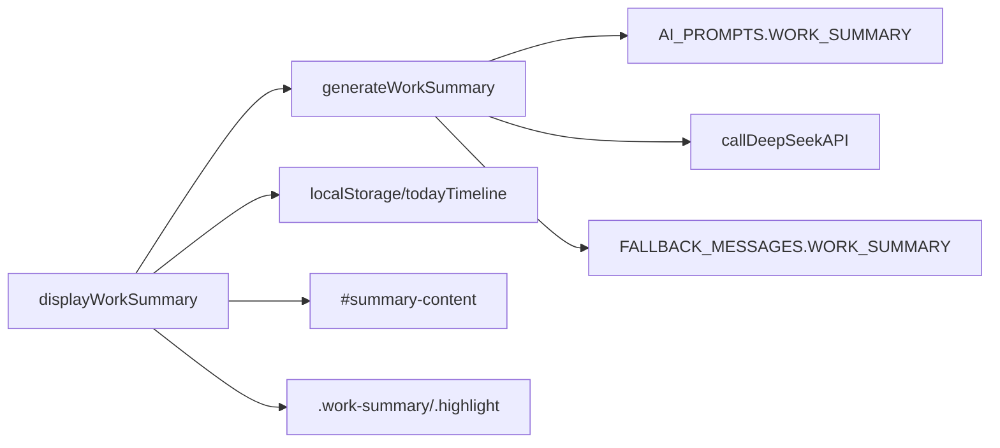
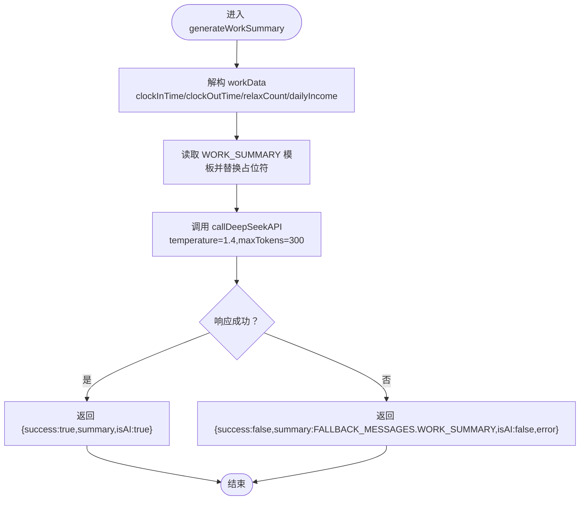
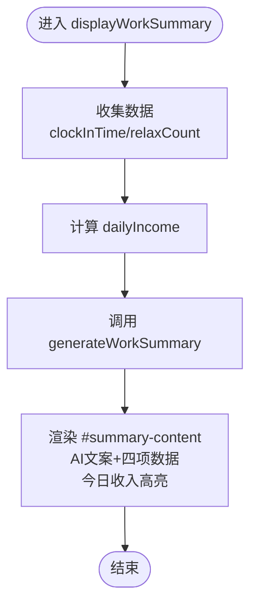

# 工作总结生成调试

<cite>
**本文引用的文件**
- [script.js](file://script.js)
- [ai-module.js](file://ai-module.js)
- [prompts.js](file://prompts.js)
- [TEST_CHECKLIST_v1.3.3.md](file://TEST_CHECKLIST_v1.3.3.md)
- [index.html](file://index.html)
- [styles.css](file://styles.css)
</cite>

## 目录
1. [简介](#简介)
2. [项目结构](#项目结构)
3. [核心组件](#核心组件)
4. [架构总览](#架构总览)
5. [详细组件分析](#详细组件分析)
6. [依赖关系分析](#依赖关系分析)
7. [性能考量](#性能考量)
8. [故障排查指南](#故障排查指南)
9. [结论](#结论)
10. [附录](#附录)

## 简介
本调试指南围绕“工作总结生成”功能展开，重点说明以下内容：
- generateWorkSummary 如何从 workData 中提取 clockInTime、clockOutTime、relaxCount、dailyIncome 等参数，并替换 AI_PROMPTS.WORK_SUMMARY 模板中的占位符。
- callDeepSeekAPI 在调用时的参数配置（temperature=1.4、maxTokens=300）及请求构造过程。
- 如何验证 AI 返回结果的解析逻辑，以及在 API 调用失败或网络异常时如何返回 FALLBACK_MESSAGES.WORK_SUMMARY 兜底文案。
- 在 script.js 中如何监控工作总结弹窗的触发时机、加载状态显示与数据绑定过程。
- 依据 TEST_CHECKLIST_v1.3.3.md 验证文案完整性、今日收入高亮显示及与日薪计算模块的集成正确性。

## 项目结构
本功能涉及的关键文件与职责：
- script.js：负责打卡弹窗交互、收集当日数据、调用 AI 生成总结、渲染 UI。
- ai-module.js：封装 DeepSeek API 调用、生成工作总结、兜底策略。
- prompts.js：统一管理 AI_PROMPTS 与 FALLBACK_MESSAGES。
- index.html：提供打卡弹窗、总结容器、Canvas 特效等 DOM 结构。
- styles.css：定义工作总结卡片样式、高亮样式等。
- TEST_CHECKLIST_v1.3.3.md：提供测试清单，验证文案、样式与日薪计算集成。

图表来源
- [script.js](file://script.js#L581-L732)
- [ai-module.js](file://ai-module.js#L129-L167)
- [prompts.js](file://prompts.js#L1-L159)
- [index.html](file://index.html#L123-L163)
- [styles.css](file://styles.css#L2095-L2148)
- [TEST_CHECKLIST_v1.3.3.md](file://TEST_CHECKLIST_v1.3.3.md#L34-L60)

章节来源
- [script.js](file://script.js#L581-L732)
- [ai-module.js](file://ai-module.js#L129-L167)
- [prompts.js](file://prompts.js#L1-L159)
- [index.html](file://index.html#L123-L163)
- [styles.css](file://styles.css#L2095-L2148)
- [TEST_CHECKLIST_v1.3.3.md](file://TEST_CHECKLIST_v1.3.3.md#L34-L60)

## 核心组件
- generateWorkSummary：接收 workData，拼装模板，调用 callDeepSeekAPI，返回 AI 文案或兜底文案。
- callDeepSeekAPI：构造 DeepSeek Chat 请求，处理响应与错误，抛出异常以便上层兜底。
- displayWorkSummary：从本地存储与时间轴收集数据，计算日薪，调用 generateWorkSummary 并渲染 UI。
- prompts.js：提供 WORK_SUMMARY 模板与 FALLBACK_MESSAGES.WORK_SUMMARY。
- index.html：提供打卡弹窗、summary-content 容器、Canvas 特效。
- styles.css：定义工作总结卡片、高亮样式。

章节来源
- [ai-module.js](file://ai-module.js#L129-L167)
- [script.js](file://script.js#L3063-L3150)
- [prompts.js](file://prompts.js#L27-L47)
- [index.html](file://index.html#L123-L163)
- [styles.css](file://styles.css#L2095-L2148)

## 架构总览
下面的序列图展示了下班打卡后生成工作总结的完整流程。

图表来源
- [script.js](file://script.js#L581-L732)
- [script.js](file://script.js#L3063-L3150)
- [ai-module.js](file://ai-module.js#L129-L167)
- [prompts.js](file://prompts.js#L27-L47)
- [index.html](file://index.html#L123-L163)

## 详细组件分析

### generateWorkSummary 参数注入与模板替换
- 参数来源：workData 包含 clockInTime、clockOutTime、relaxCount、dailyIncome。
- 模板替换：从 AI_PROMPTS.WORK_SUMMARY 中读取模板，逐个替换 {CLOCK_IN_TIME}、{CLOCK_OUT_TIME}、{RELAX_COUNT}、{DAILY_INCOME}。
- 调用 DeepSeek：使用 temperature=1.4、maxTokens=300 的配置调用 callDeepSeekAPI。
- 错误兜底：捕获异常后返回 FALLBACK_MESSAGES.WORK_SUMMARY，并标记 isAI=false。

章节来源
- [ai-module.js](file://ai-module.js#L134-L167)
- [prompts.js](file://prompts.js#L27-L47)
- [prompts.js](file://prompts.js#L120-L139)

### callDeepSeekAPI 请求构造与参数配置
- URL 与模型：DEEPSEEK_API_URL 与 DEEPSEEK_MODEL。
- 请求头：Content-Type 与 Authorization（Bearer + deepseekApiKey）。
- 请求体：messages=[{role:'user',content:prompt}]，并设置 temperature、max_tokens、top_p。
- 响应处理：校验 response.ok，解析 choices[0].message.content；异常时抛出错误。
- 调用方期望：generateWorkSummary 期望返回纯文本摘要，因此无需 JSON 解析。

章节来源
- [ai-module.js](file://ai-module.js#L14-L59)

### displayWorkSummary 数据采集与渲染
- 数据采集：
  - 上班时间：从 localStorage 中读取 clockInTime_{today}，不存在时显示“未知”。
  - 下班时间：当前时间格式化。
  - 摸鱼次数：统计 todayTimeline 中 type='relax' 的事件数量。
  - 今日收入：调用 calculateDailyIncome() 计算日薪。
- 调用 generateWorkSummary：传入上述四个参数。
- 渲染 UI：
  - 容器：#summary-content。
  - 结果：AI 文案 + 四项数据（上班时间、下班时间、摸鱼次数、今日收入）。
  - 样式：今日收入所在项使用 .highlight 样式高亮。

章节来源
- [script.js](file://script.js#L3063-L3150)
- [script.js](file://script.js#L3063-L3077)
- [styles.css](file://styles.css#L2095-L2148)

### 弹窗触发时机与加载状态
- 触发时机：FINISHED 状态（已下班）下点击“下班打卡”按钮时，直接显示总结弹窗。
- 加载状态：在显示弹窗后，向 #summary-content 插入加载动画 HTML。
- 关闭与清理：弹窗关闭时会清理 Canvas 特效，避免残留。

章节来源
- [script.js](file://script.js#L581-L732)

### 日薪计算与集成验证
- 日薪计算：从 localStorage 读取 monthlySalary（默认 8000），按当月天数计算 dailyIncome。
- 集成验证：测试清单要求“今日收入（黄色高亮）”，并在多个月份天数下验证日薪计算。

章节来源
- [script.js](file://script.js#L3063-L3077)
- [TEST_CHECKLIST_v1.3.3.md](file://TEST_CHECKLIST_v1.3.3.md#L47-L57)

## 依赖关系分析
- generateWorkSummary 依赖：
  - prompts.js 的 AI_PROMPTS.WORK_SUMMARY 模板。
  - ai-module.js 的 callDeepSeekAPI。
  - prompts.js 的 FALLBACK_MESSAGES.WORK_SUMMARY。
- displayWorkSummary 依赖：
  - script.js 的本地存储与时间轴数据。
  - script.js 的 calculateDailyIncome。
  - ai-module.js 的 generateWorkSummary。
  - index.html 的 DOM 容器 #summary-content。
  - styles.css 的 .work-summary 与 .highlight。

图表来源
- [ai-module.js](file://ai-module.js#L129-L167)
- [prompts.js](file://prompts.js#L27-L47)
- [prompts.js](file://prompts.js#L120-L139)
- [script.js](file://script.js#L3063-L3150)
- [index.html](file://index.html#L123-L163)
- [styles.css](file://styles.css#L2095-L2148)

## 性能考量
- 渲染粒度：仅更新 #summary-content 内容，避免重绘整个弹窗。
- 事件绑定：FINISHED 状态下直接显示总结，减少不必要的 DOM 操作。
- 样式优化：使用 CSS Grid 布局，避免复杂 JS 计算。
- 兜底策略：API 失败时快速回退，降低用户等待时间。

[本节为通用建议，不直接分析具体文件]

## 故障排查指南

### 1. AI 返回结果解析逻辑验证
- 现象：AI 返回非 JSON，但 WORK_SUMMARY 模板要求直接输出文本。
- 排查要点：
  - generateWorkSummary 是否直接使用 callDeepSeekAPI 的返回文本（无需 JSON 解析）。
  - prompts.js 中 WORK_SUMMARY 模板是否要求直接输出文本，而非 JSON。
- 建议：
  - 在 generateWorkSummary 成功分支中，直接使用返回文本作为 summary 字段。
  - 若上游调用方需要 JSON，需在调用处做 JSON 解析；当前 WORK_SUMMARY 不需要。

章节来源
- [ai-module.js](file://ai-module.js#L129-L167)
- [prompts.js](file://prompts.js#L27-L47)

### 2. API 调用失败或网络异常的兜底
- 现象：网络异常或服务端错误导致 generateWorkSummary 抛错。
- 排查要点：
  - generateWorkSummary 是否捕获异常并返回 FALLBACK_MESSAGES.WORK_SUMMARY。
  - isAI 标记是否为 false，便于前端区分来源。
- 建议：
  - 在 displayWorkSummary 的 try/catch 中，若失败也回退到兜底文案，保证 UI 稳定。

章节来源
- [ai-module.js](file://ai-module.js#L129-L167)
- [script.js](file://script.js#L581-L732)

### 3. 弹窗触发时机与加载状态
- 现象：FINISHED 状态下未显示加载动画或总结。
- 排查要点：
  - FINISHED 分支是否正确设置 clockOutSummary.style.display='block'。
  - 是否向 #summary-content 注入加载动画 HTML。
  - 弹窗关闭事件是否正确绑定，避免特效残留。

章节来源
- [script.js](file://script.js#L581-L732)

### 4. 文案完整性与样式高亮
- 现象：工作总结缺少某一项数据或今日收入未高亮。
- 排查要点：
  - displayWorkSummary 是否正确收集 clockInTime、relaxCount、dailyIncome。
  - 渲染 HTML 中是否包含“今日收入”项且使用 .highlight。
  - 样式 .highlight 是否存在且生效。

章节来源
- [script.js](file://script.js#L3063-L3150)
- [styles.css](file://styles.css#L2095-L2148)
- [TEST_CHECKLIST_v1.3.3.md](file://TEST_CHECKLIST_v1.3.3.md#L47-L57)

### 5. 日薪计算模块集成
- 现象：日薪计算不随月工资变化而更新。
- 排查要点：
  - calculateDailyIncome 是否从 localStorage 读取 monthlySalary。
  - 月份天数是否按实际计算（考虑闰年与不同月份）。
  - 设置页面是否正确保存 monthlySalary。

章节来源
- [script.js](file://script.js#L3063-L3077)
- [index.html](file://index.html#L185-L223)
- [TEST_CHECKLIST_v1.3.3.md](file://TEST_CHECKLIST_v1.3.3.md#L47-L57)

## 结论
- generateWorkSummary 通过模板占位符注入参数并调用 DeepSeek API，成功时返回 AI 文案，失败时回退至 FALLBACK_MESSAGES.WORK_SUMMARY。
- displayWorkSummary 负责数据采集与渲染，确保“今日收入”高亮显示并与日薪计算模块正确集成。
- 弹窗触发与加载状态由 script.js 控制，配合样式与 DOM 结构实现稳定用户体验。
- 建议在调试时优先验证：模板占位符替换、API 返回文本解析、FINISHED 状态下的弹窗与加载、样式高亮与日薪计算。

[本节为总结，不直接分析具体文件]

## 附录

### A. 关键流程图：generateWorkSummary 执行路径

图表来源
- [ai-module.js](file://ai-module.js#L129-L167)
- [prompts.js](file://prompts.js#L27-L47)
- [prompts.js](file://prompts.js#L120-L139)

### B. 关键流程图：displayWorkSummary 数据与渲染

图表来源
- [script.js](file://script.js#L3063-L3150)
- [styles.css](file://styles.css#L2095-L2148)