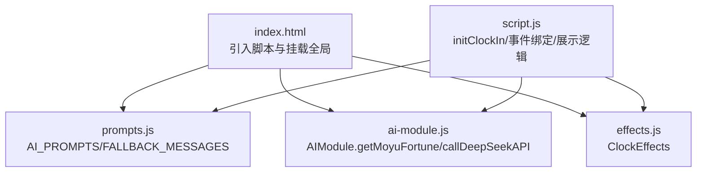
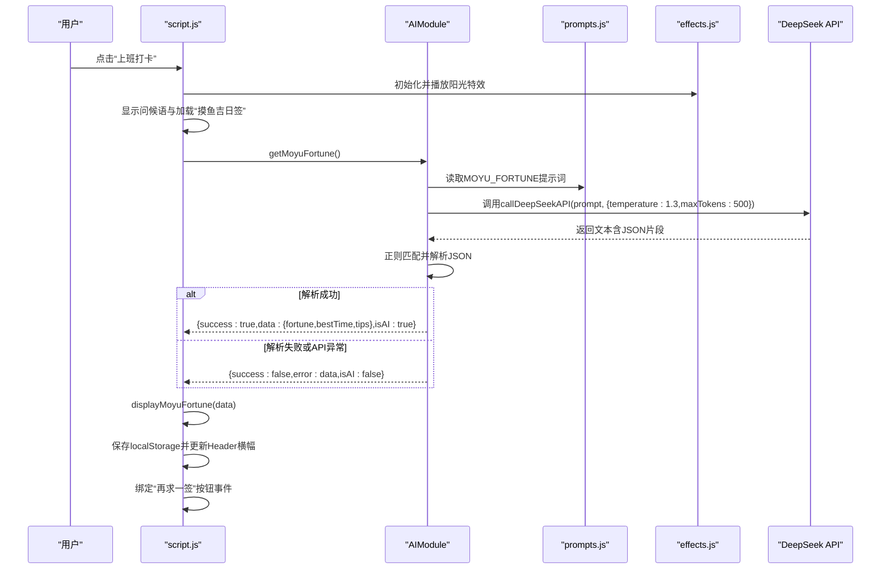
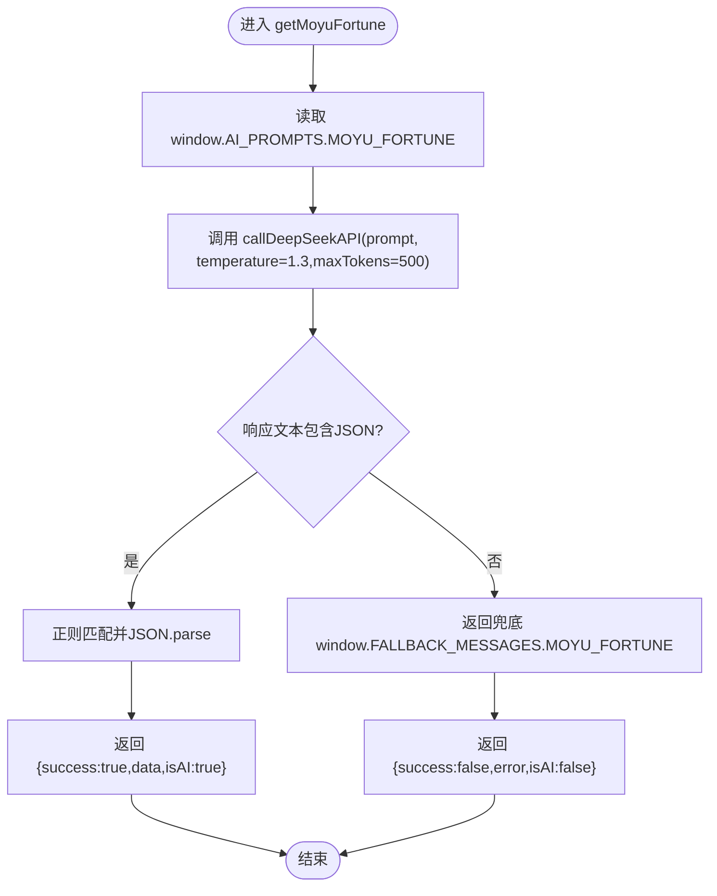
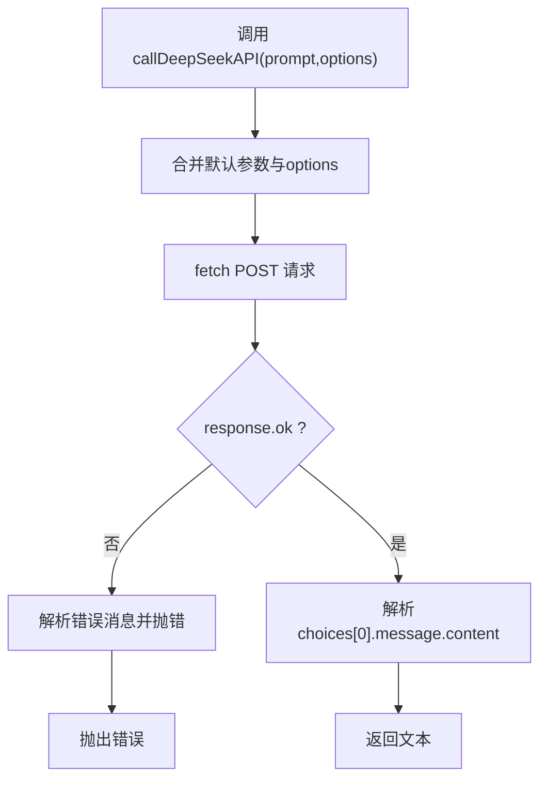
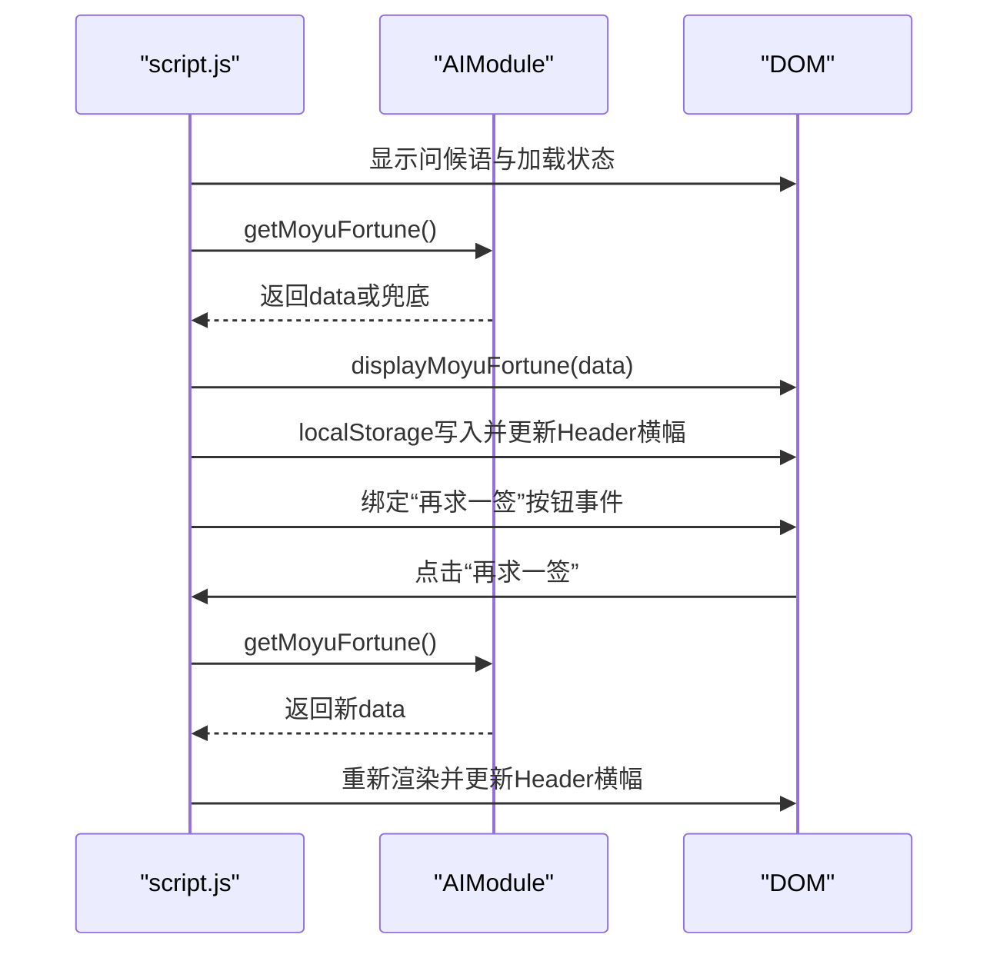
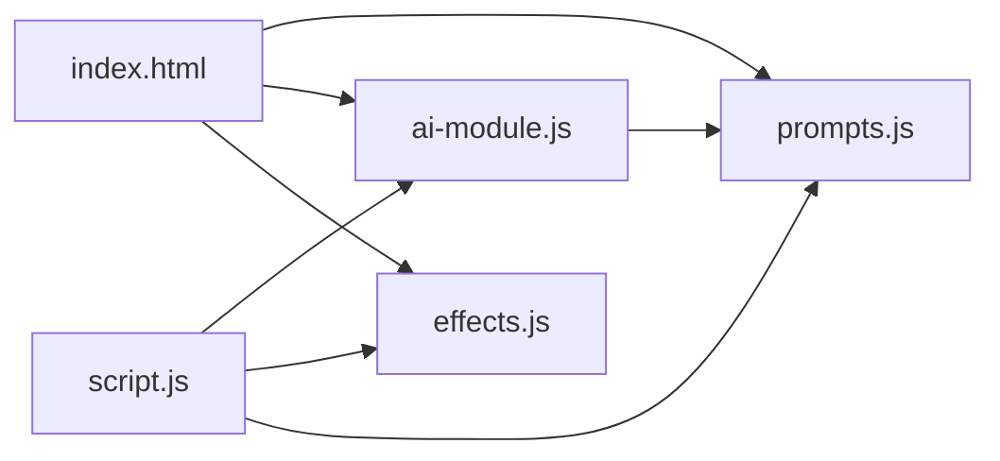

# 摸鱼吉日签调试

<cite>
**本文引用的文件**
- [index.html](file://index.html)
- [script.js](file://script.js)
- [ai-module.js](file://ai-module.js)
- [prompts.js](file://prompts.js)
- [effects.js](file://effects.js)
- [TEST_CHECKLIST_v1.3.3.md](file://TEST_CHECKLIST_v1.3.3.md)
- [README.md](file://README.md)
</cite>

## 目录
1. [简介](#简介)
2. [项目结构](#项目结构)
3. [核心组件](#核心组件)
4. [架构总览](#架构总览)
5. [详细组件分析](#详细组件分析)
6. [依赖关系分析](#依赖关系分析)
7. [性能考量](#性能考量)
8. [故障排查指南](#故障排查指南)
9. [结论](#结论)
10. [附录](#附录)

## 简介
本调试指南围绕“摸鱼吉日签”功能展开，重点验证以下方面：
- getMoyuFortune函数对window.AI_PROMPTS.MOYU_FORTUNE提示词的调用流程
- callDeepSeekAPI请求参数是否正确传递（temperature=1.3、maxTokens=500）
- JSON解析逻辑：通过正则/\{[\s\S]*\}/匹配AI返回的JSON内容，以及解析失败时的错误处理机制
- 兜底方案触发条件（如API调用失败或JSON解析错误）及window.FALLBACK_MESSAGES.MOYU_FORTUNE的使用
- 在script.js中跟踪从生成到界面展示的完整流程，并结合TEST_CHECKLIST_v1.3.3.md中的测试项验证显示效果、再求一签按钮状态变化和Header横幅更新

## 项目结构
- 前端入口：index.html 引入 prompts.js、ai-module.js、effects.js，并挂载全局window.AIModule
- 业务逻辑：script.js 负责打卡流程、弹窗控制、特效播放、Header横幅更新、再求一签按钮事件
- AI模块：ai-module.js 封装DeepSeek API调用、提示词拼装、JSON解析与兜底
- 提示词与兜底文案：prompts.js 统一管理AI_PROMPTS与FALLBACK_MESSAGES
- 特效系统：effects.js 提供Canvas动画（阳光/礼花）

图表来源
- [index.html](file://index.html#L1-L20)
- [prompts.js](file://prompts.js#L1-L40)
- [ai-module.js](file://ai-module.js#L1-L40)
- [effects.js](file://effects.js#L1-L40)
- [script.js](file://script.js#L490-L730)

章节来源
- [index.html](file://index.html#L1-L20)
- [README.md](file://README.md#L32-L41)

## 核心组件
- AIModule.getMoyuFortune：负责拉取提示词、调用DeepSeek API、解析JSON、兜底处理
- callDeepSeekAPI：封装fetch请求，校验响应、抛错、返回文本
- prompts.js：提供MOYU_FORTUNE提示词模板与兜底JSON
- script.js：打卡流程、弹窗渲染、Header横幅、再求一签按钮交互
- effects.js：打卡特效（阳光/礼花），与打卡流程联动

章节来源
- [ai-module.js](file://ai-module.js#L95-L127)
- [prompts.js](file://prompts.js#L1-L40)
- [script.js](file://script.js#L490-L730)
- [effects.js](file://effects.js#L1-L40)

## 架构总览
摸鱼吉日签从“上班打卡”触发，经过AI生成、JSON解析、兜底回退、界面渲染与Header横幅更新，最终完成一次完整的用户交互闭环。

图表来源
- [script.js](file://script.js#L634-L720)
- [ai-module.js](file://ai-module.js#L95-L127)
- [prompts.js](file://prompts.js#L1-L40)
- [effects.js](file://effects.js#L25-L62)

## 详细组件分析

### 组件A：AIModule.getMoyuFortune（提示词调用与JSON解析）
- 触发路径：script.js在“上班打卡”流程中调用window.AIModule.getMoyuFortune()
- 提示词来源：从window.AI_PROMPTS.MOYU_FORTUNE读取模板
- 请求参数：temperature=1.3、maxTokens=500（在调用处显式传入）
- JSON解析：使用正则/\{[\s\S]*\}/提取首个JSON片段并尝试JSON.parse
- 错误处理：解析失败或API异常时，返回window.FALLBACK_MESSAGES.MOYU_FORTUNE作为兜底

图表来源
- [ai-module.js](file://ai-module.js#L95-L127)
- [prompts.js](file://prompts.js#L1-L40)

章节来源
- [ai-module.js](file://ai-module.js#L95-L127)
- [prompts.js](file://prompts.js#L1-L40)

### 组件B：callDeepSeekAPI（请求参数与错误处理）
- URL与模型：固定DEEPSEEK_API_URL与DEEPSEEK_MODEL
- 参数默认值：temperature=1.2、maxTokens=2000、topP=0.95
- 覆盖策略：getMoyuFortune显式传入temperature=1.3、maxTokens=500，覆盖默认值
- 错误处理：响应非OK时解析错误消息；异常捕获并抛出

图表来源
- [ai-module.js](file://ai-module.js#L14-L59)

章节来源
- [ai-module.js](file://ai-module.js#L14-L59)

### 组件C：script.js中的摸鱼吉日签生成与展示
- 触发时机：initClockIn中“上班打卡”按钮点击后
- 加载与特效：显示问候语与“正在生成摸鱼吉日签...”，播放阳光特效
- 调用链路：window.AIModule.getMoyuFortune() -> displayMoyuFortune(data)
- Header横幅：将今日运势写入localStorage并调用displayDailyNote显示
- 再求一签：禁用按钮、显示“正在求签...”、重新生成并恢复按钮状态

图表来源
- [script.js](file://script.js#L634-L720)
- [script.js](file://script.js#L780-L800)

章节来源
- [script.js](file://script.js#L634-L720)
- [script.js](file://script.js#L780-L800)

### 组件D：兜底方案与错误处理
- 触发条件：API调用失败或JSON解析失败
- 兜底内容：window.FALLBACK_MESSAGES.MOYU_FORTUNE（包含fortune、bestTime、tips）
- 返回结构：success=false、isAI=false、携带error字段

章节来源
- [ai-module.js](file://ai-module.js#L115-L127)
- [prompts.js](file://prompts.js#L120-L140)

## 依赖关系分析
- index.html引入顺序决定全局变量可用性：prompts.js先于ai-module.js加载，确保window.AI_PROMPTS与window.FALLBACK_MESSAGES在AIModule中可用
- script.js依赖window.AIModule（由ai-module.js挂载），同时依赖effects.js（特效）、prompts.js（提示词）
- ai-module.js依赖localStorage中的deepseekApiKey，依赖window.AI_PROMPTS与window.FALLBACK_MESSAGES

图表来源
- [index.html](file://index.html#L1-L12)
- [ai-module.js](file://ai-module.js#L206-L216)
- [script.js](file://script.js#L490-L560)

章节来源
- [index.html](file://index.html#L1-L12)
- [ai-module.js](file://ai-module.js#L206-L216)
- [script.js](file://script.js#L490-L560)

## 性能考量
- Canvas动画：使用requestAnimationFrame驱动，避免setInterval；粒子过期自动清理，降低内存占用
- API调用：在getMoyuFortune中显式设置maxTokens=500，有助于控制响应体积与延迟
- DOM更新：仅在解析成功后重建卡片HTML，避免不必要的重绘

章节来源
- [effects.js](file://effects.js#L135-L141)
- [ai-module.js](file://ai-module.js#L95-L127)

## 故障排查指南

### 1. 验证getMoyuFortune对MOYU_FORTUNE提示词的调用
- 在浏览器开发者工具中，打开Network面板，触发“上班打卡”
- 查找对DeepSeek API的POST请求，确认请求体messages[0].content来自window.AI_PROMPTS.MOYU_FORTUNE
- 确认请求头Authorization与Content-Type正确

章节来源
- [ai-module.js](file://ai-module.js#L95-L127)
- [prompts.js](file://prompts.js#L1-L40)

### 2. 验证callDeepSeekAPI请求参数
- 在Network面板中，确认请求体包含：
  - model: deepseek-chat
  - temperature: 1.3（来自getMoyuFortune覆盖）
  - max_tokens: 500（来自getMoyuFortune覆盖）
  - messages: [{role:"user",content:提示词}]
- 若未出现上述参数，检查调用处是否正确传参

章节来源
- [ai-module.js](file://ai-module.js#L14-L59)
- [ai-module.js](file://ai-module.js#L95-L127)

### 3. 验证JSON解析逻辑
- 在Console中，手动执行正则/\{[\s\S]*\}/对AI返回文本进行匹配，观察是否能提取到完整JSON
- 若解析失败，检查AI返回文本是否包含JSON片段；若无，确认提示词模板要求返回JSON

章节来源
- [ai-module.js](file://ai-module.js#L107-L118)
- [prompts.js](file://prompts.js#L1-L40)

### 4. 验证兜底方案
- 方法A：在Network面板中拦截请求，模拟响应非OK或空响应，观察是否走兜底
- 方法B：在Console中临时修改window.AI_PROMPTS.MOYU_FORTUNE，使其返回非JSON文本，验证解析失败分支
- 验证返回结构：success=false、isAI=false、data为window.FALLBACK_MESSAGES.MOYU_FORTUNE

章节来源
- [ai-module.js](file://ai-module.js#L115-L127)
- [prompts.js](file://prompts.js#L120-L140)

### 5. 验证界面展示与Header横幅
- 触发“上班打卡”，确认：
  - 弹窗中显示“正在生成摸鱼吉日签...”
  - 成功后显示“🌟 摸鱼运势”、“⏰ 最佳时间”、“💡 摸鱼锦囊”
  - Header横幅显示今日运势
- 使用TEST_CHECKLIST_v1.3.3.md逐项核对显示效果

章节来源
- [script.js](file://script.js#L634-L720)
- [script.js](file://script.js#L780-L800)
- [TEST_CHECKLIST_v1.3.3.md](file://TEST_CHECKLIST_v1.3.3.md#L11-L33)

### 6. 验证“再求一签”按钮状态变化
- 点击“再求一签”：按钮应禁用并显示“正在求签...”
- 生成完成后按钮恢复，文案回到“🎲 再求一签”

章节来源
- [script.js](file://script.js#L668-L680)
- [TEST_CHECKLIST_v1.3.3.md](file://TEST_CHECKLIST_v1.3.3.md#L17-L27)

### 7. 验证Header横幅更新
- 在script.js中，成功生成后会将今日运势写入localStorage并调用displayDailyNote
- 刷新页面后，Header横幅仍应显示

章节来源
- [script.js](file://script.js#L663-L666)
- [script.js](file://script.js#L793-L800)

## 结论
- getMoyuFortune严格遵循提示词模板与参数约定，JSON解析与兜底逻辑完备
- script.js在UI层面提供了完整的交互闭环，包括特效、Header横幅与再求一签
- 建议在调试时结合Network与Console双通道，优先验证请求参数与JSON解析，再验证UI渲染与状态更新

## 附录

### A. 关键调用路径参考
- 提示词读取与调用：[ai-module.js](file://ai-module.js#L95-L127)
- 请求参数覆盖：[ai-module.js](file://ai-module.js#L95-L127)
- JSON解析与兜底：[ai-module.js](file://ai-module.js#L107-L127)
- UI渲染与Header横幅：[script.js](file://script.js#L634-L720), [script.js](file://script.js#L780-L800)
- 再求一签按钮事件：[script.js](file://script.js#L668-L680)

### B. 测试清单对照
- 显示效果：[TEST_CHECKLIST_v1.3.3.md](file://TEST_CHECKLIST_v1.3.3.md#L17-L27)
- 兜底内容：[TEST_CHECKLIST_v1.3.3.md](file://TEST_CHECKLIST_v1.3.3.md#L29-L33)