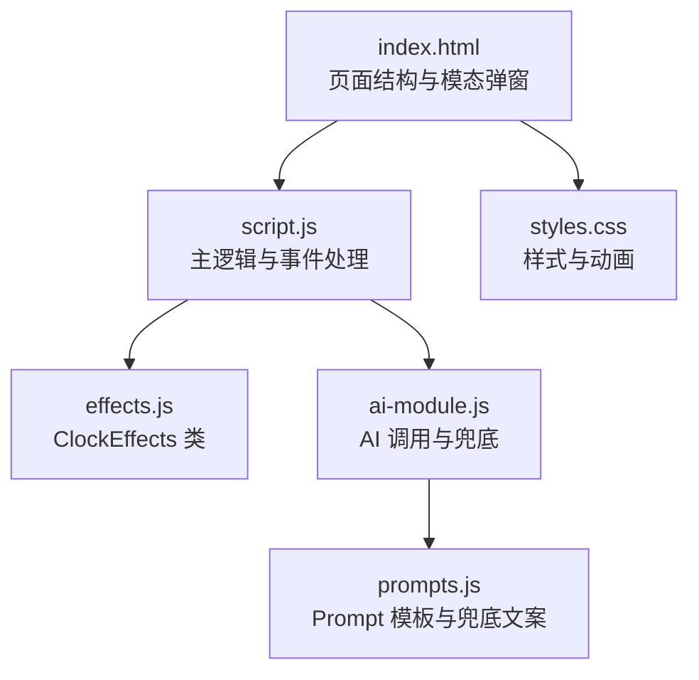
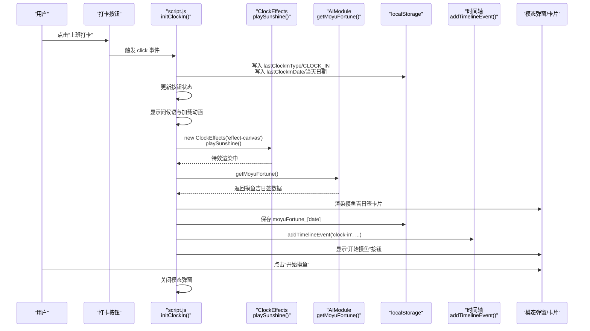
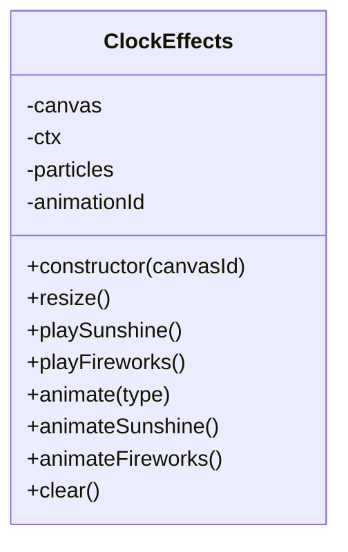
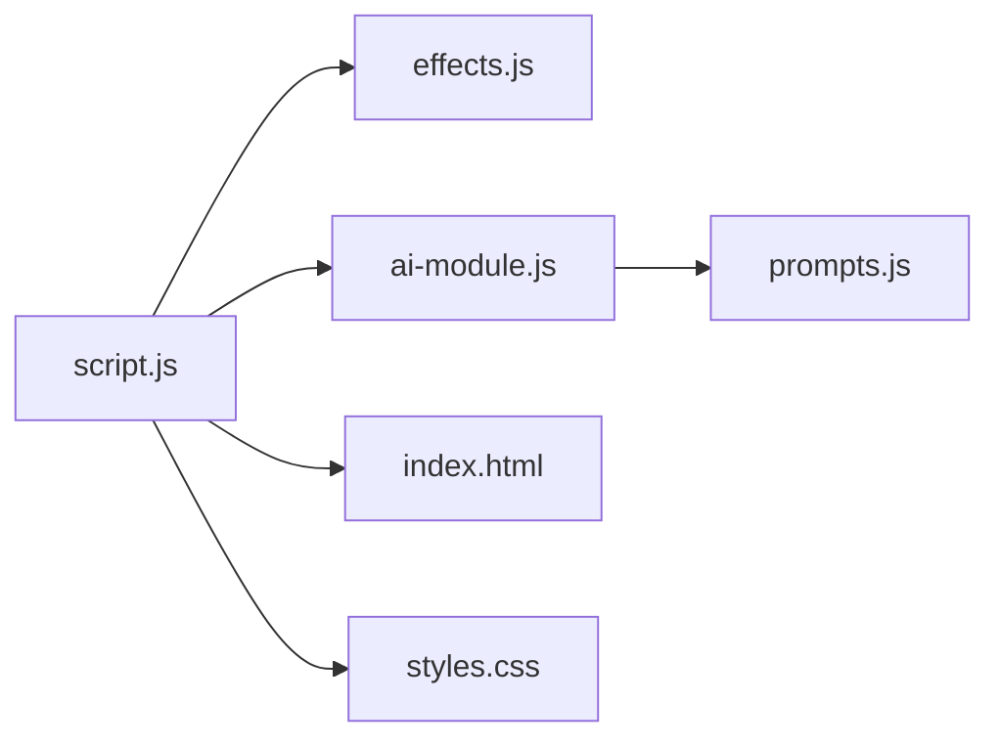

# 上班打卡调试

<cite>
**本文引用的文件**
- [script.js](file://script.js)
- [effects.js](file://effects.js)
- [index.html](file://index.html)
- [ai-module.js](file://ai-module.js)
- [prompts.js](file://prompts.js)
- [styles.css](file://styles.css)
- [TEST_CHECKLIST_v1.3.3.md](file://TEST_CHECKLIST_v1.3.3.md)
</cite>

## 目录
1. [简介](#简介)
2. [项目结构](#项目结构)
3. [核心组件](#核心组件)
4. [架构总览](#架构总览)
5. [详细组件分析](#详细组件分析)
6. [依赖关系分析](#依赖关系分析)
7. [性能考量](#性能考量)
8. [故障排查指南](#故障排查指南)
9. [结论](#结论)
10. [附录](#附录)

## 简介
本指南聚焦“上班打卡”完整流程的调试与验证，围绕从点击打卡按钮到完成打卡的关键路径进行深入剖析。重点包括：
- 在 script.js 中设置断点，监控 localStorage 中 lastClockInType 和 lastClockInDate 的变化，验证按钮状态切换逻辑。
- 验证时间轴事件是否正确添加，确保“上班打卡/下班打卡”事件被记录。
- 使用开发者工具监控 ClockEffects 类的 playSunshine 方法调用，检查 Canvas 动画是否正常渲染。
- 结合 TEST_CHECKLIST_v1.3.3.md 的测试项，逐项验证按钮状态、特效播放时机、摸鱼吉日签生成流程。

## 项目结构
该应用采用前端单页架构，主要文件职责如下：
- index.html：页面骨架、模态弹窗、打卡按钮、Canvas 特效画布、时间轴与设置区域。
- script.js：应用主逻辑，包含打卡初始化、按钮状态更新、AI 调用、时间轴事件、特效触发与关闭逻辑。
- effects.js：ClockEffects 类，负责 Canvas 阳光特效与礼花特效的粒子系统与动画循环。
- ai-module.js：AI 模块，封装 DeepSeek API 调用、摸鱼吉日签与工作总结生成、兜底策略。
- prompts.js：统一的 Prompt 模板与兜底文案。
- styles.css：样式定义，包括摸鱼吉日签卡片、工作总结卡片、加载动画等。
- TEST_CHECKLIST_v1.3.3.md：测试清单，提供可落地的验证步骤。

图表来源
- [index.html](file://index.html#L120-L163)
- [script.js](file://script.js#L493-L732)
- [effects.js](file://effects.js#L1-L279)
- [ai-module.js](file://ai-module.js#L1-L216)
- [prompts.js](file://prompts.js#L1-L158)
- [styles.css](file://styles.css#L2000-L2197)

章节来源
- [index.html](file://index.html#L120-L163)
- [script.js](file://script.js#L493-L732)

## 核心组件
- 打卡初始化与按钮状态更新：initClockIn() 负责按钮文本、类型、禁用状态与透明度的动态更新；每分钟轮询更新，确保跨天或状态变更时即时生效。
- 打卡点击事件：根据按钮 dataset.type 决定 CLOCK_IN/CLOCK_OUT/FINISHED 三种分支，分别触发问候语、特效、摸鱼吉日签或工作总结。
- ClockEffects：Canvas 全屏特效，提供 playSunshine 与 playFireworks 两种动画，内部使用 requestAnimationFrame 控制帧循环。
- AI 模块：getAIGreeting/getMoyuFortune/generateWorkSummary，支持兜底策略与错误回退。
- 时间轴：addTimelineEvent 统一接口，记录“clock-in/clock-out/pomodoro/relax”等事件。

章节来源
- [script.js](file://script.js#L493-L732)
- [effects.js](file://effects.js#L1-L279)
- [ai-module.js](file://ai-module.js#L61-L167)

## 架构总览
下面的序列图展示了“上班打卡”的完整调用链路，从 UI 触发到特效播放、AI 生成、时间轴记录与界面更新。

图表来源
- [script.js](file://script.js#L547-L732)
- [effects.js](file://effects.js#L25-L62)
- [ai-module.js](file://ai-module.js#L95-L127)
- [index.html](file://index.html#L120-L163)

## 详细组件分析

### 组件A：打卡初始化与按钮状态切换
- 初始化入口：initClockIn() 在 DOMContentLoaded 后注册按钮事件，同时每分钟轮询更新按钮状态。
- 状态判定规则：
  - 若 lastClockInDate 不等于当天，则按钮显示“上班打卡”，类型为 CLOCK_IN。
  - 若 lastClockInType 为 CLOCK_IN，则显示“下班打卡”，类型为 CLOCK_OUT。
  - 若 lastClockInType 为 CLOCK_OUT，则显示“已下班”，类型为 FINISHED。
- 点击行为：
  - FINISHED：直接显示问候语与工作总结，不触发特效。
  - CLOCK_IN：播放阳光特效，生成摸鱼吉日签，保存运势到 localStorage 并记录时间轴事件。
  - CLOCK_OUT：播放礼花特效，生成工作总结并记录时间轴事件。

调试要点
- 断点设置：在 initClockIn() 的 updateClockInButton() 与 click 事件处理处设置断点，观察按钮文本、dataset.type、禁用状态与透明度变化。
- localStorage 监控：在断点处检查 lastClockInType 与 lastClockInDate 是否按预期更新；若跨天，应重置为 CLOCK_IN。
- 按钮状态验证：确保每分钟轮询有效，避免状态滞留。

章节来源
- [script.js](file://script.js#L493-L732)

### 组件B：ClockEffects 类与 Canvas 动画
- 构造与尺寸：构造函数获取 canvas 并设置为全屏，监听窗口 resize 以同步画布尺寸。
- 阳光特效（playSunshine）：
  - 清空并重置粒子数组。
  - 创建大量小光点粒子与少量大型光晕粒子。
  - 使用 requestAnimationFrame 循环绘制与过滤过期粒子。
- 礼花特效（playFireworks）：
  - 清空并重置粒子数组。
  - 多批次创建爆炸粒子，带重力与摩擦，形成尾迹与核心闪光。
- 清理：clear() 取消动画帧并清空画布，确保关闭弹窗时特效被回收。

调试要点
- 断点设置：在 effects.js 的 playSunshine/playFireworks 与 animateSunshine/animateFireworks 中设置断点，观察粒子数量、alpha、重力与摩擦参数。
- Canvas 验证：确认 effect-canvas 元素存在且尺寸正确；在特效播放期间，FPS 应稳定，内存占用应随过期粒子清理而维持稳定。
- 关闭逻辑：确认点击关闭按钮后，effects.clear() 被调用，粒子数组清空，动画帧取消。

图表来源
- [effects.js](file://effects.js#L1-L279)

章节来源
- [effects.js](file://effects.js#L1-L279)

### 组件C：AI 模块与摸鱼吉日签/工作总结
- getAIGreeting：返回问候语（简化版，不调用 AI）。
- getMoyuFortune：调用 DeepSeek API，解析 JSON，失败时返回兜底数据。
- generateWorkSummary：拼装 Prompt，调用 AI 生成总结，失败时返回兜底文案。
- prompts.js：统一的 Prompt 模板与兜底文案，供 AI 模块使用。

调试要点
- 断点设置：在 ai-module.js 的 getMoyuFortune/generateWorkSummary 中设置断点，观察网络请求、JSON 解析与兜底分支。
- 错误回退：当 AI 调用失败时，应显示兜底内容并记录错误日志。
- 数据结构：确认摸鱼吉日签包含 fortune、bestTime、tips 字段；工作总结包含 clockInTime、clockOutTime、relaxCount、dailyIncome 等字段。

章节来源
- [ai-module.js](file://ai-module.js#L61-L167)
- [prompts.js](file://prompts.js#L1-L158)

### 组件D：时间轴事件记录
- addTimelineEvent：统一接口，向 todayTimeline 追加事件并持久化到 localStorage。
- 打卡事件：上班打卡与下班打卡分别调用 addTimelineEvent 记录事件类型与附加数据。
- 其他事件：番茄钟完成、点击卡片等也通过该接口记录。

调试要点
- 断点设置：在 addTimelineEvent 与各处调用点设置断点，检查事件对象结构与 localStorage 中 timeline_[date] 的变化。
- 验证：确认“上班打卡/下班打卡”事件出现在时间轴中，且附加数据（如 fortune、clockInTime）正确。

章节来源
- [script.js](file://script.js#L35-L47)
- [script.js](file://script.js#L682-L727)

### 组件E：下班打卡与工作总结
- 下班打卡流程：播放礼花特效，显示“正在生成工作总结...”加载动画，调用 generateWorkSummary，渲染总结卡片。
- 数据来源：从 localStorage 读取 clockInTime，计算今日收入，统计摸鱼次数。
- UI 样式：工作总结卡片采用双列布局，突出“今日收入”。

调试要点
- 断点设置：在 displayWorkSummary 中设置断点，验证数据收集、AI 调用与 HTML 渲染。
- 样式验证：确认样式类名与布局正确，特别是“今日收入”高亮样式。

章节来源
- [script.js](file://script.js#L3079-L3151)
- [styles.css](file://styles.css#L2095-L2157)

## 依赖关系分析
- script.js 依赖：
  - effects.js：ClockEffects 类实例化与特效播放。
  - ai-module.js：getAIGreeting/getMoyuFortune/generateWorkSummary。
  - index.html：DOM 元素（模态弹窗、Canvas、按钮、时间轴容器）。
- ai-module.js 依赖：
  - prompts.js：Prompt 模板与兜底文案。
- styles.css：为模态弹窗、卡片、加载动画提供样式。

图表来源
- [script.js](file://script.js#L493-L732)
- [effects.js](file://effects.js#L1-L279)
- [ai-module.js](file://ai-module.js#L1-L216)
- [prompts.js](file://prompts.js#L1-L158)
- [index.html](file://index.html#L120-L163)
- [styles.css](file://styles.css#L2000-L2197)

章节来源
- [script.js](file://script.js#L493-L732)
- [effects.js](file://effects.js#L1-L279)
- [ai-module.js](file://ai-module.js#L1-L216)
- [prompts.js](file://prompts.js#L1-L158)
- [index.html](file://index.html#L120-L163)
- [styles.css](file://styles.css#L2000-L2197)

## 性能考量
- Canvas 动画：使用 requestAnimationFrame 控制帧循环，避免使用 setInterval；过期粒子及时过滤，减少绘制开销。
- localStorage：仅在必要时写入，避免频繁 IO；跨天重置逻辑确保数据规模可控。
- 异步调用：AI 请求与 DOM 更新分离，避免阻塞主线程；加载动画提升用户体验。
- 内存回收：关闭弹窗时调用 effects.clear()，确保动画帧与粒子数组被释放。

[本节为通用性能建议，无需特定文件来源]

## 故障排查指南
- 按钮状态异常
  - 现象：按钮文本或类型未随时间变化。
  - 排查：检查 initClockIn() 的 updateClockInButton() 是否每分钟被调用；确认 lastClockInDate 是否按预期跨天重置。
  - 参考测试项：[TEST_CHECKLIST_v1.3.3.md](file://TEST_CHECKLIST_v1.3.3.md#L13-L27)
- 特效未播放或卡顿
  - 现象：点击“上班打卡”未见阳光特效；点击“下班打卡”未见礼花特效。
  - 排查：在 effects.js 的 playSunshine/playFireworks 中设置断点，确认 Canvas 初始化与粒子创建；检查 requestAnimationFrame 是否持续触发；确认 clear() 在关闭弹窗时被调用。
  - 参考测试项：[TEST_CHECKLIST_v1.3.3.md](file://TEST_CHECKLIST_v1.3.3.md#L59-L74)
- 摸鱼吉日签未显示或报错
  - 现象：弹窗显示加载动画但不出现卡片。
  - 排查：在 ai-module.js 的 getMoyuFortune 中设置断点，确认 JSON 解析与兜底分支；在 script.js 的 displayMoyuFortune 中设置断点，确认 HTML 重建与 localStorage 写入。
  - 参考测试项：[TEST_CHECKLIST_v1.3.3.md](file://TEST_CHECKLIST_v1.3.3.md#L11-L27)
- 工作总结未生成或样式异常
  - 现象：弹窗显示加载动画但不出现总结卡片。
  - 排查：在 displayWorkSummary 中设置断点，确认数据收集、generateWorkSummary 调用与 HTML 渲染；核对样式类名与布局。
  - 参考测试项：[TEST_CHECKLIST_v1.3.3.md](file://TEST_CHECKLIST_v1.3.3.md#L36-L57)
- 时间轴未记录事件
  - 现象：时间轴为空或缺少打卡事件。
  - 排查：在 addTimelineEvent 与各处调用点设置断点，确认事件对象结构与 localStorage 中 timeline_[date] 的持久化。
  - 参考测试项：[TEST_CHECKLIST_v1.3.3.md](file://TEST_CHECKLIST_v1.3.3.md#L11-L27)

章节来源
- [script.js](file://script.js#L35-L47)
- [script.js](file://script.js#L547-L732)
- [effects.js](file://effects.js#L25-L62)
- [ai-module.js](file://ai-module.js#L95-L167)
- [TEST_CHECKLIST_v1.3.3.md](file://TEST_CHECKLIST_v1.3.3.md#L11-L57)

## 结论
通过在 script.js 中设置断点监控 localStorage 的关键键值、在 effects.js 中验证 ClockEffects 的动画生命周期、在 ai-module.js 中校验 AI 调用与兜底策略，并结合 TEST_CHECKLIST_v1.3.3.md 的测试项，可以系统性地完成“上班打卡”全流程的调试与验证。建议在开发过程中配合开发者工具的断点与日志，逐步定位问题并优化用户体验。

[本节为总结性内容，无需特定文件来源]

## 附录

### 上班打卡流程调试清单（基于测试项）
- 按钮状态切换
  - 点击“上班打卡”按钮，按钮类型为 CLOCK_IN，显示“上班打卡”。
  - 跨天后按钮类型重置为 CLOCK_IN。
  - 参考：[TEST_CHECKLIST_v1.3.3.md](file://TEST_CHECKLIST_v1.3.3.md#L13-L27)
- 阳光特效播放
  - 上班打卡时自动播放阳光特效，粒子数量与光晕效果正常。
  - 关闭弹窗后特效清除。
  - 参考：[TEST_CHECKLIST_v1.3.3.md](file://TEST_CHECKLIST_v1.3.3.md#L59-L66)
- 摸鱼吉日签生成
  - 显示“正在生成摸鱼吉日签...”加载动画。
  - 成功显示卡片，包含运势、最佳时间、锦囊。
  - “再求一签”按钮功能正常。
  - “开始摸鱼”按钮关闭弹窗并记录时间轴事件。
  - 参考：[TEST_CHECKLIST_v1.3.3.md](file://TEST_CHECKLIST_v1.3.3.md#L11-L27)
- 下班打卡与工作总结
  - 下班打卡时播放礼花特效。
  - 显示“正在生成工作总结...”加载动画。
  - 成功显示总结卡片，包含上班时间、下班时间、摸鱼次数、今日收入。
  - 参考：[TEST_CHECKLIST_v1.3.3.md](file://TEST_CHECKLIST_v1.3.3.md#L36-L57)
- 时间轴事件记录
  - 上班打卡与下班打卡事件被正确记录。
  - 参考：[TEST_CHECKLIST_v1.3.3.md](file://TEST_CHECKLIST_v1.3.3.md#L11-L27)

### 开发者工具断点设置建议
- script.js
  - initClockIn/updateClockInButton：监控 lastClockInType 与 lastClockInDate 的更新。
  - initClockIn/click 事件：监控按钮类型切换与 localStorage 写入。
  - displayMoyuFortune/displayWorkSummary：监控 HTML 渲染与样式类名。
- effects.js
  - ClockEffects.playSunshine/playFireworks/animate：监控粒子数量、alpha、重力与摩擦。
  - ClockEffects.clear：监控动画帧取消与画布清理。
- ai-module.js
  - getMoyuFortune/generateWorkSummary：监控网络请求、JSON 解析与兜底分支。

[本节为实践建议，无需特定文件来源]