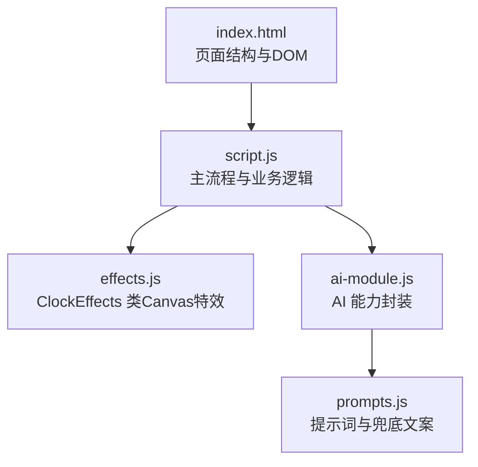
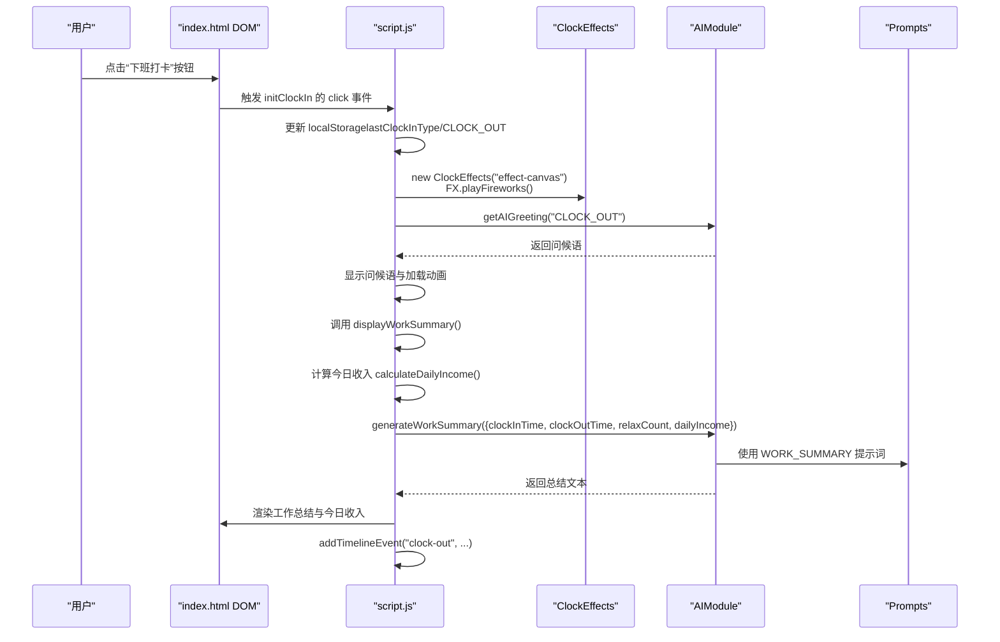
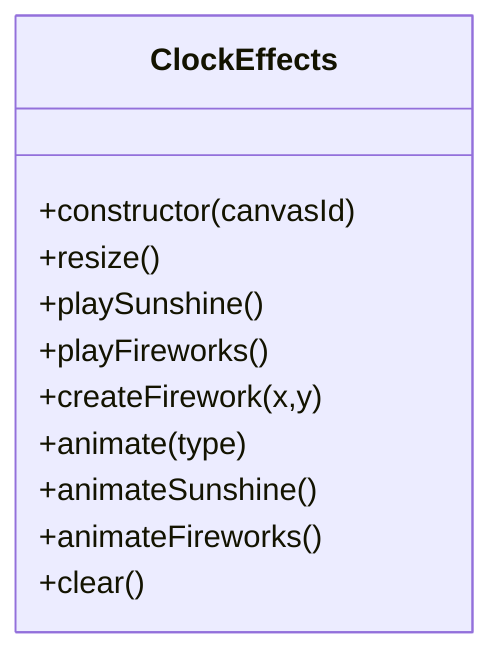
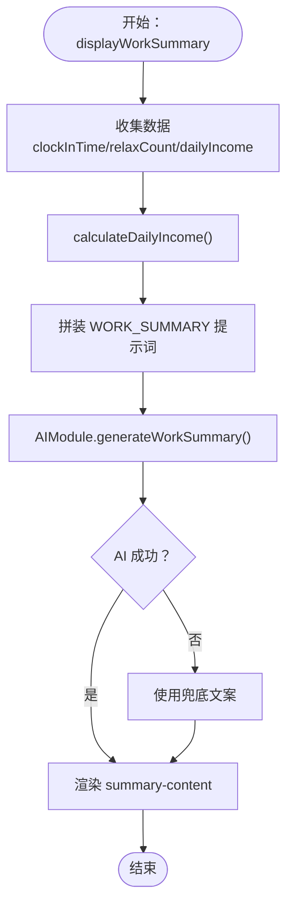
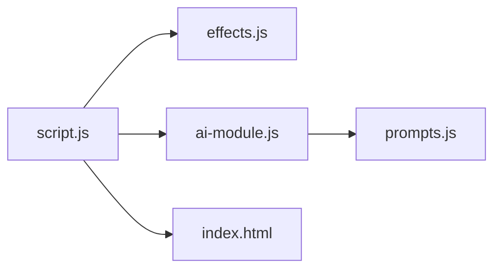

# 下班打卡调试

<cite>
**本文引用的文件**
- [script.js](file://script.js)
- [effects.js](file://effects.js)
- [ai-module.js](file://ai-module.js)
- [prompts.js](file://prompts.js)
- [index.html](file://index.html)
- [README.md](file://README.md)
- [TEST_CHECKLIST_v1.3.3.md](file://TEST_CHECKLIST_v1.3.3.md)
</cite>

## 目录
1. [简介](#简介)
2. [项目结构](#项目结构)
3. [核心组件](#核心组件)
4. [架构总览](#架构总览)
5. [详细组件分析](#详细组件分析)
6. [依赖关系分析](#依赖关系分析)
7. [性能考量](#性能考量)
8. [故障排查指南](#故障排查指南)
9. [结论](#结论)
10. [附录](#附录)

## 简介
本指南围绕“下班打卡”到“生成工作总结”的完整流程，提供面向开发者的调试方法与验证步骤。重点包括：
- 在脚本中设置断点，监控 localStorage 中 lastClockInType、lastClockInDate 等关键字段变化，验证按钮状态切换逻辑。
- 使用开发者工具监控 ClockEffects 类的 playFireworks 方法调用，检查 Canvas 礼花特效是否正常渲染。
- 结合测试清单，逐项验证下班打卡按钮状态、特效播放时机、AI 生成工作总结过程，以及“今日收入”计算的准确性。

## 项目结构
该项目采用前端单页应用结构，核心逻辑集中在 script.js，特效系统位于 effects.js，AI 能力封装在 ai-module.js，提示词与兜底文案在 prompts.js，页面结构在 index.html。

图表来源
- [index.html](file://index.html#L1-L180)
- [script.js](file://script.js#L493-L732)
- [effects.js](file://effects.js#L1-L279)
- [ai-module.js](file://ai-module.js#L1-L216)
- [prompts.js](file://prompts.js#L1-L159)

章节来源
- [index.html](file://index.html#L1-L180)
- [README.md](file://README.md#L1-L125)

## 核心组件
- 打卡按钮与状态机：负责根据 lastClockInType 与 lastClockInDate 切换按钮文本、类型与可用性，并在点击时触发相应流程。
- ClockEffects：封装 Canvas 特效，提供 playSunshine（上班）与 playFireworks（下班）两类动画。
- AI 模块：封装 DeepSeek API 调用、问候语、摸鱼吉日签、工作总结生成与兜底策略。
- 工作总结渲染：收集当日数据（上班时间、摸鱼次数、今日收入），调用 AI 生成总结并渲染到页面。

章节来源
- [script.js](file://script.js#L493-L732)
- [effects.js](file://effects.js#L1-L279)
- [ai-module.js](file://ai-module.js#L1-L216)
- [prompts.js](file://prompts.js#L1-L159)

## 架构总览
下班打卡流程的关键调用链如下：

图表来源
- [index.html](file://index.html#L120-L163)
- [script.js](file://script.js#L547-L728)
- [effects.js](file://effects.js#L64-L86)
- [ai-module.js](file://ai-module.js#L129-L167)
- [prompts.js](file://prompts.js#L27-L47)

## 详细组件分析

### 组件A：下班打卡按钮与状态切换
- 初始化与定时刷新：initClockIn 中每分钟调用 updateClockInButton，依据 lastClockInType 与 lastClockInDate 切换按钮文本与类型（CLOCK_IN/CLOCK_OUT/FINISHED），并控制透明度与可点击性。
- 点击处理：点击时先保存 lastClockInType 与 lastClockInDate；若为 FINISHED，则直接显示问候语与工作总结；否则根据类型分别处理上班/下班流程。
- 下班流程要点：调用 ClockEffects.playFireworks，显示“正在生成工作总结...”加载动画，随后调用 displayWorkSummary 并记录时间轴事件。

调试要点
- 断点设置：在 initClockIn 的 click 事件回调中设置断点，观察 localStorage 的 lastClockInType、lastClockInDate 是否按预期更新；观察按钮 dataset.type 是否随点击变化。
- 状态验证：在 updateClockInButton 中设置断点，验证“同一天/非同一天”分支逻辑，确保按钮文本与类型切换正确。
- 时间轴事件：在 addTimelineEvent 调用处设置断点，确认下班打卡事件被正确写入 todayTimeline 并持久化。

章节来源
- [script.js](file://script.js#L493-L732)
- [script.js](file://script.js#L35-L47)

### 组件B：ClockEffects 类与 Canvas 礼花特效
- 构造与尺寸：构造函数绑定 canvas 并设置为全屏；resize 事件监听窗口变化。
- 动画循环：animate 根据类型选择 animateSunshine 或 animateFireworks；粒子过滤与生命周期管理在各自 animate 方法中完成。
- 礼花特效：playFireworks 创建多个烟花（setTimeout 分批创建），每个烟花由 createFirework 生成大量粒子，带重力与摩擦，形成爆炸与尾迹效果；animateFireworks 负责渲染与衰减。

调试要点
- 断点设置：在 effects.js 的 playFireworks 与 animateFireworks 中设置断点，观察粒子数量、位置与生命周期；确认 requestAnimationFrame 循环持续直至粒子消失。
- Canvas 渲染：在 animateFireworks 中观察 ctx.fillRect/arc/stroke 的调用顺序，确保渲染顺序与透明度衰减逻辑正确。
- 生命周期清理：在 clear 中确认 cancelAnimationFrame 与 ctx.clearRect 被调用，避免内存泄漏。

图表来源
- [effects.js](file://effects.js#L1-L279)

章节来源
- [effects.js](file://effects.js#L1-L279)

### 组件C：AI 生成工作总结与兜底
- 生成流程：displayWorkSummary 收集 clockInTime、relaxCount、dailyIncome，调用 AIModule.generateWorkSummary，最终渲染 summary-content。
- 提示词与兜底：WORK_SUMMARY 提示词包含占位符，AI 模块负责替换并调用 DeepSeek API；失败时返回 FALLBACK_MESSAGES.WORK_SUMMARY。
- 今日收入：calculateDailyIncome 以当月天数计算日薪，保留两位小数。

调试要点
- 断点设置：在 displayWorkSummary 中设置断点，验证 clockInTimeStr、clockOutTimeStr、relaxCount、dailyIncome 的取值；在 generateWorkSummary 中设置断点，观察提示词替换与 API 调用。
- 兜底验证：模拟网络错误或解析失败，确认返回 FALLBACK_MESSAGES.WORK_SUMMARY。

图表来源
- [script.js](file://script.js#L3080-L3150)
- [ai-module.js](file://ai-module.js#L129-L167)
- [prompts.js](file://prompts.js#L27-L47)

章节来源
- [script.js](file://script.js#L3063-L3150)
- [ai-module.js](file://ai-module.js#L129-L167)
- [prompts.js](file://prompts.js#L1-L159)

## 依赖关系分析
- script.js 依赖：
  - DOM（index.html）中的按钮、模态框、Canvas 与容器元素。
  - ClockEffects（effects.js）用于特效播放。
  - AIModule（ai-module.js）用于问候语、摸鱼吉日签与工作总结生成。
  - Prompts（prompts.js）提供提示词模板与兜底文案。
- effects.js 仅依赖 Canvas API 与 requestAnimationFrame。
- ai-module.js 依赖 localStorage 中的 API Key 与 prompts.js 的模板。

图表来源
- [script.js](file://script.js#L493-L732)
- [effects.js](file://effects.js#L1-L279)
- [ai-module.js](file://ai-module.js#L1-L216)
- [prompts.js](file://prompts.js#L1-L159)
- [index.html](file://index.html#L120-L163)

章节来源
- [script.js](file://script.js#L493-L732)
- [effects.js](file://effects.js#L1-L279)
- [ai-module.js](file://ai-module.js#L1-L216)
- [prompts.js](file://prompts.js#L1-L159)
- [index.html](file://index.html#L120-L163)

## 性能考量
- Canvas 动画：使用 requestAnimationFrame 控制帧率，避免使用 setInterval；粒子过期后及时过滤，防止内存泄漏。
- 特效生命周期：在弹窗关闭时调用 effects.clear，确保取消动画与清空画布。
- AI 调用：在 generateWorkSummary 中限制 maxTokens 与温度参数，平衡生成质量与性能。

章节来源
- [effects.js](file://effects.js#L136-L273)
- [ai-module.js](file://ai-module.js#L1-L216)

## 故障排查指南

### 1. 断点调试：监控 localStorage 变化与按钮状态
- 在 initClockIn 的 click 事件中设置断点，观察：
  - localStorage 的 lastClockInType、lastClockInDate 是否按预期更新。
  - dataset.type 是否随点击从 CLOCK_IN 变为 CLOCK_OUT，再变为 FINISHED。
- 在 updateClockInButton 中设置断点，验证：
  - “非同一天”分支：按钮重置为“上班打卡”，类型为 CLOCK_IN。
  - “同一天且上次为 CLOCK_IN”分支：按钮为“下班打卡”，类型为 CLOCK_OUT。
  - “同一天且上次为 CLOCK_OUT”分支：按钮为“已下班”，类型为 FINISHED。
- 在 addTimelineEvent 调用处设置断点，确认事件被写入 todayTimeline 并持久化。

章节来源
- [script.js](file://script.js#L493-L732)
- [script.js](file://script.js#L35-L47)

### 2. 断点调试：验证 Canvas 礼花特效
- 在 effects.js 的 playFireworks 中设置断点，观察：
  - Canvas 尺寸与元素是否存在。
  - setTimeout 分批创建烟花的时机与数量。
  - animateFireworks 的粒子过滤与透明度衰减逻辑。
- 在弹窗关闭时调用 effects.clear，确认动画被取消且画布被清空。

章节来源
- [effects.js](file://effects.js#L64-L86)
- [effects.js](file://effects.js#L136-L273)
- [index.html](file://index.html#L120-L163)

### 3. 断点调试：验证 AI 生成工作总结
- 在 displayWorkSummary 中设置断点，观察：
  - clockInTimeStr、clockOutTimeStr、relaxCount、dailyIncome 的取值。
  - generateWorkSummary 的提示词替换与 API 调用。
- 在 generateWorkSummary 中设置断点，验证：
  - WORK_SUMMARY 提示词模板是否正确填充。
  - API 调用失败时是否返回兜底文案。
- 在 summary-content 渲染处设置断点，确认“今日收入”字段高亮显示。

章节来源
- [script.js](file://script.js#L3080-L3150)
- [ai-module.js](file://ai-module.js#L129-L167)
- [prompts.js](file://prompts.js#L27-L47)

### 4. 结合测试清单逐项验证
- 下班打卡按钮状态切换逻辑：
  - 非同一天：按钮为“上班打卡”，类型 CLOCK_IN。
  - 同一天且上次为 CLOCK_IN：按钮为“下班打卡”，类型 CLOCK_OUT。
  - 同一天且上次为 CLOCK_OUT：按钮为“已下班”，类型 FINISHED。
- 礼花特效播放时机：
  - 下班打卡时立即播放，弹窗关闭时清理。
- AI 生成工作总结：
  - 包含上班时间、下班时间、摸鱼次数、今日收入。
  - 若 AI 失败，显示兜底文案。
- 今日收入计算准确性：
  - 以当月天数计算日薪，保留两位小数；与测试清单中的日薪计算规则一致。

章节来源
- [TEST_CHECKLIST_v1.3.3.md](file://TEST_CHECKLIST_v1.3.3.md#L36-L57)
- [script.js](file://script.js#L3063-L3077)
- [script.js](file://script.js#L3080-L3150)

## 结论
通过在关键位置设置断点与逐步验证，可以高效定位下班打卡流程中的问题点。建议优先验证按钮状态切换与 localStorage 更新，再验证特效播放与 AI 生成路径，最后核对“今日收入”计算与渲染细节。结合测试清单可确保功能完整性与边界条件的正确性。

## 附录

### A. 下班打卡流程调试清单（对照测试清单）
- 按钮状态切换：验证三种状态（CLOCK_IN/CLOCK_OUT/FINISHED）与按钮文本/类型一致性。
- 礼花特效：验证播放时机、粒子数量与动画流畅度。
- 工作总结：验证问候语、加载动画、AI 文案与“今日收入”字段高亮。
- 收入计算：验证按月天数的日薪计算与数值精度。

章节来源
- [TEST_CHECKLIST_v1.3.3.md](file://TEST_CHECKLIST_v1.3.3.md#L36-L57)
- [script.js](file://script.js#L3063-L3150)