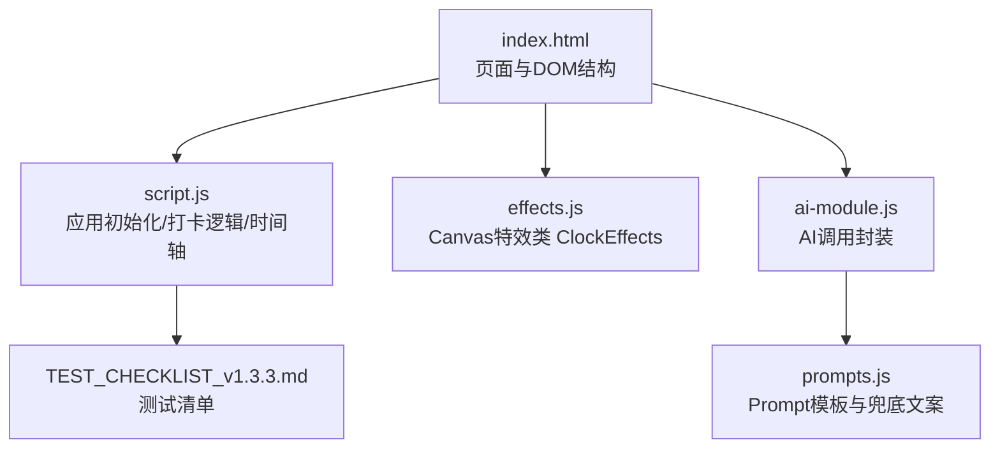
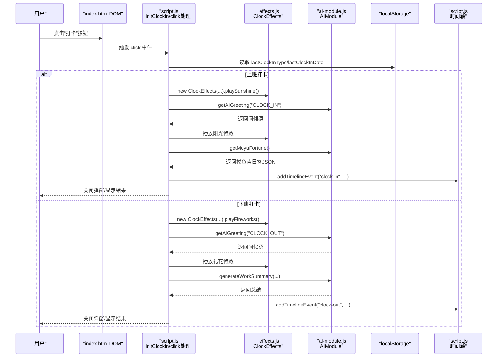
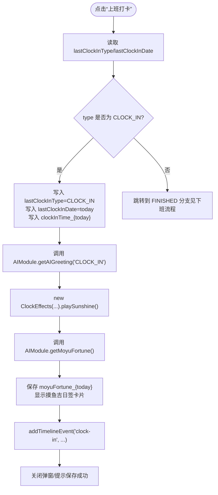
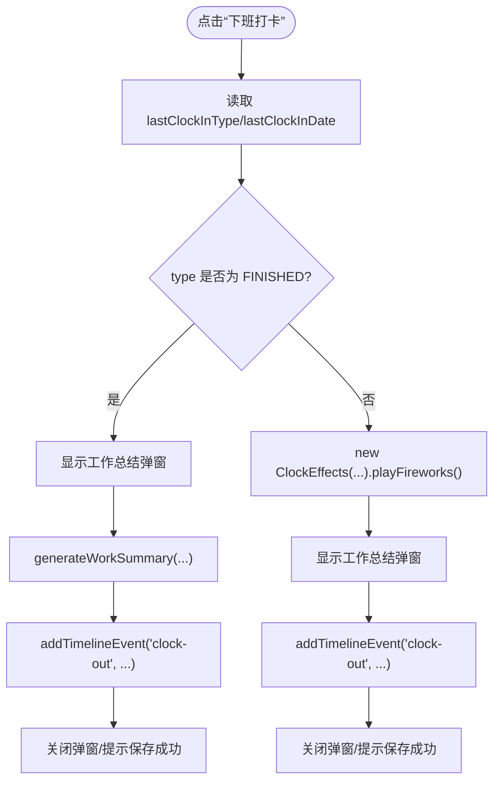
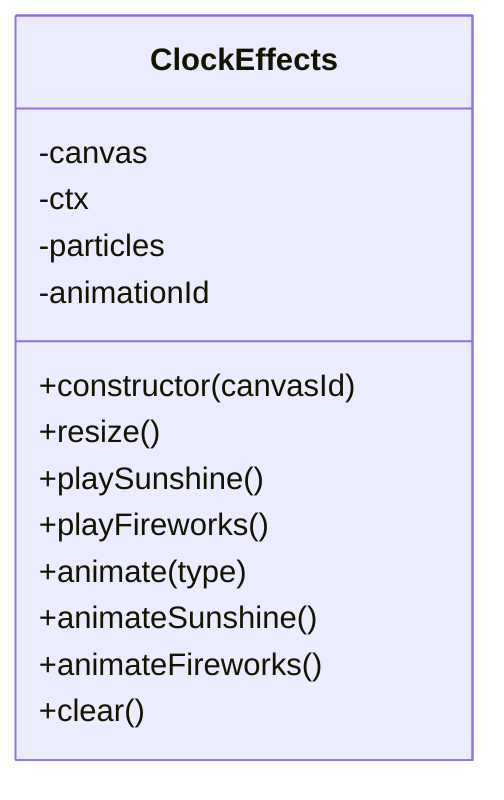
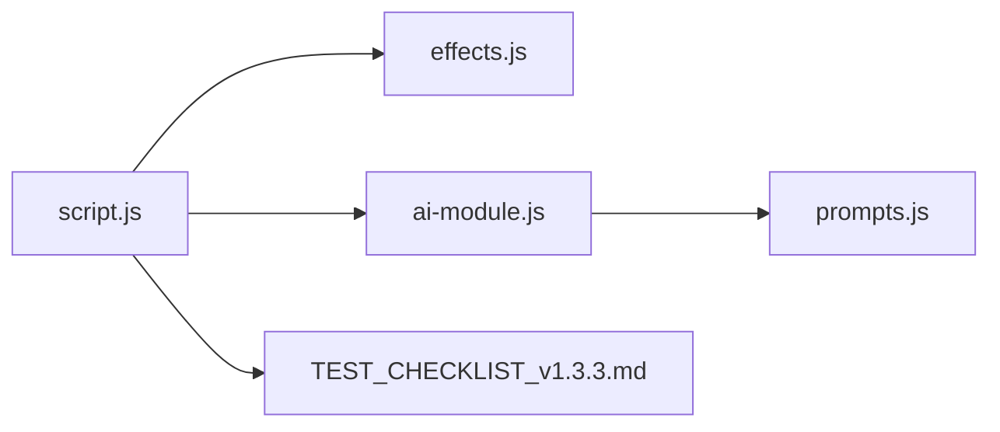

# 打卡流程调试

<cite>
**本文引用的文件**
- [index.html](file://index.html)
- [script.js](file://script.js)
- [effects.js](file://effects.js)
- [ai-module.js](file://ai-module.js)
- [prompts.js](file://prompts.js)
- [TEST_CHECKLIST_v1.3.3.md](file://TEST_CHECKLIST_v1.3.3.md)
- [README.md](file://README.md)
</cite>

## 目录
1. [简介](#简介)
2. [项目结构](#项目结构)
3. [核心组件](#核心组件)
4. [架构总览](#架构总览)
5. [详细组件分析](#详细组件分析)
6. [依赖关系分析](#依赖关系分析)
7. [性能考量](#性能考量)
8. [故障排查指南](#故障排查指南)
9. [结论](#结论)
10. [附录](#附录)

## 简介
本指南面向开发者，围绕“上班打卡”和“下班打卡”的完整流程进行调试与验证，重点包括：
- 在 script.js 中设置断点监控打卡状态变化（lastClockInType、lastClockInDate 等 localStorage 数据）
- 验证时间轴事件记录是否正确添加
- 使用开发者工具监控 ClockEffects 类的 playSunshine 和 playFireworks 方法调用，检查 Canvas 动画是否正常渲染
- 结合 TEST_CHECKLIST_v1.3.3.md 的测试项，验证打卡按钮状态切换逻辑与特效播放时机

## 项目结构
Work Timer 采用前端单页应用结构，核心入口为 index.html，业务逻辑集中在 script.js，特效系统位于 effects.js，AI 能力封装在 ai-module.js，Prompt 与兜底文案在 prompts.js。

图表来源
- [index.html](file://index.html#L1-L180)
- [script.js](file://script.js#L493-L732)
- [effects.js](file://effects.js#L1-L279)
- [ai-module.js](file://ai-module.js#L1-L216)
- [prompts.js](file://prompts.js#L1-L159)
- [TEST_CHECKLIST_v1.3.3.md](file://TEST_CHECKLIST_v1.3.3.md#L1-L178)

章节来源
- [index.html](file://index.html#L1-L180)
- [README.md](file://README.md#L1-L125)

## 核心组件
- 打卡功能与状态管理：initClockIn、updateClockInButton、addTimelineEvent
- 特效系统：ClockEffects.playSunshine、ClockEffects.playFireworks、ClockEffects.clear/animate
- AI 能力：AIModule.getAIGreeting、getMoyuFortune、generateWorkSummary
- 时间轴：loadTodayTimeline/saveTodayTimeline/addTimelineEvent

章节来源
- [script.js](file://script.js#L493-L732)
- [effects.js](file://effects.js#L1-L279)
- [ai-module.js](file://ai-module.js#L1-L216)
- [prompts.js](file://prompts.js#L1-L159)

## 架构总览
打卡流程涉及 DOM 事件、本地存储、AI 调用、Canvas 动画与时间轴记录的协同。下图展示了从点击打卡按钮到特效播放与时间轴记录的关键路径。

图表来源
- [index.html](file://index.html#L120-L170)
- [script.js](file://script.js#L493-L732)
- [effects.js](file://effects.js#L1-L279)
- [ai-module.js](file://ai-module.js#L1-L216)

## 详细组件分析

### 上班打卡流程调试要点
- 断点设置位置
  - 在 initClockIn 的 click 事件回调中设置断点，观察 type 判断与 localStorage 写入时机
  - 在 addTimelineEvent 调用处设置断点，验证事件结构与保存
  - 在 playSunshine 调用处设置断点，确认 Canvas 初始化与粒子创建
- 关键 localStorage 数据
  - lastClockInType：记录当前打卡类型（CLOCK_IN/CLOCK_OUT/FINISHED）
  - lastClockInDate：记录当天日期，用于判断是否跨日重置
  - clockInTime_{today}：记录上班打卡时间
  - moyuFortune_{today}：记录今日摸鱼运势，用于 header 展示
- 时间轴事件
  - 类型为 "clock-in"，内容包含打卡时间，extraData 可包含 fortune
- 特效验证
  - playSunshine 应创建大量光点粒子并绘制光晕，动画通过 requestAnimationFrame 循环
  - 关闭弹窗时应调用 clear 清理动画与粒子

图表来源
- [script.js](file://script.js#L493-L732)
- [effects.js](file://effects.js#L1-L279)
- [ai-module.js](file://ai-module.js#L1-L216)

章节来源
- [script.js](file://script.js#L493-L732)
- [effects.js](file://effects.js#L1-L279)
- [ai-module.js](file://ai-module.js#L1-L216)

### 下班打卡流程调试要点
- 断点设置位置
  - 在 initClockIn 的 click 事件回调中设置断点，观察 FINISHED 分支与 type 判断
  - 在 playFireworks 调用处设置断点，确认 Canvas 初始化与粒子爆炸
  - 在 addTimelineEvent 处设置断点，验证 "clock-out" 事件写入
- 关键 localStorage 数据
  - lastClockInType：记录为 CLOCK_OUT
  - lastClockInDate：仍为当天
- 时间轴事件
  - 类型为 "clock-out"，内容包含下班时间
- 特效验证
  - playFireworks 应创建多组粒子并带有重力与摩擦，动画通过 requestAnimationFrame 循环
  - 关闭弹窗时应调用 clear 清理动画与粒子

图表来源
- [script.js](file://script.js#L493-L732)
- [effects.js](file://effects.js#L1-L279)
- [ai-module.js](file://ai-module.js#L1-L216)

章节来源
- [script.js](file://script.js#L493-L732)
- [effects.js](file://effects.js#L1-L279)
- [ai-module.js](file://ai-module.js#L1-L216)

### ClockEffects 类与 Canvas 动画调试
- 类构造与生命周期
  - 构造函数中获取 canvas 并设置为全屏，监听 resize 事件
  - clear 方法负责取消帧动画、清空画布、重置粒子数组
- 阳光特效（playSunshine）
  - 创建大量小光点与光晕粒子，使用径向渐变绘制
  - animateSunshine 通过 requestAnimationFrame 循环更新粒子位置与透明度
- 礼花特效（playFireworks）
  - 多组定时创建粒子，带有初速度、重力与摩擦
  - animateFireworks 绘制粒子轨迹与尾迹，alpha 递减实现消散
- 调试建议
  - 在构造函数与 clear 中设置断点，确认画布尺寸与清理
  - 在 playSunshine/playFireworks 中设置断点，观察粒子数量与位置变化
  - 使用性能面板检查 requestAnimationFrame 使用情况与帧耗时

图表来源
- [effects.js](file://effects.js#L1-L279)

章节来源
- [effects.js](file://effects.js#L1-L279)

### 时间轴事件记录与验证
- 事件结构
  - id：时间戳
  - time：事件发生时间
  - type：事件类型（如 "clock-in"、"clock-out"、"relax"、"pomodoro"）
  - content：事件描述
  - extraData：附加数据（如上班打卡包含 fortune）
- 保存策略
  - 每次事件添加后立即保存到 localStorage，键名为 timeline_{today}
- 调试建议
  - 在 addTimelineEvent 调用处设置断点，检查事件对象字段
  - 在 saveTodayTimeline 调用处设置断点，确认 localStorage 写入
  - 刷新页面后读取 timeline_{today}，验证事件顺序与完整性

章节来源
- [script.js](file://script.js#L18-L47)
- [script.js](file://script.js#L29-L33)

### 打卡按钮状态切换逻辑验证
- 状态判断规则
  - 若 lastClockInDate 不等于当天，则按钮显示“上班打卡”，type 为 CLOCK_IN
  - 若 lastClockInType 为 CLOCK_IN，则按钮显示“下班打卡”，type 为 CLOCK_OUT
  - 若 lastClockInType 为 CLOCK_OUT，则按钮显示“已下班”，type 为 FINISHED
- 调试建议
  - 在 updateClockInButton 中设置断点，观察不同分支下的按钮文本、dataset.type、禁用状态与透明度
  - 每分钟定时更新，可在开发者工具中模拟跨日场景（修改 developerMode/customTime）

章节来源
- [script.js](file://script.js#L493-L545)

## 依赖关系分析
- script.js 依赖
  - DOM 结构（index.html 中的打卡弹窗、Canvas、按钮等）
  - ClockEffects（effects.js）
  - AIModule（ai-module.js）
  - localStorage（浏览器本地存储）
- ai-module.js 依赖
  - prompts.js（Prompt 模板与兜底文案）
- 测试清单驱动的验证点
  - 上班打卡：显示阳光特效、摸鱼吉日签卡片、“再求一签”、“开始摸鱼”、时间轴记录
  - 下班打卡：显示礼花特效、工作总结、时间轴记录
  - 特效系统：Canvas 初始化、requestAnimationFrame 使用、粒子清理
  - 设置与持久化：localStorage 写入与读取

图表来源
- [script.js](file://script.js#L493-L732)
- [effects.js](file://effects.js#L1-L279)
- [ai-module.js](file://ai-module.js#L1-L216)
- [prompts.js](file://prompts.js#L1-L159)
- [TEST_CHECKLIST_v1.3.3.md](file://TEST_CHECKLIST_v1.3.3.md#L1-L178)

章节来源
- [script.js](file://script.js#L493-L732)
- [effects.js](file://effects.js#L1-L279)
- [ai-module.js](file://ai-module.js#L1-L216)
- [prompts.js](file://prompts.js#L1-L159)
- [TEST_CHECKLIST_v1.3.3.md](file://TEST_CHECKLIST_v1.3.3.md#L1-L178)

## 性能考量
- 动画性能
  - 使用 requestAnimationFrame 控制动画帧，避免使用 setInterval
  - 过期粒子及时过滤与清理，防止内存泄漏
- Canvas 优化
  - resize 时重设画布尺寸，避免缩放导致的重绘开销
  - 渐变与路径绘制尽量批量处理
- AI 调用
  - 在 getAIGreeting 中提供兜底文案，避免网络异常导致的阻塞
  - generateWorkSummary 与 getMoyuFortune 使用合理的 maxTokens 与温度参数

章节来源
- [effects.js](file://effects.js#L1-L279)
- [ai-module.js](file://ai-module.js#L1-L216)

## 故障排查指南
- 问题：打卡按钮状态不更新
  - 检查 updateClockInButton 是否被定时器触发（每分钟）
  - 检查 localStorage 中 lastClockInType/lastClockInDate 是否正确写入
- 问题：特效不播放或画面空白
  - 检查 Canvas 元素是否存在且尺寸有效
  - 在 playSunshine/playFireworks 中断点，确认粒子数组创建与 animate 循环
  - 关闭弹窗后是否调用 clear 清理
- 问题：时间轴未记录事件
  - 在 addTimelineEvent/saveTodayTimeline 断点，确认事件对象与 localStorage 键名
- 问题：AI 调用失败
  - 检查 deepseekApiKey 是否配置
  - 观察 getMoyuFortune/generateWorkSummary 的兜底逻辑是否生效
- 问题：跨日状态异常
  - 使用开发者设置（developerMode/customTime）模拟不同日期，验证按钮重置逻辑

章节来源
- [script.js](file://script.js#L493-L732)
- [effects.js](file://effects.js#L1-L279)
- [ai-module.js](file://ai-module.js#L1-L216)

## 结论
通过在 script.js 中设置断点监控打卡状态与时间轴事件，在 effects.js 中验证 ClockEffects 的特效播放与清理，在 ai-module.js 中核验 AI 调用与兜底逻辑，结合 TEST_CHECKLIST_v1.3.3.md 的测试项，可以系统地完成“上班打卡”和“下班打卡”的全流程调试与验证。建议在开发者工具中配合性能面板与网络面板，定位动画帧耗时与网络请求异常，确保用户体验流畅稳定。

## 附录
- 测试清单关键项（节选）
  - 上班打卡：显示阳光特效、摸鱼吉日签卡片、“再求一签”、“开始摸鱼”、时间轴记录
  - 下班打卡：显示礼花特效、工作总结、时间轴记录
  - 特效系统：Canvas 初始化、requestAnimationFrame 使用、粒子清理
  - 设置与持久化：localStorage 写入与读取

章节来源
- [TEST_CHECKLIST_v1.3.3.md](file://TEST_CHECKLIST_v1.3.3.md#L1-L178)