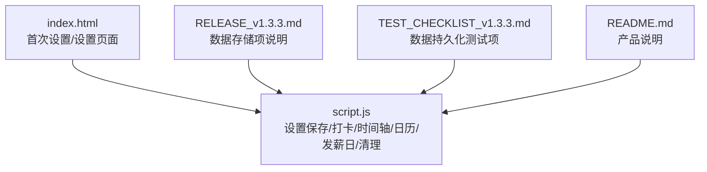
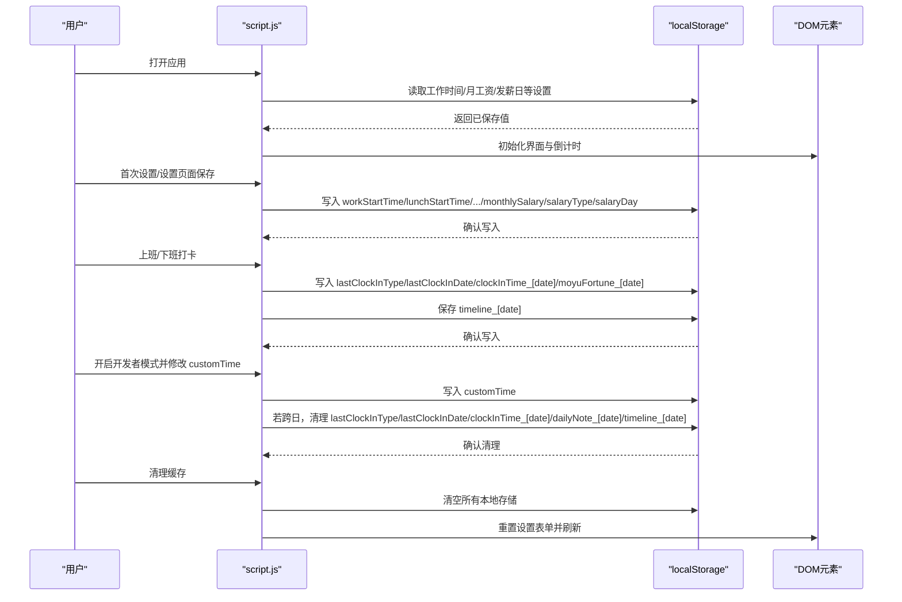
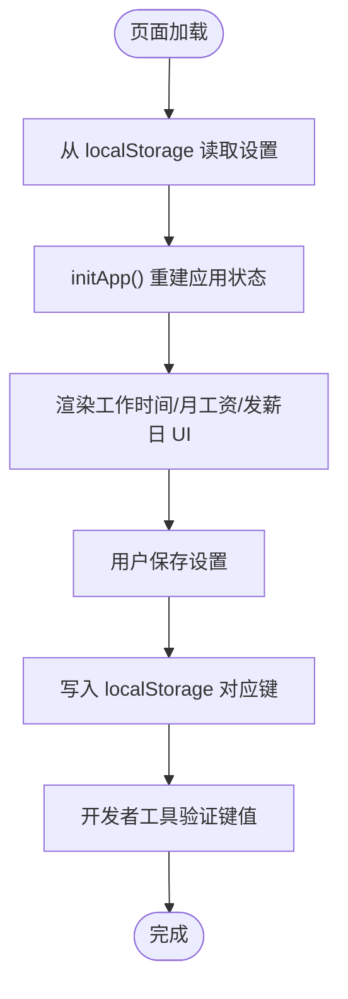
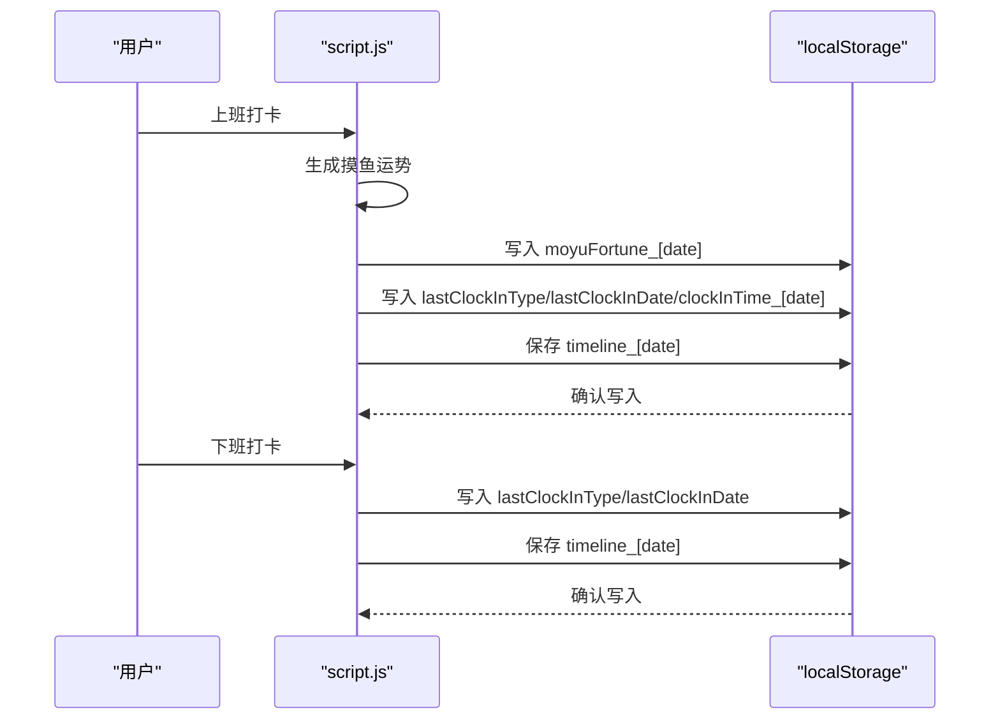
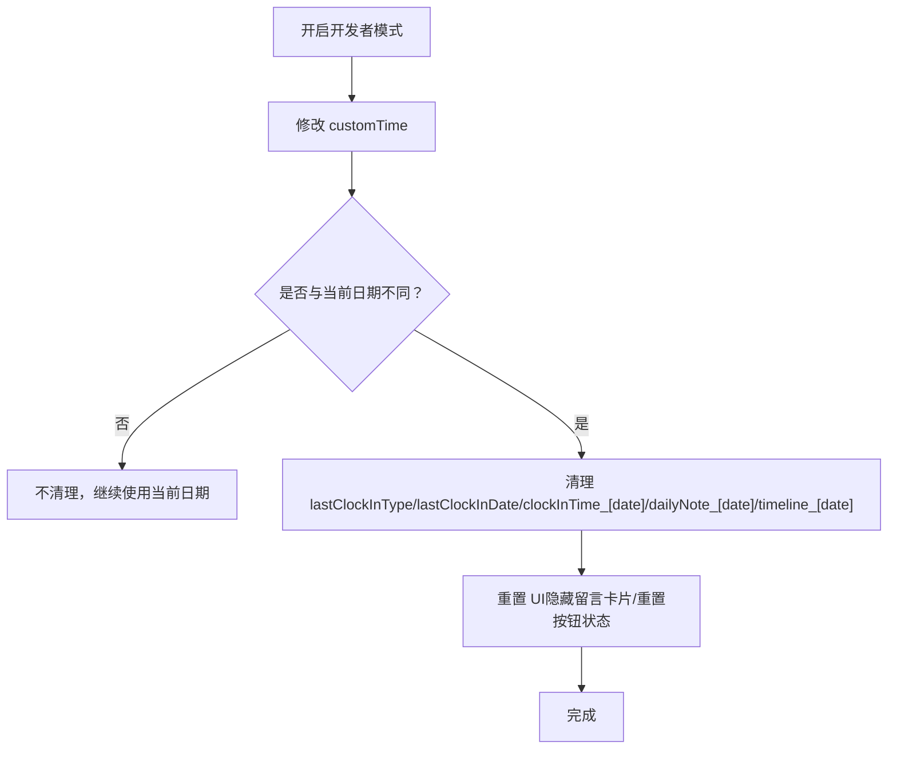
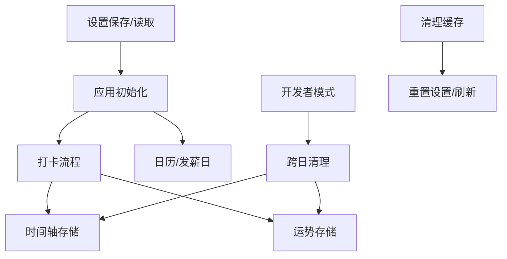

# 数据持久化调试

<cite>
**本文引用的文件**
- [script.js](file://script.js)
- [RELEASE_v1.3.3.md](file://RELEASE_v1.3.3.md)
- [TEST_CHECKLIST_v1.3.3.md](file://TEST_CHECKLIST_v1.3.3.md)
- [README.md](file://README.md)
- [index.html](file://index.html)
</cite>

## 目录
1. [简介](#简介)
2. [项目结构](#项目结构)
3. [核心组件](#核心组件)
4. [架构总览](#架构总览)
5. [详细组件分析](#详细组件分析)
6. [依赖关系分析](#依赖关系分析)
7. [性能考量](#性能考量)
8. [故障排查指南](#故障排查指南)
9. [结论](#结论)
10. [附录](#附录)

## 简介
本指南聚焦于浏览器本地存储（localStorage）的数据持久化问题，围绕以下关键目标提供系统化调试方法：
- 使用浏览器开发者工具的应用程序面板监控 localStorage 的读写，验证工作时间配置（workStartTime、lunchStartTime、lunchEndTime、workEndTime）、月工资（monthlySalary）等关键设置项是否正确存储。
- 检查时间轴数据（timeline_[date]）与摸鱼运势（moyuFortune_[date]）的日期格式与生命周期管理。
- 结合测试清单（TEST_CHECKLIST_v1.3.3.md）验证新旧数据切换与清除逻辑，确保跨版本与跨日期的数据一致性。

## 项目结构
Work Timer 采用前端单页应用结构，核心逻辑集中在脚本文件中，数据持久化主要通过 localStorage 实现。关键文件与职责如下：
- script.js：应用主逻辑，包括设置保存、打卡流程、时间轴、日历、发薪日计算、AI交互、开发者模式与数据清理等。
- index.html：首次设置与设置页面的表单元素，承载月工资、发薪日类型等输入控件。
- RELEASE_v1.3.3.md：版本发布说明，明确数据存储项（如 monthlySalary、moyuFortune_[date]）。
- TEST_CHECKLIST_v1.3.3.md：数据持久化测试项，涵盖 localStorage 存储、按日期存储、刷新不丢失、跨日自动清理等。
- README.md：产品说明，概述功能与数据来源。

图表来源
- [script.js](file://script.js#L1-L200)
- [index.html](file://index.html#L185-L395)
- [RELEASE_v1.3.3.md](file://RELEASE_v1.3.3.md#L87-L91)
- [TEST_CHECKLIST_v1.3.3.md](file://TEST_CHECKLIST_v1.3.3.md#L89-L95)
- [README.md](file://README.md#L1-L125)

章节来源
- [script.js](file://script.js#L1-L200)
- [index.html](file://index.html#L185-L395)
- [RELEASE_v1.3.3.md](file://RELEASE_v1.3.3.md#L87-L91)
- [TEST_CHECKLIST_v1.3.3.md](file://TEST_CHECKLIST_v1.3.3.md#L89-L95)
- [README.md](file://README.md#L1-L125)

## 核心组件
- 设置保存与读取
  - 首次设置与设置页面保存：workStartTime、lunchStartTime、lunchEndTime、workEndTime、monthlySalary、salaryType、salaryDay、hasInitialized、hasVisited 等。
  - 初始化时从 localStorage 读取并重建应用状态。
- 打卡与时间轴
  - 上班/下班打卡：记录 lastClockInType、lastClockInDate、clockInTime_[date]，并生成时间轴事件。
  - 摸鱼运势：按日期存储 moyuFortune_[date]，并在 header 展示。
- 日历与发薪日
  - 日历渲染与发薪日计算：salaryType/salaryDay、officialHolidays、officialWeekendWorkdays。
- 开发者模式与数据清理
  - 开发者模式切换 customTime，触发跨日清理：移除 lastClockInType、lastClockInDate、clockInTime_[date]、dailyNote_[date]、timeline_[date]，并重置 UI。
  - 清理缓存：一键清空所有本地存储并重置设置表单。

章节来源
- [script.js](file://script.js#L1064-L1205)
- [script.js](file://script.js#L546-L732)
- [script.js](file://script.js#L1-L1345)
- [index.html](file://index.html#L185-L395)

## 架构总览
数据持久化贯穿应用生命周期，涉及设置、打卡、时间轴、日历与清理等模块。下图展示关键数据流与依赖关系。

图表来源
- [script.js](file://script.js#L1064-L1205)
- [script.js](file://script.js#L546-L732)
- [script.js](file://script.js#L1-L1345)
- [index.html](file://index.html#L185-L395)

## 详细组件分析

### 组件A：设置保存与读取（工作时间、月工资、发薪日）
- 关键点
  - 首次设置与设置页面保存：workStartTime、lunchStartTime、lunchEndTime、workEndTime、monthlySalary、salaryType、salaryDay、hasInitialized、hasVisited。
  - 初始化时从 localStorage 读取并重建工作时间配置与 UI。
- 调试要点
  - 使用浏览器开发者工具的应用程序面板，筛选 localStorage，确认上述键是否存在且值正确。
  - 验证设置页面的输入框与 localStorage 的双向绑定（保存后刷新仍可见）。
  - 若发现值异常，检查设置保存函数与初始化函数的调用时机。

图表来源
- [script.js](file://script.js#L1064-L1117)
- [script.js](file://script.js#L1214-L1270)
- [index.html](file://index.html#L185-L395)

章节来源
- [script.js](file://script.js#L1064-L1117)
- [script.js](file://script.js#L1214-L1270)
- [index.html](file://index.html#L185-L395)

### 组件B：打卡流程与时间轴（timeline_[date]、moyuFortune_[date]）
- 关键点
  - 上班打卡：生成并显示摸鱼运势，保存 moyuFortune_[date]；记录 lastClockInType/CURRENT_DATE/clockInTime_[date]；添加时间轴事件。
  - 下班打卡：生成工作总结，记录 lastClockInType/CURRENT_DATE；添加时间轴事件。
  - 时间轴：按日期键 timeline_[date] 存储当日事件列表。
- 调试要点
  - 在开发者工具的应用程序面板中，按日期键名检索 timeline_[date] 与 moyuFortune_[date]，确认键名格式与内容结构。
  - 验证时间轴事件的类型、时间戳与内容字段是否完整。
  - 若发现某日数据缺失，检查 addTimelineEvent 与保存逻辑是否被调用。

图表来源
- [script.js](file://script.js#L546-L732)
- [script.js](file://script.js#L1-L1345)

章节来源
- [script.js](file://script.js#L546-L732)
- [script.js](file://script.js#L1-L1345)

### 组件C：开发者模式与跨日清理（customTime、跨日检测）
- 关键点
  - 开发者模式启用后，customTime 可设置任意日期时间；若与当前日期不同，将触发清理逻辑：移除 lastClockInType、lastClockInDate、clockInTime_[date]、dailyNote_[date]、timeline_[date]，并重置 UI。
- 调试要点
  - 在开发者模式下修改 customTime，观察是否触发跨日清理。
  - 使用开发者工具的应用程序面板，确认对应键被移除，同时时间轴与 header 的摸鱼运势被重置。

图表来源
- [script.js](file://script.js#L1132-L1205)

章节来源
- [script.js](file://script.js#L1132-L1205)

### 组件D：清理缓存（一键清空 localStorage）
- 关键点
  - 清理缓存按钮会清空所有本地存储，并重置设置表单，随后刷新页面。
- 调试要点
  - 执行清理后，确认所有与设置、打卡、时间轴相关的键均被移除。
  - 刷新后，应用应回到首次设置状态。

章节来源
- [script.js](file://script.js#L134-L155)
- [index.html](file://index.html#L185-L395)

## 依赖关系分析
- 数据存储依赖
  - 设置项依赖：workStartTime、lunchStartTime、lunchEndTime、workEndTime、monthlySalary、salaryType、salaryDay、hasInitialized、hasVisited。
  - 打卡与时间轴依赖：lastClockInType、lastClockInDate、clockInTime_[date]、timeline_[date]、moyuFortune_[date]。
  - 日历与发薪日依赖：officialHolidays、officialWeekendWorkdays、salaryType、salaryDay。
- 逻辑耦合
  - 初始化与设置保存相互依赖，确保 UI 与存储一致。
  - 开发者模式与跨日清理逻辑耦合，避免跨日期数据污染。
  - 清理缓存逻辑独立，用于极端场景下的数据重置。

图表来源
- [script.js](file://script.js#L1064-L1205)
- [script.js](file://script.js#L546-L732)
- [script.js](file://script.js#L1-L1345)

章节来源
- [script.js](file://script.js#L1064-L1205)
- [script.js](file://script.js#L546-L732)
- [script.js](file://script.js#L1-L1345)

## 性能考量
- localStorage 读写频率
  - 设置保存与初始化时读取，日常使用中读写频率较低，一般不会造成性能瓶颈。
- 数据量控制
  - timeline_[date] 按日存储，建议避免在短时间内产生大量事件；必要时可在 UI 层限制显示数量。
- 跨日清理
  - 开发者模式下的跨日清理会移除当日相关键，避免数据膨胀；建议在生产环境中谨慎使用该模式。

## 故障排查指南

### 症状：localStorage 中缺少关键键
- 现象
  - 设置未生效、打卡无记录、时间轴为空、header 无运势。
- 排查步骤
  - 打开浏览器开发者工具 → 应用程序面板 → 本地存储，搜索以下键：
    - workStartTime、lunchStartTime、lunchEndTime、workEndTime、monthlySalary、salaryType、salaryDay、hasInitialized、hasVisited
    - lastClockInType、lastClockInDate、clockInTime_[date]、timeline_[date]、moyuFortune_[date]
  - 若缺失，检查：
    - 首次设置是否完成（hasInitialized 是否为 true）。
    - 设置页面保存按钮是否被点击，以及保存函数是否执行。
    - 打卡流程是否触发（上班/下班）。
- 处理建议
  - 重新完成首次设置或在设置页面更新并保存。
  - 执行一次打卡操作以生成对应键。

章节来源
- [script.js](file://script.js#L1064-L1117)
- [script.js](file://script.js#L1214-L1270)
- [script.js](file://script.js#L546-L732)
- [script.js](file://script.js#L1-L1345)

### 症状：时间轴数据不一致或缺失
- 现象
  - 时间轴显示为空或事件缺失。
- 排查步骤
  - 在应用程序面板中查找 timeline_[date] 键，确认键名格式与内容结构。
  - 检查 addTimelineEvent 是否被调用，以及保存逻辑是否执行。
- 处理建议
  - 执行一次打卡或点击卡片事件，确保事件被记录并保存。
  - 如需重置，使用清理缓存功能或开发者模式跨日清理。

章节来源
- [script.js](file://script.js#L1-L1345)
- [script.js](file://script.js#L546-L732)

### 症状：摸鱼运势未显示或跨日未更新
- 现象
  - header 无运势或显示旧数据。
- 排查步骤
  - 检查 moyuFortune_[date] 键是否存在，确认键名格式。
  - 验证开发者模式下 customTime 是否导致跨日清理。
- 处理建议
  - 上班打卡后重新生成运势并保存。
  - 如属跨日清理导致，等待次日自动更新。

章节来源
- [script.js](file://script.js#L546-L732)
- [script.js](file://script.js#L1132-L1205)

### 症状：刷新后数据丢失
- 现象
  - 刷新页面后设置或打卡数据消失。
- 排查步骤
  - 确认 localStorage 中对应键是否存在。
  - 检查是否误触清理缓存。
- 处理建议
  - 重新设置并保存。
  - 如误触清理缓存，重新完成首次设置。

章节来源
- [script.js](file://script.js#L134-L155)
- [script.js](file://script.js#L1064-L1117)

### 症状：跨日清理未生效
- 现象
  - customTime 修改后未触发清理。
- 排查步骤
  - 检查开发者模式开关与 customTime 输入框是否正确绑定。
  - 观察是否真的跨日（newDate 与 lastClockInDate 不同）。
- 处理建议
  - 确认开发者模式启用并修改 customTime。
  - 切换到不同日期后再次进入应用，确认清理逻辑执行。

章节来源
- [script.js](file://script.js#L1132-L1205)

## 结论
通过浏览器开发者工具的应用程序面板，可以高效定位与修复 localStorage 数据持久化问题。针对工作时间、月工资、发薪日、时间轴与摸鱼运势等关键数据，建议建立定期核对机制，并结合测试清单（TEST_CHECKLIST_v1.3.3.md）进行回归验证，确保新旧数据切换与清理逻辑稳定可靠。

## 附录

### 附录A：数据持久化测试清单对照
- 数据存储项
  - monthlySalary：设置页面保存与读取。
  - moyuFortune_[date]：按日期存储，header 展示。
  - timeline_[date]：按日期存储当日事件。
  - lastClockInType/lastClockInDate/clockInTime_[date]：打卡状态与时间记录。
- 测试关注点
  - 保存后刷新不丢失。
  - 新的一天自动清理上一天的运势与时间轴。
  - 开发者模式跨日清理逻辑正确。

章节来源
- [RELEASE_v1.3.3.md](file://RELEASE_v1.3.3.md#L87-L91)
- [TEST_CHECKLIST_v1.3.3.md](file://TEST_CHECKLIST_v1.3.3.md#L89-L95)
- [script.js](file://script.js#L1-L1345)
- [script.js](file://script.js#L546-L732)
- [script.js](file://script.js#L1132-L1205)