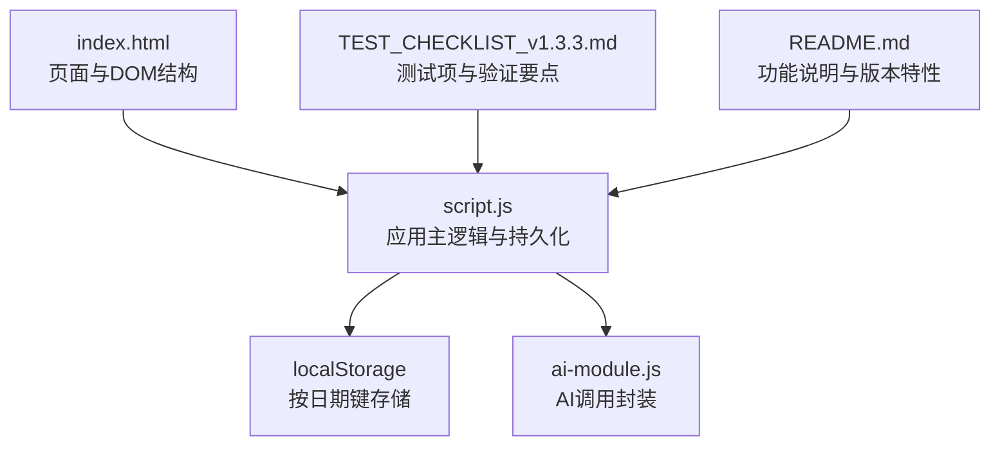
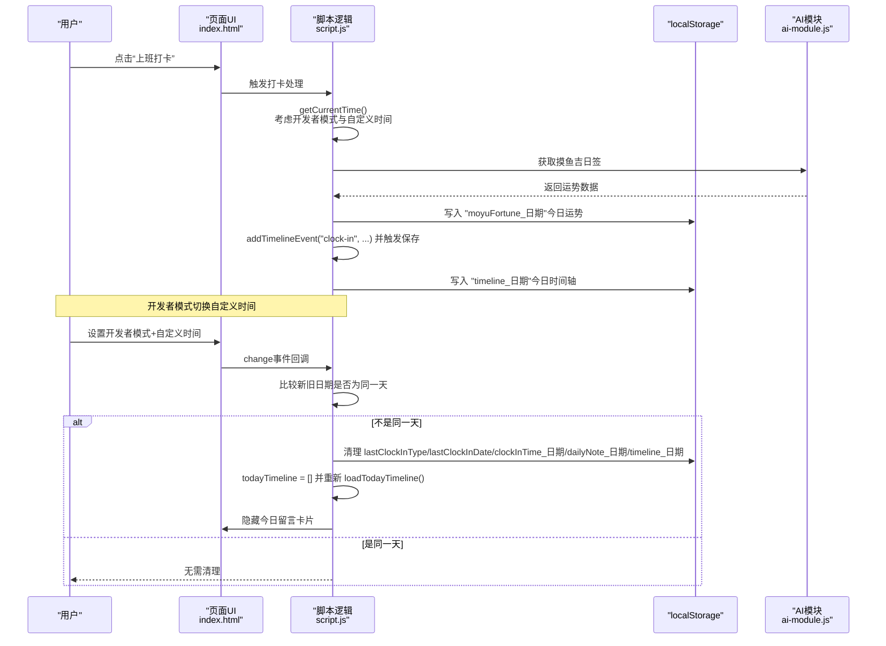
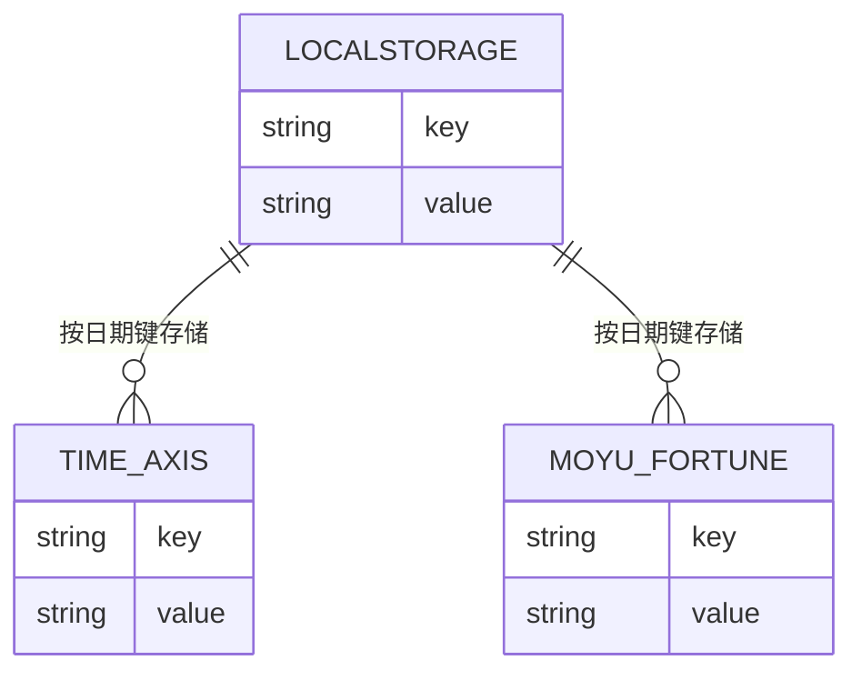
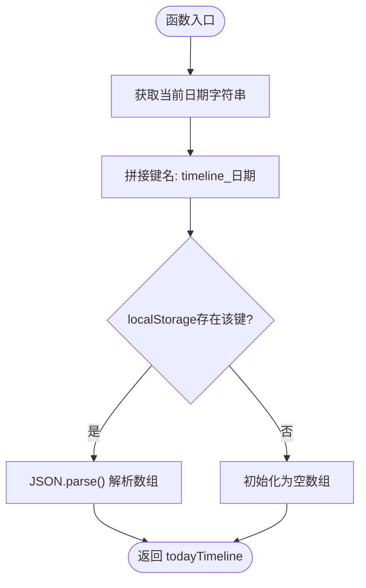
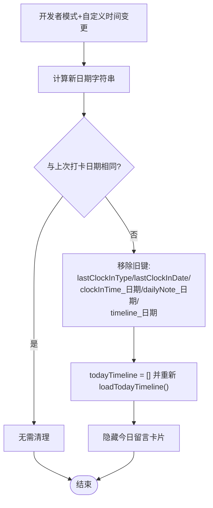
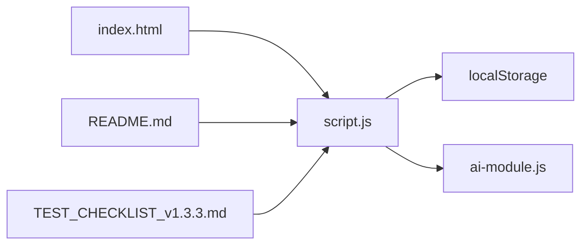

# 每日数据持久化调试

<cite>
**本文引用的文件**
- [script.js](file://script.js)
- [index.html](file://index.html)
- [ai-module.js](file://ai-module.js)
- [TEST_CHECKLIST_v1.3.3.md](file://TEST_CHECKLIST_v1.3.3.md)
- [README.md](file://README.md)
</cite>

## 目录
1. [简介](#简介)
2. [项目结构](#项目结构)
3. [核心组件](#核心组件)
4. [架构总览](#架构总览)
5. [详细组件分析](#详细组件分析)
6. [依赖关系分析](#依赖关系分析)
7. [性能考量](#性能考量)
8. [故障排查指南](#故障排查指南)
9. [结论](#结论)
10. [附录](#附录)

## 简介
本指南聚焦于按日期存储的本地持久化数据，包括“timeline_[date]”时间轴与“moyuFortune_[date]”运势数据。目标是帮助开发者：
- 在浏览器开发者工具中监控特定日期格式的 localStorage 键值
- 验证每日切换时的清除逻辑是否生效
- 检查 loadTodayTimeline 与 saveTodayTimeline 的执行情况，确保 todayTimeline 数组正确加载与保存
- 结合测试清单中的“新的一天自动清除上一天的运势”项，验证数据生命周期管理
- 在开发者模式下切换自定义时间时，确保数据正确初始化与清理

## 项目结构
与每日数据持久化相关的关键位置：
- 前端入口与界面：index.html
- 主逻辑与持久化：script.js
- AI 能力封装：ai-module.js
- 测试清单与功能说明：TEST_CHECKLIST_v1.3.3.md、README.md

图表来源
- [index.html](file://index.html#L1-L120)
- [script.js](file://script.js#L1-L120)
- [ai-module.js](file://ai-module.js#L1-L60)
- [TEST_CHECKLIST_v1.3.3.md](file://TEST_CHECKLIST_v1.3.3.md#L89-L95)
- [README.md](file://README.md#L32-L41)

章节来源
- [index.html](file://index.html#L1-L120)
- [script.js](file://script.js#L1-L120)
- [ai-module.js](file://ai-module.js#L1-L60)
- [TEST_CHECKLIST_v1.3.3.md](file://TEST_CHECKLIST_v1.3.3.md#L89-L95)
- [README.md](file://README.md#L32-L41)

## 核心组件
- 按日期存储的时间轴：localStorage 中以“timeline_日期字符串”为键，值为当日事件数组的 JSON 字符串
- 按日期存储的运势：localStorage 中以“moyuFortune_日期字符串”为键，值为今日运势文本
- 今日时间轴加载与保存函数：
  - loadTodayTimeline：根据当前日期从 localStorage 读取并填充 todayTimeline
  - saveTodayTimeline：将 todayTimeline 按当前日期写回 localStorage
- 开发者模式下的日期切换：当自定义时间切换到新的一天时，清除旧数据并初始化新数据

章节来源
- [script.js](file://script.js#L18-L33)
- [script.js](file://script.js#L1156-L1187)
- [script.js](file://script.js#L793-L800)

## 架构总览
以下序列图展示了“上班打卡”流程中按日期存储的运势与时间轴的关键步骤，以及开发者模式切换日期时的清理与初始化流程。

图表来源
- [index.html](file://index.html#L71-L120)
- [script.js](file://script.js#L86-L92)
- [script.js](file://script.js#L638-L690)
- [script.js](file://script.js#L663-L665)
- [script.js](file://script.js#L1156-L1187)
- [ai-module.js](file://ai-module.js#L95-L127)

## 详细组件分析

### 组件A：按日期存储的本地数据模型
- 键命名规范
  - “timeline_日期字符串”：存储当日时间轴事件数组
  - “moyuFortune_日期字符串”：存储当日运势文本
- 日期字符串来源
  - 使用 Date().toDateString() 作为日期键的一部分，确保跨时区一致性
- 数据结构
  - 时间轴数组：每个元素包含 id、time、type、content、扩展字段等
  - 运势文本：字符串，用于 header 与 UI 展示

图表来源
- [script.js](file://script.js#L18-L33)
- [script.js](file://script.js#L663-L665)
- [script.js](file://script.js#L793-L800)

章节来源
- [script.js](file://script.js#L18-L33)
- [script.js](file://script.js#L663-L665)
- [script.js](file://script.js#L793-L800)

### 组件B：时间轴加载与保存流程
- 加载 todayTimeline
  - 依据当前日期拼接键名，从 localStorage 读取并解析
  - 若不存在则初始化为空数组
- 保存 todayTimeline
  - 将 todayTimeline 序列化后写回 localStorage
- 触发保存的时机
  - 每次 addTimelineEvent 成功追加事件后自动保存

图表来源
- [script.js](file://script.js#L18-L27)

章节来源
- [script.js](file://script.js#L18-L27)
- [script.js](file://script.js#L29-L33)
- [script.js](file://script.js#L36-L47)

### 组件C：开发者模式切换自定义时间的清理逻辑
- 触发条件
  - 用户在设置页启用“开发者模式”，并选择“自定义时间”
- 核心行为
  - 比较“自定义时间的日期字符串”与“上次打卡日期字符串”
  - 若不同，则清理以下键：
    - lastClockInType、lastClockInDate、clockInTime_日期、dailyNote_日期
    - timeline_日期
  - 重置 todayTimeline 为空，并重新加载当日时间轴
  - 隐藏 header 中的“今日留言卡片”

图表来源
- [script.js](file://script.js#L1156-L1187)

章节来源
- [script.js](file://script.js#L1156-L1187)

### 组件D：按日期存储的运势生命周期管理
- 生成与展示
  - 上班打卡时，通过 AI 生成运势文本并写入“moyuFortune_日期”
  - 页面加载时，若存在当日运势则显示在 header
- 清理策略
  - 当开发者模式切换到新的一天时，会清理对应日期的运势键
  - 测试清单明确要求“新的一天自动清除上一天的运势”

章节来源
- [script.js](file://script.js#L638-L690)
- [script.js](file://script.js#L663-L665)
- [script.js](file://script.js#L793-L800)
- [TEST_CHECKLIST_v1.3.3.md](file://TEST_CHECKLIST_v1.3.3.md#L89-L95)

## 依赖关系分析
- script.js 依赖 localStorage 实现按日期键的持久化
- script.js 依赖 ai-module.js 的 AI 能力（获取运势、生成总结等）
- index.html 提供 UI 容器与交互入口
- README.md 与 TEST_CHECKLIST_v1.3.3.md 提供功能与测试约束

图表来源
- [index.html](file://index.html#L1-L120)
- [script.js](file://script.js#L1-L120)
- [ai-module.js](file://ai-module.js#L1-L60)
- [README.md](file://README.md#L32-L41)
- [TEST_CHECKLIST_v1.3.3.md](file://TEST_CHECKLIST_v1.3.3.md#L89-L95)

章节来源
- [index.html](file://index.html#L1-L120)
- [script.js](file://script.js#L1-L120)
- [ai-module.js](file://ai-module.js#L1-L60)
- [README.md](file://README.md#L32-L41)
- [TEST_CHECKLIST_v1.3.3.md](file://TEST_CHECKLIST_v1.3.3.md#L89-L95)

## 性能考量
- localStorage 读写为同步操作，频繁写入可能影响 UI 响应；建议：
  - 合并写入：在批量事件后统一保存
  - 控制写入频率：避免每条事件都立即持久化（当前实现会在 addTimelineEvent 后保存，属于常见做法）
- 日期键命名采用 toDateString()，避免时区差异导致的键冲突
- 开发者模式切换日期时，仅清理当日相关键，避免全量扫描

[本节为通用建议，不直接分析具体文件]

## 故障排查指南

### 如何在浏览器开发者工具中监控按日期键
- 打开浏览器开发者工具，切换到“存储”或“Application”面板
- 在左侧选择“本地存储”，找到当前域名对应的存储空间
- 搜索包含“timeline_”或“moyuFortune_”的键名，观察其值是否随日期变化
- 注意键名中的日期部分来自 Date().toDateString()，例如“Mon Dec 05 2024”

章节来源
- [script.js](file://script.js#L18-L33)
- [script.js](file://script.js#L663-L665)
- [script.js](file://script.js#L793-L800)

### 验证每日切换时的清除逻辑
- 步骤
  - 在设置页启用“开发者模式”，设置“自定义时间”为“昨天”
  - 观察 localStorage 中是否存在“moyuFortune_昨天日期”与“timeline_昨天日期”
  - 再将“自定义时间”切换为“今天”
  - 检查上述键是否被移除，todayTimeline 是否被重置为空并重新加载
  - header 中的“今日留言卡片”是否被隐藏
- 若未清理，检查开发者模式切换逻辑是否命中“不同日期”的分支

章节来源
- [script.js](file://script.js#L1156-L1187)

### 检查 loadTodayTimeline 与 saveTodayTimeline 的执行情况
- 在页面加载时，确认 DOMContentLoaded 事件中是否调用了 loadTodayTimeline
- 在 addTimelineEvent 后，确认是否调用 saveTodayTimeline
- 在开发者模式切换日期时，确认是否调用 loadTodayTimeline 重新加载当日数据

章节来源
- [script.js](file://script.js#L94-L105)
- [script.js](file://script.js#L18-L33)
- [script.js](file://script.js#L36-L47)
- [script.js](file://script.js#L1179-L1181)

### 验证“新的一天自动清除上一天的运势”
- 在测试清单中，“数据持久化测试”明确要求：
  - “localStorage按日期存储moyuFortune_[date]”
  - “新的一天自动清除上一天的运势”
- 在开发者模式下切换到“昨天”，确认“moyuFortune_昨天日期”被移除
- 切换回“今天”，确认 header 中不再显示昨日运势

章节来源
- [TEST_CHECKLIST_v1.3.3.md](file://TEST_CHECKLIST_v1.3.3.md#L89-L95)
- [script.js](file://script.js#L1156-L1187)
- [script.js](file://script.js#L663-L665)
- [script.js](file://script.js#L793-L800)

### 验证“按日期存储的timeline_[date]”与“moyuFortune_[date]”的生命周期
- 上班打卡：生成运势并写入“moyuFortune_日期”，同时在时间轴中记录“clock-in”事件
- 下班打卡：生成总结并写入“clock-out”事件
- 切换日期：清理“timeline_日期”与“moyuFortune_日期”，重置 todayTimeline
- 刷新页面：确认当日数据仍可用，跨日数据已被清理

章节来源
- [script.js](file://script.js#L638-L690)
- [script.js](file://script.js#L734-L778)
- [script.js](file://script.js#L1156-L1187)

### 结合 AI 模块的兜底机制
- 若 AI 调用失败，getMoyuFortune 会返回兜底数据，确保 UI 正常渲染
- 若 AI 调用失败，应在 UI 中显示错误提示，同时使用兜底数据

章节来源
- [ai-module.js](file://ai-module.js#L95-L127)
- [script.js](file://script.js#L648-L661)

## 结论
- 本项目通过“timeline_日期”和“moyuFortune_日期”两个键实现了按日期的数据隔离与生命周期管理
- 通过 loadTodayTimeline 与 saveTodayTimeline 保证时间轴数据的正确加载与保存
- 开发者模式下的日期切换逻辑确保跨日时清理旧数据并初始化新数据
- 测试清单明确了“新的一天自动清除上一天的运势”的验收标准，便于回归验证

[本节为总结性内容，不直接分析具体文件]

## 附录

### 附录A：调试清单（对照测试清单）
- 按日期存储的本地数据
  - [ ] localStorage按日期存储moyuFortune_[date]
  - [ ] 刷新页面后数据不丢失
- 新的一天自动清理
  - [ ] 新的一天自动清除上一天的运势
- 开发者模式切换日期
  - [ ] 切换到“昨天”时，清理“moyuFortune_昨天日期”与“timeline_昨天日期”
  - [ ] 切换回“今天”后，todayTimeline 重置并重新加载

章节来源
- [TEST_CHECKLIST_v1.3.3.md](file://TEST_CHECKLIST_v1.3.3.md#L89-L95)
- [script.js](file://script.js#L1156-L1187)
- [script.js](file://script.js#L18-L33)
- [script.js](file://script.js#L663-L665)