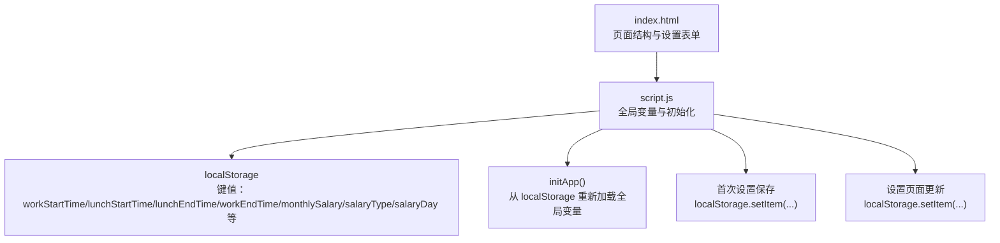
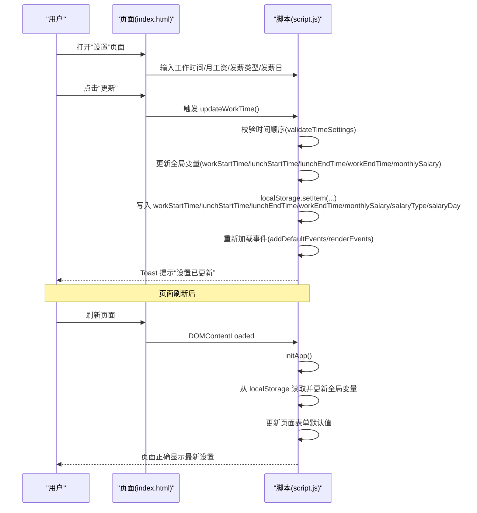
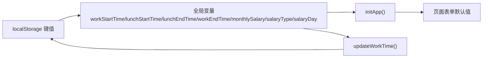

# 设置数据持久化调试

<cite>
**本文引用的文件**
- [script.js](file://script.js)
- [index.html](file://index.html)
- [TEST_CHECKLIST_v1.3.3.md](file://TEST_CHECKLIST_v1.3.3.md)
- [README.md](file://README.md)
</cite>

## 目录
1. [简介](#简介)
2. [项目结构](#项目结构)
3. [核心组件](#核心组件)
4. [架构总览](#架构总览)
5. [详细组件分析](#详细组件分析)
6. [依赖关系分析](#依赖关系分析)
7. [性能考量](#性能考量)
8. [故障排查指南](#故障排查指南)
9. [结论](#结论)
10. [附录](#附录)

## 简介
本指南聚焦于工作计时器应用中“设置数据持久化”的调试方法，围绕用户设置项 workStartTime、lunchStartTime、workEndTime、monthlySalary 等在 localStorage 中的读写行为展开。文档提供基于浏览器开发者工具的应用程序面板监控方法，指导如何验证设置保存后 localStorage 的更新情况，以及如何检查 initApp 函数中从 localStorage 重新加载全局变量的逻辑。同时结合测试清单中的数据持久化测试项，给出可操作的验证步骤。

## 项目结构
该应用采用单页结构，核心逻辑集中在 script.js 中，页面结构由 index.html 提供。设置相关的键值均通过 localStorage 进行持久化，包括首次设置与设置页面更新两处入口。

图表来源
- [index.html](file://index.html#L360-L428)
- [script.js](file://script.js#L1-L20)

章节来源
- [index.html](file://index.html#L360-L428)
- [script.js](file://script.js#L1-L20)

## 核心组件
- 全局变量与初始化
  - 在脚本开头声明并从 localStorage 读取工作时间与薪资相关设置，作为应用启动时的默认值。
  - 页面加载完成后，根据是否首次访问决定显示首次设置弹窗或直接初始化应用。
- 首次设置保存
  - 首次设置弹窗中收集工作时间、月工资、发薪类型与发薪日，并写入 localStorage。
  - 写入后标记初始化状态并触发 initApp 重新加载全局变量。
- 设置页面更新
  - 设置页面提供输入框，修改后调用更新函数，校验时间顺序后写入 localStorage 并重新渲染事件。
- initApp 重新加载
  - initApp 会从 localStorage 重新读取上述键值，更新工作时间配置与页面表单默认值，确保页面刷新后仍能正确加载。

章节来源
- [script.js](file://script.js#L1-L20)
- [script.js](file://script.js#L94-L155)
- [script.js](file://script.js#L163-L223)
- [script.js](file://script.js#L1064-L1117)
- [script.js](file://script.js#L1220-L1269)

## 架构总览
以下序列图展示了“设置保存”到“localStorage 更新”再到“initApp 重新加载”的完整流程。

图表来源
- [index.html](file://index.html#L360-L428)
- [script.js](file://script.js#L1064-L1117)
- [script.js](file://script.js#L1220-L1269)

## 详细组件分析

### 组件A：首次设置保存（localStorage 写入）
- 触发时机：首次进入应用时，填写并保存工作时间与月工资等设置。
- 关键键值：
  - workStartTime、lunchStartTime、lunchEndTime、workEndTime
  - monthlySalary（默认 8000）
  - salaryType、salaryDay
- 行为要点：
  - 写入后标记 hasInitialized 与 hasVisited，避免再次弹窗。
  - 调用 initApp 以确保后续逻辑使用最新值。

章节来源
- [script.js](file://script.js#L163-L223)

### 组件B：设置页面更新（localStorage 写入）
- 触发时机：在“设置”页面点击“更新”。
- 关键键值：
  - workStartTime、lunchStartTime、lunchEndTime、workEndTime
  - monthlySalary（默认 8000）
  - salaryType、salaryDay（当类型为固定日期时写入）
- 行为要点：
  - 先进行时间顺序校验，再写入 localStorage。
  - 重新加载事件并提示“设置已更新”。

章节来源
- [script.js](file://script.js#L1220-L1269)

### 组件C：initApp 重新加载（从 localStorage 读取）
- 触发时机：页面加载完成或首次设置保存后。
- 行为要点：
  - 从 localStorage 读取 workStartTime、lunchStartTime、lunchEndTime、workEndTime。
  - 更新 workTimeConfig（拆分为小时/分钟）。
  - 从 localStorage 加载自定义事件、添加预设事件并渲染。
  - 设置页面表单默认值（salaryType、salaryDay、monthlySalary）。

章节来源
- [script.js](file://script.js#L1064-L1117)

### 组件D：时间校验（validateTimeSettings）
- 行为要点：
  - 将时间字符串转换为分钟数进行比较，确保上班时间 < 午休开始 < 午休结束 < 下班时间。
  - 若顺序不合法，阻止保存并提示错误。

章节来源
- [script.js](file://script.js#L2267-L2297)

### 组件E：页面结构与表单元素
- 首次设置弹窗与设置页面均包含对应输入框，用于收集用户设置。
- 设置页面还包含发薪类型与发薪日选择，以及“清空缓存”按钮。

章节来源
- [index.html](file://index.html#L186-L223)
- [index.html](file://index.html#L360-L428)

## 依赖关系分析
- 全局变量依赖 localStorage 键值：workStartTime、lunchStartTime、lunchEndTime、workEndTime、monthlySalary、salaryType、salaryDay 等。
- 初始化流程依赖：DOMContentLoaded -> checkFirstVisit -> showSetupModal 或 initApp。
- 设置页面更新依赖：updateWorkTime -> localStorage.setItem -> 重新渲染事件。
- initApp 依赖：从 localStorage 读取并更新全局变量 -> 更新页面表单默认值。

图表来源
- [script.js](file://script.js#L1-L20)
- [script.js](file://script.js#L1064-L1117)
- [script.js](file://script.js#L1220-L1269)

章节来源
- [script.js](file://script.js#L1-L20)
- [script.js](file://script.js#L1064-L1117)
- [script.js](file://script.js#L1220-L1269)

## 性能考量
- localStorage 读写为同步操作，频繁写入可能影响主线程。建议：
  - 合理合并写入（如批量更新时减少多次 setItem）。
  - 避免在高频事件中重复读写相同键值。
- 页面渲染与事件加载在 initApp 中进行，注意避免不必要的重复渲染。

[本节为通用建议，无需特定文件引用]

## 故障排查指南

### 如何使用浏览器开发者工具监控 localStorage 的读写
- 打开开发者工具的应用程序面板（Application），在左侧 Storage 中找到 Local Storage。
- 在页面中进行以下操作，观察键值变化：
  - 首次设置：填写工作时间与月工资，点击“保存”。
  - 设置页面更新：修改工作时间与月工资，点击“更新”。
  - 刷新页面：观察键值是否保持不变。
- 关注以下键值是否存在且值正确：
  - workStartTime、lunchStartTime、lunchEndTime、workEndTime
  - monthlySalary、salaryType、salaryDay

章节来源
- [index.html](file://index.html#L186-L223)
- [index.html](file://index.html#L360-L428)
- [script.js](file://script.js#L163-L223)
- [script.js](file://script.js#L1220-L1269)

### 如何验证设置在页面刷新后正确加载
- 在设置页面更新后，刷新页面。
- 在开发者工具的 Application 面板中确认 localStorage 中的键值已更新。
- 观察页面表单默认值是否与 localStorage 中的值一致（salaryType、salaryDay、monthlySalary）。
- 进一步验证 initApp 是否从 localStorage 重新加载了工作时间配置（workStartTime、lunchStartTime、lunchEndTime、workEndTime）。

章节来源
- [script.js](file://script.js#L1064-L1117)
- [script.js](file://script.js#L1220-L1269)

### 如何检查 initApp 中从 localStorage 重新加载全局变量的逻辑
- 在开发者工具中设置断点或在关键位置添加日志，观察 initApp 执行路径。
- 关注以下步骤：
  - 从 localStorage 读取 workStartTime、lunchStartTime、lunchEndTime、workEndTime。
  - 更新 workTimeConfig（拆分小时/分钟）。
  - 从 localStorage 加载自定义事件并添加预设事件，然后渲染。
  - 设置页面表单默认值（salaryType、salaryDay、monthlySalary）。

章节来源
- [script.js](file://script.js#L1064-L1117)

### 结合测试清单验证数据持久化
- 测试清单中明确要求：
  - localStorage 存储 monthlySalary
  - localStorage 按日期存储 moyuFortune_[date]
  - 刷新页面后数据不丢失
  - 新的一天自动清除上一天的运势
- 验证步骤：
  - 在“上班打卡”后，确认 moyuFortune_[date] 已写入 localStorage。
  - 切换到另一个日期（或模拟日期变化），确认旧运势被清除。
  - 刷新页面，确认设置项仍保持最新值。

章节来源
- [TEST_CHECKLIST_v1.3.3.md](file://TEST_CHECKLIST_v1.3.3.md#L81-L118)
- [TEST_CHECKLIST_v1.3.3.md](file://TEST_CHECKLIST_v1.3.3.md#L89-L95)

## 结论
通过对 script.js 中全局变量初始化、首次设置保存、设置页面更新与 initApp 重新加载逻辑的梳理，以及结合浏览器开发者工具的应用程序面板监控，可以有效验证 workStartTime、lunchStartTime、workEndTime、monthlySalary 等用户设置项在 localStorage 中的读写与持久化行为。配合测试清单中的数据持久化测试项，能够系统性地确保设置在页面刷新后正确加载，并在新一天自动清理过期数据。

[本节为总结，无需特定文件引用]

## 附录

### 附录A：关键键值一览
- 工作时间相关
  - workStartTime、lunchStartTime、lunchEndTime、workEndTime
- 薪资相关
  - monthlySalary、salaryType、salaryDay
- 初始化标记
  - hasInitialized、hasVisited
- 其他
  - timeline_日期、moyuFortune_日期、lastClockInType、lastClockInDate、clockInTime_日期、dailyNote_日期、customEvents、officialHolidays、officialWeekendWorkdays、workdaysOff、weekendsWork、developerMode、customTime、deepseekApiKey

章节来源
- [script.js](file://script.js#L1-L20)
- [script.js](file://script.js#L163-L223)
- [script.js](file://script.js#L1220-L1269)
- [script.js](file://script.js#L1324-L1345)
- [script.js](file://script.js#L1118-L1127)

### 附录B：相关文档参考
- 产品说明书（含功能与版本说明）
- 测试清单（含数据持久化测试项）

章节来源
- [README.md](file://README.md#L1-L125)
- [TEST_CHECKLIST_v1.3.3.md](file://TEST_CHECKLIST_v1.3.3.md#L1-L178)