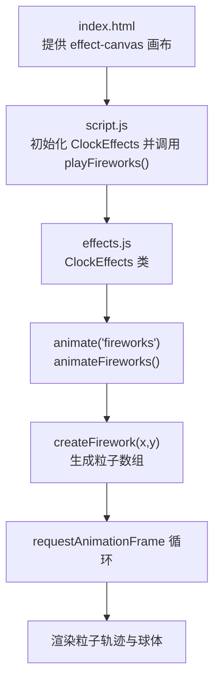
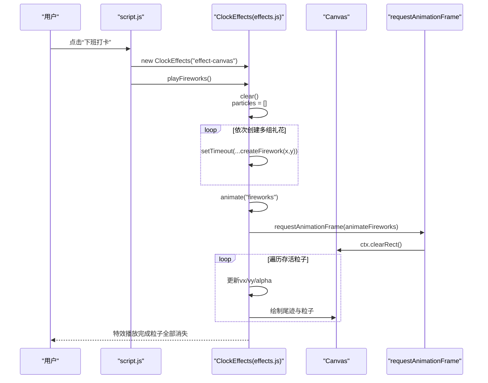
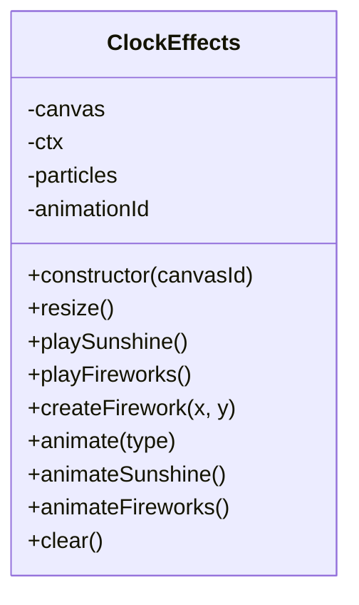
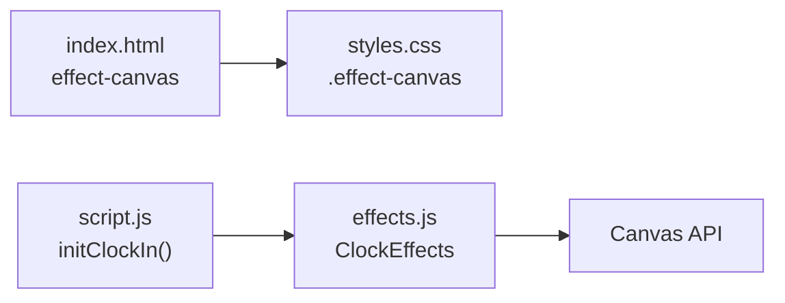

# 礼花特效调试

<cite>
**本文引用的文件**
- [effects.js](file://effects.js)
- [script.js](file://script.js)
- [index.html](file://index.html)
- [styles.css](file://styles.css)
- [TEST_CHECKLIST_v1.3.3.md](file://TEST_CHECKLIST_v1.3.3.md)
- [README.md](file://README.md)
</cite>

## 目录
1. [简介](#简介)
2. [项目结构](#项目结构)
3. [核心组件](#核心组件)
4. [架构总览](#架构总览)
5. [详细组件分析](#详细组件分析)
6. [依赖关系分析](#依赖关系分析)
7. [性能考量](#性能考量)
8. [故障排查指南](#故障排查指南)
9. [结论](#结论)
10. [附录](#附录)

## 简介
本指南聚焦于“下班打卡”时的礼花特效调试，围绕 effects.js 中 playFireworks 方法的调用链路、createFirework 函数的粒子生成与物理渲染逻辑，提供系统化的诊断步骤与可视化流程图，帮助开发者快速定位“特效不触发或播放异常”的问题，并结合测试清单确保多组粒子爆炸、颜色随机性与动画流畅性符合预期。

## 项目结构
- 特效系统位于 effects.js，提供 ClockEffects 类，负责 Canvas 初始化、粒子生命周期管理与动画循环。
- 页面入口 index.html 提供特效画布 effect-canvas，样式 styles.css 控制全屏覆盖与层级。
- 调用入口 script.js 在下班打卡路径中实例化 ClockEffects 并调用 playFireworks。
- README 与 TEST_CHECKLIST_v1.3.3.md 明确了特效行为与验收标准。

图表来源
- [index.html](file://index.html#L120-L140)
- [script.js](file://script.js#L555-L700)
- [effects.js](file://effects.js#L64-L141)

章节来源
- [index.html](file://index.html#L120-L140)
- [script.js](file://script.js#L555-L700)
- [effects.js](file://effects.js#L64-L141)
- [styles.css](file://styles.css#L1984-L1993)

## 核心组件
- ClockEffects 类
  - 负责 Canvas 尺寸适配、粒子数组管理、动画循环调度与清理。
  - 提供 playFireworks、createFirework、animate、animateFireworks、clear 等方法。
- 调用链路
  - script.js 在下班打卡时创建 ClockEffects 实例并调用 playFireworks。
  - playFireworks 清空旧粒子、按批次创建多组礼花、启动 animate('fireworks')。
- 渲染与物理
  - animateFireworks 中对每个粒子施加重力与摩擦，更新位置与透明度，绘制尾迹与粒子本体。

章节来源
- [effects.js](file://effects.js#L5-L279)
- [script.js](file://script.js#L555-L700)

## 架构总览
下图展示了从用户点击“下班打卡”到特效播放的关键交互与数据流。

图表来源
- [script.js](file://script.js#L555-L700)
- [effects.js](file://effects.js#L64-L141)
- [effects.js](file://effects.js#L203-L260)

## 详细组件分析

### ClockEffects 类与方法关系

图表来源
- [effects.js](file://effects.js#L5-L279)

章节来源
- [effects.js](file://effects.js#L5-L279)

### playFireworks 调用流程与日志
- 初始化与清理
  - 调用 clear() 清空旧动画与粒子，重置 particles 数组。
- 批量创建礼花
  - 循环创建多组（按测试清单为3组），每组通过 setTimeout 间隔触发 createFirework(x,y)。
  - createFirework 生成外层粒子与内圈闪光粒子，设置初速度、重力、摩擦力与颜色。
- 启动动画
  - 调用 animate('fireworks')，内部委托 animateFireworks。
- 日志要点
  - 调用开始、Canvas 尺寸、将创建的礼花数量、每组创建位置、当前粒子数量采样输出。

章节来源
- [effects.js](file://effects.js#L64-L141)
- [effects.js](file://effects.js#L203-L260)

### createFirework 粒子生成与属性
- 外层粒子
  - 以均匀角度分布发射，速度随机，赋予重力与摩擦力，颜色基于 hue 与轻微抖动。
- 内圈闪光粒子
  - 数量较少但亮度更高，重力略小、摩擦略大，突出爆炸中心的高光效果。
- 属性要点
  - 位置：x、y
  - 速度：vx、vy
  - 物理：gravity、friction
  - 视觉：size、alpha、color、life
  - 标记：isCore 用于区分内圈闪光。

章节来源
- [effects.js](file://effects.js#L88-L133)

### animateFireworks 渲染与生命周期
- 生命周期
  - 过滤存活粒子：alpha > 0。
- 物理更新
  - 摩擦：vx *= friction；vy *= friction
  - 重力：vy += gravity
  - 位置：x += vx；y += vy
  - 透明度：life -= 0.01；alpha = life
- 渲染
  - 绘制尾迹：从当前位置到前一位置的线段，粗细与 alpha 相关。
  - 绘制粒子：圆形填充，内圈闪光使用径向渐变。
- 动画循环
  - 使用 requestAnimationFrame 递归调度，直至无存活粒子。

章节来源
- [effects.js](file://effects.js#L203-L260)

## 依赖关系分析
- DOM 依赖
  - index.html 提供 id 为 effect-canvas 的 Canvas 元素，styles.css 设置全屏覆盖与层级。
- 调用依赖
  - script.js 在下班打卡路径中创建 ClockEffects 并调用 playFireworks。
- 代码依赖
  - effects.js 内部仅依赖 Canvas API 与浏览器动画帧接口，无第三方依赖。

图表来源
- [index.html](file://index.html#L120-L140)
- [styles.css](file://styles.css#L1984-L1993)
- [script.js](file://script.js#L555-L700)
- [effects.js](file://effects.js#L5-L279)

章节来源
- [index.html](file://index.html#L120-L140)
- [styles.css](file://styles.css#L1984-L1993)
- [script.js](file://script.js#L555-L700)
- [effects.js](file://effects.js#L5-L279)

## 性能考量
- 使用 requestAnimationFrame 替代 setInterval，避免掉帧与资源浪费。
- 过期粒子及时过滤，避免累积导致内存与渲染压力。
- Canvas 清屏与绘制集中在动画循环内，尽量减少不必要的重绘。
- 颜色与透明度计算在循环内进行，注意避免频繁字符串拼接带来的开销。

章节来源
- [effects.js](file://effects.js#L203-L260)

## 故障排查指南

### 1. 症状：特效不触发
- 检查 Canvas 是否存在
  - 在 playFireworks 开始处打印 Canvas 元素与尺寸，确认初始化成功。
  - 若元素不存在，检查 index.html 中 effect-canvas 的 id 与 DOM 结构。
- 检查调用链路
  - 确认 script.js 的下班打卡分支确实创建了 ClockEffects 实例并调用了 playFireworks。
  - 查看控制台是否存在“特效已调用”日志。
- 检查样式与层级
  - 确认 .effect-canvas 的全屏覆盖与 z-index，避免被其他元素遮挡。

章节来源
- [effects.js](file://effects.js#L64-L86)
- [index.html](file://index.html#L120-L140)
- [styles.css](file://styles.css#L1984-L1993)
- [script.js](file://script.js#L555-L700)

### 2. 症状：粒子不生成或数量异常
- 核查 createFirework 调用
  - 确认 playFireworks 中循环创建的组数与 setTimeout 间隔是否符合预期。
  - 查看“创建第 X 个礼花”日志，确认每组位置与 hue 输出。
- 核查粒子数组
  - 在 animate('fireworks') 启动后，观察“当前粒子数量”采样日志，确认每帧存活粒子数量趋势。
  - 若数量骤减或为零，检查 createFirework 是否被调用、粒子属性是否正确初始化。

章节来源
- [effects.js](file://effects.js#L64-L141)
- [effects.js](file://effects.js#L203-L260)

### 3. 症状：动画卡顿或不流畅
- 检查 requestAnimationFrame 使用
  - animate('fireworks') 仅在存在存活粒子时继续调度，避免无效循环。
- 检查物理参数
  - gravity 与 friction 是否过大导致粒子快速衰减或停滞。
  - size 与 alpha 的更新步长是否合理，避免过度闪烁。
- 检查渲染开销
  - 尾迹绘制与径向渐变创建频率较高，避免在低端设备上出现卡顿。

章节来源
- [effects.js](file://effects.js#L203-L260)

### 4. 症状：颜色单一或随机性不足
- 核查 hue 与抖动
  - createFirework 中 hue 为随机值，颜色抖动范围由 hue 与随机幅度共同决定。
  - 若颜色过于接近，检查随机幅度与色调区间设置。

章节来源
- [effects.js](file://effects.js#L88-L133)

### 5. 症状：粒子未消失或残留
- 核查生命周期
  - animateFireworks 中通过 alpha > 0 过滤存活粒子，若 alpha 不下降，检查 life 递减值与 alpha 赋值逻辑。
- 核查清理
  - 关闭弹窗时调用 effects.clear()，确保取消动画帧与清空画布。

章节来源
- [effects.js](file://effects.js#L203-L260)
- [script.js](file://script.js#L555-L700)

### 6. 症状：多组粒子爆炸效果不符合预期
- 根据测试清单，下班打卡应显示 3 组彩色粒子爆炸。
  - 检查 playFireworks 中循环次数与位置分布，确保多组爆炸均匀出现。
  - 检查 createFirework 中内外圈粒子数量与速度差异，确保爆炸中心高光与外围扩散效果明显。

章节来源
- [TEST_CHECKLIST_v1.3.3.md](file://TEST_CHECKLIST_v1.3.3.md#L67-L73)
- [effects.js](file://effects.js#L64-L141)
- [effects.js](file://effects.js#L88-L133)

### 7. 症状：颜色随机性不足
- 根据测试清单，颜色应随机且七彩缤纷。
  - 检查 createFirework 中 hue 的随机范围与颜色抖动幅度。
  - 确认不同组之间 hue 差异足够大，避免视觉上颜色相近。

章节来源
- [TEST_CHECKLIST_v1.3.3.md](file://TEST_CHECKLIST_v1.3.3.md#L67-L73)
- [effects.js](file://effects.js#L88-L133)

### 8. 症状：动画流畅性差
- 根据测试清单，动画应流畅无卡顿。
  - 检查 requestAnimationFrame 使用与帧率稳定性。
  - 检查 Canvas 尺寸变化与 resize 事件处理，避免频繁重排。

章节来源
- [TEST_CHECKLIST_v1.3.3.md](file://TEST_CHECKLIST_v1.3.3.md#L75-L80)
- [effects.js](file://effects.js#L19-L23)
- [effects.js](file://effects.js#L203-L260)

## 结论
通过对照 playFireworks 调用链、createFirework 粒子生成与 animateFireworks 渲染逻辑，结合控制台日志与测试清单的验收项，可以系统性地定位并修复礼花特效不触发或播放异常的问题。建议优先验证 Canvas 初始化、调用链路与粒子生成，再逐步深入物理参数与渲染性能。

## 附录

### 调试清单对照（来自测试清单）
- 礼花特效（下班打卡）
  - 特效在打卡弹窗显示时自动播放
  - 3组彩色粒子爆炸
  - 粒子带有重力效果下落
  - 颜色随机，七彩缤纷
  - 动画流畅，无卡顿
  - 关闭弹窗时特效自动清除

章节来源
- [TEST_CHECKLIST_v1.3.3.md](file://TEST_CHECKLIST_v1.3.3.md#L67-L73)