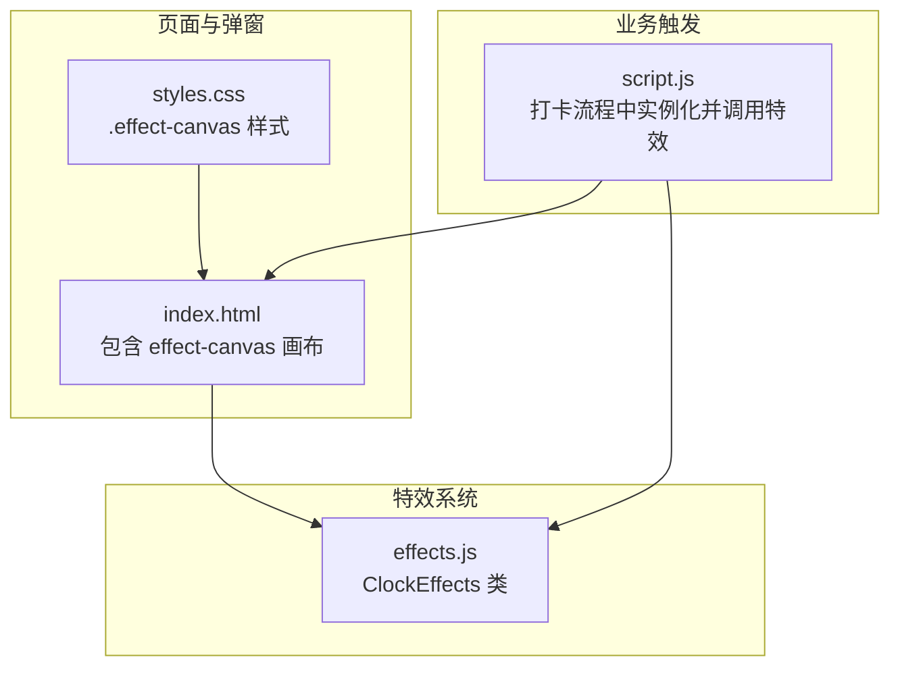
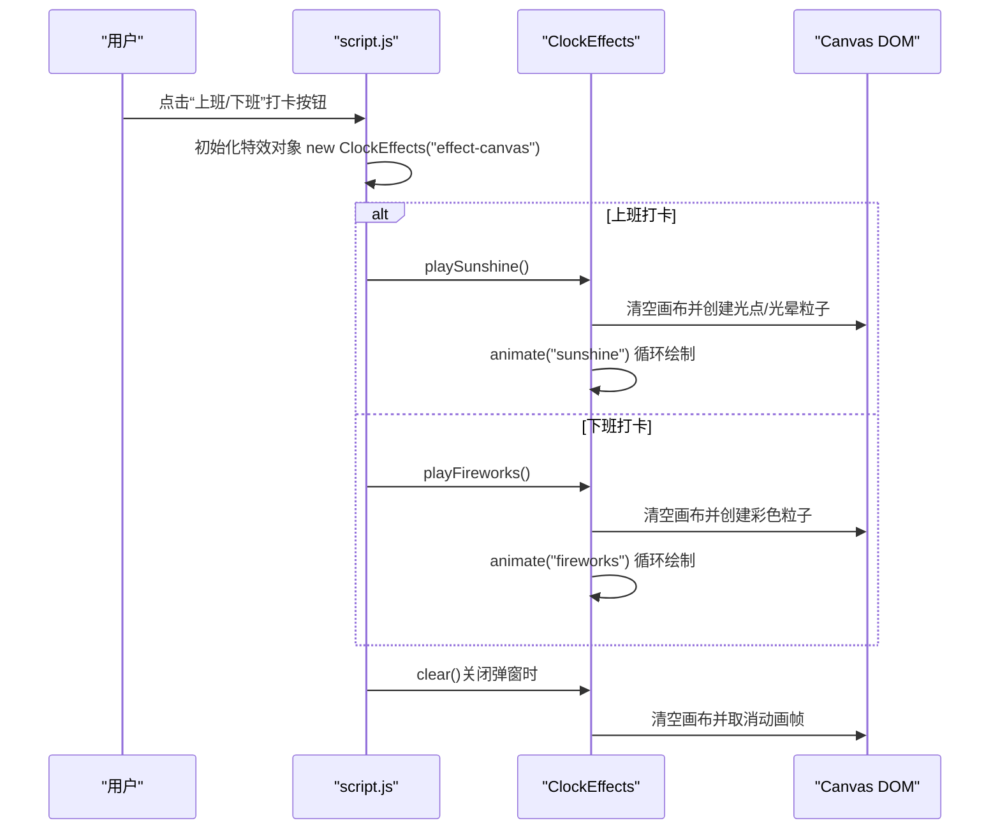
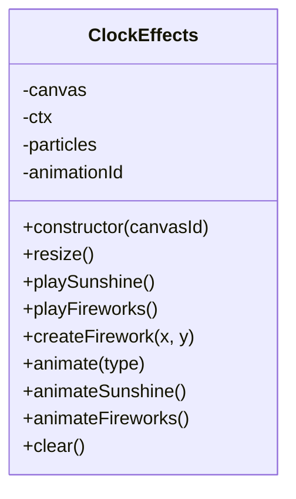
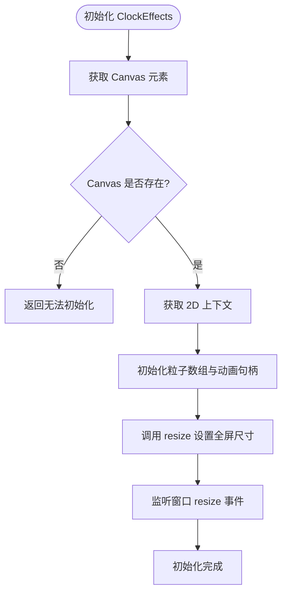
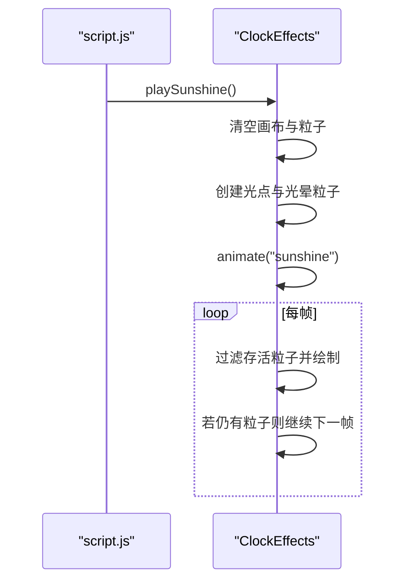
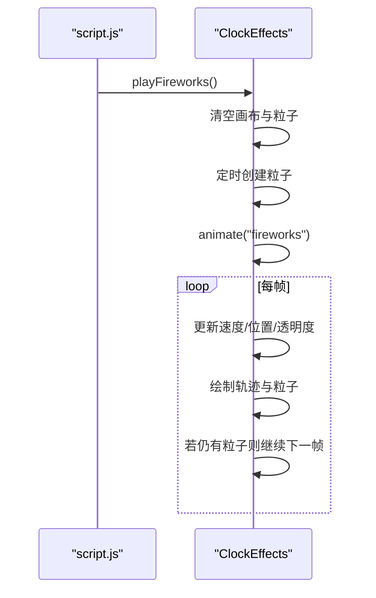
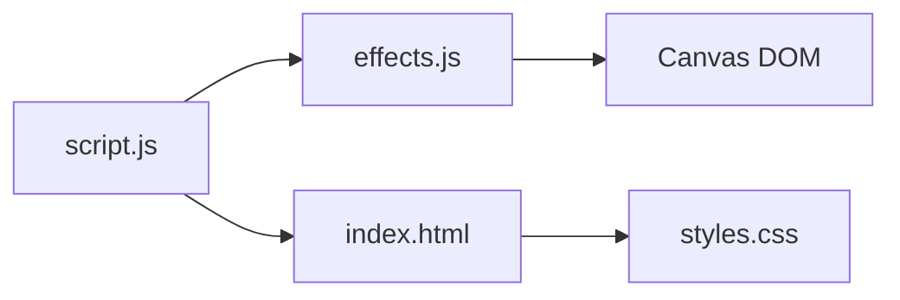

# 视觉特效系统调试

<cite>
**本文引用的文件**
- [effects.js](file://effects.js)
- [script.js](file://script.js)
- [index.html](file://index.html)
- [styles.css](file://styles.css)
- [TEST_CHECKLIST_v1.3.3.md](file://TEST_CHECKLIST_v1.3.3.md)
</cite>

## 目录
1. [简介](#简介)
2. [项目结构](#项目结构)
3. [核心组件](#核心组件)
4. [架构总览](#架构总览)
5. [详细组件分析](#详细组件分析)
6. [依赖关系分析](#依赖关系分析)
7. [性能考量](#性能考量)
8. [故障排查指南](#故障排查指南)
9. [结论](#结论)
10. [附录](#附录)

## 简介
本指南聚焦于视觉特效系统的调试与验证，围绕 effects.js 中 ClockEffects 类的初始化、Canvas 尺寸设置、playSunshine 与 playFireworks 方法的调用时机、粒子系统创建与动画循环启动进行深入说明，并结合 TEST_CHECKLIST_v1.3.3.md 的测试项，提供系统化的排障步骤与调试要点，帮助开发者快速定位“特效不显示或异常”的问题。

## 项目结构
特效系统由以下关键文件组成：
- 效果渲染核心：effects.js（ClockEffects 类）
- 页面与弹窗：index.html（包含特效画布 effect-canvas）
- 样式控制：styles.css（effect-canvas 样式）
- 业务触发：script.js（在打卡流程中实例化 ClockEffects 并调用特效方法）
- 测试清单：TEST_CHECKLIST_v1.3.3.md（特效系统测试项）

图表来源
- [index.html](file://index.html#L120-L135)
- [styles.css](file://styles.css#L1984-L1993)
- [effects.js](file://effects.js#L1-L20)
- [script.js](file://script.js#L555-L560)

章节来源
- [index.html](file://index.html#L120-L135)
- [styles.css](file://styles.css#L1984-L1993)
- [effects.js](file://effects.js#L1-L20)
- [script.js](file://script.js#L555-L560)

## 核心组件
- ClockEffects 类负责：
  - 初始化：获取 Canvas、设置上下文、初始化粒子数组与动画句柄
  - 尺寸管理：resize 将画布设为全屏
  - 阳光特效：playSunshine 创建大量光点与光晕粒子，启动 Sunshine 动画循环
  - 礼花特效：playFireworks 在多个位置定时创建粒子，启动 Fireworks 动画循环
  - 动画循环：animate -> animateSunshine / animateFireworks
  - 清理：clear 取消动画帧并清空画布与粒子

章节来源
- [effects.js](file://effects.js#L1-L20)
- [effects.js](file://effects.js#L25-L62)
- [effects.js](file://effects.js#L64-L133)
- [effects.js](file://effects.js#L135-L273)

## 架构总览
特效系统在打卡流程中的调用链如下：

图表来源
- [script.js](file://script.js#L555-L560)
- [script.js](file://script.js#L640-L642)
- [script.js](file://script.js#L695-L697)
- [effects.js](file://effects.js#L25-L62)
- [effects.js](file://effects.js#L64-L133)
- [effects.js](file://effects.js#L135-L201)
- [effects.js](file://effects.js#L203-L273)

章节来源
- [script.js](file://script.js#L555-L560)
- [script.js](file://script.js#L640-L642)
- [script.js](file://script.js#L695-L697)
- [effects.js](file://effects.js#L25-L62)
- [effects.js](file://effects.js#L64-L133)
- [effects.js](file://effects.js#L135-L201)
- [effects.js](file://effects.js#L203-L273)

## 详细组件分析

### ClockEffects 类结构与职责
- 构造函数：获取 Canvas、获取 2D 上下文、初始化粒子数组与动画句柄；调用 resize 设置全屏；监听窗口 resize 事件
- resize：将 canvas.width/height 设为视口宽高
- playSunshine：清空画布与粒子，创建 100+ 光点与 10 个光晕粒子，随后启动 Sunshine 动画
- playFireworks：清空画布与粒子，定时在多处创建粒子，随后启动 Fireworks 动画
- animate/animateSunshine/animateFireworks：根据类型选择动画分支，逐帧过滤并绘制粒子
- clear：取消 requestAnimationFrame、清空画布、清空粒子

图表来源
- [effects.js](file://effects.js#L1-L20)
- [effects.js](file://effects.js#L25-L62)
- [effects.js](file://effects.js#L64-L133)
- [effects.js](file://effects.js#L135-L273)

章节来源
- [effects.js](file://effects.js#L1-L20)
- [effects.js](file://effects.js#L25-L62)
- [effects.js](file://effects.js#L64-L133)
- [effects.js](file://effects.js#L135-L273)

### Canvas 初始化与全屏尺寸校验
- 初始化：构造函数通过传入的 canvasId 获取 DOM 元素并获取 2D 上下文
- 尺寸设置：resize 将 canvas 宽高设为 window.innerWidth/innerHeight
- 样式：.effect-canvas 使用绝对定位、宽高 100%、z-index 较高且禁用指针事件，确保覆盖弹窗并不影响交互
- 页面挂载：index.html 中的 effect-canvas 在 greeting-modal 弹窗中，作为全屏覆盖层

图表来源
- [effects.js](file://effects.js#L1-L20)
- [effects.js](file://effects.js#L19-L23)
- [styles.css](file://styles.css#L1984-L1993)
- [index.html](file://index.html#L120-L135)

章节来源
- [effects.js](file://effects.js#L1-L20)
- [effects.js](file://effects.js#L19-L23)
- [styles.css](file://styles.css#L1984-L1993)
- [index.html](file://index.html#L120-L135)

### playSunshine 方法调用时机与粒子系统
- 调用时机：上班打卡时，脚本在显示摸鱼吉日签弹窗前创建 ClockEffects 实例并调用 playSunshine
- 粒子创建：生成约 100 个光点与 10 个光晕粒子，包含随机速度、透明度、颜色与闪烁参数
- 动画循环：animate -> animateSunshine，每帧过滤存活粒子并绘制光点与光晕，超出屏幕范围的粒子会被移除；若仍有粒子则继续 requestAnimationFrame

图表来源
- [script.js](file://script.js#L640-L642)
- [effects.js](file://effects.js#L25-L62)
- [effects.js](file://effects.js#L135-L201)

章节来源
- [script.js](file://script.js#L640-L642)
- [effects.js](file://effects.js#L25-L62)
- [effects.js](file://effects.js#L135-L201)

### playFireworks 方法调用时机与粒子系统
- 调用时机：下班打卡时，脚本在显示工作总结弹窗前创建 ClockEffects 实例并调用 playFireworks
- 粒子创建：定时在多个位置创建彩色粒子，包含随机速度、重力、摩擦与生命周期
- 动画循环：animate -> animateFireworks，每帧更新速度与位置，绘制粒子轨迹与尾迹，按生命周期衰减透明度；若仍有粒子则继续 requestAnimationFrame

图表来源
- [script.js](file://script.js#L695-L697)
- [effects.js](file://effects.js#L64-L133)
- [effects.js](file://effects.js#L203-L273)

章节来源
- [script.js](file://script.js#L695-L697)
- [effects.js](file://effects.js#L64-L133)
- [effects.js](file://effects.js#L203-L273)

## 依赖关系分析
- ClockEffects 依赖：
  - Canvas DOM（id 为 effect-canvas）
  - 2D 渲染上下文（CanvasRenderingContext2D）
  - requestAnimationFrame（浏览器动画帧 API）
- 业务触发依赖：
  - script.js 在打卡流程中实例化 ClockEffects 并调用 playSunshine/playFireworks
  - index.html 提供 effect-canvas 画布与 greeting-modal 弹窗容器
  - styles.css 控制 effect-canvas 的覆盖层级与交互行为

图表来源
- [script.js](file://script.js#L555-L560)
- [index.html](file://index.html#L120-L135)
- [styles.css](file://styles.css#L1984-L1993)
- [effects.js](file://effects.js#L1-L20)

章节来源
- [script.js](file://script.js#L555-L560)
- [index.html](file://index.html#L120-L135)
- [styles.css](file://styles.css#L1984-L1993)
- [effects.js](file://effects.js#L1-L20)

## 性能考量
- 使用 requestAnimationFrame 替代 setInterval，避免不必要的重绘与卡顿
- 每帧对过期粒子进行过滤与清理，减少无效绘制
- 光点/光晕与粒子轨迹采用径向渐变与线段绘制，尽量保持绘制开销可控
- 全屏尺寸通过 resize 与窗口事件同步，避免缩放导致的绘制错位

章节来源
- [effects.js](file://effects.js#L135-L201)
- [effects.js](file://effects.js#L203-L273)
- [effects.js](file://effects.js#L19-L23)

## 故障排查指南

### 1. 症状：特效不显示
- 检查 Canvas 初始化
  - 确认构造函数是否成功获取到 id 为 effect-canvas 的 Canvas 元素
  - 确认页面中存在该元素且未被隐藏
  - 参考路径：[effects.js](file://effects.js#L1-L20)、[index.html](file://index.html#L120-L135)
- 检查全屏尺寸设置
  - 确认 resize 是否被调用，且 canvas.width/height 是否等于 innerWidth/innerHeight
  - 确认样式 .effect-canvas 的宽高为 100%，z-index 足够高
  - 参考路径：[effects.js](file://effects.js#L19-L23)、[styles.css](file://styles.css#L1984-L1993)
- 检查弹窗显示顺序
  - 上班打卡：先显示弹窗，再调用 playSunshine
  - 下班打卡：先显示弹窗，再调用 playFireworks
  - 参考路径：[script.js](file://script.js#L640-L642)、[script.js](file://script.js#L695-L697)

### 2. 症状：粒子数量异常或消失过快
- 阳光特效
  - 确认 playSunshine 是否被调用，是否创建了预期数量的光点与光晕粒子
  - 检查 animateSunshine 是否持续过滤存活粒子并继续动画
  - 参考路径：[effects.js](file://effects.js#L25-L62)、[effects.js](file://effects.js#L135-L201)
- 礼花特效
  - 确认 playFireworks 是否被调用，是否定时创建了粒子
  - 检查 animateFireworks 是否按帧更新速度、重力与透明度
  - 参考路径：[effects.js](file://effects.js#L64-L133)、[effects.js](file://effects.js#L203-L273)

### 3. 症状：动画卡顿或抖动
- 确认使用 requestAnimationFrame，而非 setInterval
- 确认每帧仅进行必要的过滤与绘制，避免额外计算
- 参考路径：[effects.js](file://effects.js#L135-L201)、[effects.js](file://effects.js#L203-L273)

### 4. 症状：关闭弹窗后特效未清除
- 确认在关闭弹窗时调用了 clear，取消动画帧并清空画布与粒子
- 参考路径：[script.js](file://script.js#L564-L568)、[effects.js](file://effects.js#L262-L273)

### 5. 使用 console.log 调试信息
- 礼花特效开始与尺寸输出：确认 Canvas 元素与尺寸打印
  - 参考路径：[effects.js](file://effects.js#L64-L70)
- 礼花创建数量与位置：确认每个烟花创建的粒子数量与位置
  - 参考路径：[effects.js](file://effects.js#L73-L85)、[effects.js](file://effects.js#L88-L113)
- 礼花粒子数量监控：确认每帧打印当前粒子数量
  - 参考路径：[effects.js](file://effects.js#L206-L209)

### 6. 结合测试清单逐项验证
- 阳光特效（上班打卡）
  - 特效在弹窗显示时自动播放
  - 50 个黄色光点从顶部飘落（实际实现为约 100 个）
  - 光点带有光晕效果
  - 动画流畅，无卡顿
  - 关闭弹窗时特效自动清除
  - 参考路径：[TEST_CHECKLIST_v1.3.3.md](file://TEST_CHECKLIST_v1.3.3.md#L60-L66)
- 礼花特效（下班打卡）
  - 特效在弹窗显示时自动播放
  - 3 组彩色粒子爆炸（实际实现为定时创建多组）
  - 粒子带有重力效果下落
  - 颜色随机，七彩缤纷
  - 动画流畅，无卡顿
  - 关闭弹窗时特效自动清除
  - 参考路径：[TEST_CHECKLIST_v1.3.3.md](file://TEST_CHECKLIST_v1.3.3.md#L67-L74)
- 性能测试
  - Canvas 正确初始化
  - 使用 requestAnimationFrame，不使用 setInterval
  - 过期粒子自动清理
  - 内存占用正常（开发者工具检查）
  - 参考路径：[TEST_CHECKLIST_v1.3.3.md](file://TEST_CHECKLIST_v1.3.3.md#L75-L80)

## 结论
通过以上调试步骤与测试清单对照，可以系统性地定位特效不显示或异常的问题。重点关注 ClockEffects 的初始化与全屏尺寸设置、playSunshine/playFireworks 的调用时机、粒子系统创建与动画循环的启动与清理，配合 console.log 输出与测试清单逐项验证，能够高效解决问题并保证用户体验。

## 附录

### A. 关键调用路径索引
- ClockEffects 构造与初始化：[effects.js](file://effects.js#L1-L20)
- resize 设置全屏尺寸：[effects.js](file://effects.js#L19-L23)
- playSunshine 创建与动画：[effects.js](file://effects.js#L25-L62)、[effects.js](file://effects.js#L135-L201)
- playFireworks 创建与动画：[effects.js](file://effects.js#L64-L133)、[effects.js](file://effects.js#L203-L273)
- 关闭弹窗清理特效：[script.js](file://script.js#L564-L568)
- 页面弹窗与画布挂载：[index.html](file://index.html#L120-L135)
- 样式覆盖与层级：[styles.css](file://styles.css#L1984-L1993)