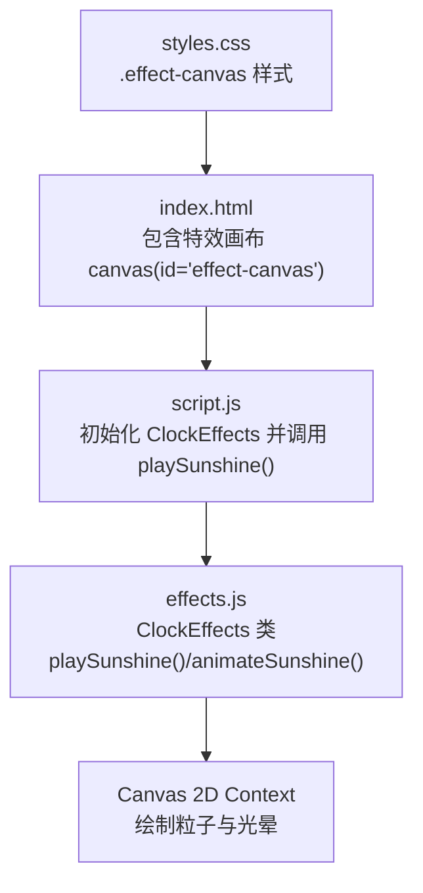
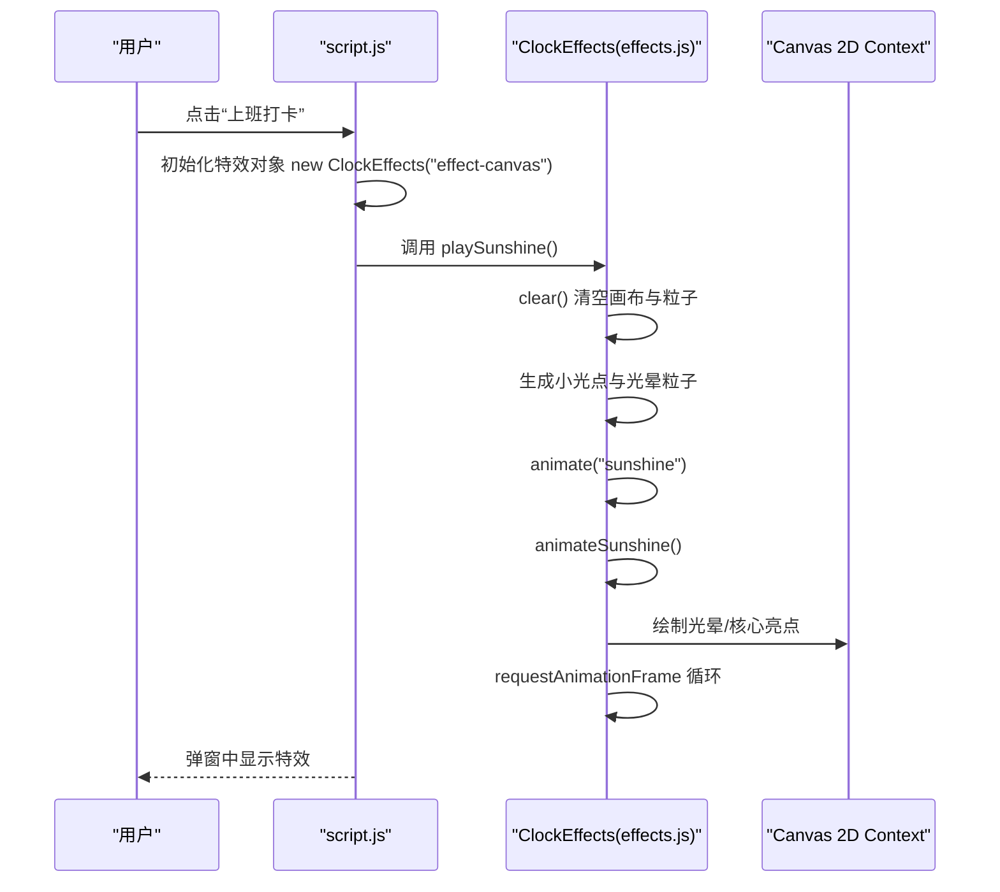
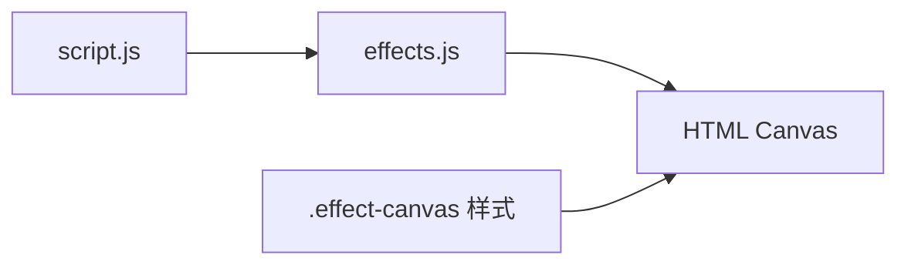
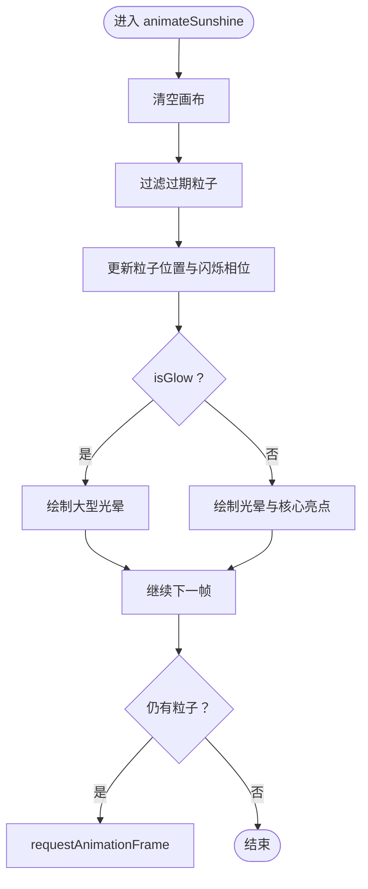

# 阳光特效调试

<cite>
**本文引用的文件**
- [effects.js](file://effects.js)
- [script.js](file://script.js)
- [index.html](file://index.html)
- [styles.css](file://styles.css)
- [TEST_CHECKLIST_v1.3.3.md](file://TEST_CHECKLIST_v1.3.3.md)
</cite>

## 目录
1. [简介](#简介)
2. [项目结构](#项目结构)
3. [核心组件](#核心组件)
4. [架构总览](#架构总览)
5. [详细组件分析](#详细组件分析)
6. [依赖关系分析](#依赖关系分析)
7. [性能考量](#性能考量)
8. [故障排查指南](#故障排查指南)
9. [结论](#结论)
10. [附录](#附录)

## 简介
本指南聚焦“阳光特效”（上班打卡时的黄色光点飘落）的调试与验证，围绕 effects.js 中 ClockEffects 类的 playSunshine 方法展开，帮助开发者确认特效是否正确创建粒子并启动 animateSunshine 动画循环；同时提供粒子初始化参数校验、console.log 调试技巧，以及结合测试清单对视觉效果与性能进行验证。

## 项目结构
- 特效核心：effects.js 提供 ClockEffects 类，负责粒子创建、动画循环与清理。
- 触发入口：script.js 在“上班打卡”流程中实例化 ClockEffects 并调用 playSunshine。
- DOM 结构：index.html 提供特效画布 canvas（id="effect-canvas"），样式由 styles.css 控制。
- 测试依据：TEST_CHECKLIST_v1.3.3.md 定义了阳光特效的预期行为与性能要求。

图表来源
- [index.html](file://index.html#L120-L140)
- [script.js](file://script.js#L546-L728)
- [effects.js](file://effects.js#L1-L279)
- [styles.css](file://styles.css#L1984-L1993)

章节来源
- [index.html](file://index.html#L120-L140)
- [script.js](file://script.js#L546-L728)
- [effects.js](file://effects.js#L1-L279)
- [styles.css](file://styles.css#L1984-L1993)

## 核心组件
- ClockEffects 类
  - 构造函数：获取 canvas、创建 2D 上下文、初始化粒子数组与动画句柄，并监听窗口 resize。
  - playSunshine：清空画布与粒子，批量创建小光点与大型光晕粒子，随后启动 animate('sunshine')。
  - animate('sunshine')：委托 animateSunshine。
  - animateSunshine：逐帧更新粒子位置与透明度，绘制光晕与核心亮点，过滤过期粒子，必要时递归 requestAnimationFrame。
  - clear：取消动画、清空画布、重置粒子数组。

章节来源
- [effects.js](file://effects.js#L1-L279)

## 架构总览
“上班打卡”触发路径与特效渲染流程如下：

图表来源
- [script.js](file://script.js#L546-L728)
- [effects.js](file://effects.js#L1-L279)
- [index.html](file://index.html#L120-L140)

## 详细组件分析

### ClockEffects 类与 playSunshine 方法
- playSunshine 的职责
  - 清理：调用 clear()，确保无残留动画与粒子。
  - 初始化：重置 particles 数组为空。
  - 小光点创建：循环创建 100 个粒子，设置随机位置、速度、尺寸、透明度、颜色与闪烁相位。
  - 大型光晕创建：循环创建 10 个粒子，标记 isGlow=true，设置更大的尺寸与更低的 alpha，营造背景光晕。
  - 启动动画：调用 animate('sunshine')，进入 animateSunshine 循环。

- animateSunshine 的渲染逻辑
  - 清屏：每帧清空画布。
  - 更新：对每个粒子累加 y 方向速度与 x 方向速度，推进闪烁相位 twinkle。
  - 透明度：基于 twinkle 计算闪烁 alpha，叠加粒子原始 alpha。
  - 绘制：
    - isGlow=true：使用径向渐变绘制大光晕矩形。
    - 普通粒子：绘制外层光晕与中心高亮圆点。
  - 过滤：仅保留仍在屏幕范围内的粒子，若仍有粒子则继续 requestAnimationFrame。

- 关键调试点
  - Canvas 初始化：构造函数中 resize() 会将 canvas 宽高设为视口宽高，需确认弹窗显示时 canvas 是否可见且尺寸正确。
  - 粒子数量：playSunshine 中创建 100 个小光点 + 10 个光晕粒子，若视觉稀疏，优先检查 Canvas 尺寸与透明度。
  - 动画循环：animateSunshine 会在每帧过滤并重绘，若动画提前结束，检查 particles 数组是否被意外清空或全部过期。

章节来源
- [effects.js](file://effects.js#L25-L62)
- [effects.js](file://effects.js#L136-L201)

### 触发与集成点（script.js）
- 在“上班打卡”流程中，先创建特效对象，再调用 playSunshine()，随后才显示摸鱼吉日签内容。
- 弹窗关闭时会调用 effects.clear()，确保资源释放。

章节来源
- [script.js](file://script.js#L546-L728)
- [index.html](file://index.html#L120-L140)

### DOM 与样式（index.html、styles.css）
- DOM：弹窗中包含 id="effect-canvas" 的 canvas，作为特效画布。
- 样式：.effect-canvas 设置为绝对定位、全屏覆盖、z-index 较低、禁用指针事件，避免遮挡弹窗交互。

章节来源
- [index.html](file://index.html#L120-L140)
- [styles.css](file://styles.css#L1984-L1993)

## 依赖关系分析
- 低耦合：ClockEffects 仅依赖 DOM canvas 与 Canvas 2D API，不依赖业务逻辑。
- 触发链路：script.js 负责业务流程与特效调用，effects.js 负责渲染细节。
- 样式约束：.effect-canvas 的定位与层级影响特效是否可见。

图表来源
- [script.js](file://script.js#L546-L728)
- [effects.js](file://effects.js#L1-L279)
- [styles.css](file://styles.css#L1984-L1993)

## 性能考量
- 使用 requestAnimationFrame：animateSunshine 与 animateFireworks 均采用 rAF，避免 setInteval 的抖动与卡顿风险。
- 过期粒子清理：animateSunshine 过滤 y 超出可视范围的粒子，减少无效绘制。
- 绘制复杂度：每帧对粒子数组进行 map/filter，建议保持粒子数量稳定，避免频繁创建销毁。
- Canvas 尺寸：resize() 会在窗口变化时同步更新，确保在弹窗全屏场景下尺寸正确。

章节来源
- [effects.js](file://effects.js#L136-L201)
- [effects.js](file://effects.js#L262-L273)

## 故障排查指南

### 1. 现象：特效不显示
- 检查 Canvas 初始化
  - 确认弹窗中存在 id="effect-canvas" 的 canvas。
  - 确认 ClockEffects 构造函数能获取到该元素并创建 2D 上下文。
  - 确认弹窗显示时 canvas 的尺寸为视口大小（构造函数会自动 resize）。
- 检查 playSunshine 调用链
  - 确认 script.js 在“上班打卡”流程中确实调用了 effects.playSunshine()。
  - 确认弹窗关闭时调用了 effects.clear()，避免残留动画。
- 检查样式
  - 确认 .effect-canvas 的定位与层级不会被其他元素遮挡。
  - 确认 pointer-events: none 未导致交互问题。

章节来源
- [index.html](file://index.html#L120-L140)
- [effects.js](file://effects.js#L1-L23)
- [script.js](file://script.js#L546-L728)
- [styles.css](file://styles.css#L1984-L1993)

### 2. 现象：粒子数量过少或过于稀疏
- 检查粒子创建
  - playSunshine 中创建了 100 个小光点与 10 个光晕粒子，若视觉稀疏，优先检查 Canvas 尺寸与透明度。
  - 确认粒子的 alpha 与 size 参数是否合理（过大或过小都会影响感知密度）。
- 检查 animateSunshine
  - 确认每帧都对粒子进行更新与绘制。
  - 确认过滤条件（y 超出可视范围）是否过严，导致粒子提前消失。

章节来源
- [effects.js](file://effects.js#L25-L62)
- [effects.js](file://effects.js#L144-L199)

### 3. 现象：动画提前结束或闪烁异常
- 检查动画循环
  - animateSunshine 在每帧结束后判断 particles.length > 0，若为真则继续 requestAnimationFrame。
  - 若动画提前结束，检查是否有外部逻辑清空了 particles 或取消了动画。
- 检查粒子生命周期
  - animateSunshine 不像 animateFireworks 一样对 alpha 进行衰减，因此不会因 alpha 归零而消失。
  - 若出现“消失”，检查是否被外部 clear() 或弹窗关闭逻辑中断。

章节来源
- [effects.js](file://effects.js#L144-L201)
- [effects.js](file://effects.js#L262-L273)

### 4. 现象：视觉效果异常（颜色/亮度/光晕）
- 检查颜色与透明度
  - 小光点与光晕使用 hsla 颜色，alpha 会叠加闪烁 alpha，注意颜色饱和度与亮度设置。
- 检查径向渐变
  - isGlow=true 时使用较大半径的径向渐变，普通粒子使用较小半径的光晕与核心点。
  - 若光晕不明显，检查 size 与 alpha 的组合。

章节来源
- [effects.js](file://effects.js#L144-L199)

### 5. 现象：性能抖动或卡顿
- 确认使用 requestAnimationFrame 而非 setInterval。
- 确认每帧仅进行必要的更新与绘制。
- 确认过期粒子被及时过滤，避免数组过大。

章节来源
- [effects.js](file://effects.js#L136-L201)
- [effects.js](file://effects.js#L262-L273)

### 6. 使用 console.log 输出调试信息
- 在 playSunshine 中打印粒子数量与参数范围，便于核对初始化是否成功。
- 在 animateSunshine 中打印关键状态（如每帧粒子数量、alpha 变化），辅助定位闪烁与消失问题。
- 在 script.js 的“上班打卡”流程中，确认 effects.playSunshine() 被调用，以及弹窗关闭时 effects.clear() 被调用。

章节来源
- [effects.js](file://effects.js#L25-L62)
- [effects.js](file://effects.js#L144-L199)
- [script.js](file://script.js#L546-L728)

### 7. 结合测试清单验证
- 阳光特效测试项（来自 TEST_CHECKLIST_v1.3.3.md）
  - 特效在打卡弹窗显示时自动播放。
  - 50 个黄色光点从顶部飘落（实际实现为 100 个，但视觉上应呈现密集飘落感）。
  - 光点带有光晕效果。
  - 动画流畅，无卡顿。
  - 关闭弹窗时特效自动清除。
- 验证步骤
  - 打开应用，点击“上班打卡”，观察弹窗中是否出现密集的黄色光点从顶部飘落。
  - 检查是否存在大型光晕背景。
  - 使用开发者工具的性能面板观察 rAF 帧率与内存占用。
  - 关闭弹窗，确认特效停止且无残留。

章节来源
- [TEST_CHECKLIST_v1.3.3.md](file://TEST_CHECKLIST_v1.3.3.md#L60-L66)
- [script.js](file://script.js#L546-L728)
- [effects.js](file://effects.js#L136-L201)

## 结论
- 阳光特效的核心在于 playSunshine 的粒子初始化与 animateSunshine 的 rAF 循环。
- 调试重点包括：Canvas 初始化与尺寸、粒子数量与参数、动画循环与过期粒子过滤、样式遮挡与层级。
- 结合测试清单可系统验证视觉效果与性能表现。

## 附录

### A. playSunshine 粒子参数要点（调试对照）
- 位置：x 随机分布于画布宽度；y 在画布上方随机偏移。
- 速度：y 方向速度与 x 方向速度分别随机，形成自然飘落轨迹。
- 尺寸：小光点 size 较小，光晕粒子 size 较大。
- 透明度：基础 alpha 随机，叠加闪烁 alpha，产生脉动效果。
- 颜色：hsla 色彩空间，偏向黄色与明亮色调。
- 闪烁：twinkle 逐帧推进，产生脉动透明度。

章节来源
- [effects.js](file://effects.js#L25-L62)

### B. animateSunshine 渲染流程图

图表来源
- [effects.js](file://effects.js#L144-L199)