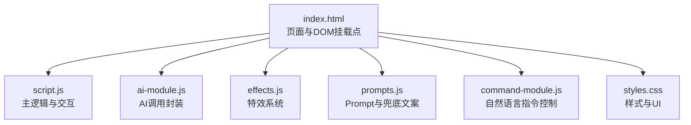
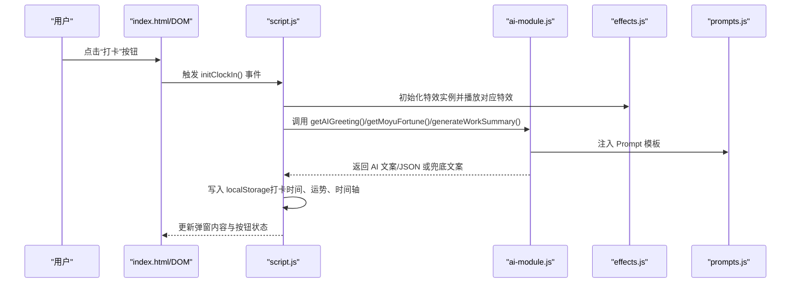
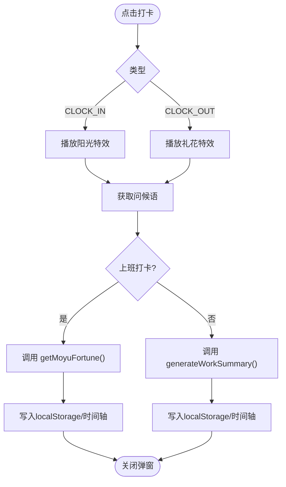
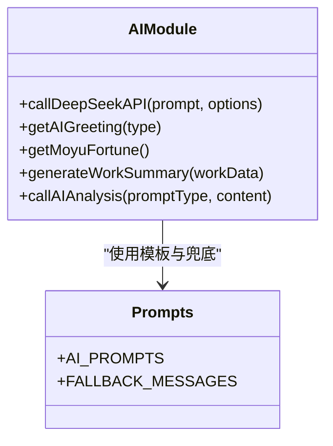
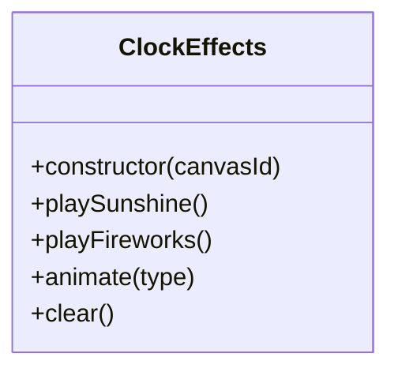
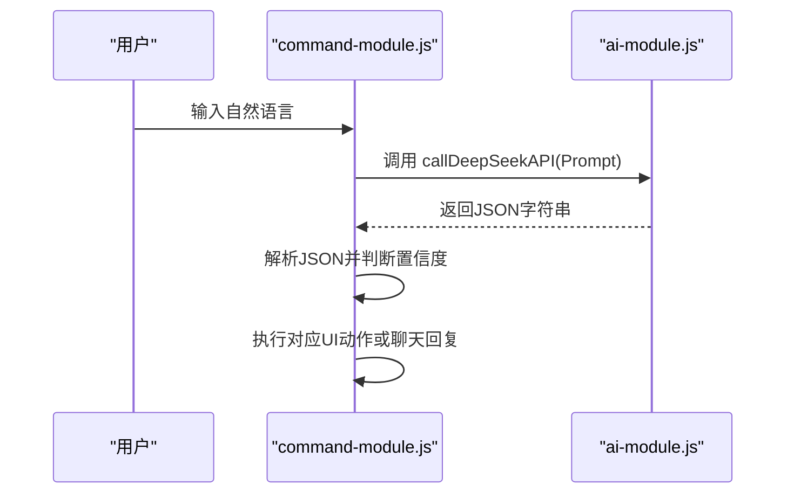
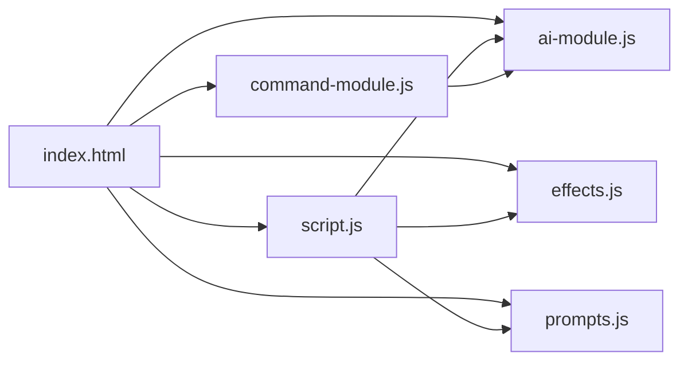

# 调试策略与技巧

<cite>
**本文引用的文件**
- [README.md](file://README.md)
- [TEST_CHECKLIST_v1.3.3.md](file://TEST_CHECKLIST_v1.3.3.md)
- [index.html](file://index.html)
- [script.js](file://script.js)
- [ai-module.js](file://ai-module.js)
- [effects.js](file://effects.js)
- [prompts.js](file://prompts.js)
- [command-module.js](file://command-module.js)
- [styles.css](file://styles.css)
</cite>

## 目录
1. [引言](#引言)
2. [项目结构](#项目结构)
3. [核心组件](#核心组件)
4. [架构总览](#架构总览)
5. [详细组件分析](#详细组件分析)
6. [依赖关系分析](#依赖关系分析)
7. [性能考量](#性能考量)
8. [故障排查指南](#故障排查指南)
9. [结论](#结论)
10. [附录](#附录)

## 引言
本调试指南面向开发者，帮助快速定位与解决 Work Timer v1.3.3 中的问题。内容涵盖：
- 使用浏览器开发者工具监控 localStorage 数据变化
- 在关键流程设置断点（如打卡流程、AI 调用返回）
- 结合测试清单逐项验证功能正确性
- 常见问题排查（AI 调用失败、特效不显示、打卡状态异常等）
- 使用 console.log 进行有效日志输出与性能分析

## 项目结构
Work Timer 采用前端单页应用结构，核心脚本与模块如下：
- 入口页面与挂载点：index.html
- 主逻辑与交互：script.js
- AI 能力封装：ai-module.js
- 打卡特效系统：effects.js
- Prompt 与兜底文案：prompts.js
- 自然语言指令控制：command-module.js
- 样式与 UI：styles.css

图表来源
- [index.html](file://index.html#L1-L200)
- [script.js](file://script.js#L1-L120)
- [ai-module.js](file://ai-module.js#L1-L60)
- [effects.js](file://effects.js#L1-L40)
- [prompts.js](file://prompts.js#L1-L40)
- [command-module.js](file://command-module.js#L1-L40)
- [styles.css](file://styles.css#L1054-L1120)

章节来源
- [index.html](file://index.html#L1-L200)
- [README.md](file://README.md#L1-L125)

## 核心组件
- 打卡流程与弹窗：负责生成问候语、触发特效、显示摸鱼吉日签或工作总结，并写入 localStorage
- AI 模块：封装 DeepSeek API 调用、兜底策略、Prompt 注入与 JSON 解析
- 特效系统：基于 Canvas 的阳光特效与礼花特效，使用 requestAnimationFrame
- 自然语言指令：将用户语音/文本转为结构化命令，执行对应 UI 操作
- 设置与持久化：首次设置、开发者模式、自定义时间、月工资等

章节来源
- [script.js](file://script.js#L493-L732)
- [ai-module.js](file://ai-module.js#L1-L120)
- [effects.js](file://effects.js#L1-L120)
- [command-module.js](file://command-module.js#L1-L120)
- [prompts.js](file://prompts.js#L1-L80)

## 架构总览
打卡与 AI 流程的关键交互如下：

图表来源
- [index.html](file://index.html#L120-L170)
- [script.js](file://script.js#L493-L732)
- [ai-module.js](file://ai-module.js#L61-L168)
- [effects.js](file://effects.js#L1-L120)
- [prompts.js](file://prompts.js#L1-L80)

## 详细组件分析

### 打卡流程与弹窗（initClockIn）
- 按钮状态与日期判定：根据 lastClockInType/lastClockInDate 切换“上班/下班/已下班”
- 弹窗与加载：显示问候语、加载动画、特效画布
- 上班打卡：播放阳光特效，生成摸鱼吉日签，支持“再求一签”
- 下班打卡：播放礼花特效，生成工作总结
- 事件记录：写入时间轴与 localStorage

图表来源
- [script.js](file://script.js#L493-L732)
- [effects.js](file://effects.js#L1-L120)
- [ai-module.js](file://ai-module.js#L95-L168)

章节来源
- [script.js](file://script.js#L493-L732)

### AI 模块（AIModule）
- DeepSeek API 调用：鉴权、参数、错误处理
- 摸鱼吉日签：解析 JSON，兜底策略
- 工作总结：注入占位符，兜底策略
- 指令理解：自然语言转结构化命令

图表来源
- [ai-module.js](file://ai-module.js#L1-L216)
- [prompts.js](file://prompts.js#L1-L159)

章节来源
- [ai-module.js](file://ai-module.js#L1-L216)
- [prompts.js](file://prompts.js#L1-L159)

### 特效系统（ClockEffects）
- 阳光特效：大量光点+光晕，requestAnimationFrame 循环
- 礼花特效：多组粒子爆炸+重力，requestAnimationFrame 循环
- 生命周期：clear/cancel 清理动画与画布

图表来源
- [effects.js](file://effects.js#L1-L279)

章节来源
- [effects.js](file://effects.js#L1-L279)

### 自然语言指令（CommandModule）
- 意图识别：低温度 Prompt 判定是否执行
- 执行动作：映射到 UI 操作（打卡、番茄钟、切换标签、摸鱼等）
- 聊天模式：低置信度时仅聊天

图表来源
- [command-module.js](file://command-module.js#L182-L259)
- [ai-module.js](file://ai-module.js#L1-L60)

章节来源
- [command-module.js](file://command-module.js#L1-L313)

## 依赖关系分析
- script.js 依赖：
  - ai-module.js（AI 能力）
  - effects.js（特效）
  - prompts.js（Prompt 与兜底）
  - localStorage（持久化）
- command-module.js 依赖：
  - ai-module.js（调用大模型）
  - script.js（UI 操作）
- index.html 作为入口，挂载 DOM 并引入各模块脚本

图表来源
- [index.html](file://index.html#L1-L20)
- [script.js](file://script.js#L1-L120)
- [ai-module.js](file://ai-module.js#L1-L60)
- [effects.js](file://effects.js#L1-L40)
- [prompts.js](file://prompts.js#L1-L40)
- [command-module.js](file://command-module.js#L1-L40)

章节来源
- [index.html](file://index.html#L1-L20)
- [script.js](file://script.js#L1-L120)

## 性能考量
- Canvas 动画：使用 requestAnimationFrame，避免 setInteval
- 粒子生命周期：过期粒子自动清理，降低内存占用
- 错误兜底：AI 失败时使用兜底文案，避免阻塞 UI
- 开发者模式：可设置自定义时间，便于快速验证

章节来源
- [effects.js](file://effects.js#L120-L279)
- [TEST_CHECKLIST_v1.3.3.md](file://TEST_CHECKLIST_v1.3.3.md#L75-L80)

## 故障排查指南

### 一、使用浏览器开发者工具监控 localStorage
- 打开“应用/存储”面板，查看 LocalStorage
- 关注关键键名：
  - 工作时间与节假日：workStartTime、lunchStartTime、lunchEndTime、workEndTime、holidays、workdaysOff、weekendsWork
  - 打卡状态：lastClockInType、lastClockInDate、clockInTime_YYYY-MM-DD
  - 摸鱼运势：moyuFortune_YYYY-MM-DD
  - 月工资：monthlySalary、salaryType、salaryDay
  - 首次设置标记：hasVisited、hasInitialized
  - 开发者模式：developerMode、customTime
- 建议：在关键步骤前后截图对比，确认数据写入与更新

章节来源
- [script.js](file://script.js#L1-L40)
- [script.js](file://script.js#L1324-L1345)

### 二、在关键流程设置断点
- 打卡流程断点
  - script.js 中 initClockIn() 的按钮点击事件与状态更新处
  - 上班打卡：effects.playSunshine() 调用前后
  - 下班打卡：effects.playFireworks() 调用前后
  - AI 调用：getMoyuFortune()/generateWorkSummary() 调用前后
- AI 调用断点
  - ai-module.js 中 callDeepSeekAPI() 的请求与响应解析处
  - getMoyuFortune()/generateWorkSummary() 的兜底分支
- 特效断点
  - effects.js 中 ClockEffects.animateSunshine/animateFireworks 的粒子过滤与绘制处
- 自然语言指令断点
  - command-module.js 中 processCommand() 的解析与执行处

章节来源
- [script.js](file://script.js#L493-L732)
- [ai-module.js](file://ai-module.js#L1-L120)
- [effects.js](file://effects.js#L120-L279)
- [command-module.js](file://command-module.js#L182-L259)

### 三、结合测试清单逐项验证
- 首次设置
  - 设置工作时间、月工资并保存，确认 localStorage 写入
  - 参考路径：script.js 中保存设置与初始化逻辑
- 摸鱼吉日签
  - 上班打卡：显示“正在生成摸鱼吉日签...”、卡片字段齐全、再求一签、Header 展示
  - AI 调用失败：兜底内容完整
  - 参考路径：script.js 中 getMoyuFortune() 调用与兜底
- 工资计算与工作总结
  - 下班打卡：显示“正在生成工作总结...”、字段齐全、收入高亮
  - 日薪计算：按月天数计算
  - 参考路径：script.js 中 generateDailySummary() 与 displayWorkSummary()
- 特效系统
  - 阳光/礼花特效：粒子数量、光晕、重力、流畅度、关闭时清理
  - 参考路径：effects.js 中 animateSunshine/animateFireworks
- 设置页面
  - 月工资输入框显示当前值、保存后更新 localStorage
  - 参考路径：script.js 中开发者模式与自定义时间
- 数据持久化
  - localStorage 存储 monthlySalary、moyuFortune_YYYY-MM-DD、刷新不丢失、跨日自动清理
  - 参考路径：script.js 中 loadTodayTimeline()/saveTodayTimeline()

章节来源
- [TEST_CHECKLIST_v1.3.3.md](file://TEST_CHECKLIST_v1.3.3.md#L1-L178)
- [script.js](file://script.js#L1-L120)
- [script.js](file://script.js#L1324-L1345)

### 四、常见问题与排查方法
- AI 调用失败
  - 现象：弹窗显示错误文案或兜底内容
  - 排查：检查 deepseekApiKey 是否保存；网络请求是否成功；返回 JSON 是否可解析
  - 参考路径：ai-module.js 中 callDeepSeekAPI()/getMoyuFortune()/generateWorkSummary()
- 特效不显示
  - 现象：打卡弹窗无特效或卡顿
  - 排查：Canvas 是否初始化；requestAnimationFrame 是否循环；粒子是否过期清理
  - 参考路径：effects.js 中 ClockEffects.animateSunshine/animateFireworks
- 打卡状态异常
  - 现象：按钮状态不正确、重复打卡
  - 排查：lastClockInType/lastClockInDate 是否按日重置；按钮更新逻辑是否每分钟执行
  - 参考路径：script.js 中 updateClockInButton()/initClockIn()
- 自然语言指令无效
  - 现象：低置信度仅聊天、无法执行操作
  - 排查：Prompt 是否正确；解析 JSON 是否成功；置信度阈值
  - 参考路径：command-module.js 中 processCommand()/parseCommandResponse()

章节来源
- [ai-module.js](file://ai-module.js#L1-L216)
- [effects.js](file://effects.js#L120-L279)
- [script.js](file://script.js#L493-L732)
- [command-module.js](file://command-module.js#L182-L259)

### 五、使用 console.log 进行有效日志输出与性能分析
- 日志输出
  - 打卡流程：开始/结束标记、AI 返回结果、localStorage 写入
  - 特效系统：特效开始、粒子数量、Canvas 尺寸
  - 指令处理：解析结果、执行动作、错误信息
- 性能分析
  - 使用 Performance 面板录制打卡与特效播放过程
  - 关注 requestAnimationFrame 帧耗时与粒子数量
  - 检查内存占用与垃圾回收频率

章节来源
- [script.js](file://script.js#L588-L724)
- [effects.js](file://effects.js#L60-L120)
- [command-module.js](file://command-module.js#L182-L259)

## 结论
通过结合浏览器开发者工具、关键断点与测试清单，开发者可以高效定位 Work Timer v1.3.3 的问题。AI 调用、特效渲染与打卡状态是调试的重点环节。遵循本文提供的策略与流程，可显著提升问题诊断与修复效率。

## 附录
- 快速定位参考路径
  - 打卡流程：[script.js](file://script.js#L493-L732)
  - AI 调用：[ai-module.js](file://ai-module.js#L1-L216)
  - 特效系统：[effects.js](file://effects.js#L1-L279)
  - 自然语言指令：[command-module.js](file://command-module.js#L182-L259)
  - Prompt 与兜底：[prompts.js](file://prompts.js#L1-L159)
  - 页面结构与弹窗：[index.html](file://index.html#L120-L170)
  - 样式与 Toast：[styles.css](file://styles.css#L1054-L1120)