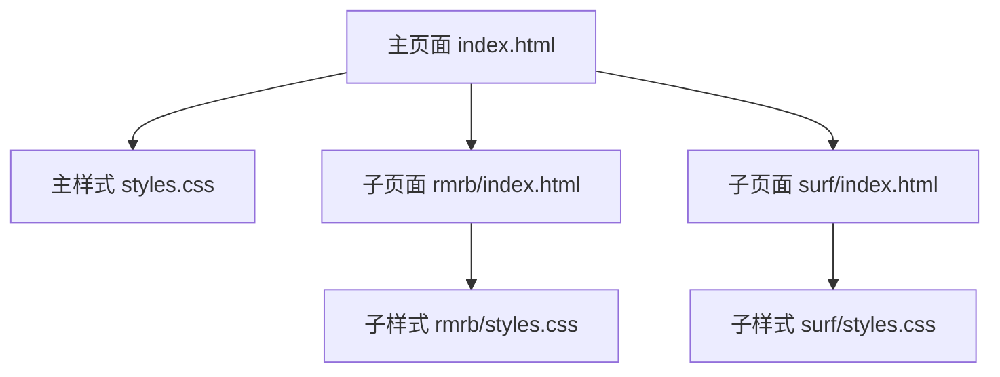
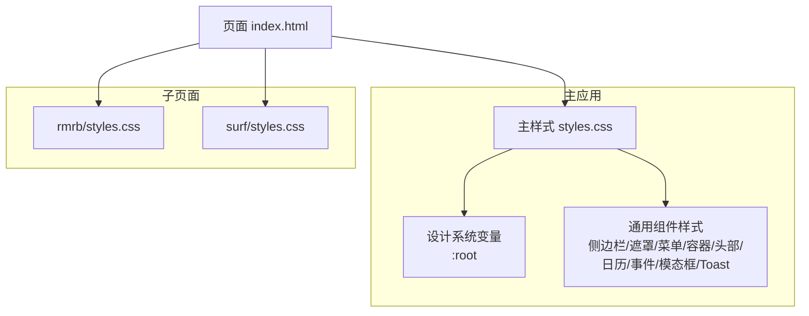
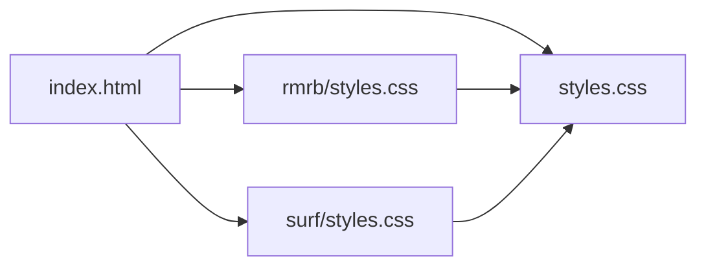

# CSS命名与样式规范

<cite>
**本文引用的文件**
- [styles.css](file://styles.css)
- [rmrb/styles.css](file://rmrb/styles.css)
- [surf/styles.css](file://surf/styles.css)
- [index.html](file://index.html)
- [rmrb/index.html](file://rmrb/index.html)
- [surf/index.html](file://surf/index.html)
</cite>

## 目录
1. [引言](#引言)
2. [项目结构](#项目结构)
3. [核心组件](#核心组件)
4. [架构总览](#架构总览)
5. [详细组件分析](#详细组件分析)
6. [依赖关系分析](#依赖关系分析)
7. [性能考量](#性能考量)
8. [故障排查指南](#故障排查指南)
9. [结论](#结论)
10. [附录](#附录)

## 引言
本规范旨在统一项目中CSS的命名与样式风格，采用BEM（Block Element Modifier）命名法，并以CSS自定义属性（变量）为核心设计系统，确保主题一致性与可维护性。同时，明确主应用样式与子页面（rmrb、surf）之间的继承与扩展关系，规范动画与过渡的实现方式，帮助开发者在新增组件时遵循一致的命名与样式策略，避免样式冲突。

## 项目结构
- 主样式位于根目录的样式文件中，负责全局设计系统变量、基础布局与通用组件样式。
- 子页面rmrb与surf各自拥有独立的样式文件，用于承载特定业务的UI样式。
- 页面通过HTML引入主样式与子页面样式，形成“主样式+子样式”的组合。

图表来源
- [index.html](file://index.html#L1-L12)
- [rmrb/index.html](file://rmrb/index.html#L1-L12)
- [surf/index.html](file://surf/index.html#L1-L10)
- [styles.css](file://styles.css#L1-L31)
- [rmrb/styles.css](file://rmrb/styles.css#L1-L10)
- [surf/styles.css](file://surf/styles.css#L1-L12)

章节来源
- [index.html](file://index.html#L1-L12)
- [rmrb/index.html](file://rmrb/index.html#L1-L12)
- [surf/index.html](file://surf/index.html#L1-L10)

## 核心组件
- 设计系统变量（CSS自定义属性）
  - 主样式文件在根作用域定义了主题变量，包括主色、次色、强调色、背景、文本、卡片背景、圆角、阴影、过渡等，供全站组件统一引用。
  - 示例路径：
    - [设计系统变量定义](file://styles.css#L1-L16)

- 通用组件与布局
  - 侧边栏、遮罩层、菜单按钮、容器、头部、标签页、日历、事件卡片、模态框、Toast提示等通用组件均在主样式中定义，体现统一的设计语言。
  - 示例路径：
    - [侧边栏样式](file://styles.css#L33-L51)
    - [遮罩层样式](file://styles.css#L321-L338)
    - [菜单按钮样式](file://styles.css#L340-L361)
    - [容器样式](file://styles.css#L368-L376)
    - [头部样式](file://styles.css#L379-L386)
    - [标签页样式](file://styles.css#L493-L507)
    - [日历页面布局](file://styles.css#L529-L564)
    - [事件卡片样式](file://styles.css#L824-L899)
    - [模态框样式](file://styles.css#L1277-L1303)
    - [Toast提示样式](file://styles.css#L1062-L1085)

- 子页面样式
  - rmrb子页面样式包含容器、头部、控制区、加载、文章列表、模态框、AI分析等样式。
    - 示例路径：
      - [rmrb容器样式](file://rmrb/styles.css#L1-L10)
      - [rmrb头部样式](file://rmrb/styles.css#L11-L20)
      - [rmrb控制区样式](file://rmrb/styles.css#L28-L41)
      - [加载容器与动画](file://rmrb/styles.css#L82-L114)
      - [文章列表与项](file://rmrb/styles.css#L116-L174)
      - [文章阅读模态框](file://rmrb/styles.css#L175-L207)
      - [AI分析模态框](file://rmrb/styles.css#L247-L299)
  - surf子页面样式包含容器、头部、主内容网格、热搜榜单、刷新按钮、加载、滚动条、热搜项等样式。
    - 示例路径：
      - [surf容器样式](file://surf/styles.css#L6-L12)
      - [surf头部样式](file://surf/styles.css#L14-L31)
      - [主内容网格](file://surf/styles.css#L33-L41)
      - [热搜榜单区域](file://surf/styles.css#L42-L61)
      - [刷新按钮样式](file://surf/styles.css#L68-L89)
      - [加载容器与动画](file://surf/styles.css#L90-L119)
      - [热搜列表与滚动条](file://surf/styles.css#L120-L145)
      - [热搜项样式](file://surf/styles.css#L146-L204)

章节来源
- [styles.css](file://styles.css#L1-L16)
- [styles.css](file://styles.css#L33-L51)
- [styles.css](file://styles.css#L321-L338)
- [styles.css](file://styles.css#L340-L361)
- [styles.css](file://styles.css#L368-L376)
- [styles.css](file://styles.css#L379-L386)
- [styles.css](file://styles.css#L493-L507)
- [styles.css](file://styles.css#L529-L564)
- [styles.css](file://styles.css#L824-L899)
- [styles.css](file://styles.css#L1277-L1303)
- [styles.css](file://styles.css#L1062-L1085)
- [rmrb/styles.css](file://rmrb/styles.css#L1-L10)
- [rmrb/styles.css](file://rmrb/styles.css#L11-L20)
- [rmrb/styles.css](file://rmrb/styles.css#L28-L41)
- [rmrb/styles.css](file://rmrb/styles.css#L82-L114)
- [rmrb/styles.css](file://rmrb/styles.css#L116-L174)
- [rmrb/styles.css](file://rmrb/styles.css#L175-L207)
- [rmrb/styles.css](file://rmrb/styles.css#L247-L299)
- [surf/styles.css](file://surf/styles.css#L6-L12)
- [surf/styles.css](file://surf/styles.css#L14-L31)
- [surf/styles.css](file://surf/styles.css#L33-L41)
- [surf/styles.css](file://surf/styles.css#L42-L61)
- [surf/styles.css](file://surf/styles.css#L68-L89)
- [surf/styles.css](file://surf/styles.css#L90-L119)
- [surf/styles.css](file://surf/styles.css#L120-L145)
- [surf/styles.css](file://surf/styles.css#L146-L204)

## 架构总览
- 主样式作为设计系统中心，集中管理主题变量与通用组件样式；子页面样式仅承担业务特有样式，通过引入主样式实现主题一致性。
- 页面通过HTML链接主样式与子样式，形成“主样式优先、子样式覆盖”的层叠关系。

图表来源
- [styles.css](file://styles.css#L1-L16)
- [styles.css](file://styles.css#L33-L51)
- [styles.css](file://styles.css#L321-L338)
- [styles.css](file://styles.css#L340-L361)
- [styles.css](file://styles.css#L368-L376)
- [styles.css](file://styles.css#L379-L386)
- [styles.css](file://styles.css#L529-L564)
- [styles.css](file://styles.css#L824-L899)
- [styles.css](file://styles.css#L1277-L1303)
- [styles.css](file://styles.css#L1062-L1085)
- [rmrb/styles.css](file://rmrb/styles.css#L1-L10)
- [surf/styles.css](file://surf/styles.css#L1-L12)
- [index.html](file://index.html#L1-L12)

## 详细组件分析

### 设计系统变量与使用规则
- 变量定义位置与命名
  - 在根作用域集中定义主题变量，包括主色、次色、强调色、背景、文本、卡片背景、圆角、阴影、过渡等。
  - 示例路径：
    - [设计系统变量定义](file://styles.css#L1-L16)
- 使用原则
  - 所有组件颜色、圆角、阴影、过渡等应优先引用变量，避免硬编码颜色值。
  - 示例路径：
    - [容器背景与圆角引用变量](file://styles.css#L368-L376)
    - [头部背景与圆角引用变量](file://styles.css#L379-L386)
    - [日历容器背景与圆角引用变量](file://styles.css#L557-L564)
    - [事件卡片背景与圆角引用变量](file://styles.css#L772-L780)
    - [模态框背景与圆角引用变量](file://styles.css#L1295-L1303)
    - [Toast背景与圆角引用变量](file://styles.css#L1062-L1085)

- 动画与过渡
  - 统一使用CSS变量定义过渡曲线与持续时间，保证动画性能与一致性。
  - 示例路径：
    - [过渡变量定义](file://styles.css#L15-L16)
    - [过渡变量在多个组件中的使用](file://styles.css#L138-L141)
    - [过渡变量在按钮与输入框中的使用](file://styles.css#L292-L297)
    - [过渡变量在卡片与按钮中的使用](file://styles.css#L992-L997)
    - [过渡变量在模态框与Toast中的使用](file://styles.css#L1291-L1303)
    - [过渡变量在Toast中的使用](file://styles.css#L1074-L1085)

章节来源
- [styles.css](file://styles.css#L1-L16)
- [styles.css](file://styles.css#L368-L376)
- [styles.css](file://styles.css#L379-L386)
- [styles.css](file://styles.css#L557-L564)
- [styles.css](file://styles.css#L772-L780)
- [styles.css](file://styles.css#L1295-L1303)
- [styles.css](file://styles.css#L1062-L1085)
- [styles.css](file://styles.css#L138-L141)
- [styles.css](file://styles.css#L292-L297)
- [styles.css](file://styles.css#L992-L997)
- [styles.css](file://styles.css#L1291-L1303)
- [styles.css](file://styles.css#L1074-L1085)

### BEM命名规范与实践
- Block（块）
  - 表示独立的功能单元，如容器、卡片、列表、模态框等。
  - 示例路径：
    - [rmrb容器块](file://rmrb/styles.css#L1-L10)
    - [surf容器块](file://surf/styles.css#L6-L12)
    - [日历容器块](file://styles.css#L557-L564)
    - [事件卡片块](file://styles.css#L772-L780)
    - [模态框块](file://styles.css#L1277-L1303)
- Element（元素）
  - 表示块内的子元素，使用“块__元素”命名，如“header__content”、“event-item__title”、“modal__header”等。
  - 示例路径：
    - [日历头部元素](file://styles.css#L566-L571)
    - [事件项标题元素](file://styles.css#L853-L857)
    - [模态框头部元素](file://styles.css#L1396-L1403)
    - [rmrb头部内容元素](file://rmrb/styles.css#L11-L20)
    - [rmrb文章列表元素](file://rmrb/styles.css#L123-L129)
- Modifier（修饰符）
  - 表示状态或变体，使用“块--修饰符”或“块__元素--修饰符”命名，如“sidebar--open”、“event-item--type-work”、“quick-btn--active”等。
  - 示例路径：
    - [侧边栏打开状态](file://styles.css#L48-L51)
    - [事件类型修饰符](file://styles.css#L839-L845)
    - [底部导航激活状态](file://styles.css#L1336-L1340)
    - [Toast显示状态](file://styles.css#L1081-L1085)
    - [rmrb文章项悬停状态](file://rmrb/styles.css#L140-L145)
    - [surf热搜项悬停状态](file://surf/styles.css#L156-L161)

- 新增组件命名建议
  - 块：使用语义化英文单词，如“.feature-card”、“.search-form”。
  - 元素：使用“块__元素”，如“.feature-card__header”、“.search-form__input”。
  - 修饰符：使用“块--状态”或“块__元素--状态”，如“.feature-card--highlight”、“.search-form__input--error”。

章节来源
- [rmrb/styles.css](file://rmrb/styles.css#L1-L10)
- [surf/styles.css](file://surf/styles.css#L6-L12)
- [styles.css](file://styles.css#L557-L564)
- [styles.css](file://styles.css#L772-L780)
- [styles.css](file://styles.css#L1277-L1303)
- [styles.css](file://styles.css#L48-L51)
- [styles.css](file://styles.css#L839-L845)
- [styles.css](file://styles.css#L1336-L1340)
- [styles.css](file://styles.css#L1081-L1085)
- [rmrb/styles.css](file://rmrb/styles.css#L140-L145)
- [surf/styles.css](file://surf/styles.css#L156-L161)

### 子页面样式继承与扩展
- 继承关系
  - 子页面HTML通过<link>引入主样式与子样式，子样式在主样式之后加载，从而实现“主样式优先、子样式覆盖”的层叠。
  - 示例路径：
    - [主页面引入主样式与子样式](file://index.html#L1-L12)
    - [rmrb页面引入主样式与子样式](file://rmrb/index.html#L1-L12)
    - [surf页面引入主样式与子样式](file://surf/index.html#L1-L10)
- 扩展策略
  - 子样式仅定义业务特有组件与局部覆盖，避免重复定义全局变量与通用组件样式，保持主题一致性。
  - 示例路径：
    - [rmrb容器与头部样式](file://rmrb/styles.css#L1-L20)
    - [rmrb文章列表与模态框样式](file://rmrb/styles.css#L116-L207)
    - [surf主内容网格与热搜列表样式](file://surf/styles.css#L33-L61)
    - [surf热搜项与滚动条样式](file://surf/styles.css#L146-L204)

章节来源
- [index.html](file://index.html#L1-L12)
- [rmrb/index.html](file://rmrb/index.html#L1-L12)
- [surf/index.html](file://surf/index.html#L1-L10)
- [rmrb/styles.css](file://rmrb/styles.css#L1-L20)
- [rmrb/styles.css](file://rmrb/styles.css#L116-L207)
- [surf/styles.css](file://surf/styles.css#L33-L61)
- [surf/styles.css](file://surf/styles.css#L146-L204)

### 动画与过渡实现
- 过渡统一使用CSS变量，保证动画性能与一致性。
  - 示例路径：
    - [过渡变量定义](file://styles.css#L15-L16)
    - [过渡变量在按钮与输入框中的使用](file://styles.css#L292-L297)
    - [过渡变量在卡片与按钮中的使用](file://styles.css#L992-L997)
    - [过渡变量在模态框与Toast中的使用](file://styles.css#L1291-L1303)
    - [过渡变量在Toast中的使用](file://styles.css#L1074-L1085)
- 关键帧动画
  - 使用关键帧实现浮动、旋转等动画，配合变量控制动画时长与缓动。
  - 示例路径：
    - [AI浮动动画](file://styles.css#L148-L152)
    - [spin旋转动画（rmrb）](file://rmrb/styles.css#L104-L107)
    - [spin旋转动画（surf）](file://surf/styles.css#L109-L113)
    - [slideInDown进入动画](file://styles.css#L1973-L1982)

章节来源
- [styles.css](file://styles.css#L15-L16)
- [styles.css](file://styles.css#L292-L297)
- [styles.css](file://styles.css#L992-L997)
- [styles.css](file://styles.css#L1291-L1303)
- [styles.css](file://styles.css#L1074-L1085)
- [styles.css](file://styles.css#L148-L152)
- [rmrb/styles.css](file://rmrb/styles.css#L104-L107)
- [surf/styles.css](file://surf/styles.css#L109-L113)
- [styles.css](file://styles.css#L1973-L1982)

## 依赖关系分析
- 文件间依赖
  - 主页面依赖主样式与子页面样式，子页面样式依赖主样式以获得主题变量与通用组件样式。
- 层叠顺序
  - HTML中<link>的顺序决定CSS层叠顺序，先引入主样式，再引入子样式，确保子样式能覆盖主样式中的同名规则。

图表来源
- [index.html](file://index.html#L1-L12)
- [styles.css](file://styles.css#L1-L16)
- [rmrb/styles.css](file://rmrb/styles.css#L1-L10)
- [surf/styles.css](file://surf/styles.css#L1-L12)

章节来源
- [index.html](file://index.html#L1-L12)
- [styles.css](file://styles.css#L1-L16)
- [rmrb/styles.css](file://rmrb/styles.css#L1-L10)
- [surf/styles.css](file://surf/styles.css#L1-L12)

## 性能考量
- 使用CSS变量统一管理颜色、圆角、阴影与过渡，减少重复计算与内存占用。
- 尽量使用transform与opacity进行动画，避免频繁触发重排与重绘。
- 合理使用box-shadow与渐变，避免过度阴影导致渲染压力。
- 在移动端通过媒体查询优化布局与交互，减少不必要的动画。

## 故障排查指南
- 样式未生效
  - 检查HTML中<link>顺序是否正确，确保主样式在子样式之前加载。
  - 示例路径：
    - [主页面样式引入顺序](file://index.html#L1-L12)
- 主题色不一致
  - 确认组件是否使用CSS变量而非硬编码颜色。
  - 示例路径：
    - [变量使用示例（容器背景）](file://styles.css#L368-L376)
    - [变量使用示例（头部背景）](file://styles.css#L379-L386)
- 动画卡顿
  - 检查是否使用transform与opacity，避免频繁触发布局与绘制。
  - 示例路径：
    - [过渡变量与动画使用](file://styles.css#L15-L16)
    - [关键帧动画定义](file://styles.css#L148-L152)
- 子页面样式覆盖异常
  - 确保子样式仅定义业务特有组件，避免重复定义全局变量与通用组件样式。
  - 示例路径：
    - [rmrb样式覆盖范围](file://rmrb/styles.css#L1-L20)
    - [surf样式覆盖范围](file://surf/styles.css#L33-L61)

章节来源
- [index.html](file://index.html#L1-L12)
- [styles.css](file://styles.css#L368-L376)
- [styles.css](file://styles.css#L379-L386)
- [styles.css](file://styles.css#L15-L16)
- [styles.css](file://styles.css#L148-L152)
- [rmrb/styles.css](file://rmrb/styles.css#L1-L20)
- [surf/styles.css](file://surf/styles.css#L33-L61)

## 结论
通过采用BEM命名法与CSS自定义属性，项目实现了统一的主题系统与清晰的样式组织。主样式集中管理设计变量与通用组件，子页面样式专注于业务特有UI，既保证了主题一致性，又便于扩展与维护。建议在新增组件时严格遵循本规范，优先使用变量与BEM命名，确保动画性能与可维护性。

## 附录
- 新组件命名与样式落地流程
  - 定义块（Block），如“.feature-card”
  - 定义元素（Element），如“.feature-card__header”、“.feature-card__content”
  - 定义修饰符（Modifier），如“.feature-card--highlight”、“.feature-card__header--collapsed”
  - 使用CSS变量统一颜色、圆角、阴影与过渡
  - 使用transform与opacity实现动画，避免重排重绘
  - 在子页面中仅定义业务特有组件，避免重复定义全局变量与通用组件样式