# CSS命名规范

<cite>
**本文引用的文件**
- [styles.css](file://styles.css)
- [index.html](file://index.html)
- [rmrb/styles.css](file://rmrb/styles.css)
- [rmrb/index.html](file://rmrb/index.html)
- [surf/styles.css](file://surf/styles.css)
- [surf/index.html](file://surf/index.html)
</cite>

## 目录
1. [简介](#简介)
2. [项目结构](#项目结构)
3. [核心组件](#核心组件)
4. [架构总览](#架构总览)
5. [详细组件分析](#详细组件分析)
6. [依赖关系分析](#依赖关系分析)
7. [性能考量](#性能考量)
8. [故障排查指南](#故障排查指南)
9. [结论](#结论)
10. [附录](#附录)

## 简介
本文件系统性梳理项目中采用的CSS命名方法论，聚焦BEM（Block Element Modifier）思想在主应用与子页面中的落地实践。通过对全局样式、侧边栏、AI浮动面板、日历与事件、设置页、模态框、移动端底部导航等组件的命名与结构分析，阐明.block、__element、--modifier的命名规则与使用边界，并给出新组件开发的命名指导原则，帮助团队统一风格、降低样式冲突、提升可维护性与可复用性。

## 项目结构
项目采用“主应用 + 子页面”结构：
- 主应用：index.html + styles.css
- 子页面：rmrb/index.html + rmrb/styles.css；surf/index.html + surf/styles.css
- 各页面通过各自样式文件与主样式共同构建UI

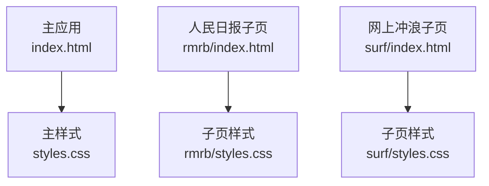

图表来源
- [index.html](file://index.html#L1-L120)
- [styles.css](file://styles.css#L1-L120)
- [rmrb/index.html](file://rmrb/index.html#L1-L60)
- [rmrb/styles.css](file://rmrb/styles.css#L1-L120)
- [surf/index.html](file://surf/index.html#L1-L54)
- [surf/styles.css](file://surf/styles.css#L1-L120)

章节来源
- [index.html](file://index.html#L1-L120)
- [styles.css](file://styles.css#L1-L120)
- [rmrb/index.html](file://rmrb/index.html#L1-L60)
- [rmrb/styles.css](file://rmrb/styles.css#L1-L120)
- [surf/index.html](file://surf/index.html#L1-L54)
- [surf/styles.css](file://surf/styles.css#L1-L120)

## 核心组件
本节从BEM视角解析主应用与子页面的关键组件，展示block、element、modifier的典型用法与组合方式。

- 侧边栏与遮罩
  - Block: .sidebar
  - Element: .sidebar-header、.sidebar-nav、.nav-item、.nav-icon、.nav-text
  - Modifier: .sidebar.open（状态类）
  - 遮罩: .sidebar-overlay、.sidebar-overlay.show
  - 示例路径: [styles.css](file://styles.css#L32-L120)

- AI浮动面板
  - Block: .ai-assistant-float、.ai-float-panel
  - Element: .ai-float-header、.ai-float-messages、.ai-float-input、.ai-float-close、.ai-float-status
  - Modifier: .ai-float-panel.show（状态类）
  - 示例路径: [styles.css](file://styles.css#L118-L200)

- 头部与快捷功能
  - Block: .container、header、.header-content、.header-left、.header-right
  - Element: .daily-note-banner-header、.note-banner-content、.quick-actions、.quick-action-btn、.quick-icon
  - 示例路径: [styles.css](file://styles.css#L368-L470)

- 标签页与内容区
  - Block: .tabs、.tab-content
  - Modifier: .tab-content.active（状态类）
  - 示例路径: [styles.css](file://styles.css#L493-L510)

- 日历页面布局
  - Block: .calendar-page-layout、.calendar-container、.calendar-left、.calendar-right
  - Element: .calendar-header、.weekdays、.calendar-days、.calendar-day、.legend-color、.calendar-legend
  - Modifier: .calendar-day.today、.calendar-day.workday、.calendar-day.weekend、.calendar-day.workday-off、.calendar-day.weekend-work
  - 示例路径: [styles.css](file://styles.css#L529-L700)

- 事件卡片与表单
  - Block: .event-add-card、.today-events-card、.events-list
  - Element: .event-form、.form-row、.event-input、.event-select、.event-textarea、.event-add-btn、.event-item、.event-header、.event-title、.event-time、.event-type、.event-note、.event-actions、.event-delete-btn
  - Modifier: .event-item.type-work、.event-item.type-personal、.event-item.type-meeting、.event-item.type-birthday、.event-item.type-holiday、.event-item.type-other
  - 示例路径: [styles.css](file://styles.css#L707-L900)

- 设置页与表单
  - Block: .settings-section、.form-group
  - Element: .form-group label、.form-group input、.form-group select、button
  - Modifier: .tab-btn.active（状态类）
  - 示例路径: [styles.css](file://styles.css#L904-L960)

- 模态框与时间轴
  - Block: .modal、.modal-content、.timeline-modal-content、.timeline-list、.timeline-item、.timeline-event
  - Element: .modal-header、.close-modal、.timeline-date、.timeline-dot、.timeline-time、.timeline-event-type、.timeline-event-content
  - Modifier: .modal.show（状态类）、.timeline-event.event-type-clock-in、.timeline-event.event-type-clock-out、.timeline-event.event-type-relax、.timeline-event.event-type-pomodoro
  - 示例路径: [styles.css](file://styles.css#L1277-L1420)

- 人民日报子页
  - Block: .rmrb-container、.rmrb-header、.rmrb-main
  - Element: .rmrb-controls、.date-picker、.refresh-btn、.ai-analysis-btn、.loading-container、.loading-spinner、.loading-message、.article-list、.article-item、.article-number、.article-title、.no-articles、.article-modal、.article-modal-content、.article-modal-header、.close-modal-btn、.ai-modal-content、.ai-analysis-body
  - 示例路径: [rmrb/styles.css](file://rmrb/styles.css#L1-L200)

- 网上冲浪子页
  - Block: .surf-container、.surf-header、.surf-main、.hot-list-section
  - Element: .section-header、.refresh-btn、.loading-container、.loading-spinner、.loading-message、.hot-list、.hot-item、.hot-rank、.hot-rank-top、.hot-content、.hot-title、.hot-label、.error-message
  - 示例路径: [surf/styles.css](file://surf/styles.css#L1-L200)

章节来源
- [styles.css](file://styles.css#L32-L200)
- [styles.css](file://styles.css#L368-L510)
- [styles.css](file://styles.css#L529-L900)
- [styles.css](file://styles.css#L904-L1420)
- [rmrb/styles.css](file://rmrb/styles.css#L1-L200)
- [surf/styles.css](file://surf/styles.css#L1-L200)

## 架构总览
下图展示主应用与子页面的样式组织与命名关系，体现BEM在跨页面的一致性与可扩展性。

```mermaid
graph TB
subgraph "主应用"
S1["Block: .sidebar"]
S2["Block: .ai-assistant-float"]
S3["Block: .container / header"]
S4["Block: .tabs / .tab-content"]
S5["Block: .calendar-page-layout"]
S6["Block: .event-add-card / .today-events-card"]
S7["Block: .settings-section"]
S8["Block: .modal / .timeline-*"]
end
subgraph "子页面"
R1["Block: .rmrb-container / .rmrb-header"]
R2["Block: .rmrb-main / .article-list"]
U1["Block: .surf-container / .surf-header"]
U2["Block: .surf-main / .hot-list-section"]
end
S1 --> S1E["Element: .sidebar-header / .sidebar-nav / .nav-item"]
S2 --> S2E["Element: .ai-float-panel / .ai-float-header / .ai-float-input"]
S4 --> S4E["Modifier: .tab-content.active"]
S5 --> S5E["Modifier: .calendar-day.today / .workday / .weekend / .workday-off / .weekend-work"]
S6 --> S6E["Modifier: .event-item.type-*"]
S8 --> S8E["Modifier: .modal.show"]
R1 --> R1E["Element: .rmrb-controls / .date-picker / .refresh-btn"]
R2 --> R2E["Element: .article-item / .article-modal"]
U1 --> U1E["Element: .section-header / .refresh-btn"]
U2 --> U2E["Element: .hot-item / .hot-rank"]
```

图表来源
- [styles.css](file://styles.css#L32-L200)
- [styles.css](file://styles.css#L529-L900)
- [styles.css](file://styles.css#L904-L1420)
- [rmrb/styles.css](file://rmrb/styles.css#L1-L200)
- [surf/styles.css](file://surf/styles.css#L1-L200)

## 详细组件分析

### 侧边栏与遮罩（BEM实战）
- Block: .sidebar
- Elements: .sidebar-header、.sidebar-nav、.nav-item、.nav-icon、.nav-text、.close-sidebar
- Modifier: .sidebar.open（用于控制展开/收起）
- Overlay: .sidebar-overlay、.sidebar-overlay.show（用于点击遮罩关闭）

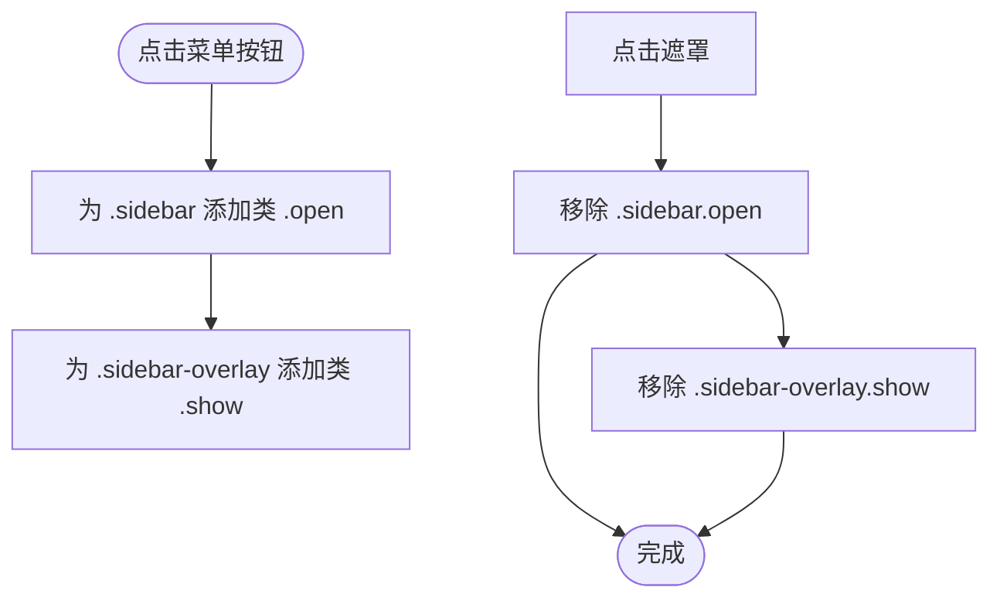

图表来源
- [styles.css](file://styles.css#L32-L120)
- [index.html](file://index.html#L1-L80)

章节来源
- [styles.css](file://styles.css#L32-L120)
- [index.html](file://index.html#L1-L80)

### AI浮动面板（BEM实战）
- Block: .ai-assistant-float、.ai-float-panel
- Elements: .ai-float-header、.ai-float-messages、.ai-float-input、.ai-float-close、.ai-float-status
- Modifier: .ai-float-panel.show（控制面板显隐）

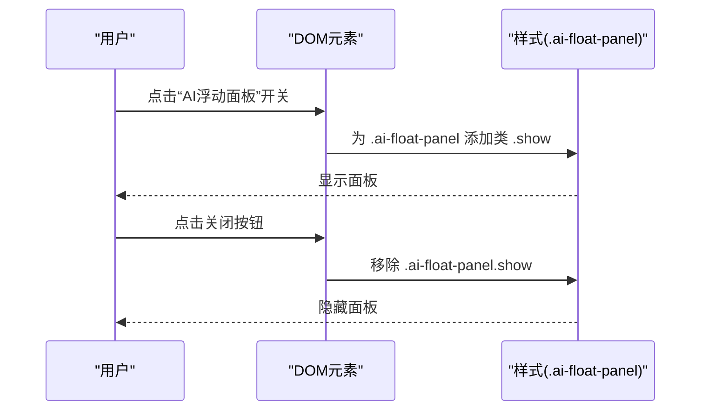

图表来源
- [styles.css](file://styles.css#L118-L200)
- [index.html](file://index.html#L40-L70)

章节来源
- [styles.css](file://styles.css#L118-L200)
- [index.html](file://index.html#L40-L70)

### 日历页面（BEM实战）
- Block: .calendar-page-layout、.calendar-container、.calendar-left、.calendar-right
- Elements: .calendar-header、.weekdays、.calendar-days、.calendar-day、.legend-color、.calendar-legend
- Modifiers: .calendar-day.today、.calendar-day.workday、.calendar-day.weekend、.calendar-day.workday-off、.calendar-day.weekend-work

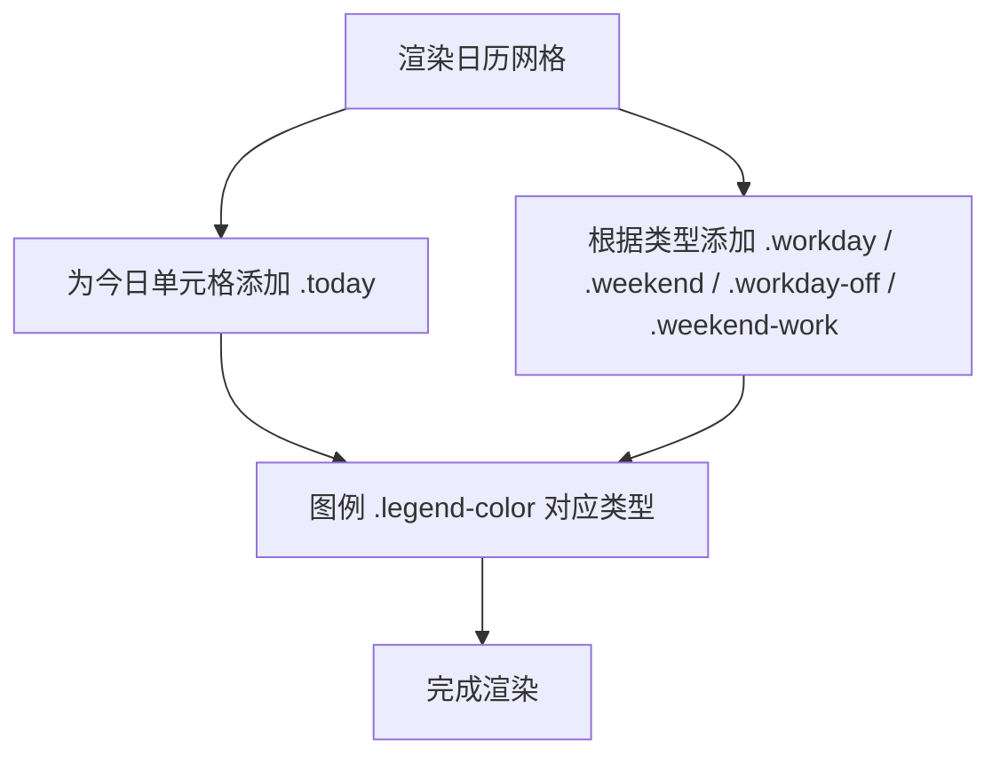

图表来源
- [styles.css](file://styles.css#L529-L700)
- [index.html](file://index.html#L280-L360)

章节来源
- [styles.css](file://styles.css#L529-L700)
- [index.html](file://index.html#L280-L360)

### 事件卡片与表单（BEM实战）
- Block: .event-add-card、.today-events-card、.events-list
- Elements: .event-form、.form-row、.event-input、.event-select、.event-textarea、.event-add-btn、.event-item、.event-header、.event-title、.event-time、.event-type、.event-note、.event-actions、.event-delete-btn
- Modifiers: .event-item.type-work、.event-item.type-personal、.event-item.type-meeting、.event-item.type-birthday、.event-item.type-holiday、.event-item.type-other

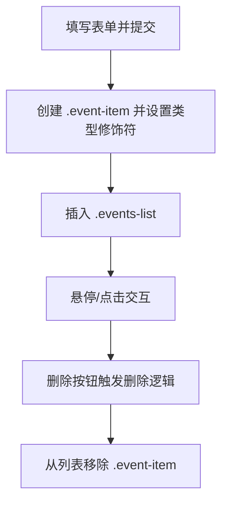

图表来源
- [styles.css](file://styles.css#L707-L900)
- [index.html](file://index.html#L320-L360)

章节来源
- [styles.css](file://styles.css#L707-L900)
- [index.html](file://index.html#L320-L360)

### 设置页与表单（BEM实战）
- Block: .settings-section、.form-group
- Elements: .form-group label、.form-group input、.form-group select、button
- Modifiers: .tab-btn.active（用于标签页激活态）

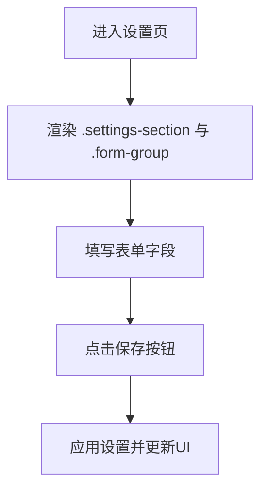

图表来源
- [styles.css](file://styles.css#L904-L960)
- [index.html](file://index.html#L360-L460)

章节来源
- [styles.css](file://styles.css#L904-L960)
- [index.html](file://index.html#L360-L460)

### 模态框与时间轴（BEM实战）
- Block: .modal、.modal-content、.timeline-modal-content、.timeline-list、.timeline-item、.timeline-event
- Elements: .modal-header、.close-modal、.timeline-date、.timeline-dot、.timeline-time、.timeline-event-type、.timeline-event-content
- Modifiers: .modal.show、.timeline-event.event-type-clock-in、.timeline-event.event-type-clock-out、.timeline-event.event-type-relax、.timeline-event.event-type-pomodoro

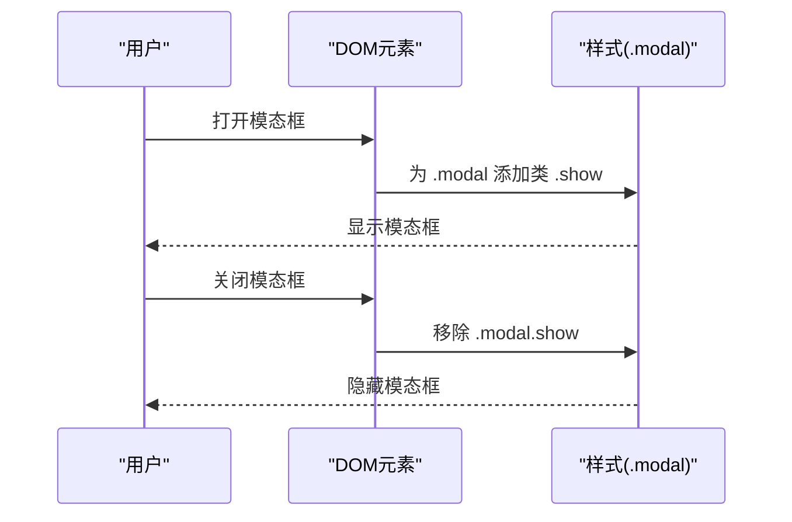

图表来源
- [styles.css](file://styles.css#L1277-L1420)
- [index.html](file://index.html#L90-L160)

章节来源
- [styles.css](file://styles.css#L1277-L1420)
- [index.html](file://index.html#L90-L160)

### 人民日报子页（BEM实战）
- Block: .rmrb-container、.rmrb-header、.rmrb-main
- Elements: .rmrb-controls、.date-picker、.refresh-btn、.ai-analysis-btn、.loading-container、.loading-spinner、.loading-message、.article-list、.article-item、.article-number、.article-title、.no-articles、.article-modal、.article-modal-content、.article-modal-header、.close-modal-btn、.ai-modal-content、.ai-analysis-body

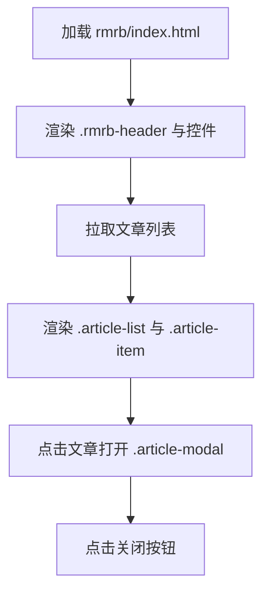

图表来源
- [rmrb/index.html](file://rmrb/index.html#L1-L60)
- [rmrb/styles.css](file://rmrb/styles.css#L1-L200)

章节来源
- [rmrb/index.html](file://rmrb/index.html#L1-L60)
- [rmrb/styles.css](file://rmrb/styles.css#L1-L200)

### 网上冲浪子页（BEM实战）
- Block: .surf-container、.surf-header、.surf-main、.hot-list-section
- Elements: .section-header、.refresh-btn、.loading-container、.loading-spinner、.loading-message、.hot-list、.hot-item、.hot-rank、.hot-rank-top、.hot-content、.hot-title、.hot-label、.error-message

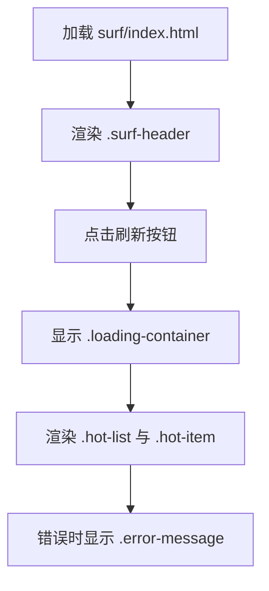

图表来源
- [surf/index.html](file://surf/index.html#L1-L54)
- [surf/styles.css](file://surf/styles.css#L1-L200)

章节来源
- [surf/index.html](file://surf/index.html#L1-L54)
- [surf/styles.css](file://surf/styles.css#L1-L200)

## 依赖关系分析
- 组件耦合
  - 侧边栏与遮罩：.sidebar 与 .sidebar-overlay 通过状态类配合控制显示/隐藏，耦合度低，职责单一
  - AI浮动面板：.ai-assistant-float 与 .ai-float-panel 通过 show 控制显隐，与主应用其他模块解耦
  - 日历与事件：.calendar-page-layout 与 .event-* 组件通过类名组合实现布局与行为分离
- 外部依赖
  - 子页面样式通过 link 引入主样式，形成“基础样式 + 页面特有样式”的层次化组织
- 潜在风险
  - 若多个页面同时使用相同类名（如 .loading-container），需确保命名前缀隔离（例如 .rmrb-loading-container 或 .surf-loading-container）

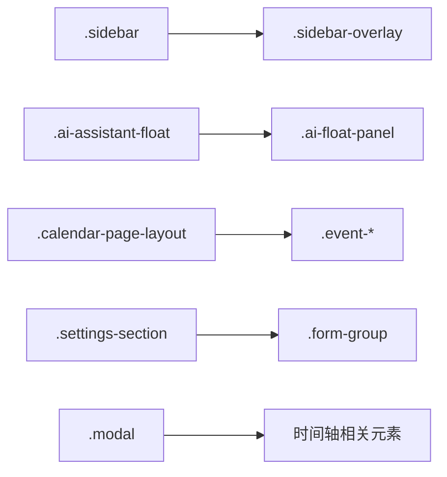

图表来源
- [styles.css](file://styles.css#L32-L200)
- [styles.css](file://styles.css#L529-L900)
- [styles.css](file://styles.css#L904-L1420)

章节来源
- [styles.css](file://styles.css#L32-L200)
- [styles.css](file://styles.css#L529-L900)
- [styles.css](file://styles.css#L904-L1420)

## 性能考量
- 类名长度与选择器复杂度
  - 使用短而语义化的类名（如 .sidebar、.nav-item）可降低选择器层级，提升渲染性能
- 状态类与过渡
  - 使用 .open、.show 等轻量状态类，配合 CSS 过渡属性，避免频繁 DOM 操作
- 响应式与媒体查询
  - 在移动端通过 .footer-tabs、.calendar-page-layout 等块级结构配合媒体查询，减少不必要的重排重绘

## 故障排查指南
- 侧边栏无法关闭
  - 检查是否正确移除了 .sidebar.open 与 .sidebar-overlay.show
  - 参考路径: [styles.css](file://styles.css#L32-L120)
- AI面板不显示
  - 确认是否为 .ai-float-panel 添加了 .show
  - 参考路径: [styles.css](file://styles.css#L118-L200)
- 日历日期无高亮
  - 检查是否为 .calendar-day 添加了 .today、.workday、.weekend 等修饰符
  - 参考路径: [styles.css](file://styles.css#L529-L700)
- 事件类型样式未生效
  - 确认 .event-item 是否包含 .type-* 修饰符
  - 参考路径: [styles.css](file://styles.css#L707-L900)
- 设置页表单无效
  - 检查 .settings-section 与 .form-group 的结构是否完整
  - 参考路径: [styles.css](file://styles.css#L904-L960)
- 模态框无法关闭
  - 确认是否移除了 .modal.show
  - 参考路径: [styles.css](file://styles.css#L1277-L1420)

章节来源
- [styles.css](file://styles.css#L32-L200)
- [styles.css](file://styles.css#L529-L900)
- [styles.css](file://styles.css#L904-L960)
- [styles.css](file://styles.css#L1277-L1420)

## 结论
项目在主应用与子页面中广泛采用BEM命名方法论，通过清晰的 block、element、modifier 组合，实现了组件的高内聚、低耦合与强可读性。借助状态类（如 .open、.show、.active、.today、.type-*）表达组件状态与类型，既避免了样式冲突，又提升了可维护性与可复用性。建议在新组件开发中严格遵循本文的命名指导原则，确保团队风格一致、交付质量稳定。

## 附录

### BEM命名规则与使用边界
- Block（块）
  - 代表独立的组件实体，如 .sidebar、.ai-assistant-float、.calendar-page-layout、.event-add-card、.settings-section、.modal
  - 命名应简洁、语义化，避免过长或缩写不清
- Element（元素）
  - 表示块内的子元素，使用“块名__元素名”的形式，如 .sidebar-header、.ai-float-panel、.calendar-header、.event-item、.settings-section
  - 元素不应脱离块独立存在，应始终作为块的子级出现
- Modifier（修饰符）
  - 表示状态或变体，使用“块名--修饰符名”或“元素--修饰符名”，如 .sidebar.open、.ai-float-panel.show、.calendar-day.today、.event-item.type-work
  - 修饰符应与块/元素同级，避免深层嵌套
- 命名边界与注意事项
  - 避免在同一页面中重复使用相同类名（如 .loading-container），建议加上页面前缀（如 .rmrb-loading-container、.surf-loading-container）
  - 修饰符仅用于状态或类型区分，不承载复杂样式逻辑
  - 元素与修饰符之间不要交叉使用，保持层级清晰

### 新组件开发命名指导原则
- 优先确定 Block 名称，确保语义明确
- 在 Block 内拆分 Element，避免过度嵌套
- 使用 Modifier 表达状态或类型，保持修饰符数量最小化
- 为子页面组件增加前缀，避免类名冲突
- 为状态类与类型类分别命名，保持一致性
- 在 HTML 中遵循“块名 + 元素名 + 修饰符”的顺序书写，便于审查与维护