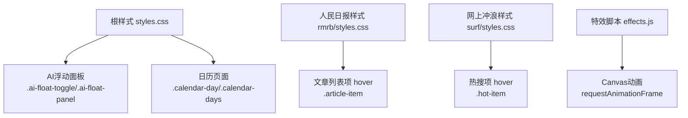
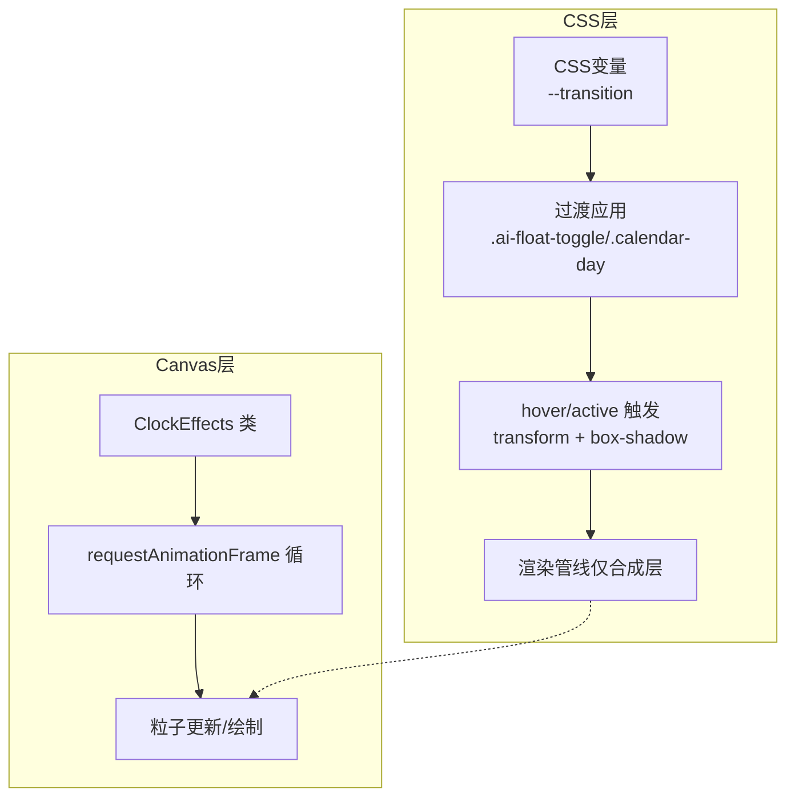
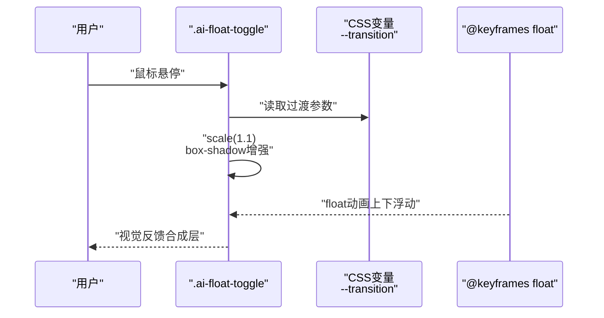
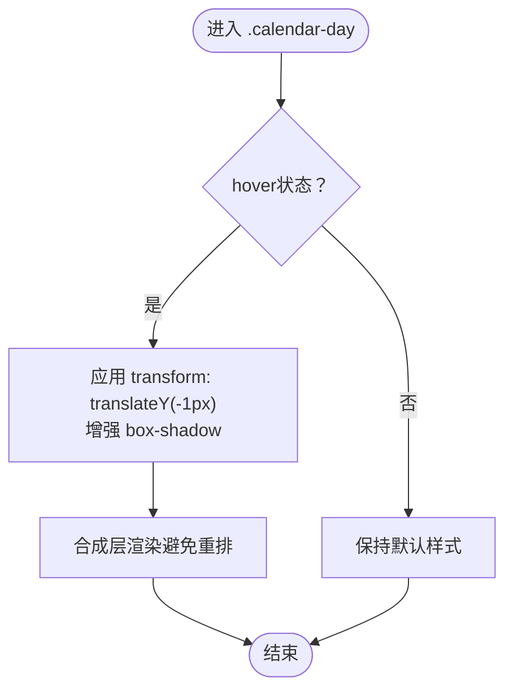
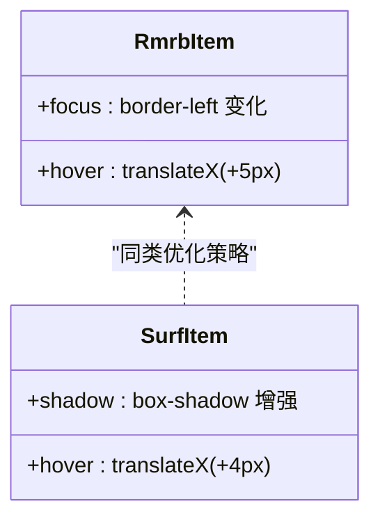
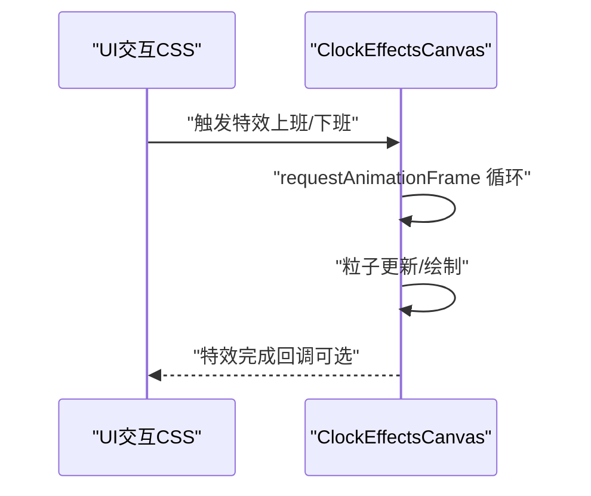
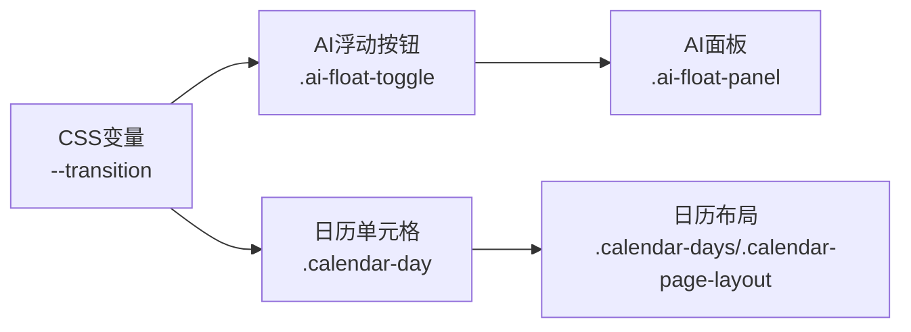

# CSS性能优化

<cite>
**本文引用的文件**
- [styles.css](file://styles.css)
- [rmrb/styles.css](file://rmrb/styles.css)
- [surf/styles.css](file://surf/styles.css)
- [effects.js](file://effects.js)
- [README.md](file://README.md)
</cite>

## 目录
1. [引言](#引言)
2. [项目结构](#项目结构)
3. [核心组件](#核心组件)
4. [架构总览](#架构总览)
5. [详细组件分析](#详细组件分析)
6. [依赖关系分析](#依赖关系分析)
7. [性能考量](#性能考量)
8. [故障排查指南](#故障排查指南)
9. [结论](#结论)
10. [附录](#附录)

## 引言
本文件聚焦于项目中的CSS性能优化实践，围绕如何通过CSS transition与transform实现流畅动画、避免触发重排与重绘展开。文档将以实际案例为主线，包括.ai-float-toggle的hover效果与.calendar-day的悬停动画，并结合cubic-bezier缓动函数与will-change属性的使用场景，给出可落地的优化建议与最佳实践，确保在桌面与移动端均能提供顺滑的用户体验。

## 项目结构
该项目采用多页面结构，主样式集中在根目录的样式文件中，同时各子页面（如人民日报、网上冲浪）拥有独立样式文件。整体通过CSS变量统一过渡参数，配合transition与transform实现平滑交互；部分复杂动画采用Canvas实现，避免DOM层级过深带来的性能问题。

图表来源
- [styles.css](file://styles.css#L124-L200)
- [styles.css](file://styles.css#L605-L630)
- [rmrb/styles.css](file://rmrb/styles.css#L130-L150)
- [surf/styles.css](file://surf/styles.css#L146-L161)
- [effects.js](file://effects.js#L135-L200)

章节来源
- [styles.css](file://styles.css#L1-L200)
- [rmrb/styles.css](file://rmrb/styles.css#L1-L170)
- [surf/styles.css](file://surf/styles.css#L1-L160)
- [README.md](file://README.md#L43-L70)

## 核心组件
- 全局过渡参数：通过CSS变量统一管理transition时长与缓动曲线，便于集中控制与一致性。
- AI浮动面板：悬浮按钮与面板的显隐、关闭按钮与输入框的hover/focus交互，均采用transform与box-shadow变化，避免触发布局重排。
- 日历单元格：.calendar-day的hover通过translateY与box-shadow实现轻量级位移与阴影变化，保持渲染路径高效。
- 子页面交互：人民日报与网上冲浪的hover项同样采用translateX/translateY与box-shadow，形成一致的性能友好的交互模式。
- Canvas动画：打卡特效通过requestAnimationFrame驱动，避免频繁DOM操作，降低主线程压力。

章节来源
- [styles.css](file://styles.css#L1-L20)
- [styles.css](file://styles.css#L124-L200)
- [styles.css](file://styles.css#L605-L630)
- [rmrb/styles.css](file://rmrb/styles.css#L130-L150)
- [surf/styles.css](file://surf/styles.css#L146-L161)
- [effects.js](file://effects.js#L135-L200)

## 架构总览
下图展示了CSS层面的交互与动画路径，以及与Canvas特效的关系。CSS负责UI层的过渡与变换，Canvas负责重型动画，两者协同以获得最佳性能与体验。

图表来源
- [styles.css](file://styles.css#L1-L20)
- [styles.css](file://styles.css#L124-L200)
- [styles.css](file://styles.css#L605-L630)
- [effects.js](file://effects.js#L135-L200)

## 详细组件分析

### .ai-float-toggle 的hover效果
- 关键点
  - 使用CSS变量统一过渡参数，确保hover与非hover状态的一致性。
  - hover时通过scale与box-shadow变化实现视觉强调，不改变布局尺寸，避免重排。
  - 配合浮动动画（keyframes）实现轻微的上下移动，增强动态感。
- 性能要点
  - transform与box-shadow均为合成层友好属性，不会触发重排。
  - 使用cubic-bezier缓动函数，使缩放与阴影变化更自然，同时保持较低的CPU/GPU开销。
- 适用场景
  - 固定悬浮按钮、气泡面板、菜单入口等需要强调但不改变布局的交互。

图表来源
- [styles.css](file://styles.css#L124-L151)
- [styles.css](file://styles.css#L1-L20)

章节来源
- [styles.css](file://styles.css#L124-L151)
- [styles.css](file://styles.css#L1-L20)

### .calendar-day 的悬停动画
- 关键点
  - hover时通过translateY与box-shadow实现轻微上浮与阴影变化，突出当前日期。
  - 使用统一的transition参数，保证与其他组件的交互节奏一致。
- 性能要点
  - transform与box-shadow均为合成层友好属性，避免重排。
  - 通过aspect-ratio与min-height控制尺寸，减少布局抖动。
- 适用场景
  - 日历日期选择、列表项悬停高亮等需要轻量级反馈的交互。

图表来源
- [styles.css](file://styles.css#L605-L630)

章节来源
- [styles.css](file://styles.css#L605-L630)

### cubic-bezier 缓动函数与 will-change 属性
- cubic-bezier 缓动函数
  - 在CSS变量中统一定义过渡曲线，确保全局一致的动效节奏与自然感。
  - 对于高频交互（如按钮hover、面板显隐），合适的缓动函数可显著提升感知流畅度。
- will-change 属性
  - 对于可能频繁触发的变换（如大量列表项hover、模态框显隐），可在进入前设置will-change: transform或opacity，提示浏览器提前准备合成层，减少首帧延迟。
  - 注意：will-change会占用额外内存与GPU资源，应在交互结束后及时清理，避免造成内存压力。
- 实践建议
  - 将will-change用于已知的、短期内会发生的变换，避免滥用。
  - 与transform/opacity组合使用，确保只影响合成层属性。

章节来源
- [styles.css](file://styles.css#L1-L20)

### 子页面 hover 效果对比
- 人民日报文章项
  - hover时通过translateX与border-left变化实现轻量级位移与强调，避免重排。
- 网上冲浪热搜项
  - hover时通过translateX与box-shadow变化实现上浮与阴影强调，保持渲染路径高效。

图表来源
- [rmrb/styles.css](file://rmrb/styles.css#L130-L150)
- [surf/styles.css](file://surf/styles.css#L146-L161)

章节来源
- [rmrb/styles.css](file://rmrb/styles.css#L130-L150)
- [surf/styles.css](file://surf/styles.css#L146-L161)

### Canvas 动画与CSS协同
- 打卡特效（上班/下班）通过Canvas与requestAnimationFrame实现，避免DOM层级过深导致的布局与绘制压力。
- CSS层负责UI交互与过渡，Canvas层负责重型粒子动画，二者分工明确，互不干扰。

图表来源
- [effects.js](file://effects.js#L135-L200)
- [README.md](file://README.md#L50-L56)

章节来源
- [effects.js](file://effects.js#L135-L200)
- [README.md](file://README.md#L50-L56)

## 依赖关系分析
- CSS变量依赖
  - 全局过渡参数依赖于CSS变量--transition，所有组件共享该变量，确保动效节奏一致。
- 组件耦合
  - .ai-float-toggle 与 .ai-float-panel 之间存在显隐联动，通过类名切换实现，耦合度低。
  - .calendar-day 与日历布局（grid）解耦，hover不影响其他网格项布局。
- 外部依赖
  - Canvas特效依赖浏览器的requestAnimationFrame，性能稳定。

图表来源
- [styles.css](file://styles.css#L1-L20)
- [styles.css](file://styles.css#L124-L200)
- [styles.css](file://styles.css#L605-L630)

章节来源
- [styles.css](file://styles.css#L1-L20)
- [styles.css](file://styles.css#L124-L200)
- [styles.css](file://styles.css#L605-L630)

## 性能考量
- 减少复杂选择器
  - 优先使用类选择器而非深层后代选择器，降低匹配成本。
  - 将高频交互的元素置于浅层DOM，减少选择器链长度。
- 合理使用 will-change
  - 对即将发生变换的元素设置will-change: transform/opacity，交互结束后及时清除。
  - 避免对大量元素同时设置will-change，防止内存与GPU资源浪费。
- 优化动画帧率
  - 优先使用transform与opacity，避免使用会触发重排的属性（如width、height、top/left等）。
  - 控制动画时长与缓动曲线，避免过度复杂的贝塞尔曲线导致CPU/GPU负担。
- 降低重绘与重排
  - 将需要频繁变化的元素提升至合成层，减少对布局树的影响。
  - 对于列表项hover等高频场景，尽量使用translateZ(0)或will-change提示浏览器开启硬件加速。
- 选择器与布局
  - 使用flex/grid等现代布局减少复杂计算，避免使用table布局。
  - 合理使用aspect-ratio与min-height控制尺寸，减少布局抖动。

## 故障排查指南
- hover无响应或卡顿
  - 检查是否使用了会触发重排的属性（如width、height、top/left）。
  - 确认transition时长与缓动函数是否过长或过于复杂。
- will-change导致内存占用过高
  - 检查是否在交互结束后清理will-change。
  - 对大量元素设置will-change时需谨慎，必要时分批处理。
- Canvas动画掉帧
  - 检查requestAnimationFrame循环中的粒子数量与绘制逻辑，适当减少粒子数或简化绘制。
  - 避免在动画循环中进行DOM查询或样式读写。

章节来源
- [styles.css](file://styles.css#L1-L20)
- [styles.css](file://styles.css#L124-L200)
- [styles.css](file://styles.css#L605-L630)
- [effects.js](file://effects.js#L135-L200)

## 结论
本项目在CSS层面通过统一的过渡参数、transform与box-shadow的合成层友好属性，实现了流畅且性能友好的交互体验。针对.ai-float-toggle与.calendar-day等高频交互，采用cubic-bezier缓动与合理的will-change策略，既保证了视觉表现，又避免了重排与重绘带来的性能损耗。对于重型动画，采用Canvas与requestAnimationFrame进一步降低主线程压力。遵循本文的优化原则与最佳实践，可在不同设备上持续提供顺滑的用户体验。

## 附录
- 相关实现参考路径
  - [全局过渡参数与变量](file://styles.css#L1-L20)
  - [AI浮动按钮与面板](file://styles.css#L124-L200)
  - [日历单元格悬停](file://styles.css#L605-L630)
  - [人民日报文章项hover](file://rmrb/styles.css#L130-L150)
  - [网上冲浪热搜项hover](file://surf/styles.css#L146-L161)
  - [Canvas特效与requestAnimationFrame](file://effects.js#L135-L200)