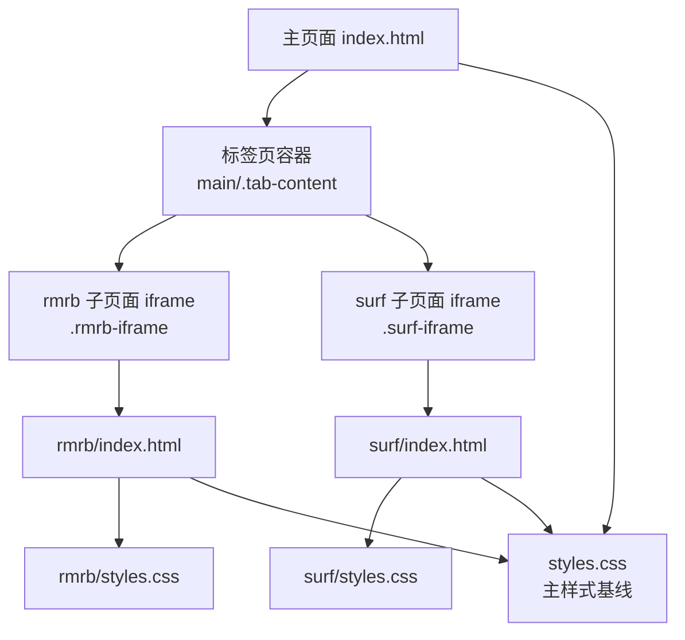
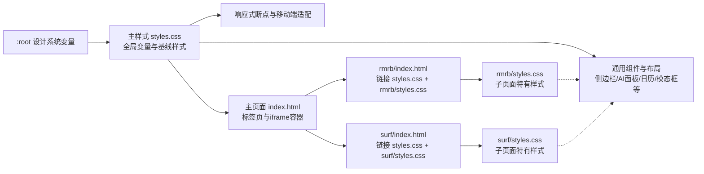
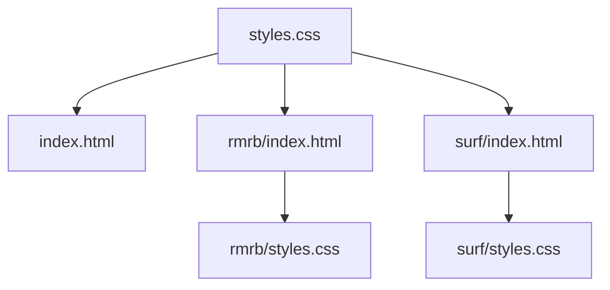

# CSS架构设计

<cite>
**本文引用的文件**
- [styles.css](file://styles.css)
- [index.html](file://index.html)
- [rmrb/styles.css](file://rmrb/styles.css)
- [rmrb/index.html](file://rmrb/index.html)
- [surf/styles.css](file://surf/styles.css)
- [surf/index.html](file://surf/index.html)
- [README.md](file://README.md)
</cite>

## 目录
1. [引言](#引言)
2. [项目结构](#项目结构)
3. [核心组件](#核心组件)
4. [架构总览](#架构总览)
5. [详细组件分析](#详细组件分析)
6. [依赖关系分析](#依赖关系分析)
7. [性能考量](#性能考量)
8. [故障排查指南](#故障排查指南)
9. [结论](#结论)

## 引言
本文件系统性阐述该项目的CSS架构设计，重点围绕以下目标展开：
- 解释根变量（:root）中设计系统变量的组织结构与使用规范（如--primary-color、--border-radius等）。
- 说明主应用styles.css如何作为样式基线，rmrb与surf子页面如何通过继承与扩展机制复用主样式。
- 利用CSS层叠特性，确保子页面样式在保持一致性的同时具备个性化能力。
- 总结样式优先级管理的最佳实践，帮助维护者在复杂页面中高效协同与演进。

## 项目结构
该项目采用“主样式 + 子页面样式”的分层组织方式：
- 主样式：styles.css 提供全局设计系统变量、基础排版、通用组件与响应式规则。
- 子页面：rmrb/index.html 与 surf/index.html 分别通过链接主样式与各自子样式，实现统一基线与差异化视觉。
- 页面间共享：主页面 index.html 中的标签页与iframe承载子页面，形成“主页面 + 子页面”的组合结构。

图表来源
- [index.html](file://index.html#L352-L358)
- [rmrb/index.html](file://rmrb/index.html#L1-L12)
- [surf/index.html](file://surf/index.html#L1-L10)
- [styles.css](file://styles.css#L1-L30)
- [rmrb/styles.css](file://rmrb/styles.css#L1-L20)
- [surf/styles.css](file://surf/styles.css#L1-L15)

章节来源
- [index.html](file://index.html#L352-L358)
- [rmrb/index.html](file://rmrb/index.html#L1-L12)
- [surf/index.html](file://surf/index.html#L1-L10)

## 核心组件
- 设计系统变量（:root）
  - 在主样式中集中定义颜色、圆角、阴影、过渡等变量，形成统一的视觉语言与主题基底。
  - 子页面通过var()引用这些变量，确保跨页面一致性。
- 主样式基线（styles.css）
  - 提供全局重置、基础排版、通用组件（侧边栏、AI浮动面板、日历、模态框等）、响应式断点与通用交互态。
- 子页面样式（rmrb/styles.css、surf/styles.css）
  - 仅负责子页面特有的布局、配色与局部交互，不重复定义全局变量与通用组件，避免冗余与冲突。
- 页面集成（index.html）
  - 使用iframe承载子页面，并在主页面中通过标签页切换控制显示隐藏，同时在主页面中引入主样式，使子页面共享同一套设计系统。

章节来源
- [styles.css](file://styles.css#L1-L30)
- [rmrb/styles.css](file://rmrb/styles.css#L1-L20)
- [surf/styles.css](file://surf/styles.css#L1-L15)
- [index.html](file://index.html#L352-L358)

## 架构总览
下图展示了主样式与子页面的样式关系与层叠顺序，体现“主样式为基线、子样式为扩展”的设计原则。

图表来源
- [styles.css](file://styles.css#L1-L30)
- [index.html](file://index.html#L352-L358)
- [rmrb/index.html](file://rmrb/index.html#L1-L12)
- [surf/index.html](file://surf/index.html#L1-L10)
- [rmrb/styles.css](file://rmrb/styles.css#L1-L20)
- [surf/styles.css](file://surf/styles.css#L1-L15)

## 详细组件分析

### 设计系统变量（:root）组织与使用规范
- 组织结构
  - 颜色体系：主色、辅色、强调色、文本色、背景色等，用于统一品牌与可访问性。
  - 形态体系：圆角、阴影、过渡时序等，用于统一交互质感与动效节奏。
- 使用规范
  - 仅在:root定义变量，不在具体组件中重复声明同名变量，避免命名冲突与维护成本。
  - 子页面通过var(--variable)引用，确保跨页面一致。
  - 通用组件（如卡片、按钮、模态框）统一使用变量，避免硬编码颜色与尺寸。
- 示例路径
  - 变量定义位置：[styles.css](file://styles.css#L1-L16)
  - 变量使用位置（示例）：
    - 背景与文本：[styles.css](file://styles.css#L24-L30)
    - 卡片背景与阴影：[styles.css](file://styles.css#L378-L386)
    - 圆角与阴影变量：[styles.css](file://styles.css#L10-L16)

章节来源
- [styles.css](file://styles.css#L1-L30)
- [styles.css](file://styles.css#L378-L386)

### 主样式基线（styles.css）职责边界
- 全局重置与排版
  - 重置盒模型、统一字体族、设置基础行高与溢出策略。
- 通用组件
  - 侧边栏抽屉、AI浮动面板、遮罩层、菜单按钮、容器与头部、标签页、日历与事件卡片、模态框、Toast提示等。
- 响应式与移动端
  - 针对移动端的布局调整、底部导航、日历与表单的适配。
- 与子页面的关系
  - 子页面通过链接主样式获得统一基线；子页面样式仅覆盖自身差异，不与主样式产生冲突。

章节来源
- [styles.css](file://styles.css#L18-L31)
- [styles.css](file://styles.css#L32-L120)
- [styles.css](file://styles.css#L1277-L1303)
- [styles.css](file://styles.css#L1087-L1275)

### 子页面样式复用与扩展机制
- rmrb 子页面
  - 链接顺序：先主样式，后子样式，确保子样式能覆盖主样式中的通用组件。
  - 作用域：仅定义自身布局、配色与局部交互，不重复定义全局变量与通用组件。
  - 示例路径：
    - 链接主样式与子样式：[rmrb/index.html](file://rmrb/index.html#L1-L12)
    - 子页面特有样式：[rmrb/styles.css](file://rmrb/styles.css#L1-L20)
- surf 子页面
  - 链接顺序：先主样式，后子样式，确保子样式能覆盖主样式中的通用组件。
  - 作用域：仅定义自身网格布局、配色与局部交互，不重复定义全局变量与通用组件。
  - 示例路径：
    - 链接主样式与子样式：[surf/index.html](file://surf/index.html#L1-L10)
    - 子页面特有样式：[surf/styles.css](file://surf/styles.css#L1-L15)

章节来源
- [rmrb/index.html](file://rmrb/index.html#L1-L12)
- [rmrb/styles.css](file://rmrb/styles.css#L1-L20)
- [surf/index.html](file://surf/index.html#L1-L10)
- [surf/styles.css](file://surf/styles.css#L1-L15)

### CSS层叠特性与一致性+个性化的平衡
- 层叠顺序（从低到高）
  - 主样式（styles.css）：提供通用组件与全局变量。
  - 子样式（rmrb/surf styles.css）：覆盖通用组件，注入子页面专属视觉。
- 一致性保障
  - 通过:root统一变量，子页面仅通过var()引用，避免颜色与尺寸漂移。
  - 通用组件（卡片、按钮、模态框等）在主样式中统一实现，子页面无需重复定义。
- 个性化实现
  - 子页面在自身容器内使用独特的背景渐变、图标与局部动效，形成差异化视觉。
  - 通过媒体查询与局部选择器实现移动端差异化布局与交互。

章节来源
- [styles.css](file://styles.css#L1-L30)
- [rmrb/styles.css](file://rmrb/styles.css#L1-L20)
- [surf/styles.css](file://surf/styles.css#L1-L15)

### 样式优先级管理最佳实践
- 变量优先：所有颜色、圆角、阴影、过渡等统一在:root定义，子页面通过var()引用。
- 组件优先：通用组件在主样式中实现，子页面仅覆盖其局部属性，避免全量重写。
- 选择器优先：子页面尽量使用类选择器限定作用域，避免通配符与全局污染。
- 层叠顺序：子页面样式置于主样式之后，确保子样式能覆盖主样式中的通用组件。
- 响应式优先：在主样式中统一处理断点与移动端适配，子页面仅做微调。
- 可维护性：为每个子页面建立独立样式文件，避免样式混杂；必要时拆分子组件样式块，提升可读性。

章节来源
- [styles.css](file://styles.css#L1-L30)
- [rmrb/styles.css](file://rmrb/styles.css#L1-L20)
- [surf/styles.css](file://surf/styles.css#L1-L15)

## 依赖关系分析
- 主样式依赖
  - index.html 通过<link>引入主样式，使所有标签页与iframe共享同一套设计系统。
- 子页面依赖
  - rmrb/index.html 与 surf/index.html 同时引入主样式与各自子样式，形成“基线 + 扩展”的依赖链。
- 组件依赖
  - 通用组件（如侧边栏、AI面板、日历、模态框）由主样式提供，子页面仅消费与局部覆盖。

图表来源
- [index.html](file://index.html#L1-L12)
- [rmrb/index.html](file://rmrb/index.html#L1-L12)
- [surf/index.html](file://surf/index.html#L1-L10)
- [styles.css](file://styles.css#L1-L30)

章节来源
- [index.html](file://index.html#L1-L12)
- [rmrb/index.html](file://rmrb/index.html#L1-L12)
- [surf/index.html](file://surf/index.html#L1-L10)

## 性能考量
- 减少重复定义：通过:root集中变量，避免子页面重复声明，降低CSS体积与解析成本。
- 选择器简单化：优先使用类选择器与局部作用域，避免深层嵌套与复杂选择器带来的匹配开销。
- 动画与阴影：主样式中统一定义过渡与阴影，子页面仅引用，避免重复计算与渲染抖动。
- 响应式断点：在主样式中集中处理，子页面仅做微调，减少媒体查询数量与匹配次数。

## 故障排查指南
- 子页面颜色不一致
  - 检查子页面是否通过var()引用主样式变量，而非硬编码颜色。
  - 确认子样式加载顺序在主样式之后，确保覆盖生效。
- 子页面布局错位
  - 检查子页面是否使用了与主样式相同的通用类名，避免意外覆盖。
  - 确认子页面容器类名与主样式中的通用组件类名无冲突。
- 响应式问题
  - 检查子页面是否在主样式断点基础上进行微调，避免与主样式断点冲突。
- 样式未生效
  - 确认子页面的<link>顺序正确，主样式在前，子样式在后。
  - 检查子样式选择器是否过于宽泛，导致被主样式覆盖。

章节来源
- [styles.css](file://styles.css#L1-L30)
- [rmrb/styles.css](file://rmrb/styles.css#L1-L20)
- [surf/styles.css](file://surf/styles.css#L1-L15)
- [rmrb/index.html](file://rmrb/index.html#L1-L12)
- [surf/index.html](file://surf/index.html#L1-L10)

## 结论
本项目通过“主样式基线 + 子页面扩展”的CSS架构，实现了设计系统变量的集中管理与跨页面一致性，同时允许子页面在统一基线下展现个性化视觉与交互。遵循层叠顺序、变量优先与组件优先的原则，能够有效降低维护成本、提升可扩展性，并在复杂页面中保持良好的性能与可读性。建议后续持续完善变量命名规范与注释，进一步提升团队协作效率。