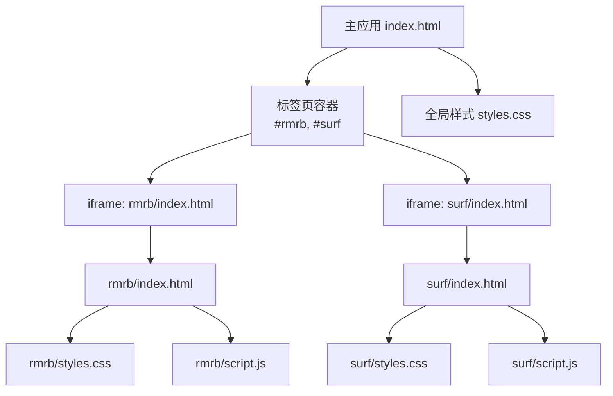
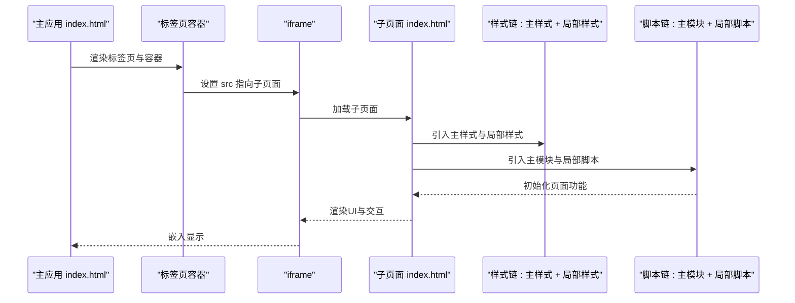
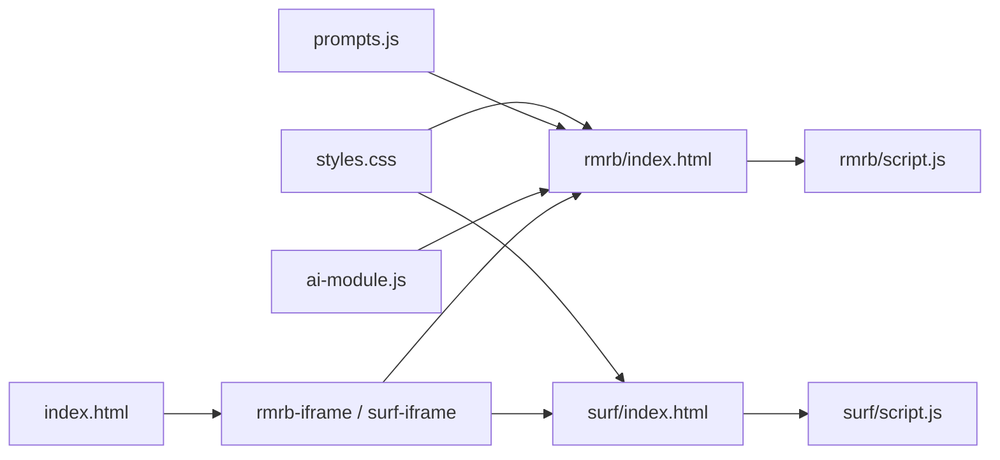

# HTML模板创建规范

<cite>
**本文引用的文件**
- [index.html](file://index.html)
- [styles.css](file://styles.css)
- [script.js](file://script.js)
- [rmrb/index.html](file://rmrb/index.html)
- [rmrb/styles.css](file://rmrb/styles.css)
- [rmrb/script.js](file://rmrb/script.js)
- [surf/index.html](file://surf/index.html)
- [surf/styles.css](file://surf/styles.css)
- [surf/script.js](file://surf/script.js)
</cite>

## 目录
1. [引言](#引言)
2. [项目结构](#项目结构)
3. [核心组件](#核心组件)
4. [架构总览](#架构总览)
5. [详细组件分析](#详细组件分析)
6. [依赖关系分析](#依赖关系分析)
7. [性能考量](#性能考量)
8. [故障排查指南](#故障排查指南)
9. [结论](#结论)
10. [附录](#附录)

## 引言
本规范旨在为新增独立功能页面提供统一的HTML模板创建标准，确保与现有主应用结构保持一致，包括基础HTML骨架、meta标签、样式继承与局部扩展、脚本模块引入顺序、以及通过iframe集成到主应用的方式。本文以rmrb与surf两个子页面为示例，展示如何创建独立页面并被主应用以iframe方式集成，同时强调必须继承主项目的全局样式以保持视觉一致性，并允许通过局部CSS文件进行定制化扩展；最后给出页面间通信建议（postMessage），以便在需要时实现主应用与iframe之间的交互。

## 项目结构
- 主应用入口位于根目录的index.html，负责组织标签页、侧边栏、底部导航与iframe集成。
- 独立功能页面分别位于rmrb与surf目录下，每个目录包含独立的index.html、styles.css与script.js。
- 主样式styles.css提供全局主题变量与通用样式，子页面通过<link>继承主样式并在自身styles.css中进行局部扩展。

图表来源
- [index.html](file://index.html#L350-L360)
- [rmrb/index.html](file://rmrb/index.html#L1-L62)
- [surf/index.html](file://surf/index.html#L1-L54)
- [styles.css](file://styles.css#L1-L120)

章节来源
- [index.html](file://index.html#L350-L360)
- [styles.css](file://styles.css#L1-L120)

## 核心组件
- 基础HTML模板要求
  - DOCTYPE声明与<html lang="zh-CN">根元素
  - head区域包含charset、viewport、title
  - 继承主样式<link rel="stylesheet" href="../styles.css">，并在其后引入局部样式<link rel="stylesheet" href="styles.css">
  - 脚本模块引入顺序：先引入主应用的公共模块（如prompts.js、ai-module.js等），再引入当前页面的局部脚本
- iframe集成
  - 主应用在对应标签页容器中放置iframe，src指向子页面index.html
  - 通过类名控制iframe尺寸与圆角，确保与主样式一致
- 视觉一致性
  - 子页面必须继承主样式，局部样式仅做补充与差异化

章节来源
- [rmrb/index.html](file://rmrb/index.html#L1-L20)
- [rmrb/index.html](file://rmrb/index.html#L6-L12)
- [surf/index.html](file://surf/index.html#L1-L10)
- [index.html](file://index.html#L350-L360)
- [styles.css](file://styles.css#L508-L526)

## 架构总览
主应用通过iframe将独立功能页面嵌入到标签页中，形成“主应用 + 子页面”的组合。子页面拥有独立的样式与脚本，但必须继承主样式以保证整体风格一致。

图表来源
- [index.html](file://index.html#L350-L360)
- [rmrb/index.html](file://rmrb/index.html#L1-L20)
- [surf/index.html](file://surf/index.html#L1-L10)
- [styles.css](file://styles.css#L508-L526)

## 详细组件分析

### HTML模板结构与meta标签规范
- 必备元素
  - DOCTYPE与<html lang="zh-CN">
  - <head>内含<meta charset="UTF-8">、<meta name="viewport" content="width=device-width, initial-scale=1.0">、<title>页面标题</title>
  - 继承主样式<link rel="stylesheet" href="../styles.css">，随后<link rel="stylesheet" href="styles.css">引入局部样式
  - 脚本模块引入顺序：先主模块（如prompts.js、ai-module.js等），再局部脚本script.js
- 示例参考
  - rmrb/index.html展示了完整的head与body结构，包含日期选择器、刷新按钮、AI分析按钮、文章列表与模态框等主体结构
  - surf/index.html展示了热搜榜单的主体结构，包含微博与抖音热搜区域

章节来源
- [rmrb/index.html](file://rmrb/index.html#L1-L20)
- [rmrb/index.html](file://rmrb/index.html#L10-L62)
- [surf/index.html](file://surf/index.html#L1-L20)
- [surf/index.html](file://surf/index.html#L10-L54)

### 样式继承与局部扩展
- 继承主样式
  - 子页面<head>中必须包含<link rel="stylesheet" href="../styles.css">，以继承全局主题变量与通用样式
- 局部样式
  - 在主样式之后引入<link rel="stylesheet" href="styles.css">，用于页面特定的布局、组件样式与响应式规则
- 视觉一致性
  - 使用主样式中的变量与容器类名，确保颜色、间距、圆角等风格统一
- 示例参考
  - rmrb/styles.css与surf/styles.css均在继承主样式的基础上，定义了各自页面的头部、列表、模态框、加载动画与响应式规则

章节来源
- [rmrb/index.html](file://rmrb/index.html#L6-L12)
- [surf/index.html](file://surf/index.html#L6-L10)
- [rmrb/styles.css](file://rmrb/styles.css#L1-L40)
- [surf/styles.css](file://surf/styles.css#L1-L40)
- [styles.css](file://styles.css#L1-L120)

### 脚本模块引入顺序与事件监听
- 引入顺序
  - 先引入主应用的公共模块（如prompts.js、ai-module.js等），再引入当前页面的局部脚本script.js
- 事件监听
  - 子页面在DOMContentLoaded或页面就绪后初始化UI与交互，如按钮点击、日期选择、模态框开关、列表渲染等
- 示例参考
  - rmrb/script.js在init函数中绑定刷新、AI分析、日期选择、文章点击与模态框关闭等事件
  - surf/script.js在DOMContentLoaded中绑定微博与抖音热搜的刷新按钮，并渲染列表

章节来源
- [rmrb/script.js](file://rmrb/script.js#L288-L356)
- [rmrb/script.js](file://rmrb/script.js#L319-L356)
- [surf/script.js](file://surf/script.js#L13-L23)

### iframe集成与容器样式
- 主应用在对应标签页容器中放置iframe，src指向子页面index.html
- 通过类名控制iframe尺寸与圆角，确保与主样式一致
- 示例参考
  - 主应用index.html中为rmrb与surf分别设置了rmrb-iframe与surf-iframe类，用于控制iframe高度、宽度与圆角

章节来源
- [index.html](file://index.html#L350-L360)
- [styles.css](file://styles.css#L508-L526)

### 页面间通信（postMessage）建议
- 场景说明
  - 若子页面需要与主应用共享状态或触发主应用行为（如切换标签页、显示全局提示、传递参数等），可在子页面中使用window.postMessage向父级窗口发送消息
- 实现要点
  - 子页面在合适时机（如用户操作、数据加载完成）调用postMessage发送消息对象
  - 主应用在window上监听message事件，解析消息并执行相应逻辑
  - 注意校验来源origin，确保安全性
- 注意事项
  - 本仓库未直接提供postMessage实现，此处为通用实践建议，具体实现需根据实际需求扩展

[本节为通用实践说明，不直接分析具体源码文件]

## 依赖关系分析
- 主样式依赖
  - 子页面必须依赖主样式以保持视觉一致性
- 脚本模块依赖
  - 子页面脚本依赖主应用提供的公共模块（如AI模块、提示模块等）
- iframe依赖
  - 主应用依赖子页面的index.html作为iframe内容源

图表来源
- [rmrb/index.html](file://rmrb/index.html#L6-L12)
- [surf/index.html](file://surf/index.html#L6-L10)
- [index.html](file://index.html#L350-L360)
- [styles.css](file://styles.css#L508-L526)

章节来源
- [rmrb/index.html](file://rmrb/index.html#L6-L12)
- [surf/index.html](file://surf/index.html#L6-L10)
- [index.html](file://index.html#L350-L360)

## 性能考量
- 资源加载
  - 优先使用相对路径引入样式与脚本，避免跨域与缓存问题
  - 控制脚本加载顺序，避免阻塞渲染
- 模块化
  - 将公共逻辑抽取为主模块，子页面按需引入，减少重复代码
- 响应式
  - 在子页面样式中使用媒体查询，确保在不同屏幕尺寸下的良好体验

[本节提供一般性指导，不直接分析具体源码文件]

## 故障排查指南
- 页面空白或样式错乱
  - 检查<head>中是否正确引入主样式与局部样式，确认<link>顺序
  - 检查iframe src路径是否正确
- 交互无效
  - 检查脚本引入顺序，确保主模块在局部脚本之前加载
  - 确认DOM元素存在后再绑定事件
- 数据加载失败
  - 检查网络请求与CORS代理配置（如rmrb中使用代理访问外部站点）

章节来源
- [rmrb/script.js](file://rmrb/script.js#L135-L150)
- [rmrb/script.js](file://rmrb/script.js#L319-L356)
- [surf/script.js](file://surf/script.js#L28-L55)

## 结论
通过本规范，新增独立功能页面可以在不破坏主应用整体风格的前提下，快速接入并以iframe方式集成到主应用中。遵循统一的HTML模板结构、样式继承与脚本引入顺序，能够显著降低维护成本并提升一致性。若存在页面间通信需求，可基于postMessage进行扩展，但需注意安全与来源校验。

[本节为总结性内容，不直接分析具体源码文件]

## 附录

### 新增页面模板清单（步骤指引）
- 创建目录与文件
  - 在项目根目录新建功能目录（如myfeature/），并创建index.html、styles.css、script.js
- 编写HTML模板
  - 设置DOCTYPE与<html lang="zh-CN">
  - 在<head>中添加charset、viewport、title
  - 引入主样式与局部样式，顺序为：主样式在前，局部样式在后
  - 在<body>中编写页面主体结构（如列表、表单、模态框等）
- 引入脚本模块
  - 先引入主应用公共模块，再引入当前页面脚本
  - 在页面就绪后初始化事件监听与UI逻辑
- 集成到主应用
  - 在主应用对应标签页容器中添加iframe，src指向子页面index.html
  - 为iframe设置合适的类名以匹配主样式
- 样式与交互
  - 局部样式仅做差异化扩展，不得覆盖主样式关键变量
  - 如需全局交互，可考虑postMessage与主应用通信

章节来源
- [rmrb/index.html](file://rmrb/index.html#L1-L20)
- [rmrb/index.html](file://rmrb/index.html#L10-L62)
- [surf/index.html](file://surf/index.html#L1-L20)
- [surf/index.html](file://surf/index.html#L10-L54)
- [index.html](file://index.html#L350-L360)
- [styles.css](file://styles.css#L508-L526)