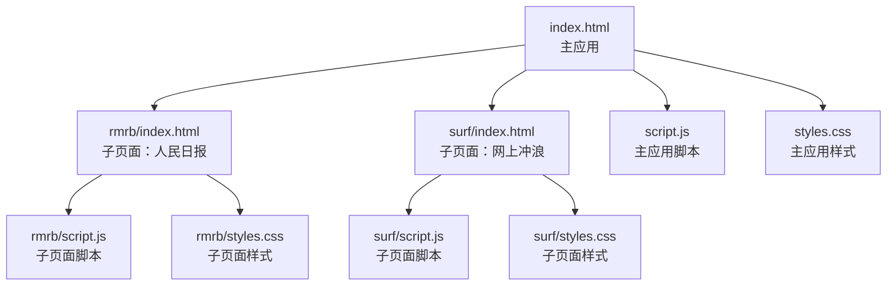
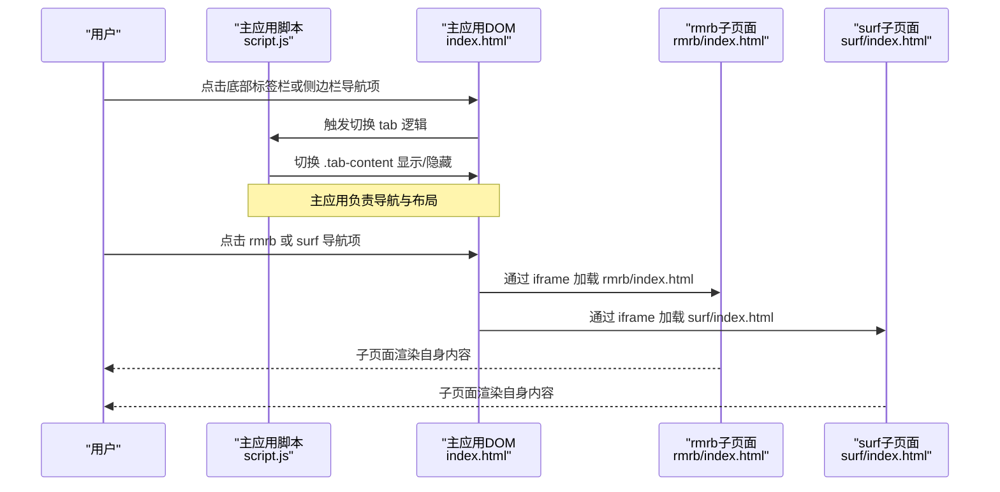
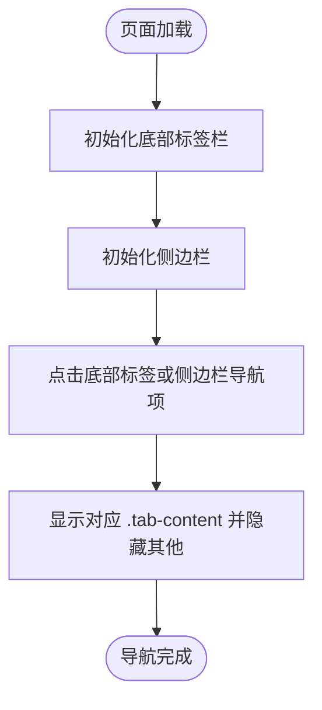
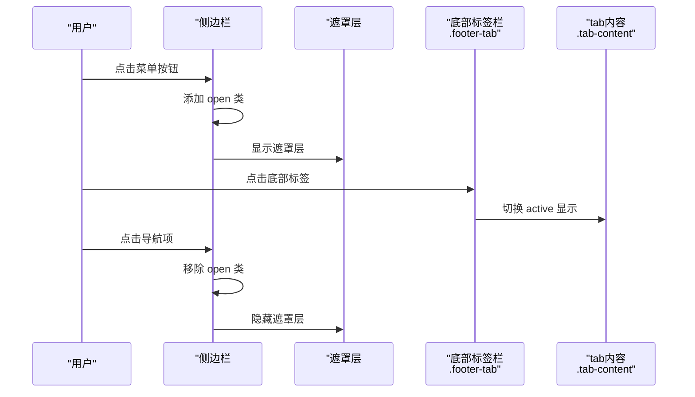
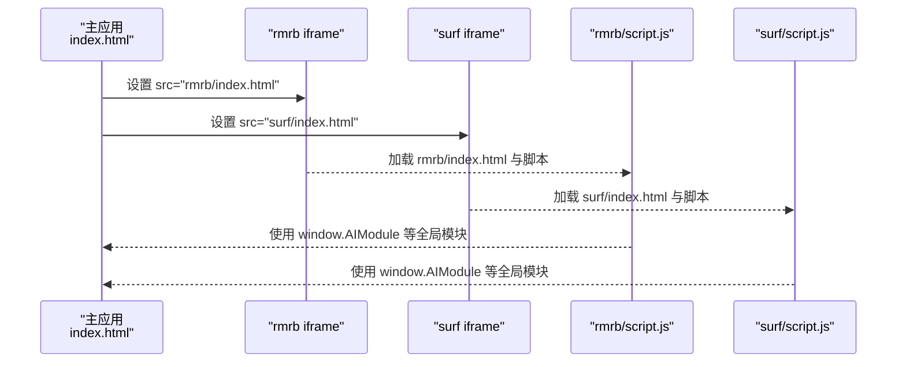
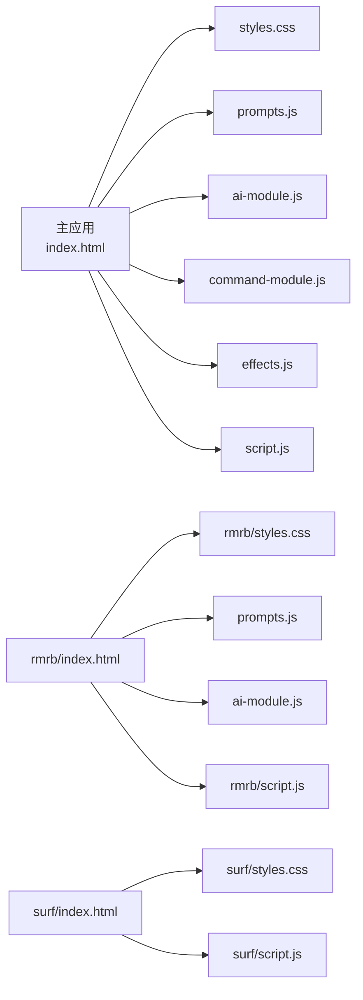

# HTML结构标准

<cite>
**本文引用的文件**
- [index.html](file://index.html)
- [script.js](file://script.js)
- [styles.css](file://styles.css)
- [rmrb/index.html](file://rmrb/index.html)
- [rmrb/script.js](file://rmrb/script.js)
- [rmrb/styles.css](file://rmrb/styles.css)
- [surf/index.html](file://surf/index.html)
- [surf/script.js](file://surf/script.js)
- [surf/styles.css](file://surf/styles.css)
- [README.md](file://README.md)
</cite>

## 目录
1. [引言](#引言)
2. [项目结构](#项目结构)
3. [核心组件](#核心组件)
4. [架构总览](#架构总览)
5. [详细组件分析](#详细组件分析)
6. [依赖关系分析](#依赖关系分析)
7. [性能考量](#性能考量)
8. [故障排查指南](#故障排查指南)
9. [结论](#结论)
10. [附录：模板示例与最佳实践](#附录模板示例与最佳实践)

## 引言
本文件定义本项目的HTML结构标准，确保所有页面遵循一致的语义化结构与无障碍访问规范。重点覆盖：
- 主页面 index.html 的单页应用（SPA）布局规范：header、main、footer 的职责与组织方式
- 侧边栏与底部标签栏的实现方式与交互约定
- 子页面 rmrb 与 surf 如何通过 iframe 集成外部内容，同时保持与主应用一致的导航体验
- HTML 语义化与无障碍访问要求：语义标签、表单 label 关联、键盘可达性、屏幕阅读器友好性
- 模板示例：如何创建新的功能页面，包含必要的 meta、CSS 链接与 JavaScript 模块加载

## 项目结构
本项目采用“主应用 + 子页面 iframe”的混合架构：
- 主应用位于根目录，负责全局布局、导航、状态管理与通用交互
- 子页面 rmrb 与 surf 作为独立页面，通过 iframe 嵌入到主应用的对应 tab 中
- 所有页面均遵循统一的语义化结构与无障碍访问标准

图表来源
- [index.html](file://index.html#L1-L485)
- [rmrb/index.html](file://rmrb/index.html#L1-L62)
- [surf/index.html](file://surf/index.html#L1-L54)
- [script.js](file://script.js#L1-L200)
- [styles.css](file://styles.css#L1-L120)

章节来源
- [index.html](file://index.html#L1-L485)
- [README.md](file://README.md#L90-L125)

## 核心组件
- 侧边栏抽屉：提供主应用的导航入口，包含多个导航项，支持打开/关闭与激活态切换
- 底部标签栏：移动端友好的导航，支持点击切换主应用 tab
- 主内容区：按 tab 切换显示不同功能模块（倒计时、日历、rmrb、surf、设置）
- 子页面 iframe：在 rmrb 与 surf tab 中以 iframe 方式加载对应子页面，保持与主应用一致的导航体验
- 通用交互：模态框、Toast 提示、表单校验、AI 功能集成等

章节来源
- [index.html](file://index.html#L13-L120)
- [index.html](file://index.html#L225-L480)
- [script.js](file://script.js#L230-L320)
- [script.js](file://script.js#L247-L287)

## 架构总览
主应用通过脚本初始化侧边栏、底部标签栏与各功能模块；rmrb 与 surf 通过 iframe 在主应用中呈现，二者各自维护独立的页面结构与交互。

图表来源
- [index.html](file://index.html#L225-L360)
- [script.js](file://script.js#L230-L320)
- [rmrb/index.html](file://rmrb/index.html#L1-L62)
- [surf/index.html](file://surf/index.html#L1-L54)

## 详细组件分析

### 主应用布局与导航
- header：包含标题、副标题、今日留言条、打卡按钮与当前时间显示
- main：包含多个 .tab-content，每个 tab 对应一个功能模块
- footer：移动端底部标签栏，支持点击切换 tab
- 侧边栏：移动端菜单抽屉，包含导航项与关闭按钮

图表来源
- [script.js](file://script.js#L230-L320)
- [index.html](file://index.html#L225-L480)

章节来源
- [index.html](file://index.html#L71-L120)
- [index.html](file://index.html#L225-L360)
- [index.html](file://index.html#L463-L480)
- [script.js](file://script.js#L230-L320)

### 侧边栏与底部标签栏
- 侧边栏：固定定位，支持打开/关闭与遮罩层；导航项带激活态
- 底部标签栏：移动端导航，点击切换 .tab-content
- 交互：点击导航项后更新激活态并切换 tab，同时关闭侧边栏

图表来源
- [index.html](file://index.html#L13-L46)
- [index.html](file://index.html#L225-L360)
- [script.js](file://script.js#L247-L287)
- [script.js](file://script.js#L230-L246)

章节来源
- [index.html](file://index.html#L13-L46)
- [index.html](file://index.html#L225-L360)
- [script.js](file://script.js#L230-L320)

### 子页面 iframe 集成
- rmrb 与 surf 通过 iframe 嵌入主应用的对应 tab
- 子页面各自维护独立的 head、body 与脚本，共享主应用样式
- 子页面通过 window.AIModule 等全局模块与主应用交互（如 AI 功能）

图表来源
- [index.html](file://index.html#L352-L358)
- [rmrb/index.html](file://rmrb/index.html#L1-L62)
- [surf/index.html](file://surf/index.html#L1-L54)
- [rmrb/script.js](file://rmrb/script.js#L469-L474)
- [surf/script.js](file://surf/script.js#L1-L23)

章节来源
- [index.html](file://index.html#L352-L358)
- [rmrb/index.html](file://rmrb/index.html#L1-L62)
- [surf/index.html](file://surf/index.html#L1-L54)
- [rmrb/script.js](file://rmrb/script.js#L469-L474)
- [surf/script.js](file://surf/script.js#L1-L23)

### 表单与无障碍访问
- 所有表单控件均配有 label，使用 for/id 关联，确保屏幕阅读器可正确读取
- 输入控件具备合理的类型与占位符，便于用户理解用途
- 模态框与对话框具备可访问性：焦点管理、Esc 关闭、背景遮罩

章节来源
- [index.html](file://index.html#L107-L110)
- [index.html](file://index.html#L190-L223)
- [index.html](file://index.html#L363-L413)
- [index.html](file://index.html#L414-L461)

## 依赖关系分析
- 主应用依赖：
  - 样式：styles.css（全局样式）
  - 脚本：prompts.js、ai-module.js、command-module.js、effects.js、script.js
- 子页面依赖：
  - rmrb：styles.css、prompts.js、ai-module.js、script.js
  - surf：styles.css、script.js

图表来源
- [index.html](file://index.html#L1-L12)
- [rmrb/index.html](file://rmrb/index.html#L1-L11)
- [surf/index.html](file://surf/index.html#L1-L9)
- [script.js](file://script.js#L1-L200)

章节来源
- [index.html](file://index.html#L1-L12)
- [rmrb/index.html](file://rmrb/index.html#L1-L11)
- [surf/index.html](file://surf/index.html#L1-L9)

## 性能考量
- 按需加载：主应用一次性加载全局脚本与样式，子页面按需通过 iframe 加载，避免重复资源
- 模态框与遮罩：仅在交互时显示，减少不必要的 DOM 层级
- 响应式设计：移动端底部导航与侧边栏优化触摸体验，降低点击误差
- 子页面加载：rmrb 与 surf 的 iframe 高度根据视口动态调整，保证内容完整显示

章节来源
- [styles.css](file://styles.css#L508-L527)
- [index.html](file://index.html#L352-L358)
- [README.md](file://README.md#L67-L71)

## 故障排查指南
- 侧边栏无法关闭或遮罩层不消失
  - 检查侧边栏与遮罩层的 open/show 类切换逻辑
  - 确认点击事件绑定与关闭函数调用
- 底部标签栏切换无效
  - 检查 .footer-tab 的点击事件与 switchTab 实现
  - 确认 .tab-content 的 active 切换
- 子页面 iframe 未显示或空白
  - 检查 iframe 的 src 是否正确指向子页面
  - 确认子页面脚本已加载并初始化
- 表单无法读取 label 或键盘不可用
  - 检查 for/id 是否匹配
  - 确保控件可聚焦，必要时添加 tabindex

章节来源
- [script.js](file://script.js#L230-L320)
- [script.js](file://script.js#L247-L287)
- [index.html](file://index.html#L352-L358)
- [rmrb/script.js](file://rmrb/script.js#L469-L474)
- [surf/script.js](file://surf/script.js#L1-L23)

## 结论
本项目的 HTML 结构标准围绕“语义化 + 无障碍 + 一致性”展开，主应用与子页面通过 iframe 协同工作，既保持了功能解耦，又提供了统一的导航体验。遵循本文档的规范，可确保新增页面与现有页面在结构、交互与可访问性方面保持一致。

## 附录：模板示例与最佳实践

### 创建新的功能页面模板
- 文件位置：在根目录新建功能目录（例如 myfeature），并在其中放置 index.html、script.js、styles.css
- index.html 建议包含：
  - 语义化结构：header、main、footer（或移动端底部导航）
  - 语义化标签：h1-h6、p、ul/li、table、form、label、input/select/textarea/button 等
  - 表单元素：每个 input/textarea/select 均有对应的 label，使用 for/id 关联
  - 无障碍属性：必要时添加 aria-* 属性、role、tabindex
- script.js：在 DOMContentLoaded 中初始化 UI 与事件
- styles.css：遵循全局样式命名规范，避免与主应用冲突

章节来源
- [index.html](file://index.html#L71-L120)
- [index.html](file://index.html#L225-L360)
- [index.html](file://index.html#L463-L480)
- [styles.css](file://styles.css#L1-L120)

### 语义化与无障碍访问清单
- 使用语义化标签：header、nav、main、section、article、aside、footer 等
- 表单：label for 与 input id 匹配；必填字段标注；错误提示清晰
- 可访问性：键盘可达、焦点可见、屏幕阅读器友好、对比度充足
- iframe：为 iframe 提供合适的标题（title 属性），便于屏幕阅读器识别

章节来源
- [index.html](file://index.html#L107-L110)
- [index.html](file://index.html#L190-L223)
- [index.html](file://index.html#L352-L358)