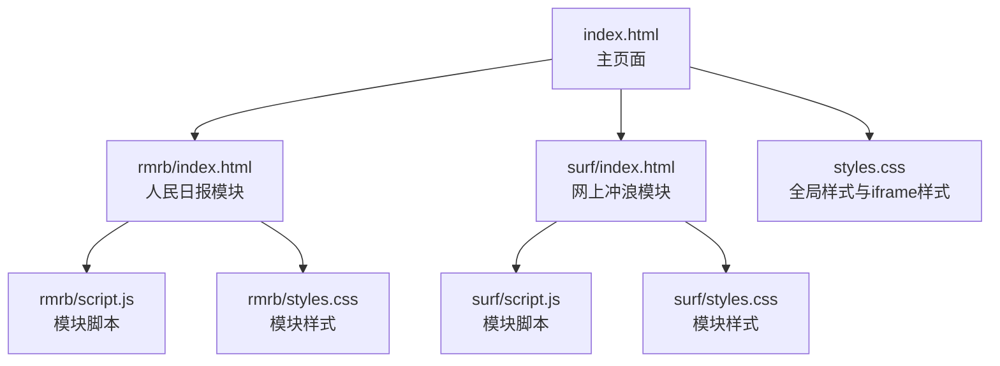
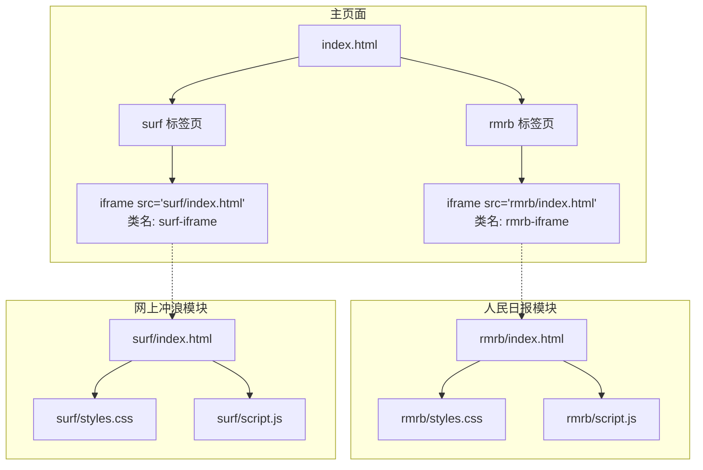
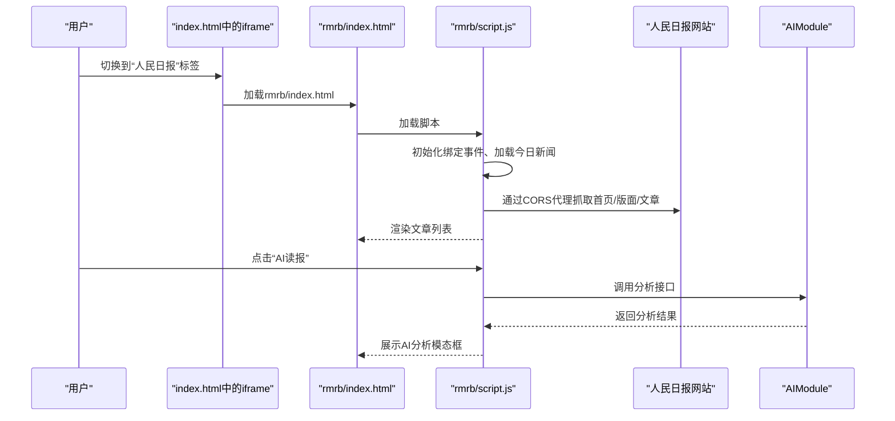
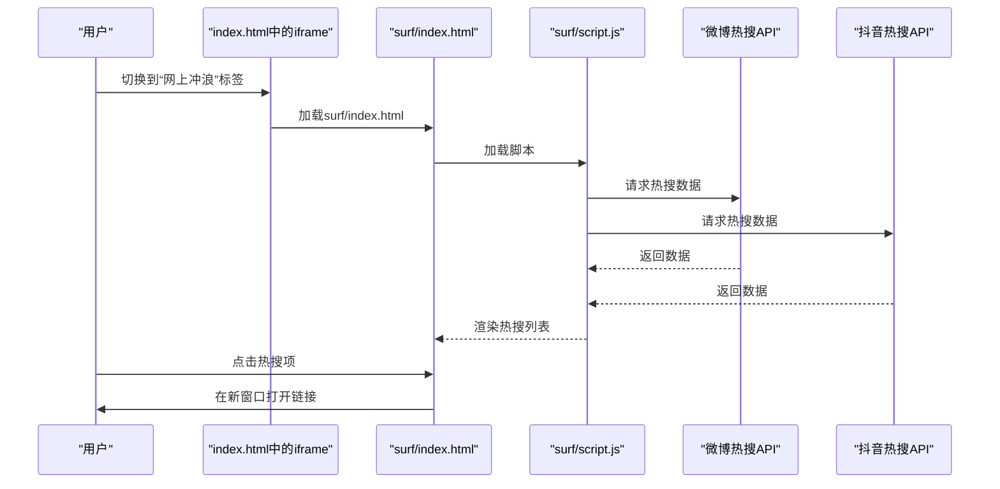
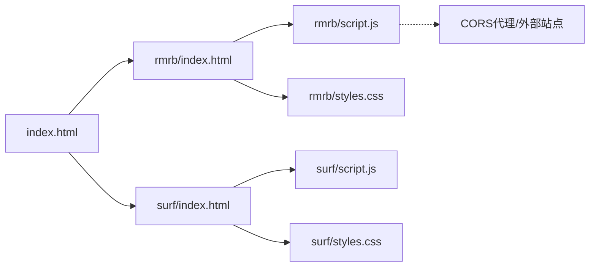

# Iframe内容集成模式

<cite>
**本文引用的文件**
- [index.html](file://index.html)
- [styles.css](file://styles.css)
- [rmrb/index.html](file://rmrb/index.html)
- [rmrb/script.js](file://rmrb/script.js)
- [rmrb/styles.css](file://rmrb/styles.css)
- [surf/index.html](file://surf/index.html)
- [surf/script.js](file://surf/script.js)
- [surf/styles.css](file://surf/styles.css)
- [docs/development_log.md](file://docs/development_log.md)
</cite>

## 目录
1. [引言](#引言)
2. [项目结构](#项目结构)
3. [核心组件](#核心组件)
4. [架构总览](#架构总览)
5. [详细组件分析](#详细组件分析)
6. [依赖关系分析](#依赖关系分析)
7. [性能考量](#性能考量)
8. [故障排查指南](#故障排查指南)
9. [结论](#结论)
10. [附录：新功能页面复用指南](#附录新功能页面复用指南)

## 引言
本文件围绕项目中通过 iframe 集成外部内容的技术实现方式进行深入解析，重点说明 index.html 如何通过 iframe 嵌入 rmrb 和 surf 子页面，实现功能模块的解耦与独立维护；阐述 iframe 的 src 属性使用相对路径的机制；分析 rmrb/index.html 与 surf/index.html 作为独立页面的结构完整性与资源加载；讨论 iframe 的安全性考虑（同源策略、sandbox 潜在应用）与性能影响（延迟加载策略），并给出在新功能页面中复用 iframe 集成模式的实践建议。

## 项目结构
- 主页面 index.html 负责整体布局与导航，其中通过两个 tab 容器分别挂载 rmrb 与 surf 的 iframe。
- rmrb 与 surf 各自为独立的功能模块，包含各自的 index.html、script.js、styles.css，形成可独立开发与部署的页面单元。
- styles.css 中定义了 rmrb-iframe 与 surf-iframe 的样式，用于控制嵌入内容的尺寸与外观。

图表来源
- [index.html](file://index.html#L352-L358)
- [styles.css](file://styles.css#L507-L526)
- [rmrb/index.html](file://rmrb/index.html#L1-L62)
- [surf/index.html](file://surf/index.html#L1-L54)

章节来源
- [index.html](file://index.html#L352-L358)
- [styles.css](file://styles.css#L507-L526)

## 核心组件
- 主页面 iframe 容器
  - 在 index.html 中，id 为 rmrb 与 surf 的 tab 容器内分别放置一个 iframe，src 指向 rmrb/index.html 与 surf/index.html，并分别赋予 rmrb-iframe 与 surf-iframe 类名，以便统一控制尺寸与外观。
- 模块化子页面
  - rmrb/index.html 与 surf/index.html 均为独立页面，包含各自所需的 head 资源（CSS/JS）与主体结构，确保在 iframe 中运行时具备完整功能。
- 样式控制
  - styles.css 中定义了 rmrb-iframe 与 surf-iframe 的宽度、高度、最小高度、边框、圆角与背景，使嵌入内容在主页面布局中呈现一致的视觉效果。

章节来源
- [index.html](file://index.html#L352-L358)
- [styles.css](file://styles.css#L507-L526)
- [rmrb/index.html](file://rmrb/index.html#L1-L62)
- [surf/index.html](file://surf/index.html#L1-L54)

## 架构总览
下图展示了主页面与两个 iframe 子模块之间的关系与数据/资源流向。

图表来源
- [index.html](file://index.html#L352-L358)
- [styles.css](file://styles.css#L507-L526)
- [rmrb/index.html](file://rmrb/index.html#L1-L62)
- [surf/index.html](file://surf/index.html#L1-L54)

## 详细组件分析

### 主页面 iframe 容器与样式控制
- 容器与 src 指向
  - index.html 中通过两个 tab 容器分别挂载 iframe，并将 src 设置为相对路径 rmrb/index.html 与 surf/index.html，从而在不改变主页面结构的情况下，将子模块以独立页面的形式嵌入。
- 样式类名
  - styles.css 中为 rmrb-iframe 与 surf-iframe 定义了统一的尺寸与外观规则，确保在不同屏幕尺寸下均能良好显示。

章节来源
- [index.html](file://index.html#L352-L358)
- [styles.css](file://styles.css#L507-L526)

### 人民日报模块（rmrb）
- 页面结构完整性
  - rmrb/index.html 包含完整的 head（引入全局与模块样式、模块脚本），以及 header、main、模态框等结构，确保在 iframe 中运行时具备独立功能。
- 资源加载
  - head 中同时引入 ../styles.css 与 ./styles.css，保证与主页面主题一致的同时，模块自身样式也能生效。
- 脚本职责
  - rmrb/script.js 负责：
    - 使用 CORS 代理抓取人民日报网站内容，解析版面与文章列表；
    - 提供文章内容读取与模态展示；
    - 提供 AI 读报分析流程（调用 AIModule）。
- 安全与跨域
  - 通过 CORS 代理解决跨域限制，避免直接访问外部站点带来的同源策略问题。

图表来源
- [index.html](file://index.html#L352-L358)
- [rmrb/index.html](file://rmrb/index.html#L1-L62)
- [rmrb/script.js](file://rmrb/script.js#L1-L120)
- [rmrb/script.js](file://rmrb/script.js#L135-L150)
- [rmrb/script.js](file://rmrb/script.js#L358-L418)

章节来源
- [rmrb/index.html](file://rmrb/index.html#L1-L62)
- [rmrb/script.js](file://rmrb/script.js#L1-L120)
- [rmrb/script.js](file://rmrb/script.js#L135-L150)
- [rmrb/script.js](file://rmrb/script.js#L358-L418)

### 网上冲浪模块（surf）
- 页面结构完整性
  - surf/index.html 同样包含完整的 head 与主体结构，分别引入 ../styles.css 与 ./styles.css，确保在 iframe 中运行时具备独立功能。
- 脚本职责
  - surf/script.js 负责：
    - 通过第三方 API 获取微博热搜与抖音热搜；
    - 渲染热搜列表，支持点击跳转；
    - 提供加载动画与错误提示。

图表来源
- [index.html](file://index.html#L356-L358)
- [surf/index.html](file://surf/index.html#L1-L54)
- [surf/script.js](file://surf/script.js#L1-L120)

章节来源
- [surf/index.html](file://surf/index.html#L1-L54)
- [surf/script.js](file://surf/script.js#L1-L120)

### iframe 的 src 属性与相对路径机制
- src 使用相对路径
  - index.html 中的 iframe src 分别为 rmrb/index.html 与 surf/index.html，表示相对于主页面所在目录的相对路径。浏览器会基于当前页面的基地址解析该相对路径，从而加载对应模块的 index.html。
- 优势
  - 无需关心部署后的绝对路径，便于本地开发与生产部署的一致性。
  - 与主页面同源（或同源策略允许的跨域）时，iframe 内容可正常加载。

章节来源
- [index.html](file://index.html#L352-L358)

### CSS 样式对嵌入内容的控制
- rmrb-iframe 与 surf-iframe 类
  - styles.css 中为两类 iframe 定义了统一的宽度、高度、最小高度、边框、圆角与背景，确保在主页面布局中呈现一致的视觉效果与留白。
- 模块样式与全局样式的配合
  - 子页面通过引入 ../styles.css 与 ./styles.css，既继承主页面主题变量与通用样式，又保留模块自身的样式细节，避免相互干扰。

章节来源
- [styles.css](file://styles.css#L507-L526)
- [rmrb/index.html](file://rmrb/index.html#L1-L12)
- [surf/index.html](file://surf/index.html#L1-L10)

### 安全性考虑（同源策略与 sandbox）
- 同源策略
  - 若主页面与 iframe 内容位于同一域名或允许的跨域范围内，iframe 可正常加载。若跨域，需依赖 CORS 代理或服务端设置合适的跨域头。
  - 人民日报模块通过 CORS 代理抓取外部站点内容，避免直接跨域访问带来的限制。
- sandbox 属性
  - 在需要进一步限制 iframe 权限时，可在 iframe 上添加 sandbox 属性，以限制脚本执行、表单提交、弹窗等行为。但需注意：sandbox 会显著限制 iframe 的可用性，因此应结合具体需求谨慎使用。
- 内容安全策略（CSP）
  - 对于外部 API 或第三方资源，建议在服务端配置 CSP，限制可加载的来源，降低 XSS 与注入风险。

章节来源
- [rmrb/script.js](file://rmrb/script.js#L1-L20)
- [surf/script.js](file://surf/script.js#L1-L20)

### 性能影响与延迟加载策略
- iframe 加载时机
  - 当前实现中，iframe 在标签切换时才加载对应模块页面。若希望进一步优化首屏性能，可考虑延迟加载策略：仅在用户实际切换到对应标签时才创建 iframe 并设置 src，避免不必要的网络请求。
- 资源体积与并发
  - 模块脚本与样式体积较大时，建议启用压缩与缓存策略；同时避免在同一时间加载多个 iframe，以免造成网络拥塞。
- 交互反馈
  - 在 iframe 加载过程中提供加载指示（如骨架屏或进度条），改善用户体验。

章节来源
- [index.html](file://index.html#L352-L358)

## 依赖关系分析
- 主页面对子模块的依赖
  - index.html 通过 iframe 依赖 rmrb/index.html 与 surf/index.html 的存在与可访问性。
- 子模块内部依赖
  - rmrb/index.html 依赖 rmrb/script.js 与 rmrb/styles.css；surf/index.html 依赖 surf/script.js 与 surf/styles.css。
- 跨域与代理
  - rmrb/script.js 通过 CORS 代理访问外部站点，避免同源策略限制。

图表来源
- [index.html](file://index.html#L352-L358)
- [rmrb/index.html](file://rmrb/index.html#L1-L62)
- [surf/index.html](file://surf/index.html#L1-L54)
- [rmrb/script.js](file://rmrb/script.js#L1-L20)
- [surf/script.js](file://surf/script.js#L1-L20)

章节来源
- [index.html](file://index.html#L352-L358)
- [rmrb/index.html](file://rmrb/index.html#L1-L62)
- [surf/index.html](file://surf/index.html#L1-L54)
- [rmrb/script.js](file://rmrb/script.js#L1-L20)
- [surf/script.js](file://surf/script.js#L1-L20)

## 性能考量
- 首屏优化
  - 仅在用户切换到对应标签时创建 iframe，减少初始加载压力。
- 缓存与压缩
  - 对样式与脚本启用缓存与压缩，降低重复加载成本。
- 并发控制
  - 控制同时加载的 iframe 数量，避免网络拥塞。
- 交互反馈
  - 在 iframe 加载期间提供加载指示，提升感知速度。

[本节为通用性能建议，不直接分析具体文件]

## 故障排查指南
- iframe 无法显示内容
  - 检查 src 是否为正确的相对路径，确认 rmrb/index.html 与 surf/index.html 可被主页面访问。
  - 确认网络连通性与 CORS 代理是否可用（针对 rmrb 模块）。
- 样式错乱
  - 检查 rmrb-iframe 与 surf-iframe 的样式类是否正确应用，确认 ../styles.css 与 ./styles.css 的引入顺序与路径。
- 功能异常（如热搜无法加载）
  - 检查 surf/script.js 的 API 请求是否返回有效数据，关注错误提示与加载动画状态。
- 跨域与安全策略
  - 若出现跨域错误，确认 CORS 代理配置或服务端跨域头设置；必要时评估 sandbox 属性对功能的影响。

章节来源
- [index.html](file://index.html#L352-L358)
- [styles.css](file://styles.css#L507-L526)
- [rmrb/script.js](file://rmrb/script.js#L135-L150)
- [surf/script.js](file://surf/script.js#L1-L120)

## 结论
通过在 index.html 中使用 iframe 嵌入 rmrb 与 surf 子页面，项目实现了功能模块的解耦与独立维护。src 使用相对路径，配合 styles.css 中的 rmrb-iframe 与 surf-iframe 样式，确保嵌入内容在主页面中具有一致的显示效果。子模块各自包含完整的页面结构与资源，既能独立运行，又能无缝融入主页面。在安全性方面，通过 CORS 代理规避跨域限制；在性能方面，可通过延迟加载与缓存策略进一步优化。对于新功能页面，建议遵循现有模式：独立目录、独立 index.html、独立脚本与样式，并在主页面中以 iframe 形式按需加载。

[本节为总结性内容，不直接分析具体文件]

## 附录：新功能页面复用指南
- 目录与文件组织
  - 在根目录新建功能目录（如 featureA），包含 index.html、script.js、styles.css。
- 页面结构
  - 在 index.html 的 head 中引入 ../styles.css 与 ./styles.css，确保与主页面主题一致。
- 主页面集成
  - 在 index.html 中新增对应的 tab 容器与 iframe，src 指向 featureA/index.html，并赋予统一的样式类名（如 featureA-iframe）。
- 样式规范
  - 在 styles.css 中为 featureA-iframe 定义宽度、高度、最小高度、边框、圆角与背景，确保显示效果一致。
- 脚本与资源
  - 在 featureA/script.js 中实现功能逻辑，避免与主页面脚本耦合；如需调用主页面能力，通过 window 对象暴露接口。
- 安全与性能
  - 若涉及外部资源，优先使用 CORS 代理或服务端跨域配置；对新功能采用延迟加载策略，减少首屏负担。
- 参考文档
  - 开发日志中记录了 rmrb 与 surf 的模块化实现思路，可作为新功能页面的参考模板。

章节来源
- [docs/development_log.md](file://docs/development_log.md#L460-L470)
- [docs/development_log.md](file://docs/development_log.md#L610-L620)
- [index.html](file://index.html#L352-L358)
- [styles.css](file://styles.css#L507-L526)
- [rmrb/index.html](file://rmrb/index.html#L1-L12)
- [surf/index.html](file://surf/index.html#L1-L10)