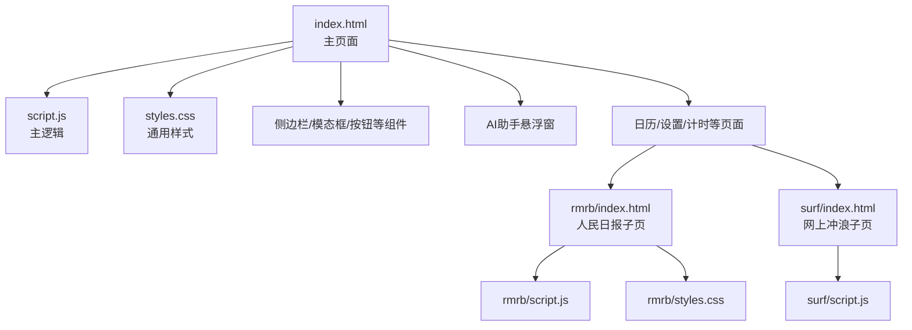
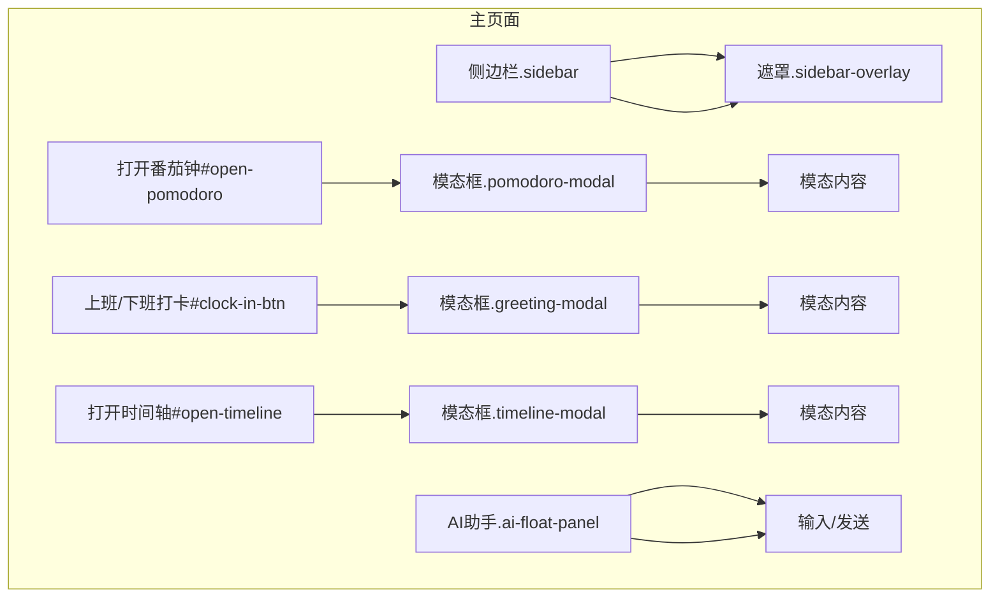
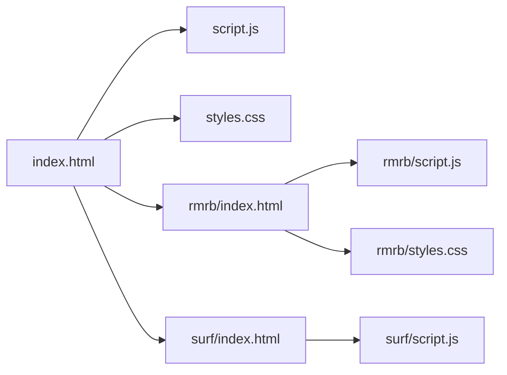

# 无障碍访问合规性

<cite>
**本文引用的文件**
- [index.html](file://index.html)
- [script.js](file://script.js)
- [styles.css](file://styles.css)
- [rmrb/index.html](file://rmrb/index.html)
- [rmrb/script.js](file://rmrb/script.js)
- [rmrb/styles.css](file://rmrb/styles.css)
- [surf/index.html](file://surf/index.html)
- [surf/script.js](file://surf/script.js)
- [README.md](file://README.md)
</cite>

## 目录
1. [引言](#引言)
2. [项目结构](#项目结构)
3. [核心组件](#核心组件)
4. [架构总览](#架构总览)
5. [详细组件分析](#详细组件分析)
6. [依赖分析](#依赖分析)
7. [性能考虑](#性能考虑)
8. [故障排查指南](#故障排查指南)
9. [结论](#结论)
10. [附录](#附录)

## 引言
本文件系统性梳理本项目在无障碍访问（Accessibility，简称A11y）方面的设计与实现，面向所有用户（含残障人士）确保可用性与可访问性。重点覆盖以下方面：
- 表单元素的标签关联（label for/id），提升屏幕阅读器可读性
- 按钮语义化与可访问名称（accessible name）设计
- ARIA属性在复杂组件（侧边栏、模态框）中的应用建议
- 键盘导航与可聚焦性（focusable）实现
- 无障碍测试方法与工具建议

## 项目结构
项目采用多页面结构，主页面负责全局导航、侧边栏、模态框、打卡与AI助手等核心功能；子模块（人民日报、网上冲浪）作为独立页面集成到主应用中。

图表来源
- [index.html](file://index.html#L1-L120)
- [script.js](file://script.js#L90-L170)
- [styles.css](file://styles.css#L32-L120)
- [rmrb/index.html](file://rmrb/index.html#L1-L62)
- [surf/index.html](file://surf/index.html#L1-L54)

章节来源
- [index.html](file://index.html#L1-L120)
- [README.md](file://README.md#L90-L125)

## 核心组件
- 侧边栏抽屉与遮罩层：通过类名控制显隐，配合关闭按钮与遮罩点击关闭
- 模态框：包含番茄钟、打卡问候、时间轴等，均支持点击遮罩关闭
- AI助手悬浮窗：支持展开/收起、输入框回车提交
- 表单与输入控件：大量使用label for与input id关联，部分表单包含select与number/time输入
- 键盘导航：按钮与可交互元素具备可聚焦性，支持键盘操作

章节来源
- [index.html](file://index.html#L13-L121)
- [script.js](file://script.js#L247-L354)
- [script.js](file://script.js#L922-L1030)
- [styles.css](file://styles.css#L320-L360)

## 架构总览
下图展示主页面关键交互组件与脚本的关系，体现可访问性相关的结构与行为。

图表来源
- [index.html](file://index.html#L68-L121)
- [index.html](file://index.html#L122-L223)
- [index.html](file://index.html#L224-L396)
- [script.js](file://script.js#L294-L354)
- [script.js](file://script.js#L493-L732)
- [script.js](file://script.js#L922-L1030)

## 详细组件分析

### 表单元素与标签关联（label for/id）
- 设计原则：每个表单控件（input、select、textarea）均配套label，并通过for与控件id建立绑定，确保屏幕阅读器能正确朗读字段名称
- 实现位置：
  - 首次设置弹窗：label for 与 input id 完整匹配，涵盖时间、数值、选择框
  - 设置页：与首次设置一致的标签关联策略
  - 日历事件添加：label for 与 input/select/textarea id 匹配
- 关键要点：
  - 使用for与id精确对应，避免仅依赖视觉相邻
  - 文本标签清晰表达用途（例如“上班时间”、“发薪日类型”等）
  - 数字/时间输入提供min/max/step与占位符，提升可理解性

章节来源
- [index.html](file://index.html#L190-L223)
- [index.html](file://index.html#L360-L428)
- [index.html](file://index.html#L320-L348)
- [styles.css](file://styles.css#L717-L769)

### 按钮语义化与可访问名称
- 按钮语义化：
  - 使用语义化按钮（button）承载交互动作，如“打开番茄钟”、“打开时间轴”、“保存设置”、“发送”等
  - 可访问名称（accessible name）来源于按钮文本或可替代内容，确保屏幕阅读器可读
- 示例位置：
  - 快捷功能按钮：打开番茄钟、打开时间轴
  - 模态框关闭按钮：×符号按钮，具备可聚焦性
  - AI助手发送按钮：文本“发送”
  - 首次设置/更新设置按钮：文本明确表达操作意图
- 键盘可达性：
  - 所有按钮具备可聚焦性，支持Tab/Shift+Tab导航
  - Enter激活按钮，Space在某些情况下也可触发（取决于浏览器与平台）

章节来源
- [index.html](file://index.html#L270-L285)
- [index.html](file://index.html#L271-L280)
- [index.html](file://index.html#L61-L66)
- [index.html](file://index.html#L106-L111)
- [index.html](file://index.html#L210-L223)
- [script.js](file://script.js#L922-L1030)

### ARIA属性与复杂组件
- 角色与状态建议（基于现有结构的改进建议）：
  - 侧边栏抽屉：可增加role="dialog"与aria-modal="true"，并在打开时将焦点移至侧边栏首个可聚焦元素
  - 模态框：建议为模态容器添加role="dialog"与aria-modal="true"，同时在打开时将焦点置于模态内首个可聚焦元素
  - 遮罩层：建议添加aria-hidden="true"以隐藏背景内容，避免辅助技术读取
  - AI助手面板：建议在展开时设置aria-expanded="true/false"，并为输入框设置aria-label或aria-describedby
- 注意事项：
  - 以上为可访问性改进建议，当前HTML结构未包含上述ARIA属性
  - 在新增ARIA属性时，需同步维护JavaScript对焦点管理与状态切换的逻辑

章节来源
- [index.html](file://index.html#L13-L46)
- [index.html](file://index.html#L90-L121)
- [index.html](file://index.html#L122-L184)
- [index.html](file://index.html#L185-L223)
- [index.html](file://index.html#L48-L66)

### 键盘导航与可聚焦性
- 侧边栏导航菜单：导航项为可聚焦元素，支持键盘选择与激活
- 模态框：点击遮罩关闭，同时建议在打开时将焦点置于模态内首个可聚焦元素，Tab循环限制在模态内
- AI助手：输入框支持回车提交，按钮具备可聚焦性
- 日历与事件：日历单元格具备点击交互，建议为可点击日历项提供键盘操作（如Arrow键移动、Enter激活）

章节来源
- [script.js](file://script.js#L247-L354)
- [script.js](file://script.js#L922-L1030)
- [index.html](file://index.html#L290-L317)
- [index.html](file://index.html#L320-L348)

### 时间输入控件与标签关联（实践案例）
- 在“番茄钟”设置中，存在“自定义时长（分钟）”的label与input关联，确保屏幕阅读器可读取控件名称
- 在“首次设置/设置页”中，时间输入（time）与label也通过for/id关联，便于读屏器识别

章节来源
- [index.html](file://index.html#L106-L111)
- [index.html](file://index.html#L190-L207)
- [index.html](file://index.html#L360-L378)

### 人民日报与网上冲浪子页的无障碍要点
- 人民日报子页：
  - 使用语义化标题与按钮，具备刷新、AI分析等功能
  - 模态框用于文章详情与AI分析，建议在打开时设置aria-modal与焦点管理
- 网上冲浪子页：
  - 列表项具备点击跳转能力，建议为可点击项提供可访问名称或aria-label
  - 刷新按钮具备可聚焦性，支持键盘操作

章节来源
- [rmrb/index.html](file://rmrb/index.html#L1-L62)
- [rmrb/script.js](file://rmrb/script.js#L288-L356)
- [rmrb/script.js](file://rmrb/script.js#L358-L418)
- [rmrb/styles.css](file://rmrb/styles.css#L175-L246)
- [surf/index.html](file://surf/index.html#L1-L54)
- [surf/script.js](file://surf/script.js#L1-L100)

## 依赖分析
- 主页面依赖：
  - index.html：定义组件结构（侧边栏、模态框、按钮、表单）
  - script.js：负责组件初始化、事件绑定、焦点管理与状态切换
  - styles.css：提供组件样式与可聚焦态视觉反馈
- 子模块依赖：
  - rmrb/index.html：集成到主页面的子页，包含独立脚本与样式
  - surf/index.html：集成到主页面的子页，包含独立脚本与样式

图表来源
- [index.html](file://index.html#L1-L120)
- [script.js](file://script.js#L90-L170)
- [styles.css](file://styles.css#L32-L120)
- [rmrb/index.html](file://rmrb/index.html#L1-L62)
- [surf/index.html](file://surf/index.html#L1-L54)

章节来源
- [index.html](file://index.html#L1-L120)
- [script.js](file://script.js#L90-L170)
- [styles.css](file://styles.css#L32-L120)
- [rmrb/index.html](file://rmrb/index.html#L1-L62)
- [surf/index.html](file://surf/index.html#L1-L54)

## 性能考虑
- 模态框与侧边栏的显隐切换涉及DOM操作与样式类切换，建议：
  - 控制动画时长与过渡，避免阻塞主线程
  - 在打开时延迟焦点管理，确保动画完成后再转移焦点
- 日历渲染与列表加载：
  - 使用虚拟滚动或分页策略，减少一次性渲染量
  - 缓存API响应，降低重复请求频率

## 故障排查指南
- 表单标签未正确关联：
  - 症状：屏幕阅读器无法读取字段名称
  - 处理：检查label的for与对应input/select的id是否一致
- 模态框无法通过键盘关闭：
  - 症状：Tab无法聚焦到模态内元素，Esc无效
  - 处理：在打开时将焦点置于模态内首个可聚焦元素；监听Esc键关闭模态
- 侧边栏无法通过键盘操作：
  - 症状：Tab无法聚焦到导航项
  - 处理：为导航项添加tabindex或使用可聚焦元素（如a/button）
- AI助手输入无法回车提交：
  - 症状：输入框无法通过Enter提交
  - 处理：确认keypress事件绑定与事件对象的key值判断

章节来源
- [script.js](file://script.js#L922-L1030)
- [script.js](file://script.js#L247-L354)
- [index.html](file://index.html#L90-L121)

## 结论
本项目在表单标签关联与按钮语义化方面已有良好基础，能够满足基本的无障碍需求。为进一步提升可访问性，建议：
- 为复杂组件（侧边栏、模态框、AI面板）补充ARIA属性与焦点管理
- 强化键盘导航与可聚焦性，确保所有交互可通过键盘完成
- 建立自动化与人工结合的无障碍测试流程，持续改进

## 附录

### 无障碍测试方法与工具建议
- 自动化测试：
  - 使用axe-core或Lighthouse进行可访问性扫描
  - 在CI中集成可访问性检查任务
- 人工测试：
  - 使用屏幕阅读器（如NVDA、JAWS、VoiceOver）进行端到端测试
  - 使用键盘完成所有关键路径操作（Tab/Shift+Tab、Enter、Esc）
- 常用工具：
  - axe DevTools浏览器扩展
  - WAVE Web Accessibility Evaluation Tool
  - Lighthouse（Chrome DevTools）