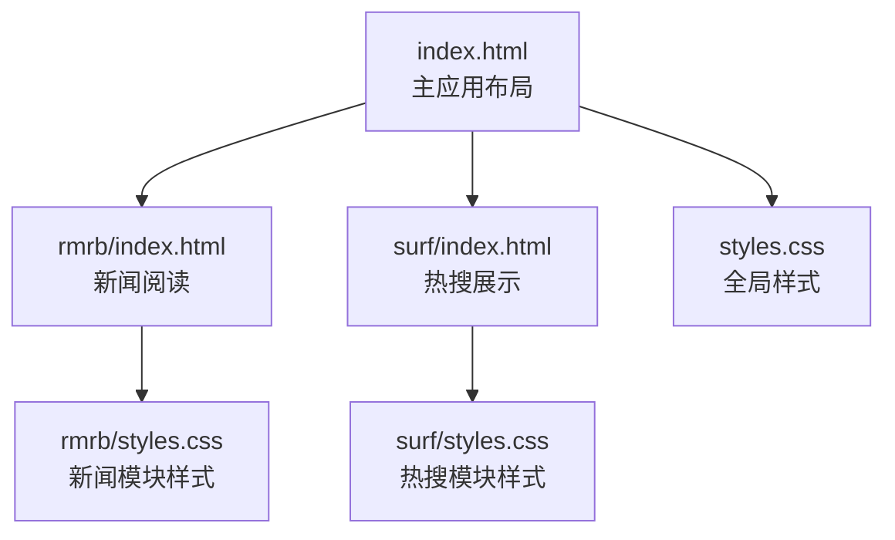
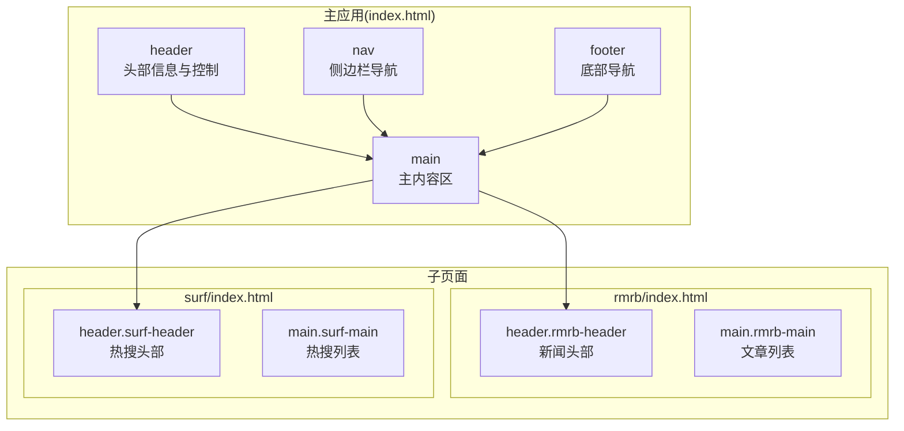
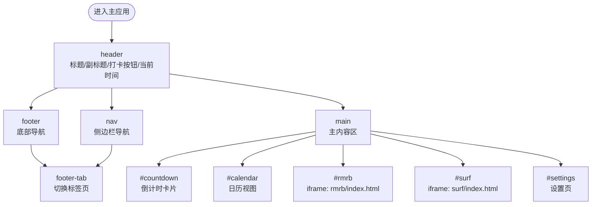
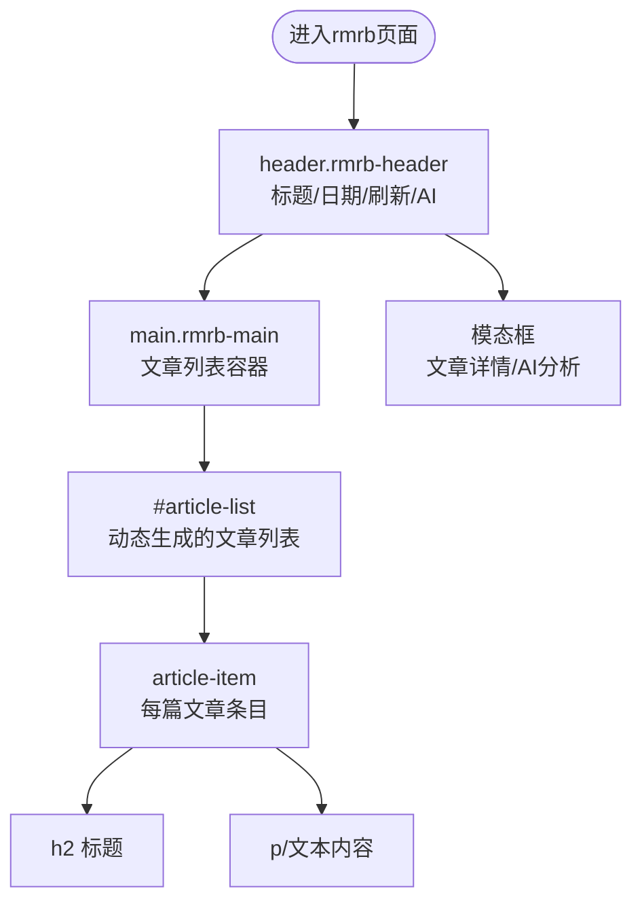
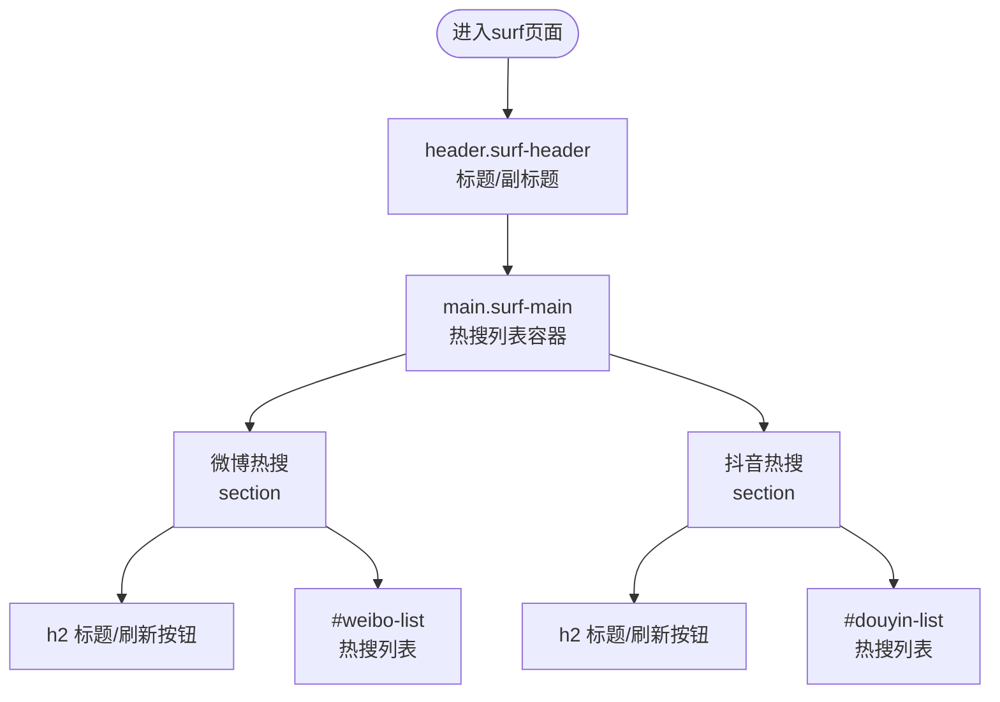
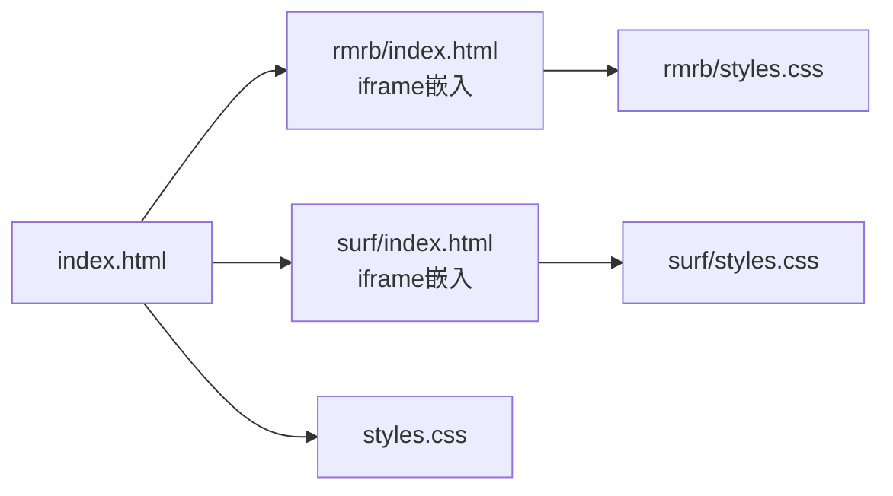

# 语义化HTML结构

<cite>
**本文引用的文件**
- [index.html](file://index.html)
- [rmrb/index.html](file://rmrb/index.html)
- [surf/index.html](file://surf/index.html)
- [styles.css](file://styles.css)
- [rmrb/styles.css](file://rmrb/styles.css)
- [surf/styles.css](file://surf/styles.css)
- [README.md](file://README.md)
</cite>

## 目录
1. [引言](#引言)
2. [项目结构](#项目结构)
3. [核心组件](#核心组件)
4. [架构总览](#架构总览)
5. [详细组件分析](#详细组件分析)
6. [依赖关系分析](#依赖关系分析)
7. [性能考量](#性能考量)
8. [故障排查指南](#故障排查指南)
9. [结论](#结论)
10. [附录](#附录)

## 引言
本文件聚焦于项目中语义化HTML标签的使用与实践，围绕主应用与两个子页面（人民日报、网上冲浪）的结构展开，系统阐述header、main、footer、nav、section、article等元素的合理应用，解释如何通过语义化结构提升可访问性与SEO，并给出最佳实践建议，避免滥用div标签，推荐使用恰当的HTML5语义元素来表达内容意图。

## 项目结构
项目采用多页面结构：
- 主应用页面：index.html，负责整体布局与导航
- 子页面：
  - rmrb/index.html：用于阅读新闻
  - surf/index.html：用于展示热搜

图表来源
- [index.html](file://index.html#L1-L485)
- [rmrb/index.html](file://rmrb/index.html#L1-L62)
- [surf/index.html](file://surf/index.html#L1-L54)
- [styles.css](file://styles.css#L1-L200)
- [rmrb/styles.css](file://rmrb/styles.css#L1-L200)
- [surf/styles.css](file://surf/styles.css#L1-L200)

章节来源
- [index.html](file://index.html#L1-L485)
- [rmrb/index.html](file://rmrb/index.html#L1-L62)
- [surf/index.html](file://surf/index.html#L1-L54)

## 核心组件
- header：承载应用头部信息，包含标题、副标题、打卡按钮、当前时间等
- nav：侧边栏导航，提供多标签页入口
- main：主内容区，承载倒计时、日历、设置、iframe嵌套的子页面等
- footer：移动端底部导航，提供快速切换
- section/article：在子页面中用于组织文章列表与内容区块

章节来源
- [index.html](file://index.html#L71-L480)
- [rmrb/index.html](file://rmrb/index.html#L12-L58)
- [surf/index.html](file://surf/index.html#L10-L50)

## 架构总览
下图展示了主应用与子页面的语义化布局关系，以及关键语义元素的分布与职责。

图表来源
- [index.html](file://index.html#L71-L480)
- [rmrb/index.html](file://rmrb/index.html#L12-L58)
- [surf/index.html](file://surf/index.html#L10-L50)

## 详细组件分析

### 主应用语义化布局（index.html）
- header
  - 作用：集中展示应用标题、副标题、今日留言横幅、打卡按钮与当前时间，形成页面头部信息中枢
  - 语义要点：使用header作为页面头部容器；内部通过语义化的h1、p、button等元素组织信息层级
  - 可访问性：通过语义层级与按钮角色，使屏幕阅读器能正确识别头部内容与交互控件
- nav
  - 作用：侧边栏导航，提供倒计时、日历、人民日报、网上冲浪、设置等入口
  - 语义要点：使用nav包裹导航项，配合a元素与data-tab属性实现标签页切换
  - 可访问性：nav语义明确，便于键盘导航与屏幕阅读器识别
- main
  - 作用：承载多标签页内容区域，包含倒计时卡片、日历、iframe嵌套的子页面、设置等
  - 语义要点：使用main作为页面主体内容容器；子内容通过id标识的tab-content进行组织
  - 可访问性：main语义明确，有助于跳转至页面主体内容
- footer
  - 作用：移动端底部导航，提供快速切换到各标签页
  - 语义要点：使用footer作为页脚容器；footer-tab通过data-tab属性与主内容联动
  - 可访问性：footer语义明确，底部导航对移动用户友好

图表来源
- [index.html](file://index.html#L71-L480)

章节来源
- [index.html](file://index.html#L71-L480)

### 人民日报子页面（rmrb/index.html）
- header.rmrb-header
  - 作用：展示“人民日报”标题与日期选择、刷新、AI读报等控制
  - 语义要点：使用header作为模块头部；h1作为模块标题；controls区域包含交互控件
- main.rmrb-main
  - 作用：承载文章列表容器，作为模块主体内容
  - 语义要点：使用main作为模块主体；article列表通过动态生成的列表项组织
- section/article
  - 作用：在文章列表中，每个条目可视为一个article，标题为h2，内容为p或div
  - 语义要点：article语义明确，利于搜索引擎抓取与屏幕阅读器解析
- 模态框
  - 作用：文章详情与AI分析对话框
  - 语义要点：使用div容器承载模态框，内部通过h2作为模态标题，button作为关闭控件

图表来源
- [rmrb/index.html](file://rmrb/index.html#L12-L58)
- [rmrb/styles.css](file://rmrb/styles.css#L116-L200)

章节来源
- [rmrb/index.html](file://rmrb/index.html#L12-L58)
- [rmrb/styles.css](file://rmrb/styles.css#L1-L200)

### 网上冲浪子页面（surf/index.html）
- header.surf-header
  - 作用：展示“网上冲浪”标题与副标题
  - 语义要点：使用header作为模块头部；h1作为模块标题；p作为副标题
- main.surf-main
  - 作用：承载两大热搜榜单区域（微博热搜、抖音热搜）
  - 语义要点：使用main作为模块主体；通过.grid布局组织两列榜单
- section
  - 作用：每个热搜榜单作为一个section，包含标题、刷新按钮与列表
  - 语义要点：使用section组织内容区块；h2作为榜单标题；按钮作为交互控件
- article
  - 作用：热搜条目可视为article，包含排名与内容
  - 语义要点：article语义明确，利于搜索引擎抓取与屏幕阅读器解析

图表来源
- [surf/index.html](file://surf/index.html#L10-L50)
- [surf/styles.css](file://surf/styles.css#L33-L200)

章节来源
- [surf/index.html](file://surf/index.html#L10-L50)
- [surf/styles.css](file://surf/styles.css#L1-L200)

## 依赖关系分析
- 主应用与子页面的耦合
  - 主应用通过iframe嵌入子页面，实现模块化隔离与复用
  - 主应用的header、nav、footer与子页面的header、main形成互补的语义结构
- 样式依赖
  - 子页面共享主样式与自身模块样式，确保视觉一致性与语义结构的一致性
- 可访问性依赖
  - 语义元素的正确使用是可访问性的基础；主应用与子页面均遵循HTML5语义规范

图表来源
- [index.html](file://index.html#L352-L358)
- [rmrb/index.html](file://rmrb/index.html#L12-L18)
- [surf/index.html](file://surf/index.html#L10-L16)
- [styles.css](file://styles.css#L1-L200)
- [rmrb/styles.css](file://rmrb/styles.css#L1-L200)
- [surf/styles.css](file://surf/styles.css#L1-L200)

章节来源
- [index.html](file://index.html#L352-L358)
- [rmrb/index.html](file://rmrb/index.html#L12-L18)
- [surf/index.html](file://surf/index.html#L10-L16)

## 性能考量
- 语义化结构对性能的影响
  - 使用语义元素有助于浏览器与辅助技术更高效地解析DOM，减少不必要的遍历与处理
  - 合理的结构层次可降低复杂度，提升渲染与交互性能
- 代码层面的优化建议
  - 避免过度嵌套div，优先使用语义元素表达意图
  - 将动态生成的内容放入main或section中，便于维护与SEO
  - 控制iframe数量与大小，避免阻塞主页面渲染

## 故障排查指南
- 常见问题
  - 语义元素缺失：检查是否遗漏header、main、nav、footer等关键元素
  - 交互控件不可访问：确认按钮、链接等控件具备可访问的role与label
  - 模态框无标题：为模态框提供h2标题，便于屏幕阅读器识别
- 排查步骤
  - 使用浏览器开发者工具检查DOM结构，确认语义元素层级正确
  - 使用屏幕阅读器或无障碍检测工具验证可访问性
  - 对照子页面header/main结构，确保与主应用header/nav/footer一致

## 结论
本项目在主应用与子页面中广泛采用了HTML5语义化元素，形成了清晰的信息层级与良好的可访问性基础。header、main、nav、footer、section、article等元素的合理应用，既提升了SEO表现，也增强了屏幕阅读器的解析能力。建议在后续迭代中持续坚持语义化原则，进一步完善可访问性细节与SEO优化策略。

## 附录
- 最佳实践建议
  - 优先使用语义元素表达内容意图，避免滥用div
  - 为交互控件提供清晰的label与role
  - 在模态框与对话框中使用h2等标题元素
  - 保持结构简洁，避免深层嵌套
  - 为图片与图标提供alt或aria-label
- 参考文档
  - 产品说明书与典型使用场景，有助于理解页面语义与交互流程

章节来源
- [README.md](file://README.md#L1-L125)