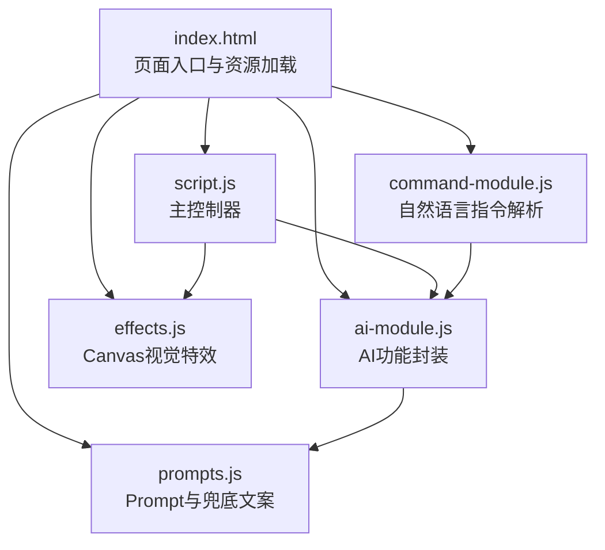
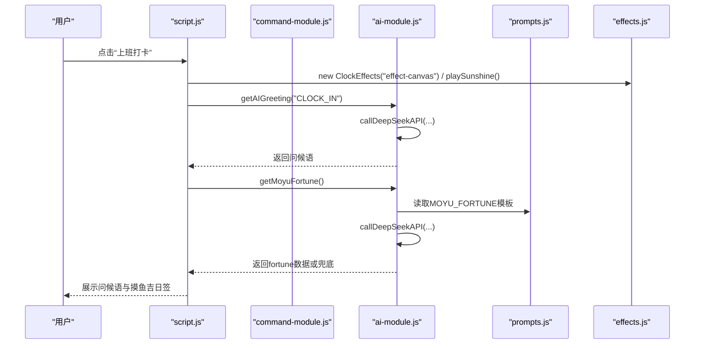
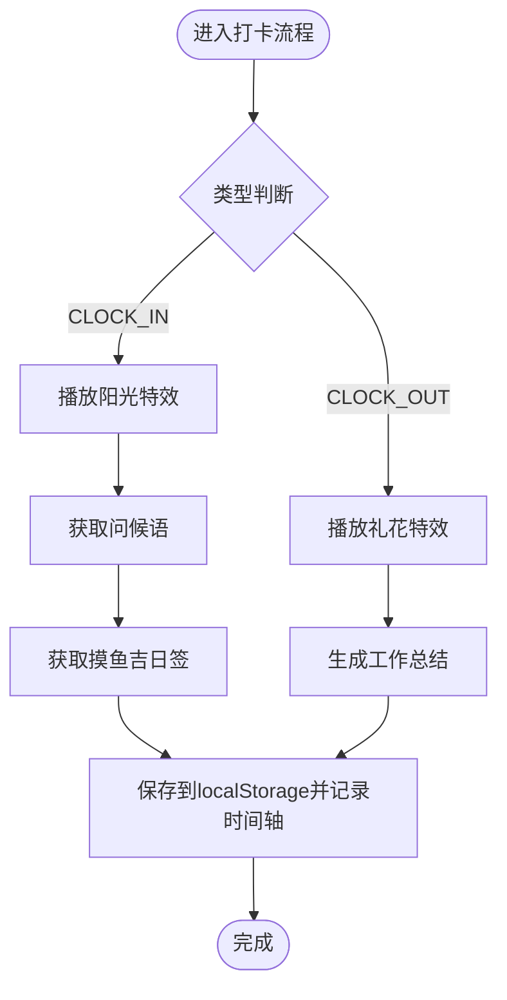
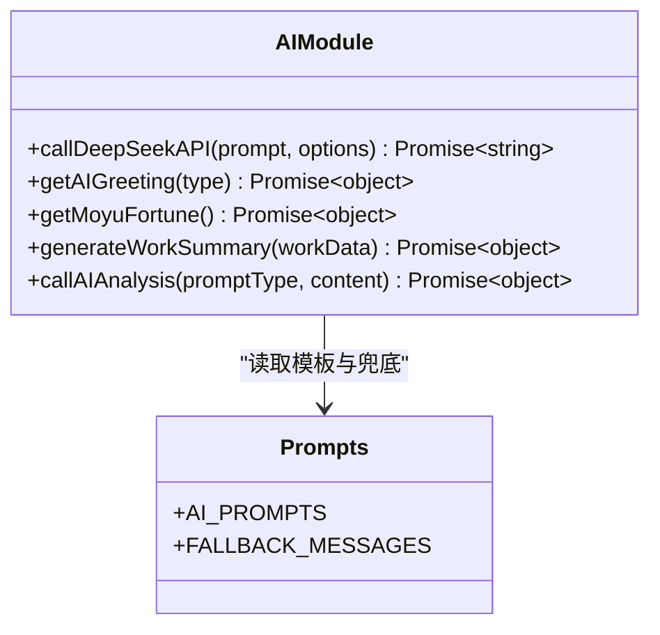
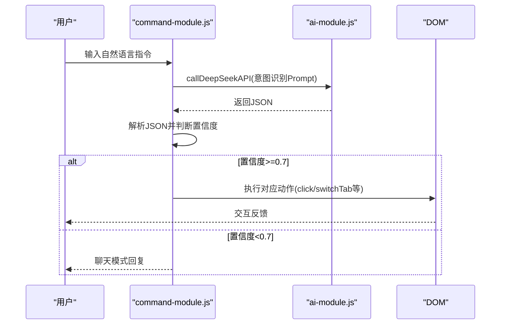
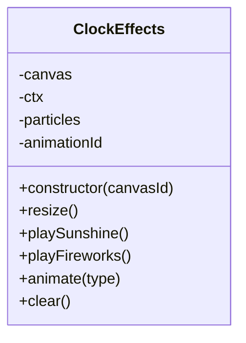
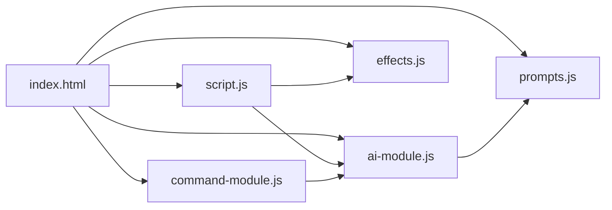

# JavaScript编码规范

<cite>
**本文引用的文件**
- [script.js](file://script.js)
- [ai-module.js](file://ai-module.js)
- [command-module.js](file://command-module.js)
- [effects.js](file://effects.js)
- [prompts.js](file://prompts.js)
- [index.html](file://index.html)
- [README.md](file://README.md)
</cite>

## 目录
1. [引言](#引言)
2. [项目结构](#项目结构)
3. [核心组件](#核心组件)
4. [架构总览](#架构总览)
5. [详细组件分析](#详细组件分析)
6. [依赖关系分析](#依赖关系分析)
7. [性能考量](#性能考量)
8. [故障排查指南](#故障排查指南)
9. [结论](#结论)
10. [附录](#附录)

## 引言
本规范面向本项目的JavaScript模块化开发，明确采用ES6+模块化标准，统一异步编程风格（async/await），规范localStorage数据持久化与校验策略，并对AI功能、自然语言指令解析、Canvas视觉特效等核心模块的职责边界进行界定。本文同时提供新增功能的编写范式、可维护函数的设计方法、错误边界处理策略，以及Canvas动画性能优化要点，帮助开发者在保持一致性的同时提升可维护性与用户体验。

## 项目结构
项目采用“页面级入口 + 功能模块”的组织方式：
- 页面入口：index.html引入全局脚本，挂载各模块至window命名空间，供全局调用。
- 主控制器：script.js负责全局状态、DOM初始化、页面行为编排与localStorage数据持久化。
- AI模块：ai-module.js封装DeepSeek API调用、兜底策略与Prompt模板调用。
- 指令模块：command-module.js负责自然语言意图识别、置信度判断与动作执行。
- 视觉特效：effects.js封装Canvas粒子动画，提供“阳光”和“礼花”两类特效。
- Prompt与兜底文案：prompts.js集中管理AI提示词与兜底文案，供AI模块调用。

图表来源
- [index.html](file://index.html#L1-L120)
- [script.js](file://script.js#L1-L120)
- [ai-module.js](file://ai-module.js#L1-L60)
- [command-module.js](file://command-module.js#L1-L60)
- [effects.js](file://effects.js#L1-L40)
- [prompts.js](file://prompts.js#L1-L40)

章节来源
- [index.html](file://index.html#L1-L120)
- [README.md](file://README.md#L1-L125)

## 核心组件
- 主控制器（script.js）
  - 职责边界：全局状态管理、页面初始化、标签页与侧边栏控制、番茄钟、打卡流程、时间轴、开发者模式、localStorage数据持久化与校验。
  - 关键点：使用async/await处理异步；对localStorage读写进行存在性与格式校验；提供兜底策略与错误提示。
- AI模块（ai-module.js）
  - 职责边界：DeepSeek API调用、Prompt模板拼装、兜底策略、错误捕获与返回结构化结果。
  - 关键点：统一fetch请求封装、响应校验、JSON解析兜底、对外暴露window.AIModule。
- 指令模块（command-module.js）
  - 职责边界：自然语言意图识别、置信度阈值判断、动作执行与聊天模式分流。
  - 关键点：基于Prompt模板调用AI进行意图解析；对返回JSON进行提取与校验；执行对应DOM操作。
- 视觉特效（effects.js）
  - 职责边界：Canvas粒子系统、动画生命周期管理、特效播放与清理。
  - 关键点：requestAnimationFrame驱动、粒子过滤与回收、内存与性能优化。

章节来源
- [script.js](file://script.js#L1-L120)
- [ai-module.js](file://ai-module.js#L1-L60)
- [command-module.js](file://command-module.js#L1-L60)
- [effects.js](file://effects.js#L1-L40)

## 架构总览
整体采用“页面入口 -> 主控制器 -> 功能模块”的分层架构。主控制器负责协调全局逻辑与数据持久化，AI模块与指令模块通过window命名空间暴露接口，特效模块通过构造函数实例化并管理Canvas动画。

图表来源
- [script.js](file://script.js#L540-L730)
- [effects.js](file://effects.js#L1-L120)
- [ai-module.js](file://ai-module.js#L60-L120)
- [prompts.js](file://prompts.js#L1-L40)
- [command-module.js](file://command-module.js#L180-L260)

## 详细组件分析

### 主控制器（script.js）职责与实现要点
- 全局状态与持久化
  - 使用localStorage存储工作时间、节假日、开发者模式、自定义时间、时间轴等。
  - 读取时进行存在性判断与JSON解析兜底，避免异常导致崩溃。
  - 写入时统一使用JSON.stringify，读取时统一使用JSON.parse。
- 异步流程
  - 使用async/await处理异步任务，如测试AI密钥、生成工作总结、显示摸鱼吉日签等。
  - 对可能出现的异常进行try/catch包裹，并在UI层给出友好提示。
- 打卡流程
  - 上班打卡：播放阳光特效、生成摸鱼吉日签、记录时间轴事件。
  - 下班打卡：播放礼花特效、生成工作总结、记录时间轴事件。
- 数据校验
  - 首次设置与更新设置均包含时间顺序校验，防止非法时间配置。
- 事件与时间轴
  - addTimelineEvent统一记录事件，saveTodayTimeline按日期键持久化。

图表来源
- [script.js](file://script.js#L540-L730)
- [effects.js](file://effects.js#L1-L120)
- [ai-module.js](file://ai-module.js#L60-L167)

章节来源
- [script.js](file://script.js#L1-L120)
- [script.js](file://script.js#L186-L223)
- [script.js](file://script.js#L2267-L2297)
- [script.js](file://script.js#L540-L730)

### AI模块（ai-module.js）职责与实现要点
- API封装
  - 统一封装callDeepSeekAPI，统一请求头、模型、参数与错误处理。
  - 对response.ok进行校验，非OK状态解析error.message或回退提示。
- Prompt与兜底
  - 通过window.AI_PROMPTS读取模板，替换占位符生成最终Prompt。
  - 对AI返回的JSON进行正则提取与解析，失败时返回兜底数据与错误信息。
- 结果结构
  - 统一返回success、data/error、isAI标记，便于上层模块区分AI结果与兜底结果。

图表来源
- [ai-module.js](file://ai-module.js#L1-L216)
- [prompts.js](file://prompts.js#L1-L159)

章节来源
- [ai-module.js](file://ai-module.js#L1-L60)
- [ai-module.js](file://ai-module.js#L60-L120)
- [ai-module.js](file://ai-module.js#L120-L167)
- [ai-module.js](file://ai-module.js#L168-L205)
- [prompts.js](file://prompts.js#L1-L159)

### 指令模块（command-module.js）职责与实现要点
- 意图识别
  - 基于Prompt模板调用AI进行意图识别，返回JSON包含type、confidence、params等字段。
- 置信度与聊天模式
  - 置信度阈值0.7，低于阈值进入聊天模式，高于阈值执行对应动作。
- 动作执行
  - 通过DOM查询与click触发模拟用户操作，如打卡、打开番茄钟、切换标签页、记录摸鱼等。
- 错误处理
  - 对AI返回解析失败、执行失败等情况进行兜底与提示。

图表来源
- [command-module.js](file://command-module.js#L180-L260)
- [command-module.js](file://command-module.js#L260-L313)
- [ai-module.js](file://ai-module.js#L1-L60)

章节来源
- [command-module.js](file://command-module.js#L1-L60)
- [command-module.js](file://command-module.js#L180-L260)
- [command-module.js](file://command-module.js#L260-L313)

### 视觉特效（effects.js）职责与实现要点
- Canvas粒子系统
  - ClockEffects类管理粒子数组、动画帧与画布尺寸，提供playSunshine与playFireworks两类特效。
  - 阳光特效：大量小光点与光晕组合，带闪烁与重力效果；礼花特效：多组粒子爆炸与尾迹。
- 生命周期管理
  - clear方法统一清理动画与画布，避免内存泄漏；resize监听窗口变化。
- 性能优化
  - 使用requestAnimationFrame驱动动画；粒子过滤与alpha衰减减少无效绘制；调试日志按概率输出，降低性能开销。

图表来源
- [effects.js](file://effects.js#L1-L279)

章节来源
- [effects.js](file://effects.js#L1-L120)
- [effects.js](file://effects.js#L120-L279)

## 依赖关系分析
- 模块间依赖
  - script.js依赖ai-module.js与effects.js；ai-module.js依赖prompts.js；command-module.js依赖ai-module.js。
- 全局命名空间
  - 通过window.AIModule、window.CommandModule、window.ClockEffects暴露接口，便于跨模块调用。
- HTML入口
  - index.html按顺序引入脚本，确保依赖链路正确。

图表来源
- [index.html](file://index.html#L1-L120)
- [script.js](file://script.js#L1-L120)
- [ai-module.js](file://ai-module.js#L200-L216)
- [command-module.js](file://command-module.js#L300-L313)
- [effects.js](file://effects.js#L270-L279)
- [prompts.js](file://prompts.js#L140-L159)

章节来源
- [index.html](file://index.html#L1-L120)

## 性能考量
- 异步与并发
  - 使用async/await串行化关键流程，避免竞态；对可并行的UI更新与数据渲染采用独立任务队列。
- Canvas动画
  - requestAnimationFrame驱动，减少不必要的重绘；粒子数组按帧过滤，alpha衰减与生命值回收，避免无限增长。
  - 调试日志按概率输出，降低主线程压力。
- localStorage访问
  - 避免频繁读写，批量更新时合并多次写入；读取后统一JSON解析与校验，避免重复解析。
- DOM操作
  - 集中更新UI，减少重排与重绘；对高频事件使用节流/防抖策略。

[本节为通用性能指导，无需特定文件引用]

## 故障排查指南
- API调用异常
  - 现象：AI功能不可用、提示“API请求失败”或“未配置API密钥”。
  - 排查：确认localStorage中存在deepseekApiKey；检查网络连通性；查看服务端返回的错误消息。
  - 参考路径
    - [ai-module.js](file://ai-module.js#L1-L60)
    - [script.js](file://script.js#L465-L491)
- 摸鱼吉日签解析失败
  - 现象：AI返回非JSON或格式不符，显示兜底数据。
  - 排查：检查AI返回内容是否包含JSON片段；确认正则匹配范围；查看兜底文案是否生效。
  - 参考路径
    - [ai-module.js](file://ai-module.js#L95-L127)
    - [prompts.js](file://prompts.js#L1-L40)
- Canvas动画卡顿
  - 现象：特效播放卡顿或掉帧。
  - 排查：检查粒子数量与alpha衰减；确认clear方法是否被调用；减少调试日志输出频率。
  - 参考路径
    - [effects.js](file://effects.js#L120-L279)
- 指令解析失败
  - 现象：无法识别用户意图或置信度过低。
  - 排查：检查Prompt模板是否完整；确认AI返回JSON结构；适当提高temperature以增加多样性。
  - 参考路径
    - [command-module.js](file://command-module.js#L180-L260)
    - [ai-module.js](file://ai-module.js#L168-L205)

章节来源
- [ai-module.js](file://ai-module.js#L1-L60)
- [ai-module.js](file://ai-module.js#L95-L127)
- [ai-module.js](file://ai-module.js#L168-L205)
- [effects.js](file://effects.js#L120-L279)
- [command-module.js](file://command-module.js#L180-L260)
- [prompts.js](file://prompts.js#L1-L40)
- [script.js](file://script.js#L465-L491)

## 结论
本项目遵循ES6+模块化开发规范，通过主控制器统一编排、AI模块与指令模块解耦、Canvas特效模块独立实现，形成清晰的职责边界与稳定的依赖关系。在异步处理、数据持久化与错误边界方面，项目提供了完善的兜底策略与用户提示。建议在新增功能时严格遵循本文规范，优先使用async/await与结构化错误处理，确保localStorage数据的完整性与安全性，并在Canvas动画中持续关注性能优化。

[本节为总结性内容，无需特定文件引用]

## 附录

### 新增功能编写范式（示例路径）
- 新增AI功能
  - 在prompts.js中添加Prompt模板与兜底文案
  - 在ai-module.js中新增函数并返回统一结构
  - 在script.js中调用并处理返回结果与错误
  - 参考路径
    - [prompts.js](file://prompts.js#L1-L159)
    - [ai-module.js](file://ai-module.js#L120-L205)
    - [script.js](file://script.js#L540-L730)
- 新增自然语言指令
  - 在command-module.js中扩展COMMAND_TYPES与executeCommand分支
  - 在processCommand中处理置信度与聊天模式
  - 参考路径
    - [command-module.js](file://command-module.js#L1-L60)
    - [command-module.js](file://command-module.js#L180-L313)
- 新增Canvas特效
  - 在effects.js中新增特效方法与动画循环
  - 在script.js中按需实例化与播放
  - 参考路径
    - [effects.js](file://effects.js#L1-L279)
    - [script.js](file://script.js#L540-L730)

### 可维护函数设计要点（示例路径）
- 异步函数
  - 使用async/await，统一try/catch，返回结构化结果
  - 参考路径
    - [ai-module.js](file://ai-module.js#L1-L60)
    - [command-module.js](file://command-module.js#L180-L260)
- 数据持久化
  - 读取时存在性判断与JSON解析兜底；写入时统一序列化
  - 参考路径
    - [script.js](file://script.js#L1-L40)
    - [script.js](file://script.js#L2267-L2297)
- 错误边界
  - 对API调用、JSON解析、DOM查询等关键步骤进行异常捕获与降级
  - 参考路径
    - [ai-module.js](file://ai-module.js#L95-L127)
    - [command-module.js](file://command-module.js#L180-L260)