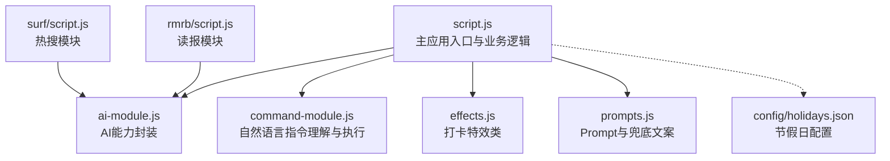
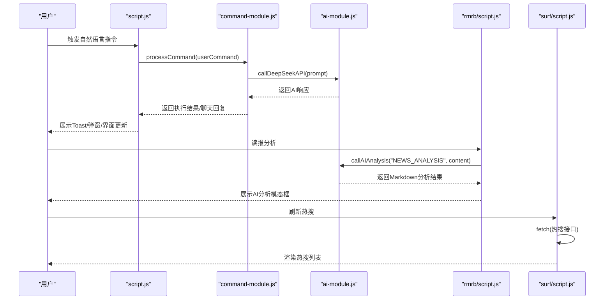
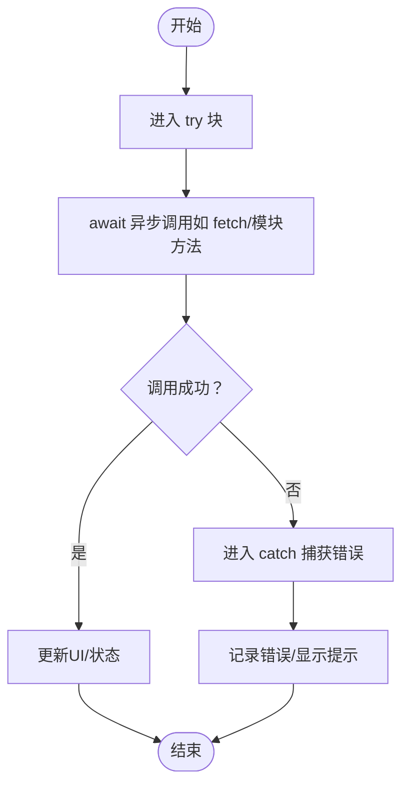
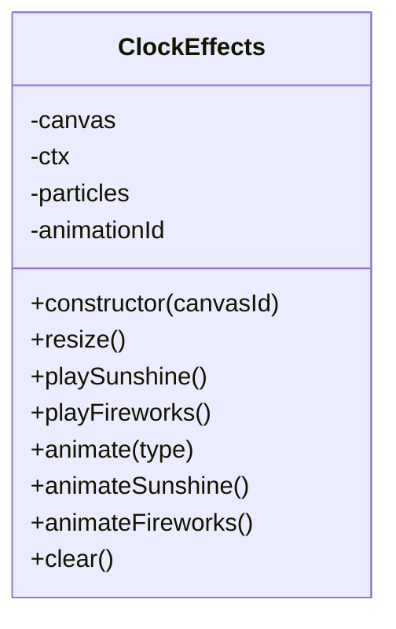
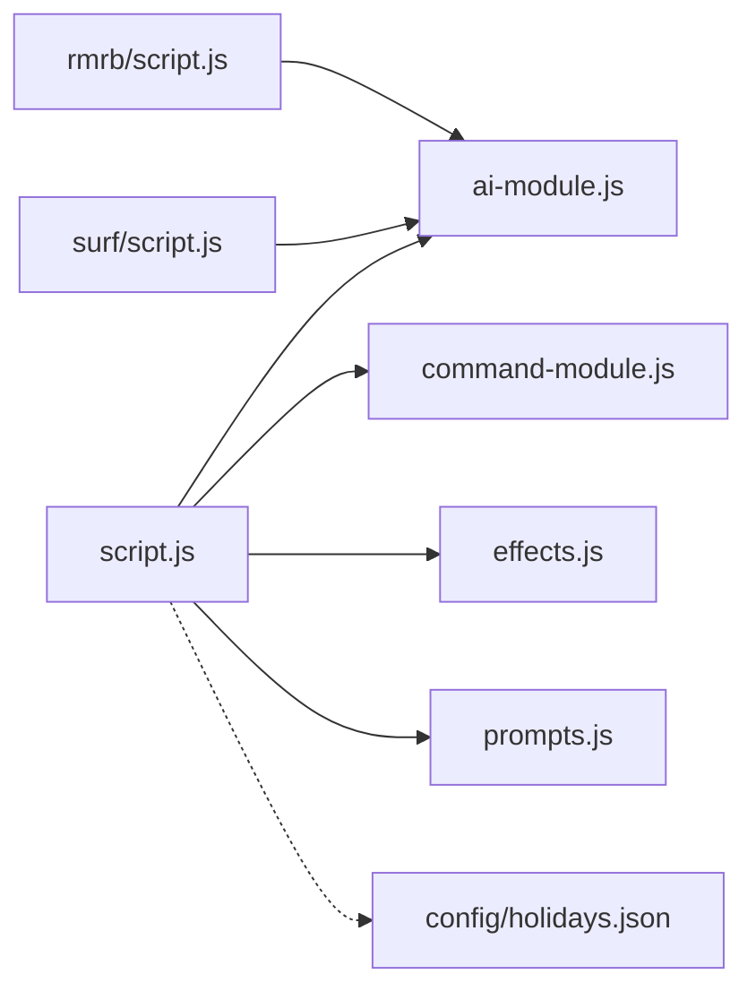

# JavaScript语法规范

<cite>
**本文引用的文件**
- [script.js](file://script.js)
- [ai-module.js](file://ai-module.js)
- [command-module.js](file://command-module.js)
- [effects.js](file://effects.js)
- [prompts.js](file://prompts.js)
- [surf/script.js](file://surf/script.js)
- [rmrb/script.js](file://rmrb/script.js)
- [config/holidays.json](file://config/holidays.json)
</cite>

## 目录
1. [简介](#简介)
2. [项目结构](#项目结构)
3. [核心组件](#核心组件)
4. [架构总览](#架构总览)
5. [详细组件分析](#详细组件分析)
6. [依赖关系分析](#依赖关系分析)
7. [性能考量](#性能考量)
8. [故障排查指南](#故障排查指南)
9. [结论](#结论)
10. [附录](#附录)

## 简介
本规范面向本仓库中的JavaScript实现，明确项目采用的ES6+语法标准与代码风格要求，涵盖变量声明、箭头函数、模板字符串、解构赋值、模块化导入导出、异步函数与await使用、错误处理等。同时给出格式化与编码约定，帮助开发者在保持一致性的基础上提升可读性与可维护性。

## 项目结构
本项目为纯前端Web应用，核心逻辑集中在根目录的脚本文件中，配合模块化的AI与命令处理模块、特效模块以及两个子页面模块（网上冲浪、人民日报）。整体采用“全局脚本 + 模块化函数/类”的组织方式。

图表来源
- [script.js](file://script.js#L1-L200)
- [ai-module.js](file://ai-module.js#L1-L216)
- [command-module.js](file://command-module.js#L1-L313)
- [effects.js](file://effects.js#L1-L279)
- [prompts.js](file://prompts.js#L1-L159)
- [surf/script.js](file://surf/script.js#L1-L231)
- [rmrb/script.js](file://rmrb/script.js#L1-L474)
- [config/holidays.json](file://config/holidays.json#L1-L46)

章节来源
- [script.js](file://script.js#L1-L200)
- [ai-module.js](file://ai-module.js#L1-L216)
- [command-module.js](file://command-module.js#L1-L313)
- [effects.js](file://effects.js#L1-L279)
- [prompts.js](file://prompts.js#L1-L159)
- [surf/script.js](file://surf/script.js#L1-L231)
- [rmrb/script.js](file://rmrb/script.js#L1-L474)
- [config/holidays.json](file://config/holidays.json#L1-L46)

## 核心组件
- 全局应用脚本：负责页面初始化、标签页与侧边栏、番茄钟、打卡流程、时间轴与AI交互等。
- AI模块：封装DeepSeek API调用、问候语、摸鱼吉日签、工作总结、通用分析等。
- 命令模块：自然语言指令理解与执行，含意图判断、置信度阈值、动作映射。
- 特效模块：基于Canvas的打卡特效类，提供阳光与礼花两种动画。
- Prompt与兜底：集中管理AI提示词与兜底文案，提供随机兜底消息。
- 子模块：网上冲浪（热搜）与人民日报（读报）模块，均使用fetch与异步处理。

章节来源
- [script.js](file://script.js#L1-L200)
- [ai-module.js](file://ai-module.js#L1-L216)
- [command-module.js](file://command-module.js#L1-L313)
- [effects.js](file://effects.js#L1-L279)
- [prompts.js](file://prompts.js#L1-L159)
- [surf/script.js](file://surf/script.js#L1-L231)
- [rmrb/script.js](file://rmrb/script.js#L1-L474)

## 架构总览
下图展示了主应用与各模块的交互关系，以及异步调用链路。

图表来源
- [script.js](file://script.js#L493-L732)
- [command-module.js](file://command-module.js#L185-L259)
- [ai-module.js](file://ai-module.js#L1-L216)
- [rmrb/script.js](file://rmrb/script.js#L358-L418)
- [surf/script.js](file://surf/script.js#L28-L87)

## 详细组件分析

### 变量声明与作用域
- 使用let/const进行变量声明，避免var污染作用域。
- 全局变量集中声明于文件顶部，便于维护与查找。
- 函数参数与局部变量优先使用const/let，避免不必要的可变性。

章节来源
- [script.js](file://script.js#L1-L30)
- [ai-module.js](file://ai-module.js#L1-L20)
- [command-module.js](file://command-module.js#L1-L20)
- [effects.js](file://effects.js#L1-L20)
- [prompts.js](file://prompts.js#L1-L20)

### 箭头函数与回调
- 在事件监听、数组遍历、定时器回调等场景广泛使用箭头函数，保持this上下文稳定。
- 异步函数与Promise链中使用箭头函数简化书写。

章节来源
- [script.js](file://script.js#L95-L155)
- [surf/script.js](file://surf/script.js#L1-L40)
- [rmrb/script.js](file://rmrb/script.js#L358-L418)

### 模板字符串
- 使用模板字符串拼接HTML片段与动态文本，提升可读性与可维护性。
- 在错误提示、Toast消息、弹窗内容中大量使用模板字符串。

章节来源
- [surf/script.js](file://surf/script.js#L110-L120)
- [rmrb/script.js](file://rmrb/script.js#L390-L400)
- [script.js](file://script.js#L580-L620)

### 解构赋值
- 对函数参数、对象属性、数组元素进行解构，简化赋值与访问。
- 在fetch响应解析、DOM查询结果处理中使用解构。

章节来源
- [script.js](file://script.js#L36-L47)
- [ai-module.js](file://ai-module.js#L21-L26)
- [rmrb/script.js](file://rmrb/script.js#L160-L190)

### 模块化与命名空间
- 通过window全局对象暴露模块方法，形成简单的命名空间模式。
- 模块内部使用const/let声明常量与函数，避免污染全局。

章节来源
- [ai-module.js](file://ai-module.js#L207-L216)
- [command-module.js](file://command-module.js#L306-L313)
- [effects.js](file://effects.js#L276-L279)
- [prompts.js](file://prompts.js#L154-L158)

### 异步与await使用规范
- 所有网络请求与UI交互均采用async/await，避免回调地狱。
- await必须在async函数内部使用；错误通过try/catch捕获。
- 在UI加载、错误提示、动画播放等场景，await前后分别进行状态更新与清理。

图表来源
- [surf/script.js](file://surf/script.js#L28-L55)
- [rmrb/script.js](file://rmrb/script.js#L358-L418)
- [ai-module.js](file://ai-module.js#L14-L59)
- [command-module.js](file://command-module.js#L185-L259)

章节来源
- [surf/script.js](file://surf/script.js#L28-L87)
- [rmrb/script.js](file://rmrb/script.js#L136-L197)
- [ai-module.js](file://ai-module.js#L14-L59)
- [command-module.js](file://command-module.js#L185-L259)

### 错误处理与兜底策略
- 对fetch响应进行状态检查与JSON解析，失败时抛出可读错误。
- AI模块与读报模块提供兜底文案与降级逻辑，保证用户体验。
- UI层通过Toast或弹窗展示错误信息，避免静默失败。

章节来源
- [ai-module.js](file://ai-module.js#L48-L59)
- [rmrb/script.js](file://rmrb/script.js#L136-L150)
- [prompts.js](file://prompts.js#L122-L151)
- [script.js](file://script.js#L465-L491)

### 类与构造器
- 特效模块使用ES6类定义，封装Canvas动画生命周期与粒子系统。
- 类方法职责清晰，支持清屏、动画循环、特效播放等。

图表来源
- [effects.js](file://effects.js#L1-L279)

章节来源
- [effects.js](file://effects.js#L1-L279)

### 数据结构与算法
- 使用对象字面量与数组进行数据组织，配合解构与扩展运算符简化处理。
- 日期与时间处理采用Date对象与本地存储，结合模板字符串进行格式化。
- JSON配置文件用于节假日与调休工作日管理，便于外部维护。

章节来源
- [script.js](file://script.js#L1-L30)
- [config/holidays.json](file://config/holidays.json#L1-L46)

## 依赖关系分析
- 主应用脚本依赖AI模块、命令模块、特效模块与Prompt配置。
- 读报模块与热搜模块均依赖AI模块进行分析与生成。
- 配置文件为全局共享的数据源。

图表来源
- [script.js](file://script.js#L1-L200)
- [ai-module.js](file://ai-module.js#L1-L216)
- [command-module.js](file://command-module.js#L1-L313)
- [effects.js](file://effects.js#L1-L279)
- [prompts.js](file://prompts.js#L1-L159)
- [surf/script.js](file://surf/script.js#L1-L231)
- [rmrb/script.js](file://rmrb/script.js#L1-L474)
- [config/holidays.json](file://config/holidays.json#L1-L46)

章节来源
- [script.js](file://script.js#L1-L200)
- [ai-module.js](file://ai-module.js#L1-L216)
- [command-module.js](file://command-module.js#L1-L313)
- [effects.js](file://effects.js#L1-L279)
- [prompts.js](file://prompts.js#L1-L159)
- [surf/script.js](file://surf/script.js#L1-L231)
- [rmrb/script.js](file://rmrb/script.js#L1-L474)
- [config/holidays.json](file://config/holidays.json#L1-L46)

## 性能考量
- Canvas动画使用requestAnimationFrame优化帧率，避免高频重绘。
- 读报模块对页面抓取与解析过程增加延迟与进度提示，避免请求过快导致阻塞。
- 摸鱼吉日签与工作总结采用异步生成并在UI中渐进展示，避免主线程长时间占用。

章节来源
- [effects.js](file://effects.js#L135-L201)
- [rmrb/script.js](file://rmrb/script.js#L189-L193)

## 故障排查指南
- 网络请求失败：检查响应状态与JSON解析，必要时回退到兜底文案。
- API密钥缺失：在AI模块中抛出明确错误，引导用户配置密钥。
- UI无响应：确认await位置与try/catch包裹，确保错误被捕获并提示。
- Canvas动画异常：检查画布尺寸与resize事件绑定，确保clear与cancelAnimationFrame正确调用。

章节来源
- [ai-module.js](file://ai-module.js#L14-L59)
- [surf/script.js](file://surf/script.js#L28-L55)
- [rmrb/script.js](file://rmrb/script.js#L136-L150)
- [effects.js](file://effects.js#L262-L273)

## 结论
本项目在ES6+语法的基础上，形成了清晰的模块化结构与一致的异步处理风格。通过const/let、箭头函数、模板字符串、解构赋值与类封装，提升了代码可读性与可维护性。配合严格的await使用与错误处理策略，确保了良好的用户体验与稳定性。

## 附录

### 代码风格与格式化要求
- 缩进：使用4个空格。
- 编码：UTF-8。
- 行结尾：使用LF换行符。
- 字符串：使用单引号。
- 代码风格：遵循ESLint兼容的风格（项目未提供ESLint配置文件，建议在本地工程中启用ESLint并配置airbnb-base或standard风格，开启no-var、prefer-const、arrow-body-style等规则）。

章节来源
- [script.js](file://script.js#L1-L200)
- [ai-module.js](file://ai-module.js#L1-L216)
- [command-module.js](file://command-module.js#L1-L313)
- [effects.js](file://effects.js#L1-L279)
- [prompts.js](file://prompts.js#L1-L159)
- [surf/script.js](file://surf/script.js#L1-L231)
- [rmrb/script.js](file://rmrb/script.js#L1-L474)