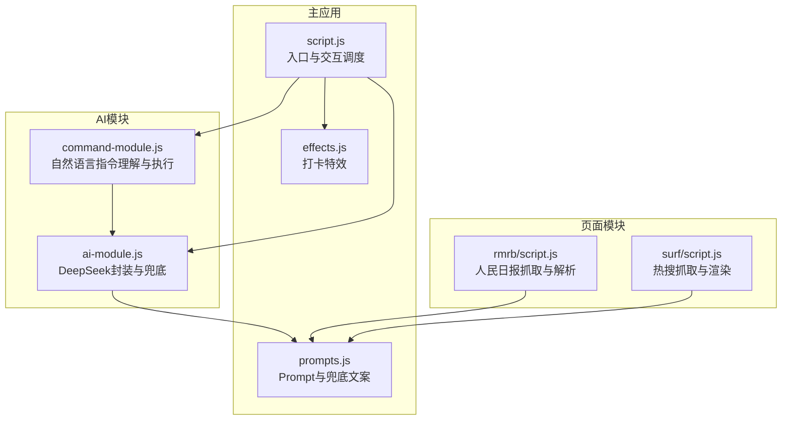
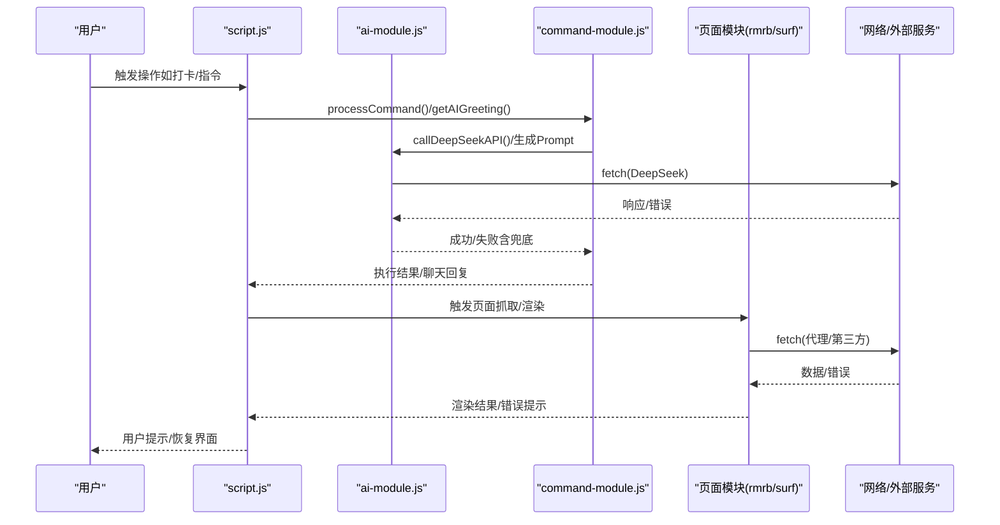
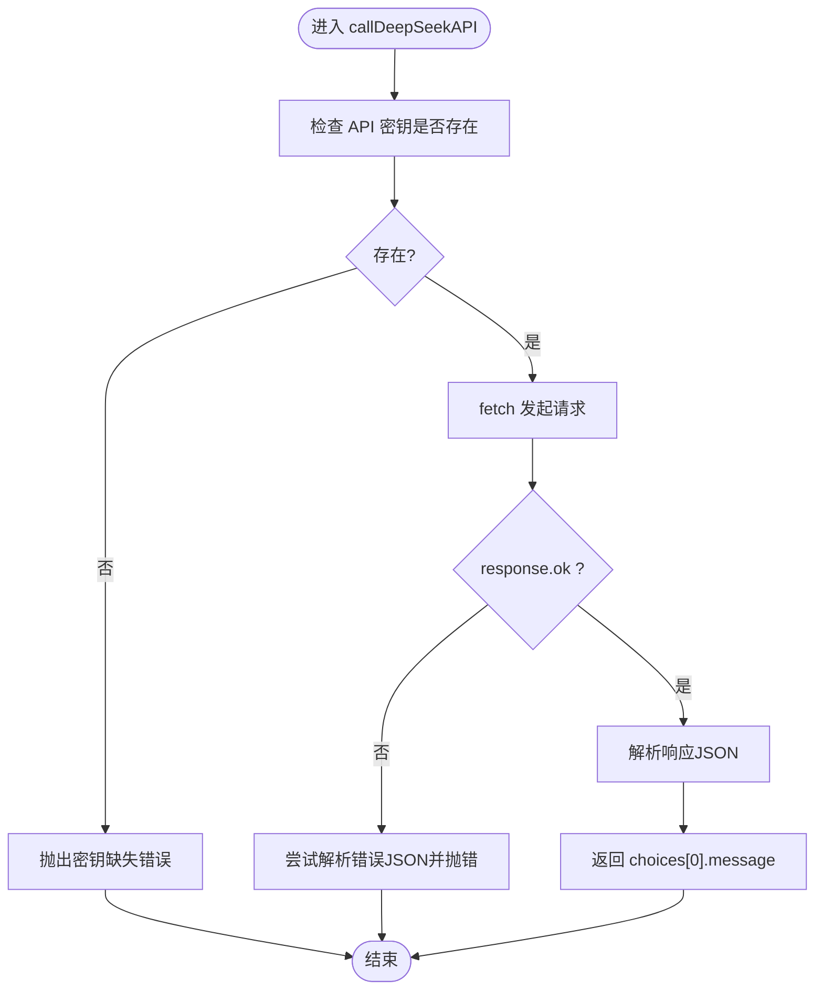
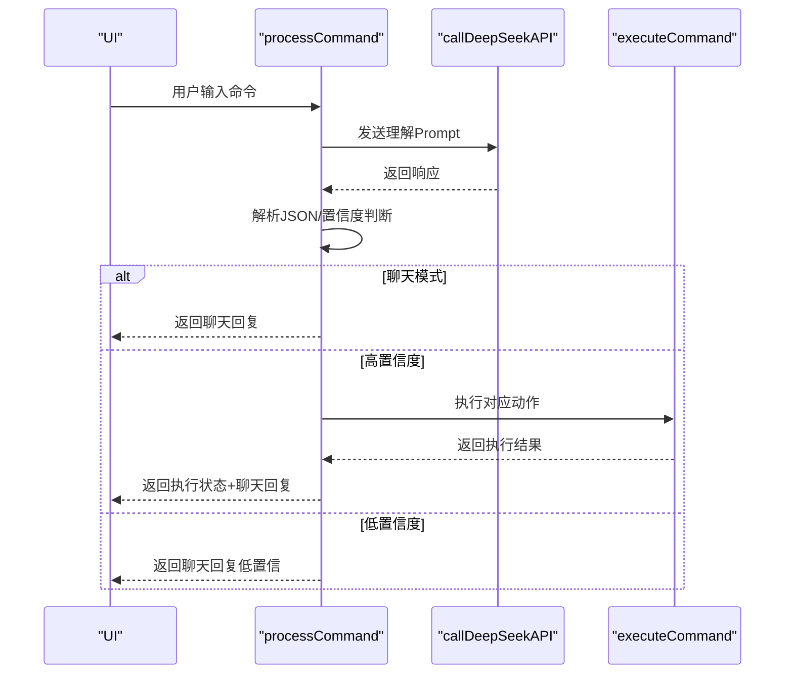
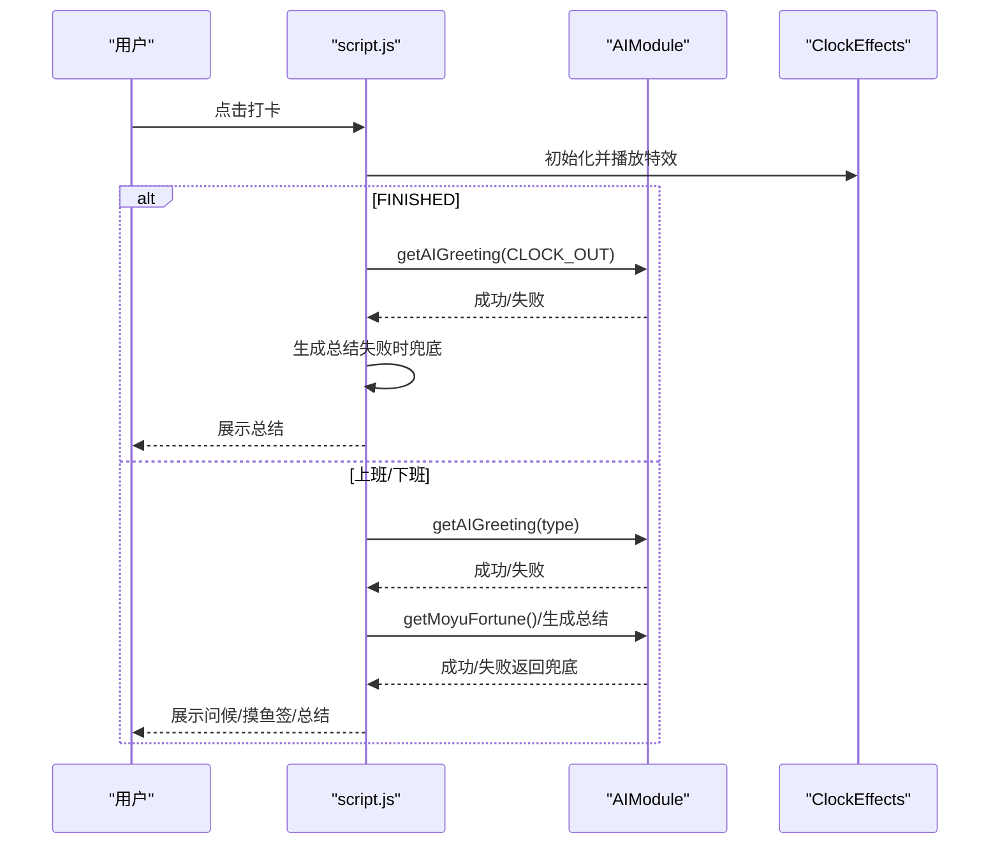
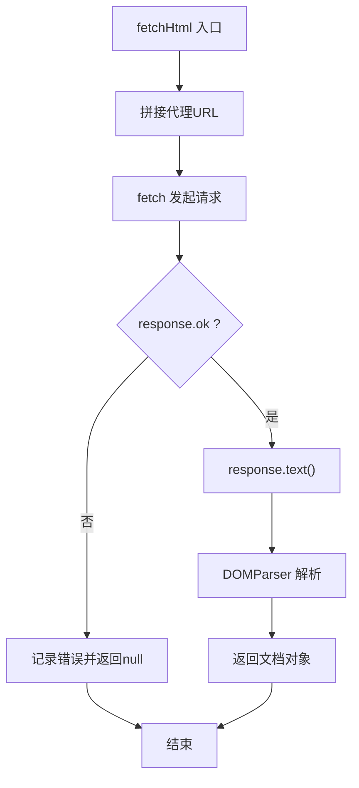
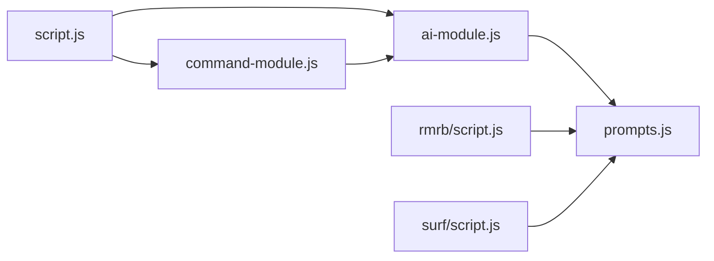

# 异步与错误处理规范

<cite>
**本文引用的文件**
- [ai-module.js](file://ai-module.js)
- [script.js](file://script.js)
- [prompts.js](file://prompts.js)
- [command-module.js](file://command-module.js)
- [effects.js](file://effects.js)
- [rmrb/script.js](file://rmrb/script.js)
- [surf/script.js](file://surf/script.js)
- [README.md](file://README.md)
</cite>

## 目录
1. [引言](#引言)
2. [项目结构](#项目结构)
3. [核心组件](#核心组件)
4. [架构总览](#架构总览)
5. [详细组件分析](#详细组件分析)
6. [依赖关系分析](#依赖关系分析)
7. [性能考量](#性能考量)
8. [故障排查指南](#故障排查指南)
9. [结论](#结论)
10. [附录](#附录)

## 引言
本规范旨在统一项目中的异步操作与错误处理实践，确保所有异步流程采用 async/await 语法，杜绝回调地狱；在调用外部 API（如 DeepSeek）时，必须使用 try-catch 包裹并记录详细日志；针对网络请求失败、API 密钥无效、响应解析失败等常见问题，提供统一的兜底策略与用户提示机制；同时给出优雅降级方案与错误恢复流程，使用户体验在异常情况下依然稳定。

## 项目结构
本项目前端采用模块化组织，AI 相关能力集中在独立模块中，主应用脚本负责调度与 UI 交互，其他页面模块（如“网上冲浪”“人民日报”）各自维护自身的异步与错误处理逻辑。

图表来源
- [script.js](file://script.js#L95-L155)
- [ai-module.js](file://ai-module.js#L1-L60)
- [command-module.js](file://command-module.js#L182-L259)
- [effects.js](file://effects.js#L1-L40)
- [prompts.js](file://prompts.js#L1-L60)
- [rmrb/script.js](file://rmrb/script.js#L135-L200)
- [surf/script.js](file://surf/script.js#L25-L87)

章节来源
- [README.md](file://README.md#L1-L125)

## 核心组件
- AI 模块（ai-module.js）：封装 DeepSeek API 调用、参数校验、错误日志与统一兜底返回。
- 指令模块（command-module.js）：自然语言意图识别、置信度判断、执行动作与错误兜底。
- 主应用脚本（script.js）：调度 AI 功能、处理打卡流程、展示错误与恢复。
- Prompt 与兜底文案（prompts.js）：集中管理提示词与兜底文本，便于统一风格与恢复。
- 特效模块（effects.js）：打卡特效播放与清理，避免异常中断导致资源泄漏。
- 页面模块（rmrb/script.js、surf/script.js）：网络请求与错误处理，统一提示与降级。

章节来源
- [ai-module.js](file://ai-module.js#L1-L60)
- [command-module.js](file://command-module.js#L182-L259)
- [script.js](file://script.js#L493-L732)
- [prompts.js](file://prompts.js#L1-L60)
- [effects.js](file://effects.js#L1-L40)
- [rmrb/script.js](file://rmrb/script.js#L135-L200)
- [surf/script.js](file://surf/script.js#L25-L87)

## 架构总览
整体流程：用户触发操作 → 主应用脚本调度 → AI 模块发起 API 请求 → 指令模块进行意图识别与执行 → 页面模块进行网络抓取与渲染 → 统一错误处理与兜底。

图表来源
- [script.js](file://script.js#L493-L732)
- [command-module.js](file://command-module.js#L182-L259)
- [ai-module.js](file://ai-module.js#L1-L60)
- [rmrb/script.js](file://rmrb/script.js#L135-L200)
- [surf/script.js](file://surf/script.js#L25-L87)

## 详细组件分析

### AI 模块（异步与错误处理）
- 要求
  - 所有对外 API 调用使用 async/await，禁止回调。
  - 使用 try-catch 包裹 fetch 请求，记录详细错误日志。
  - 对响应状态进行校验，非 OK 状态抛出可读错误。
  - 对 JSON 解析失败进行兜底，避免崩溃。
  - 提供统一的兜底返回结构，便于上层恢复。
- 关键点
  - API 密钥校验：若未配置，立即抛错并提示。
  - 错误日志：统一记录到控制台，包含错误详情。
  - 兜底策略：在上层函数中捕获错误并返回预设兜底文案或结构化失败对象。
- 示例路径
  - DeepSeek 调用封装与错误处理：[callDeepSeekAPI](file://ai-module.js#L13-L60)
  - 摸鱼吉日签（带兜底）：[getMoyuFortune](file://ai-module.js#L95-L133)
  - 工作总结（带兜底）：[generateWorkSummary](file://ai-module.js#L129-L170)
  - AI 分析（带兜底）：[callAIAnalysis](file://ai-module.js#L169-L205)

图表来源
- [ai-module.js](file://ai-module.js#L13-L60)

章节来源
- [ai-module.js](file://ai-module.js#L1-L60)
- [ai-module.js](file://ai-module.js#L95-L133)
- [ai-module.js](file://ai-module.js#L129-L170)
- [ai-module.js](file://ai-module.js#L169-L205)

### 指令模块（自然语言理解与执行）
- 要求
  - 使用 async/await 处理大模型理解与执行。
  - 对 JSON 解析失败进行兜底，返回聊天模式或错误提示。
  - 置信度阈值控制：低于阈值仅聊天，不执行操作。
  - 统一错误日志与用户提示。
- 关键点
  - 意图识别：基于 Prompt 返回 JSON，解析失败则走兜底。
  - 执行动作：根据类型映射到 UI 操作，失败时返回可恢复状态。
  - 置信度判断：低置信度时返回聊天回复，避免误操作。
- 示例路径
  - 指令处理主流程：[processCommand](file://command-module.js#L182-L259)
  - 指令解析与兜底：[parseCommandResponse](file://command-module.js#L56-L73)
  - 执行动作映射：[executeCommand](file://command-module.js#L74-L181)

图表来源
- [command-module.js](file://command-module.js#L182-L259)
- [command-module.js](file://command-module.js#L56-L73)
- [command-module.js](file://command-module.js#L74-L181)
- [ai-module.js](file://ai-module.js#L13-L60)

章节来源
- [command-module.js](file://command-module.js#L182-L259)
- [command-module.js](file://command-module.js#L56-L73)
- [command-module.js](file://command-module.js#L74-L181)

### 主应用脚本（调度与错误恢复）
- 要求
  - 所有用户触发的异步操作均使用 async/await。
  - 在关键流程中使用 try-catch 并进行错误日志记录。
  - 对 AI 失败场景提供用户提示与数据恢复（使用兜底文案）。
  - 对 FINISHED 状态（已下班）直接生成总结并优雅降级。
- 关键点
  - 打卡流程：区分上班/下班/FINISHED，分别展示问候、摸鱼签或总结。
  - 错误恢复：AI 失败时显示兜底文案并保留 UI 状态。
  - 特效播放：使用特效类进行播放与清理，避免异常导致动画残留。
- 示例路径
  - 打卡入口与 FINISHED 分支：[initClockIn](file://script.js#L493-L732)
  - 测试 API 密钥：[initAISettings](file://script.js#L424-L491)
  - 特效类与清理：[ClockEffects](file://effects.js#L1-L40)

图表来源
- [script.js](file://script.js#L493-L732)
- [effects.js](file://effects.js#L1-L40)
- [ai-module.js](file://ai-module.js#L95-L133)

章节来源
- [script.js](file://script.js#L493-L732)
- [effects.js](file://effects.js#L1-L40)
- [ai-module.js](file://ai-module.js#L95-L133)

### Prompt 与兜底文案（统一风格与恢复）
- 要求
  - Prompt 集中管理，风格一致，便于统一输出。
  - 兜底文案集中管理，提供结构化兜底对象，便于上层恢复。
- 关键点
  - 摸鱼签与工作总结的兜底结构一致，便于 UI 适配。
  - 随机兜底文案用于新闻分析等场景。
- 示例路径
  - Prompt 定义与兜底文案：[AI_PROMPTS/FALLBACK_MESSAGES](file://prompts.js#L1-L159)

章节来源
- [prompts.js](file://prompts.js#L1-L159)

### 页面模块（网络请求与错误处理）
- 人民日报模块（rmrb/script.js）
  - 使用代理 URL 访问受限站点，统一 try-catch 与错误日志。
  - 对非 OK 响应与解析失败进行降级，提示用户可能原因。
  - 示例路径：[fetchHtml/fetchTodayNews/readArticle](file://rmrb/script.js#L135-L200)
- 网上冲浪模块（surf/script.js）
  - 对第三方 API 请求进行 try-catch，检查返回码与数据结构。
  - 失败时隐藏加载、提示用户并记录日志。
  - 示例路径：[loadWeiboHot/loadDouyinHot](file://surf/script.js#L25-L87)

图表来源
- [rmrb/script.js](file://rmrb/script.js#L135-L150)

章节来源
- [rmrb/script.js](file://rmrb/script.js#L135-L200)
- [surf/script.js](file://surf/script.js#L25-L87)

## 依赖关系分析
- 模块耦合
  - 主应用脚本依赖 AI 模块与指令模块，形成“调度-执行”关系。
  - AI 模块依赖 Prompt 与兜底文案，保证输出一致性。
  - 页面模块各自独立，但共享统一的错误处理模式。
- 外部依赖
  - DeepSeek API：密钥校验、响应解析、错误日志。
  - 第三方 API（热搜、代理抓取）：统一 try-catch 与降级提示。
- 循环依赖
  - 未发现循环依赖迹象，模块职责清晰。

图表来源
- [script.js](file://script.js#L493-L732)
- [ai-module.js](file://ai-module.js#L1-L60)
- [command-module.js](file://command-module.js#L182-L259)
- [prompts.js](file://prompts.js#L1-L60)
- [rmrb/script.js](file://rmrb/script.js#L135-L200)
- [surf/script.js](file://surf/script.js#L25-L87)

章节来源
- [script.js](file://script.js#L493-L732)
- [ai-module.js](file://ai-module.js#L1-L60)
- [command-module.js](file://command-module.js#L182-L259)
- [prompts.js](file://prompts.js#L1-L60)
- [rmrb/script.js](file://rmrb/script.js#L135-L200)
- [surf/script.js](file://surf/script.js#L25-L87)

## 性能考量
- 避免阻塞 UI：所有网络请求与解析使用 async/await，避免同步阻塞。
- 请求节流：在抓取多个页面时增加延迟，降低请求频率。
- 动画资源管理：特效类在播放结束后及时清理，避免内存与帧率压力。
- 兜底优先：在网络不稳定时优先返回兜底数据，保证界面可用性。

## 故障排查指南
- API 密钥无效
  - 现象：调用 DeepSeek 抛出密钥缺失错误。
  - 处理：在设置页保存密钥并测试连接，确认状态提示。
  - 参考路径：[initAISettings](file://script.js#L424-L491)
- 网络请求失败
  - 现象：fetch 抛错或 response.ok 为 false。
  - 处理：记录错误日志，返回 null 或兜底数据，提示用户重试。
  - 参考路径：[fetchHtml](file://rmrb/script.js#L135-L150)
- 响应解析失败
  - 现象：JSON 解析异常或结构不符合预期。
  - 处理：捕获异常并返回兜底对象，保证 UI 不崩溃。
  - 参考路径：[getMoyuFortune/generateWorkSummary](file://ai-module.js#L95-L170)
- 指令理解失败
  - 现象：解析 JSON 失败或置信度不足。
  - 处理：返回聊天回复或低置信提示，避免误执行。
  - 参考路径：[processCommand/parseCommandResponse](file://command-module.js#L182-L259)
- 特效异常
  - 现象：canvas 不存在或动画未清理。
  - 处理：在构造函数中检测 canvas，播放结束后 clear 并 cancel 动画。
  - 参考路径：[ClockEffects](file://effects.js#L1-L40)

章节来源
- [script.js](file://script.js#L424-L491)
- [rmrb/script.js](file://rmrb/script.js#L135-L150)
- [ai-module.js](file://ai-module.js#L95-L170)
- [command-module.js](file://command-module.js#L182-L259)
- [effects.js](file://effects.js#L1-L40)

## 结论
本项目已在关键异步路径中采用 async/await 与统一的错误处理模式，配合兜底策略与用户提示，实现了较为稳健的异常恢复。建议在后续迭代中进一步引入超时控制、重试策略与更细粒度的日志埋点，以提升稳定性与可观测性。

## 附录
- 异步与错误处理最佳实践清单
  - 所有异步操作使用 async/await，避免回调嵌套。
  - 使用 try-catch 包裹网络请求与 JSON 解析，记录详细错误日志。
  - 对 API 密钥、响应状态、数据结构进行前置校验。
  - 提供统一兜底返回结构，便于上层恢复与 UI 适配。
  - 在关键流程中提供用户提示与恢复机制（如 FINISHED 状态的总结兜底）。
  - 对第三方 API 与代理抓取统一错误处理与降级提示。