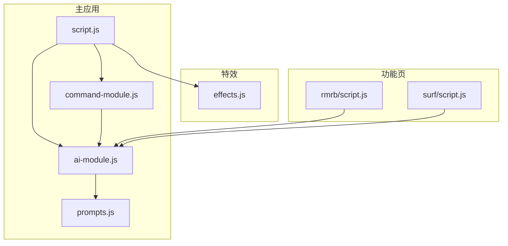
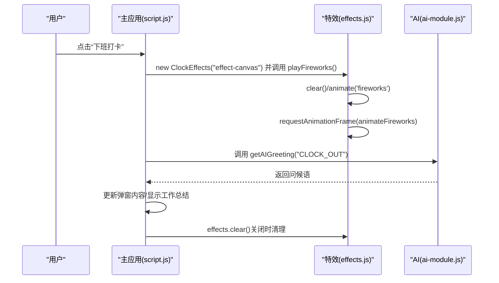
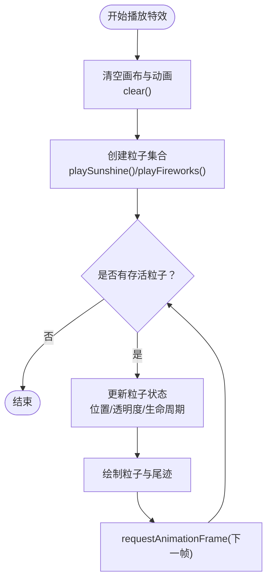
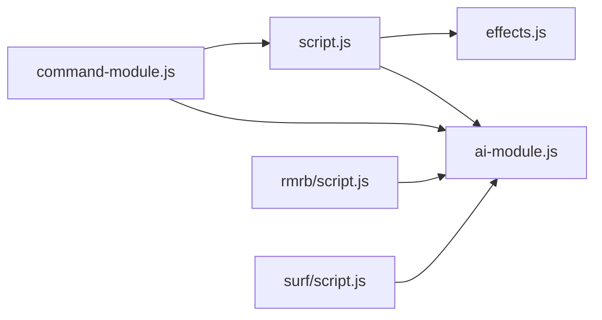

# 性能优化规范

<cite>
**本文引用的文件**
- [script.js](file://script.js)
- [effects.js](file://effects.js)
- [ai-module.js](file://ai-module.js)
- [command-module.js](file://command-module.js)
- [rmrb/script.js](file://rmrb/script.js)
- [surf/script.js](file://surf/script.js)
- [prompts.js](file://prompts.js)
- [README.md](file://README.md)
</cite>

## 目录
1. [引言](#引言)
2. [项目结构](#项目结构)
3. [核心组件](#核心组件)
4. [架构总览](#架构总览)
5. [详细组件分析](#详细组件分析)
6. [依赖关系分析](#依赖关系分析)
7. [性能考量](#性能考量)
8. [故障排查指南](#故障排查指南)
9. [结论](#结论)
10. [附录](#附录)

## 引言
本规范围绕 Canvas 动画与 DOM 操作两大性能热点，结合仓库现有实现，提出可落地的优化策略与最佳实践，确保在低端设备上也能流畅运行。重点包括：
- Canvas 动画使用 requestAnimationFrame 替代 setInterval，及时清理不再使用的动画帧
- 控制视觉特效的粒子数量与绘制频率，避免页面卡顿
- 频繁 DOM 操作采用批量处理或文档片段，降低回流与重绘成本
- 性能监控建议：利用浏览器开发者工具定位瓶颈，持续优化

## 项目结构
该项目包含多个功能模块，其中与性能密切相关的模块包括：
- 主应用脚本：负责页面初始化、标签页切换、番茄钟、打卡流程、AI 交互等
- 打卡特效模块：基于 Canvas 实现阳光与礼花特效
- AI 模块：封装 DeepSeek API 调用与兜底策略
- 指令模块：自然语言指令理解与执行
- 新闻阅读模块：抓取与渲染新闻列表
- 网上冲浪模块：热搜榜单拉取与渲染
- 提示词与兜底文案：统一管理 AI 提示词与兜底内容

图表来源
- [script.js](file://script.js#L540-L730)
- [effects.js](file://effects.js#L1-L279)
- [ai-module.js](file://ai-module.js#L1-L216)
- [command-module.js](file://command-module.js#L1-L313)
- [rmrb/script.js](file://rmrb/script.js#L1-L474)
- [surf/script.js](file://surf/script.js#L1-L231)
- [prompts.js](file://prompts.js#L1-L159)

章节来源
- [README.md](file://README.md#L50-L56)

## 核心组件
- Canvas 打卡特效模块：提供阳光与礼花两类特效，使用 requestAnimationFrame 驱动动画循环，并在 clear 时取消动画，避免资源泄漏
- 主应用脚本：包含番茄钟定时器（使用 setInterval）、打卡流程中的 DOM 更新、Toast 提示等
- AI 模块：封装 DeepSeek API 调用，提供兜底策略，避免因网络波动导致的阻塞
- 指令模块：自然语言指令解析与执行，触发主应用中的 UI 交互
- 新闻与热搜模块：异步拉取数据并渲染，注意请求节流与 DOM 批量更新

章节来源
- [effects.js](file://effects.js#L1-L279)
- [script.js](file://script.js#L356-L414)
- [ai-module.js](file://ai-module.js#L1-L216)
- [command-module.js](file://command-module.js#L1-L313)
- [rmrb/script.js](file://rmrb/script.js#L1-L231)
- [surf/script.js](file://surf/script.js#L1-L231)

## 架构总览
下面的序列图展示了“下班打卡”路径中特效与 DOM 更新的调用链，以及与 AI 模块的交互。

图表来源
- [script.js](file://script.js#L690-L730)
- [effects.js](file://effects.js#L64-L86)
- [effects.js](file://effects.js#L203-L260)
- [ai-module.js](file://ai-module.js#L61-L93)

## 详细组件分析

### Canvas 动画与特效优化
- requestAnimationFrame 使用情况
  - 阳光与礼花动画均通过 requestAnimationFrame 驱动，避免使用 setInterval 导致的掉帧与累积误差
  - 在 clear 或组件销毁时，调用 cancelAnimationFrame 清理动画帧，防止后台继续绘制
- 粒子数量与绘制频率
  - 阳光特效创建约 100 个粒子，礼花特效创建约 80 个外层粒子与 20 个内核粒子，整体数量适中
  - 动画循环中对粒子进行过滤与更新，仅保留存活粒子，避免无限增长
- 清理策略
  - clear 中同时清空 ctx、重置 particles 数组，并取消动画
  - 关闭弹窗或切换标签页时，确保调用 clear，避免残留绘制

图表来源
- [effects.js](file://effects.js#L262-L273)
- [effects.js](file://effects.js#L135-L142)
- [effects.js](file://effects.js#L144-L201)
- [effects.js](file://effects.js#L203-L260)

章节来源
- [effects.js](file://effects.js#L1-L279)

### DOM 操作与批量更新
- 频繁 DOM 更新场景
  - 打卡弹窗内容更新、Toast 提示、新闻列表渲染、热搜列表渲染等
- 优化建议
  - 使用文档片段或一次性 innerHTML 赋值，减少多次 DOM 写入
  - 对列表渲染采用模板拼接或文档片段，避免逐项 appendChild
  - 控制弹窗与模态框的显示/隐藏，避免频繁切换导致的布局抖动
- 现状与改进建议
  - 新闻与热搜模块在渲染列表时存在多次 DOM 写入，建议合并为一次赋值
  - Toast 提示可通过统一的容器批量管理，减少重复创建与销毁

章节来源
- [rmrb/script.js](file://rmrb/script.js#L236-L264)
- [surf/script.js](file://surf/script.js#L90-L171)
- [script.js](file://script.js#L133-L155)

### 定时器与动画帧管理
- 现状
  - 番茄钟使用 setInterval 每秒更新，建议改为 requestAnimationFrame 驱动的计时器，以减少掉帧风险
  - 主应用中存在每分钟更新按钮状态的定时器，建议在可见性变化时暂停或合并更新
- 优化建议
  - 使用 requestAnimationFrame + 高精度时间戳实现更平滑的倒计时
  - 在页面不可见时暂停动画与定时器，恢复可见后再继续
  - 对高频定时任务进行节流或合并更新

章节来源
- [script.js](file://script.js#L356-L414)
- [script.js](file://script.js#L540-L545)

### AI 交互与性能
- 现状
  - AI 模块提供兜底策略，避免网络异常导致的阻塞
  - 指令模块对低置信度的聊天请求采用“仅聊天不执行”的策略，减少不必要的 UI 更新
- 优化建议
  - 对 AI 请求增加超时与重试策略，避免长时间阻塞主线程
  - 对返回内容进行必要的裁剪与缓存，减少重复渲染
  - 在移动端或低端设备上，适当降低 AI 生成内容的长度与复杂度

章节来源
- [ai-module.js](file://ai-module.js#L1-L216)
- [command-module.js](file://command-module.js#L185-L259)
- [prompts.js](file://prompts.js#L1-L159)

## 依赖关系分析
- 主应用脚本依赖特效模块与 AI 模块，用于打卡时的视觉反馈与内容生成
- 指令模块通过调用主应用中的按钮点击事件，间接驱动 UI 更新
- 新闻与热搜模块依赖 AI 模块进行内容分析与渲染

图表来源
- [script.js](file://script.js#L540-L730)
- [effects.js](file://effects.js#L1-L279)
- [ai-module.js](file://ai-module.js#L1-L216)
- [command-module.js](file://command-module.js#L1-L313)
- [rmrb/script.js](file://rmrb/script.js#L1-L474)
- [surf/script.js](file://surf/script.js#L1-L231)

## 性能考量
- Canvas 动画
  - 使用 requestAnimationFrame 替代 setInterval，确保动画与屏幕刷新率同步
  - 控制粒子数量与绘制复杂度，避免在低端设备上出现掉帧
  - 在 clear 时取消动画帧，防止后台持续绘制
- DOM 操作
  - 批量更新 DOM，避免频繁的 appendChild 与样式查询
  - 使用 CSS 动画与 transform 代替频繁的布局属性变更
- 定时器与可见性
  - 页面不可见时暂停动画与定时器，恢复可见后再继续
  - 对高频定时任务进行节流或合并更新
- 网络与渲染
  - 对 AI 请求增加超时与重试，必要时启用缓存
  - 控制渲染内容长度，避免大文本渲染造成卡顿

[本节为通用指导，无需列出具体文件来源]

## 故障排查指南
- 现象：页面卡顿或掉帧
  - 检查是否存在过多的 setInterval 定时器，优先迁移到 requestAnimationFrame
  - 确认特效模块在关闭时调用了 clear，避免残留动画
  - 使用浏览器开发者工具的性能面板，观察帧耗时与垃圾回收
- 现象：DOM 更新缓慢
  - 检查列表渲染是否采用一次性赋值，避免多次 appendChild
  - 确认弹窗与模态框的显示/隐藏逻辑，避免频繁切换导致布局抖动
- 现象：AI 请求阻塞
  - 检查是否设置了合理的超时与重试
  - 对返回内容进行裁剪与缓存，减少重复渲染

章节来源
- [effects.js](file://effects.js#L262-L273)
- [script.js](file://script.js#L356-L414)
- [rmrb/script.js](file://rmrb/script.js#L236-L264)
- [ai-module.js](file://ai-module.js#L1-L216)

## 结论
本规范基于仓库现有实现，提出了针对 Canvas 动画与 DOM 操作的优化策略。通过使用 requestAnimationFrame、控制粒子数量、批量 DOM 更新、合理管理定时器与可见性，以及为 AI 交互提供兜底与节流机制，可以在保证用户体验的同时，显著提升低端设备上的运行流畅度。

[本节为总结性内容，无需列出具体文件来源]

## 附录
- 性能监控建议
  - 使用浏览器开发者工具的性能面板，录制关键操作（如打开特效、切换标签页、渲染列表），观察帧耗时与内存占用
  - 关注垃圾回收与主线程阻塞，定位掉帧与卡顿根因
  - 在移动端模拟低端设备，验证优化效果

[本节为通用指导，无需列出具体文件来源]