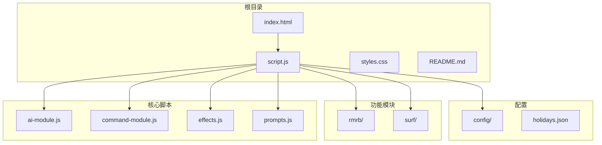
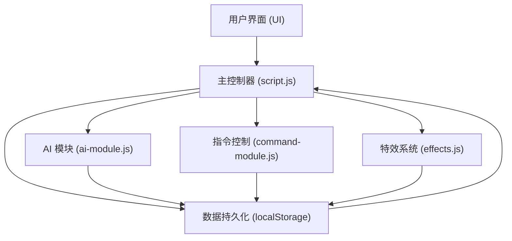
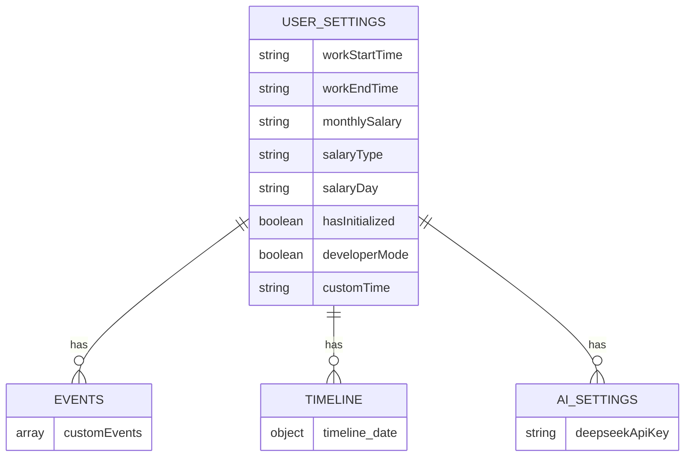
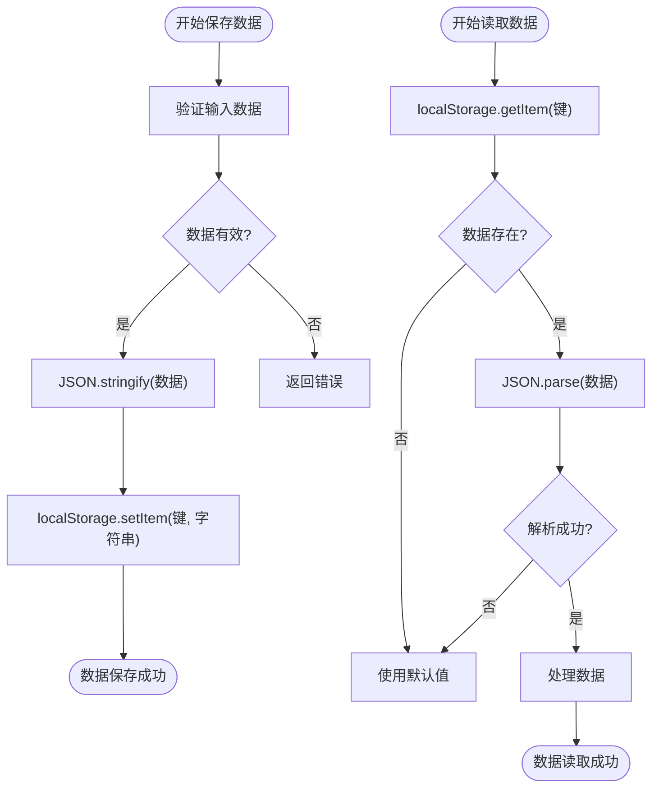
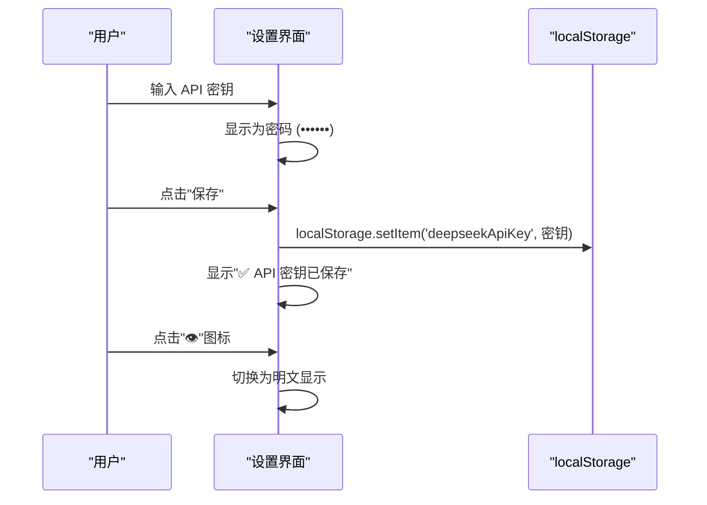
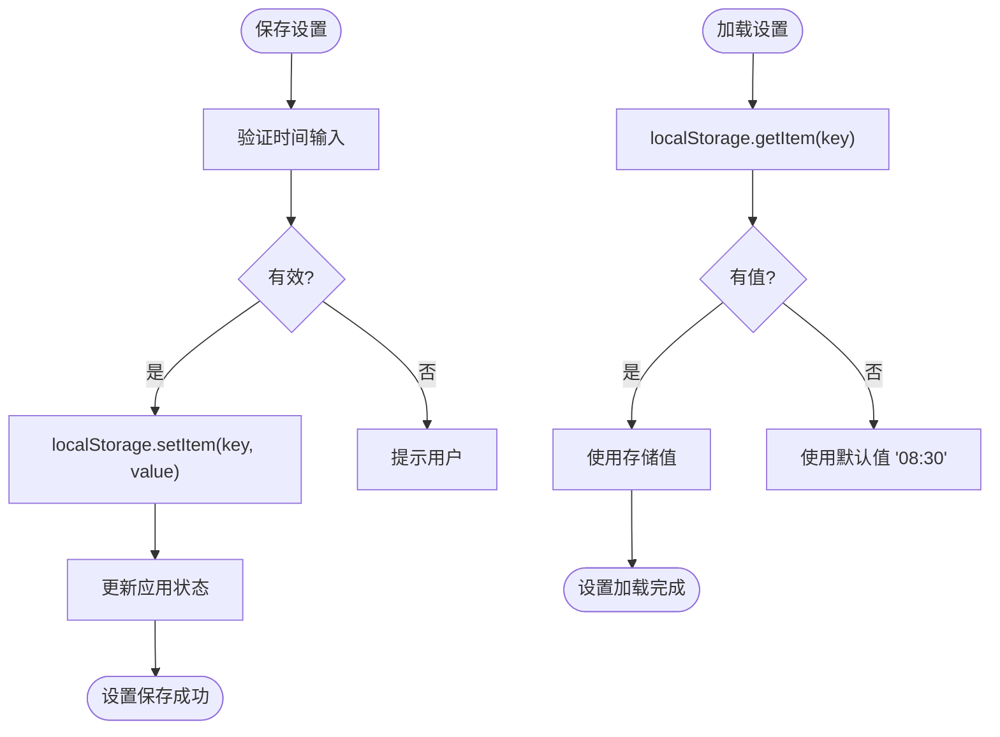
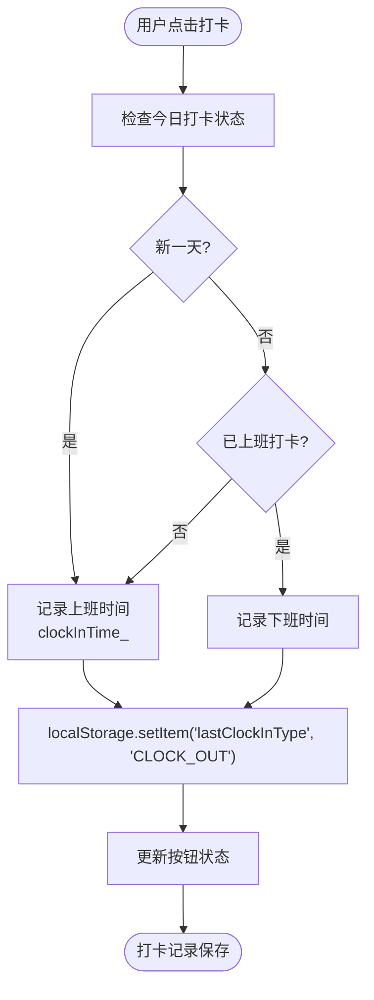
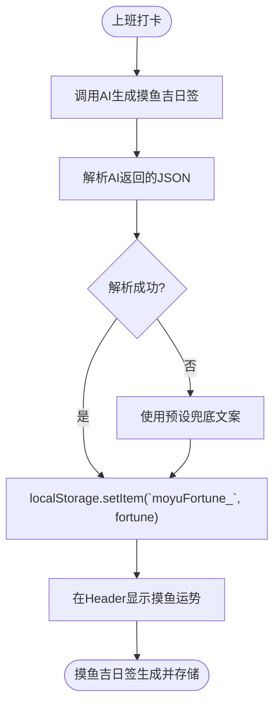
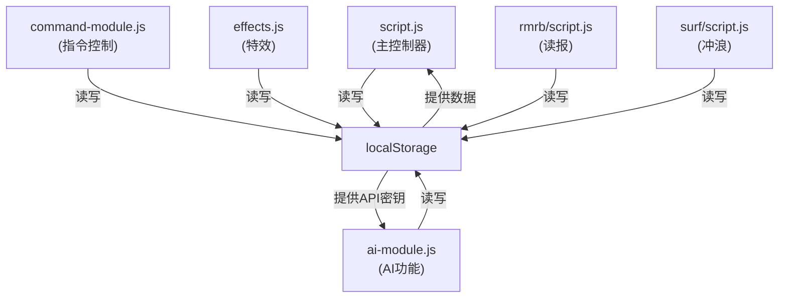

# 数据持久化规范

<cite>
**本文档引用的文件**   
- [script.js](file://script.js)
- [ai-module.js](file://ai-module.js)
- [prompts.js](file://prompts.js)
- [effects.js](file://effects.js)
- [command-module.js](file://command-module.js)
- [rmrb/script.js](file://rmrb/script.js)
- [surf/script.js](file://surf/script.js)
</cite>

## 目录
1. [引言](#引言)
2. [项目结构](#项目结构)
3. [核心组件](#核心组件)
4. [架构概述](#架构概述)
5. [详细组件分析](#详细组件分析)
6. [依赖分析](#依赖分析)
7. [性能考虑](#性能考虑)
8. [故障排除指南](#故障排除指南)
9. [结论](#结论)

## 引言

本规范旨在为 Work Timer 应用中的 localStorage 数据持久化操作建立统一标准。通过明确键名命名规范、数据结构设计、数据验证机制和安全存储要求，确保数据的可靠性、可维护性和安全性。特别针对用户设置、打卡记录、摸鱼吉日签等核心功能的数据存储，提供最佳实践指导。

## 项目结构

Work Timer 项目是一个集时间管理、假期倒计时、AI 互动和娱乐功能于一体的综合性 Web 应用。其结构清晰，主要功能模块分离。

**图源**
- [script.js](file://script.js#L1-L1345)
- [README.md](file://README.md#L1-L125)

## 核心组件

应用的核心数据持久化围绕 `localStorage` 展开，主要涉及用户工作时间配置、打卡状态、事件管理、AI 设置和时间轴记录。所有数据存储均通过 `JSON.stringify` 和 `JSON.parse` 进行序列化与反序列化，并在关键操作中包含数据验证和错误处理。

**组件源**
- [script.js](file://script.js#L1-L1345)
- [ai-module.js](file://ai-module.js#L1-L216)

## 架构概述

应用采用模块化架构，`script.js` 作为主控制器，负责初始化应用、管理全局状态和协调各功能模块。数据持久化是贯穿整个应用的基础能力，`localStorage` 被用作客户端的唯一数据存储。

**图源**
- [script.js](file://script.js#L1-L1345)
- [ai-module.js](file://ai-module.js#L1-L216)
- [command-module.js](file://command-module.js#L1-L313)
- [effects.js](file://effects.js#L1-L279)

## 详细组件分析

### 数据存储键名与结构分析

应用中的 `localStorage` 键名设计遵循语义化原则，清晰地反映了其存储内容。数据结构以 JSON 对象为主，便于序列化和反序列化。

#### 键名命名规范
- **用户配置类**：使用描述性名称，如 `workStartTime`, `monthlySalary`。
- **状态标记类**：使用布尔值标记，如 `hasInitialized`, `developerMode`。
- **复杂数据类**：使用复数名词或带前缀的名称，如 `customEvents`, `timeline_${date}`。
- **AI 相关类**：带有明确前缀，如 `deepseekApiKey`, `moyuFortune_${date}`。

#### 核心数据结构
- **工作时间配置**：存储为字符串（如 `"08:30"`），并在应用启动时解析为数字配置对象 `workTimeConfig`。
- **事件数据**：`customEvents` 存储为事件对象数组，每个事件包含 `date`, `type`, `title` 等属性。
- **时间轴数据**：`timeline_${date}` 存储为每日事件数组，每个事件包含 `id`, `time`, `type`, `content` 等。
- **AI 设置**：`deepseekApiKey` 以字符串形式存储 API 密钥。

**图源**
- [script.js](file://script.js#L3-L13)
- [script.js](file://script.js#L1325-L1344)
- [script.js](file://script.js#L19-L33)
- [ai-module.js](file://ai-module.js#L15)

**组件源**
- [script.js](file://script.js#L1-L1345)

### 数据验证与类型检查分析

应用在数据存储和读取过程中实施了基本的数据验证和类型检查，确保数据的完整性和正确性。

#### 数据验证实践
- **输入验证**：在保存工作时间设置时，调用 `validateTimeSettings()` 函数检查时间逻辑的合理性。
- **默认值回退**：在读取数据时，使用逻辑或操作符 `||` 提供默认值，例如 `localStorage.getItem('workStartTime') || '08:30'`，防止因数据缺失导致应用崩溃。
- **数据类型转换**：在解析时间字符串时，使用 `parseInt()` 将字符串转换为数字，确保 `workTimeConfig` 对象中的值为正确类型。

#### JSON 序列化与反序列化
- **序列化**：使用 `JSON.stringify()` 将 JavaScript 对象（如 `todayTimeline`, `customEvents`）转换为字符串后存储。
- **反序列化**：使用 `JSON.parse()` 将存储的字符串转换回 JavaScript 对象。此过程被包裹在 `try-catch` 块中，以处理潜在的解析错误，例如在 `ai-module.js` 的 `getMoyuFortune()` 函数中。

**图源**
- [script.js](file://script.js#L194-L196)
- [script.js](file://script.js#L3-L13)
- [ai-module.js](file://ai-module.js#L107-L117)

**组件源**
- [script.js](file://script.js#L1-L1345)
- [ai-module.js](file://ai-module.js#L1-L216)

### 敏感数据存储安全分析

应用涉及敏感数据——DeepSeek AI 的 API 密钥。其存储和处理方式体现了基本的安全意识。

#### 安全措施
- **禁止明文存储**：虽然密钥以字符串形式存储在 `localStorage` 中，但应用提供了切换显示/隐藏的功能（通过改变 `<input>` 元素的 `type` 属性），默认以密码形式（`type="password"`）显示，防止密钥被轻易窥视。
- **安全提示**：在设置界面，通过视觉反馈（绿色勾号、红色警告）告知用户密钥的保存状态，增强用户的安全意识。

#### 安全风险
- **localStorage 本身不安全**：`localStorage` 的数据对同源脚本完全可见，存在 XSS 攻击风险。最佳实践是避免在客户端存储此类敏感凭证，或采用更安全的方案（如后端代理）。

**图源**
- [script.js](file://script.js#L455)
- [script.js](file://script.js#L439-L446)

**组件源**
- [script.js](file://script.js#L424-L490)

### 用户设置、打卡记录与摸鱼吉日签代码示例分析

以下代码示例展示了如何正确实现数据的保存和读取，体现了数据校验和异常处理的最佳实践。

#### 保存和读取用户设置

**组件源**
- [script.js](file://script.js#L187-L223)
- [script.js](file://script.js#L1067-L1071)

#### 保存和读取打卡记录

**组件源**
- [script.js](file://script.js#L547-L727)
- [script.js](file://script.js#L626-L632)

#### 生成和存储摸鱼吉日签

**组件源**
- [script.js](file://script.js#L638-L679)
- [ai-module.js](file://ai-module.js#L99-L126)
- [prompts.js](file://prompts.js#L4-L25)

## 依赖分析

应用的各个模块通过全局对象和事件进行通信，`localStorage` 是所有模块共享的数据中心。

**图源**
- [script.js](file://script.js#L1-L1345)
- [ai-module.js](file://ai-module.js#L1-L216)
- [command-module.js](file://command-module.js#L1-L313)

## 性能考虑

- **数据量控制**：应用主要存储轻量级配置和文本数据，`localStorage` 的 5-10MB 限制足以满足需求。
- **序列化开销**：`JSON.stringify/parse` 对于小数据量的性能影响可以忽略不计。
- **避免频繁读写**：应用在初始化时批量读取数据，在用户操作时才进行写入，避免了不必要的性能损耗。

## 故障排除指南

- **数据丢失**：用户点击“清除缓存”按钮会调用 `localStorage.clear()`，导致所有数据丢失。建议增加二次确认对话框。
- **数据解析错误**：如果 `localStorage` 中的 JSON 字符串损坏，`JSON.parse()` 会抛出异常。应用通过提供默认值和兜底数据（如 `FALLBACK_MESSAGES`）来保证功能可用性。
- **敏感信息泄露**：提醒用户 `localStorage` 并非安全存储，建议不要在公共电脑上使用或定期清理。

**组件源**
- [script.js](file://script.js#L137-L153)
- [ai-module.js](file://ai-module.js#L119-L126)

## 结论

Work Timer 应用的 `localStorage` 数据持久化设计整体合理，遵循了基本的命名规范和数据处理原则。通过提供默认值和兜底方案，增强了应用的健壮性。在敏感数据处理上，虽然采取了显示隐藏等措施，但仍需认识到 `localStorage` 的固有安全风险。未来可考虑引入后端服务进行数据同步和安全存储，以提供更高级别的数据保护和跨设备体验。