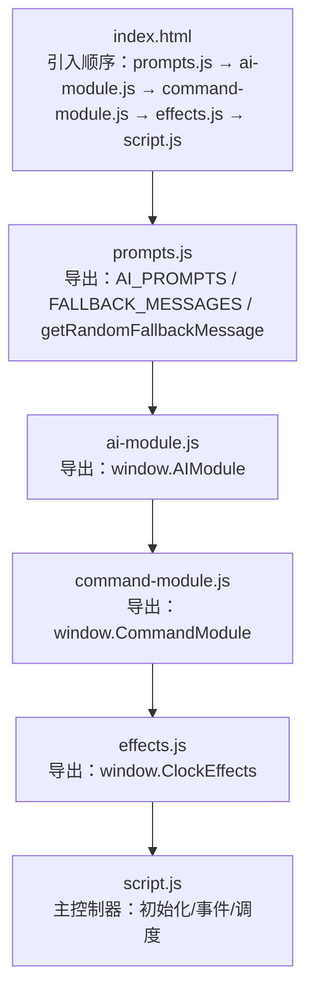
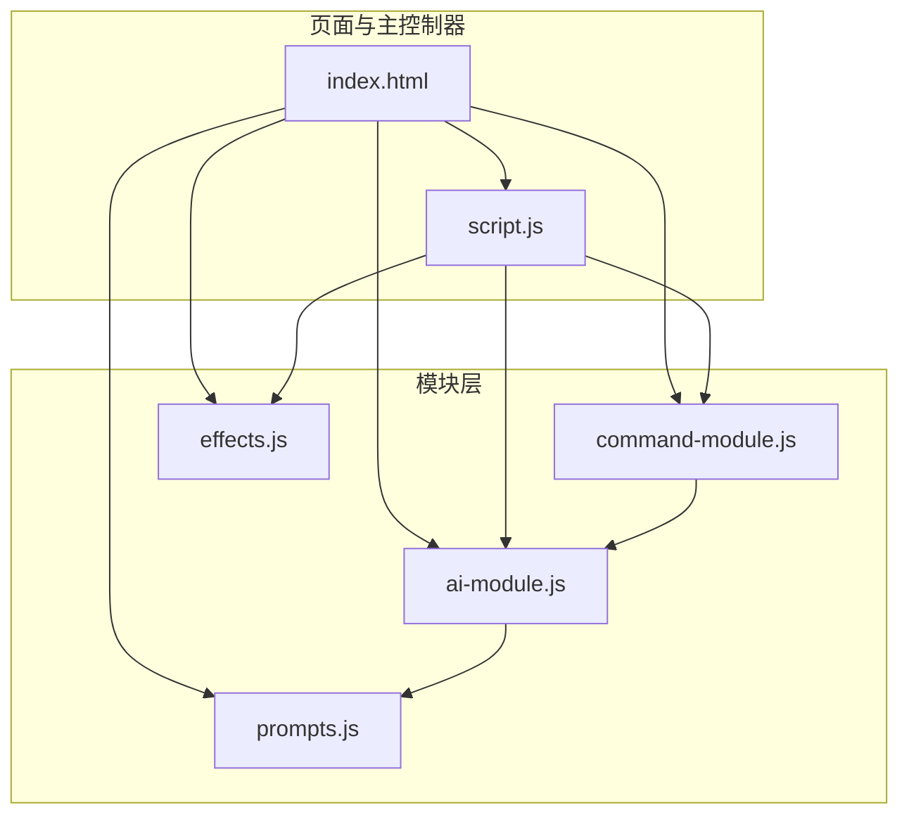
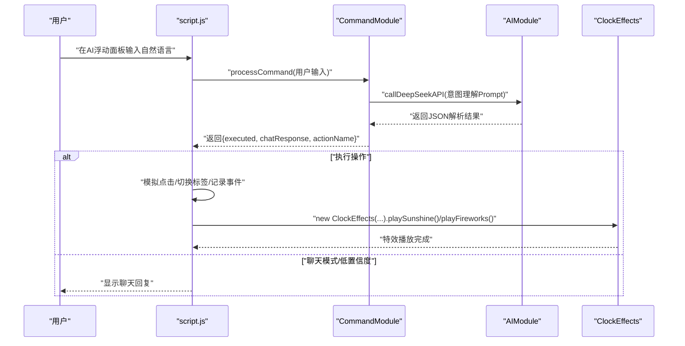
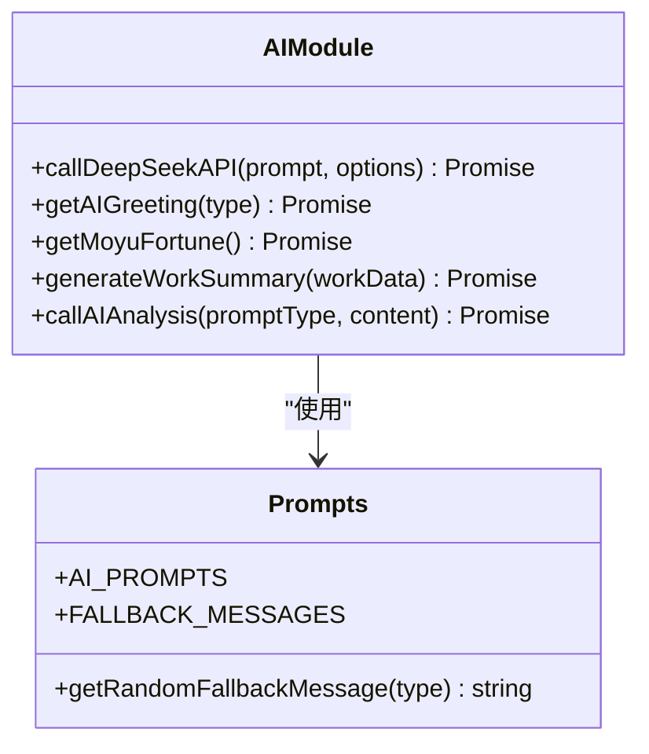
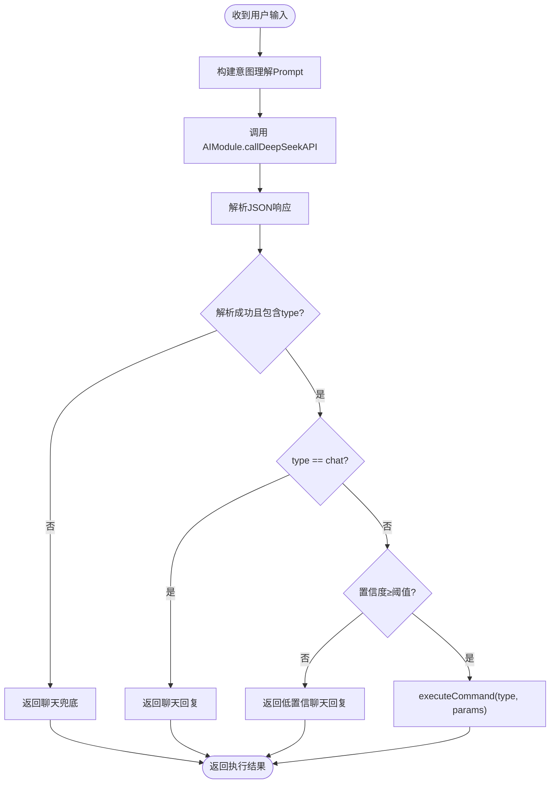
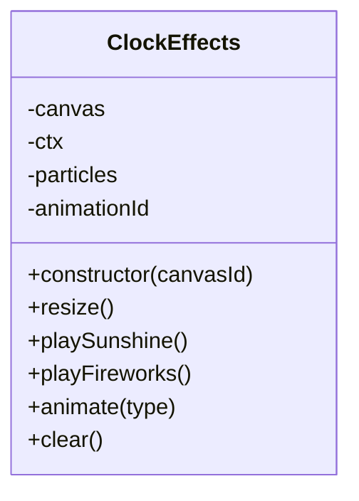
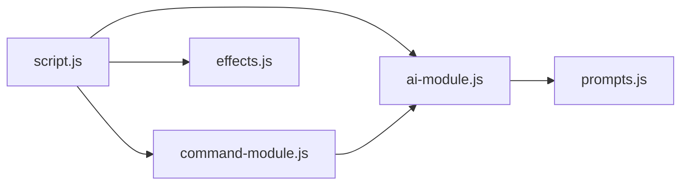

# 模块架构规范

<cite>
**本文引用的文件**
- [index.html](file://index.html)
- [script.js](file://script.js)
- [ai-module.js](file://ai-module.js)
- [command-module.js](file://command-module.js)
- [effects.js](file://effects.js)
- [prompts.js](file://prompts.js)
- [README.md](file://README.md)
</cite>

## 目录
1. [简介](#简介)
2. [项目结构](#项目结构)
3. [核心组件](#核心组件)
4. [架构总览](#架构总览)
5. [详细组件分析](#详细组件分析)
6. [依赖关系分析](#依赖关系分析)
7. [性能考量](#性能考量)
8. [故障排查指南](#故障排查指南)
9. [结论](#结论)
10. [附录](#附录)

## 简介
本规范旨在定义项目模块化架构标准，明确各核心模块的职责边界与交互方式，确保代码可维护性与可测试性。依据仓库现状，项目采用“主控制器 + 模块化子系统”的组织方式：
- 主控制器：script.js 作为全局协调者，负责页面初始化、标签页切换、事件绑定、AI与特效集成、以及与命令模块的交互。
- AI模块：ai-module.js 专门处理 DeepSeek API 调用与 AI 功能封装，通过 window.AIModule 暴露统一接口。
- 命令模块：command-module.js 负责自然语言指令解析与意图判断，通过 window.CommandModule 暴露统一接口。
- 视觉特效：effects.js 封装 Canvas 视觉特效，通过 window.ClockEffects 暴露类构造器。
- 提示词与兜底：prompts.js 统一管理 AI Prompt 与兜底文案，通过 window.AI_PROMPTS、window.FALLBACK_MESSAGES、window.getRandomFallbackMessage 暴露。

为避免全局变量污染，所有模块均通过 window 对象对外暴露接口；同时，主控制器 script.js 在 DOMContentLoaded 时完成初始化与事件绑定，形成清晰的控制流。

## 项目结构
项目采用“页面 + 模块脚本”的结构，index.html 中按顺序引入模块脚本，确保全局命名空间初始化顺序可控。

图表来源
- [index.html](file://index.html#L1-L12)
- [prompts.js](file://prompts.js#L120-L159)
- [ai-module.js](file://ai-module.js#L206-L216)
- [command-module.js](file://command-module.js#L305-L313)
- [effects.js](file://effects.js#L275-L279)
- [script.js](file://script.js#L95-L155)

章节来源
- [index.html](file://index.html#L1-L12)
- [README.md](file://README.md#L90-L120)

## 核心组件
- 主控制器（script.js）
  - 职责：页面生命周期管理、标签页与侧边栏初始化、番茄钟、AI设置、打卡流程、时间轴、快捷功能、日历事件、开发者模式、全局提示等。
  - 关键点：DOMContentLoaded 时初始化；通过 window.AIModule 与 window.CommandModule 协调 AI 与自然语言指令；通过 window.ClockEffects 控制 Canvas 特效。
- AI模块（ai-module.js）
  - 职责：DeepSeek API 调用封装、问候语生成、摸鱼吉日签、工作总结、通用分析调用；提供兜底策略。
  - 关键点：通过 window.AIModule 暴露统一接口；依赖 window.AI_PROMPTS 与 window.FALLBACK_MESSAGES。
- 命令模块（command-module.js）
  - 职责：自然语言指令理解与执行，意图判断与聊天模式分流，低置信度转聊天。
  - 关键点：通过 window.CommandModule 暴露统一接口；依赖 window.AIModule 进行 API 调用。
- 视觉特效（effects.js）
  - 职责：Canvas 全屏特效（阳光/礼花），粒子系统与动画循环。
  - 关键点：通过 window.ClockEffects 暴露类；在打卡弹窗中实例化并播放特效。
- 提示词与兜底（prompts.js）
  - 职责：集中管理 AI Prompt 与兜底文案，提供随机兜底消息选择器。
  - 关键点：通过 window.AI_PROMPTS、window.FALLBACK_MESSAGES、window.getRandomFallbackMessage 暴露。

章节来源
- [script.js](file://script.js#L95-L155)
- [ai-module.js](file://ai-module.js#L1-L216)
- [command-module.js](file://command-module.js#L1-L313)
- [effects.js](file://effects.js#L1-L279)
- [prompts.js](file://prompts.js#L1-L159)

## 架构总览
下图展示了模块间的依赖与调用关系，以及主控制器的协调作用。

图表来源
- [index.html](file://index.html#L1-L12)
- [script.js](file://script.js#L95-L155)
- [ai-module.js](file://ai-module.js#L206-L216)
- [command-module.js](file://command-module.js#L305-L313)
- [effects.js](file://effects.js#L275-L279)
- [prompts.js](file://prompts.js#L120-L159)

## 详细组件分析

### 主控制器（script.js）职责与交互
- 页面初始化
  - DOMContentLoaded 时加载时间轴、检查首次设置、初始化标签页/侧边栏/番茄钟/AI设置/打卡/时间轴/命令控制/快捷功能/日历事件等。
- 打卡流程
  - 初始化打卡按钮状态与定时更新；根据类型（上班/下班/已完成）分别生成问候语、摸鱼吉日签或工作总结；播放对应特效；记录时间轴事件。
- AI设置
  - 保存/测试 DeepSeek API Key；通过 window.AIModule.getAIGreeting 验证连通性。
- 自然语言交互
  - AI浮动面板监听输入，调用 window.CommandModule.processCommand 进行意图判断与执行；根据结果展示聊天回复或执行状态。
- 工作总结
  - 下班时调用 window.AIModule.generateWorkSummary 生成总结并渲染到弹窗。

图表来源
- [script.js](file://script.js#L990-L1030)
- [command-module.js](file://command-module.js#L182-L259)
- [ai-module.js](file://ai-module.js#L148-L205)
- [effects.js](file://effects.js#L25-L141)

章节来源
- [script.js](file://script.js#L95-L155)
- [script.js](file://script.js#L493-L732)
- [script.js](file://script.js#L990-L1030)
- [script.js](file://script.js#L3100-L3151)

### AI模块（ai-module.js）职责与接口
- 职责
  - DeepSeek API 调用封装（callDeepSeekAPI）。
  - 问候语生成（getAIGreeting）。
  - 摸鱼吉日签（getMoyuFortune）与工作总结（generateWorkSummary）。
  - 通用分析（callAIAnalysis）。
  - 兜底策略：解析失败时返回兜底文案，错误时返回兜底消息。
- 接口暴露
  - window.AIModule 包含：callDeepSeekAPI、getAIGreeting、getMoyuFortune、generateWorkSummary、callAIAnalysis。
- 依赖
  - 依赖 window.AI_PROMPTS 与 window.FALLBACK_MESSAGES。

图表来源
- [ai-module.js](file://ai-module.js#L1-L216)
- [prompts.js](file://prompts.js#L1-L159)

章节来源
- [ai-module.js](file://ai-module.js#L1-L216)
- [prompts.js](file://prompts.js#L1-L159)

### 命令模块（command-module.js）职责与接口
- 职责
  - 自然语言指令理解：基于 Prompt 判断操作意图与置信度。
  - 执行动作：根据意图触发按钮点击、标签页切换、记录摸鱼事件等。
  - 聊天模式：低置信度或闲聊场景返回友好回复。
- 接口暴露
  - window.CommandModule 包含：processCommand、executeCommand、COMMAND_TYPES。
- 依赖
  - 依赖 window.AIModule 进行意图理解与 API 调用。

图表来源
- [command-module.js](file://command-module.js#L182-L259)
- [command-module.js](file://command-module.js#L74-L181)

章节来源
- [command-module.js](file://command-module.js#L1-L313)

### 视觉特效（effects.js）职责与接口
- 职责
  - Canvas 全屏特效：上班打卡（阳光）与下班打卡（礼花）两种模式。
  - 粒子系统与 requestAnimationFrame 动画循环。
- 接口暴露
  - window.ClockEffects：类构造器，提供 playSunshine、playFireworks、clear 等方法。
- 使用方式
  - 在打卡弹窗中实例化 ClockEffects('effect-canvas') 并调用对应特效方法。

图表来源
- [effects.js](file://effects.js#L1-L279)

章节来源
- [effects.js](file://effects.js#L1-L279)

### 提示词与兜底（prompts.js）
- 职责
  - 统一管理 AI Prompt（MOYU_FORTUNE、WORK_SUMMARY、NEWS_ANALYSIS）。
  - 提供兜底文案（MOYU_FORTUNE、WORK_SUMMARY、NEWS_ANALYSIS）。
  - 提供随机兜底消息选择器。
- 接口暴露
  - window.AI_PROMPTS、window.FALLBACK_MESSAGES、window.getRandomFallbackMessage。

章节来源
- [prompts.js](file://prompts.js#L1-L159)

## 依赖关系分析
- 引入顺序
  - index.html 中按顺序引入：prompts.js → ai-module.js → command-module.js → effects.js → script.js，确保 window 对象在各模块中可用。
- 运行时依赖
  - script.js 依赖 window.AIModule、window.CommandModule、window.ClockEffects。
  - ai-module.js 依赖 window.AI_PROMPTS、window.FALLBACK_MESSAGES。
  - command-module.js 依赖 window.AIModule。
- 耦合与内聚
  - 主控制器承担协调职责，模块间通过 window 接口松耦合；AI与命令模块通过统一的 AIModule 接口交互，降低直接耦合。
- 循环依赖
  - 无循环依赖：模块通过 window 单向暴露接口，主控制器统一调度。

图表来源
- [index.html](file://index.html#L1-L12)
- [script.js](file://script.js#L95-L155)
- [ai-module.js](file://ai-module.js#L206-L216)
- [command-module.js](file://command-module.js#L305-L313)
- [effects.js](file://effects.js#L275-L279)
- [prompts.js](file://prompts.js#L120-L159)

章节来源
- [index.html](file://index.html#L1-L12)
- [script.js](file://script.js#L95-L155)

## 性能考量
- Canvas 动画
  - 使用 requestAnimationFrame 控制帧率，减少主线程压力；粒子数量与重力/摩擦参数平衡视觉与性能。
- API 调用
  - 通过温度与最大 Token 参数控制响应稳定性与长度；对解析失败与网络异常进行兜底，避免阻塞 UI。
- 事件绑定与定时器
  - 主控制器集中管理定时器与事件绑定，避免重复绑定导致的性能损耗。
- 模块初始化
  - 通过 window 对象延迟暴露接口，确保按顺序加载，减少运行时查找成本。

[本节为通用指导，无需特定文件引用]

## 故障排查指南
- API 密钥未配置
  - 现象：调用 AIModule 时抛出“未配置 API 密钥”错误。
  - 处理：在设置页保存 DeepSeek API Key，并使用“测试连接”验证。
  - 参考路径
    - [ai-module.js](file://ai-module.js#L14-L25)
    - [script.js](file://script.js#L424-L491)
- 摸鱼吉日签解析失败
  - 现象：AI 返回非 JSON 文本，解析失败。
  - 处理：模块自动降级为兜底文案，可在 UI 中重试“再求一签”。
  - 参考路径
    - [ai-module.js](file://ai-module.js#L95-L133)
    - [prompts.js](file://prompts.js#L120-L159)
- 工作总结生成异常
  - 现象：生成失败时返回兜底文案。
  - 处理：检查网络与 API Key；稍后重试。
  - 参考路径
    - [ai-module.js](file://ai-module.js#L134-L167)
    - [script.js](file://script.js#L3100-L3151)
- 自然语言指令未执行
  - 现象：低置信度或闲聊场景仅聊天。
  - 处理：调整表达或确认操作时机（如未到下班时间无法执行下班打卡）。
  - 参考路径
    - [command-module.js](file://command-module.js#L182-L259)
- 特效不显示或卡顿
  - 现象：Canvas 未渲染或动画卡顿。
  - 处理：检查 canvas 元素是否存在、窗口尺寸变化事件是否生效；减少同时运行的动画。
  - 参考路径
    - [effects.js](file://effects.js#L1-L141)
    - [effects.js](file://effects.js#L262-L279)

章节来源
- [ai-module.js](file://ai-module.js#L14-L25)
- [script.js](file://script.js#L424-L491)
- [ai-module.js](file://ai-module.js#L95-L167)
- [script.js](file://script.js#L3100-L3151)
- [command-module.js](file://command-module.js#L182-L259)
- [effects.js](file://effects.js#L1-L141)
- [effects.js](file://effects.js#L262-L279)

## 结论
本项目通过“主控制器 + 模块化子系统”的架构实现了清晰的职责分离与稳定的模块交互。script.js 作为全局协调者，通过 window 对象统一调度 AI、命令与特效模块，既避免了全局变量污染，又提升了可维护性与可测试性。建议在后续迭代中：
- 保持模块接口通过 window 暴露，避免直接依赖 DOM 或全局变量。
- 对关键流程（如打卡、AI分析）增加单元测试与集成测试。
- 优化 Canvas 动画参数与 API 调用策略，进一步提升性能与稳定性。

[本节为总结性内容，无需特定文件引用]

## 附录

### 模块接口一览（通过 window 暴露）
- window.AIModule
  - 方法：callDeepSeekAPI、getAIGreeting、getMoyuFortune、generateWorkSummary、callAIAnalysis
  - 用途：统一调用 DeepSeek API 与 AI 功能
  - 参考路径
    - [ai-module.js](file://ai-module.js#L206-L216)
- window.CommandModule
  - 方法：processCommand、executeCommand、COMMAND_TYPES
  - 用途：自然语言指令理解与执行
  - 参考路径
    - [command-module.js](file://command-module.js#L305-L313)
- window.ClockEffects
  - 类：ClockEffects
  - 方法：constructor、playSunshine、playFireworks、clear
  - 用途：Canvas 特效播放
  - 参考路径
    - [effects.js](file://effects.js#L275-L279)
- window.AI_PROMPTS / window.FALLBACK_MESSAGES / window.getRandomFallbackMessage
  - 用途：统一管理 Prompt 与兜底文案
  - 参考路径
    - [prompts.js](file://prompts.js#L120-L159)

### 模块间调用示例（路径指引）
- script.js 调用 CommandModule
  - 路径
    - [script.js](file://script.js#L990-L1030)
- script.js 调用 AIModule 生成问候语/摸鱼吉日签/工作总结
  - 路径
    - [script.js](file://script.js#L476-L491)
    - [script.js](file://script.js#L584-L615)
    - [script.js](file://script.js#L634-L690)
    - [script.js](file://script.js#L3100-L3151)
- script.js 实例化 ClockEffects 并播放特效
  - 路径
    - [script.js](file://script.js#L556-L568)
    - [script.js](file://script.js#L641-L646)
    - [script.js](file://script.js#L695-L698)
- command-module.js 调用 AIModule
  - 路径
    - [command-module.js](file://command-module.js#L188-L192)
- ai-module.js 使用 prompts.js
  - 路径
    - [ai-module.js](file://ai-module.js#L99-L105)
    - [ai-module.js](file://ai-module.js#L134-L147)