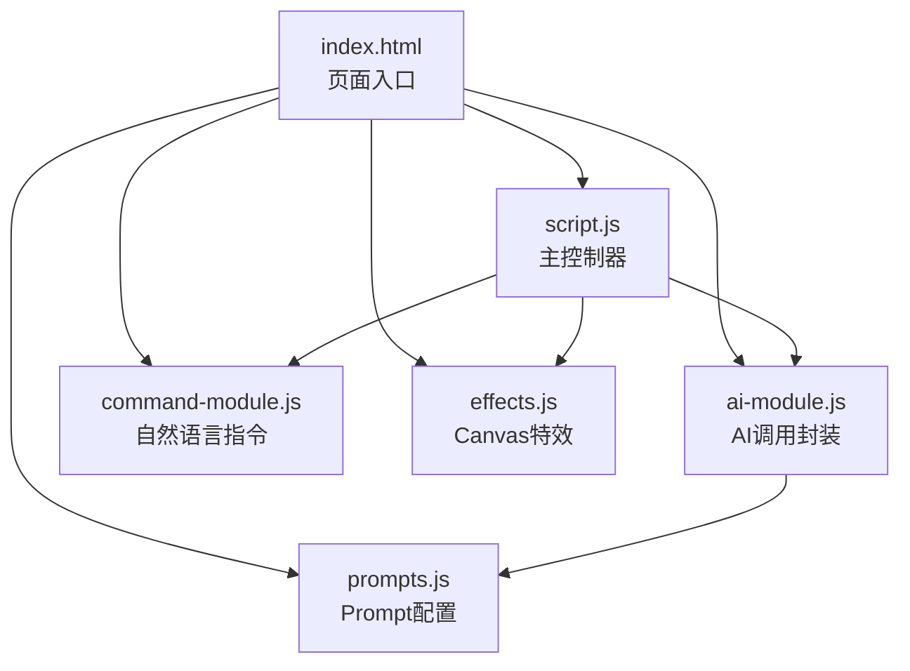
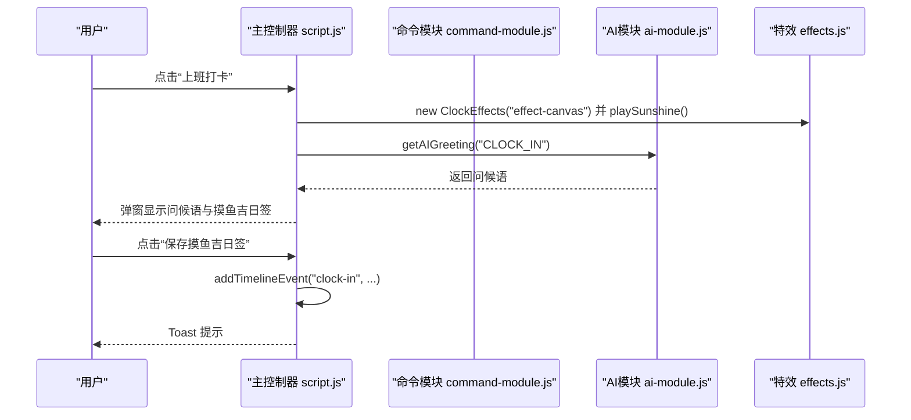
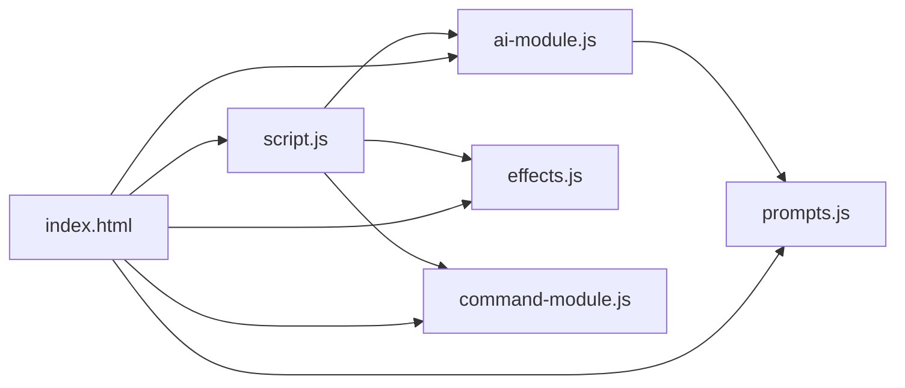

# 代码贡献规范

<cite>
**本文引用的文件**
- [script.js](file://script.js)
- [ai-module.js](file://ai-module.js)
- [effects.js](file://effects.js)
- [command-module.js](file://command-module.js)
- [prompts.js](file://prompts.js)
- [styles.css](file://styles.css)
- [index.html](file://index.html)
- [README.md](file://README.md)
</cite>

## 目录
1. [引言](#引言)
2. [项目结构](#项目结构)
3. [核心组件](#核心组件)
4. [架构总览](#架构总览)
5. [详细组件分析](#详细组件分析)
6. [依赖关系分析](#依赖关系分析)
7. [性能与安全性考量](#性能与安全性考量)
8. [故障排查指南](#故障排查指南)
9. [结论](#结论)
10. [附录：新增功能与最佳实践](#附录新增功能与最佳实践)

## 引言
本规范面向贡献者，明确本项目的 JavaScript 编码风格（ES6+ 模块化）、CSS 命名规范（BEM）、HTML 结构标准，以及核心模块的职责边界与协作方式。新增功能必须遵循现有架构模式，保持模块独立性与可维护性；同时强调对 localStorage 数据操作的安全性校验与 Canvas 动画的性能优化要求。

## 项目结构
项目采用“页面 + 多模块脚本”的组织方式：页面通过 HTML 引入多个独立模块脚本，模块之间通过全局命名空间暴露接口进行协作。核心模块包括：
- 主控制器：script.js（协调页面初始化、事件绑定、状态管理）
- AI 模块：ai-module.js（封装 DeepSeek API 调用与兜底策略）
- Canvas 特效：effects.js（打卡特效封装）
- 自然语言指令：command-module.js（意图识别与执行）
- Prompt 配置：prompts.js（统一管理 AI 提示词与兜底文案）

图表来源
- [index.html](file://index.html#L1-L120)
- [script.js](file://script.js#L90-L160)
- [ai-module.js](file://ai-module.js#L200-L216)
- [command-module.js](file://command-module.js#L300-L313)
- [effects.js](file://effects.js#L270-L279)
- [prompts.js](file://prompts.js#L140-L159)

章节来源
- [index.html](file://index.html#L1-L120)
- [README.md](file://README.md#L90-L125)

## 核心组件
- 主控制器 script.js
  - 职责：页面生命周期初始化、标签页与侧边栏切换、番茄钟、打卡流程、时间轴、开发者设置、AI 设置、日历事件、Toast 提示等。
  - 关键点：统一从 localStorage 读取/写入配置；对时间轴进行持久化；对开发者模式与自定义时间进行特殊处理。
- AI 模块 ai-module.js
  - 职责：封装 DeepSeek API 调用、参数配置、错误处理与兜底策略；提供问候语、摸鱼吉日签、工作总结、通用分析等接口。
  - 关键点：API Key 来源于 localStorage；对 JSON 解析失败与网络错误进行兜底；对外暴露 window.AIModule。
- Canvas 特效 effects.js
  - 职责：封装 Canvas 全屏粒子动画，提供“阳光特效”和“礼花特效”，并在窗口尺寸变化时自适应。
  - 关键点：使用 requestAnimationFrame 控制帧率；清理动画资源；区分粒子类型与渲染路径。
- 自然语言指令 command-module.js
  - 职责：将用户自然语言转换为结构化指令，进行意图判断与执行；对低置信度场景返回聊天回复。
  - 关键点：通过 AIModule.callDeepSeekAPI 获取结构化 JSON；根据 COMMAND_TYPES 执行对应动作；提供 getActionName 与 getTabName 辅助。

章节来源
- [script.js](file://script.js#L90-L160)
- [ai-module.js](file://ai-module.js#L1-L216)
- [effects.js](file://effects.js#L1-L279)
- [command-module.js](file://command-module.js#L1-L313)

## 架构总览
整体采用“页面 + 多模块脚本”的前端架构，模块间通过全局命名空间解耦协作。主控制器负责编排，AI 与特效模块提供能力扩展，命令模块负责自然语言到动作的映射。

图表来源
- [script.js](file://script.js#L540-L730)
- [effects.js](file://effects.js#L25-L62)
- [ai-module.js](file://ai-module.js#L61-L93)

## 详细组件分析

### 主控制器 script.js
- 页面初始化与生命周期
  - DOMContentLoaded 时加载时间轴、初始化标签页/侧边栏/番茄钟/AI 设置/打卡/时间轴/命令控制/快捷功能/日历事件。
  - 首次访问弹窗：保存工作时间、薪资与发薪日配置，写入 localStorage 并重新初始化应用。
- 打卡流程
  - 上班打卡：生成问候语、播放阳光特效、生成摸鱼吉日签、保存到 localStorage 与时间轴。
  - 下班打卡：播放礼花特效、生成工作总结、保存到时间轴。
- 开发者设置与自定义时间
  - 开启开发者模式后，自定义时间会影响“lastClockInDate”判定，从而重置当日打卡状态与时间轴。
- 本地存储与数据一致性
  - 从 localStorage 读取工作时间、节假日、串休上班日、开发者模式与自定义时间；在更新设置时进行校验与回写。
- 标签页与侧边栏
  - 通过 switchTab 与侧边栏导航项切换；底部标签页与移动端导航联动。

章节来源
- [script.js](file://script.js#L90-L160)
- [script.js](file://script.js#L186-L223)
- [script.js](file://script.js#L1064-L1187)
- [script.js](file://script.js#L1297-L1322)
- [script.js](file://script.js#L1324-L1345)

### AI 模块 ai-module.js
- API 调用封装
  - callDeepSeekAPI：从 localStorage 读取 API Key，构造请求参数，处理响应与错误。
- 功能接口
  - getAIGreeting：返回问候语（简化版，不调用 AI）。
  - getMoyuFortune：基于 PROMPT 生成摸鱼吉日签，解析 JSON 并兜底。
  - generateWorkSummary：基于工作数据生成幽默总结，兜底文案。
  - callAIAnalysis：按 Prompt 类型调用，兜底返回。
- 兜底策略
  - 对 JSON 解析失败、网络错误、无效 Prompt 类型等情况进行兜底，保证 UI 不中断。

章节来源
- [ai-module.js](file://ai-module.js#L1-L216)
- [prompts.js](file://prompts.js#L1-L159)

### Canvas 特效 effects.js
- 类设计
  - ClockEffects：构造函数初始化 canvas、上下文与粒子数组；resize 适配窗口；clear 清理动画与画布。
- 动画实现
  - playSunshine：创建大量光点与光晕粒子，使用 requestAnimationFrame 循环绘制与过滤。
  - playFireworks：定时创建多组烟花粒子，模拟重力与摩擦，绘制尾迹与核心亮点。
- 性能要点
  - 使用 requestAnimationFrame 控制帧率；按帧过滤存活粒子；在 clear 中取消动画与清空画布。

章节来源
- [effects.js](file://effects.js#L1-L279)

### 自然语言指令 command-module.js
- 指令类型
  - 定义 COMMAND_TYPES：clock_in、clock_out、start_pomodoro、pause_pomodoro、show_timeline、show_calendar、switch_tab、relax、show_settings、chat、unknown。
- 意图识别与执行
  - processCommand：拼装 Prompt，调用 AIModule.callDeepSeekAPI 获取 JSON，解析后判断置信度与类型，执行对应动作。
  - executeCommand：根据类型触发 DOM 事件或切换标签页。
- 辅助函数
  - getActionName/getTabName：用于状态显示与提示文案。
  - showToast：兼容 window.showToast 或降级到 console。

章节来源
- [command-module.js](file://command-module.js#L1-L313)

## 依赖关系分析
- 模块耦合
  - script.js 依赖 ai-module.js（问候语、摸鱼吉日签、工作总结）、effects.js（打卡特效）、command-module.js（自然语言控制）。
  - ai-module.js 依赖 prompts.js（统一 Prompt 与兜底文案）。
  - index.html 作为入口，按顺序引入各模块脚本。
- 外部依赖
  - localStorage：持久化配置与数据。
  - DOM API：事件绑定、模态框、Canvas。
  - Fetch API：调用外部 AI 接口。

图表来源
- [index.html](file://index.html#L1-L120)
- [script.js](file://script.js#L90-L160)
- [ai-module.js](file://ai-module.js#L200-L216)
- [command-module.js](file://command-module.js#L300-L313)
- [effects.js](file://effects.js#L270-L279)
- [prompts.js](file://prompts.js#L140-L159)

## 性能与安全性考量

### JavaScript 编码风格（ES6+ 模块化）
- 使用命名空间导出：各模块通过 window.AIModule、window.CommandModule、window.ClockEffects 暴露接口，避免污染全局。
- 函数式与类式结合：AI 模块以函数为主，特效模块以类封装，职责清晰。
- 异步与错误处理：AI 调用使用 try/catch 与兜底；Canvas 动画使用 requestAnimationFrame 与 clear 清理。

章节来源
- [ai-module.js](file://ai-module.js#L200-L216)
- [effects.js](file://effects.js#L262-L279)
- [command-module.js](file://command-module.js#L300-L313)

### CSS 命名规范（BEM）
- 命名约定：块（Block）- 元素（Element）- 修饰符（Modifier），使用双连字符分隔，如 .sidebar__header、.nav-item--active。
- 作用域：样式文件集中管理，通过类名限定作用域，避免冲突。
- 示例参考：侧边栏、导航项、模态框、日历、番茄钟、AI 助手浮动面板等均采用 BEM 命名。

章节来源
- [styles.css](file://styles.css#L33-L120)
- [styles.css](file://styles.css#L1369-L1490)
- [styles.css](file://styles.css#L1692-L1700)

### HTML 结构标准
- 语义化与可访问性：使用 header、main、footer、nav、section 等语义化标签；按钮与输入框具备可访问属性。
- 模块化结构：页面按功能划分为“打卡问候弹窗”“番茄钟模态”“时间轴模态”“日历页面”“设置页面”等区块，便于维护。
- 事件绑定：通过 data-* 属性传递标识，配合脚本进行事件处理。

章节来源
- [index.html](file://index.html#L1-L120)
- [index.html](file://index.html#L120-L220)
- [index.html](file://index.html#L220-L360)
- [index.html](file://index.html#L360-L485)

### localStorage 数据操作的安全性校验
- 读取与解析：对 JSON 字段使用 JSON.parse 包裹并捕获异常，避免解析失败导致崩溃。
- 写入与验证：在设置保存与开发者模式切换时，对时间格式、数值范围进行基本校验后再写入。
- 清理与重置：提供一键清空缓存功能，重置表单与状态，保证数据一致性。

章节来源
- [script.js](file://script.js#L186-L223)
- [script.js](file://script.js#L1064-L1187)
- [script.js](file://script.js#L1297-L1322)
- [script.js](file://script.js#L1324-L1345)

### Canvas 动画的性能优化
- 帧率控制：使用 requestAnimationFrame 控制动画循环，避免过度绘制。
- 粒子管理：按帧过滤存活粒子，及时清理不再使用的粒子与动画句柄。
- 画布尺寸：监听窗口 resize，按设备像素比设置 canvas 尺寸，避免缩放失真。
- 绘制优化：使用径向渐变与路径绘制，减少不必要的重绘。

章节来源
- [effects.js](file://effects.js#L135-L201)
- [effects.js](file://effects.js#L203-L273)

## 故障排查指南
- AI 调用失败
  - 现象：API 返回错误或解析失败。
  - 排查：确认 localStorage 中 API Key 是否存在；检查网络状态；查看兜底文案是否生效。
  - 参考路径：[ai-module.js](file://ai-module.js#L1-L216)
- Canvas 动画无响应
  - 现象：特效不显示或卡顿。
  - 排查：确认 canvas 元素是否存在；检查 resize 事件是否绑定；确认 clear 是否被调用。
  - 参考路径：[effects.js](file://effects.js#L1-L279)
- 打卡状态异常
  - 现象：重复打卡或状态不更新。
  - 排查：检查 lastClockInType/lastClockInDate 是否按预期更新；开发者模式切换是否触发重置。
  - 参考路径：[script.js](file://script.js#L540-L730)
- 自然语言指令未执行
  - 现象：低置信度返回聊天回复而非执行动作。
  - 排查：确认 COMMAND_UNDERSTANDING_PROMPT 是否正确；检查 parseCommandResponse 是否返回有效 JSON。
  - 参考路径：[command-module.js](file://command-module.js#L1-L313)

章节来源
- [ai-module.js](file://ai-module.js#L1-L216)
- [effects.js](file://effects.js#L1-L279)
- [script.js](file://script.js#L540-L730)
- [command-module.js](file://command-module.js#L1-L313)

## 结论
本项目通过清晰的模块划分与全局命名空间协作，实现了从页面控制到 AI 能力与特效系统的完整闭环。贡献者在新增功能时应严格遵循 ES6+ 模块化、BEM 命名与 HTML 结构标准，确保模块独立性与可维护性；同时重视 localStorage 安全校验与 Canvas 动画性能优化，保障用户体验与系统稳定性。

## 附录：新增功能与最佳实践

### 新增功能的正确姿势
- 在主控制器中注册初始化逻辑与事件绑定，避免直接操作 DOM。
  - 参考路径：[script.js](file://script.js#L90-L160)
- 若涉及 AI 能力，优先在 ai-module.js 中扩展接口，并在 prompts.js 中补充 Prompt 与兜底文案。
  - 参考路径：[ai-module.js](file://ai-module.js#L1-L216)，[prompts.js](file://prompts.js#L1-L159)
- 若涉及 Canvas 动画，封装为类方法，提供 clear 与 resize 能力。
  - 参考路径：[effects.js](file://effects.js#L1-L279)
- 若涉及自然语言指令，新增 COMMAND_TYPES 并在 executeCommand 中实现对应动作。
  - 参考路径：[command-module.js](file://command-module.js#L1-L313)

### 编写可维护的函数
- 单一职责：每个函数只做一件事，必要时拆分为多个小函数。
- 错误边界：对异步调用与 JSON 解析进行 try/catch 与兜底。
- 参数校验：对输入参数进行基本校验（类型、范围、格式）。
- 参考路径：[ai-module.js](file://ai-module.js#L1-L216)，[effects.js](file://effects.js#L1-L279)

### localStorage 数据安全校验
- 读取时包裹 JSON.parse 并捕获异常。
- 写入前进行格式与范围校验。
- 提供一键清空缓存与重置逻辑。
- 参考路径：[script.js](file://script.js#L186-L223)，[script.js](file://script.js#L1064-L1187)

### Canvas 动画性能优化
- 使用 requestAnimationFrame 控制帧率。
- 按帧过滤存活粒子，及时清理。
- 监听窗口 resize，按需重绘。
- 参考路径：[effects.js](file://effects.js#L135-L201)，[effects.js](file://effects.js#L203-L273)