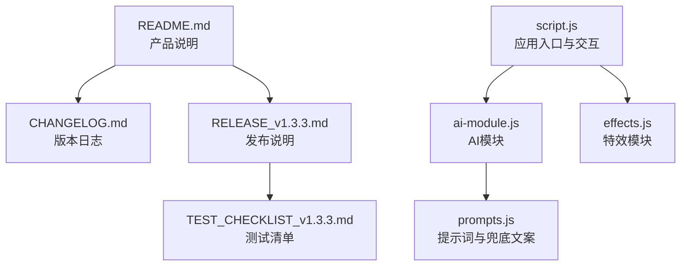
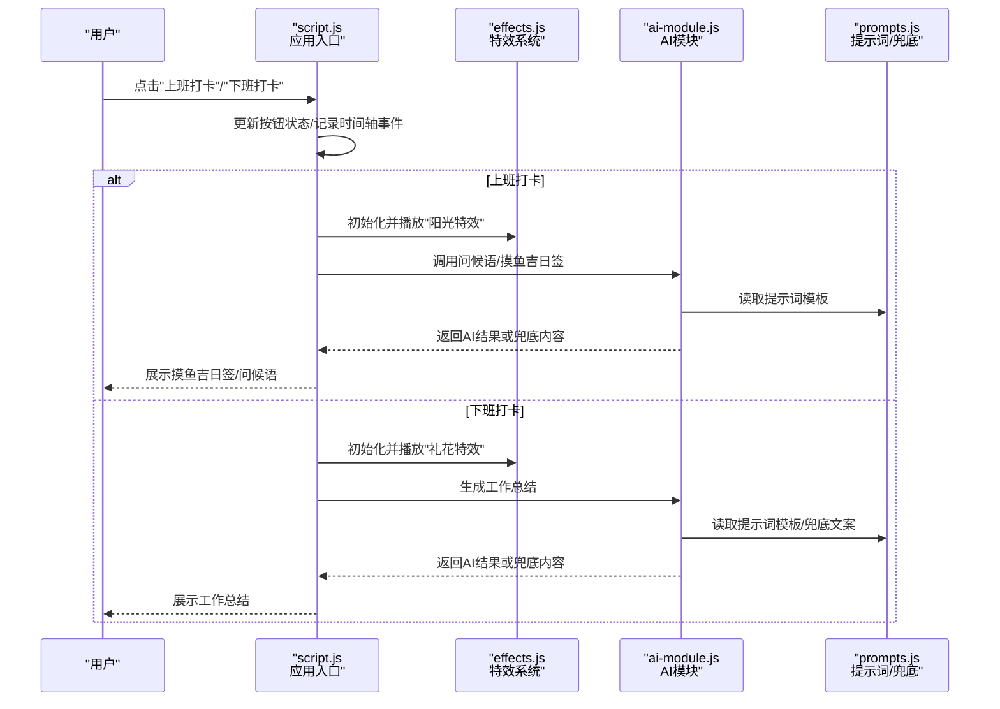
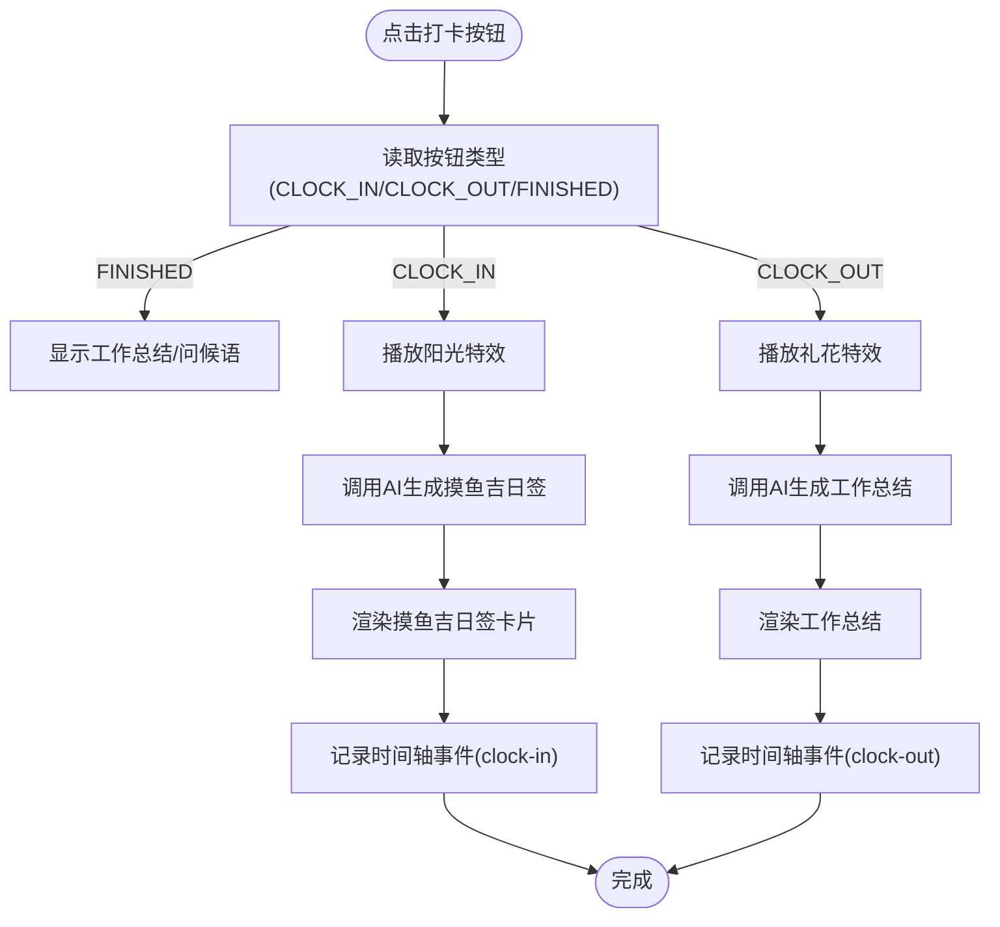
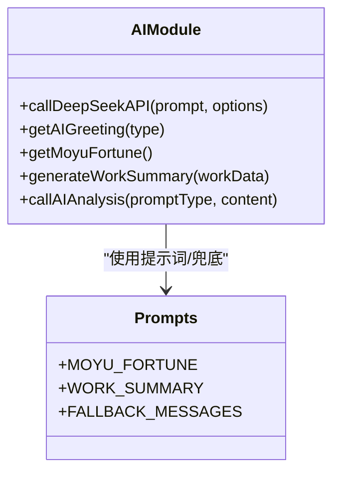
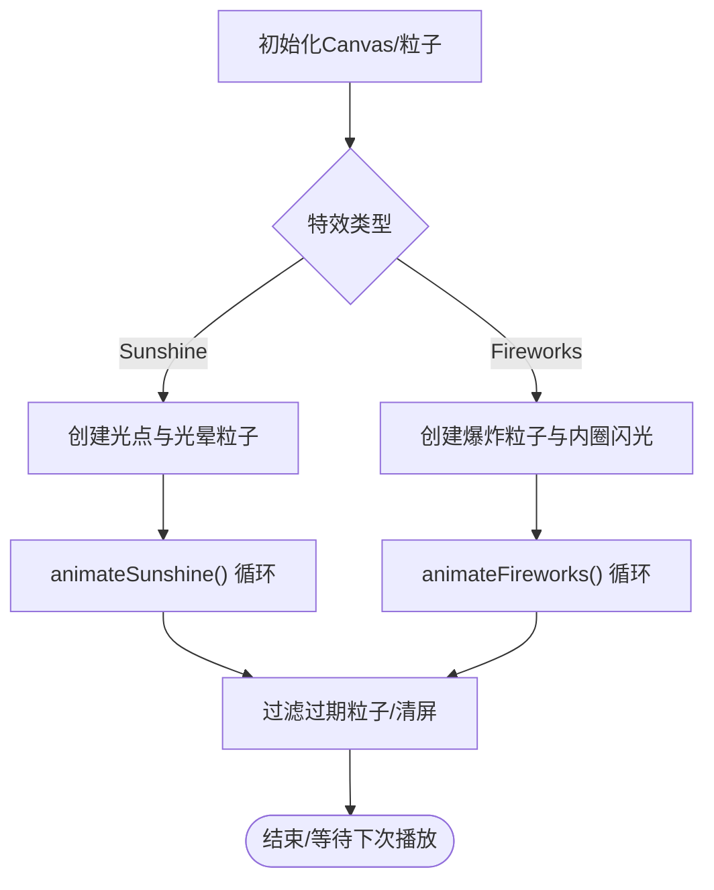
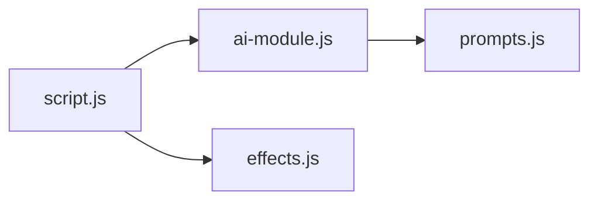

# Pull Request创建流程

<cite>
**本文引用的文件**
- [README.md](file://README.md)
- [CHANGELOG.md](file://CHANGELOG.md)
- [RELEASE_v1.3.3.md](file://RELEASE_v1.3.3.md)
- [TEST_CHECKLIST_v1.3.3.md](file://TEST_CHECKLIST_v1.3.3.md)
- [script.js](file://script.js)
- [ai-module.js](file://ai-module.js)
- [effects.js](file://effects.js)
- [prompts.js](file://prompts.js)
</cite>

## 目录
1. [引言](#引言)
2. [项目结构](#项目结构)
3. [核心组件](#核心组件)
4. [架构总览](#架构总览)
5. [详细组件分析](#详细组件分析)
6. [依赖关系分析](#依赖关系分析)
7. [性能考量](#性能考量)
8. [故障排查指南](#故障排查指南)
9. [结论](#结论)
10. [附录](#附录)

## 引言
本文件面向贡献者，定义标准的Pull Request创建流程，确保变更可追溯、可评审、可验证。流程从Fork仓库开始，克隆到本地，创建feature/xxx分支进行开发；提交PR时，标题需清晰描述变更内容并关联对应的功能需求或Bug编号；PR描述中需包含变更动机、实现方式、影响范围及测试验证结果；必须附上UI变更的截图或动图，以便审查者直观理解修改内容。

## 项目结构
Work Timer为纯前端项目，核心逻辑集中在单页应用脚本与模块化AI、特效模块中。关键文件与职责如下：
- README.md：产品定位、功能概览与版本历史说明
- CHANGELOG.md：版本更新日志，记录新增功能、技术改进、UI/UX优化、Bug修复与文档更新
- RELEASE_v1.3.3.md：发布说明，包含三大核心功能（摸鱼吉日签、工资计算与收入展示、打卡特效）的技术更新与使用指南
- TEST_CHECKLIST_v1.3.3.md：v1.3.3版本测试清单，覆盖首次设置、摸鱼吉日签、工资计算、特效系统、设置页面、数据持久化、UI/UX、兼容性、边界情况与回归测试
- script.js：应用入口与核心交互逻辑，包含打卡流程、时间轴、设置、AI配置、特效初始化等
- ai-module.js：AI模块封装，负责DeepSeek API调用、问候语、摸鱼吉日签、工作总结生成与兜底策略
- effects.js：特效模块，封装Canvas粒子系统，实现上班打卡的“阳光特效”与下班打卡的“礼花特效”
- prompts.js：统一管理AI提示词模板与兜底文案

图表来源
- [README.md](file://README.md#L1-L125)
- [CHANGELOG.md](file://CHANGELOG.md#L1-L130)
- [RELEASE_v1.3.3.md](file://RELEASE_v1.3.3.md#L1-L214)
- [TEST_CHECKLIST_v1.3.3.md](file://TEST_CHECKLIST_v1.3.3.md#L1-L178)
- [script.js](file://script.js#L1-L800)
- [ai-module.js](file://ai-module.js#L1-L216)
- [effects.js](file://effects.js#L1-L279)
- [prompts.js](file://prompts.js#L1-L159)

章节来源
- [README.md](file://README.md#L1-L125)
- [CHANGELOG.md](file://CHANGELOG.md#L1-L130)
- [RELEASE_v1.3.3.md](file://RELEASE_v1.3.3.md#L1-L214)
- [TEST_CHECKLIST_v1.3.3.md](file://TEST_CHECKLIST_v1.3.3.md#L1-L178)
- [script.js](file://script.js#L1-L800)
- [ai-module.js](file://ai-module.js#L1-L216)
- [effects.js](file://effects.js#L1-L279)
- [prompts.js](file://prompts.js#L1-L159)

## 核心组件
- 打卡交互与状态机：script.js中实现“上班打卡/下班打卡/已下班”三态切换，记录时间轴事件，触发AI问候与特效播放
- AI模块：ai-module.js封装DeepSeek API调用，提供问候语、摸鱼吉日签、工作总结生成与兜底策略
- 特效系统：effects.js基于Canvas实现粒子动画，分别用于上班打卡的“阳光特效”和下班打卡的“礼花特效”
- 提示词与兜底：prompts.js集中管理AI提示词模板与兜底文案，确保在网络异常或API失败时仍能提供可用内容

章节来源
- [script.js](file://script.js#L493-L732)
- [ai-module.js](file://ai-module.js#L1-L216)
- [effects.js](file://effects.js#L1-L279)
- [prompts.js](file://prompts.js#L1-L159)

## 架构总览
下图展示了从用户点击打卡按钮到最终展示AI生成内容与特效的端到端流程：

图表来源
- [script.js](file://script.js#L547-L728)
- [effects.js](file://effects.js#L1-L279)
- [ai-module.js](file://ai-module.js#L61-L167)
- [prompts.js](file://prompts.js#L1-L159)

## 详细组件分析

### 组件A：打卡交互与状态机
- 功能要点
  - 按钮状态随日期与上次打卡类型自动切换（上班打卡/下班打卡/已下班）
  - 打卡成功后记录时间轴事件，区分“clock-in/clock-out”
  - 上班打卡：播放“阳光特效”，生成并展示摸鱼吉日签，支持“再求一签”
  - 下班打卡：播放“礼花特效”，生成并展示工作总结
- 关键实现路径
  - 按钮状态与事件记录：[script.js](file://script.js#L493-L732)
  - 上班打卡流程与特效播放：[script.js](file://script.js#L634-L690)、[effects.js](file://effects.js#L25-L62)
  - 下班打卡流程与特效播放：[script.js](file://script.js#L690-L728)、[effects.js](file://effects.js#L64-L86)
  - 时间轴事件添加：[script.js](file://script.js#L36-L47)

图表来源
- [script.js](file://script.js#L547-L728)
- [effects.js](file://effects.js#L25-L86)
- [ai-module.js](file://ai-module.js#L95-L167)

章节来源
- [script.js](file://script.js#L493-L732)
- [effects.js](file://effects.js#L1-L279)
- [ai-module.js](file://ai-module.js#L1-L216)

### 组件B：AI模块与提示词
- 功能要点
  - DeepSeek API封装，支持问候语、摸鱼吉日签、工作总结生成
  - 兜底策略：当AI调用失败时返回预设兜底文案
  - 提示词模板集中管理，包含JSON结构要求与幽默风格约束
- 关键实现路径
  - API调用与错误处理：[ai-module.js](file://ai-module.js#L14-L59)
  - 摸鱼吉日签与工作总结生成：[ai-module.js](file://ai-module.js#L95-L167)
  - 提示词模板与兜底文案：[prompts.js](file://prompts.js#L1-L159)

图表来源
- [ai-module.js](file://ai-module.js#L1-L216)
- [prompts.js](file://prompts.js#L1-L159)

章节来源
- [ai-module.js](file://ai-module.js#L1-L216)
- [prompts.js](file://prompts.js#L1-L159)

### 组件C：特效系统
- 功能要点
  - 上班打卡：50个光点粒子，带光晕与闪烁效果
  - 下班打卡：3组彩色粒子爆炸，带重力与尾迹效果
  - 使用requestAnimationFrame优化动画流畅度，自动清理过期粒子
- 关键实现路径
  - 特效类与动画循环：[effects.js](file://effects.js#L1-L279)

图表来源
- [effects.js](file://effects.js#L1-L279)

章节来源
- [effects.js](file://effects.js#L1-L279)

## 依赖关系分析
- 组件耦合
  - script.js依赖ai-module.js与effects.js实现AI与特效
  - ai-module.js依赖prompts.js提供提示词模板
- 外部依赖
  - DeepSeek API（用于AI生成）
  - localStorage（用于设置、打卡状态、时间轴、摸鱼运势等持久化）

图表来源
- [script.js](file://script.js#L1-L800)
- [ai-module.js](file://ai-module.js#L1-L216)
- [effects.js](file://effects.js#L1-L279)
- [prompts.js](file://prompts.js#L1-L159)

章节来源
- [script.js](file://script.js#L1-L800)
- [ai-module.js](file://ai-module.js#L1-L216)
- [effects.js](file://effects.js#L1-L279)
- [prompts.js](file://prompts.js#L1-L159)

## 性能考量
- 动画性能
  - 使用requestAnimationFrame驱动粒子动画，避免setInterval造成的掉帧
  - 自动清理过期粒子，避免内存泄漏
- AI调用
  - 在API失败时启用兜底文案，保证交互连续性
  - 控制请求参数（温度、最大Token）平衡稳定性与多样性
- 存储与状态
  - localStorage按日期隔离存储（如moyuFortune_[date]），避免跨日数据污染
  - 每日重置打卡状态，确保状态机正确性

章节来源
- [effects.js](file://effects.js#L136-L273)
- [ai-module.js](file://ai-module.js#L14-L59)
- [script.js](file://script.js#L1-L800)

## 故障排查指南
- 打卡按钮状态异常
  - 检查是否跨日导致状态重置，确认localStorage中的lastClockInType与lastClockInDate
  - 参考：[script.js](file://script.js#L500-L545)
- AI调用失败
  - 确认已配置DeepSeek API Key，检查网络连通性
  - 若失败，系统将返回兜底文案，确保UI不中断
  - 参考：[ai-module.js](file://ai-module.js#L14-L59)
- 特效不显示或卡顿
  - 确认Canvas元素存在且尺寸正确，检查requestAnimationFrame是否被取消
  - 参考：[effects.js](file://effects.js#L1-L86)
- 数据持久化问题
  - 检查localStorage中monthlySalary与moyuFortune_[date]键值
  - 参考：[CHANGELOG.md](file://CHANGELOG.md#L78-L82)

章节来源
- [script.js](file://script.js#L493-L732)
- [ai-module.js](file://ai-module.js#L1-L216)
- [effects.js](file://effects.js#L1-L279)
- [CHANGELOG.md](file://CHANGELOG.md#L78-L82)

## 结论
本流程明确了从Fork到PR提交的标准化步骤，强调标题清晰、描述完整、附带UI截图或动图，以及基于测试清单的验证闭环。结合项目现有模块（打卡交互、AI模块、特效系统、提示词与兜底），贡献者可在保证质量的前提下高效推进功能迭代与问题修复。

## 附录

### PR创建标准流程（面向贡献者）
- Fork仓库并克隆到本地
- 基于主分支创建feature/xxx分支进行开发
- 提交PR时，标题需清晰描述变更内容（如“新增：摸鱼吉日签AI生成功能”），并关联对应的功能需求或Bug编号
- PR描述中需包含：
  - 变更动机与背景
  - 实现方式与关键路径（可引用文件与行号）
  - 影响范围（涉及模块/文件）
  - 测试验证结果（可引用测试清单条目）
  - UI变更截图或动图（如特效动画效果）
- 代码审查通过后合并，随后在CHANGELOG.md中补充更新记录

章节来源
- [CHANGELOG.md](file://CHANGELOG.md#L1-L130)
- [RELEASE_v1.3.3.md](file://RELEASE_v1.3.3.md#L1-L214)
- [TEST_CHECKLIST_v1.3.3.md](file://TEST_CHECKLIST_v1.3.3.md#L1-L178)