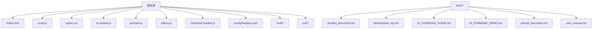
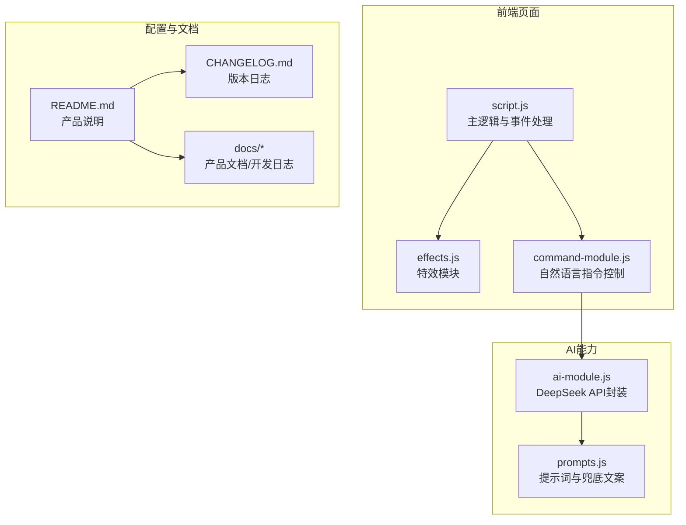
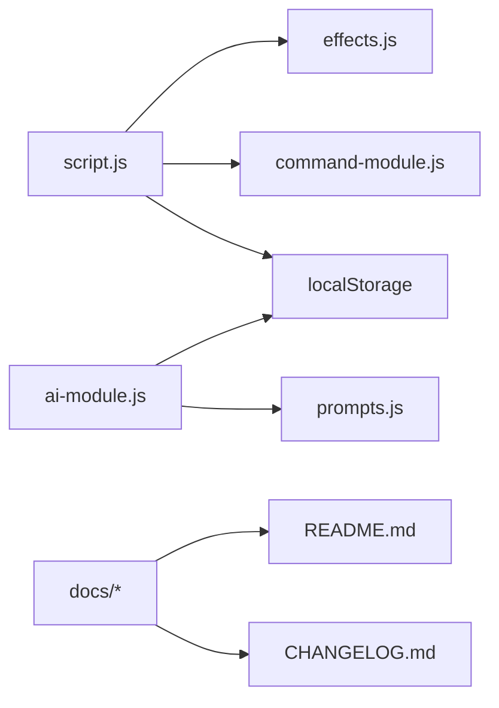

# 分支管理规范

<cite>
**本文引用的文件**
- [README.md](file://README.md)
- [CHANGELOG.md](file://CHANGELOG.md)
- [docs/development_log.md](file://docs/development_log.md)
- [docs/AI_COMMAND_GUIDE.md](file://docs/AI_COMMAND_GUIDE.md)
- [docs/product_document.md](file://docs/product_document.md)
- [script.js](file://script.js)
- [ai-module.js](file://ai-module.js)
- [prompts.js](file://prompts.js)
</cite>

## 目录
1. [引言](#引言)
2. [项目结构](#项目结构)
3. [核心组件](#核心组件)
4. [架构总览](#架构总览)
5. [详细组件分析](#详细组件分析)
6. [依赖关系分析](#依赖关系分析)
7. [性能考量](#性能考量)
8. [故障排查指南](#故障排查指南)
9. [结论](#结论)
10. [附录](#附录)

## 引言
本规范旨在统一团队在本仓库中的分支管理实践，确保功能开发、问题修复与版本发布流程清晰、可追溯、可协作。根据仓库现状与文档约定，明确如下要点：
- 主分支为 main，所有变更必须通过 Pull Request 合并。
- 功能开发必须基于 feature/ 前缀创建特性分支；紧急修复使用 hotfix/ 前缀分支。
- 禁止直接向 main 推送代码。
- 特性分支完成后，需经至少一名核心开发者审查后合并。
- 分支命名应语义清晰，反映所实现功能或修复问题。
- README.md 中应明确标注当前活跃开发分支，以便对外与协作清晰。

以上规范与实践在仓库文档与代码中均有体现，详见后续章节。

**章节来源**
- file://README.md#L1-L125
- file://CHANGELOG.md#L1-L130
- file://docs/development_log.md#L1-L200
- file://docs/AI_COMMAND_GUIDE.md#L1-L160
- file://docs/product_document.md#L1-L274

## 项目结构
仓库采用前端单页应用结构，核心页面与功能模块分布如下：
- 根目录包含主页面与样式、脚本、AI模块、提示词配置等。
- docs 目录包含产品文档、开发日志、AI指令指南等。
- config 目录包含节假日配置文件。
- rmrb/surf 目录为独立功能模块（人民日报与网上冲浪）。

**图表来源**
- [script.js](file://script.js#L1-L200)
- [ai-module.js](file://ai-module.js#L1-L216)
- [prompts.js](file://prompts.js#L1-L159)
- [docs/product_document.md](file://docs/product_document.md#L1-L274)
- [docs/development_log.md](file://docs/development_log.md#L1-L200)

**章节来源**
- file://README.md#L1-L125
- file://docs/product_document.md#L1-L274

## 核心组件
- 主页面与交互逻辑：负责倒计时、日历、打卡、时间轴、番茄钟等核心功能的渲染与事件处理。
- AI 模块：封装 DeepSeek API 调用、兜底机制与提示词模板，提供打卡问候、摸鱼吉日签、工作总结、新闻分析等能力。
- 提示词配置：集中管理各类 Prompt 模板与兜底文案，便于统一风格与降级处理。
- 开发日志与产品文档：记录版本演进、功能增强与技术实现，支撑分支合并与发布说明。
- README 与变更日志：对外展示最新版本与功能亮点，便于社区与用户了解。

**章节来源**
- file://script.js#L1-L200
- file://ai-module.js#L1-L216
- file://prompts.js#L1-L159
- file://docs/development_log.md#L1-L200
- file://docs/product_document.md#L1-L274
- file://README.md#L1-L125
- file://CHANGELOG.md#L1-L130

## 架构总览
下图展示了前端核心模块之间的关系与职责分工，以及与 AI 模块的交互路径。

**图表来源**
- [script.js](file://script.js#L1-L200)
- [effects.js](file://effects.js)
- [command-module.js](file://command-module.js)
- [ai-module.js](file://ai-module.js#L1-L216)
- [prompts.js](file://prompts.js#L1-L159)
- [README.md](file://README.md#L1-L125)
- [CHANGELOG.md](file://CHANGELOG.md#L1-L130)
- [docs/development_log.md](file://docs/development_log.md#L1-L200)

## 详细组件分析

### 分支命名与合并策略
- 主分支：main
- 功能分支：feature/<语义化名称>
- 紧急修复分支：hotfix/<语义化名称>
- 合并方式：Pull Request，至少一名核心开发者审查
- 禁止：直接向 main 推送
- 文档要求：在 README.md 中明确标注当前活跃开发分支

上述规范与实践在仓库文档中有明确体现：
- README.md 中包含版本与功能说明，便于对外展示当前活跃版本与开发分支状态。
- CHANGELOG.md 用于记录版本更新，支撑发布与分支合并的里程碑。
- development_log.md 记录版本演进与功能增强，有助于分支命名与合并的语义化管理。

**章节来源**
- file://README.md#L1-L125
- file://CHANGELOG.md#L1-L130
- file://docs/development_log.md#L1-L200

### Pull Request 合并与审查流程
- 提交 PR：从 feature/<name> 或 hotfix/<name> 合并至 main
- 审查要求：至少一名核心开发者审查
- 合并条件：通过审查、无冲突、文档与测试（如适用）齐备
- 合并后：保留分支以供追溯，或按团队约定清理

该流程与规范在 README 与变更日志中得到体现，便于团队协作与版本管理。

**章节来源**
- file://README.md#L1-L125
- file://CHANGELOG.md#L1-L130

### 分支命名语义化
- feature/<语义化名称>：用于新功能开发，名称应简洁描述功能点，如 feature/moyu-fortune。
- hotfix/<语义化名称>：用于紧急修复，名称应描述问题或修复内容，如 hotfix/clock-in-bug。
- main：主分支，仅接收通过 PR 合并的变更。

该命名策略与规范在 README 与开发日志中得到体现，便于追踪与审计。

**章节来源**
- file://README.md#L1-L125
- file://docs/development_log.md#L1-L200

### README 中活跃开发分支标注
- README.md 中应明确标注当前活跃开发分支，便于对外与协作清晰。
- 结合 CHANGELOG.md 与 development_log.md，可确认当前版本与开发分支状态。

**章节来源**
- file://README.md#L1-L125
- file://CHANGELOG.md#L1-L130
- file://docs/development_log.md#L1-L200

### AI 模块与提示词对分支管理的意义
- AI 模块与提示词配置集中管理，便于在 PR 中统一审查与回归测试。
- 对于涉及 AI 的功能分支（如 feature/moyu-fortune），应在 PR 中同步更新 prompts.js 与 ai-module.js 的相关逻辑与兜底文案。

**章节来源**
- file://ai-module.js#L1-L216
- file://prompts.js#L1-L159

## 依赖关系分析
- script.js 为主逻辑入口，依赖 effects.js（特效）、command-module.js（自然语言指令）、localStorage（数据持久化）。
- ai-module.js 依赖 prompts.js（提示词模板）与 localStorage（API Key）。
- docs 与 README/CHANGELOG 为外部文档，指导分支命名与合并流程。

**图表来源**
- [script.js](file://script.js#L1-L200)
- [effects.js](file://effects.js)
- [command-module.js](file://command-module.js)
- [ai-module.js](file://ai-module.js#L1-L216)
- [prompts.js](file://prompts.js#L1-L159)
- [README.md](file://README.md#L1-L125)
- [CHANGELOG.md](file://CHANGELOG.md#L1-L130)

**章节来源**
- file://script.js#L1-L200
- file://ai-module.js#L1-L216
- file://prompts.js#L1-L159
- file://README.md#L1-L125
- file://CHANGELOG.md#L1-L130

## 性能考量
- 分支粒度：功能分支应尽量小而聚焦，减少 PR 冲突与审查成本。
- 合并频率：频繁小步提交与合并，降低长期分支漂移风险。
- 文档同步：PR 合并后及时更新 README/CHANGELOG 与开发日志，确保对外信息一致。

[本节为通用建议，不直接分析具体文件]

## 故障排查指南
- 分支命名不规范：检查 README 与开发日志中的命名约定，确保遵循 feature/ 与 hotfix/ 前缀。
- PR 审查未通过：核对 ai-module.js 与 prompts.js 的变更是否与功能分支一致，确保兜底文案与提示词更新完整。
- 合并冲突：在 PR 合并前解决冲突，必要时在本地 rebase/main 以保持线性历史。

**章节来源**
- file://README.md#L1-L125
- file://docs/development_log.md#L1-L200
- file://ai-module.js#L1-L216
- file://prompts.js#L1-L159

## 结论
本仓库的分支管理应遵循：主分支 main、功能分支 feature/<语义化名称>、紧急修复 hotfix/<语义化名称>、通过 PR 合并并至少一名核心开发者审查。README 中应明确标注当前活跃开发分支，配合 CHANGELOG 与开发日志，形成清晰、可追溯的版本与协作流程。

[本节为总结，不直接分析具体文件]

## 附录
- 术语
  - main：主分支，仅接收通过 PR 合并的变更。
  - feature/<语义化名称>：功能开发分支，命名应清晰描述功能。
  - hotfix/<语义化名称>：紧急修复分支，命名应描述问题或修复内容。
  - PR：Pull Request，用于合并分支至 main 的协作流程。

[本节为补充说明，不直接分析具体文件]