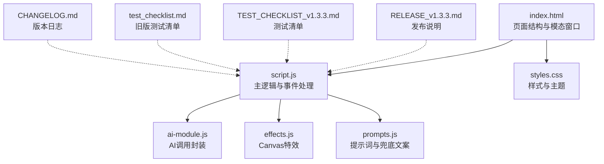
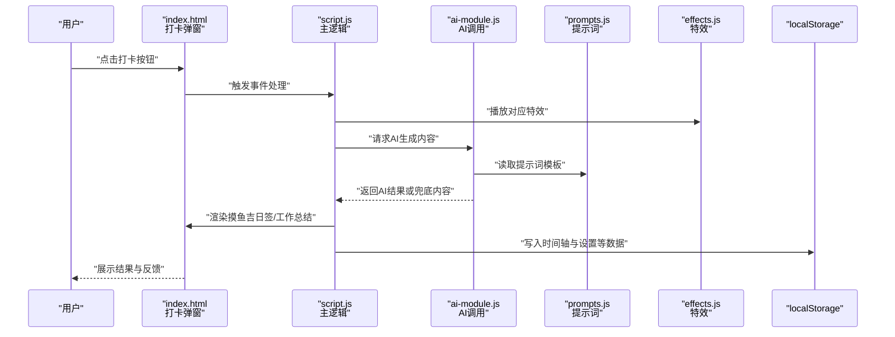
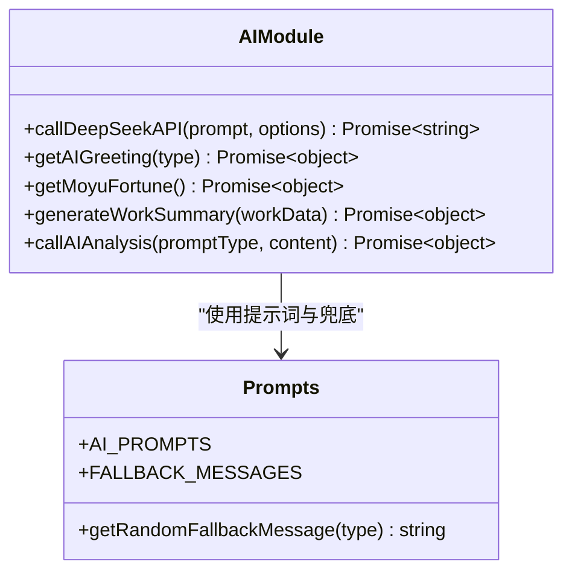
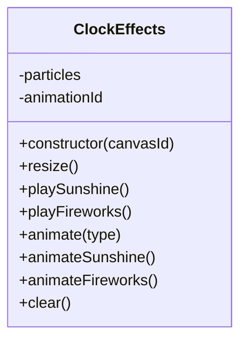
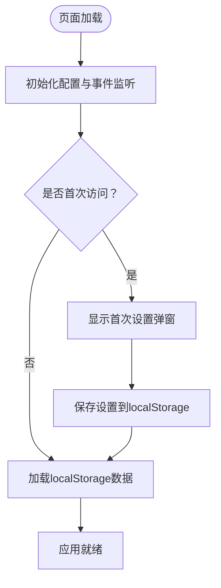
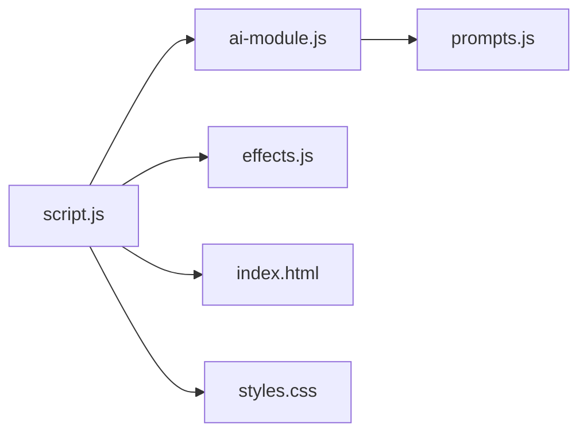

# 协作流程与Pull Request规范

<cite>
**本文引用的文件**
- [README.md](file://README.md)
- [RELEASE_v1.3.3.md](file://RELEASE_v1.3.3.md)
- [TEST_CHECKLIST_v1.3.3.md](file://TEST_CHECKLIST_v1.3.3.md)
- [test_checklist.md](file://test_checklist.md)
- [CHANGELOG.md](file://CHANGELOG.md)
- [script.js](file://script.js)
- [ai-module.js](file://ai-module.js)
- [effects.js](file://effects.js)
- [prompts.js](file://prompts.js)
- [index.html](file://index.html)
- [styles.css](file://styles.css)
</cite>

## 目录
1. [引言](#引言)
2. [项目结构](#项目结构)
3. [核心组件](#核心组件)
4. [架构总览](#架构总览)
5. [详细组件分析](#详细组件分析)
6. [依赖关系分析](#依赖关系分析)
7. [性能考量](#性能考量)
8. [故障排查指南](#故障排查指南)
9. [结论](#结论)
10. [附录](#附录)

## 引言
本规范旨在建立标准化的协作流程与Pull Request（PR）评审标准，确保每次变更均具备明确的目标、完善的测试与文档更新，并能在合并前通过一致性检查。本文面向所有贡献者与维护者，提供从Fork到PR合并的全流程指引，以及代码审查重点与测试清单使用方法。

## 项目结构
Work Timer是一个前端Web应用，采用模块化组织，核心功能围绕打卡、AI生成、特效动画与数据持久化展开。关键文件职责如下：
- index.html：页面结构与模态窗口（打卡弹窗、番茄钟、时间轴等）
- script.js：应用主逻辑（初始化、打卡流程、时间轴、设置等）
- ai-module.js：AI调用封装（DeepSeek API、兜底策略）
- prompts.js：AI提示词模板与兜底文案
- effects.js：Canvas特效模块（上班/下班特效）
- styles.css：样式与主题
- RELEASE_v1.3.3.md / TEST_CHECKLIST_v1.3.3.md / test_checklist.md：发布说明与测试清单
- CHANGELOG.md：版本更新日志

图表来源
- [index.html](file://index.html#L1-L200)
- [script.js](file://script.js#L1-L200)
- [ai-module.js](file://ai-module.js#L1-L216)
- [effects.js](file://effects.js#L1-L279)
- [prompts.js](file://prompts.js#L1-L159)
- [styles.css](file://styles.css#L1-L200)
- [RELEASE_v1.3.3.md](file://RELEASE_v1.3.3.md#L1-L214)
- [TEST_CHECKLIST_v1.3.3.md](file://TEST_CHECKLIST_v1.3.3.md#L1-L178)
- [test_checklist.md](file://test_checklist.md#L1-L38)
- [CHANGELOG.md](file://CHANGELOG.md#L1-L130)

章节来源
- [README.md](file://README.md#L1-L125)
- [RELEASE_v1.3.3.md](file://RELEASE_v1.3.3.md#L1-L214)
- [TEST_CHECKLIST_v1.3.3.md](file://TEST_CHECKLIST_v1.3.3.md#L1-L178)
- [test_checklist.md](file://test_checklist.md#L1-L38)
- [CHANGELOG.md](file://CHANGELOG.md#L1-L130)

## 核心组件
- 打卡与AI流程：通过script.js触发事件，调用ai-module.js生成摸鱼吉日签与工作总结；同时在index.html的打卡弹窗中渲染结果。
- 特效系统：effects.js基于Canvas实现上班/下班特效，使用requestAnimationFrame优化性能。
- 提示词与兜底：prompts.js集中管理AI提示词，AI失败时回退到兜底文案，确保功能可用性。
- 数据持久化：script.js使用localStorage存储工作时间、设置、时间轴与每日运势等数据。
- UI与交互：index.html定义模态窗口与按钮，styles.css提供主题与响应式布局。

章节来源
- [script.js](file://script.js#L1-L200)
- [ai-module.js](file://ai-module.js#L1-L216)
- [effects.js](file://effects.js#L1-L279)
- [prompts.js](file://prompts.js#L1-L159)
- [index.html](file://index.html#L1-L200)
- [styles.css](file://styles.css#L1-L200)

## 架构总览
下图展示了从用户点击打卡到最终展示AI结果与特效的关键调用链路。

图表来源
- [index.html](file://index.html#L120-L170)
- [script.js](file://script.js#L1-L200)
- [ai-module.js](file://ai-module.js#L1-L216)
- [prompts.js](file://prompts.js#L1-L159)
- [effects.js](file://effects.js#L1-L279)

## 详细组件分析

### 组件A：AI模块与提示词
- 实现要点
  - 封装DeepSeek API调用，支持温度、最大Token等参数配置。
  - 提供摸鱼吉日签与工作总结两类AI生成函数，均包含兜底策略。
  - prompts.js集中管理提示词模板与兜底文案，便于维护与扩展。
- 错误处理
  - API失败时返回兜底文案，保证功能可用性与用户体验。
- 复杂度与性能
  - 主要为I/O密集型，受网络延迟影响；本地解析与渲染为O(n)粒子更新。

图表来源
- [ai-module.js](file://ai-module.js#L1-L216)
- [prompts.js](file://prompts.js#L1-L159)

章节来源
- [ai-module.js](file://ai-module.js#L1-L216)
- [prompts.js](file://prompts.js#L1-L159)

### 组件B：特效系统
- 实现要点
  - ClockEffects类封装Canvas粒子系统，支持阳光与礼花两种特效。
  - 使用requestAnimationFrame驱动动画，按帧更新粒子位置与透明度。
  - 在窗口尺寸变化时自动重绘，确保全屏覆盖。
- 性能与内存
  - 动画结束后清理粒子与动画帧，避免内存泄漏。
  - 通过摩擦与重力模拟真实物理效果，兼顾美观与性能。

图表来源
- [effects.js](file://effects.js#L1-L279)

章节来源
- [effects.js](file://effects.js#L1-L279)

### 组件C：主逻辑与数据持久化
- 实现要点
  - 初始化工作时间配置、开发者模式与自定义时间。
  - 管理时间轴事件，支持添加、保存与跨日重置。
  - 首次设置弹窗与设置页面交互，支持月工资等配置。
- 数据存储
  - 使用localStorage存储工作时间、节假日、周末加班、时间轴等。
  - 每日运势按日期键隔离，避免跨日混淆。

图表来源
- [script.js](file://script.js#L1-L200)

章节来源
- [script.js](file://script.js#L1-L200)

## 依赖关系分析
- 模块耦合
  - script.js是中枢，依赖ai-module.js、effects.js、prompts.js与index.html的DOM结构。
  - ai-module.js依赖prompts.js的模板与兜底文案。
  - effects.js为纯Canvas模块，与UI解耦，仅通过事件触发。
- 外部依赖
  - DeepSeek API用于AI生成；网络异常时走兜底逻辑。
- 潜在风险
  - 若localStorage异常或被清空，需确保初始化流程健壮。
  - 特效在低端设备上可能受性能限制，需监控帧率与内存占用。

图表来源
- [script.js](file://script.js#L1-L200)
- [ai-module.js](file://ai-module.js#L1-L216)
- [effects.js](file://effects.js#L1-L279)
- [prompts.js](file://prompts.js#L1-L159)
- [index.html](file://index.html#L1-L200)
- [styles.css](file://styles.css#L1-L200)

章节来源
- [script.js](file://script.js#L1-L200)
- [ai-module.js](file://ai-module.js#L1-L216)
- [effects.js](file://effects.js#L1-L279)
- [prompts.js](file://prompts.js#L1-L159)
- [index.html](file://index.html#L1-L200)
- [styles.css](file://styles.css#L1-L200)

## 性能考量
- 动画性能
  - 使用requestAnimationFrame替代setInterval，降低掉帧风险。
  - 特效粒子数量与生命周期控制在合理范围，避免过度计算。
- 存储与渲染
  - localStorage读写集中在初始化阶段，避免频繁I/O。
  - DOM更新尽量批量进行，减少重排与重绘。
- 网络与兜底
  - AI调用失败时启用兜底文案，保证功能可用性。
  - 对网络超时与错误码进行捕获与提示。

[本节为通用性能建议，不直接分析具体文件]

## 故障排查指南
- AI功能异常
  - 确认已配置API密钥；检查网络连通性与API返回状态。
  - 若失败，确认兜底文案是否生效。
- 特效不显示
  - 检查Canvas元素是否存在且尺寸正确；确认事件触发顺序。
  - 在低端设备上观察帧率与内存占用。
- 数据丢失或错乱
  - 检查localStorage键名与日期隔离策略；确认跨日重置逻辑。
- UI样式问题
  - 核对响应式断点与主题变量；确认模态窗口层级与遮罩层。

章节来源
- [ai-module.js](file://ai-module.js#L1-L216)
- [effects.js](file://effects.js#L1-L279)
- [script.js](file://script.js#L1-L200)
- [styles.css](file://styles.css#L1-L200)

## 结论
通过标准化的协作流程与严格的PR评审机制，能够有效保障Work Timer的功能完整性、代码质量、测试覆盖与文档更新。建议在每次PR中明确关联功能/修复目标，遵循测试清单核验核心路径，并在评审中重点关注AI、特效与数据存储等关键模块的稳定性与性能表现。

[本节为总结性内容，不直接分析具体文件]

## 附录

### 协作流程规范
- Fork与分支
  - Fork仓库至个人账号后，创建特性分支：feature/xxx，命名清晰描述变更内容。
- 提交与PR
  - 每个PR必须关联具体功能或修复，标题简洁明确，描述变更动机与影响范围。
  - PR中建议附带截图或动图以直观展示UI/交互变化。
- 代码审查重点
  - 功能完整性：是否覆盖需求与边界条件。
  - 代码质量：命名规范、模块拆分、可读性与可维护性。
  - 测试覆盖：是否通过测试清单验证，特别是AI、特效、数据存储等核心路径。
  - 文档更新：README、CHANGELOG、发布说明等是否同步更新。
- 测试清单使用
  - 使用TEST_CHECKLIST_v1.3.3.md进行本地回归测试，确保AI、特效、数据存储等核心路径通过。
  - 对比test_checklist.md中的旧版测试项，验证回归与兼容性。
  - 如发现新问题，补充至Bug记录区域并跟踪修复。

章节来源
- [TEST_CHECKLIST_v1.3.3.md](file://TEST_CHECKLIST_v1.3.3.md#L1-L178)
- [test_checklist.md](file://test_checklist.md#L1-L38)
- [RELEASE_v1.3.3.md](file://RELEASE_v1.3.3.md#L1-L214)
- [CHANGELOG.md](file://CHANGELOG.md#L1-L130)
- [README.md](file://README.md#L1-L125)