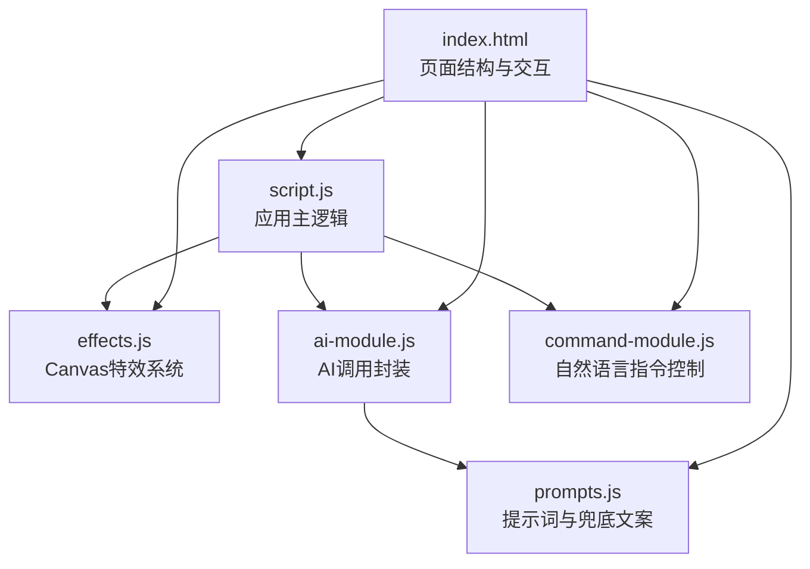
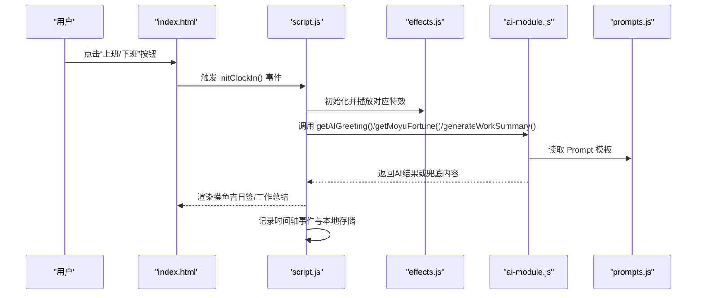
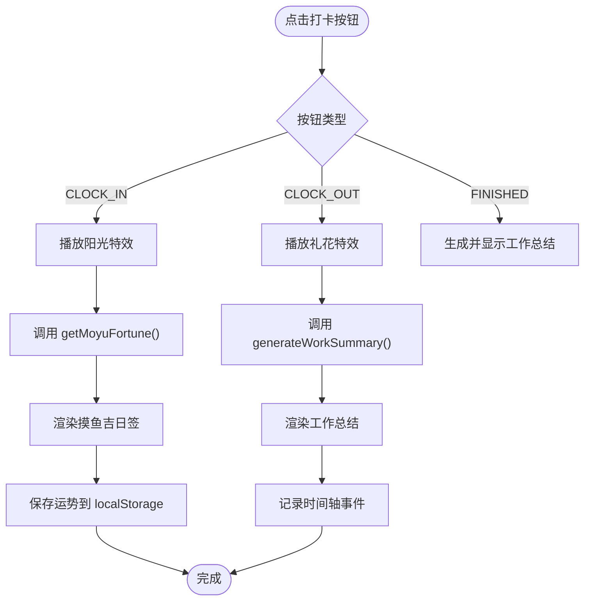
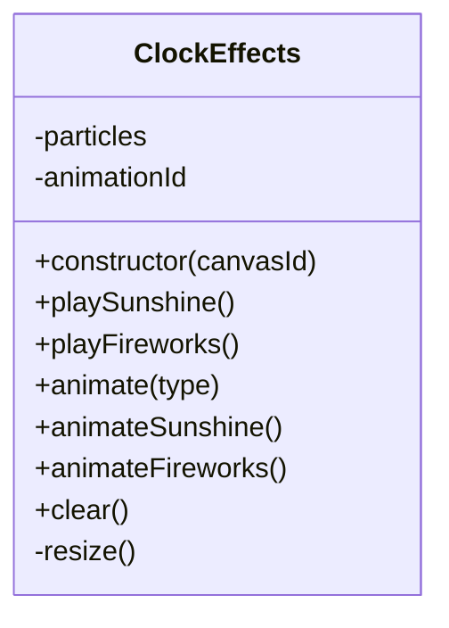
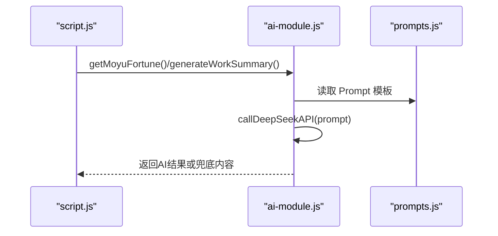
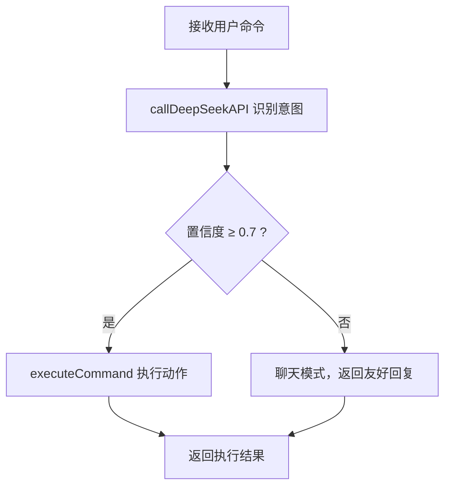
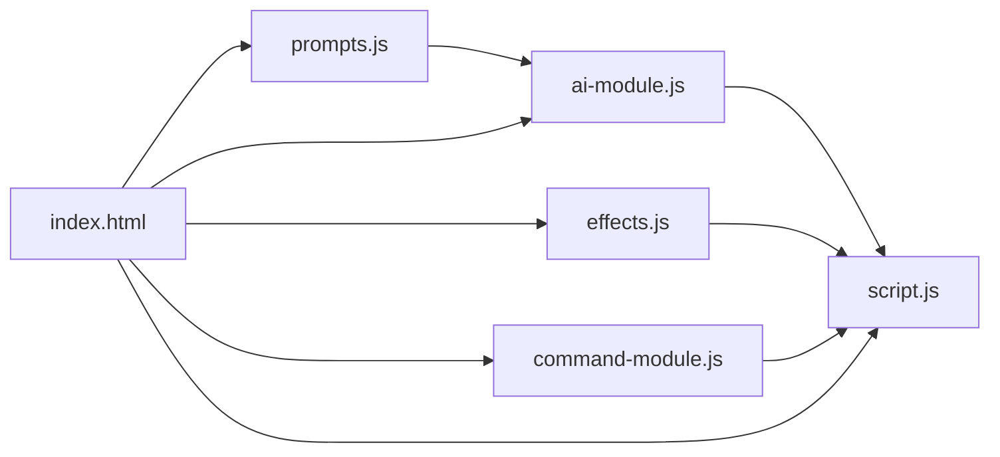

# 测试验证要求

<cite>
**本文引用的文件**
- [README.md](file://README.md)
- [RELEASE_v1.3.3.md](file://RELEASE_v1.3.3.md)
- [TEST_CHECKLIST_v1.3.3.md](file://TEST_CHECKLIST_v1.3.3.md)
- [test_checklist.md](file://test_checklist.md)
- [index.html](file://index.html)
- [script.js](file://script.js)
- [effects.js](file://effects.js)
- [ai-module.js](file://ai-module.js)
- [command-module.js](file://command-module.js)
- [prompts.js](file://prompts.js)
</cite>

## 目录
1. [引言](#引言)
2. [项目结构](#项目结构)
3. [核心组件](#核心组件)
4. [架构总览](#架构总览)
5. [详细组件分析](#详细组件分析)
6. [依赖关系分析](#依赖关系分析)
7. [性能考量](#性能考量)
8. [故障排查指南](#故障排查指南)
9. [结论](#结论)
10. [附录](#附录)

## 引言
本文件旨在明确 Pull Request 必须通过的测试验证流程与标准，确保 AI 生成、工资计算、Canvas 特效等核心功能稳定可靠。开发者需依据 TEST_CHECKLIST_v1.3.3.md 中的 87 项测试用例逐项核验；本地测试应以 test_checklist.md 为基础检查清单，覆盖打卡状态流转、数据持久化、时间轴记录等关键路径。PR 中必须声明已执行测试并附上结果摘要，未通过测试检查清单的 PR 将被拒绝合并。

## 项目结构
Work Timer 是一个前端 Web 应用，采用模块化组织，核心逻辑集中在 script.js，特效系统位于 effects.js，AI 能力封装在 ai-module.js，自然语言指令解析在 command-module.js，提示词与兜底文案在 prompts.js，页面结构与交互在 index.html。

图表来源
- [index.html](file://index.html#L1-L120)
- [script.js](file://script.js#L1-L120)
- [effects.js](file://effects.js#L1-L40)
- [ai-module.js](file://ai-module.js#L1-L40)
- [command-module.js](file://command-module.js#L1-L40)
- [prompts.js](file://prompts.js#L1-L40)

章节来源
- [README.md](file://README.md#L1-L125)
- [RELEASE_v1.3.3.md](file://RELEASE_v1.3.3.md#L1-L120)

## 核心组件
- 打卡与状态机：负责“上班/下班”按钮状态切换、弹窗展示、AI 问候、摸鱼吉日签、工作总结、时间轴记录与数据持久化。
- Canvas 特效系统：提供“阳光特效（上班）”和“礼花特效（下班）”，基于 requestAnimationFrame 实现高性能动画。
- AI 模块：封装 DeepSeek API 调用、摸鱼吉日签与工作总结生成、兜底策略与错误回退。
- 自然语言指令模块：解析用户自然语言，判断意图并执行对应操作。
- 提示词与兜底文案：统一管理 AI Prompt 模板与兜底内容，保证一致性与稳定性。

章节来源
- [script.js](file://script.js#L493-L732)
- [effects.js](file://effects.js#L1-L120)
- [ai-module.js](file://ai-module.js#L1-L120)
- [command-module.js](file://command-module.js#L1-L120)
- [prompts.js](file://prompts.js#L1-L80)

## 架构总览
下图展示了从用户点击“打卡”到最终展示摸鱼吉日签或工作总结的关键流程，以及特效与 AI 的集成点。

图表来源
- [index.html](file://index.html#L120-L170)
- [script.js](file://script.js#L546-L732)
- [effects.js](file://effects.js#L25-L120)
- [ai-module.js](file://ai-module.js#L60-L168)
- [prompts.js](file://prompts.js#L1-L60)

## 详细组件分析

### 打卡与状态机（script.js）
- 按钮状态逻辑：根据 lastClockInType 与 lastClockInDate 判断“上班/下班/已下班”状态，支持跨日自动重置。
- 弹窗与加载：展示问候语、加载动画、特效播放、再求一签与开始摸鱼按钮。
- AI 集成：上班打卡调用 getMoyuFortune() 生成摸鱼吉日签；下班打卡调用 generateWorkSummary() 生成幽默总结。
- 数据持久化：保存 lastClockInType、lastClockInDate、clockInTime、moyuFortune_[date]、时间轴 timeline_[date]。
- 时间轴记录：addTimelineEvent() 统一记录事件类型、时间、内容与扩展数据。

图表来源
- [script.js](file://script.js#L546-L732)
- [ai-module.js](file://ai-module.js#L95-L168)
- [effects.js](file://effects.js#L25-L120)

章节来源
- [script.js](file://script.js#L493-L732)
- [index.html](file://index.html#L120-L170)

### Canvas 特效系统（effects.js）
- 阳光特效（上班）：创建大量光点粒子，带光晕与闪烁效果，使用 requestAnimationFrame 循环绘制。
- 礼花特效（下班）：多组粒子爆炸，带重力与摩擦，随机颜色，尾迹绘制。
- 生命周期管理：clear() 清理动画与画布，避免内存泄漏；resize() 适配窗口变化。
- 性能优化：仅保留存活粒子，过期自动清理；使用 requestAnimationFrame 替代 setInterval。

图表来源
- [effects.js](file://effects.js#L1-L279)

章节来源
- [effects.js](file://effects.js#L1-L279)

### AI 模块（ai-module.js）
- DeepSeek API 调用：封装 fetch 请求，携带 Authorization 与模型参数，返回 choices[0].message.content。
- 摸鱼吉日签：解析 AI 返回的 JSON 字符串，失败时回退至兜底文案。
- 工作总结：将 clockInTime/clockOutTime/relaxCount/dailyIncome 注入 Prompt，失败时回退至兜底文案。
- 兜底策略：FALLBACK_MESSAGES 提供默认内容；getRandomFallbackMessage() 用于其他场景。

图表来源
- [ai-module.js](file://ai-module.js#L1-L216)
- [prompts.js](file://prompts.js#L1-L120)

章节来源
- [ai-module.js](file://ai-module.js#L1-L216)
- [prompts.js](file://prompts.js#L1-L159)

### 自然语言指令模块（command-module.js）
- 意图识别：通过较低 temperature 的 Prompt 判断是否执行操作，置信度阈值 0.7。
- 执行动作：根据 COMMAND_TYPES 调用对应 UI 控件（如点击“打卡”按钮、打开番茄钟、切换标签页等）。
- 聊天模式：低置信度或 chat 类型时仅聊天，不执行操作。

图表来源
- [command-module.js](file://command-module.js#L1-L260)

章节来源
- [command-module.js](file://command-module.js#L1-L313)

## 依赖关系分析
- index.html 引入脚本顺序决定模块依赖：prompts.js → ai-module.js → command-module.js → effects.js → script.js。
- script.js 依赖 effects.js（特效）、ai-module.js（AI）、prompts.js（提示词）。
- ai-module.js 依赖 prompts.js（模板）与 localStorage（API Key）。
- command-module.js 依赖 script.js 的 UI 控件与 DOM 操作。

图表来源
- [index.html](file://index.html#L1-L20)
- [script.js](file://script.js#L1-L40)
- [effects.js](file://effects.js#L1-L20)
- [ai-module.js](file://ai-module.js#L1-L20)
- [command-module.js](file://command-module.js#L1-L20)
- [prompts.js](file://prompts.js#L1-L20)

章节来源
- [index.html](file://index.html#L1-L40)
- [script.js](file://script.js#L1-L40)

## 性能考量
- Canvas 动画：使用 requestAnimationFrame，避免 setInteval；粒子过期自动清理，防止内存泄漏。
- AI 调用：统一在 ai-module.js 中封装，失败时快速回退，保证 UI 流畅。
- 本地存储：按日期键值存储，避免冗余；跨日自动清理旧数据，降低存储压力。
- 状态更新：按钮状态每分钟更新一次，避免频繁 DOM 操作。

章节来源
- [effects.js](file://effects.js#L120-L279)
- [script.js](file://script.js#L1-L120)

## 故障排查指南
- API 密钥未配置：getAIGreeting() 直接返回固定问候；generateWorkSummary()/getMoyuFortune() 抛错并回退兜底文案。
- AI 调用失败：检查 localStorage 中 deepseekApiKey 是否存在；使用“测试连接”按钮验证连通性。
- 特效不显示：确认 canvas 初始化成功、窗口尺寸变化触发 resize、弹窗关闭时调用 clear()。
- 打卡状态异常：检查 lastClockInType/lastClockInDate 与当天日期匹配；跨日自动重置为“上班打卡”。

章节来源
- [ai-module.js](file://ai-module.js#L1-L120)
- [script.js](file://script.js#L546-L732)
- [effects.js](file://effects.js#L1-L60)

## 结论
为确保 PR 质量与稳定性，所有变更必须通过 TEST_CHECKLIST_v1.3.3.md 的 87 项测试与 test_checklist.md 的本地回归测试。重点覆盖打卡状态流转、AI 生成与兜底、Canvas 特效性能、数据持久化与时间轴记录。未通过测试的 PR 将被拒绝合并。

## 附录

### 测试清单对照与执行要点
- 首次设置与月工资：检查设置弹窗、时间设置校验、localStorage 存储 monthlySalary。
- 上班/下班打卡流程：按钮状态切换、弹窗展示、AI 生成、特效播放、时间轴记录。
- 摸鱼吉日签：JSON 解析、兜底文案、Header 展示、再求一签。
- 工资计算：日薪计算、收入高亮、AI 总结包含关键字段。
- Canvas 特效：粒子数量、动画流畅度、关闭清理。
- 数据持久化：localStorage 键值、跨日清理、刷新不丢失。
- UI/UX：样式一致性、响应式布局、弹窗交互。
- 兼容性：主流浏览器与移动端。
- 边界情况：默认月工资、未知时间、网络异常降级。
- 回归测试：倒计时、番茄钟、日历、时间轴、AI 悬浮窗、快捷功能、设置保存。

章节来源
- [TEST_CHECKLIST_v1.3.3.md](file://TEST_CHECKLIST_v1.3.3.md#L1-L178)
- [test_checklist.md](file://test_checklist.md#L1-L38)