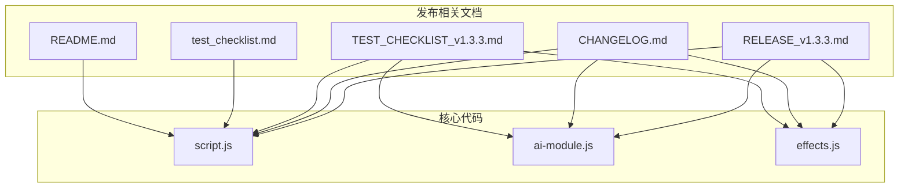
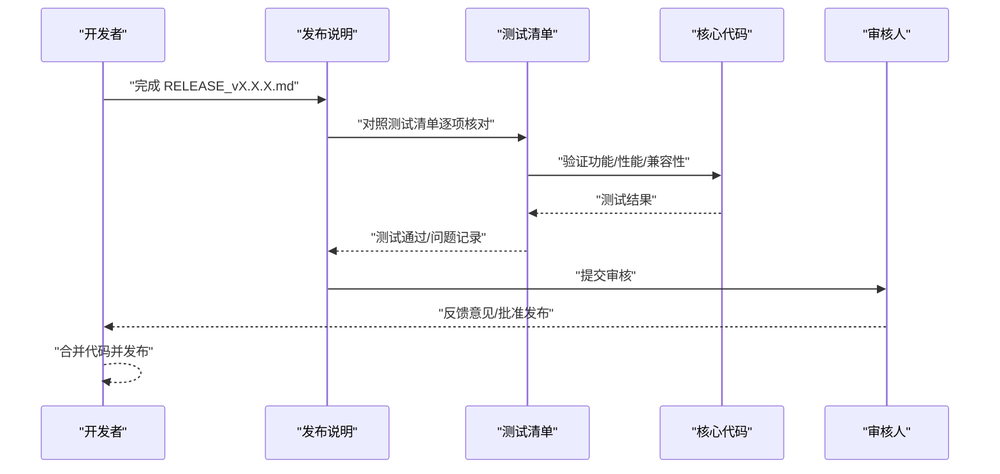
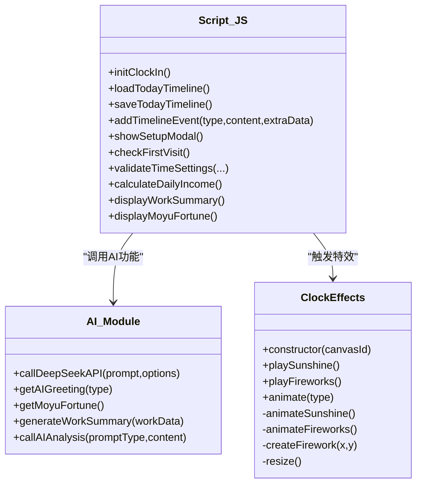
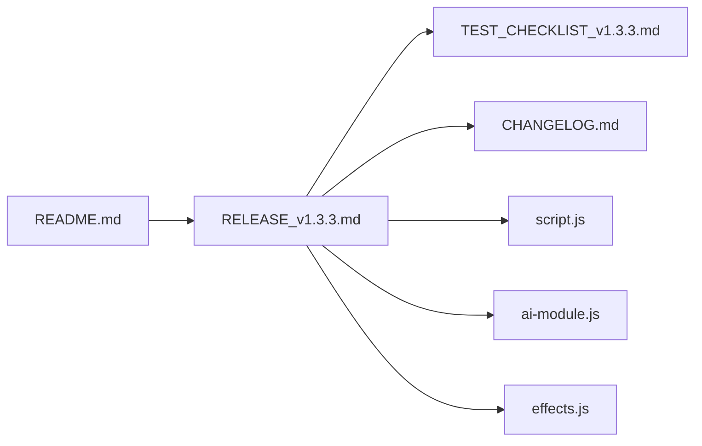

# 发布流程规范

<cite>
**本文引用的文件**
- [RELEASE_v1.3.3.md](file://RELEASE_v1.3.3.md)
- [CHANGELOG.md](file://CHANGELOG.md)
- [README.md](file://README.md)
- [TEST_CHECKLIST_v1.3.3.md](file://TEST_CHECKLIST_v1.3.3.md)
- [test_checklist.md](file://test_checklist.md)
- [script.js](file://script.js)
- [ai-module.js](file://ai-module.js)
- [effects.js](file://effects.js)
</cite>

## 目录
1. [引言](#引言)
2. [项目结构](#项目结构)
3. [核心组件](#核心组件)
4. [架构总览](#架构总览)
5. [详细组件分析](#详细组件分析)
6. [依赖关系分析](#依赖关系分析)
7. [性能考量](#性能考量)
8. [故障排查指南](#故障排查指南)
9. [结论](#结论)
10. [附录](#附录)

## 引言
本规范旨在建立标准化的版本发布流程，确保每次发布前均完成并审核对外发布的发布说明（RELEASE_vX.X.X.md），保证对外信息准确、完整且具吸引力。本文以 RELEASE_v1.3.3.md 为范例，系统梳理发布说明的必备要素与撰写要点，并结合仓库中的测试清单、变更日志与产品说明，给出可执行的发布流程与质量把关要求。

## 项目结构
围绕发布说明与版本发布相关的关键文件如下：
- 发布说明：RELEASE_v1.3.3.md
- 变更日志：CHANGELOG.md
- 产品说明：README.md
- 版本测试清单：TEST_CHECKLIST_v1.3.3.md、test_checklist.md
- 核心代码：script.js、ai-module.js、effects.js

图表来源
- [RELEASE_v1.3.3.md](file://RELEASE_v1.3.3.md#L1-L214)
- [CHANGELOG.md](file://CHANGELOG.md#L1-L130)
- [README.md](file://README.md#L1-L125)
- [TEST_CHECKLIST_v1.3.3.md](file://TEST_CHECKLIST_v1.3.3.md#L1-L178)
- [test_checklist.md](file://test_checklist.md#L1-L38)
- [script.js](file://script.js#L1-L200)
- [ai-module.js](file://ai-module.js#L1-L200)
- [effects.js](file://effects.js#L1-L200)

章节来源
- [RELEASE_v1.3.3.md](file://RELEASE_v1.3.3.md#L1-L214)
- [CHANGELOG.md](file://CHANGELOG.md#L1-L130)
- [README.md](file://README.md#L1-L125)
- [TEST_CHECKLIST_v1.3.3.md](file://TEST_CHECKLIST_v1.3.3.md#L1-L178)
- [test_checklist.md](file://test_checklist.md#L1-L38)

## 核心组件
- 发布说明（RELEASE_vX.X.X.md）：面向用户的版本发布文档，必须在代码合并前完成并经审核，确保信息完整、准确、易读。
- 变更日志（CHANGELOG.md）：记录每个版本的功能、技术更新、Bug修复与文档更新，作为发布说明的技术依据。
- 产品说明（README.md）：概述产品定位、核心功能与价值，用于对外宣传与用户引导。
- 测试清单（TEST_CHECKLIST_v1.3.3.md、test_checklist.md）：覆盖功能、性能、兼容性、边界情况等测试项，确保发布质量。
- 核心代码（script.js、ai-module.js、effects.js）：承载三大核心功能（摸鱼吉日签、工资计算、打卡特效）的实现，是发布说明中技术更新与使用指南的直接支撑。

章节来源
- [RELEASE_v1.3.3.md](file://RELEASE_v1.3.3.md#L1-L214)
- [CHANGELOG.md](file://CHANGELOG.md#L1-L130)
- [README.md](file://README.md#L1-L125)
- [TEST_CHECKLIST_v1.3.3.md](file://TEST_CHECKLIST_v1.3.3.md#L1-L178)
- [test_checklist.md](file://test_checklist.md#L1-L38)
- [script.js](file://script.js#L1-L200)
- [ai-module.js](file://ai-module.js#L1-L200)
- [effects.js](file://effects.js#L1-L200)

## 架构总览
发布流程围绕“文档先行、测试驱动、代码支撑”的闭环展开：
- 文档先行：发布说明在合并前完成，明确版本号、发布日期、核心亮点、技术更新、使用指南、界面预览、配置说明、已知问题与更新建议。
- 测试驱动：基于测试清单逐项验证功能、性能与兼容性，确保对外信息与实际能力一致。
- 代码支撑：三大核心功能由 script.js、ai-module.js、effects.js 实现，发布说明中的技术更新与使用指南直接映射到这些模块。

图表来源
- [RELEASE_v1.3.3.md](file://RELEASE_v1.3.3.md#L1-L214)
- [TEST_CHECKLIST_v1.3.3.md](file://TEST_CHECKLIST_v1.3.3.md#L1-L178)
- [script.js](file://script.js#L1-L200)
- [ai-module.js](file://ai-module.js#L1-L200)
- [effects.js](file://effects.js#L1-L200)

## 详细组件分析

### 发布说明（RELEASE_vX.X.X.md）结构与要求
- 版本号与发布日期：明确标注版本号与发布日期，便于追溯与用户识别。
- 核心亮点：以“三大核心功能”为主线，突出摸鱼吉日签、工资计算、打卡特效的价值与使用方法。
- 技术更新：列出新增/更新文件、数据存储键名、关键技术实现（如 Canvas 动画、AI 调用等），并与核心代码对应。
- 使用指南：提供首次使用与日常使用的步骤说明，配合界面预览帮助用户理解。
- 界面预览：以 ASCII 或截图形式展示关键界面，降低理解成本。
- 配置说明：明确配置项位置、默认值与计算规则，如月工资设置与日薪计算。
- 已知问题：如实披露当前版本存在的问题与处理建议。
- 更新建议：说明立即更新的理由与更新方式，提升用户迁移意愿。
- 用户反馈与致谢：鼓励用户参与反馈，体现社区互动。

章节来源
- [RELEASE_v1.3.3.md](file://RELEASE_v1.3.3.md#L1-L214)

### 以 RELEASE_v1.3.3.md 为例的撰写要点
- 版本号与发布日期：明确标注版本号与发布日期，便于用户与内部追溯。
- 三大核心功能：
  - 摸鱼吉日签：强调 AI 生成的运势、最佳摸鱼时间与锦囊，以及 Header 展示与“再求一签”功能。
  - 工资计算：说明月工资设置、日薪计算公式与下班打卡时的收入展示与 AI 幽默总结。
  - 打卡特效：描述上班打卡的阳光特效与下班打卡的礼花特效，强调 Canvas 与 requestAnimationFrame 的性能优化。
- 技术更新：列出新增/更新文件（如 effects.js、ai-module.js、script.js、styles.css、index.html），并说明数据存储键名（如 monthlySalary、moyuFortune_[date]）。
- 使用指南：提供首次设置与日常打卡步骤，包括上班打卡与下班打卡的具体流程。
- 界面预览：以 ASCII 方式展示摸鱼吉日签与工作总结卡片，帮助用户快速理解界面信息。
- 配置说明：明确月工资设置位置、默认值与计算公式。
- 已知问题：当前版本无已知问题，若出现 bug，提供反馈渠道。
- 更新建议：强调更新带来的趣味性、激励性与体验优化，并说明 PWA 自动更新方式。

章节来源
- [RELEASE_v1.3.3.md](file://RELEASE_v1.3.3.md#L1-L214)

### 变更日志（CHANGELOG.md）与发布说明的对应关系
- 变更日志记录版本的功能、技术改进、Bug 修复与文档更新，是发布说明中“技术更新”部分的重要依据。
- 发布说明在“技术更新”中汇总文件变更、新增模块与数据存储键名，形成面向用户的解释。
- 两者共同确保对外信息与内部实现一致。

章节来源
- [CHANGELOG.md](file://CHANGELOG.md#L1-L130)
- [RELEASE_v1.3.3.md](file://RELEASE_v1.3.3.md#L75-L120)

### 产品说明（README.md）与对外宣传
- README.md 提供产品定位、核心功能与价值，有助于在发布说明中强调用户价值与使用场景。
- 发布说明可引用 README 中的核心功能描述，增强一致性与可信度。

章节来源
- [README.md](file://README.md#L1-L125)
- [RELEASE_v1.3.3.md](file://RELEASE_v1.3.3.md#L32-L55)

### 测试清单（TEST_CHECKLIST_v1.3.3.md、test_checklist.md）与质量把关
- 测试清单覆盖首次设置、摸鱼吉日签、工资计算、特效系统、设置页面、数据持久化、UI/UX、兼容性与边界情况等。
- 发布说明中的“技术更新”“使用指南”“界面预览”应与测试清单中的具体项一一对应，确保对外信息真实可靠。
- 对于 v1.2.5 的测试清单，可作为历史参考，验证回归测试的完整性。

章节来源
- [TEST_CHECKLIST_v1.3.3.md](file://TEST_CHECKLIST_v1.3.3.md#L1-L178)
- [test_checklist.md](file://test_checklist.md#L1-L38)

### 核心代码（script.js、ai-module.js、effects.js）与功能支撑
- script.js：负责打卡逻辑、时间轴、设置与初始化等，是“使用指南”与“技术更新”的直接支撑。
- ai-module.js：封装 DeepSeek API 调用、兜底策略与提示词模板，支撑“摸鱼吉日签”“工资计算”“AI 幽默总结”等功能。
- effects.js：封装 Canvas 特效系统，支撑“打卡特效”的实现与性能优化。

图表来源
- [effects.js](file://effects.js#L1-L200)
- [ai-module.js](file://ai-module.js#L1-L200)
- [script.js](file://script.js#L1-L200)

章节来源
- [script.js](file://script.js#L1-L200)
- [ai-module.js](file://ai-module.js#L1-L200)
- [effects.js](file://effects.js#L1-L200)

## 依赖关系分析
- 发布说明依赖测试清单与变更日志，确保对外信息与测试结果一致。
- 发布说明依赖核心代码，确保技术更新与实现相符。
- README.md 为对外宣传提供统一口径，与发布说明协同。

图表来源
- [RELEASE_v1.3.3.md](file://RELEASE_v1.3.3.md#L1-L214)
- [TEST_CHECKLIST_v1.3.3.md](file://TEST_CHECKLIST_v1.3.3.md#L1-L178)
- [CHANGELOG.md](file://CHANGELOG.md#L1-L130)
- [README.md](file://README.md#L1-L125)
- [script.js](file://script.js#L1-L200)
- [ai-module.js](file://ai-module.js#L1-L200)
- [effects.js](file://effects.js#L1-L200)

章节来源
- [RELEASE_v1.3.3.md](file://RELEASE_v1.3.3.md#L1-L214)
- [TEST_CHECKLIST_v1.3.3.md](file://TEST_CHECKLIST_v1.3.3.md#L1-L178)
- [CHANGELOG.md](file://CHANGELOG.md#L1-L130)
- [README.md](file://README.md#L1-L125)
- [script.js](file://script.js#L1-L200)
- [ai-module.js](file://ai-module.js#L1-L200)
- [effects.js](file://effects.js#L1-L200)

## 性能考量
- 特效性能：使用 HTML5 Canvas 与 requestAnimationFrame，避免使用 setInterval；自动清理过期粒子，防止内存泄漏。
- AI 调用：提供兜底文案，网络异常或超时情况下仍可保证基本功能可用。
- 数据持久化：localStorage 存储月工资与每日运势，按日期隔离，避免跨日混淆。

章节来源
- [RELEASE_v1.3.3.md](file://RELEASE_v1.3.3.md#L68-L91)
- [ai-module.js](file://ai-module.js#L1-L200)
- [effects.js](file://effects.js#L1-L200)

## 故障排查指南
- AI 调用失败：确认 API 密钥配置；若失败则使用兜底文案；检查网络与超时设置。
- 特效异常：检查 Canvas 初始化与尺寸；确认动画循环未被中断；验证粒子生命周期与清理逻辑。
- 数据异常：核对 localStorage 键名（如 monthlySalary、moyuFortune_[date]）；验证跨日数据隔离逻辑。
- 测试未通过：对照测试清单逐项复现问题；优先修复影响范围广的功能；回归验证原有功能不受影响。

章节来源
- [TEST_CHECKLIST_v1.3.3.md](file://TEST_CHECKLIST_v1.3.3.md#L1-L178)
- [test_checklist.md](file://test_checklist.md#L1-L38)
- [ai-module.js](file://ai-module.js#L1-L200)
- [effects.js](file://effects.js#L1-L200)

## 结论
通过“文档先行、测试驱动、代码支撑”的发布流程，可以确保每次版本发布对外信息准确、完整且具吸引力。发布说明应围绕三大核心功能展开，结合测试清单与变更日志，形成可追溯、可验证的发布闭环。同时，核心代码的性能与稳定性是发布说明可信度的基础。

## 附录
- 发布说明模板（节选）：版本号、发布日期、核心亮点、技术更新、使用指南、界面预览、配置说明、已知问题、更新建议、用户反馈与致谢。
- 测试清单模板（节选）：首次设置、摸鱼吉日签、工资计算、特效系统、设置页面、数据持久化、UI/UX、兼容性、边界情况与回归测试。
- 核心代码要点：script.js 的打卡与时间轴逻辑、ai-module.js 的 AI 调用与兜底策略、effects.js 的 Canvas 特效实现。

章节来源
- [RELEASE_v1.3.3.md](file://RELEASE_v1.3.3.md#L1-L214)
- [TEST_CHECKLIST_v1.3.3.md](file://TEST_CHECKLIST_v1.3.3.md#L1-L178)
- [script.js](file://script.js#L1-L200)
- [ai-module.js](file://ai-module.js#L1-L200)
- [effects.js](file://effects.js#L1-L200)