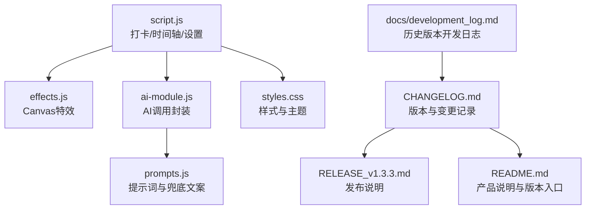
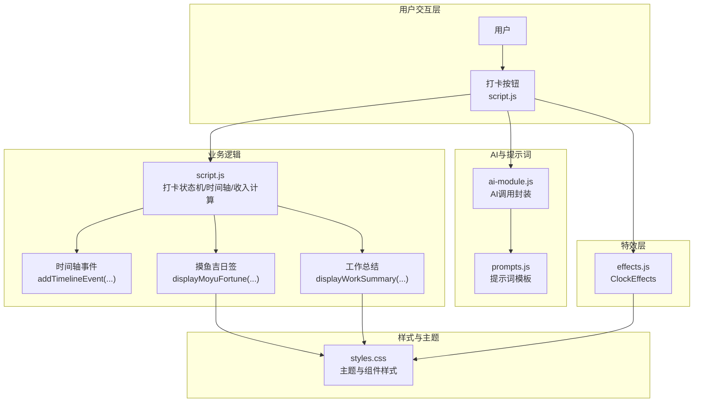
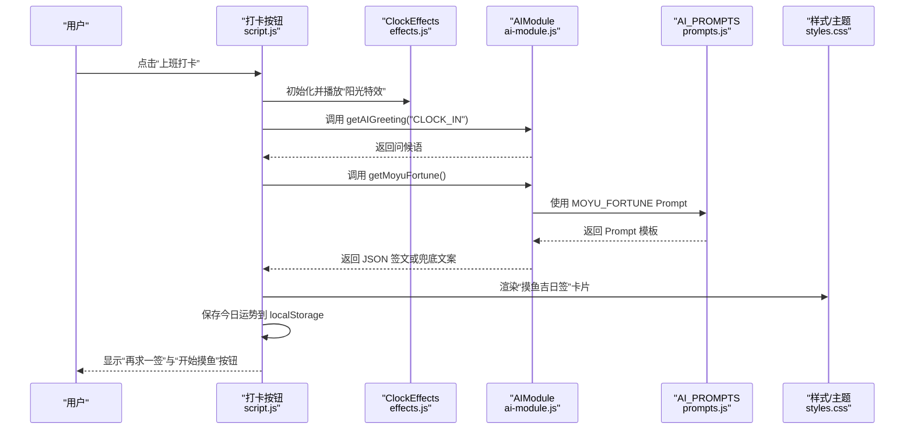
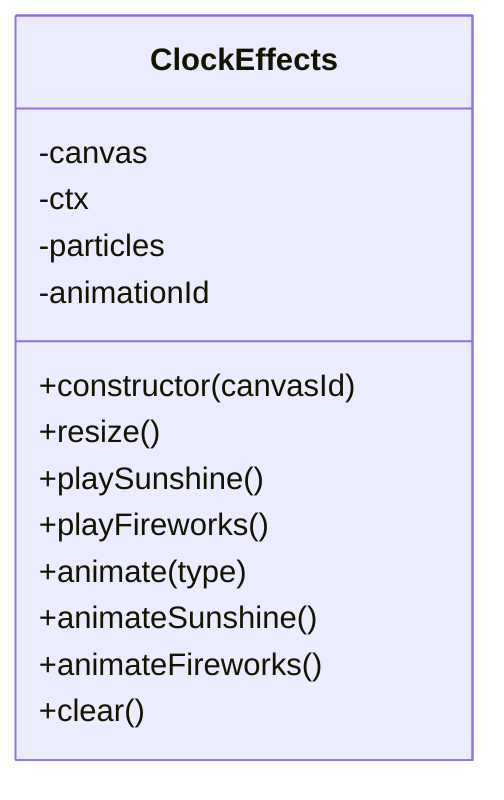
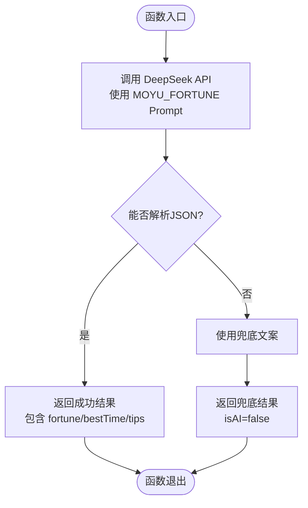

# 变更记录管理

<cite>
**本文引用的文件**
- [CHANGELOG.md](file://CHANGELOG.md)
- [RELEASE_v1.3.3.md](file://RELEASE_v1.3.3.md)
- [README.md](file://README.md)
- [script.js](file://script.js)
- [effects.js](file://effects.js)
- [prompts.js](file://prompts.js)
- [ai-module.js](file://ai-module.js)
- [styles.css](file://styles.css)
- [docs/development_log.md](file://docs/development_log.md)
</cite>

## 目录
1. [简介](#简介)
2. [项目结构](#项目结构)
3. [核心组件](#核心组件)
4. [架构总览](#架构总览)
5. [详细组件分析](#详细组件分析)
6. [依赖关系分析](#依赖关系分析)
7. [性能考量](#性能考量)
8. [故障排查指南](#故障排查指南)
9. [结论](#结论)
10. [附录](#附录)

## 简介
本文件系统化阐述本项目的变更记录编写规范与维护流程，重点围绕 CHANGELOG.md 的结构与内容要求展开，并以 v1.3.3 版本为例，详细说明“摸鱼吉日签”“工资计算与收入展示”“打卡特效”三大功能的新增细节。文档同时强调每次代码提交后必须同步更新变更日志，确保团队成员与用户能够清晰了解每次迭代的具体内容；并提供标准模板与推荐撰写风格，使日志具备一致性与可读性。

## 项目结构
本项目围绕前端静态页面与少量模块化脚本组织，变更记录相关的关键文件包括：
- 变更日志：CHANGELOG.md
- 发布说明：RELEASE_v1.3.3.md
- 产品说明：README.md
- 核心业务逻辑：script.js（打卡、时间轴、设置等）
- 特效模块：effects.js（Canvas 打卡特效）
- AI 提示词与兜底文案：prompts.js
- AI 调用封装：ai-module.js
- 样式与主题：styles.css
- 开发日志（历史版本记录）：docs/development_log.md

图表来源
- [CHANGELOG.md](file://CHANGELOG.md#L1-L130)
- [RELEASE_v1.3.3.md](file://RELEASE_v1.3.3.md#L1-L214)
- [README.md](file://README.md#L1-L125)
- [script.js](file://script.js#L493-L732)
- [effects.js](file://effects.js#L1-L279)
- [prompts.js](file://prompts.js#L1-L159)
- [ai-module.js](file://ai-module.js#L1-L216)
- [styles.css](file://styles.css#L1-L200)
- [docs/development_log.md](file://docs/development_log.md#L1-L200)

章节来源
- [CHANGELOG.md](file://CHANGELOG.md#L1-L130)
- [RELEASE_v1.3.3.md](file://RELEASE_v1.3.3.md#L1-L214)
- [README.md](file://README.md#L1-L125)
- [docs/development_log.md](file://docs/development_log.md#L1-L200)

## 核心组件
- 变更日志（CHANGELOG.md）：集中记录版本号、发布日期、新增功能、改进、技术变更、Bug 修复与文档更新，采用分级标题与条目化描述，便于追溯与查阅。
- 发布说明（RELEASE_v1.3.3.md）：面向用户的版本亮点、功能详解、使用指南、界面预览与配置说明，作为对外发布的配套材料。
- 产品说明（README.md）：概述产品定位、核心功能与版本历史入口，便于快速了解项目概况。
- 打卡与时间轴（script.js）：负责打卡状态机、时间轴事件记录、AI 问候与总结生成、工资配置与收入展示等。
- 特效模块（effects.js）：基于 Canvas 的高性能粒子特效，分别用于上班打卡的“阳光特效”与下班打卡的“礼花特效”。
- AI 模块（ai-module.js）：封装 DeepSeek API 调用、兜底策略与错误处理，支撑“摸鱼吉日签”“工作总结”等 AI 生成内容。
- 提示词与兜底文案（prompts.js）：统一管理 AI Prompt 模板与兜底文案，确保内容一致性与稳定性。
- 样式与主题（styles.css）：定义主题色系、卡片样式、布局与响应式设计，支撑“摸鱼吉日签”“工作总结”等 UI 组件。
- 开发日志（docs/development_log.md）：历史版本的详细开发记录，辅助理解版本演进与技术决策。

章节来源
- [CHANGELOG.md](file://CHANGELOG.md#L1-L130)
- [RELEASE_v1.3.3.md](file://RELEASE_v1.3.3.md#L1-L214)
- [README.md](file://README.md#L1-L125)
- [script.js](file://script.js#L493-L732)
- [effects.js](file://effects.js#L1-L279)
- [prompts.js](file://prompts.js#L1-L159)
- [ai-module.js](file://ai-module.js#L1-L216)
- [styles.css](file://styles.css#L378-L480)
- [docs/development_log.md](file://docs/development_log.md#L1-L200)

## 架构总览
下图展示了 v1.3.3 版本三大功能的交互路径与模块关系，体现“摸鱼吉日签”“工资计算与收入展示”“打卡特效”的协同工作方式。

图表来源
- [script.js](file://script.js#L493-L732)
- [effects.js](file://effects.js#L1-L279)
- [prompts.js](file://prompts.js#L1-L159)
- [ai-module.js](file://ai-module.js#L1-L216)
- [styles.css](file://styles.css#L378-L480)

## 详细组件分析

### v1.3.3 版本变更要点与撰写规范
- 版本号与发布日期：采用语义化版本控制，版本号形如 v1.3.3，发布日期格式为“YYYY-MM-DD”。在 CHANGELOG.md 中以二级标题呈现版本条目，并在 RELEASE_v1.3.3.md 中明确标注“发布日期”。
- 新功能：以三级标题“新功能”组织，按功能模块分节，每节包含功能名称、核心特性、使用场景与效果说明。示例中包含“摸鱼吉日签系统”“工资计算与收入展示”“打卡特效系统”三大模块。
- 技术改进：以三级标题“技术改进”组织，列出核心模块更新（如 prompts.js、ai-module.js、effects.js、script.js、styles.css），并说明新增函数、重构逻辑、模块化设计与性能优化。
- UI/UX 优化：以三级标题“UI/UX 优化”组织，描述样式更新、主题色系、布局优化与交互体验改进。
- Bug 修复：以三级标题“Bug 修复”组织，逐条列出修复问题与影响范围。
- 文档更新：以三级标题“文档更新”组织，列出新增/更新的文档与代码注释完善情况。

章节来源
- [CHANGELOG.md](file://CHANGELOG.md#L1-L130)
- [RELEASE_v1.3.3.md](file://RELEASE_v1.3.3.md#L1-L214)

### “摸鱼吉日签”功能新增细节
- 功能定位：替代传统打卡留言，生成趣味十足的“摸鱼吉日签”，包含“今日摸鱼运势”“最佳摸鱼时间”“摸鱼锦囊”三大核心信息，并支持“再求一签”。
- AI 生成与兜底：通过 prompts.js 中的 MOYU_FORTUNE Prompt 生成 JSON 结构内容；ai-module.js 调用 DeepSeek API 并解析 JSON；若失败则使用 FALLBACK_MESSAGES 的兜底文案。
- 前端展示：script.js 中 displayMoyuFortune(...) 负责渲染签文卡片；支持“再求一签”按钮与“开始摸鱼”确认；将今日运势写入 localStorage 以便 Header 展示。
- 样式与主题：styles.css 中定义黄色主题色系与卡片样式，Header 中的“每日留言条”用于展示今日运势。
- 特效配合：上班打卡时播放“阳光特效”，营造温暖氛围。

章节来源
- [prompts.js](file://prompts.js#L1-L60)
- [ai-module.js](file://ai-module.js#L95-L127)
- [script.js](file://script.js#L547-L732)
- [styles.css](file://styles.css#L378-L480)
- [effects.js](file://effects.js#L25-L62)

### “工资计算与收入展示”功能新增细节
- 月工资设置：首次设置向导与设置页面均支持配置“每月工资”，默认值为 8000 元；支持修改与保存。
- 智能日薪计算：按当月天数自动计算日薪，精确到小数点后两位；script.js 中 calculateDailyIncome(...) 负责计算逻辑。
- 收入展示：下班打卡时明确告知“今日赚了 XXX 元”，并在总结中高亮显示；displayWorkSummary(...) 生成幽默风格的 AI 总结，包含上班/下班时间、摸鱼次数与今日收入。
- 数据存储：localStorage 中保存 monthlySalary 与按日期隔离的 moyuFortune_[date]，避免数据混淆。

章节来源
- [script.js](file://script.js#L186-L223)
- [script.js](file://script.js#L734-L791)
- [RELEASE_v1.3.3.md](file://RELEASE_v1.3.3.md#L164-L177)

### “打卡特效”功能新增细节
- 阳光特效（上班打卡）：使用 Canvas 绘制 50 个金黄色光点，带光晕与重力下落效果，寓意充满希望的新一天开始。
- 礼花特效（下班打卡）：使用 Canvas 绘制 3 组彩色粒子从中心向外爆炸，带重力与摩擦效果，寓意圆满完成一天工作。
- 性能优化：requestAnimationFrame 优化动画流畅度；自动清理过期粒子，避免内存泄漏；特效层为全屏 Canvas 背景，不遮挡内容。
- 交互配合：script.js 中 initClockIn() 调用 ClockEffects.playSunshine()/playFireworks()，并在 FINISHED 状态下显示工作总结。

章节来源
- [effects.js](file://effects.js#L25-L62)
- [effects.js](file://effects.js#L64-L141)
- [effects.js](file://effects.js#L135-L273)
- [script.js](file://script.js#L547-L732)

### 代码级交互序列（以“上班打卡”为例）

图表来源
- [script.js](file://script.js#L547-L732)
- [effects.js](file://effects.js#L25-L62)
- [ai-module.js](file://ai-module.js#L95-L127)
- [prompts.js](file://prompts.js#L1-L60)
- [styles.css](file://styles.css#L378-L480)

### 代码级类关系（ClockEffects）

图表来源
- [effects.js](file://effects.js#L1-L279)

### 代码级流程图（getMoyuFortune）

图表来源
- [ai-module.js](file://ai-module.js#L95-L127)
- [prompts.js](file://prompts.js#L1-L60)

## 依赖关系分析
- 模块耦合与内聚
  - script.js 与 effects.js：通过 ClockEffects 类解耦，打卡事件驱动特效播放，职责清晰。
  - script.js 与 ai-module.js：通过 window.AIModule 接口调用，实现 AI 功能模块化。
  - ai-module.js 与 prompts.js：通过全局对象 window.AI_PROMPTS 使用 Prompt 模板，统一内容生成策略。
  - script.js 与 styles.css：通过类名与主题色系协作，确保 UI 一致性与可维护性。
- 外部依赖与集成点
  - DeepSeek API：通过 ai-module.js 进行统一调用与错误处理。
  - localStorage：用于持久化月工资、今日运势、打卡状态与时间轴数据。
- 潜在循环依赖
  - 当前模块间通过全局命名空间 window.AIModule 与 window.AI_PROMPTS 进行弱耦合，未发现明显循环依赖。

章节来源
- [script.js](file://script.js#L493-L732)
- [effects.js](file://effects.js#L1-L279)
- [ai-module.js](file://ai-module.js#L1-L216)
- [prompts.js](file://prompts.js#L1-L159)
- [styles.css](file://styles.css#L378-L480)

## 性能考量
- Canvas 动画优化：使用 requestAnimationFrame 控制帧率，减少主线程阻塞；粒子生命周期结束后自动清理，避免内存泄漏。
- AI 调用策略：在 getMoyuFortune()/generateWorkSummary() 中设置合理的 temperature 与 maxTokens，平衡生成质量与延迟；失败时使用兜底文案，保证交互流畅。
- 样式与布局：styles.css 中的主题色系与响应式设计减少不必要的重绘与回流；Header 与卡片采用渐变与阴影，兼顾美观与性能。
- 数据存储：localStorage 按日期隔离存储，避免跨日数据污染；script.js 中对时间轴与打卡状态的读写集中在统一入口，降低复杂度。

章节来源
- [effects.js](file://effects.js#L135-L273)
- [ai-module.js](file://ai-module.js#L1-L216)
- [styles.css](file://styles.css#L378-L480)
- [script.js](file://script.js#L1-L120)

## 故障排查指南
- AI 密钥未配置
  - 现象：调用 DeepSeek API 抛出“未配置 API 密钥”错误。
  - 处理：在设置页面配置 deepseekApiKey，并通过“测试连接”验证。
- AI 返回非 JSON
  - 现象：getMoyuFortune() 解析失败，触发兜底文案。
  - 处理：检查 Prompt 模板与模型返回格式；必要时调整 temperature 与 maxTokens。
- 打卡状态异常
  - 现象：按钮文案未随状态变化或 FINISHED 状态无法查看总结。
  - 处理：确认 localStorage 中 lastClockInType 与 lastClockInDate 是否正确；script.js 中 updateClockInButton() 与 addTimelineEvent() 的调用链是否正常。
- 特效不显示或卡顿
  - 现象：Canvas 未绘制或动画卡顿。
  - 处理：检查 Canvas 尺寸与 resize 事件；确认 requestAnimationFrame 是否被取消；清理过期粒子后重新播放。

章节来源
- [ai-module.js](file://ai-module.js#L14-L59)
- [script.js](file://script.js#L547-L732)
- [effects.js](file://effects.js#L135-L273)

## 结论
本项目在 v1.3.3 版本实现了三大核心功能：摸鱼吉日签、工资计算与收入展示、打卡特效。变更记录（CHANGELOG.md）与发布说明（RELEASE_v1.3.3.md）共同构成了版本沟通的双轨体系，既满足团队内部追溯，也面向用户清晰传达价值。通过模块化设计与统一的 AI/Prompt/样式策略，系统在可维护性与用户体验之间取得良好平衡。建议持续坚持“提交即更新变更日志”的流程，确保每次迭代都有据可查、有迹可循。

## 附录

### 变更记录标准模板（v1.3.3 示例）
- 版本与日期
  - v1.3.3 (YYYY-MM-DD)
- 新功能
  - 摸鱼吉日签系统
    - 替代传统打卡留言，生成趣味签文，包含“今日摸鱼运势”“最佳摸鱼时间”“摸鱼锦囊”，支持“再求一签”。
    - Header 展示今日运势，风格积极幽默。
  - 工资计算与收入展示
    - 首次设置向导与设置页面支持“每月工资”配置，默认 8000 元。
    - 按当月天数自动计算日薪，精确到小数点后两位。
    - 下班打卡时高亮显示“今日收入”，并生成幽默风格的 AI 总结。
  - 打卡特效系统
    - 上班打卡：50 个金黄色光点，带光晕与重力下落，营造温暖氛围。
    - 下班打卡：3 组彩色粒子爆炸，七彩随机生成，寓意圆满完成。
    - 高性能实现：Canvas 绘制、requestAnimationFrame 优化、自动清理粒子。
- 技术改进
  - prompts.js：新增 MOYU_FORTUNE 与 WORK_SUMMARY Prompt，更新兜底文案。
  - ai-module.js：新增 getMoyuFortune() 与 generateWorkSummary()，完善错误处理。
  - effects.js：全新模块，封装 ClockEffects 类，支持多种特效与模块化扩展。
  - script.js：重构打卡点击事件处理，新增 displayMoyuFortune/calculateDailyIncome/displayWorkSummary，完善月工资保存与加载逻辑。
  - styles.css：新增摸鱼吉日签与工作总结样式，采用黄色主题色系与响应式布局。
  - 数据存储：新增 monthlySalary 与 moyuFortune_[date]，按日期隔离数据。
- UI/UX 优化
  - 摸鱼吉日签卡片：黄色渐变背景、金色边框、清晰信息分层、操作按钮。
  - 工作总结展示：蓝色渐变 AI 文案区、2x2 网格布局、今日收入高亮突出。
  - 打卡弹窗：全屏 Canvas 背景层、特效不遮挡内容、10 秒自动关闭倒计时。
- Bug 修复
  - 修复日历组件丢失问题（v1.3.2 遗留）。
  - 修复日历布局不合理，改为左右分栏。
  - 修复时间轴事件记录支持 fortune 字段。
- 文档更新
  - 创建 CHANGELOG.md 版本日志。
  - 更新 README.md 功能说明。
  - 完善代码注释。

章节来源
- [CHANGELOG.md](file://CHANGELOG.md#L1-L130)
- [RELEASE_v1.3.3.md](file://RELEASE_v1.3.3.md#L1-L214)
- [README.md](file://README.md#L1-L125)