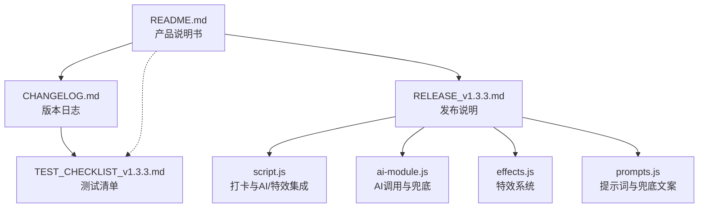
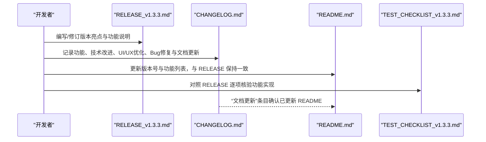
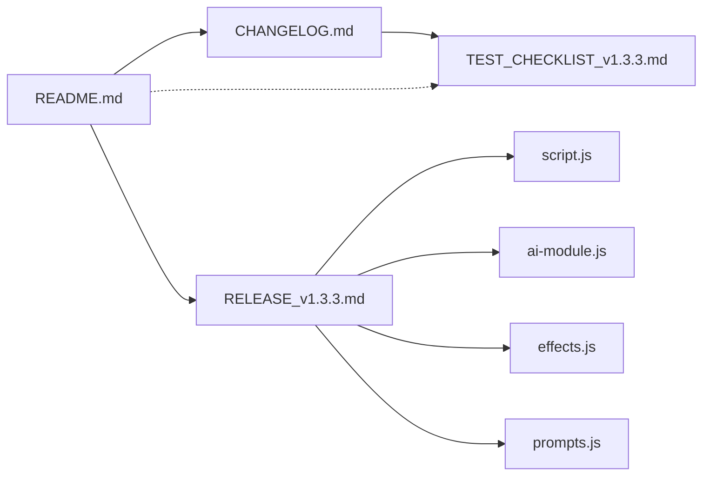

# 文档同步与维护

<cite>
**本文引用的文件**
- [README.md](file://README.md)
- [CHANGELOG.md](file://CHANGELOG.md)
- [RELEASE_v1.3.3.md](file://RELEASE_v1.3.3.md)
- [TEST_CHECKLIST_v1.3.3.md](file://TEST_CHECKLIST_v1.3.3.md)
- [test_checklist.md](file://test_checklist.md)
- [script.js](file://script.js)
- [ai-module.js](file://ai-module.js)
- [effects.js](file://effects.js)
- [prompts.js](file://prompts.js)
</cite>

## 目录
1. [引言](#引言)
2. [项目结构](#项目结构)
3. [核心组件](#核心组件)
4. [架构总览](#架构总览)
5. [详细组件分析](#详细组件分析)
6. [依赖关系分析](#依赖关系分析)
7. [性能考量](#性能考量)
8. [故障排查指南](#故障排查指南)
9. [结论](#结论)
10. [附录](#附录)

## 引言
本文件旨在建立并规范 Work Timer 项目的文档一致性维护机制，确保 README.md、CHANGELOG.md 与 RELEASE_vX.X.X.md 三者之间信息同步，尤其在每次版本发布后，必须同步更新 README 中的版本号与功能列表，使其与最新发布说明保持一致。本文还提供检查清单与 CI/CD 建议，降低文档滞后与遗漏风险，提升维护效率。

## 项目结构
围绕文档一致性，项目中与版本发布和功能说明直接相关的文件包括：
- README.md：产品说明书，包含版本号、功能列表、使用场景、产品结构概览、版本历史等
- CHANGELOG.md：版本更新日志，记录每个版本的功能、技术改进、UI/UX优化、Bug修复与文档更新
- RELEASE_v1.3.3.md：针对 v1.3.3 的发布说明，包含版本亮点、三大核心功能详解、技术更新、使用指南、界面预览、配置说明、已知问题、更新建议、用户反馈与致谢
- TEST_CHECKLIST_v1.3.3.md：v1.3.3 的测试清单，覆盖摸鱼吉日签、工资计算、特效系统、设置与数据持久化、UI/UX、兼容性、边界情况与回归测试
- test_checklist.md：早期版本（v1.2.5）的功能测试清单，体现测试与文档的协同关系
- 脚本与模块：script.js、ai-module.js、effects.js、prompts.js，支撑 README/RELEASE 中功能描述的技术实现

图表来源
- [README.md](file://README.md#L1-L125)
- [CHANGELOG.md](file://CHANGELOG.md#L1-L130)
- [RELEASE_v1.3.3.md](file://RELEASE_v1.3.3.md#L1-L214)
- [script.js](file://script.js#L493-L732)
- [ai-module.js](file://ai-module.js#L1-L216)
- [effects.js](file://effects.js#L1-L279)
- [prompts.js](file://prompts.js#L1-L159)
- [TEST_CHECKLIST_v1.3.3.md](file://TEST_CHECKLIST_v1.3.3.md#L1-L178)

章节来源
- [README.md](file://README.md#L1-L125)
- [CHANGELOG.md](file://CHANGELOG.md#L1-L130)
- [RELEASE_v1.3.3.md](file://RELEASE_v1.3.3.md#L1-L214)
- [TEST_CHECKLIST_v1.3.3.md](file://TEST_CHECKLIST_v1.3.3.md#L1-L178)
- [test_checklist.md](file://test_checklist.md#L1-L38)

## 核心组件
- 文档三件套职责
  - README.md：面向用户的产品说明书，包含版本号、功能列表、典型使用场景、产品结构概览、版本历史入口与结语
  - CHANGELOG.md：面向维护者的版本日志，记录功能、技术改进、UI/UX优化、Bug修复与文档更新
  - RELEASE_vX.X.X.md：面向用户的发布说明，详述版本亮点、三大核心功能、技术更新、使用指南、界面预览、配置说明、已知问题、更新建议与致谢
- 版本发布流程中的文档同步要点
  - 在版本发布后，必须同步更新 README 的版本号与功能列表，确保与 RELEASE 一致
  - CHANGELOG 的“文档更新”条目应与 README/RELEASE 的更新保持一致
  - 测试清单（TEST_CHECKLIST_v1.3.3.md）作为功能验证依据，应与 RELEASE 的功能描述一一对应

章节来源
- [README.md](file://README.md#L1-L125)
- [CHANGELOG.md](file://CHANGELOG.md#L1-L130)
- [RELEASE_v1.3.3.md](file://RELEASE_v1.3.3.md#L1-L214)
- [TEST_CHECKLIST_v1.3.3.md](file://TEST_CHECKLIST_v1.3.3.md#L1-L178)

## 架构总览
文档一致性维护的总体流程如下：
- 版本发布前：在 RELEASE 中明确版本亮点与三大核心功能；在 CHANGELOG 中记录功能、技术改进、UI/UX优化、Bug修复与文档更新
- 版本发布后：在 README 中更新版本号与功能列表，确保与 RELEASE 一致；在 CHANGELOG 的“文档更新”中确认已更新 README
- 测试阶段：依据 TEST_CHECKLIST_v1.3.3.md 核验功能，确保文档描述与实现一致

图表来源
- [RELEASE_v1.3.3.md](file://RELEASE_v1.3.3.md#L1-L214)
- [CHANGELOG.md](file://CHANGELOG.md#L100-L112)
- [README.md](file://README.md#L1-L125)
- [TEST_CHECKLIST_v1.3.3.md](file://TEST_CHECKLIST_v1.3.3.md#L1-L178)

## 详细组件分析

### README.md 的版本与功能同步
- 版本号与更新日期：需与发布日期保持一致
- 功能列表：应包含 RELEASE 中的三大核心功能（摸鱼吉日签、工资计算与收入展示、打卡特效），并标注新增版本号
- 版本历史入口：指向 CHANGELOG.md，便于追溯详细更新记录
- 建议在每次发布后立即更新 README 的版本号与功能列表，避免滞后

章节来源
- [README.md](file://README.md#L1-L125)

### CHANGELOG.md 的版本与文档更新
- 版本条目：记录三大核心功能、技术改进、UI/UX优化、Bug修复与文档更新
- “文档更新”条目：应明确创建/更新了 CHANGELOG.md 与 README.md 的功能说明
- 建议在发布后立即补充“文档更新”条目，确保与 README/RELEASE 保持一致

章节来源
- [CHANGELOG.md](file://CHANGELOG.md#L1-L130)

### RELEASE_v1.3.3.md 的功能与实现映射
- 版本亮点：三大核心功能（摸鱼吉日签、工资计算与收入展示、打卡特效）
- 使用指南：首次使用、日常使用（上班/下班打卡）、查看运势
- 界面预览：摸鱼吉日签与工作总结的界面示意
- 技术更新：新增/更新文件、数据存储键名
- 配置说明：月工资设置与日薪计算公式
- 建议将 RELEASE 作为 README/CHANGELOG 的权威来源，确保三者一致

章节来源
- [RELEASE_v1.3.3.md](file://RELEASE_v1.3.3.md#L1-L214)

### TEST_CHECKLIST_v1.3.3.md 的核验作用
- 覆盖三大核心功能：摸鱼吉日签、工资计算、特效系统
- 包含设置页面、数据持久化、UI/UX、兼容性、边界情况与回归测试
- 建议在发布前对照 RELEASE 逐项核验，确保文档描述与实现一致

章节来源
- [TEST_CHECKLIST_v1.3.3.md](file://TEST_CHECKLIST_v1.3.3.md#L1-L178)

### 脚本与模块对文档的支撑
- script.js：打卡逻辑、时间轴记录、AI/特效集成、月工资与摸鱼运势的本地存储
- ai-module.js：AI调用封装、兜底策略、错误处理
- effects.js：特效系统（阳光特效/礼花特效）的实现
- prompts.js：提示词模板与兜底文案，支撑摸鱼吉日签与工作总结

章节来源
- [script.js](file://script.js#L493-L732)
- [ai-module.js](file://ai-module.js#L1-L216)
- [effects.js](file://effects.js#L1-L279)
- [prompts.js](file://prompts.js#L1-L159)

## 依赖关系分析
- 文档间依赖
  - README 依赖 CHANGELOG 与 RELEASE 的权威信息
  - CHANGELOG 依赖 RELEASE 的功能描述与技术更新
  - 测试清单依赖 RELEASE 的功能范围与使用指南
- 实现依赖
  - RELEASE 中的功能描述与脚本/模块实现一一对应，确保文档与代码一致

图表来源
- [README.md](file://README.md#L1-L125)
- [CHANGELOG.md](file://CHANGELOG.md#L1-L130)
- [RELEASE_v1.3.3.md](file://RELEASE_v1.3.3.md#L1-L214)
- [script.js](file://script.js#L493-L732)
- [ai-module.js](file://ai-module.js#L1-L216)
- [effects.js](file://effects.js#L1-L279)
- [prompts.js](file://prompts.js#L1-L159)
- [TEST_CHECKLIST_v1.3.3.md](file://TEST_CHECKLIST_v1.3.3.md#L1-L178)

## 性能考量
- 文档同步的性能体现在维护效率与一致性保障上，而非代码执行性能
- 建议在 CI/CD 中增加文档一致性检查步骤，减少人工核对成本

## 故障排查指南
- 常见问题
  - README 与 RELEASE 描述不一致：对照 RELEASE 逐项修正 README 的功能列表与版本号
  - CHANGELOG 缺少“文档更新”条目：补充后与 README/RELEASE 保持一致
  - 测试清单未覆盖新功能：根据 RELEASE 补充测试项并执行回归测试
- 排查步骤
  - 对照 RELEASE 的三大核心功能，逐项检查 README 与 CHANGELOG 是否同步
  - 使用 TEST_CHECKLIST_v1.3.3.md 核验功能实现，确保文档描述与实际一致
  - 如发现实现差异，优先修正实现或文档，确保二者一致

章节来源
- [README.md](file://README.md#L1-L125)
- [CHANGELOG.md](file://CHANGELOG.md#L100-L112)
- [RELEASE_v1.3.3.md](file://RELEASE_v1.3.3.md#L1-L214)
- [TEST_CHECKLIST_v1.3.3.md](file://TEST_CHECKLIST_v1.3.3.md#L1-L178)

## 结论
通过建立“发布前—发布后—测试核验”的文档一致性维护流程，并在 CI/CD 中加入文档检查步骤，可有效避免 README、CHANGELOG 与 RELEASE 的信息不一致问题。建议将 TEST_CHECKLIST 作为功能验证的依据，确保文档描述与实现保持同步，持续提升维护效率与质量。

## 附录

### 文档同步检查清单（发布后必检）
- README
  - 版本号与更新日期与发布日期一致
  - 功能列表包含三大核心功能（摸鱼吉日签、工资计算与收入展示、打卡特效），并标注新增版本号
  - 版本历史入口指向 CHANGELOG.md
- CHANGELOG
  - “文档更新”条目包含创建/更新 CHANGELOG.md 与 README.md 的功能说明
  - 与 RELEASE 的功能描述保持一致
- RELEASE
  - 版本亮点、使用指南、界面预览、配置说明与脚本/模块实现一致
- 测试清单
  - TEST_CHECKLIST_v1.3.3.md 覆盖三大核心功能与设置、数据持久化、UI/UX、兼容性、边界情况与回归测试
  - 与 RELEASE 的功能范围一致

章节来源
- [README.md](file://README.md#L1-L125)
- [CHANGELOG.md](file://CHANGELOG.md#L100-L112)
- [RELEASE_v1.3.3.md](file://RELEASE_v1.3.3.md#L1-L214)
- [TEST_CHECKLIST_v1.3.3.md](file://TEST_CHECKLIST_v1.3.3.md#L1-L178)

### CI/CD 建议（可选）
- 在构建/发布流程中增加文档一致性检查任务：
  - 校验 README 的版本号与发布日期是否与 RELEASE 一致
  - 校验 README 的功能列表是否包含 RELEASE 的三大核心功能
  - 校验 CHANGELOG 的“文档更新”条目是否存在
  - 校验 TEST_CHECKLIST 是否覆盖 RELEASE 的核心功能
- 若检查失败，阻断发布并提示修复

[本节为通用建议，不直接分析具体文件，故无章节来源]