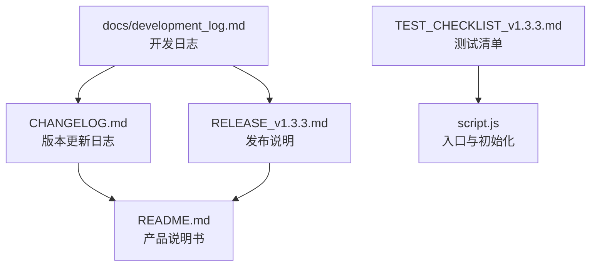
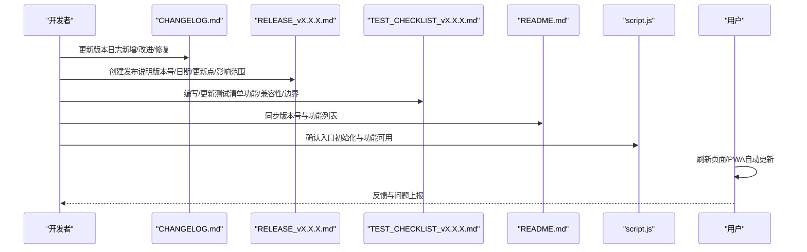
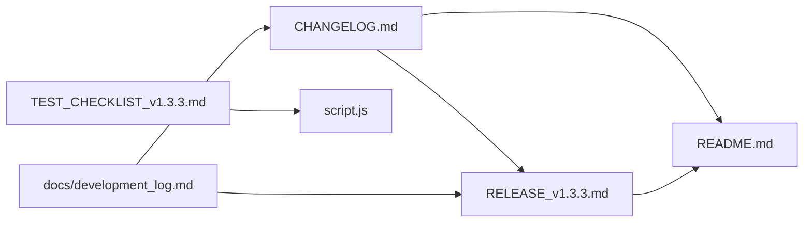

# 版本管理与发布

<cite>
**本文引用的文件**
- [CHANGELOG.md](file://CHANGELOG.md)
- [README.md](file://README.md)
- [RELEASE_v1.3.3.md](file://RELEASE_v1.3.3.md)
- [TEST_CHECKLIST_v1.3.3.md](file://TEST_CHECKLIST_v1.3.3.md)
- [script.js](file://script.js)
- [development_log.md](file://docs/development_log.md)
</cite>

## 目录
1. [简介](#简介)
2. [项目结构](#项目结构)
3. [核心组件](#核心组件)
4. [架构总览](#架构总览)
5. [详细组件分析](#详细组件分析)
6. [依赖关系分析](#依赖关系分析)
7. [性能考量](#性能考量)
8. [故障排查指南](#故障排查指南)
9. [结论](#结论)
10. [附录](#附录)

## 简介
本文件旨在制定并规范 Work Timer 的版本管理与发布流程，确保每次发布均遵循语义化版本（SemVer）规则，并配套完成变更日志（CHANGELOG.md）、发布说明（RELEASE_vX.X.X.md）、测试清单（TEST_CHECKLIST_vX.X.X.md）以及文档同步更新（README.md）。同时提供版本回退与兼容性处理建议，保障发布质量与可追溯性。

## 项目结构
围绕版本管理的关键文件分布如下：
- 版本日志与发布说明：CHANGELOG.md、RELEASE_v1.3.3.md
- 文档同步：README.md
- 测试与验证：TEST_CHECKLIST_v1.3.3.md
- 代码入口与初始化：script.js
- 开发日志与版本记录：docs/development_log.md

图表来源
- [CHANGELOG.md](file://CHANGELOG.md#L1-L130)
- [README.md](file://README.md#L1-L125)
- [RELEASE_v1.3.3.md](file://RELEASE_v1.3.3.md#L1-L214)
- [TEST_CHECKLIST_v1.3.3.md](file://TEST_CHECKLIST_v1.3.3.md#L1-L178)
- [script.js](file://script.js#L90-L160)
- [development_log.md](file://docs/development_log.md#L1-L120)

章节来源
- [CHANGELOG.md](file://CHANGELOG.md#L1-L130)
- [README.md](file://README.md#L1-L125)
- [RELEASE_v1.3.3.md](file://RELEASE_v1.3.3.md#L1-L214)
- [TEST_CHECKLIST_v1.3.3.md](file://TEST_CHECKLIST_v1.3.3.md#L1-L178)
- [development_log.md](file://docs/development_log.md#L1-L120)

## 核心组件
- 版本号与语义化版本（SemVer）：采用主版本号.次版本号.修订号的三段式命名，遵循语义化版本规则，变更影响范围决定版本号升级策略。
- 变更日志（CHANGELOG.md）：每次发布必须更新，记录新增功能、改进、技术变更与Bug修复，并在文档中体现。
- 发布说明（RELEASE_vX.X.X.md）：发布前创建，包含版本号、发布日期、主要更新点、影响范围、使用指南、界面预览、配置说明、已知问题与更新建议。
- 文档同步（README.md）：版本号与功能列表需与最新版本保持一致，确保文档与代码一致。
- 测试清单（TEST_CHECKLIST_vX.X.X.md）：发布前完成全面测试，覆盖功能、UI/UX、兼容性与边界情况，形成可追溯的测试结果统计。
- 代码入口（script.js）：页面加载时初始化应用、标签页、侧边栏、番茄钟、AI设置、打卡功能、时间轴、指令控制、快捷功能、日历事件等，确保发布后功能可用。

章节来源
- [CHANGELOG.md](file://CHANGELOG.md#L1-L130)
- [README.md](file://README.md#L1-L125)
- [RELEASE_v1.3.3.md](file://RELEASE_v1.3.3.md#L1-L214)
- [TEST_CHECKLIST_v1.3.3.md](file://TEST_CHECKLIST_v1.3.3.md#L1-L178)
- [script.js](file://script.js#L90-L160)

## 架构总览
版本管理流程围绕“发布前准备—发布—发布后验证—回退与兼容性处理”闭环展开，关键节点包括：
- 发布前：创建 RELEASE_vX.X.X.md，完善 TEST_CHECKLIST_vX.X.X.md，更新 CHANGELOG.md 与 README.md。
- 发布中：通过 PWA 或刷新页面完成用户侧更新。
- 发布后：收集用户反馈，记录已知问题，必要时执行回退与兼容性修复。

图表来源
- [CHANGELOG.md](file://CHANGELOG.md#L1-L130)
- [RELEASE_v1.3.3.md](file://RELEASE_v1.3.3.md#L1-L214)
- [TEST_CHECKLIST_v1.3.3.md](file://TEST_CHECKLIST_v1.3.3.md#L1-L178)
- [README.md](file://README.md#L1-L125)
- [script.js](file://script.js#L90-L160)

## 详细组件分析

### 版本号规则（语义化版本 SemVer）
- 主版本号：不兼容的变更（如API结构变化、核心功能重构）。
- 次版本号：向下兼容的功能新增（如新增摸鱼吉日签、工资计算、打卡特效）。
- 修订号：向下兼容的问题修复（如日历组件修复、布局优化）。
- 适用范围：本次 v1.3.3 新增三大功能，属于次版本号升级；若涉及不兼容变更，则升级主版本号。

章节来源
- [CHANGELOG.md](file://CHANGELOG.md#L1-L130)

### 变更日志（CHANGELOG.md）
- 内容要求：记录新增功能、技术改进、UI/UX优化、Bug修复与文档更新。
- 示例：v1.3.3 新增摸鱼吉日签、工资计算与收入展示、打卡特效三大功能，涵盖prompt与模块更新、样式与特效实现、数据存储与UI展示等。
- 同步要求：每次发布后需在文档中体现版本号与功能列表。

章节来源
- [CHANGELOG.md](file://CHANGELOG.md#L1-L130)
- [README.md](file://README.md#L1-L125)

### 发布说明（RELEASE_vX.X.X.md）
- 内容要求：版本号、发布日期、版本亮点（三大核心功能）、技术更新（新增/更新文件、数据存储）、使用指南（首次使用/日常使用）、界面预览（摸鱼吉日签/工作总结）、配置说明（月工资设置与计算公式）、已知问题、更新建议（立即更新理由、更新方式）、用户反馈与致谢。
- 示例：v1.3.3 发布说明包含三大功能亮点、新增文件与更新文件、月工资配置与计算公式、界面预览与使用指南等。

章节来源
- [RELEASE_v1.3.3.md](file://RELEASE_v1.3.3.md#L1-L214)

### 文档同步（README.md）
- 内容要求：版本号与更新日期、核心功能列表（含新增功能标注版本）、版本历史与最新版本摘要。
- 示例：README.md 中明确标注最新版本为 v1.3.3，并在功能列表中标注新增的摸鱼吉日签、工资计算与收入展示、打卡特效。

章节来源
- [README.md](file://README.md#L1-L125)

### 测试清单（TEST_CHECKLIST_vX.X.X.md）
- 内容要求：功能测试（首次设置、摸鱼吉日签、工资计算、特效系统、设置页面、数据持久化、UI/UX、兼容性、边界情况、回归测试）、Bug记录、测试结果统计、测试备注。
- 示例：v1.3.3 测试清单覆盖首次设置、摸鱼吉日签、工资计算、特效系统、设置页面、数据持久化、UI/UX、兼容性、边界情况与回归测试，共计87项测试项。

章节来源
- [TEST_CHECKLIST_v1.3.3.md](file://TEST_CHECKLIST_v1.3.3.md#L1-L178)

### 代码入口与初始化（script.js）
- 内容要求：页面加载时初始化应用、标签页、侧边栏、番茄钟、AI设置、打卡功能、时间轴、指令控制、快捷功能、日历事件等，确保发布后功能可用。
- 示例：script.js 在页面加载后初始化多项功能，包括时间轴加载与保存、打卡功能初始化、日历事件初始化等。

章节来源
- [script.js](file://script.js#L90-L160)

### 开发日志与版本记录（docs/development_log.md）
- 内容要求：版本记录表与详细更新记录，用于追溯版本演进与功能迭代。
- 示例：开发日志包含版本记录表与详细更新记录，便于对照版本管理流程。

章节来源
- [development_log.md](file://docs/development_log.md#L1-L120)

## 依赖关系分析
- 版本日志与发布说明：CHANGELOG.md 与 RELEASE_v1.3.3.md 相互印证，前者记录变更，后者面向用户说明。
- 文档同步：README.md 与 CHANGELOG.md/RELEASE_v1.3.3.md 同步更新，确保版本号与功能列表一致。
- 测试验证：TEST_CHECKLIST_v1.3.3.md 与 script.js 初始化逻辑共同保障发布质量。
- 开发日志：development_log.md 为版本演进提供历史依据。

图表来源
- [CHANGELOG.md](file://CHANGELOG.md#L1-L130)
- [RELEASE_v1.3.3.md](file://RELEASE_v1.3.3.md#L1-L214)
- [README.md](file://README.md#L1-L125)
- [TEST_CHECKLIST_v1.3.3.md](file://TEST_CHECKLIST_v1.3.3.md#L1-L178)
- [script.js](file://script.js#L90-L160)
- [development_log.md](file://docs/development_log.md#L1-L120)

## 性能考量
- 发布前测试：通过 TEST_CHECKLIST_v1.3.3.md 的性能测试项（Canvas初始化、requestAnimationFrame使用、粒子自动清理、内存占用）验证特效系统的性能表现。
- 用户侧更新：通过 PWA 自动更新或刷新页面完成版本升级，确保用户获得最新体验。

章节来源
- [TEST_CHECKLIST_v1.3.3.md](file://TEST_CHECKLIST_v1.3.3.md#L59-L80)
- [RELEASE_v1.3.3.md](file://RELEASE_v1.3.3.md#L68-L72)

## 故障排查指南
- 版本号不一致：核对 README.md 与 CHANGELOG.md/RELEASE_v1.3.3.md 的版本号与功能列表，确保同步。
- 功能缺失：对照 TEST_CHECKLIST_v1.3.3.md 的测试项逐项验证，确认 script.js 初始化逻辑是否正确执行。
- 已知问题：参考 RELEASE_v1.3.3.md 的“已知问题”部分，收集用户反馈并记录在案。
- 回退与兼容性：若发现不兼容变更或重大缺陷，按 SemVer 规则回退至上一稳定版本，并在 CHANGELOG.md 中记录回退原因与修复计划。

章节来源
- [README.md](file://README.md#L1-L125)
- [CHANGELOG.md](file://CHANGELOG.md#L1-L130)
- [RELEASE_v1.3.3.md](file://RELEASE_v1.3.3.md#L180-L196)
- [TEST_CHECKLIST_v1.3.3.md](file://TEST_CHECKLIST_v1.3.3.md#L1-L178)

## 结论
通过建立完善的版本管理与发布流程，Work Timer 能够确保每次发布具备可追溯性、可验证性与可回退性。遵循 SemVer 规则、严格执行发布前文档与测试、保持文档与代码一致，是保障产品稳定交付与持续演进的关键。

## 附录
- 版本管理流程建议
  - 发布前：创建 RELEASE_vX.X.X.md，编写/更新 TEST_CHECKLIST_vX.X.X.md，更新 CHANGELOG.md 与 README.md。
  - 发布中：通过 PWA 或刷新页面完成用户侧更新。
  - 发布后：收集用户反馈，记录已知问题，必要时执行回退与兼容性修复。
- 版本回退与兼容性处理
  - 若出现不兼容变更或重大缺陷，按 SemVer 规则回退至上一稳定版本，并在 CHANGELOG.md 中记录回退原因与修复计划。
  - 对于兼容性问题，优先采用向后兼容的实现方式，必要时提供迁移指南。