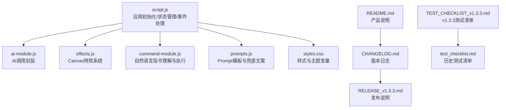
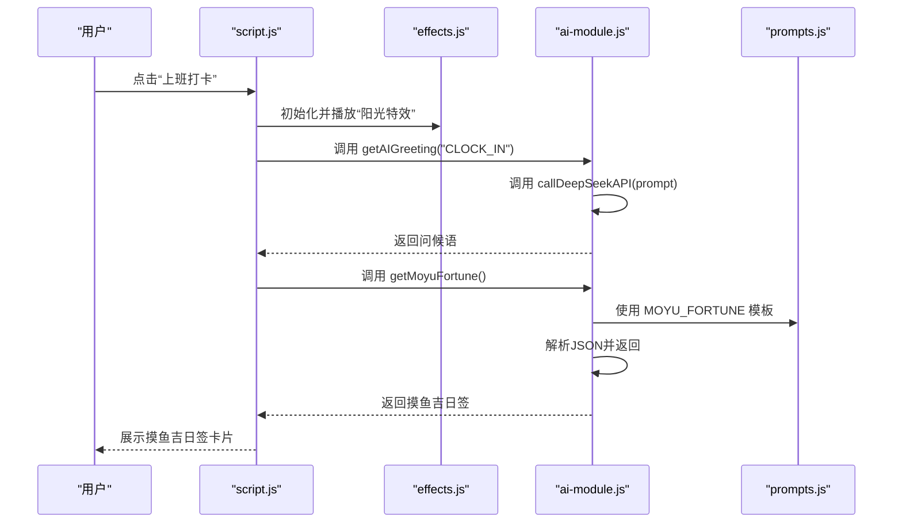
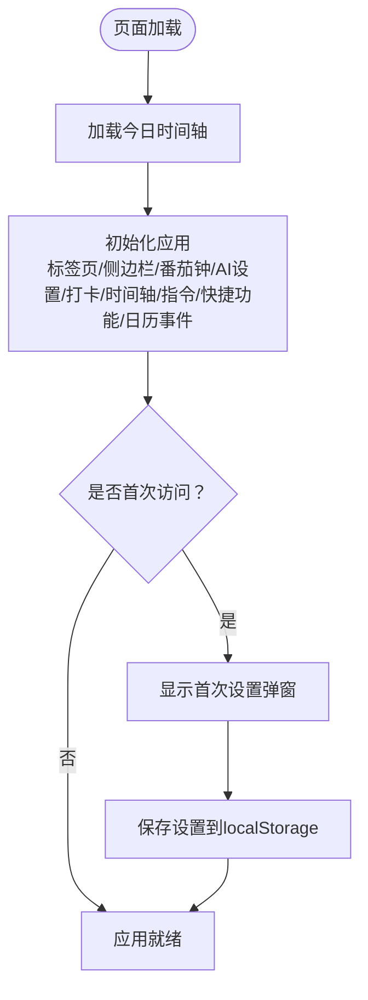
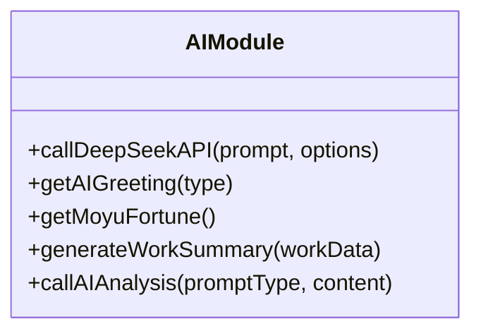
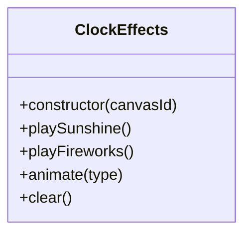
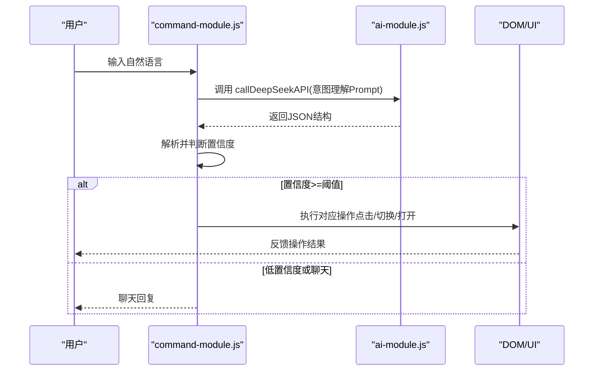
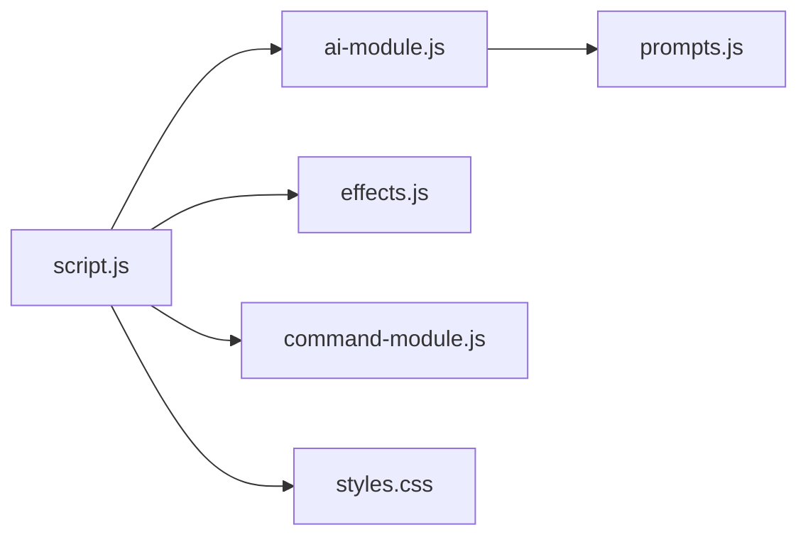

# 贡献指南

<cite>
**本文引用的文件**
- [README.md](file://README.md)
- [CHANGELOG.md](file://CHANGELOG.md)
- [RELEASE_v1.3.3.md](file://RELEASE_v1.3.3.md)
- [TEST_CHECKLIST_v1.3.3.md](file://TEST_CHECKLIST_v1.3.3.md)
- [test_checklist.md](file://test_checklist.md)
- [script.js](file://script.js)
- [ai-module.js](file://ai-module.js)
- [effects.js](file://effects.js)
- [prompts.js](file://prompts.js)
- [command-module.js](file://command-module.js)
- [styles.css](file://styles.css)
</cite>

## 目录
1. [简介](#简介)
2. [项目结构](#项目结构)
3. [核心组件](#核心组件)
4. [架构总览](#架构总览)
5. [详细组件分析](#详细组件分析)
6. [依赖关系分析](#依赖关系分析)
7. [性能与质量特性](#性能与质量特性)
8. [版本变更与发布流程](#版本变更与发布流程)
9. [Pull Request 规范与代码审查要点](#pull-request-规范与代码审查要点)
10. [Bug 报告与功能建议流程](#bug-报告与功能建议流程)
11. [故障排查指南](#故障排查指南)
12. [结论](#结论)

## 简介
本贡献指南面向开发者，旨在帮助大家高效参与 Work Timer 项目的开发与维护。内容涵盖：
- 代码提交流程与规范
- 编码风格与一致性要求
- 版本变更管理与发布流程
- Pull Request 创建规范与审查要点
- 测试要求与验收标准
- Bug 报告与功能建议流程，促进社区协作

## 项目结构
Work Timer 采用前端单页应用结构，核心文件围绕功能模块划分：
- 主入口与应用初始化：script.js
- AI 能力封装：ai-module.js、prompts.js
- 打卡特效系统：effects.js
- 自然语言指令控制：command-module.js
- 样式与主题：styles.css
- 文档与发布材料：README.md、CHANGELOG.md、RELEASE_v1.3.3.md、测试清单等

图表来源
- [script.js](file://script.js#L1-L120)
- [ai-module.js](file://ai-module.js#L1-L60)
- [effects.js](file://effects.js#L1-L40)
- [command-module.js](file://command-module.js#L1-L60)
- [prompts.js](file://prompts.js#L1-L40)
- [styles.css](file://styles.css#L1-L40)
- [README.md](file://README.md#L1-L40)
- [CHANGELOG.md](file://CHANGELOG.md#L1-L40)
- [RELEASE_v1.3.3.md](file://RELEASE_v1.3.3.md#L1-L40)
- [TEST_CHECKLIST_v1.3.3.md](file://TEST_CHECKLIST_v1.3.3.md#L1-L40)
- [test_checklist.md](file://test_checklist.md#L1-L20)

章节来源
- [README.md](file://README.md#L1-L40)
- [script.js](file://script.js#L1-L120)

## 核心组件
- 应用初始化与状态管理：负责页面加载、标签页切换、侧边栏、番茄钟、AI设置、打卡流程、时间轴与本地存储等。
- AI 能力模块：封装 DeepSeek API 调用、问候语、摸鱼吉日签、工作总结、兜底文案与随机兜底消息。
- 特效系统：基于 Canvas 的全屏粒子动画，分别用于上班打卡的“阳光”与下班打卡的“礼花”。
- 自然语言指令模块：将用户自然语言转为结构化指令，执行对应 UI 操作或聊天回复。
- Prompt 与兜底文案：集中管理 AI 提示词模板与兜底文案，便于统一风格与回退策略。
- 样式系统：CSS 变量与组件化样式，支撑主题色与响应式布局。

章节来源
- [script.js](file://script.js#L1-L200)
- [ai-module.js](file://ai-module.js#L1-L120)
- [effects.js](file://effects.js#L1-L120)
- [command-module.js](file://command-module.js#L1-L120)
- [prompts.js](file://prompts.js#L1-L120)
- [styles.css](file://styles.css#L1-L120)

## 架构总览
整体采用“模块化 + 事件驱动”的前端架构：
- 模块职责清晰：AI、特效、指令、样式、主应用相互解耦
- 事件驱动：打卡、标签切换、侧边栏、番茄钟等均通过事件绑定与状态更新
- 数据持久化：localStorage 存储工作时间、月工资、打卡状态、时间轴与每日运势
- 错误兜底：AI 调用失败时使用兜底文案，保证用户体验连续性

图表来源
- [script.js](file://script.js#L540-L732)
- [effects.js](file://effects.js#L25-L86)
- [ai-module.js](file://ai-module.js#L61-L127)
- [prompts.js](file://prompts.js#L1-L40)

章节来源
- [script.js](file://script.js#L540-L732)
- [effects.js](file://effects.js#L25-L86)
- [ai-module.js](file://ai-module.js#L61-L127)
- [prompts.js](file://prompts.js#L1-L40)

## 详细组件分析

### 组件一：应用初始化与状态管理（script.js）
- 职责：页面加载初始化、标签页与侧边栏、番茄钟、AI 设置、打卡流程、时间轴、快捷功能、日历事件、设置保存与缓存清理
- 关键点：
  - 本地存储键：工作时间、月工资、打卡状态、时间轴、每日运势等
  - 打卡按钮状态机：根据当天是否已打卡、已下班等状态动态切换
  - 事件记录：时间轴事件类型与附加数据，便于后续统计与展示
  - 开发者模式：支持自定义时间与一键重置，便于测试

图表来源
- [script.js](file://script.js#L95-L155)
- [script.js](file://script.js#L163-L223)

章节来源
- [script.js](file://script.js#L95-L223)

### 组件二：AI 能力封装（ai-module.js）
- 职责：封装 DeepSeek API 调用、问候语、摸鱼吉日签、工作总结、兜底文案与随机兜底消息
- 关键点：
  - API 调用参数：温度、最大 Token、Top-P
  - 错误处理：捕获异常并返回兜底文案，保证 UI 不中断
  - Prompt 注入：通过占位符替换生成个性化总结

图表来源
- [ai-module.js](file://ai-module.js#L1-L216)

章节来源
- [ai-module.js](file://ai-module.js#L1-L216)

### 组件三：特效系统（effects.js）
- 职责：基于 Canvas 的粒子动画，实现“阳光特效”和“礼花特效”
- 关键点：
  - 全屏画布：随窗口大小变化自动重绘
  - 动画循环：使用 requestAnimationFrame 保证流畅度
  - 清理机制：关闭弹窗或切换状态时清除粒子与动画

图表来源
- [effects.js](file://effects.js#L1-L120)

章节来源
- [effects.js](file://effects.js#L1-L120)

### 组件四：自然语言指令模块（command-module.js）
- 职责：将用户自然语言转换为结构化指令，执行对应 UI 操作或聊天回复
- 关键点：
  - 意图判断：置信度阈值，低于阈值仅聊天不执行
  - 指令类型：打卡、番茄钟、时间轴、日历、标签页切换、摸鱼、设置、聊天
  - 执行动作：通过 DOM 查询与模拟点击触发 UI 行为

图表来源
- [command-module.js](file://command-module.js#L182-L259)
- [ai-module.js](file://ai-module.js#L1-L60)

章节来源
- [command-module.js](file://command-module.js#L1-L200)

### 组件五：Prompt 与兜底文案（prompts.js）
- 职责：统一管理 AI 提示词模板与兜底文案，确保风格一致与回退策略
- 关键点：
  - 模板：摸鱼吉日签、工作总结、新闻分析等
  - 兜底：随机兜底文案，保证在 AI 失败时仍能提供内容

章节来源
- [prompts.js](file://prompts.js#L1-L159)

### 组件六：样式系统（styles.css）
- 职责：提供主题变量、组件样式与响应式布局
- 关键点：
  - CSS 变量：统一主色、阴影、圆角等
  - 组件：侧边栏、AI 悬浮窗、导航、卡片等

章节来源
- [styles.css](file://styles.css#L1-L120)

## 依赖关系分析
- 模块间依赖：
  - script.js 依赖 ai-module.js、effects.js、command-module.js、prompts.js、styles.css
  - ai-module.js 依赖 prompts.js 与 localStorage 中的 API Key
  - effects.js 依赖 Canvas API
  - command-module.js 依赖 script.js 的 UI 状态与 DOM 查询
- 外部依赖：
  - DeepSeek API（通过 ai-module.js 调用）
  - 浏览器 Canvas 与 requestAnimationFrame

图表来源
- [script.js](file://script.js#L1-L120)
- [ai-module.js](file://ai-module.js#L1-L60)
- [effects.js](file://effects.js#L1-L40)
- [command-module.js](file://command-module.js#L1-L60)
- [prompts.js](file://prompts.js#L1-L40)
- [styles.css](file://styles.css#L1-L40)

章节来源
- [script.js](file://script.js#L1-L120)
- [ai-module.js](file://ai-module.js#L1-L60)
- [effects.js](file://effects.js#L1-L40)
- [command-module.js](file://command-module.js#L1-L60)
- [prompts.js](file://prompts.js#L1-L40)
- [styles.css](file://styles.css#L1-L40)

## 性能与质量特性
- 动画性能：特效系统使用 Canvas 与 requestAnimationFrame，避免频繁重排；提供 clear 方法清理过期粒子，防止内存泄漏
- 错误兜底：AI 调用失败时返回兜底文案，保证 UI 连续性
- 本地存储：合理拆分键名（如按日期隔离运势），避免冲突
- 响应式设计：样式系统支持移动端与桌面端，提升跨设备体验

章节来源
- [effects.js](file://effects.js#L200-L279)
- [ai-module.js](file://ai-module.js#L95-L167)
- [script.js](file://script.js#L1-L60)

## 版本变更与发布流程
- 版本日志维护：每次迭代更新 CHANGELOG.md，记录新增功能、技术改进、UI/UX 优化、Bug 修复与文档更新
- 发布说明：发布新版本时同步更新 RELEASE_v1.3.3.md，包含版本亮点、技术更新、使用指南、界面预览、配置说明与已知问题
- 测试清单：每个版本配套测试清单，覆盖功能测试、边界情况、兼容性与回归测试，确保质量
- 发布节奏：建议以功能里程碑或修复紧急问题为触发点，保持版本命名规范（如 v1.3.3）

章节来源
- [CHANGELOG.md](file://CHANGELOG.md#L1-L120)
- [RELEASE_v1.3.3.md](file://RELEASE_v1.3.3.md#L1-L120)
- [TEST_CHECKLIST_v1.3.3.md](file://TEST_CHECKLIST_v1.3.3.md#L1-L120)
- [test_checklist.md](file://test_checklist.md#L1-L38)

## Pull Request 规范与代码审查要点
- 提交前检查
  - 本地测试：对照测试清单逐项验证核心功能、边界条件与兼容性
  - 代码风格：遵循现有命名约定（驼峰命名、常量大写、模块导出）、注释规范与文件组织
  - 依赖最小化：避免引入不必要的第三方库，优先使用现有模块能力
- PR 描述规范
  - 标题：简洁明了，体现变更范围（如“feat(ai): 增加工作总结兜底文案”）
  - 摘要：说明动机、改动点、影响范围与风险提示
  - 截图/录屏：涉及 UI/UX 变更时附带截图或录屏
- 代码审查要点
  - 逻辑正确性：打卡状态机、时间轴事件、特效播放顺序是否正确
  - 错误处理：AI 调用失败、网络异常、Canvas 清理是否完备
  - 性能与内存：粒子数量、动画帧率、事件监听器是否释放
  - 可维护性：模块职责单一、函数粒度合理、变量命名清晰
- 合并前置
  - 通过自动化检查（如 Lint、测试覆盖率）
  - 更新 CHANGELOG.md 与相关文档
  - 本地回归测试通过

章节来源
- [script.js](file://script.js#L540-L732)
- [ai-module.js](file://ai-module.js#L95-L167)
- [effects.js](file://effects.js#L200-L279)
- [command-module.js](file://command-module.js#L182-L259)
- [prompts.js](file://prompts.js#L1-L159)
- [TEST_CHECKLIST_v1.3.3.md](file://TEST_CHECKLIST_v1.3.3.md#L1-L178)

## Bug 报告与功能建议流程
- Bug 报告
  - 在提交 Issue 前，确认是否已在测试清单中覆盖该场景
  - 提供最小复现步骤、期望行为、实际行为与环境信息（操作系统、浏览器、分辨率）
  - 如涉及 AI 或特效，附带错误日志与截图
- 功能建议
  - 明确使用场景与收益，对比现有方案的优劣
  - 提供草图或原型说明（UI/UX），便于评审
  - 评估对现有模块的耦合度与维护成本
- 社区协作
  - 讨论阶段保持开放与尊重，及时更新进展
  - 开发者可认领任务并在 PR 中关联 Issue

章节来源
- [TEST_CHECKLIST_v1.3.3.md](file://TEST_CHECKLIST_v1.3.3.md#L120-L178)
- [test_checklist.md](file://test_checklist.md#L1-L38)

## 故障排查指南
- 打卡按钮状态异常
  - 检查 localStorage 中的 lastClockInType 与 lastClockInDate 是否按日期重置
  - 确认跨日逻辑与定时更新按钮状态的间隔
- AI 调用失败
  - 确认已保存 API Key，检查网络连通性
  - 查看错误日志与兜底文案是否生效
- 特效不显示或卡顿
  - 检查 Canvas 初始化与 resize 事件
  - 确认 requestAnimationFrame 是否被正确调度与清理
- 自然语言指令无效
  - 检查置信度阈值与命令解析返回
  - 确认 DOM 查询与点击事件是否命中目标元素

章节来源
- [script.js](file://script.js#L540-L732)
- [ai-module.js](file://ai-module.js#L1-L120)
- [effects.js](file://effects.js#L120-L200)
- [command-module.js](file://command-module.js#L182-L259)

## 结论
本指南提供了从代码提交到版本发布的全流程规范，强调一致性、可维护性与用户体验。请在提交 PR 前对照测试清单与现有模块职责，确保变更可控、文档齐全、测试完备。欢迎社区成员积极反馈与协作，共同提升 Work Timer 的质量与体验。