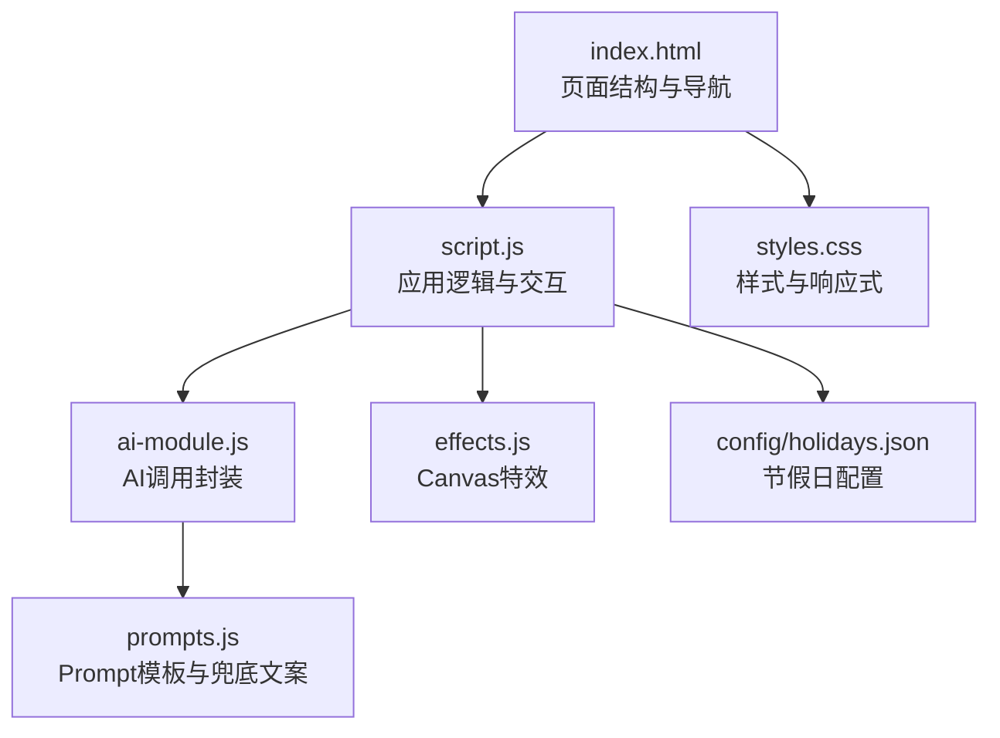
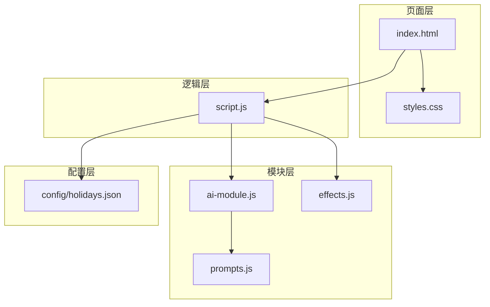
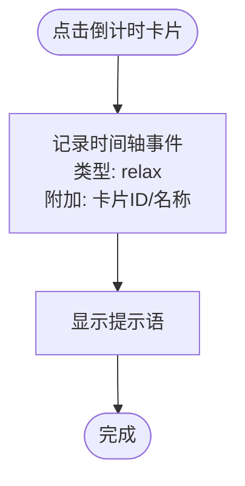
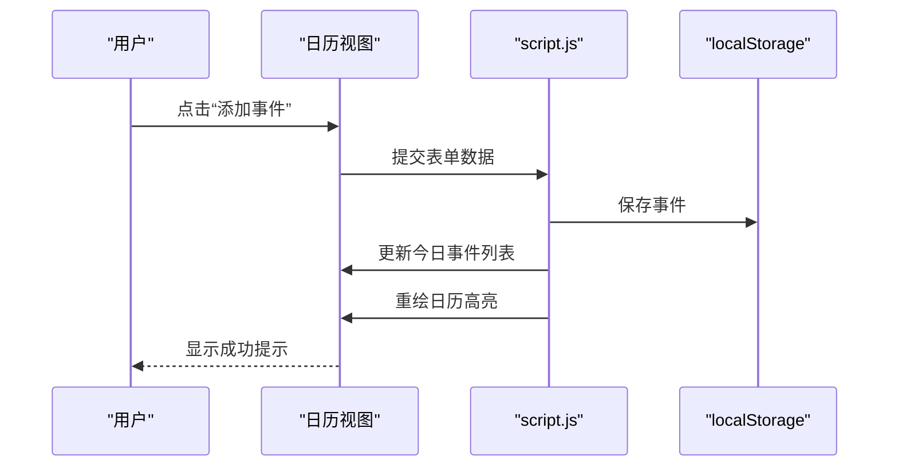
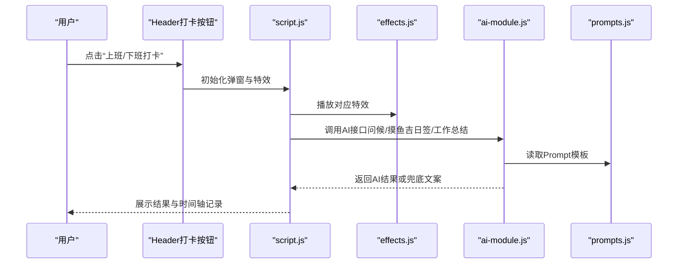
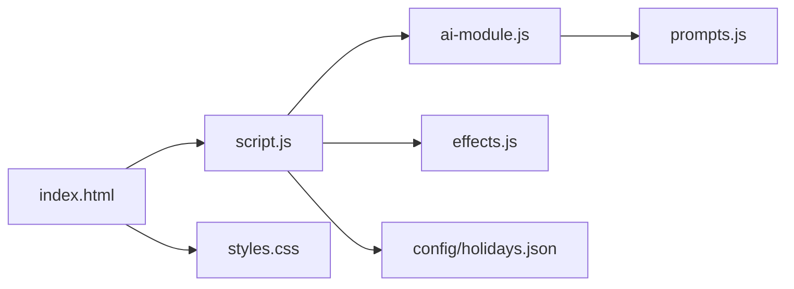

# 快速开始

<cite>
**本文引用的文件**
- [README.md](file://README.md)
- [index.html](file://index.html)
- [script.js](file://script.js)
- [ai-module.js](file://ai-module.js)
- [prompts.js](file://prompts.js)
- [effects.js](file://effects.js)
- [styles.css](file://styles.css)
- [config/holidays.json](file://config/holidays.json)
</cite>

## 目录
1. [简介](#简介)
2. [项目结构](#项目结构)
3. [核心组件](#核心组件)
4. [架构总览](#架构总览)
5. [详细组件分析](#详细组件分析)
6. [依赖关系分析](#依赖关系分析)
7. [性能与体验](#性能与体验)
8. [故障排查](#故障排查)
9. [结论](#结论)
10. [附录：使用步骤与界面说明](#附录使用步骤与界面说明)

## 简介
Work Timer 是一款专为职场人士设计的工作与假期管理工具，支持桌面与移动端。它帮助用户清晰掌握距离下一个假期、发薪日或重要事件的时间，合理规划工作进度；新增的“摸鱼吉日签”“工资计算”“打卡特效”等功能，让打卡不再单调，增添趣味与正向激励。

## 项目结构
- 入口页面：index.html
- 核心逻辑：script.js
- AI 能力：ai-module.js、prompts.js
- 打卡特效：effects.js
- 样式：styles.css
- 配置：config/holidays.json
- 其他页面：rmrb/index.html、surf/index.html

图表来源
- [index.html](file://index.html#L1-L120)
- [script.js](file://script.js#L1-L120)
- [ai-module.js](file://ai-module.js#L1-L60)
- [prompts.js](file://prompts.js#L1-L60)
- [effects.js](file://effects.js#L1-L60)
- [styles.css](file://styles.css#L1-L60)
- [config/holidays.json](file://config/holidays.json#L1-L46)

章节来源
- [README.md](file://README.md#L90-L125)
- [index.html](file://index.html#L1-L120)

## 核心组件
- 首页倒计时卡片：展示“下班倒计时”“本周剩余工作时间”“发薪倒计时”“期待时间”等，点击卡片可记录“摸鱼”行为。
- 日历视图：左右分栏布局，左侧日历高亮不同日期类型，右侧添加事件与查看当日事件。
- 设置页：配置工作时间、月工资、发薪日类型与发薪日、节假日、AI密钥等。
- 移动端底部导航：快速切换“倒计时”“日历”“人民日报”“网上冲浪”“设置”。
- 打卡与AI：上班/下班打卡弹窗，生成“摸鱼吉日签”或“今日工作总结”，并播放特效。
- 存钱罐进度条：按日均工资展示“工资进度”。

章节来源
- [README.md](file://README.md#L12-L87)
- [index.html](file://index.html#L225-L480)
- [script.js](file://script.js#L1080-L1110)

## 架构总览
应用采用“页面 + 逻辑 + 模块”的组织方式：
- 页面层：index.html 定义结构与导航，引入样式与脚本。
- 逻辑层：script.js 负责初始化、标签页切换、倒计时、打卡、日历、设置、时间轴等。
- 模块层：ai-module.js 封装 DeepSeek API 调用；prompts.js 提供 Prompt 模板与兜底文案；effects.js 提供 Canvas 特效。
- 配置层：config/holidays.json 提供节假日与周末上班日配置。

图表来源
- [index.html](file://index.html#L1-L120)
- [script.js](file://script.js#L1-L120)
- [ai-module.js](file://ai-module.js#L1-L60)
- [prompts.js](file://prompts.js#L1-L60)
- [effects.js](file://effects.js#L1-L60)
- [config/holidays.json](file://config/holidays.json#L1-L46)

## 详细组件分析

### 首页倒计时卡片
- 卡片类型：下班倒计时、本周剩余工作时间、发薪倒计时、期待时间（节假日/午休等）。
- 行为：点击卡片会记录“摸鱼”事件到时间轴，并弹出提示语。
- 数据来源：script.js 中的倒计时计算与事件排序，日历渲染时合并节假日与发薪日。

图表来源
- [script.js](file://script.js#L2726-L2784)

章节来源
- [index.html](file://index.html#L227-L285)
- [script.js](file://script.js#L2726-L2784)

### 日历视图
- 左侧日历：高亮工作日、周末、公休假期、串休上班日、自定义假期、发薪日。
- 右侧功能：添加事件（标题、类型、时间、备注），查看当日事件列表。
- 交互：左右切换月份，点击日期可选择目标日期。

图表来源
- [index.html](file://index.html#L320-L395)
- [script.js](file://script.js#L2786-L3024)

章节来源
- [index.html](file://index.html#L287-L395)
- [script.js](file://script.js#L2484-L2580)

### 设置页
- 工作时间：上班/午休开始/午休结束/下班时间。
- 工资与发薪日：月工资、发薪日类型（固定/最后一天）、发薪日。
- 节假日：导入/重置/导出法定节假日与周末上班日配置。
- AI密钥：保存 DeepSeek API Key 并测试连接。
- 自定义事件：添加名称、时间、重复周期。

章节来源
- [index.html](file://index.html#L360-L461)
- [script.js](file://script.js#L130-L155)
- [config/holidays.json](file://config/holidays.json#L1-L46)

### 打卡与AI
- 上班打卡：生成问候语，播放“阳光特效”，弹出“摸鱼吉日签”，支持“再求一签”和“保存”。
- 下班打卡：生成问候语，播放“礼花特效”，生成“今日工作总结”。
- AI密钥：在设置页保存并测试，失败时使用兜底文案。

图表来源
- [index.html](file://index.html#L71-L165)
- [script.js](file://script.js#L493-L732)
- [effects.js](file://effects.js#L1-L120)
- [ai-module.js](file://ai-module.js#L1-L120)
- [prompts.js](file://prompts.js#L1-L60)

章节来源
- [index.html](file://index.html#L71-L165)
- [script.js](file://script.js#L493-L732)
- [ai-module.js](file://ai-module.js#L1-L120)
- [prompts.js](file://prompts.js#L1-L60)
- [effects.js](file://effects.js#L1-L120)

### 存钱罐进度条与工资计算
- 月工资设置后，按当月天数自动计算日薪，展示“工资进度”。
- 发薪倒计时：根据发薪日类型与节假日调整，计算到最近一次发薪日的天数。

章节来源
- [index.html](file://index.html#L258-L285)
- [script.js](file://script.js#L2671-L2718)
- [script.js](file://script.js#L3063-L3077)

## 依赖关系分析
- index.html 引入样式与脚本，挂载页面结构与导航。
- script.js 依赖 localStorage 实现数据持久化，依赖 ai-module.js 与 prompts.js 调用 AI，依赖 effects.js 播放特效，依赖 config/holidays.json 进行节假日与发薪日计算。
- ai-module.js 依赖 localStorage 中的 API Key，调用 DeepSeek API，失败时回退到兜底文案。
- styles.css 提供响应式布局与主题样式，移动端底部导航与卡片布局。

图表来源
- [index.html](file://index.html#L1-L120)
- [script.js](file://script.js#L1-L120)
- [ai-module.js](file://ai-module.js#L1-L60)
- [prompts.js](file://prompts.js#L1-L60)
- [effects.js](file://effects.js#L1-L60)
- [config/holidays.json](file://config/holidays.json#L1-L46)
- [styles.css](file://styles.css#L1-L60)

章节来源
- [index.html](file://index.html#L1-L120)
- [script.js](file://script.js#L1-L120)
- [ai-module.js](file://ai-module.js#L1-L60)
- [prompts.js](file://prompts.js#L1-L60)
- [effects.js](file://effects.js#L1-L60)
- [config/holidays.json](file://config/holidays.json#L1-L46)
- [styles.css](file://styles.css#L1-L60)

## 性能与体验
- Canvas 动画：使用 requestAnimationFrame 控制帧率，避免卡顿；特效粒子随生命周期清理，降低内存占用。
- 倒计时：每秒更新一次，避免频繁 DOM 操作；卡片点击事件绑定一次，防止重复监听。
- 本地存储：使用 localStorage 缓存工作时间、工资、节假日、AI密钥等，减少网络请求与初始化成本。
- 响应式设计：移动端底部导航与卡片布局适配小屏幕，提升单手操作体验。

章节来源
- [effects.js](file://effects.js#L135-L200)
- [script.js](file://script.js#L1097-L1101)
- [styles.css](file://styles.css#L1126-L1188)

## 故障排查
- 无法连接AI：在设置页保存 DeepSeek API Key 并点击“测试连接”。若失败，检查密钥是否正确、网络是否可用，或使用兜底文案。
- 打卡无反应：确认浏览器允许弹窗与 Canvas 渲染；若特效未播放，检查浏览器兼容性与 Canvas 初始化。
- 倒计时不更新：刷新页面或检查系统时间；确认已设置工作时间与发薪日。
- 日历高亮异常：检查节假日配置是否正确导入或重置为默认。

章节来源
- [script.js](file://script.js#L424-L491)
- [ai-module.js](file://ai-module.js#L1-L60)
- [effects.js](file://effects.js#L1-L60)
- [config/holidays.json](file://config/holidays.json#L1-L46)

## 结论
Work Timer 通过简洁直观的界面与强大的本地化能力，帮助用户高效管理时间、记录工作与生活事件。新手可在5分钟内完成首次设置并体验核心功能：打卡、查看倒计时、生成摸鱼吉日签与查看工资进度。随着使用深入，可进一步探索日历、自定义事件与AI功能。

## 附录：使用步骤与界面说明

### 环境要求
- 现代浏览器（支持 HTML5、Canvas、localStorage、fetch）

章节来源
- [README.md](file://README.md#L1-L12)

### 本地运行方法
- 直接打开 index.html 即可运行（无需服务器）

章节来源
- [README.md](file://README.md#L1-L12)

### 首次使用设置流程
- 打开页面后出现“首次设置”弹窗，填写：
  - 上班/午休开始/午休结束/下班时间
  - 月工资
  - 发薪日类型（固定/最后一天）
  - 发薪日（固定类型时填写）
- 点击“保存”，完成初始化

章节来源
- [index.html](file://index.html#L186-L223)
- [script.js](file://script.js#L162-L223)

### 配置AI密钥（可选）
- 在“设置”页的“AI功能设置”中：
  - 输入 DeepSeek API Key
  - 点击“保存 API 密钥”
  - 点击“测试连接”验证连通性

章节来源
- [index.html](file://index.html#L430-L441)
- [script.js](file://script.js#L424-L491)
- [ai-module.js](file://ai-module.js#L1-L60)

### 如何完成第一次上班/下班打卡
- 在页面头部点击“上班打卡”或“下班打卡”按钮：
  - 上班：生成问候语，播放“阳光特效”，弹出“摸鱼吉日签”，可“再求一签”或“保存”。
  - 下班：生成问候语，播放“礼花特效”，生成“今日工作总结”。

章节来源
- [index.html](file://index.html#L71-L165)
- [script.js](file://script.js#L493-L732)
- [effects.js](file://effects.js#L1-L120)

### 查看倒计时信息
- 首页卡片：
  - 下班倒计时
  - 本周剩余工作时间
  - 发薪倒计时
  - 期待时间（节假日/午休）
- 点击卡片可记录“摸鱼”事件并显示提示语

章节来源
- [index.html](file://index.html#L227-L285)
- [script.js](file://script.js#L2726-L2784)

### 生成摸鱼吉日签
- 上班打卡后，在弹窗中查看“摸鱼吉日签”：
  - 今日摸鱼运势
  - 最佳摸鱼时间
  - 摸鱼锦囊
- 可点击“再求一签”重新生成，或“保存”后关闭弹窗

章节来源
- [index.html](file://index.html#L133-L160)
- [script.js](file://script.js#L638-L700)
- [ai-module.js](file://ai-module.js#L95-L127)
- [prompts.js](file://prompts.js#L1-L48)

### 关键界面元素说明
- 顶部导航与打卡按钮：位于 Header 区域，支持快速打卡与显示当前时间。
- 首页倒计时卡片：展示多个关键倒计时，点击可记录“摸鱼”。
- 移动端底部导航：快速切换“倒计时”“日历”“人民日报”“网上冲浪”“设置”。
- 日历视图：左侧日历高亮不同日期类型，右侧添加事件与查看当日事件。
- 设置页：工作时间、月工资、发薪日、节假日、AI密钥、自定义事件等。

章节来源
- [index.html](file://index.html#L71-L165)
- [index.html](file://index.html#L225-L480)
- [index.html](file://index.html#L287-L395)
- [index.html](file://index.html#L360-L461)