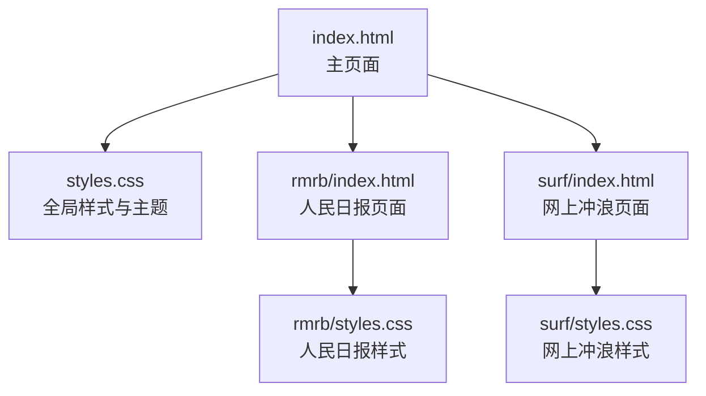
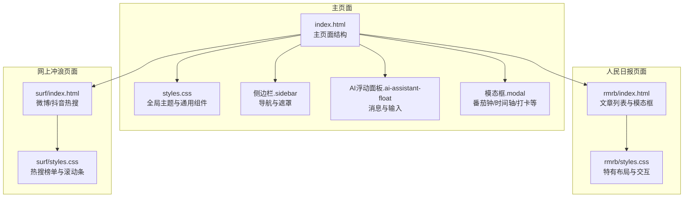
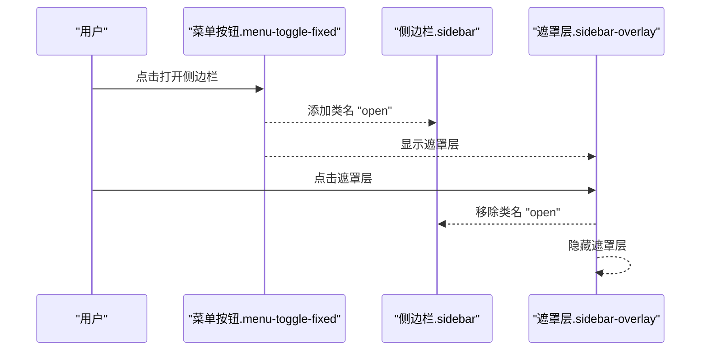
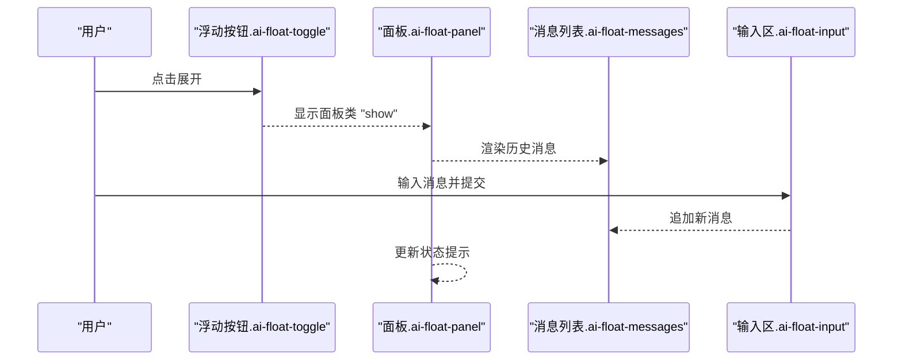
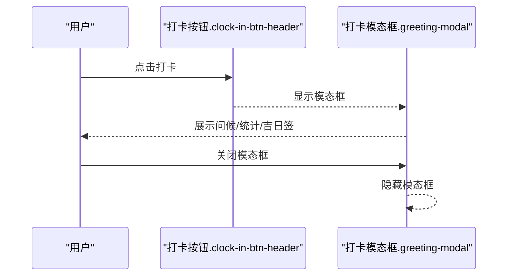
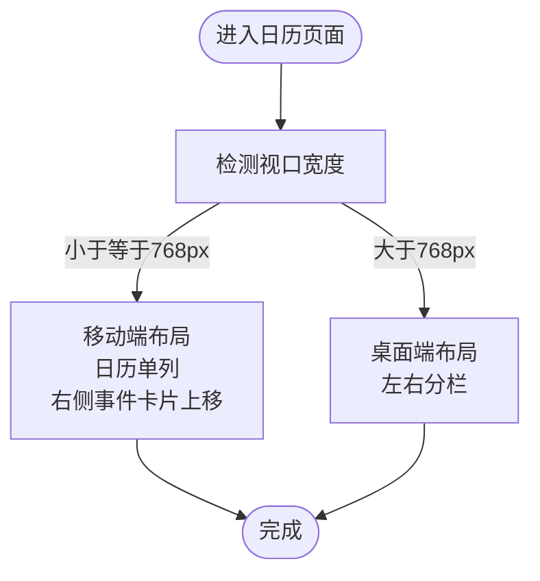
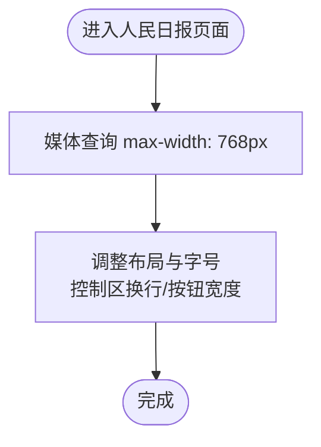
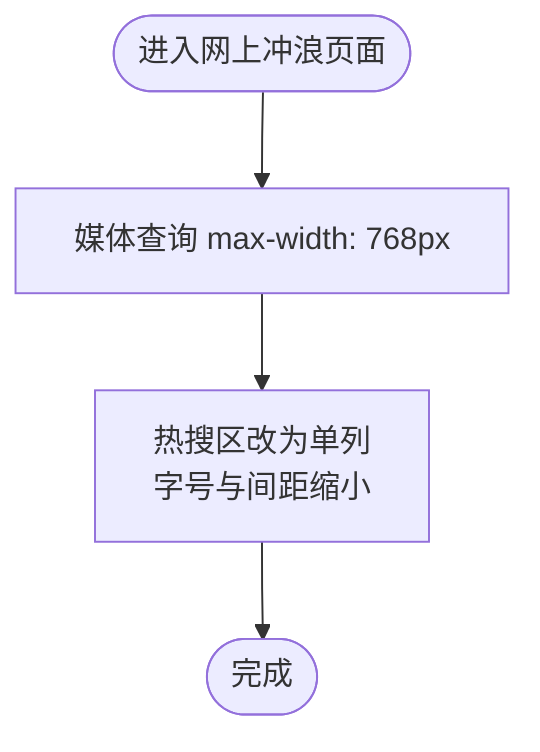
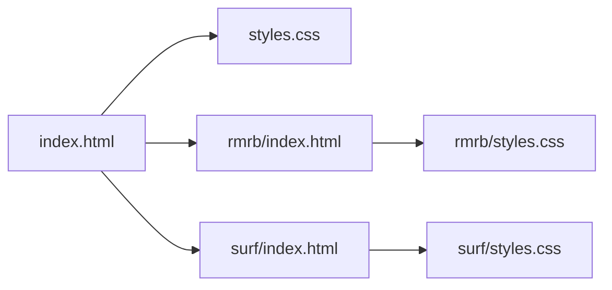

# CSS样式体系

<cite>
**本文引用的文件**
- [styles.css](file://styles.css)
- [index.html](file://index.html)
- [rmrb/styles.css](file://rmrb/styles.css)
- [rmrb/index.html](file://rmrb/index.html)
- [surf/styles.css](file://surf/styles.css)
- [surf/index.html](file://surf/index.html)
</cite>

## 目录
1. [引言](#引言)
2. [项目结构与样式组织](#项目结构与样式组织)
3. [核心组件与样式设计原则](#核心组件与样式设计原则)
4. [架构总览](#架构总览)
5. [详细组件分析](#详细组件分析)
6. [依赖关系分析](#依赖关系分析)
7. [性能与可维护性考量](#性能与可维护性考量)
8. [故障排查指南](#故障排查指南)
9. [结论](#结论)

## 引言
本文件系统梳理 work-timer 的 CSS 样式体系，重点阐述：
- 全局主题系统（CSS 自定义属性）的设计与应用
- 响应式布局策略与媒体查询实践
- 组件级样式组织与命名规范（类名语义化）
- 关键组件（侧边栏、打卡按钮、弹窗、日历、AI 助手浮动面板等）的实现要点
- 视觉特效容器布局与动画的实现方式
- 如何通过 CSS 实现主题切换与移动端适配

## 项目结构与样式组织
work-timer 的样式由主样式表与子页面样式表共同构成：
- 主样式表负责全局主题、通用布局与跨页面共享的组件样式
- 子页面样式表（人民日报、网上冲浪）负责各自页面的特有布局与交互

图表来源
- [index.html](file://index.html#L1-L120)
- [styles.css](file://styles.css#L1-L120)
- [rmrb/index.html](file://rmrb/index.html#L1-L62)
- [rmrb/styles.css](file://rmrb/styles.css#L1-L120)
- [surf/index.html](file://surf/index.html#L1-L54)
- [surf/styles.css](file://surf/styles.css#L1-L60)

章节来源
- [index.html](file://index.html#L1-L120)
- [styles.css](file://styles.css#L1-L120)
- [rmrb/index.html](file://rmrb/index.html#L1-L62)
- [rmrb/styles.css](file://rmrb/styles.css#L1-L120)
- [surf/index.html](file://surf/index.html#L1-L54)
- [surf/styles.css](file://surf/styles.css#L1-L60)

## 核心组件与样式设计原则
- 全局主题系统
  - 使用 CSS 自定义属性集中管理主色、次色、强调色、背景、文本、圆角、阴影、过渡等变量，统一主题风格与便于切换
  - 示例路径：[全局变量定义](file://styles.css#L1-L16)
- 布局与容器
  - 采用 Flex/Grid 混合布局，容器类统一宽度与内边距，确保内容区在桌面与移动设备上均具可读性
  - 示例路径：[容器与头部布局](file://styles.css#L368-L420)
- 组件命名与语义化
  - 类名采用“功能+层级”的语义化命名，如 .sidebar、.ai-float-panel、.modal-content 等，避免过度 BEM 层级，保证可读性与可维护性
  - 示例路径：[侧边栏与浮动面板](file://styles.css#L32-L170)
- 动画与过渡
  - 使用统一的过渡变量与关键帧动画，提升交互体验的一致性
  - 示例路径：[浮动动画与旋转加载](file://styles.css#L148-L152), [spin 动画](file://styles.css#L2188-L2190)

章节来源
- [styles.css](file://styles.css#L1-L120)
- [styles.css](file://styles.css#L368-L420)
- [styles.css](file://styles.css#L148-L152)
- [styles.css](file://styles.css#L2188-L2190)

## 架构总览
下图展示主页面与子页面的样式组织关系及关键组件交互。

图表来源
- [index.html](file://index.html#L1-L120)
- [styles.css](file://styles.css#L1-L200)
- [rmrb/index.html](file://rmrb/index.html#L1-L62)
- [rmrb/styles.css](file://rmrb/styles.css#L1-L120)
- [surf/index.html](file://surf/index.html#L1-L54)
- [surf/styles.css](file://surf/styles.css#L1-L60)

## 详细组件分析

### 侧边栏与遮罩
- 设计要点
  - 固定定位的抽屉式侧边栏，通过类名切换控制显隐；遮罩层用于点击外部关闭
  - 使用统一的圆角、阴影与过渡变量，保证视觉一致性
- 关键类名与路径
  - 侧边栏容器与显隐类：[侧边栏基础与 open 类](file://styles.css#L32-L51)
  - 侧边栏头部与导航项：[侧边栏头部与导航项](file://styles.css#L52-L116)
  - 遮罩层显隐类：[遮罩层 show 类](file://styles.css#L321-L338)
- 交互流程（序列图）

图表来源
- [index.html](file://index.html#L1-L120)
- [styles.css](file://styles.css#L32-L51)
- [styles.css](file://styles.css#L321-L338)

章节来源
- [styles.css](file://styles.css#L32-L116)
- [styles.css](file://styles.css#L321-L338)
- [index.html](file://index.html#L1-L120)

### AI 助手浮动面板
- 设计要点
  - 右下角悬浮按钮，点击展开消息面板；面板包含消息列表、状态提示与输入区
  - 使用统一的圆角、阴影与过渡变量，输入框聚焦态高亮主题色
- 关键类名与路径
  - 悬浮按钮与面板：[浮动按钮与面板](file://styles.css#L118-L170)
  - 消息列表与输入区：[消息与输入](file://styles.css#L202-L319)
  - 状态提示（成功/错误/信息）：[状态类](file://styles.css#L249-L276)
- 交互流程（序列图）

图表来源
- [index.html](file://index.html#L1-L120)
- [styles.css](file://styles.css#L118-L170)
- [styles.css](file://styles.css#L202-L319)

章节来源
- [styles.css](file://styles.css#L118-L170)
- [styles.css](file://styles.css#L202-L319)
- [index.html](file://index.html#L1-L120)

### 打卡按钮与模态框
- 设计要点
  - 头部打卡按钮采用渐变背景与阴影，悬停与按下态提供反馈
  - 模态框统一尺寸、圆角与阴影，标题与关闭按钮清晰
- 关键类名与路径
  - 打卡按钮：[打卡按钮样式](file://styles.css#L1569-L1591)
  - 模态框与内容：[模态框基础](file://styles.css#L1277-L1303), [模态框内容](file://styles.css#L1391-L1427)
- 交互流程（序列图）

图表来源
- [index.html](file://index.html#L1-L120)
- [styles.css](file://styles.css#L1569-L1591)
- [styles.css](file://styles.css#L1277-L1303)

章节来源
- [styles.css](file://styles.css#L1569-L1591)
- [styles.css](file://styles.css#L1277-L1303)
- [index.html](file://index.html#L1-L120)

### 日历页面与事件卡片
- 设计要点
  - 左右分栏布局，日历网格与事件添加/列表卡片配合使用
  - 日期格子按工作日/周末/调休/节假日等状态着色，图例清晰
- 关键类名与路径
  - 页面布局与左右分栏：[日历页面布局](file://styles.css#L529-L556)
  - 日历容器与网格：[日历容器与网格](file://styles.css#L557-L647)
  - 图例与事件标记：[图例与事件标记](file://styles.css#L661-L696)
  - 事件卡片与表单：[事件卡片与表单](file://styles.css#L698-L770)
- 响应式适配（流程图）

图表来源
- [styles.css](file://styles.css#L1219-L1275)
- [styles.css](file://styles.css#L1838-L1894)

章节来源
- [styles.css](file://styles.css#L529-L696)
- [styles.css](file://styles.css#L1219-L1275)
- [styles.css](file://styles.css#L1838-L1894)

### 人民日报页面
- 设计要点
  - 顶部控制区包含日期选择与刷新/分析按钮；文章列表采用悬停与左侧色块标识
  - 文章阅读与 AI 分析模态框具备统一的头部、关闭按钮与内容区
- 关键类名与路径
  - 控制区与按钮：[控制区与按钮](file://rmrb/styles.css#L28-L80)
  - 文章列表与项：[文章列表与项](file://rmrb/styles.css#L116-L173)
  - 模态框与 AI 分析：[模态框与 AI 分析](file://rmrb/styles.css#L175-L256)
- 响应式适配（媒体查询）

图表来源
- [rmrb/styles.css](file://rmrb/styles.css#L315-L352)

章节来源
- [rmrb/styles.css](file://rmrb/styles.css#L28-L80)
- [rmrb/styles.css](file://rmrb/styles.css#L116-L173)
- [rmrb/styles.css](file://rmrb/styles.css#L175-L256)
- [rmrb/styles.css](file://rmrb/styles.css#L315-L352)

### 网上冲浪页面
- 设计要点
  - 热搜榜单采用网格布局，支持自定义滚动条与悬停效果
  - 移动端单列布局，字号与间距适配小屏
- 关键类名与路径
  - 主体布局与热搜区：[主体布局](file://surf/styles.css#L33-L60)
  - 刷新按钮与加载容器：[按钮与加载](file://surf/styles.css#L68-L119)
  - 滚动条定制：[滚动条样式](file://surf/styles.css#L127-L145)
- 响应式适配（媒体查询）

图表来源
- [surf/styles.css](file://surf/styles.css#L220-L261)

章节来源
- [surf/styles.css](file://surf/styles.css#L33-L60)
- [surf/styles.css](file://surf/styles.css#L68-L119)
- [surf/styles.css](file://surf/styles.css#L127-L145)
- [surf/styles.css](file://surf/styles.css#L220-L261)

## 依赖关系分析
- 主样式依赖
  - 主页面通过 link 引入全局样式，子页面分别引入自身样式与主样式以复用主题变量
- 组件耦合
  - 侧边栏与遮罩层存在显隐联动；AI 浮动面板与输入区存在消息追加逻辑；模态框与内部内容区存在统一尺寸约束
- 媒体查询依赖
  - 主样式与子样式均包含媒体查询，确保在不同设备上的可用性

图表来源
- [index.html](file://index.html#L1-L120)
- [styles.css](file://styles.css#L1-L120)
- [rmrb/index.html](file://rmrb/index.html#L1-L62)
- [rmrb/styles.css](file://rmrb/styles.css#L1-L120)
- [surf/index.html](file://surf/index.html#L1-L54)
- [surf/styles.css](file://surf/styles.css#L1-L60)

章节来源
- [index.html](file://index.html#L1-L120)
- [styles.css](file://styles.css#L1-L120)
- [rmrb/index.html](file://rmrb/index.html#L1-L62)
- [rmrb/styles.css](file://rmrb/styles.css#L1-L120)
- [surf/index.html](file://surf/index.html#L1-L54)
- [surf/styles.css](file://surf/styles.css#L1-L60)

## 性能与可维护性考量
- 主题变量集中管理
  - 通过 CSS 自定义属性统一主题色与尺寸，减少重复定义，便于主题切换与品牌升级
  - 示例路径：[主题变量](file://styles.css#L1-L16)
- 布局与动画
  - 使用统一过渡变量与关键帧动画，减少重复代码，提升一致性
  - 示例路径：[过渡变量](file://styles.css#L15-L16), [旋转动画](file://styles.css#L2188-L2190)
- 响应式策略
  - 在主样式与子样式中均设置媒体查询，确保移动端体验一致
  - 示例路径：[主样式移动端适配](file://styles.css#L1086-L1275), [人民日报移动端适配](file://rmrb/styles.css#L315-L352), [网上冲浪移动端适配](file://surf/styles.css#L220-L261)
- 可维护性建议
  - 对于复杂组件（如日历），建议进一步拆分样式文件，或在主样式中增加注释分段，明确各区块职责
  - 对于命名，建议在团队内约定“功能前缀+语义化后缀”，减少歧义

章节来源
- [styles.css](file://styles.css#L1-L16)
- [styles.css](file://styles.css#L1086-L1275)
- [rmrb/styles.css](file://rmrb/styles.css#L315-L352)
- [surf/styles.css](file://surf/styles.css#L220-L261)

## 故障排查指南
- 侧边栏无法关闭
  - 检查是否正确添加/移除 .open 类，以及遮罩层是否显示
  - 参考路径：[侧边栏显隐类](file://styles.css#L32-L51), [遮罩层显隐类](file://styles.css#L321-L338)
- AI 浮动面板消息不显示
  - 检查面板是否显示（.show），消息列表是否渲染，输入框是否聚焦高亮
  - 参考路径：[面板与消息](file://styles.css#L118-L170), [消息与输入](file://styles.css#L202-L319)
- 模态框尺寸异常
  - 检查 .modal-content 是否在目标视口下生效，必要时调整最大宽度或内边距
  - 参考路径：[模态框基础](file://styles.css#L1277-L1303), [模态框内容](file://styles.css#L1391-L1427)
- 日历日期格子样式错乱
  - 检查 .calendar-day 的 hover/active/today 状态类是否正确应用
  - 参考路径：[日历网格与状态](file://styles.css#L605-L647)
- 移动端布局未生效
  - 检查媒体查询断点与相关布局类是否覆盖到目标元素
  - 参考路径：[主样式移动端适配](file://styles.css#L1086-L1275), [子样式移动端适配](file://rmrb/styles.css#L315-L352), [surf 移动端适配](file://surf/styles.css#L220-L261)

章节来源
- [styles.css](file://styles.css#L32-L51)
- [styles.css](file://styles.css#L118-L170)
- [styles.css](file://styles.css#L1277-L1303)
- [styles.css](file://styles.css#L605-L647)
- [styles.css](file://styles.css#L1086-L1275)
- [rmrb/styles.css](file://rmrb/styles.css#L315-L352)
- [surf/styles.css](file://surf/styles.css#L220-L261)

## 结论
work-timer 的 CSS 样式体系以全局主题变量为核心，结合 Flex/Grid 布局与统一的过渡/动画变量，实现了跨页面一致的视觉风格与良好的交互体验。侧边栏、AI 浮动面板、模态框、日历与子页面等关键组件均采用语义化类名与清晰的结构划分，辅以媒体查询保障移动端适配。建议在后续迭代中进一步细化命名规范与样式拆分，以增强可维护性与扩展性。