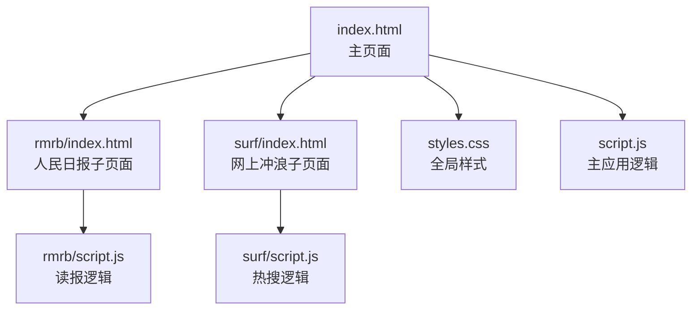
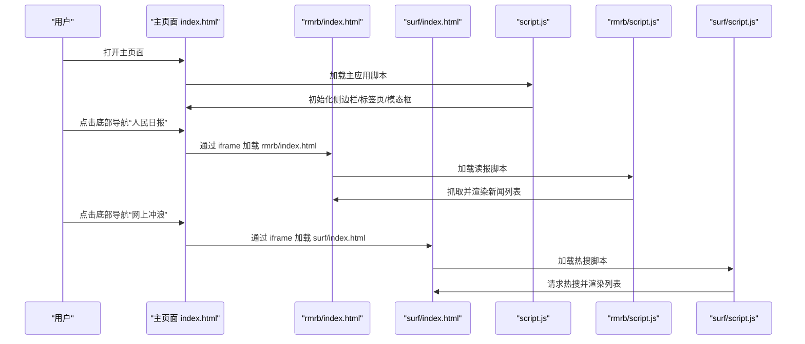
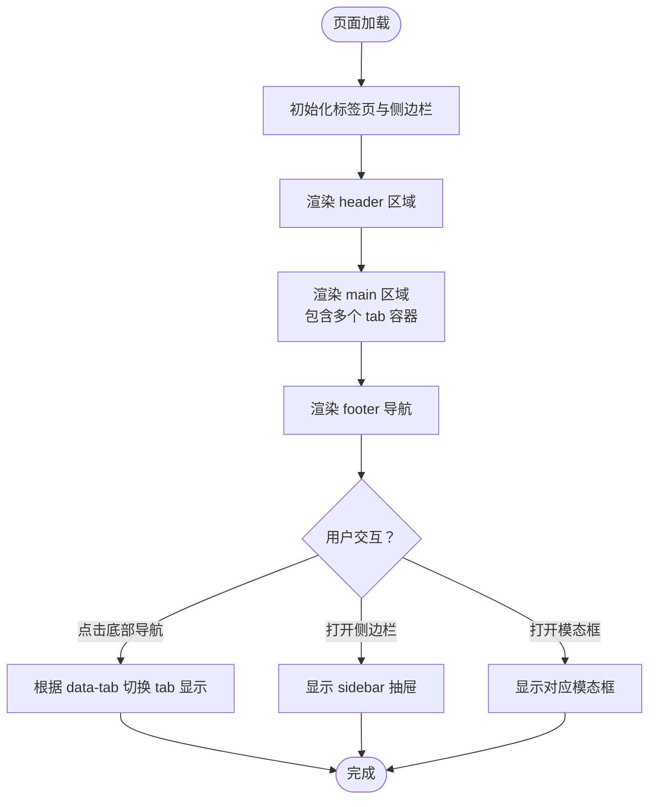
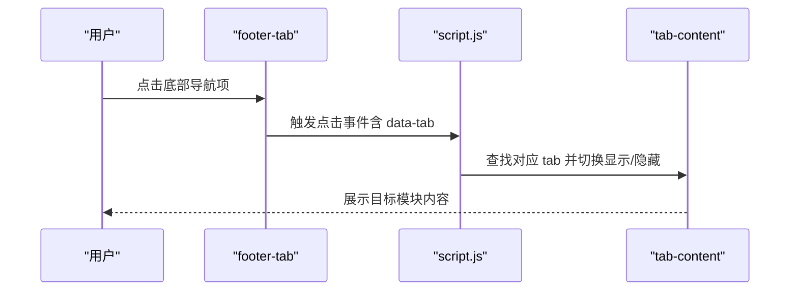
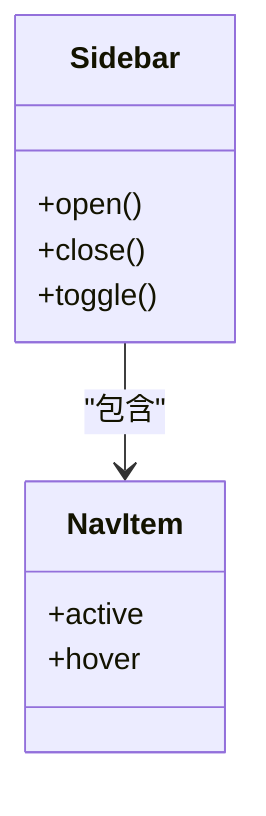
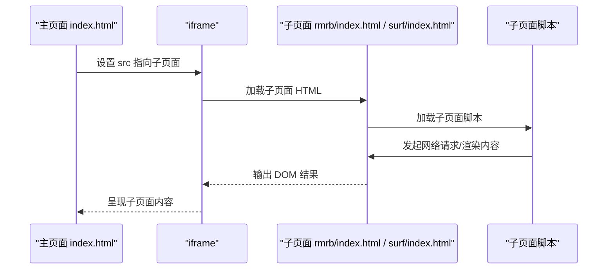
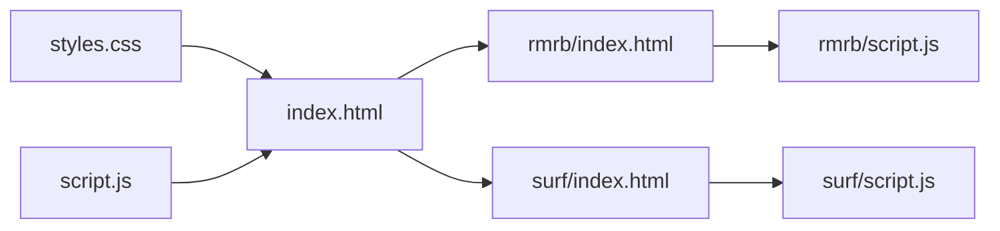

# HTML结构

<cite>
**本文引用的文件**
- [index.html](file://index.html)
- [styles.css](file://styles.css)
- [script.js](file://script.js)
- [README.md](file://README.md)
- [rmrb/index.html](file://rmrb/index.html)
- [rmrb/script.js](file://rmrb/script.js)
- [surf/index.html](file://surf/index.html)
- [surf/script.js](file://surf/script.js)
</cite>

## 目录
1. [引言](#引言)
2. [项目结构](#项目结构)
3. [核心组件](#核心组件)
4. [架构总览](#架构总览)
5. [详细组件分析](#详细组件分析)
6. [依赖关系分析](#依赖关系分析)
7. [性能考量](#性能考量)
8. [故障排查指南](#故障排查指南)
9. [结论](#结论)
10. [附录](#附录)

## 引言
本文件聚焦于 work-timer 的 HTML 结构设计，系统性说明主页面（index.html）的语义化布局、移动端底部导航栏、侧边栏菜单、以及 rmrb/surf 子页面通过 iframe 集成外部内容的方式。同时对页面可访问性（ARIA 标签与语义化元素）进行说明，并给出关键 HTML 结构片段的路径与与 CSS/JavaScript 的交互关系，帮助读者快速理解整体架构与实现要点。

## 项目结构
work-timer 采用“主页面 + 子页面 iframe”的轻量级前端组织方式：
- 主页面 index.html 负责全局布局、导航、模态框、AI 助手悬浮窗、侧边栏抽屉等。
- 子页面 rmrb/index.html 与 surf/index.html 分别通过 iframe 嵌入到主页面的对应 tab 中，实现内容隔离与独立脚本。
- README.md 对产品结构与移动端底部导航进行了概述，便于理解页面职责划分。

图表来源
- [index.html](file://index.html#L1-L485)
- [rmrb/index.html](file://rmrb/index.html#L1-L62)
- [surf/index.html](file://surf/index.html#L1-L54)
- [styles.css](file://styles.css#L1-L200)
- [script.js](file://script.js#L1-L200)
- [rmrb/script.js](file://rmrb/script.js#L1-L200)
- [surf/script.js](file://surf/script.js#L1-L200)

章节来源
- [README.md](file://README.md#L67-L96)
- [index.html](file://index.html#L1-L485)

## 核心组件
- 语义化头部区 header：包含标题、副标题、今日留言条、打卡按钮与当前时间显示，用于提供页面核心信息与入口。
- 主体区 main：包含多个 tab 内容容器（倒计时、日历、rmrb、surf、设置），通过类名与 id 控制显示/隐藏。
- 底部导航 footer：移动端快速切换各模块的导航条，配合主页面脚本实现 tab 切换。
- 侧边栏抽屉 sidebar：移动端菜单入口，包含导航项与关闭按钮，通过类名控制开合。
- AI 助手悬浮窗：右侧浮动面板，支持展开/收起与消息交互。
- 模态框体系：倒计时、打卡问候、时间轴、设置等多处模态框，均通过 id 与类名控制显示/隐藏。
- 子页面 iframe：rmrb 与 surf 通过 iframe 集成外部内容，各自维护独立的样式与脚本。

章节来源
- [index.html](file://index.html#L68-L480)
- [styles.css](file://styles.css#L32-L116)
- [styles.css](file://styles.css#L118-L200)
- [script.js](file://script.js#L94-L155)

## 架构总览
下图展示了主页面与子页面的结构关系与交互路径，突出 iframe 集成与脚本加载顺序。

图表来源
- [index.html](file://index.html#L352-L358)
- [rmrb/index.html](file://rmrb/index.html#L1-L62)
- [surf/index.html](file://surf/index.html#L1-L54)
- [script.js](file://script.js#L94-L155)
- [rmrb/script.js](file://rmrb/script.js#L1-L200)
- [surf/script.js](file://surf/script.js#L1-L200)

## 详细组件分析

### 主页面语义化布局（header/main/footer）
- 头部 header
  - 结构要点：标题、副标题、今日留言条容器、打卡按钮、当前时间显示。
  - 作用定位：提供页面核心信息与入口，承载打卡与时间展示。
  - 关键片段路径：[header 区域](file://index.html#L71-L87)
- 主体 main
  - 结构要点：多个 tab 容器（id 为 countdown、calendar、rmrb、surf、settings），每个容器内含具体功能区块。
  - 作用定位：承载倒计时、日历、读报、热搜、设置等功能。
  - 关键片段路径：[main 区域](file://index.html#L225-L461)
- 底部导航 footer
  - 结构要点：footer-tabs 容器，包含多个 footer-tab（data-tab 属性指向对应 tab）。
  - 作用定位：移动端快速切换模块，配合脚本实现 tab 切换。
  - 关键片段路径：[footer 导航](file://index.html#L463-L479)

图表来源
- [index.html](file://index.html#L225-L480)
- [script.js](file://script.js#L94-L155)

章节来源
- [index.html](file://index.html#L71-L480)
- [script.js](file://script.js#L94-L155)

### 移动端底部导航栏
- 结构组成：footer-tabs 容器内包含若干 footer-tab，每个 footer-tab 具备 data-tab 属性，用于与主页面 tab 内容关联。
- 交互机制：footer-tab 点击事件由主页面脚本绑定，通过 data-tab 定位对应 tab 并切换显示。
- 关键片段路径：[底部导航结构](file://index.html#L463-L479)

图表来源
- [index.html](file://index.html#L463-L479)
- [script.js](file://script.js#L94-L155)

章节来源
- [index.html](file://index.html#L463-L479)
- [script.js](file://script.js#L94-L155)

### 侧边栏菜单（抽屉式导航）
- 结构组成：sidebar 容器包含 sidebar-header（菜单标题与关闭按钮）、sidebar-nav（导航项列表）。
- 行为特征：通过类名控制开合（例如 open 类），关闭按钮与遮罩层协同实现交互。
- 关键片段路径：[侧边栏结构](file://index.html#L13-L46)，[侧边栏样式](file://styles.css#L32-L116)

图表来源
- [index.html](file://index.html#L13-L46)
- [styles.css](file://styles.css#L32-L116)

章节来源
- [index.html](file://index.html#L13-L46)
- [styles.css](file://styles.css#L32-L116)

### 子页面通过 iframe 集成外部内容
- rmrb 子页面
  - 结构要点：header（标题、日期选择、刷新与 AI 读报按钮）、main（文章列表）、模态框（文章详情与 AI 分析）。
  - 集成方式：主页面在 id 为 rmrb 的 tab 内放置 iframe，src 指向 rmrb/index.html。
  - 关键片段路径：[主页面 rmrb iframe](file://index.html#L352-L354)，[rmrb 页面结构](file://rmrb/index.html#L1-L62)
- surf 子页面
  - 结构要点：header（标题、副标题）、main（微博热搜与抖音热搜两块区域）、刷新按钮。
  - 集成方式：主页面在 id 为 surf 的 tab 内放置 iframe，src 指向 surf/index.html。
  - 关键片段路径：[主页面 surf iframe](file://index.html#L356-L358)，[surf 页面结构](file://surf/index.html#L1-L54)

图表来源
- [index.html](file://index.html#L352-L358)
- [rmrb/index.html](file://rmrb/index.html#L1-L62)
- [surf/index.html](file://surf/index.html#L1-L54)
- [rmrb/script.js](file://rmrb/script.js#L1-L200)
- [surf/script.js](file://surf/script.js#L1-L200)

章节来源
- [index.html](file://index.html#L352-L358)
- [rmrb/index.html](file://rmrb/index.html#L1-L62)
- [surf/index.html](file://surf/index.html#L1-L54)
- [rmrb/script.js](file://rmrb/script.js#L1-L200)
- [surf/script.js](file://surf/script.js#L1-L200)

### 页面可访问性设计
- 语义化元素使用
  - 使用 header、main、footer 等语义化标签划分页面结构，提升可读性与可解析性。
  - 使用 nav、a、button 等元素表达导航与交互意图。
- ARIA 标签现状
  - 经扫描未发现显式的 aria-* 或 role 属性使用。若需进一步增强可访问性，可在以下位置补充：
    - 导航项与按钮：补充 aria-label 或 aria-expanded 等属性，指示状态与用途。
    - 模态框：补充 role="dialog"、aria-modal="true"、aria-labelledby 等，确保键盘可达与屏幕阅读器友好。
    - 侧边栏：补充 aria-hidden 与 aria-labelledby，控制可见性与标题关联。
- 建议实践
  - 为交互元素提供可读的文本标签与键盘操作支持。
  - 为动态内容更新提供 aria-live 区域，及时播报状态变化。
  - 为图片与图标提供 alt 或隐藏文本，确保非视觉用户理解含义。

章节来源
- [index.html](file://index.html#L71-L480)
- [rmrb/index.html](file://rmrb/index.html#L1-L62)
- [surf/index.html](file://surf/index.html#L1-L54)

## 依赖关系分析
- 主页面依赖
  - 样式：styles.css 提供全局样式与组件样式（侧边栏、AI 助手、模态框等）。
  - 脚本：script.js 负责初始化、事件绑定、模态框与 tab 切换、AI 设置等。
- 子页面依赖
  - rmrb/index.html 依赖 rmrb/script.js 实现抓取与渲染。
  - surf/index.html 依赖 surf/script.js 实现热搜数据拉取与渲染。
- 脚本加载顺序
  - 主页面先加载主脚本，再加载子页面脚本；子页面内部脚本负责发起网络请求与 DOM 更新。

图表来源
- [index.html](file://index.html#L1-L485)
- [styles.css](file://styles.css#L1-L200)
- [script.js](file://script.js#L1-L200)
- [rmrb/index.html](file://rmrb/index.html#L1-L62)
- [rmrb/script.js](file://rmrb/script.js#L1-L200)
- [surf/index.html](file://surf/index.html#L1-L54)
- [surf/script.js](file://surf/script.js#L1-L200)

章节来源
- [index.html](file://index.html#L1-L485)
- [script.js](file://script.js#L94-L155)
- [rmrb/script.js](file://rmrb/script.js#L1-L200)
- [surf/script.js](file://surf/script.js#L1-L200)

## 性能考量
- 模态框与动画
  - 模态框与 AI 助手面板的显示/隐藏通过类名切换，避免频繁 DOM 重排，有利于性能。
- 懒加载与延迟
  - 子页面通过 iframe 懒加载，仅在用户切换到对应 tab 时加载，降低首屏压力。
- 网络请求节流
  - 子页面脚本在处理多个页面时加入延迟，避免请求过快导致限流或失败。
- 建议优化
  - 对热点区域（如热搜列表）增加虚拟滚动或分页，减少一次性渲染的节点数量。
  - 对图片与第三方资源启用懒加载与缓存策略，提升移动端体验。

章节来源
- [index.html](file://index.html#L352-L358)
- [rmrb/script.js](file://rmrb/script.js#L186-L193)
- [surf/script.js](file://surf/script.js#L1-L200)

## 故障排查指南
- 子页面无法加载
  - 检查主页面 iframe 的 src 是否正确指向子页面路径。
  - 确认子页面脚本已正确引入，且网络请求接口可用。
  - 关键片段路径：[主页面 rmrb iframe](file://index.html#L352-L354)，[主页面 surf iframe](file://index.html#L356-L358)
- 模态框不显示
  - 检查对应 id 的模态框是否存在，类名切换逻辑是否生效。
  - 关键片段路径：[模态框结构与触发](file://index.html#L90-L121)
- 侧边栏无法关闭
  - 检查关闭按钮事件绑定与遮罩层交互逻辑。
  - 关键片段路径：[侧边栏结构与关闭按钮](file://index.html#L13-L46)
- 热搜数据为空
  - 检查 API 返回格式与错误提示逻辑，确认网络状态与跨域代理配置。
  - 关键片段路径：[热搜加载与错误处理](file://surf/script.js#L25-L87)

章节来源
- [index.html](file://index.html#L90-L121)
- [index.html](file://index.html#L13-L46)
- [surf/script.js](file://surf/script.js#L25-L87)

## 结论
work-timer 的 HTML 结构以语义化标签为基础，结合主页面与子页面的 iframe 集成，实现了清晰的功能分区与良好的移动端体验。通过脚本驱动的模态框、侧边栏与底部导航，页面具备强交互性与可扩展性。建议后续在可访问性方面补充 ARIA 属性与键盘支持，进一步提升包容性与用户体验。

## 附录
- 关键 HTML 结构片段路径
  - [header 区域](file://index.html#L71-L87)
  - [main 区域（含多个 tab）](file://index.html#L225-L461)
  - [footer 导航](file://index.html#L463-L479)
  - [侧边栏结构](file://index.html#L13-L46)
  - [rmrb 页面结构](file://rmrb/index.html#L1-L62)
  - [surf 页面结构](file://surf/index.html#L1-L54)
- 样式与脚本参考
  - [全局样式（侧边栏/悬浮窗/模态框）](file://styles.css#L32-L200)
  - [主应用初始化与事件绑定](file://script.js#L94-L155)
  - [rmrb 读报逻辑](file://rmrb/script.js#L1-L200)
  - [surf 热搜逻辑](file://surf/script.js#L1-L200)